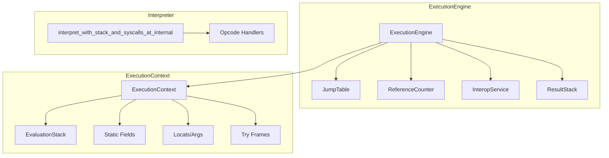
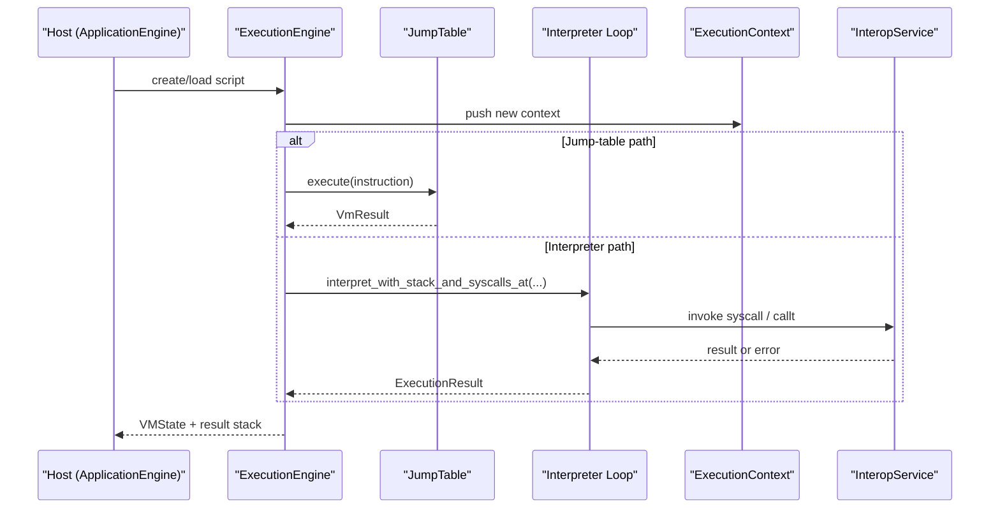
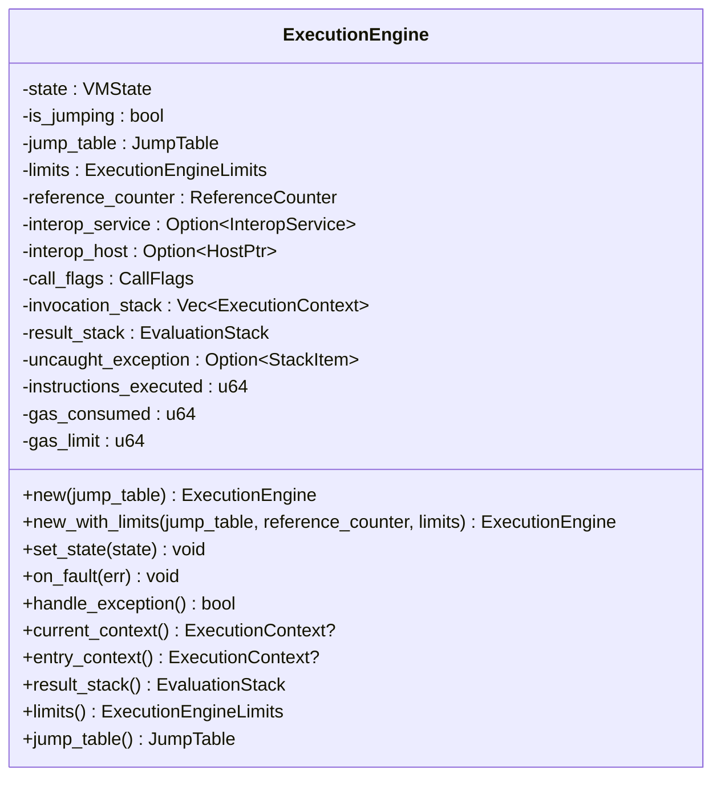
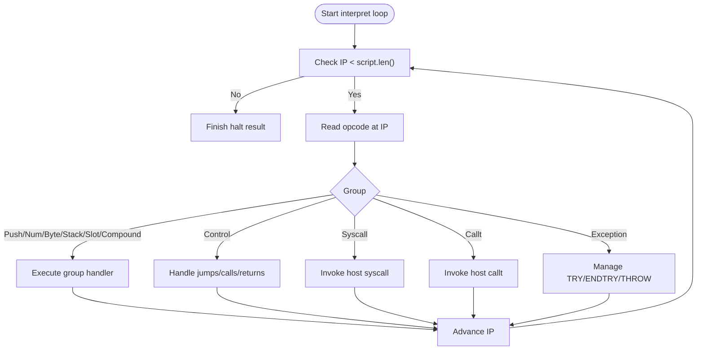
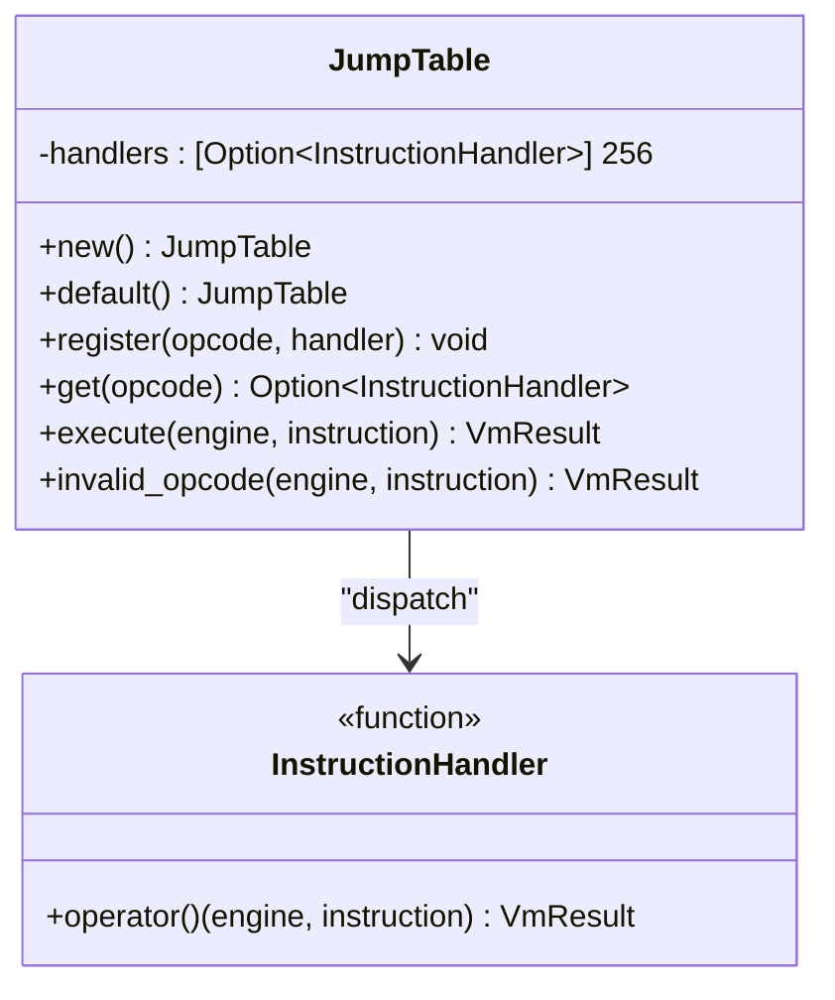
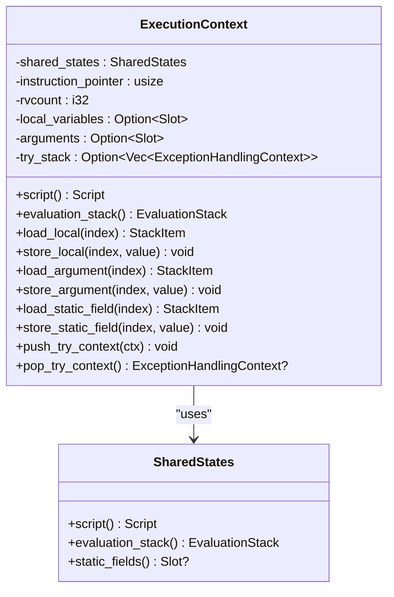
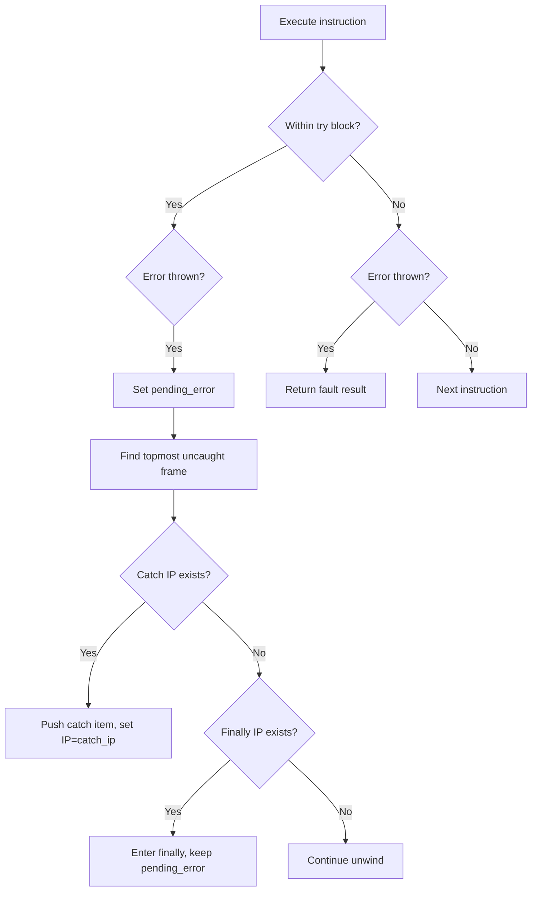
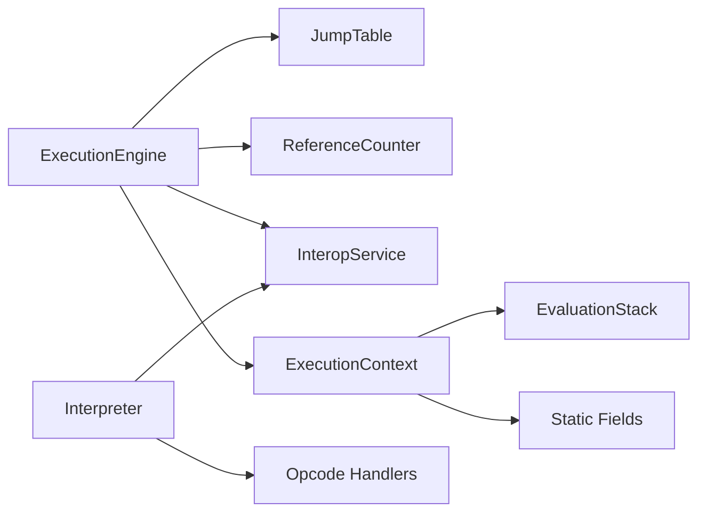

# Neo Virtual Machine

<cite>
**Referenced Files in This Document**
- [lib.rs](file://neo-vm/src/lib.rs)
- [execution_engine/mod.rs](file://neo-vm/src/execution_engine/mod.rs)
- [execution_engine/core.rs](file://neo-vm/src/execution_engine/core.rs)
- [jump_table/mod.rs](file://neo-vm/src/jump_table/mod.rs)
- [interpreter/mod.rs](file://neo-vm/src/interpreter/mod.rs)
- [interpreter/executor/mod.rs](file://neo-vm/src/interpreter/executor/mod.rs)
- [execution_context/context.rs](file://neo-vm/src/execution_context/context.rs)
</cite>

## Table of Contents
1. Introduction
2. Project Structure
3. Core Components
4. Architecture Overview
5. Detailed Component Analysis
6. Dependency Analysis
7. Performance Considerations
8. Troubleshooting Guide
9. Conclusion
10. Appendices

## Introduction
This document explains the Neo Virtual Machine (NeoVM) implementation in neo-rs, focusing on the execution engine, interpreter, and jump table mechanisms. It covers opcode execution flow, stack operations, memory management, gas metering, resource limits, exception handling, execution context, storage access, interop services, contract deployment and invocation patterns, native integration, examples of bytecode execution, debugging techniques, performance optimization strategies, and common pitfalls for smart contract development.

## Project Structure
The NeoVM crate is organized into layered modules:
- Execution engine: orchestrates the VM lifecycle, state, and resources
- Interpreter: canonical instruction loop and ABI-level semantics
- Jump table: stateful dispatch adapters over vendored VM semantics
- Execution context: per-call-frame state including script, stacks, locals, arguments, static fields, and try frames
- Supporting modules: evaluation stack, reference counting, interop service, scripts, serialization, RPC JSON, storage context

**Diagram sources**
- [execution_engine/mod.rs:195-242](file://neo-vm/src/execution_engine/mod.rs#L195-L242)
- [execution_engine/core.rs:11-45](file://neo-vm/src/execution_engine/core.rs#L11-L45)
- [jump_table/mod.rs:34-183](file://neo-vm/src/jump_table/mod.rs#L34-L183)
- [interpreter/executor/mod.rs:24-761](file://neo-vm/src/interpreter/executor/mod.rs#L24-L761)
- [execution_context/context.rs:25-45](file://neo-vm/src/execution_context/context.rs#L25-L45)

**Section sources**
- [lib.rs:6-107](file://neo-vm/src/lib.rs#L6-L107)
- [execution_engine/mod.rs:1-74](file://neo-vm/src/execution_engine/mod.rs#L1-L74)

## Core Components
- ExecutionEngine: owns VM state, invocation stack, result stack, gas accounting, limits, interop host/service, and jump table; provides fault handling and call flags.
- ExecutionContext: represents a call frame with instruction pointer, shared script/evaluation stack/static fields, local variables, arguments, and try frames.
- JumpTable: fixed-size array mapping opcodes to handlers; registers default handlers by category and executes instructions via dispatch.
- Interpreter: canonical instruction loop that reads bytes, decodes opcodes, updates IP, handles control flow, syscalls, CALLT, exceptions, and returns results.
- EvaluationStack: type-safe operand stack used by contexts and engine.
- ReferenceCounter: tracks compound item references for GC-like cleanup without pauses.
- InteropService: registry for SYSCALL methods exposed to contracts.

Key responsibilities and interactions are defined across these modules and re-exported from the crate root.

**Section sources**
- [execution_engine/mod.rs:195-242](file://neo-vm/src/execution_engine/mod.rs#L195-L242)
- [execution_engine/core.rs:11-45](file://neo-vm/src/execution_engine/core.rs#L11-L45)
- [execution_context/context.rs:25-45](file://neo-vm/src/execution_context/context.rs#L25-L45)
- [jump_table/mod.rs:34-183](file://neo-vm/src/jump_table/mod.rs#L34-L183)
- [interpreter/executor/mod.rs:24-761](file://neo-vm/src/interpreter/executor/mod.rs#L24-L761)
- [lib.rs:142-309](file://neo-vm/src/lib.rs#L142-L309)

## Architecture Overview
NeoVM follows an adapter-oriented architecture where canonical opcode metadata and ABI-level behavior live in the interpreter and vendored core, while the stateful host surface (engine, context, jump table) integrates with neo-core. The execution engine drives the interpreter or jump-table-based execution depending on the path, manages the invocation stack, and enforces resource limits and gas consumption.

**Diagram sources**
- [execution_engine/mod.rs:195-242](file://neo-vm/src/execution_engine/mod.rs#L195-L242)
- [jump_table/mod.rs:133-152](file://neo-vm/src/jump_table/mod.rs#L133-L152)
- [interpreter/executor/mod.rs:24-761](file://neo-vm/src/interpreter/executor/mod.rs#L24-L761)
- [execution_context/context.rs:25-45](file://neo-vm/src/execution_context/context.rs#L25-L45)

## Detailed Component Analysis

### Execution Engine
Responsibilities:
- Lifecycle: construction, state transitions, fault handling, uncaught exception tracking
- Invocation stack: push/pop contexts for calls and returns
- Resource limits: configurable limits and gas limit/gas consumed counters
- Interop bridge: optional host callbacks and interop service for SYSCALL
- Call flags: effective permissions for current execution

Key behaviors:
- Default gas limit constant and counters for precise metering
- Fault path sets FAULT state and captures message into uncaught exception
- Accessors for current/entry context, result stack, jump table, and limits

**Diagram sources**
- [execution_engine/mod.rs:195-242](file://neo-vm/src/execution_engine/mod.rs#L195-L242)
- [execution_engine/core.rs:11-45](file://neo-vm/src/execution_engine/core.rs#L11-L45)

**Section sources**
- [execution_engine/mod.rs:195-242](file://neo-vm/src/execution_engine/mod.rs#L195-L242)
- [execution_engine/core.rs:11-45](file://neo-vm/src/execution_engine/core.rs#L11-L45)
- [execution_engine/core.rs:47-93](file://neo-vm/src/execution_engine/core.rs#L47-L93)

### Interpreter and Opcode Execution Flow
The interpreter implements the canonical instruction loop:
- Reads opcode at IP, validates bounds, records IP for diagnostics
- Dispatches to grouped handlers (push, numeric, byte, stack, slot, compound, control)
- Handles control flow (JMP/JMPIF/JMPEQ/JMPNE/JMPGT/JMPGE/JMPLT/JMPLE), CALL/CALL_L/CALLA/RET
- Handles SYSCALL and CALLT via host provider
- Implements TRY/ENDTRY/TRY_L/ENDTRY_L/ENDFINALLY with try frames and pending exceptions
- Enforces MAX_STACK_SIZE and other safety checks
- Returns finish_halt_result or fault_result based on outcome

**Diagram sources**
- [interpreter/executor/mod.rs:24-761](file://neo-vm/src/interpreter/executor/mod.rs#L24-L761)

**Section sources**
- [interpreter/executor/mod.rs:24-761](file://neo-vm/src/interpreter/executor/mod.rs#L24-L761)

### Jump Table Mechanism
The jump table maps each opcode to a handler function:
- Fixed-size array of 256 entries for direct indexing
- Registers default handlers by category (bitwisee, compound, control, numeric, push, slot, splice, stack, types)
- Provides get/set/register APIs and safe execute(path) returning VmResult
- Invalid opcode path returns unsupported operation error

**Diagram sources**
- [jump_table/mod.rs:34-183](file://neo-vm/src/jump_table/mod.rs#L34-L183)

**Section sources**
- [jump_table/mod.rs:34-183](file://neo-vm/src/jump_table/mod.rs#L34-L183)

### Execution Context, Stacks, and Storage
ExecutionContext encapsulates a single call frame:
- Shared states: script, evaluation stack, static fields
- Per-frame: instruction pointer, rvcount, local variables, arguments, try frames
- Stack operations: push/pop/peek/insert with reference counter attachment
- Slot access: load/store for locals, arguments, and static fields
- Try stack: push/pop contexts for exception handling

Storage access is provided through StorageContext (module present in crate root). Contract storage keys/values are accessed via interop services exposed to contracts.

**Diagram sources**
- [execution_context/context.rs:25-45](file://neo-vm/src/execution_context/context.rs#L25-L45)
- [execution_context/context.rs:141-167](file://neo-vm/src/execution_context/context.rs#L141-L167)
- [execution_context/context.rs:415-519](file://neo-vm/src/execution_context/context.rs#L415-L519)

**Section sources**
- [execution_context/context.rs:25-45](file://neo-vm/src/execution_context/context.rs#L25-L45)
- [execution_context/context.rs:141-167](file://neo-vm/src/execution_context/context.rs#L141-L167)
- [execution_context/context.rs:415-519](file://neo-vm/src/execution_context/context.rs#L415-L519)

### Gas Metering, Resource Limits, and Exceptions
Gas model:
- ExecutionEngine tracks gas_consumed and gas_limit; DEFAULT_GAS_LIMIT provides a reasonable cap
- Instructions consume gas according to configuration; precise metering is enforced during execution

Resource limits:
- ExecutionEngineLimits configure constraints such as max stack depth and script size
- Interpreter enforces MAX_STACK_SIZE to prevent stack overflow

Exception handling:
- Interpreter maintains try frames and pending exceptions; THROW pushes a catch item or faults if no try frame
- ABORT/ASSERT/ABORTMSG/ASSERTMSG produce uncatchable faults
- ExecutionEngine.on_fault sets FAULT state and stores uncaught exception message

**Diagram sources**
- [interpreter/executor/mod.rs:79-142](file://neo-vm/src/interpreter/executor/mod.rs#L79-L142)
- [interpreter/executor/mod.rs:376-393](file://neo-vm/src/interpreter/executor/mod.rs#L376-L393)
- [execution_engine/core.rs:67-93](file://neo-vm/src/execution_engine/core.rs#L67-L93)

**Section sources**
- [execution_engine/mod.rs:188-191](file://neo-vm/src/execution_engine/mod.rs#L188-L191)
- [interpreter/executor/mod.rs:79-142](file://neo-vm/src/interpreter/executor/mod.rs#L79-L142)
- [interpreter/executor/mod.rs:376-393](file://neo-vm/src/interpreter/executor/mod.rs#L376-L393)
- [execution_engine/core.rs:67-93](file://neo-vm/src/execution_engine/core.rs#L67-L93)

### Interop Services and Native Contracts
- InteropService provides a registry for SYSCALL methods accessible to contracts
- Interpreter invokes host-provided syscalls via SyscallProvider; errors propagate into try handling or fault paths
- CALLT allows invoking method tokens via host callbacks

Native contracts integrate through the host’s syscall implementations, enabling storage, crypto, blockchain queries, and more.

**Section sources**
- [lib.rs:185-188](file://neo-vm/src/lib.rs#L185-L188)
- [interpreter/executor/mod.rs:258-314](file://neo-vm/src/interpreter/executor/mod.rs#L258-L314)

### Smart Contract Deployment and Invocation Patterns
- Deployment typically involves creating a script that constructs a contract manifest and bytecode, then invoking native deploy syscalls via the host
- Invocation patterns use CALL/CALL_L/CALLA to transfer control between contracts; return values are pushed onto the caller’s stack
- Result stack holds final outputs after execution completes

Examples:
- Bytecode execution: construct a simple script with PUSH/ADD/RET and run it through the engine or interpreter
- Contract calls: use CALL variants to invoke another contract’s entry point with parameters
- Native integration: call native methods via SYSCALL with appropriate hashes and arguments

**Section sources**
- [interpreter/executor/mod.rs:444-509](file://neo-vm/src/interpreter/executor/mod.rs#L444-L509)
- [interpreter/executor/mod.rs:647-699](file://neo-vm/src/interpreter/executor/mod.rs#L647-L699)

## Dependency Analysis
NeoVM depends on:
- neo-primitives for call flags and protocol constants
- neo-io for I/O abstractions
- neo-crypto for hashing utilities
- Standard library collections and concurrency primitives

Internal dependencies:
- ExecutionEngine depends on JumpTable, ReferenceCounter, InteropService, ExecutionContext, EvaluationStack
- Interpreter depends on SyscallProvider and runtime types for ABI values
- ExecutionContext depends on SharedStates and Slot for locals/args/static fields

**Diagram sources**
- [execution_engine/mod.rs:195-242](file://neo-vm/src/execution_engine/mod.rs#L195-L242)
- [execution_context/context.rs:25-45](file://neo-vm/src/execution_context/context.rs#L25-L45)
- [interpreter/executor/mod.rs:24-761](file://neo-vm/src/interpreter/executor/mod.rs#L24-L761)

**Section sources**
- [execution_engine/mod.rs:195-242](file://neo-vm/src/execution_engine/mod.rs#L195-L242)
- [execution_context/context.rs:25-45](file://neo-vm/src/execution_context/context.rs#L25-L45)
- [interpreter/executor/mod.rs:24-761](file://neo-vm/src/interpreter/executor/mod.rs#L24-L761)

## Performance Considerations
- Use the interpreter’s fast path for hot loops; avoid excessive allocations in tight loops
- Prefer compact data structures and minimize large buffer copies
- Leverage reference counting to manage compound items efficiently
- Keep try blocks minimal to reduce overhead during exception handling
- Tune gas limits and execution engine limits appropriately for workloads
- Avoid deep recursion and excessively large stacks to stay within MAX_STACK_SIZE

[No sources needed since this section provides general guidance]

## Troubleshooting Guide
Common issues and diagnostics:
- Unsupported opcode: indicates invalid or malformed bytecode; inspect the opcode and ensure correct compilation
- Stack underflow/overflow: verify operand counts before operations; respect MAX_STACK_SIZE
- Fault state: check uncaught_exception message and current instruction details for context
- Gas exhaustion: review gas consumption per operation and adjust limits or optimize logic
- Syscall errors: validate syscall hash and argument marshalling; handle errors in try blocks when appropriate

Diagnostics:
- ExecutionEngine.on_fault logs detailed context including IP and opcode
- Interpreter records last IP and result metrics for post-execution analysis

**Section sources**
- [execution_engine/core.rs:67-93](file://neo-vm/src/execution_engine/core.rs#L67-L93)
- [interpreter/executor/mod.rs:734-736](file://neo-vm/src/interpreter/executor/mod.rs#L734-L736)

## Conclusion
NeoVM provides a robust, efficient, and extensible execution environment for smart contracts. Its layered design separates canonical semantics from host-specific state, enabling precise control over execution, resource usage, and interoperability. By understanding the execution engine, interpreter, jump table, and context mechanics, developers can write performant contracts, leverage native capabilities safely, and debug effectively.

[No sources needed since this section summarizes without analyzing specific files]

## Appendices

### Quick Start Example Paths
- Constructing and executing a simple script: see example usage in crate documentation
- Invoking syscalls and handling results: refer to interpreter syscall path
- Managing try/catch/finally: consult exception handling sections

[No sources needed since this section lists conceptual references]