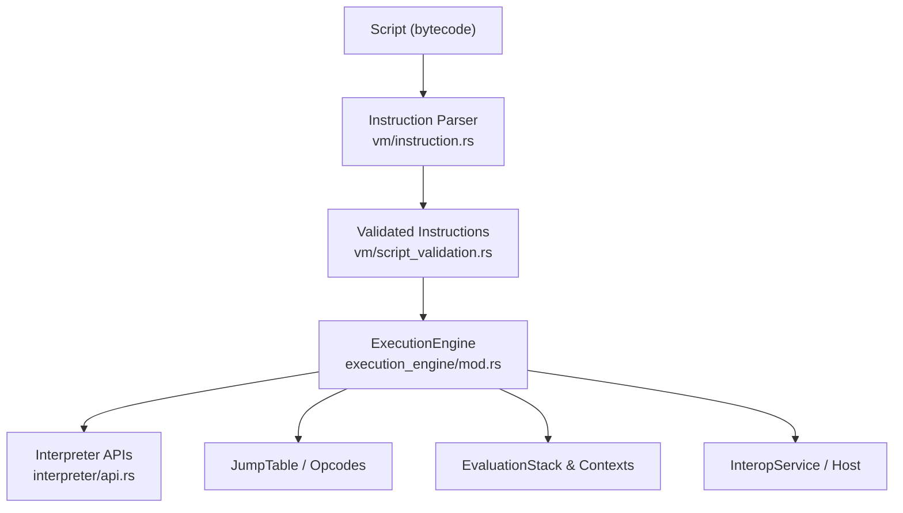
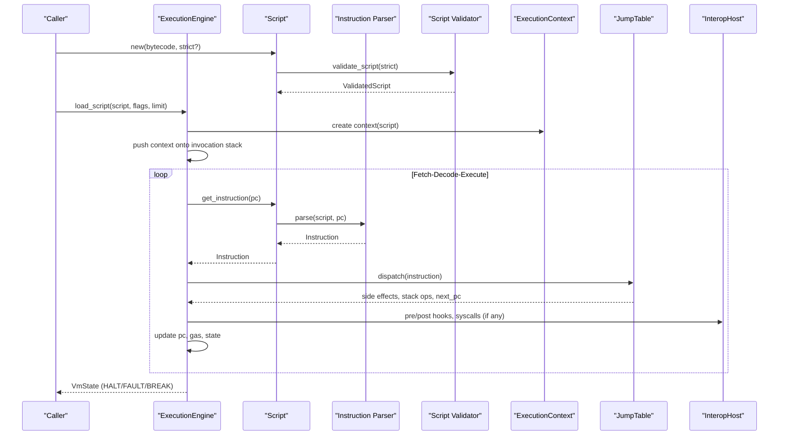
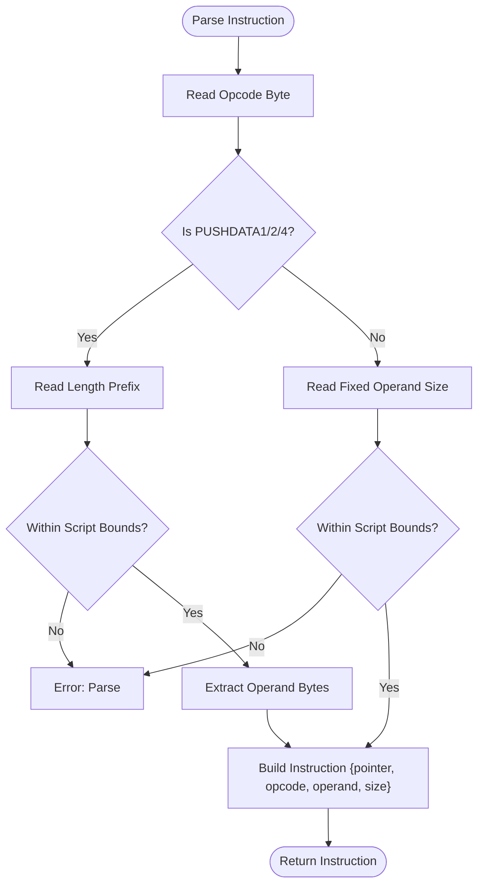
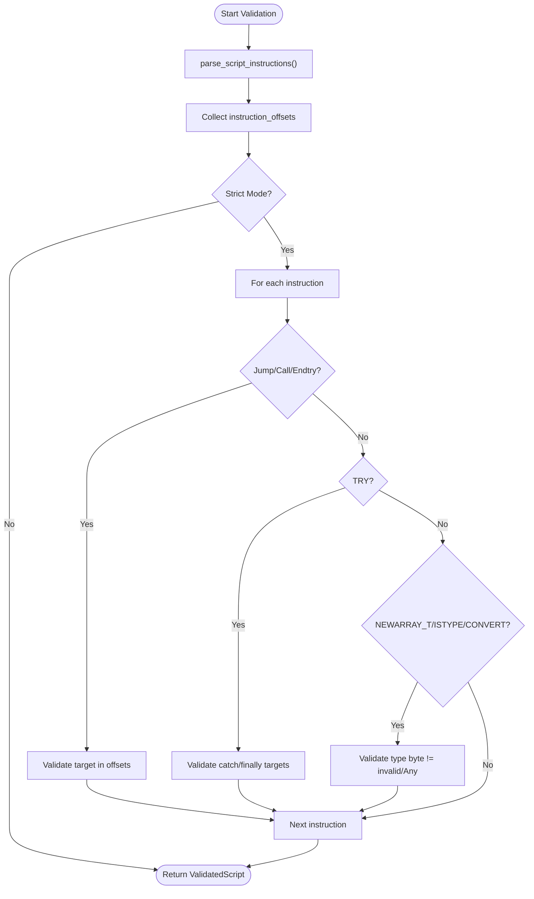
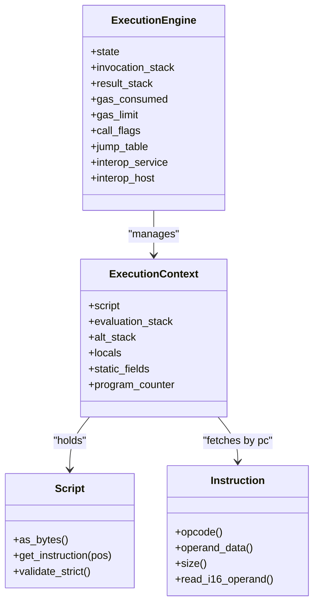
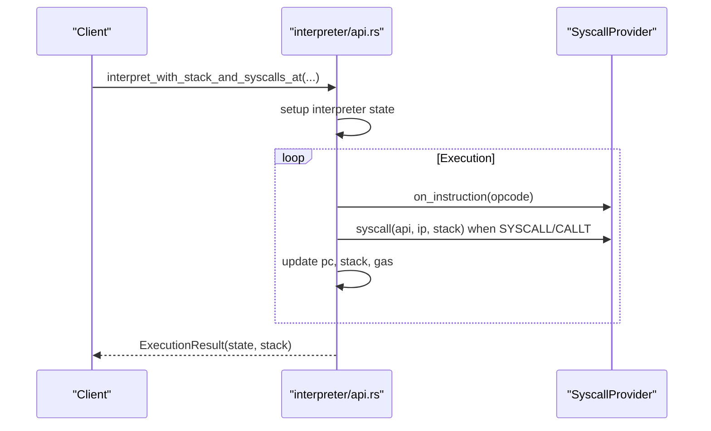
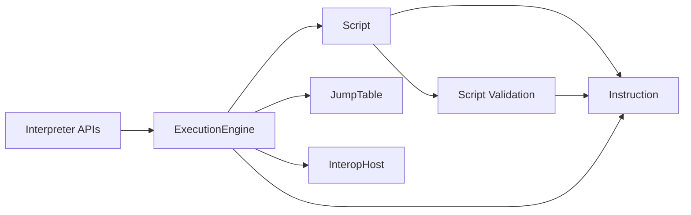

# Instruction Execution Flow

<cite>
**Referenced Files in This Document**
- [lib.rs](file://neo-vm/src/lib.rs)
- [execution_engine/mod.rs](file://neo-vm/src/execution_engine/mod.rs)
- [script.rs](file://neo-vm/src/script.rs)
- [interpreter/api.rs](file://neo-vm/src/interpreter/api.rs)
- [vm/instruction.rs](file://neo-vm/src/vm/instruction.rs)
- [vm/script_validation.rs](file://neo-vm/src/vm/script_validation.rs)
</cite>

## Table of Contents
1. Introduction
2. Project Structure
3. Core Components
4. Architecture Overview
5. Detailed Component Analysis
6. Dependency Analysis
7. Performance Considerations
8. Troubleshooting Guide
9. Conclusion
10. Appendices

## Introduction
This document explains the Neo VM instruction execution pipeline as implemented in the neo-vm crate. It covers how bytecode is decoded into instructions, the fetch-decode-execute cycle driven by the program counter, instruction validation and operand parsing, execution context management, script boundaries, error handling, gas metering, exception handling, state transitions, and debugging techniques. It also includes diagrams and concrete examples to help both newcomers and experienced developers understand the flow end-to-end.

## Project Structure
The Neo VM is organized into layered modules:
- Script representation and validation: script.rs and vm/script_validation.rs
- Instruction parsing and operand decoding: vm/instruction.rs
- Interpreter entry points and host callbacks: interpreter/api.rs
- Execution engine and invocation stack: execution_engine/mod.rs
- Public API surface and module map: lib.rs

**Diagram sources**
- [script.rs:137-226](file://neo-vm/src/script.rs#L137-L226)
- [vm/script_validation.rs:29-67](file://neo-vm/src/vm/script_validation.rs#L29-L67)
- [vm/instruction.rs:74-189](file://neo-vm/src/vm/instruction.rs#L74-L189)
- [execution_engine/mod.rs:195-242](file://neo-vm/src/execution_engine/mod.rs#L195-L242)
- [interpreter/api.rs:9-92](file://neo-vm/src/interpreter/api.rs#L9-L92)

**Section sources**
- [lib.rs:142-235](file://neo-vm/src/lib.rs#L142-L235)
- [execution_engine/mod.rs:1-73](file://neo-vm/src/execution_engine/mod.rs#L1-L73)

## Core Components
- Script: Wraps bytecode, provides eager or lazy instruction caching, bounds checks, and strict validation.
- Instruction: Parsed unit with opcode, operand bytes, position, and size; supports typed operand reading via FromOperand.
- Script Validation: Parses all instructions and validates control-flow targets and type operands; returns a ValidatedScript with known instruction offsets.
- ExecutionEngine: Manages invocation stack, evaluation stack, result stack, gas limits, jump table, interop service, and host callbacks.
- Interpreter APIs: Provide interpret functions that run scripts with optional initial stacks, initial instruction pointers, initializer hooks, and result limits.

Key responsibilities:
- Decode: Convert raw bytes into Instruction objects with correct operand extraction.
- Validate: Ensure jumps target valid instruction boundaries and type operands are legal.
- Execute: Fetch-decode-execute loop using program counter, dispatch via jump table, manage contexts and exceptions.
- Meter: Track gas consumption against configured limits.
- Interact: Bridge syscalls and host events through InteropService and host callbacks.

**Section sources**
- [script.rs:137-226](file://neo-vm/src/script.rs#L137-L226)
- [vm/instruction.rs:62-189](file://neo-vm/src/vm/instruction.rs#L62-L189)
- [vm/script_validation.rs:29-67](file://neo-vm/src/vm/script_validation.rs#L29-L67)
- [execution_engine/mod.rs:195-242](file://neo-vm/src/execution_engine/mod.rs#L195-L242)
- [interpreter/api.rs:9-92](file://neo-vm/src/interpreter/api.rs#L9-L92)

## Architecture Overview
At a high level:
- Scripts are validated and parsed into instructions before or during execution.
- The ExecutionEngine owns the invocation stack and current ExecutionContext, which holds the script reference, evaluation stack, alt stack, locals, and static fields.
- The interpreter drives the fetch-decode-execute loop: read instruction at program counter, decode operands, execute via jump table, update program counter, handle control flow and exceptions.
- Gas is metered per operation and syscall; execution halts on fault or when limits are reached.
- Syscalls and host interactions go through InteropService and host callbacks exposed by the engine.

**Diagram sources**
- [script.rs:137-226](file://neo-vm/src/script.rs#L137-L226)
- [vm/script_validation.rs:29-67](file://neo-vm/src/vm/script_validation.rs#L29-L67)
- [vm/instruction.rs:74-189](file://neo-vm/src/vm/instruction.rs#L74-L189)
- [execution_engine/mod.rs:195-242](file://neo-vm/src/execution_engine/mod.rs#L195-L242)
- [interpreter/api.rs:9-92](file://neo-vm/src/interpreter/api.rs#L9-L92)

## Detailed Component Analysis

### Script and Instruction Parsing
- Script::new supports strict mode, which eagerly parses all instructions and validates them. Relaxed mode defers parsing until needed and caches results.
- Instruction::parse reads the opcode, determines operand length (including PUSHDATA variants), extracts operand bytes, and computes instruction size.
- FromOperand provides safe typed accessors for i8/u8/i16/u16/i32/u32/i64/u64.

**Diagram sources**
- [vm/instruction.rs:74-189](file://neo-vm/src/vm/instruction.rs#L74-L189)

**Section sources**
- [script.rs:137-226](file://neo-vm/src/script.rs#L137-L226)
- [vm/instruction.rs:62-189](file://neo-vm/src/vm/instruction.rs#L62-L189)

### Script Validation Rules
- parse_script_instructions walks the script byte-by-byte, building an ordered list of Instruction objects.
- validate_script collects instruction offsets and, in strict mode, validates:
  - Jump targets point to known instruction boundaries.
  - TRY/ENDTRY catch and finally targets are valid instruction boundaries.
  - Type operands for NEWARRAY_T, ISTYPE, CONVERT are valid and not Any where disallowed.
- Helpers compute absolute jump targets from relative offsets and validate non-negative targets.

**Diagram sources**
- [vm/script_validation.rs:29-67](file://neo-vm/src/vm/script_validation.rs#L29-L67)
- [vm/script_validation.rs:69-123](file://neo-vm/src/vm/script_validation.rs#L69-L123)
- [vm/script_validation.rs:125-224](file://neo-vm/src/vm/script_validation.rs#L125-L224)

**Section sources**
- [vm/script_validation.rs:29-67](file://neo-vm/src/vm/script_validation.rs#L29-L67)
- [vm/script_validation.rs:69-123](file://neo-vm/src/vm/script_validation.rs#L69-L123)
- [vm/script_validation.rs:125-224](file://neo-vm/src/vm/script_validation.rs#L125-L224)

### Execution Engine and Program Counter
- ExecutionEngine holds:
  - State (VMState), invocation_stack, result_stack, gas_consumed, gas_limit, call_flags, jump_table, reference_counter, interop_service, interop_host.
  - Program counter is maintained within ExecutionContext (per frame).
- The engine loads a script into a new ExecutionContext, pushes it onto the invocation stack, and begins executing.
- During execution:
  - Fetch instruction at current program counter.
  - Decode operands via Instruction methods.
  - Dispatch via JumpTable to perform semantics.
  - Update program counter based on instruction behavior (sequential, jump, call, return).
  - Meter gas and enforce limits.
  - Handle exceptions and try/finally blocks.

**Diagram sources**
- [execution_engine/mod.rs:195-242](file://neo-vm/src/execution_engine/mod.rs#L195-L242)
- [script.rs:228-274](file://neo-vm/src/script.rs#L228-L274)
- [vm/instruction.rs:62-189](file://neo-vm/src/vm/instruction.rs#L62-L189)

**Section sources**
- [execution_engine/mod.rs:195-242](file://neo-vm/src/execution_engine/mod.rs#L195-L242)

### Interpreter Entry Points and Host Interaction
- interpreter/api.rs exposes interpret functions:
  - interpret(script): runs without syscalls.
  - interpret_with_stack_and_syscalls_at(script, initial_stack, initial_ip, host): runs with a host provider.
  - Variants support initializer_ip and result_stack_limit.
- SyscallProvider trait allows observing instructions, handling syscalls, notifying initializer completion, and routing CALLT tokens.

**Diagram sources**
- [interpreter/api.rs:9-92](file://neo-vm/src/interpreter/api.rs#L9-L92)
- [interpreter/api.rs:15-58](file://neo-vm/src/interpreter/api.rs#L15-L58)

**Section sources**
- [interpreter/api.rs:9-92](file://neo-vm/src/interpreter/api.rs#L9-L92)
- [interpreter/api.rs:15-58](file://neo-vm/src/interpreter/api.rs#L15-L58)

### Gas Metering and Limits
- ExecutionEngine tracks gas_consumed and enforces gas_limit per execution session.
- Base costs vary by operation; syscalls and storage operations incur higher costs.
- The engine integrates gas accounting into the execution loop and can halt on exceeding limits.

**Section sources**
- [execution_engine/mod.rs:188-242](file://neo-vm/src/execution_engine/mod.rs#L188-L242)

### Exception Handling and Try/Catch/Finally
- Script validation ensures TRY/ENDTRY targets are valid instruction boundaries.
- At runtime, exceptions propagate to nearest catch handler; finally blocks execute appropriately.
- The interpreter coordinates exception state and stack adjustments around try regions.

**Section sources**
- [vm/script_validation.rs:103-123](file://neo-vm/src/vm/script_validation.rs#L103-L123)
- [vm/script_validation.rs:204-224](file://neo-vm/src/vm/script_validation.rs#L204-L224)

### Instruction Boundaries and Control Flow
- Jump targets must resolve to known instruction offsets; negative or out-of-range targets are rejected.
- Relative offsets are computed from the next instruction’s position.
- CALL and CALL_L manipulate the invocation stack and program counter to enter subroutines.

**Section sources**
- [vm/script_validation.rs:69-101](file://neo-vm/src/vm/script_validation.rs#L69-L101)
- [vm/script_validation.rs:188-202](file://neo-vm/src/vm/script_validation.rs#L188-L202)

## Dependency Analysis
High-level dependencies among core components:

**Diagram sources**
- [script.rs:137-226](file://neo-vm/src/script.rs#L137-L226)
- [vm/script_validation.rs:29-67](file://neo-vm/src/vm/script_validation.rs#L29-L67)
- [execution_engine/mod.rs:195-242](file://neo-vm/src/execution_engine/mod.rs#L195-L242)
- [interpreter/api.rs:9-92](file://neo-vm/src/interpreter/api.rs#L9-L92)

**Section sources**
- [lib.rs:142-235](file://neo-vm/src/lib.rs#L142-L235)

## Performance Considerations
- Eager vs Lazy Instruction Cache:
  - Strict-mode scripts pre-parse all instructions into a lock-free HashMap for fast hot-path lookups.
  - Relaxed-mode scripts lazily parse and cache behind a RwLock, minimizing upfront cost but adding synchronization on first access.
- Instruction Size Caching:
  - Instruction stores cached_size to avoid recomputation during iteration and jumps.
- Result Stack Limits:
  - Interpreter APIs support capping result stack size to prevent memory pressure.
- Gas Limits:
  - Enforce per-execution gas caps to bound resource usage.

[No sources needed since this section provides general guidance]

## Troubleshooting Guide
Common issues and diagnostics:
- Invalid opcode or malformed operand:
  - Instruction::parse returns parse errors for unknown opcodes or truncated operands.
- Out-of-bounds jumps:
  - Validation rejects jump targets not aligned to instruction boundaries or outside script bounds.
- Invalid type operands:
  - NEWARRAY_T, ISTYPE, CONVERT reject invalid or Any type bytes where prohibited.
- Gas exhaustion:
  - Execution halts when gas_consumed exceeds gas_limit.
- Syscall failures:
  - Host-provided syscall implementations may return errors; ensure proper error propagation.

Debugging techniques:
- Use interpreter.on_instruction hook to trace executed opcodes and positions.
- Inspect last_interpreter_ip, last_result_stack_len, last_result_stage for post-mortem analysis.
- Run scripts in strict mode to catch structural issues early.
- Limit result stack size to reduce overhead during tracing.

**Section sources**
- [vm/instruction.rs:74-189](file://neo-vm/src/vm/instruction.rs#L74-L189)
- [vm/script_validation.rs:125-224](file://neo-vm/src/vm/script_validation.rs#L125-L224)
- [interpreter/api.rs:9-92](file://neo-vm/src/interpreter/api.rs#L9-L92)
- [interpreter/api.rs:15-58](file://neo-vm/src/interpreter/api.rs#L15-L58)

## Conclusion
The Neo VM execution pipeline separates concerns cleanly:
- Script and validation ensure bytecode correctness and safety.
- Instruction parsing decodes operands robustly with clear error reporting.
- ExecutionEngine orchestrates the fetch-decode-execute cycle, manages contexts, gas, and exceptions.
- Interpreter APIs provide flexible execution modes with host integration.
Together, these layers deliver a predictable, efficient, and debuggable environment for smart contract execution.

[No sources needed since this section summarizes without analyzing specific files]

## Appendices

### Example Execution Trace: Simple Arithmetic
Consider a script that pushes two integers, adds them, and returns:
- PUSH1
- PUSH2
- ADD
- RET

Execution trace:
- Load script into ExecutionEngine; create ExecutionContext with program counter at 0.
- Fetch PUSH1: push integer 1 onto evaluation stack; advance pc.
- Fetch PUSH2: push integer 2 onto evaluation stack; advance pc.
- Fetch ADD: pop two integers, compute sum, push result; advance pc.
- Fetch RET: return with result on stack; transition to HALT.

Validation notes:
- All targets are sequential; no jumps or try blocks.
- Strict validation passes if opcodes and operands are well-formed.

**Section sources**
- [script.rs:137-226](file://neo-vm/src/script.rs#L137-L226)
- [vm/instruction.rs:62-189](file://neo-vm/src/vm/instruction.rs#L62-L189)
- [execution_engine/mod.rs:195-242](file://neo-vm/src/execution_engine/mod.rs#L195-L242)