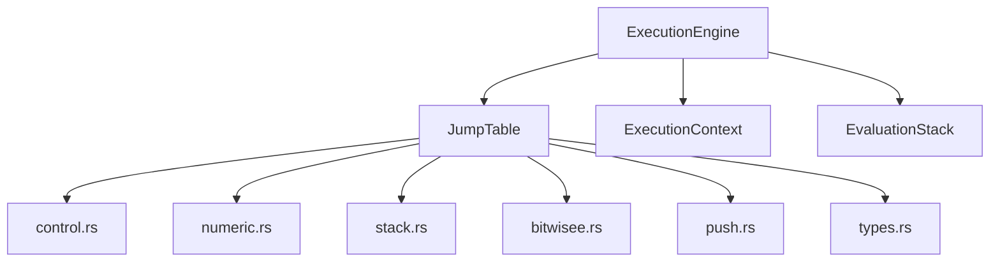
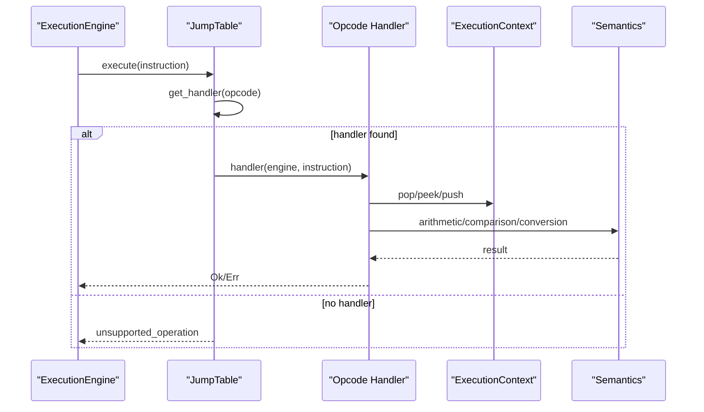
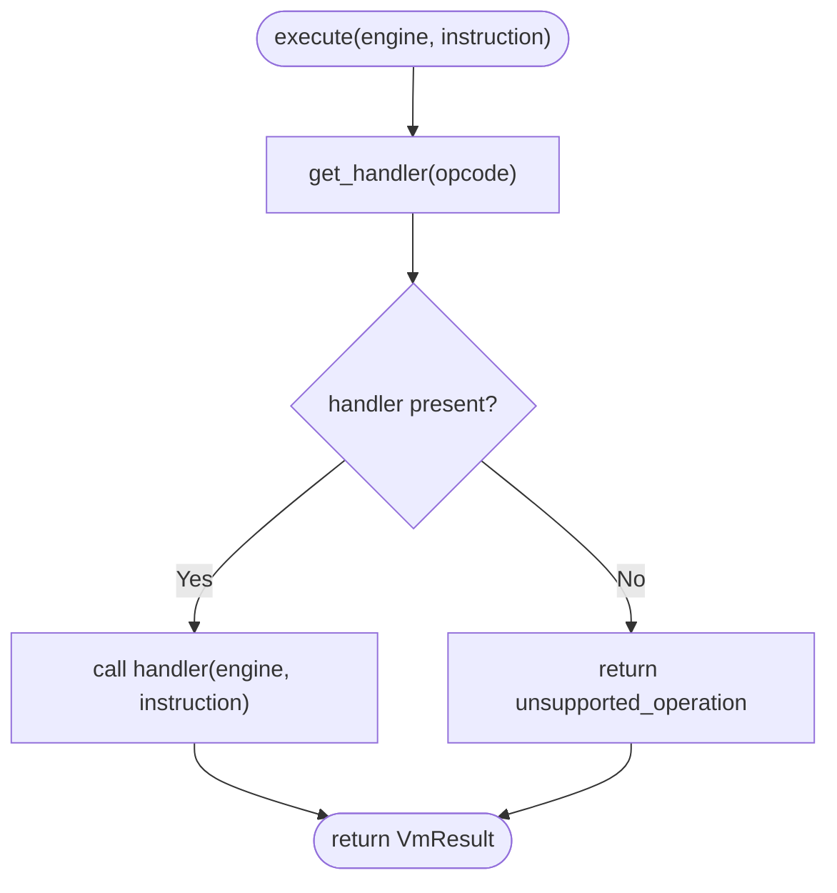
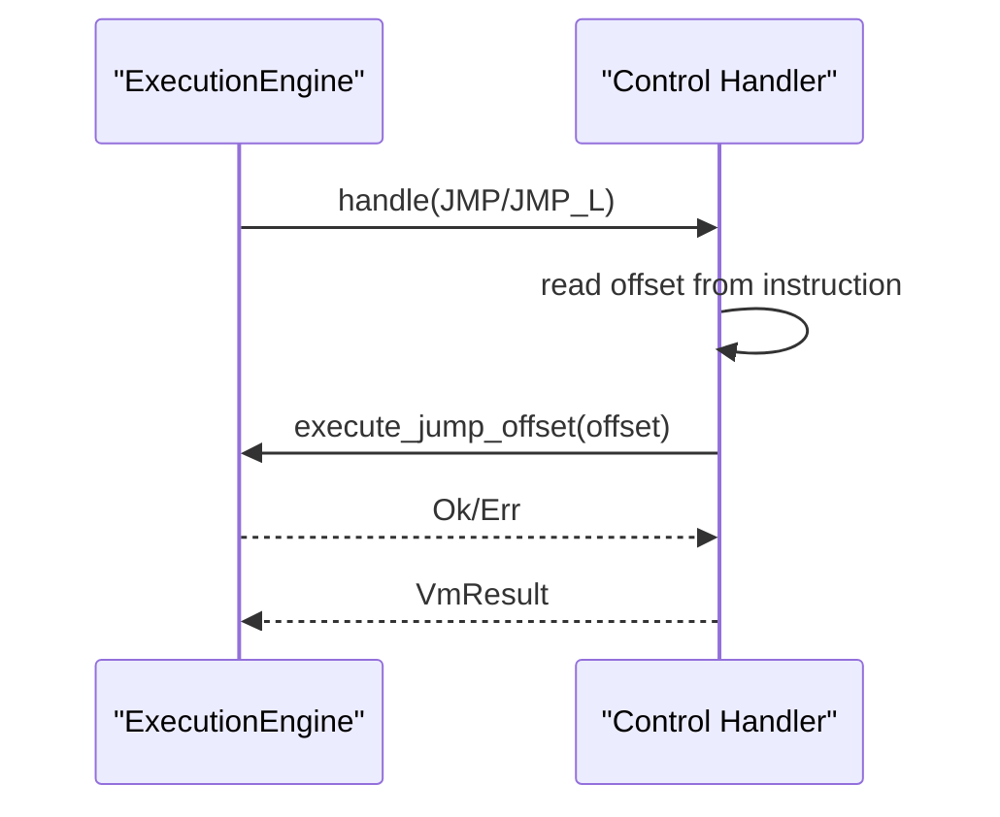
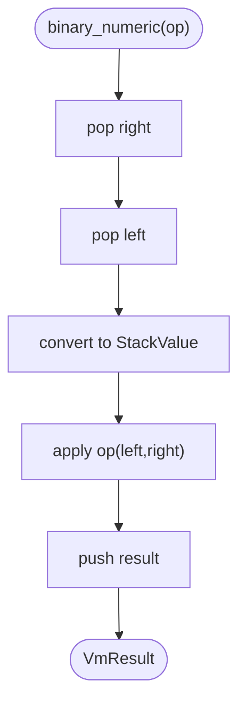
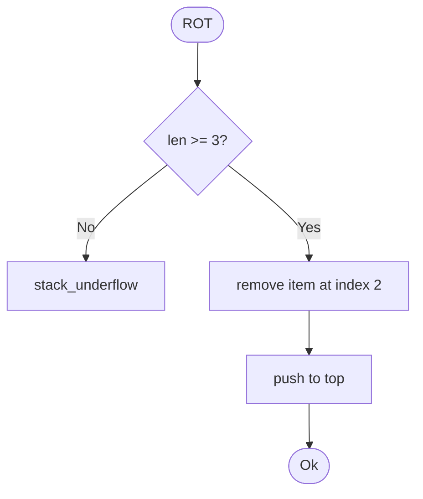
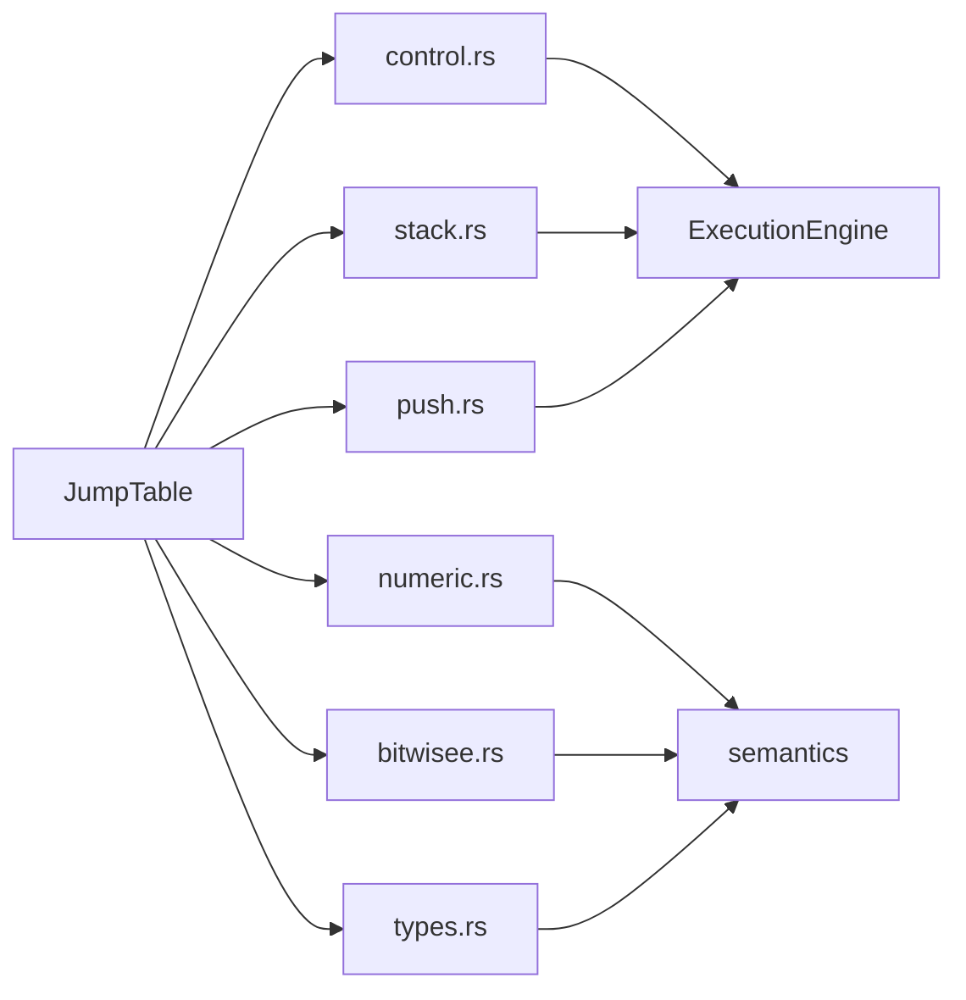

# Jump Table Mechanism

<cite>
**Referenced Files in This Document**
- [neo-vm/src/lib.rs](file://neo-vm/src/lib.rs)
- [neo-vm/src/jump_table/mod.rs](file://neo-vm/src/jump_table/mod.rs)
- [neo-vm/src/jump_table/control.rs](file://neo-vm/src/jump_table/control.rs)
- [neo-vm/src/jump_table/numeric.rs](file://neo-vm/src/jump_table/numeric.rs)
- [neo-vm/src/jump_table/stack.rs](file://neo-vm/src/jump_table/stack.rs)
- [neo-vm/src/jump_table/bitwisee.rs](file://neo-vm/src/jump_table/bitwisee.rs)
- [neo-vm/src/jump_table/push.rs](file://neo-vm/src/jump_table/push.rs)
- [neo-vm/src/jump_table/types.rs](file://neo-vm/src/jump_table/types.rs)
</cite>

## Table of Contents
1. [Introduction](#introduction)
2. [Project Structure](#project-structure)
3. [Core Components](#core-components)
4. [Architecture Overview](#architecture-overview)
5. [Detailed Component Analysis](#detailed-component-analysis)
6. [Dependency Analysis](#dependency-analysis)
7. [Performance Considerations](#performance-considerations)
8. [Troubleshooting Guide](#troubleshooting-guide)
9. [Conclusion](#conclusion)
10. [Appendices](#appendices)

## Introduction
This document explains the Neo VM jump table mechanism that maps opcodes to their semantic handlers and drives instruction execution. It covers how the jump table is structured, how different opcode categories are implemented, how new opcodes are added, and how instruction decoding and operand extraction integrate with the execution loop. It also analyzes performance characteristics and optimization strategies used in the implementation.

## Project Structure
The jump table lives under neo-vm/src/jump_table and is organized by opcode category:
- control.rs: Control flow (jumps, calls, try/catch/finally, abort/assert, syscall)
- numeric.rs: Numeric operations (arithmetic, comparisons, boolean ops, shifts)
- stack.rs: Stack manipulation (dup, swap, tuck, over, pick, rot, depth, drop, nip, xdrop, clear, roll, reverse*)
- bitwisee.rs: Bitwise operations (invert, and, or, xor, equal, notequal)
- push.rs: Push constants and data (PUSHINT*, PUSHA, PUSHNULL, PUSHDATA*, PUSH0..PUSH16, PUSHT, PUSHF)
- types.rs: Type operations (CONVERT, ISTYPE, ISNULL)
- mod.rs: JumpTable definition, registration, dispatch, and default initialization

**Diagram sources**
- [neo-vm/src/jump_table/mod.rs:34-183](file://neo-vm/src/jump_table/mod.rs#L34-L183)
- [neo-vm/src/jump_table/control.rs:10-57](file://neo-vm/src/jump_table/control.rs#L10-L57)
- [neo-vm/src/jump_table/numeric.rs:70-104](file://neo-vm/src/jump_table/numeric.rs#L70-L104)
- [neo-vm/src/jump_table/stack.rs:15-35](file://neo-vm/src/jump_table/stack.rs#L15-L35)
- [neo-vm/src/jump_table/bitwisee.rs:36-47](file://neo-vm/src/jump_table/bitwisee.rs#L36-L47)
- [neo-vm/src/jump_table/push.rs:16-52](file://neo-vm/src/jump_table/push.rs#L16-L52)
- [neo-vm/src/jump_table/types.rs:14-22](file://neo-vm/src/jump_table/types.rs#L14-L22)

**Section sources**
- [neo-vm/src/lib.rs:18-75](file://neo-vm/src/lib.rs#L18-L75)
- [neo-vm/src/jump_table/mod.rs:1-183](file://neo-vm/src/jump_table/mod.rs#L1-L183)

## Core Components
- JumpTable: Fixed-size array of 256 handler slots indexed by opcode byte. Provides fast lookup via get_handler/get_handler_by_u8 and execute() which delegates to the appropriate handler or returns an unsupported operation error.
- InstructionHandler: Function pointer type fn(&mut ExecutionEngine, &Instruction) -> VmResult<()> used as the dispatch target for each opcode.
- Category modules: Each module registers its opcodes using a macro-based helper that calls register on the JumpTable.

Key responsibilities:
- Centralized mapping from opcode to handler
- Safe fallback for unknown opcodes
- Default initialization of all opcodes at startup
- Exposing Index/IndexMut for ergonomic access

**Section sources**
- [neo-vm/src/jump_table/mod.rs:21-183](file://neo-vm/src/jump_table/mod.rs#L21-L183)

## Architecture Overview
The execution engine reads an instruction and uses the jump table to find the handler. Handlers perform operand extraction from the Instruction, interact with ExecutionContext/EvaluationStack, and may call into semantics modules for value-level operations.

**Diagram sources**
- [neo-vm/src/jump_table/mod.rs:133-152](file://neo-vm/src/jump_table/mod.rs#L133-L152)
- [neo-vm/src/jump_table/numeric.rs:37-68](file://neo-vm/src/jump_table/numeric.rs#L37-L68)
- [neo-vm/src/jump_table/control.rs:67-77](file://neo-vm/src/jump_table/control.rs#L67-L77)

## Detailed Component Analysis

### JumpTable Implementation
- Data structure: handlers: [Option<InstructionHandler>; 256]
- Initialization: new() sets up empty table and calls register_default_handlers(), which invokes each category’s register_handlers().
- Lookup: get_handler_by_u8(u8) is optimized for hot path; get_handler(OpCode) converts opcode to u8 index.
- Execute: if handler exists, call it; otherwise return unsupported_operation error.
- Indexing: Index<OpCode> panics if missing; IndexMut<OpCode> lazily installs an unsupported-operation handler when accessed.

**Diagram sources**
- [neo-vm/src/jump_table/mod.rs:133-152](file://neo-vm/src/jump_table/mod.rs#L133-L152)

**Section sources**
- [neo-vm/src/jump_table/mod.rs:34-183](file://neo-vm/src/jump_table/mod.rs#L34-L183)

### Control Flow Handlers
- Implements jumps (JMP, JMP_L), conditional jumps (JMPIF, JMPIFNOT, JMPEQ, JMPNE, JMPGT, JMPGE, JMPLT, JMPLE), CALL/CALL_L/CALLA/CALLT, ABORT/ABORTMSG, ASSERT/ASSERTMSG, THROW, TRY/TRY_L, ENDTRY/ENDTRY_L, ENDFINALLY, RET, SYSCALL.
- Operand extraction: uses instruction.token_i8(), token_i32(), token_u16(), token_u32() depending on opcode.
- Integration: delegates to ExecutionEngine methods like execute_jump_offset, execute_call, execute_try, execute_end_try, execute_end_finally, invoke_callt, on_syscall.

**Diagram sources**
- [neo-vm/src/jump_table/control.rs:67-77](file://neo-vm/src/jump_table/control.rs#L67-L77)
- [neo-vm/src/jump_table/control.rs:267-291](file://neo-vm/src/jump_table/control.rs#L267-L291)

**Section sources**
- [neo-vm/src/jump_table/control.rs:10-57](file://neo-vm/src/jump_table/control.rs#L10-L57)
- [neo-vm/src/jump_table/control.rs:59-461](file://neo-vm/src/jump_table/control.rs#L59-L461)

### Numeric Operations
- Categories: unary/binary/ternary numeric ops, comparisons, boolean logic, modular arithmetic, shifts.
- Operand handling: pops StackItem(s), converts to StackValue via value_from_stack_item, applies semantics functions (arithmetic::*, comparison::*), pushes result back.
- Limits: shift and pow validate against engine limits to prevent excessive work.

**Diagram sources**
- [neo-vm/src/jump_table/numeric.rs:47-68](file://neo-vm/src/jump_table/numeric.rs#L47-L68)

**Section sources**
- [neo-vm/src/jump_table/numeric.rs:70-104](file://neo-vm/src/jump_table/numeric.rs#L70-L104)
- [neo-vm/src/jump_table/numeric.rs:106-347](file://neo-vm/src/jump_table/numeric.rs#L106-L347)

### Stack Manipulation
- Implements DUP, SWAP, TUCK, OVER, PICK, ROT, DEPTH, DROP, NIP, XDROP, CLEAR, ROLL, REVERSE3, REVERSE4, REVERSEN.
- Optimizations: direct stack mutations where possible (e.g., swap without pop/push), minimal reference counting churn, bounds checks before removals.

**Diagram sources**
- [neo-vm/src/jump_table/stack.rs:95-110](file://neo-vm/src/jump_table/stack.rs#L95-L110)

**Section sources**
- [neo-vm/src/jump_table/stack.rs:15-35](file://neo-vm/src/jump_table/stack.rs#L15-L35)
- [neo-vm/src/jump_table/stack.rs:37-295](file://neo-vm/src/jump_table/stack.rs#L37-L295)

### Bitwise Operations
- Implements INVERT, AND, OR, XOR, EQUAL, NOTEQUAL.
- Operands converted to StackValue; equality uses equals_with_limits with engine limits.

**Section sources**
- [neo-vm/src/jump_table/bitwisee.rs:36-47](file://neo-vm/src/jump_table/bitwisee.rs#L36-L47)
- [neo-vm/src/jump_table/bitwisee.rs:49-101](file://neo-vm/src/jump_table/bitwisee.rs#L49-L101)

### Push Operations
- Implements PUSHINT8/16/32/64/128/256, PUSHA, PUSHNULL, PUSHDATA1/2/4, PUSH0..PUSH16, PUSHT, PUSHF.
- Operand extraction: uses instruction.read_*_operand() for fixed-width integers and instruction.operand() for variable-length data.
- PUSHA validates address within script bounds and pushes a pointer item.

**Section sources**
- [neo-vm/src/jump_table/push.rs:16-52](file://neo-vm/src/jump_table/push.rs#L16-L52)
- [neo-vm/src/jump_table/push.rs:64-148](file://neo-vm/src/jump_table/push.rs#L64-L148)
- [neo-vm/src/jump_table/push.rs:150-235](file://neo-vm/src/jump_table/push.rs#L150-L235)

### Type Operations
- Implements CONVERT, ISTYPE, ISNULL.
- Converts between StackItem types following strict rules; ISTYPE and ISNULL delegate to semantics conversion/comparison helpers.

**Section sources**
- [neo-vm/src/jump_table/types.rs:14-22](file://neo-vm/src/jump_table/types.rs#L14-L22)
- [neo-vm/src/jump_table/types.rs:24-165](file://neo-vm/src/jump_table/types.rs#L24-L165)

## Dependency Analysis
- JumpTable depends on:
  - ExecutionEngine for stateful operations (context, stack, limits, syscalls)
  - Instruction for operand extraction
  - Category modules for opcode-specific handlers
- Category modules depend on:
  - ExecutionContext/EvaluationStack for stack operations
  - Semantics modules for value-level arithmetic/comparison/conversion
  - Engine limits for safety checks

**Diagram sources**
- [neo-vm/src/jump_table/mod.rs:154-183](file://neo-vm/src/jump_table/mod.rs#L154-L183)
- [neo-vm/src/jump_table/numeric.rs:70-104](file://neo-vm/src/jump_table/numeric.rs#L70-L104)
- [neo-vm/src/jump_table/control.rs:10-57](file://neo-vm/src/jump_table/control.rs#L10-L57)

**Section sources**
- [neo-vm/src/jump_table/mod.rs:154-183](file://neo-vm/src/jump_table/mod.rs#L154-L183)

## Performance Considerations
- O(1) dispatch: Fixed-size array of 256 entries ensures constant-time opcode lookup.
- Hot-path optimizations:
  - get_handler_by_u8(u8) avoids enum conversion overhead in tight loops.
  - Inline helpers and #[inline] annotations reduce call overhead.
  - Direct stack mutations (e.g., swap) minimize reference counting churn.
- Bounds safety: debug_assert guards in debug builds; unsafe indexing guarded by known-bounds invariants.
- Limits enforcement: Shift and exponent operations validate against engine limits to avoid excessive computation.
- Lazy default handler: IndexMut installs an unsupported-operation handler on first miss to keep subsequent accesses consistent.

[No sources needed since this section provides general guidance]

## Troubleshooting Guide
Common issues and where they surface:
- Unsupported opcode: JumpTable.execute returns unsupported_operation when no handler is registered.
- Invalid instruction operands: Handlers return invalid_instruction_msg when expected operands are missing or malformed (e.g., wrong length for PUSHINT128/PUSHINT256).
- Stack underflow: Stack operations check stack length and return stack_underflow errors.
- Invalid jump offsets: Control flow computes positions with checked arithmetic and returns InvalidJump on overflow.
- Type conversion errors: Type handlers return invalid_type_simple or invalid_instruction_msg for illegal conversions.

**Section sources**
- [neo-vm/src/jump_table/mod.rs:142-152](file://neo-vm/src/jump_table/mod.rs#L142-L152)
- [neo-vm/src/jump_table/push.rs:92-117](file://neo-vm/src/jump_table/push.rs#L92-L117)
- [neo-vm/src/jump_table/stack.rs:63-73](file://neo-vm/src/jump_table/stack.rs#L63-L73)
- [neo-vm/src/jump_table/control.rs:267-291](file://neo-vm/src/jump_table/control.rs#L267-L291)
- [neo-vm/src/jump_table/types.rs:38-45](file://neo-vm/src/jump_table/types.rs#L38-L45)

## Conclusion
The Neo VM jump table provides a fast, extensible, and safe dispatch mechanism for opcode execution. By organizing handlers by category and delegating value semantics to dedicated modules, it balances clarity with performance. The fixed-size array, inline helpers, and careful bounds checking ensure efficient execution while maintaining robust error handling. Adding new opcodes follows a consistent pattern: implement a handler, register it via the macro, and rely on existing infrastructure for decoding, context interaction, and error reporting.

[No sources needed since this section summarizes without analyzing specific files]

## Appendices

### How New Opcodes Are Added
- Implement a handler function with signature fn(&mut ExecutionEngine, &Instruction) -> VmResult<()>.
- Register the opcode in the appropriate category module using the register_jump_handlers! macro.
- Ensure operand extraction matches the opcode’s encoding (token_i8/token_i32/read_*_operand/operand).
- Validate inputs and use engine limits where applicable.
- Test via unit tests and integration vectors.

**Section sources**
- [neo-vm/src/jump_table/mod.rs:24-32](file://neo-vm/src/jump_table/mod.rs#L24-L32)
- [neo-vm/src/jump_table/control.rs:10-57](file://neo-vm/src/jump_table/control.rs#L10-L57)
- [neo-vm/src/jump_table/numeric.rs:70-104](file://neo-vm/src/jump_table/numeric.rs#L70-L104)
- [neo-vm/src/jump_table/push.rs:16-52](file://neo-vm/src/jump_table/push.rs#L16-L52)

### Instruction Decoding and Operand Extraction
- Fixed-width tokens: token_i8(), token_i32(), token_u16(), token_u32()
- Readable operands: read_i8_operand(), read_i16_operand(), read_i32_operand()
- Variable-length data: operand() returns bytes for PUSHDATA* and large integer pushes
- Control flow offsets: signed offsets for jumps and calls; validated via checked arithmetic

**Section sources**
- [neo-vm/src/jump_table/control.rs:67-77](file://neo-vm/src/jump_table/control.rs#L67-L77)
- [neo-vm/src/jump_table/push.rs:64-117](file://neo-vm/src/jump_table/push.rs#L64-L117)

### Execution Loop Integration
- The execution engine obtains an Instruction and calls JumpTable.execute.
- Handlers manipulate ExecutionContext/EvaluationStack and may call engine methods for control flow and syscalls.
- Errors propagate as VmResult, enabling precise error reporting and recovery.

**Section sources**
- [neo-vm/src/jump_table/mod.rs:133-152](file://neo-vm/src/jump_table/mod.rs#L133-L152)
- [neo-vm/src/jump_table/control.rs:267-291](file://neo-vm/src/jump_table/control.rs#L267-L291)