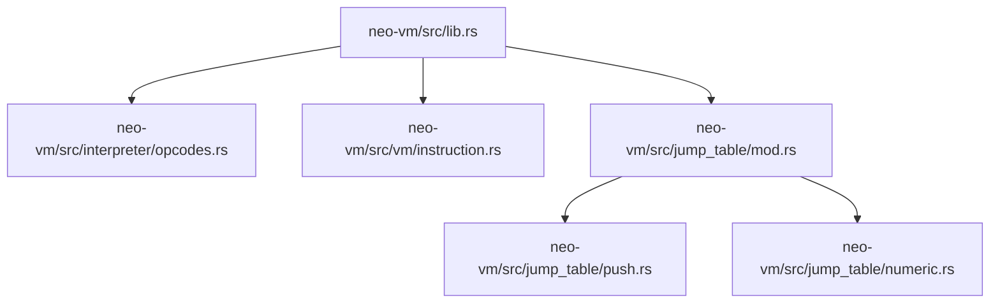
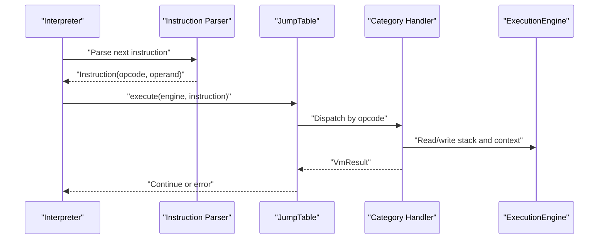
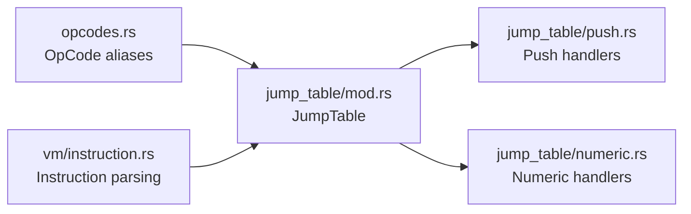

# Opcode Categories

<cite>
**Referenced Files in This Document**
- [neo-vm/src/lib.rs](file://neo-vm/src/lib.rs)
- [neo-vm/src/interpreter/opcodes.rs](file://neo-vm/src/interpreter/opcodes.rs)
- [neo-vm/src/vm/instruction.rs](file://neo-vm/src/vm/instruction.rs)
- [neo-vm/src/jump_table/mod.rs](file://neo-vm/src/jump_table/mod.rs)
- [neo-vm/src/jump_table/push.rs](file://neo-vm/src/jump_table/push.rs)
- [neo-vm/src/jump_table/numeric.rs](file://neo-vm/src/jump_table/numeric.rs)
</cite>

## Table of Contents
1. Introduction
2. Project Structure
3. Core Components
4. Architecture Overview
5. Detailed Component Analysis
6. Dependency Analysis
7. Performance Considerations
8. Troubleshooting Guide
9. Conclusion

## Introduction
This document explains the Neo VM opcode categories and their organization as implemented in the neo-rs repository. It covers data manipulation, arithmetic, logical, comparison, control flow, stack manipulation, memory operations, collection operations, and system calls. For each category, it describes purpose, common usage patterns, operand requirements, stack effects, gas considerations, and performance notes. Where applicable, it references the exact source files that define opcodes, parse instructions, and dispatch execution.

## Project Structure
The Neo VM is organized into modules that separate concerns:
- Opcode names and groupings are declared in a central module.
- Instruction parsing and operand decoding live in a shared instruction module.
- Execution dispatch is handled by a jump table with per-category handler modules.
- The crate root exposes public types and re-exports for consumers.

**Diagram sources**
- [neo-vm/src/lib.rs:142-235](file://neo-vm/src/lib.rs#L142-L235)
- [neo-vm/src/interpreter/opcodes.rs:1-226](file://neo-vm/src/interpreter/opcodes.rs#L1-L226)
- [neo-vm/src/vm/instruction.rs:1-391](file://neo-vm/src/vm/instruction.rs#L1-L391)
- [neo-vm/src/jump_table/mod.rs:1-183](file://neo-vm/src/jump_table/mod.rs#L1-L183)
- [neo-vm/src/jump_table/push.rs:1-235](file://neo-vm/src/jump_table/push.rs#L1-L235)
- [neo-vm/src/jump_table/numeric.rs:1-470](file://neo-vm/src/jump_table/numeric.rs#L1-L470)

**Section sources**
- [neo-vm/src/lib.rs:142-235](file://neo-vm/src/lib.rs#L142-L235)

## Core Components
- OpCode enumeration and aliases: Centralized list of all opcodes grouped by category (push, control, stack, slot, splice, bitwisee, numeric, compound, types).
- Instruction parsing: Parses an opcode byte and its operand(s), including variable-length PUSHDATA variants and fixed-size operands.
- JumpTable: Fast dispatch mechanism mapping each opcode to a handler function; registers default handlers per category.
- Category handlers: Per-category modules implement semantics for groups like push, numeric, etc., using shared semantics where available.

Key responsibilities:
- Data preparation: Push constants, booleans, nulls, pointers, and arbitrary data onto the evaluation stack.
- Numeric and logical ops: Perform arithmetic, comparisons, and boolean logic on stack values.
- Control flow: Manage jumps, calls, returns, and exception handling.
- Stack and memory: Manipulate the evaluation stack and perform buffer operations.
- Collections: Create and mutate arrays, maps, and structs.
- System calls: Invoke host-provided functionality via SYSCALL.

**Section sources**
- [neo-vm/src/interpreter/opcodes.rs:13-226](file://neo-vm/src/interpreter/opcodes.rs#L13-L226)
- [neo-vm/src/vm/instruction.rs:62-189](file://neo-vm/src/vm/instruction.rs#L62-L189)
- [neo-vm/src/jump_table/mod.rs:34-183](file://neo-vm/src/jump_table/mod.rs#L34-L183)

## Architecture Overview
Execution follows a predictable path:
1. The interpreter reads the next opcode from the script.
2. The instruction parser decodes the opcode and its operand bytes.
3. The jump table selects the appropriate handler for the opcode.
4. The handler manipulates the evaluation stack and context, then returns.

**Diagram sources**
- [neo-vm/src/vm/instruction.rs:79-189](file://neo-vm/src/vm/instruction.rs#L79-L189)
- [neo-vm/src/jump_table/mod.rs:133-152](file://neo-vm/src/jump_table/mod.rs#L133-L152)
- [neo-vm/src/jump_table/push.rs:17-52](file://neo-vm/src/jump_table/push.rs#L17-L52)
- [neo-vm/src/jump_table/numeric.rs:71-104](file://neo-vm/src/jump_table/numeric.rs#L71-L104)

## Detailed Component Analysis

### Data Manipulation (PUSH*, POP, DUP)
Purpose:
- Introduce values onto the evaluation stack and remove or duplicate items as needed.

Common usage patterns:
- Initialize variables, loop counters, and literals with PUSH* opcodes.
- Clean up temporary values with POP or adjust stack layout with DUP/NIP/OVER/PICK/TUCK/SWAP/ROT/ROLL.

Operand requirements:
- PUSHINT8..PUSHINT256: Encoded integer operand sizes vary by variant.
- PUSHDATA1/2/4: Variable-length data with length prefix.
- PUSHA: Relative address operand.
- PUSH0..PUSH16, PUSHM1, PUSHT, PUSHF: No operand.
- Stack modifiers (POP/DUP/etc.): No operand.

Stack effects (typical):
- PUSH*: pushes one value.
- POP: pops one value.
- DUP: duplicates top item.
- NIP: removes second item.
- OVER: copies item below top.
- PICK: pushes copy of item at index.
- TUCK: inserts copy of top below second.
- SWAP: swaps top two items.
- ROT: rotates top three items.
- ROLL: rotates item at index to top.

Gas and performance:
- Base costs are low for simple stack ops; PUSH data cost scales with payload size.
- Prefer compact PUSH variants (PUSH0..PUSH16) to minimize bytecode size.

**Section sources**
- [neo-vm/src/interpreter/opcodes.rs:13-44](file://neo-vm/src/interpreter/opcodes.rs#L13-L44)
- [neo-vm/src/interpreter/opcodes.rs:83-98](file://neo-vm/src/interpreter/opcodes.rs#L83-L98)
- [neo-vm/src/vm/instruction.rs:89-180](file://neo-vm/src/vm/instruction.rs#L89-L180)
- [neo-vm/src/jump_table/push.rs:17-52](file://neo-vm/src/jump_table/push.rs#L17-L52)

### Arithmetic Operations (ADD, SUB, MUL, DIV)
Purpose:
- Perform integer arithmetic and related numeric transformations.

Common usage patterns:
- Combine integers, compute offsets, and perform modular arithmetic.
- Use MIN/MAX/WITHIN for range checks and bounds.

Operand requirements:
- Binary ops (ADD/SUB/MUL/DIV/MOD/POW/MODMUL/MODPOW): Two operands from the stack.
- Unary ops (INC/DEC/SIGN/NEGATE/ABS/SQRT/NOT/NZ): One operand.
- Ternary ops (WITHIN/MODMUL/MODPOW): Three operands.

Stack effects:
- Each operation consumes its inputs and pushes one result.

Gas and performance:
- Simple arithmetic is inexpensive; POW and large integer operations can be more costly.
- Shifts (SHL/SHR) enforce limits to prevent excessive work.

**Section sources**
- [neo-vm/src/interpreter/opcodes.rs:168-197](file://neo-vm/src/interpreter/opcodes.rs#L168-L197)
- [neo-vm/src/jump_table/numeric.rs:71-104](file://neo-vm/src/jump_table/numeric.rs#L71-L104)
- [neo-vm/src/jump_table/numeric.rs:106-247](file://neo-vm/src/jump_table/numeric.rs#L106-L247)

### Logical Operations (AND, OR, XOR, NOT)
Purpose:
- Bitwise and boolean logic on integers and booleans.

Common usage patterns:
- Build bitmasks, toggle flags, and combine conditions.
- Use NOT/NZ for boolean normalization.

Operand requirements:
- AND/OR/XOR/EQUAL/NOTEQUAL: Two operands.
- NOT: One operand.

Stack effects:
- Consume inputs and push a single result (boolean or integer).

Gas and performance:
- Low overhead; prefer compact forms and avoid unnecessary conversions.

**Section sources**
- [neo-vm/src/interpreter/opcodes.rs:160-166](file://neo-vm/src/interpreter/opcodes.rs#L160-L166)
- [neo-vm/src/jump_table/numeric.rs:132-144](file://neo-vm/src/jump_table/numeric.rs#L132-L144)

### Comparison Operations (EQUAL, LT, GT, LE, GE)
Purpose:
- Compare values and produce boolean results.

Common usage patterns:
- Branching based on ordering or equality.
- Range checks with WITHIN.

Operand requirements:
- EQUAL/NUMEQUAL/NUMNOTEQUAL: Two operands.
- LT/LE/GT/GE: Two operands.
- WITHIN: Three operands (value, lower, upper).

Stack effects:
- Consume inputs and push a boolean.

Gas and performance:
- Cheap; ensure operands are compatible types to avoid conversion overhead.

**Section sources**
- [neo-vm/src/interpreter/opcodes.rs:160-197](file://neo-vm/src/interpreter/opcodes.rs#L160-L197)
- [neo-vm/src/jump_table/numeric.rs:241-339](file://neo-vm/src/jump_table/numeric.rs#L241-L339)

### Control Flow (JMP, JMPIF, CALL, RET)
Purpose:
- Direct and conditional jumps, subroutine calls, and returns.

Common usage patterns:
- Implement loops, conditionals, and function calls.
- Use TRY/ENDTRY/ENDFINALLY for exception handling.

Operand requirements:
- JMP/JMP_L: Target offset.
- JMPIF/JMPIFNOT/JMPEQ/JMPNE/JMPGT/JMPGE/JMPLT/JMPLE: Condition or target offset.
- CALL/CALL_L/CALLA/CALLT: Call target/address/table index.
- RET: No operand.
- SYSCALL: Syscall identifier and arguments.

Stack effects:
- Vary by opcode; typically consume condition or target, and manage call frames.

Gas and performance:
- CALL has higher base cost; SYSCALL invokes host services with additional costs.
- Minimize deep recursion and excessive branching.

**Section sources**
- [neo-vm/src/interpreter/opcodes.rs:46-81](file://neo-vm/src/interpreter/opcodes.rs#L46-L81)
- [neo-vm/src/lib.rs:109-122](file://neo-vm/src/lib.rs#L109-L122)

### Stack Manipulation (DEPTH, DROP, SWAP, ROT)
Purpose:
- Inspect and reorder stack contents without changing values.

Common usage patterns:
- Prepare arguments for functions, inspect stack depth, rotate values for multi-argument ops.

Operand requirements:
- DEPTH: No operand.
- DROP/NIP/XDROP/CLEAR: Remove items.
- SWAP/ROT/ROLL/REVERSE3/REVERSE4/REVERSEN: Reorder items.

Stack effects:
- Modify stack shape; do not change values except removal/reordering.

Gas and performance:
- Minimal overhead; use judiciously to keep scripts readable and efficient.

**Section sources**
- [neo-vm/src/interpreter/opcodes.rs:83-98](file://neo-vm/src/interpreter/opcodes.rs#L83-L98)

### Memory Operations (NEWBUFFER, MEMCPY, CAT)
Purpose:
- Allocate and manipulate buffers and byte strings.

Common usage patterns:
- Build payloads, concatenate strings, copy regions between buffers.

Operand requirements:
- NEWBUFFER: Size argument.
- MEMCPY: Source, destination, count.
- CAT: Concatenate two buffers.

Stack effects:
- Consume input buffers and/or sizes; push new buffer or modified buffer.

Gas and performance:
- Costs scale with buffer sizes; avoid excessive copying and concatenation in tight loops.

**Section sources**
- [neo-vm/src/interpreter/opcodes.rs:152-158](file://neo-vm/src/interpreter/opcodes.rs#L152-L158)

### Collection Operations (NEWARRAY, NEWMAP, APPEND, SETITEM)
Purpose:
- Create and mutate arrays, maps, and structs.

Common usage patterns:
- Build dynamic collections, set/get items, iterate keys/values.

Operand requirements:
- NEWARRAY0/NEWARRAY/NEWARRAY_T: Array size/type.
- NEWSTRUCT0/NEWSTRUCT: Struct size/type.
- NEWMAP: Map creation.
- APPEND/SETITEM/REMOVE/CLEARITEMS/POPITEM: Collection and element operands.

Stack effects:
- Consume elements and/or indices; push updated collection or element.

Gas and performance:
- Dynamic collections incur allocation and resizing costs; pre-size when possible.

**Section sources**
- [neo-vm/src/interpreter/opcodes.rs:199-220](file://neo-vm/src/interpreter/opcodes.rs#L199-L220)

### System Calls (SYSCALL)
Purpose:
- Invoke host-provided functionality (e.g., storage, crypto, blockchain queries).

Common usage patterns:
- Read/write storage, query ledger state, emit events, interact with native contracts.

Operand requirements:
- SYSCALL: Identifier and marshaled arguments.

Stack effects:
- Consume arguments; push return values as defined by the syscall contract.

Gas and performance:
- Higher base cost than pure VM ops; consider caching and batching to reduce invocations.

**Section sources**
- [neo-vm/src/interpreter/opcodes.rs:46-81](file://neo-vm/src/interpreter/opcodes.rs#L46-L81)
- [neo-vm/src/lib.rs:109-122](file://neo-vm/src/lib.rs#L109-L122)

## Dependency Analysis
Opcode categories are registered into the jump table, which routes execution to category-specific handlers.

**Diagram sources**
- [neo-vm/src/interpreter/opcodes.rs:13-226](file://neo-vm/src/interpreter/opcodes.rs#L13-L226)
- [neo-vm/src/vm/instruction.rs:79-189](file://neo-vm/src/vm/instruction.rs#L79-L189)
- [neo-vm/src/jump_table/mod.rs:154-183](file://neo-vm/src/jump_table/mod.rs#L154-L183)
- [neo-vm/src/jump_table/push.rs:17-52](file://neo-vm/src/jump_table/push.rs#L17-L52)
- [neo-vm/src/jump_table/numeric.rs:71-104](file://neo-vm/src/jump_table/numeric.rs#L71-L104)

**Section sources**
- [neo-vm/src/jump_table/mod.rs:154-183](file://neo-vm/src/jump_table/mod.rs#L154-L183)

## Performance Considerations
- Bytecode size: Prefer PUSH0..PUSH16 and compact PUSHDATA variants to reduce script size and parsing overhead.
- Stack efficiency: Minimize redundant DUP/ROT sequences; plan operand order to reduce shuffling.
- Arithmetic: Be mindful of POW and large integer operations; use MODMUL/MODPOW for modular arithmetic where applicable.
- Memory: Avoid frequent reallocations; reuse buffers and batch concatenations.
- Control flow: Limit deep nesting and excessive branching; prefer early exits.
- System calls: Batch operations and cache results to reduce SYSCALL frequency.

[No sources needed since this section provides general guidance]

## Troubleshooting Guide
Common issues and where they arise:
- Invalid opcode: Occurs when an unsupported byte is encountered during dispatch.
- Operand errors: Parsing failures for PUSHDATA variants or insufficient operand bytes.
- Stack underflow: Attempting to pop from an empty stack or mismatched operand counts.
- Bounds errors: Address out-of-bounds for PUSHA or invalid script positions.

Where to look:
- Instruction parsing validates opcode bytes and operand lengths, returning structured errors.
- Jump table execution returns errors for unsupported opcodes.
- Category handlers validate stack depth and operand types before performing operations.

**Section sources**
- [neo-vm/src/vm/instruction.rs:7-60](file://neo-vm/src/vm/instruction.rs#L7-L60)
- [neo-vm/src/vm/instruction.rs:79-189](file://neo-vm/src/vm/instruction.rs#L79-L189)
- [neo-vm/src/jump_table/mod.rs:133-152](file://neo-vm/src/jump_table/mod.rs#L133-L152)

## Conclusion
The Neo VM organizes opcodes into clear categories with dedicated handler modules and a centralized jump table for fast dispatch. Understanding each category’s purpose, operand requirements, and stack effects enables writing efficient, correct scripts. Pay attention to gas costs and performance characteristics—especially for data-heavy and system-call-intensive code—to optimize both size and runtime behavior.

[No sources needed since this section summarizes without analyzing specific files]