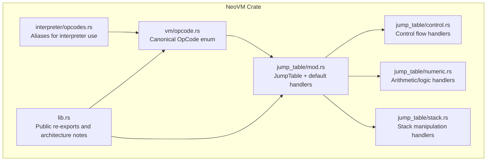
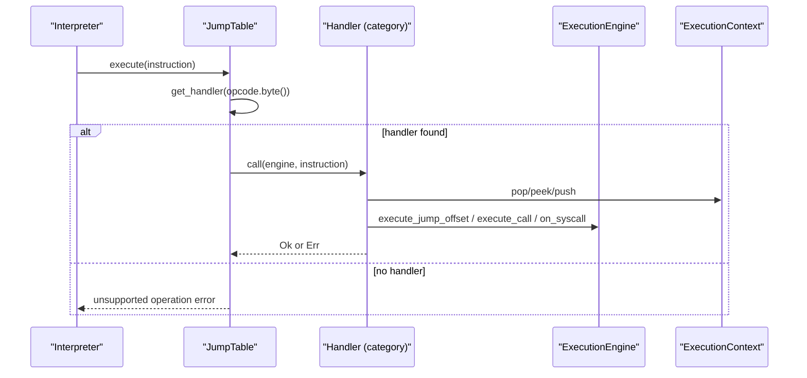
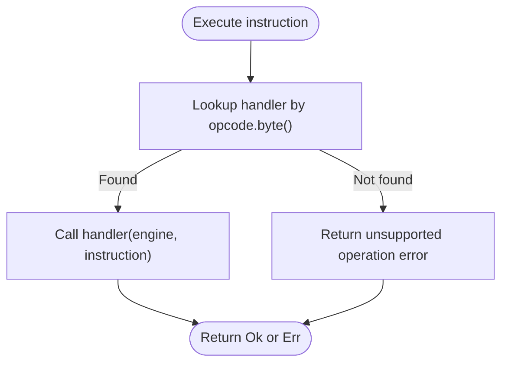
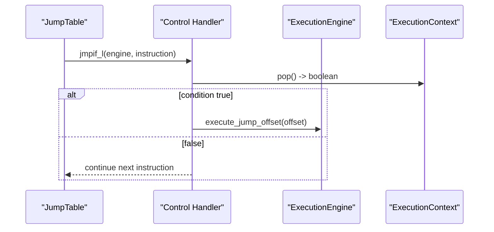
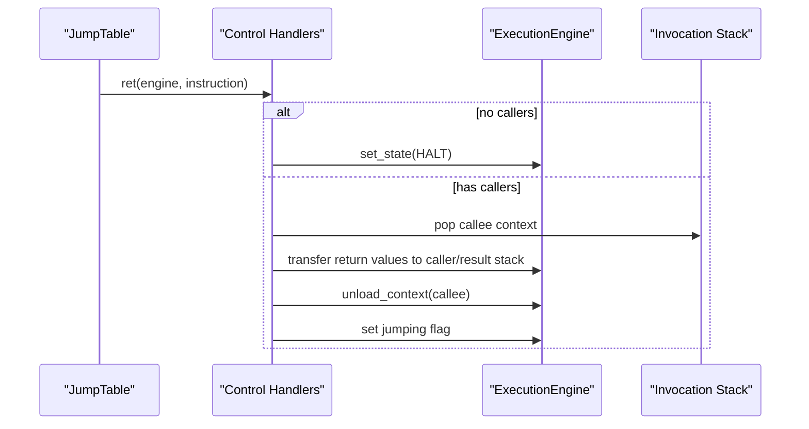
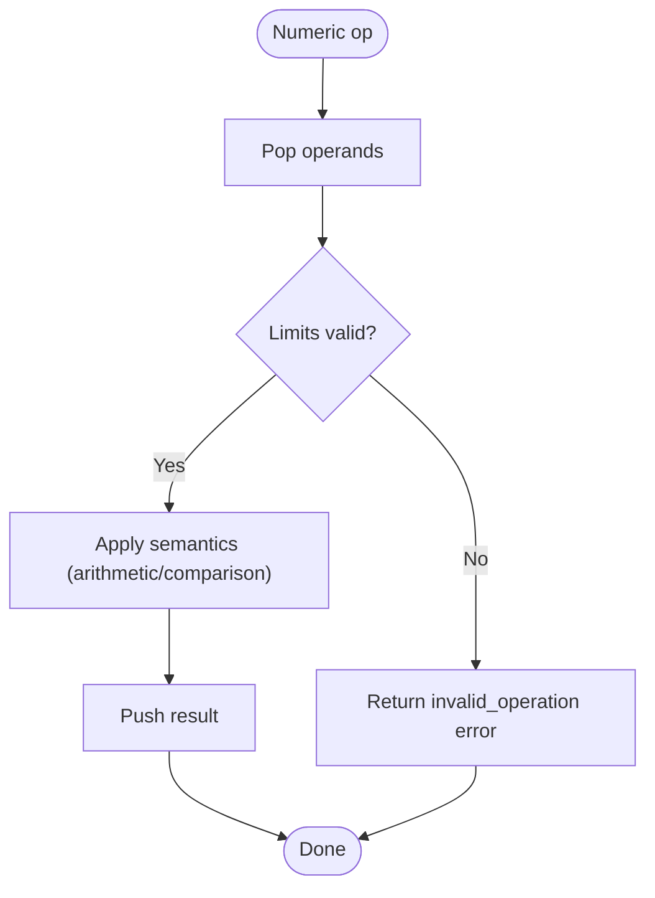
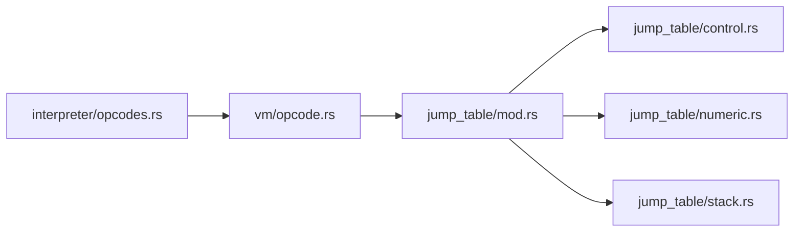

# Opcodes and Instructions

<cite>
**Referenced Files in This Document**
- [lib.rs](file://neo-vm/src/lib.rs)
- [opcode.rs](file://neo-vm/src/vm/opcode.rs)
- [mod.rs](file://neo-vm/src/jump_table/mod.rs)
- [control.rs](file://neo-vm/src/jump_table/control.rs)
- [numeric.rs](file://neo-vm/src/jump_table/numeric.rs)
- [stack.rs](file://neo-vm/src/jump_table/stack.rs)
- [opcodes.rs](file://neo-vm/src/interpreter/opcodes.rs)
</cite>

## Table of Contents
1. Introduction
2. Project Structure
3. Core Components
4. Architecture Overview
5. Detailed Component Analysis
6. Dependency Analysis
7. Performance Considerations
8. Troubleshooting Guide
9. Conclusion
10. Appendices

## Introduction
This document explains the Neo VM opcodes and instruction execution as implemented in this repository. It covers opcode categories (arithmetic, logical, stack manipulation, control flow, I/O), the jump table dispatch mechanism, instruction decoding and execution semantics, operand handling, stack effects, special instructions (CALL, SYSCALL, RET), validation, gas costs, and common usage patterns for smart contracts.

## Project Structure
The Neo VM is organized into a core that defines canonical opcodes and shared semantics, and a stateful host layer that implements execution, contexts, and the jump table dispatching to category-specific handlers.

**Diagram sources**
- [opcode.rs:123-320](file://neo-vm/src/vm/opcode.rs#L123-L320)
- [mod.rs:34-182](file://neo-vm/src/jump_table/mod.rs#L34-L182)
- [control.rs:11-57](file://neo-vm/src/jump_table/control.rs#L11-L57)
- [numeric.rs:70-104](file://neo-vm/src/jump_table/numeric.rs#L70-L104)
- [stack.rs:15-35](file://neo-vm/src/jump_table/stack.rs#L15-L35)
- [opcodes.rs:13-226](file://neo-vm/src/interpreter/opcodes.rs#L13-L226)
- [lib.rs:18-75](file://neo-vm/src/lib.rs#L18-L75)

**Section sources**
- [lib.rs:18-75](file://neo-vm/src/lib.rs#L18-L75)

## Core Components
- Canonical opcodes: Defined as a compact enum with byte values, operand sizes, and prefixes. Provides lookup tables for fast parsing and name-to-opcode mapping.
- Jump table: A fixed-size array of 256 handler slots, one per possible opcode byte. Default handlers are registered by category modules.
- Category handlers: Implement instruction semantics for control flow, arithmetic/logic, stack manipulation, push/data, types, splice, and slot operations.
- Interpreter aliases: Provide convenient u8 constants for hot-path interpretation logic.

Key responsibilities:
- Opcode metadata and parsing live in vm/opcode.rs.
- Dispatch and execution routing live in jump_table/mod.rs and category modules.
- Interpreter convenience aliases live in interpreter/opcodes.rs.

**Section sources**
- [opcode.rs:123-320](file://neo-vm/src/vm/opcode.rs#L123-L320)
- [mod.rs:34-182](file://neo-vm/src/jump_table/mod.rs#L34-L182)
- [opcodes.rs:13-226](file://neo-vm/src/interpreter/opcodes.rs#L13-L226)

## Architecture Overview
The execution loop decodes an Instruction (opcode + tokens) and delegates to JumpTable.execute, which looks up the handler by opcode byte and invokes it. Handlers read/write the evaluation stack via the current ExecutionContext and may mutate context state (e.g., instruction pointer). Control-flow handlers adjust the instruction pointer; CALL/RET manage invocation stacks; SYSCALL bridges to host services.

**Diagram sources**
- [mod.rs:133-152](file://neo-vm/src/jump_table/mod.rs#L133-L152)
- [control.rs:67-77](file://neo-vm/src/jump_table/control.rs#L67-L77)
- [control.rs:268-317](file://neo-vm/src/jump_table/control.rs#L268-L317)
- [control.rs:457-461](file://neo-vm/src/jump_table/control.rs#L457-L461)

## Detailed Component Analysis

### Opcode Reference Tables
All canonical opcodes are defined in a single macro-generated enum with byte codes, operand sizes, and prefixes. The following tables summarize categories and representative opcodes with their parameters and stack effects. Operand sizes and prefixes are taken from the opcode definitions.

- Push and data
  - PUSHINT8..PUSHINT256: push integer literals of varying widths. Parameters: fixed-size bytes after opcode. Stack effect: pushes integer.
  - PUSHT/PUSHF: push boolean true/false. No operands.
  - PUSHA: push address (relative). Parameter: 4-byte offset.
  - PUSHNULL: push null.
  - PUSHDATA1/2/4: push arbitrary data with length prefix. Parameters: length + data.
  - PUSHM1..PUSH16: push small integers -1..16.

- Control flow
  - NOP: no-op.
  - JMP/JMP_L: unconditional jump. Parameters: signed offset (1 or 4 bytes).
  - JMPIF/JMPIFNOT/JMPEQ/JMPEQ_L/JMPNE/JMPNE_L/JMPGT/JMPGE/JMPLT/JMPLE (and _L variants): conditional jumps based on top-of-stack or comparisons. Parameters: signed offset.
  - CALL/CALL_L: relative call. Parameters: signed offset.
  - CALLA: call via pointer on stack.
  - CALLT: call by token (delegates to host).
  - ABORT/ABORTMSG: abort execution immediately.
  - ASSERT/ASSERTMSG: assert condition with optional message.
  - THROW: throw exception item.
  - TRY/TRY_L .. ENDTRY/ENDTRY_L .. ENDFINALLY: structured exception handling blocks.
  - RET: return from function.

- Stack manipulation
  - DEPTH: push stack depth.
  - DROP/NIP/XDROP/CLEAR: remove items.
  - DUP/OVER/PICK/TUCK/SWAP/ROT/ROLL/REVERSE3/REVERSE4/REVERSEN: reorder and duplicate items.

- Slot access (locals, arguments, static fields)
  - INITSLOT/INITSSLOT: allocate locals/statics.
  - LDLOCx/LDLOC, STLOCx/STLOC: load/store locals.
  - LDARGx/LDARG, STARGx/STARG: load/store arguments.
  - LDSFLDx/LDSFLD, STSFLDx/STSFLD: load/store static fields.

- Splice and buffers
  - NEWBUFFER/MEMCPY/CAT/SUBSTR/LEFT/RIGHT: buffer and string-like operations.

- Bitwise and logical
  - INVERT/AND/OR/XOR/EQUAL/NOTEQUAL: bitwise and equality.

- Arithmetic and numeric
  - SIGN/ABS/NEGATE/INC/DEC/ADD/SUB/MUL/DIV/MOD/POW/SQRT/MODMUL/MODPOW/SHL/SHR/NOT/NZ: numeric ops.
  - LT/LE/GT/GE/MIN/MAX/WITHIN: comparisons and range checks.
  - BOOLAND/BOOLOR: boolean logic.
  - NUMEQUAL/NUMNOTEQUAL: numeric equality with type coercion rules.

- Compound types
  - PACKMAP/PACKSTRUCT/PACK/UNPACK: pack/unpack composite values.
  - NEWARRAY0/NEWARRAY/NEWARRAY_T/NEWSTRUCT0/NEWSTRUCT/NEWMAP: create arrays/maps/structs.
  - SIZE/HASKEY/KEYS/VALUES/PICKITEM/APPEND/SETITEM/REVERSEITEMS/REMOVE/CLEARITEMS/POPITEM: collection operations.

- Types
  - ISNULL/ISTYPE/CONVERT: type introspection and conversion.

Notes on parameters and stack effects:
- Operands are encoded according to each opcode’s operand_size and operand_prefix as defined in the opcode table.
- Most binary ops consume two items and push one result; unary ops consume one and push one; some compare ops push booleans.
- Jump offsets are signed and can be 1 or 4 bytes depending on the variant.

**Section sources**
- [opcode.rs:123-320](file://neo-vm/src/vm/opcode.rs#L123-L320)
- [control.rs:11-57](file://neo-vm/src/jump_table/control.rs#L11-L57)
- [numeric.rs:70-104](file://neo-vm/src/jump_table/numeric.rs#L70-L104)
- [stack.rs:15-35](file://neo-vm/src/jump_table/stack.rs#L15-L35)

### Jump Table Mechanism and Dispatch
- The JumpTable holds a fixed-size array of 256 Option<InstructionHandler>, indexed by opcode byte.
- On construction, default handlers are registered by category modules.
- Execution calls get_handler_by_u8 for zero-overhead indexing in hot paths, then invokes the handler with the current engine and parsed instruction.
- If no handler exists, an unsupported operation error is returned.

**Diagram sources**
- [mod.rs:100-152](file://neo-vm/src/jump_table/mod.rs#L100-L152)

**Section sources**
- [mod.rs:34-182](file://neo-vm/src/jump_table/mod.rs#L34-L182)

### Instruction Decoding and Execution Flow
- Instructions carry an OpCode and token bytes. Handlers decode tokens using helpers like token_i8/token_i32/token_u16/token_u32.
- Control flow handlers compute new instruction pointers and delegate to engine.execute_jump_offset.
- CALL variants compute target positions relative to the current instruction pointer and invoke engine.execute_call.
- SYSCALL reads a 4-byte descriptor and delegates to engine.on_syscall.

**Diagram sources**
- [control.rs:89-97](file://neo-vm/src/jump_table/control.rs#L89-L97)

**Section sources**
- [control.rs:67-97](file://neo-vm/src/jump_table/control.rs#L67-L97)

### Special Instructions: CALL, SYSCALL, RET
- CALL/CALL_L: Compute target position from current instruction pointer plus signed offset; validate overflow; invoke engine.execute_call to set up a new context and begin execution at the target.
- CALLA: Pop a pointer from the stack, ensure it belongs to the same script, and call its position.
- CALLT: Read a 2-byte token and delegate to engine.invoke_callt for cross-contract resolution.
- SYSCALL: Read a 4-byte descriptor and delegate to engine.on_syscall to invoke host-provided functionality.
- RET: If invocation stack is empty, halt; otherwise, move return values from callee’s evaluation stack to caller’s stack (or result stack if returning to root), enforce rvcount constraints when applicable, unload context, and mark jump to resume caller.

**Diagram sources**
- [control.rs:268-317](file://neo-vm/src/jump_table/control.rs#L268-L317)
- [control.rs:388-455](file://neo-vm/src/jump_table/control.rs#L388-L455)
- [control.rs:457-461](file://neo-vm/src/jump_table/control.rs#L457-L461)

**Section sources**
- [control.rs:268-317](file://neo-vm/src/jump_table/control.rs#L268-L317)
- [control.rs:388-455](file://neo-vm/src/jump_table/control.rs#L388-L455)
- [control.rs:457-461](file://neo-vm/src/jump_table/control.rs#L457-L461)

### Numeric and Logical Operations Semantics
- Unary ops (SIGN, ABS, NEGATE, INC, DEC, SQRT, NOT, NZ) operate on a single value and push a result.
- Binary ops (ADD, SUB, MUL, DIV, MOD, POW, SHL, SHR, MIN, MAX, LT, LE, GT, GE, NUMEQUAL, NUMNOTEQUAL, BOOLAND, BOOLOR) consume two values and push one result.
- Ternary ops (WITHIN, MODMUL, MODPOW) consume three values and push one result.
- Comparison and equality handle Null specially to preserve protocol semantics.
- Shift and exponentiation enforce engine limits to prevent excessive resource usage.

**Diagram sources**
- [numeric.rs:37-68](file://neo-vm/src/jump_table/numeric.rs#L37-L68)
- [numeric.rs:169-222](file://neo-vm/src/jump_table/numeric.rs#L169-L222)
- [numeric.rs:241-325](file://neo-vm/src/jump_table/numeric.rs#L241-L325)

**Section sources**
- [numeric.rs:70-104](file://neo-vm/src/jump_table/numeric.rs#L70-L104)
- [numeric.rs:169-222](file://neo-vm/src/jump_table/numeric.rs#L169-L222)
- [numeric.rs:241-325](file://neo-vm/src/jump_table/numeric.rs#L241-L325)

### Stack Manipulation Semantics
- DUP duplicates the top item.
- SWAP exchanges top two items without extra allocations.
- TUCK copies top item before second-to-top.
- OVER copies second item to top.
- PICK copies item at index n.
- ROT rotates top three items.
- ROLL moves item at index n to top.
- REVERSE3/REVERSE4/REVERSEN reverse top n items.
- DROP/NIP/XDROP/CLEAR remove items or clear stack.

These operations perform direct stack mutations where possible to minimize reference counting overhead.

**Section sources**
- [stack.rs:37-291](file://neo-vm/src/jump_table/stack.rs#L37-L291)

### Instruction Validation and Gas Costs
- Validation:
  - Invalid opcodes produce an unsupported operation error.
  - Jump targets are validated against overflow conditions.
  - Argument indices for ROLL and REVERSEN are validated for non-negative ranges and within bounds.
  - Shift amounts and exponents are checked against engine limits.
- Gas model:
  - Base costs are documented in the crate-level module comments, including typical base costs for simple opcodes, PUSH variants, CALL, SYSCALL, and storage operations.

**Section sources**
- [mod.rs:142-152](file://neo-vm/src/jump_table/mod.rs#L142-L152)
- [control.rs:268-317](file://neo-vm/src/jump_table/control.rs#L268-L317)
- [numeric.rs:169-222](file://neo-vm/src/jump_table/numeric.rs#L169-L222)
- [stack.rs:212-242](file://neo-vm/src/jump_table/stack.rs#L212-L242)
- [lib.rs:109-122](file://neo-vm/src/lib.rs#L109-L122)

### Common Usage Patterns in Smart Contracts
- Conditional branching: Use JMPIF/JMPIFNOT with boolean results from comparisons or assertions.
- Loops: Combine JMP with comparison jumps to implement while/for loops.
- Function calls: Use CALL/CALL_L for intra-script calls; CALLT for cross-contract calls resolved by the host.
- Exception handling: Wrap risky code in TRY/ENDTRY/ENDFINALLY and handle errors with THROW/ABORT.
- Data structures: Build arrays/maps with NEWARRAY/NEWMAP and manipulate with APPEND/SETITEM/KEYS/VALUES.
- Buffer processing: Use CAT/SUBSTR/LEFT/RIGHT for string/buffer slicing and concatenation.

[No sources needed since this section provides general guidance]

## Dependency Analysis
- vm/opcode.rs defines the canonical OpCode enum used across the VM.
- jump_table/mod.rs depends on OpCode and registers category handlers.
- Category modules depend on ExecutionEngine and ExecutionContext for stack and context access.
- interpreter/opcodes.rs provides u8 aliases derived from OpCode for performance-critical paths.

**Diagram sources**
- [opcode.rs:123-320](file://neo-vm/src/vm/opcode.rs#L123-L320)
- [mod.rs:154-182](file://neo-vm/src/jump_table/mod.rs#L154-L182)
- [opcodes.rs:13-226](file://neo-vm/src/interpreter/opcodes.rs#L13-L226)

**Section sources**
- [opcode.rs:123-320](file://neo-vm/src/vm/opcode.rs#L123-L320)
- [mod.rs:154-182](file://neo-vm/src/jump_table/mod.rs#L154-L182)
- [opcodes.rs:13-226](file://neo-vm/src/interpreter/opcodes.rs#L13-L226)

## Performance Considerations
- Direct array dispatch: JumpTable uses a fixed-size array indexed by opcode byte for O(1) dispatch.
- Minimal allocations: Stack manipulations often perform in-place mutations to avoid reference counting churn.
- Limits enforcement: Shift and exponentiation check engine limits to bound computation time and memory growth.
- Token decoding: Handlers parse tokens directly from Instruction to avoid intermediate structures.

[No sources needed since this section provides general guidance]

## Troubleshooting Guide
- Unsupported opcode: Indicates a missing or unregistered handler; verify opcode byte and handler registration.
- Invalid jump: Occurs when computed target overflows; check relative offsets and script layout.
- Assert failed: An assertion evaluated to false; review contract logic around ASSERT/ASSERTMSG.
- Abort: Immediate termination; ABORT/ABORTMSG intentionally stop execution.
- Stack underflow: Ensure sufficient items exist before operations like ROLL, REVERSEN, or comparisons.
- Invalid shift/exponent: Enforced by engine limits; reduce magnitude or adjust algorithm.

**Section sources**
- [mod.rs:142-152](file://neo-vm/src/jump_table/mod.rs#L142-L152)
- [control.rs:319-355](file://neo-vm/src/jump_table/control.rs#L319-L355)
- [numeric.rs:169-222](file://neo-vm/src/jump_table/numeric.rs#L169-L222)
- [stack.rs:212-242](file://neo-vm/src/jump_table/stack.rs#L212-L242)

## Conclusion
The Neo VM implementation centralizes opcode metadata in a compact enum and routes execution through a fast jump table to category-specific handlers. Control flow, arithmetic/logic, and stack manipulation are cleanly separated, enabling precise semantics, robust validation, and efficient execution. Special instructions like CALL, SYSCALL, and RET coordinate context switching and host integration, while consistent validation and gas modeling ensure predictable behavior for smart contracts.

[No sources needed since this section summarizes without analyzing specific files]

## Appendices

### Appendix A: Opcode Categories and Representative Ops
- Push/Data: PUSHINT*, PUSHT, PUSHF, PUSHA, PUSHNULL, PUSHDATA*, PUSHM1..PUSH16
- Control: NOP, JMP*, JMPIF*, JMPEQ*, JMPNE*, JMPGT*, JMPGE*, JMPLT*, JMPLE*, CALL*, CALLA, CALLT, ABORT*, ASSERT*, THROW, TRY*, ENDTRY*, ENDFINALLY, RET, SYSCALL
- Stack: DEPTH, DROP, NIP, XDROP, CLEAR, DUP, OVER, PICK, TUCK, SWAP, ROT, ROLL, REVERSE3, REVERSE4, REVERSEN
- Slots: INITSLOT, INITSSLOT, LDLOC*, STLOC*, LDARG*, STARG*, LDSFLD*, STSFLD*
- Splice: NEWBUFFER, MEMCPY, CAT, SUBSTR, LEFT, RIGHT
- Bitwise/Logical: INVERT, AND, OR, XOR, EQUAL, NOTEQUAL
- Arithmetic: SIGN, ABS, NEGATE, INC, DEC, ADD, SUB, MUL, DIV, MOD, POW, SQRT, MODMUL, MODPOW, SHL, SHR, NOT, NZ, LT, LE, GT, GE, MIN, MAX, WITHIN, BOOLAND, BOOLOR, NUMEQUAL, NUMNOTEQUAL
- Compound Types: PACKMAP, PACKSTRUCT, PACK, UNPACK, NEWARRAY0, NEWARRAY, NEWARRAY_T, NEWSTRUCT0, NEWSTRUCT, NEWMAP, SIZE, HASKEY, KEYS, VALUES, PICKITEM, APPEND, SETITEM, REVERSEITEMS, REMOVE, CLEARITEMS, POPITEM
- Types: ISNULL, ISTYPE, CONVERT

**Section sources**
- [opcode.rs:123-320](file://neo-vm/src/vm/opcode.rs#L123-L320)