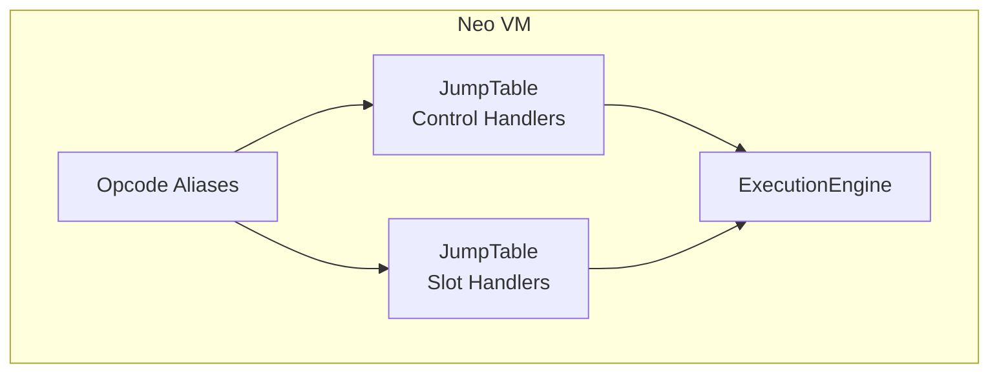
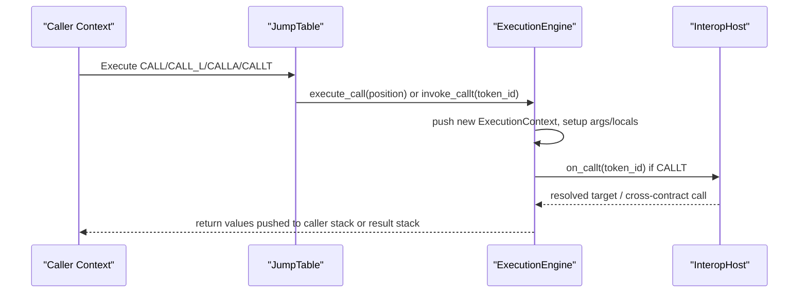
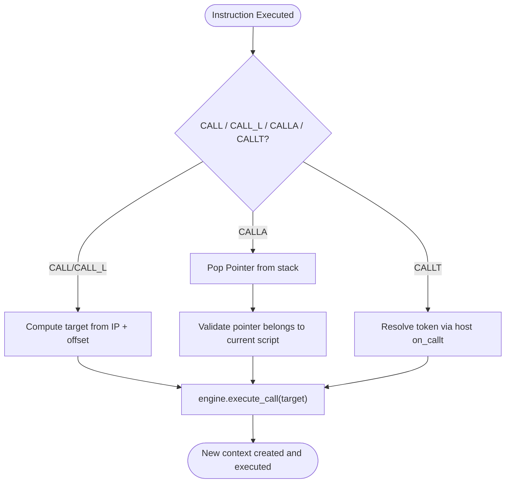
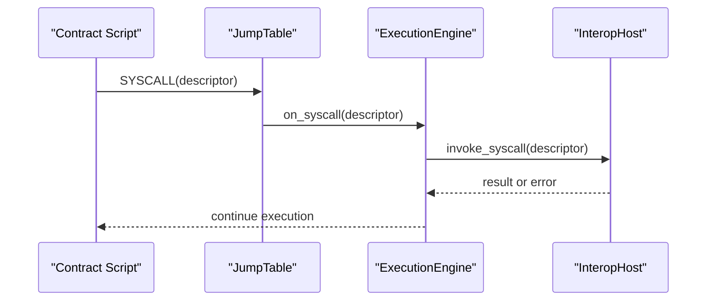
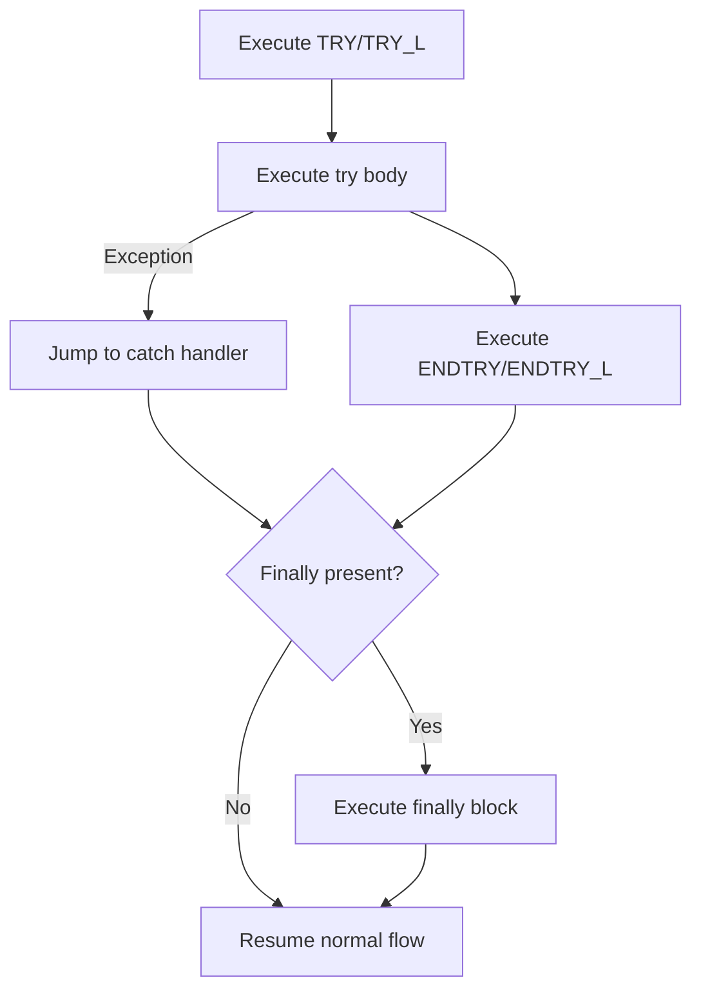
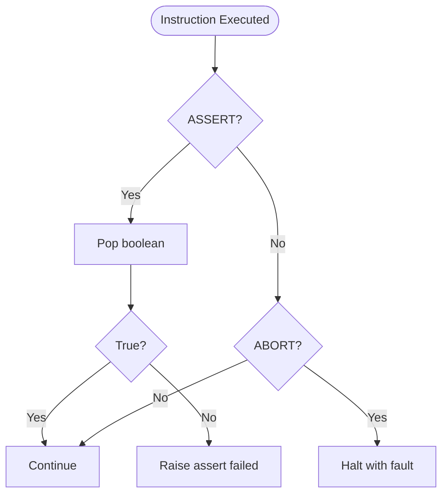
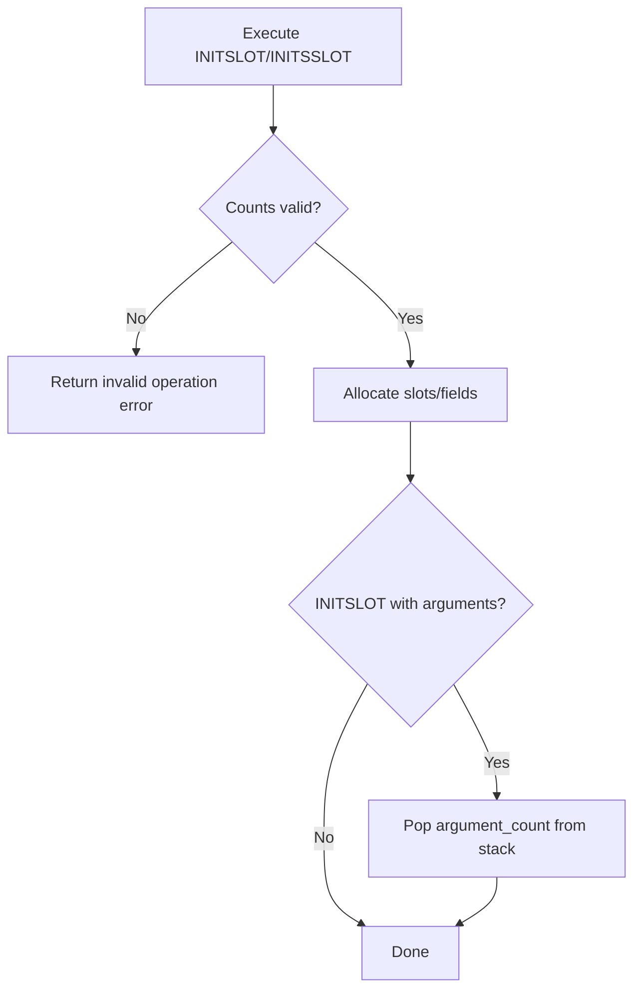
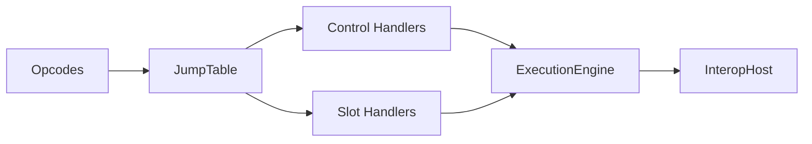

# Special Instructions

<cite>
**Referenced Files in This Document**
- [control.rs](file://neo-vm/src/jump_table/control.rs)
- [slot.rs](file://neo-vm/src/jump_table/slot.rs)
- [opcodes.rs](file://neo-vm/src/interpreter/opcodes.rs)
- [mod.rs](file://neo-vm/src/execution_engine/mod.rs)
</cite>

## Table of Contents
1. Introduction
2. Project Structure
3. Core Components
4. Architecture Overview
5. Detailed Component Analysis
6. Dependency Analysis
7. Performance Considerations
8. Troubleshooting Guide
9. Conclusion

## Introduction
This document explains the special Neo VM instructions that go beyond standard arithmetic, stack, and type operations. It focuses on:
- Function invocation and contract calls: CALL, CALL_L, CALLA, CALLT
- System-level operations and native contract invocations: SYSCALL
- Exception handling: TRY, ENDTRY, ENDFINALLY (and related THROW)
- Program validation and termination: ASSERT, ABORT
- Local and static variable initialization: INITSLOT, INITSSLOT

For each instruction, we describe semantics, parameters, stack effects, interaction with the execution environment, typical usage patterns, common pitfalls, and performance considerations. We also map these instructions to the broader VM architecture.

## Project Structure
The special instructions are implemented as handlers registered into a jump table and executed by the execution engine. The key locations are:
- Jump table control handlers for flow control, exceptions, syscalls, and calls
- Slot handlers for local/static/argument initialization and access
- Opcode aliases used by the interpreter
- Execution engine that manages contexts, stacks, gas, and host interop

**Diagram sources**
- [control.rs:11-56](file://neo-vm/src/jump_table/control.rs#L11-L56)
- [slot.rs:20-73](file://neo-vm/src/jump_table/slot.rs#L20-L73)
- [opcodes.rs:46-81](file://neo-vm/src/interpreter/opcodes.rs#L46-L81)
- [mod.rs:195-242](file://neo-vm/src/execution_engine/mod.rs#L195-L242)

**Section sources**
- [control.rs:11-56](file://neo-vm/src/jump_table/control.rs#L11-L56)
- [slot.rs:20-73](file://neo-vm/src/jump_table/slot.rs#L20-L73)
- [opcodes.rs:46-81](file://neo-vm/src/interpreter/opcodes.rs#L46-L81)
- [mod.rs:195-242](file://neo-vm/src/execution_engine/mod.rs#L195-L242)

## Core Components
- ExecutionEngine: owns invocation stack, result stack, reference counter, limits, and host interop; drives execution loop and state transitions.
- ExecutionContext: per-script context holding script bytes, instruction pointer, evaluation stack, alt stack, locals, arguments, and static fields.
- JumpTable: dispatches opcodes to handler functions.
- Host interop: provides syscall and callt resolution via InteropHost callbacks.

These components collaborate to implement CALL-family, SYSCALL, exception handling, assertion/abort, and slot initialization.

**Section sources**
- [mod.rs:195-242](file://neo-vm/src/execution_engine/mod.rs#L195-L242)

## Architecture Overview
The following diagram shows how special instructions interact with the execution engine and host:

**Diagram sources**
- [control.rs:267-317](file://neo-vm/src/jump_table/control.rs#L267-L317)
- [mod.rs:177-185](file://neo-vm/src/execution_engine/mod.rs#L177-L185)

## Detailed Component Analysis

### CALL, CALL_L, CALLA, CALLT — Function Invocation and Contract Calls

- CALL and CALL_L
  - Semantics: Call a function at a signed offset relative to the current instruction pointer.
  - Parameters: CALL uses an 8-bit offset; CALL_L uses a 32-bit offset.
  - Stack effects: No explicit stack manipulation before the call; the callee sets up its own locals/arguments as needed. Return values are handled by RET.
  - Environment interaction: Computes target position and delegates to the engine’s call machinery.
  - Typical usage: Intra-script function calls within the same script.
  - Pitfalls: Invalid offsets can cause invalid jumps; ensure offsets point to valid code positions.
  - Performance: Low overhead; primarily pointer arithmetic and context switch.

- CALLA
  - Semantics: Call a function at a pointer taken from the evaluation stack.
  - Parameters: A Pointer item must be on top of the stack.
  - Stack effects: Pops one Pointer from the stack.
  - Environment interaction: Validates that the pointer belongs to the current script (cross-script pointers are disallowed), then calls the target position.
  - Typical usage: Indirect calls within the same script using computed addresses.
  - Pitfalls: Using a pointer from another script is rejected; ensure the pointer originates from the current script.
  - Performance: Similar to CALL; includes pointer validation.

- CALLT
  - Semantics: Call a function identified by a token ID. Used for cross-contract calls and method tokens.
  - Parameters: 16-bit token ID embedded in the instruction.
  - Stack effects: None directly; argument passing follows the called contract’s ABI.
  - Environment interaction: Delegates to the host’s on_callt callback to resolve the token and perform the call.
  - Typical usage: Invoking methods on other contracts or runtime-provided entry points.
  - Pitfalls: Token resolution depends on host implementation; incorrect tokens lead to failures.
  - Performance: Depends on host resolution cost; may involve additional lookups.

**Diagram sources**
- [control.rs:267-317](file://neo-vm/src/jump_table/control.rs#L267-L317)
- [mod.rs:177-185](file://neo-vm/src/execution_engine/mod.rs#L177-L185)

**Section sources**
- [control.rs:267-317](file://neo-vm/src/jump_table/control.rs#L267-L317)
- [mod.rs:177-185](file://neo-vm/src/execution_engine/mod.rs#L177-L185)

### SYSCALL — System-Level Operations and Native Contract Invocations

- Semantics: Invoke a system service or native contract method identified by a descriptor (hash).
- Parameters: 32-bit descriptor encoded in the instruction.
- Stack effects: None directly; arguments and results follow the specific syscall contract.
- Environment interaction: Dispatches to the host’s invoke_syscall callback, which maps descriptors to concrete services/native contracts.
- Typical usage: Accessing blockchain state, crypto primitives, storage, and runtime services exposed by the host.
- Pitfalls: Unknown descriptors or insufficient permissions will fail; ensure the host exposes the expected services.
- Performance: Varies by syscall; some are cheap (e.g., simple math), others expensive (e.g., I/O or cryptographic operations).

**Diagram sources**
- [control.rs:457-461](file://neo-vm/src/jump_table/control.rs#L457-L461)
- [mod.rs:177-180](file://neo-vm/src/execution_engine/mod.rs#L177-L180)

**Section sources**
- [control.rs:457-461](file://neo-vm/src/jump_table/control.rs#L457-L461)
- [mod.rs:177-180](file://neo-vm/src/execution_engine/mod.rs#L177-L180)

### TRY, ENDTRY, ENDFINALLY — Exception Handling

- Semantics:
  - TRY/TRY_L: Begin a try block with catch and finally offsets.
  - ENDTRY/ENDTRY_L: Mark the end of a try block.
  - ENDFINALLY: End a finally block.
  - THROW: Throw an exception object from the stack.
- Parameters:
  - TRY/TRY_L: Two offsets (catch, finally).
  - ENDTRY/ENDTRY_L: One offset (end of try region).
- Stack effects: No direct stack manipulation; exceptions propagate through the engine’s exception handling logic.
- Environment interaction: Engine maintains try frames and unwinds on exceptions, invoking finally blocks when present.
- Typical usage: Encapsulate risky operations and handle errors gracefully.
- Pitfalls: Mismatched try/endtry regions or missing finally markers can cause faults; ensure offsets form balanced blocks.
- Performance: Exception handling adds overhead; prefer early validation to avoid throwing where possible.

**Diagram sources**
- [control.rs:357-386](file://neo-vm/src/jump_table/control.rs#L357-L386)

**Section sources**
- [control.rs:357-386](file://neo-vm/src/jump_table/control.rs#L357-L386)

### ASSERT, ABORT — Program Validation and Termination

- ASSERT
  - Semantics: Asserts a boolean condition; fails if false.
  - Parameters: Boolean value popped from the stack.
  - Stack effects: Pops one boolean.
  - Environment interaction: On failure, raises an assertion error; execution halts.
  - Typical usage: Pre/post conditions, invariant checks.
  - Pitfalls: Misplaced assertions can abort legitimate flows; validate inputs early.
  - Performance: Cheap check; useful for correctness but not for heavy computations.

- ABORT
  - Semantics: Immediately abort execution with a fault.
  - Parameters: None.
  - Stack effects: None.
  - Environment interaction: Sets fault state and stops execution.
  - Typical usage: Explicitly terminate on unrecoverable conditions.
  - Pitfalls: Overuse can mask logical errors; prefer structured error handling where feasible.
  - Performance: Minimal overhead; immediate halt.

**Diagram sources**
- [control.rs:319-349](file://neo-vm/src/jump_table/control.rs#L319-L349)

**Section sources**
- [control.rs:319-349](file://neo-vm/src/jump_table/control.rs#L319-L349)

### INITSSLOT, INITSLOT — Local and Static Variable Initialization

- INITSLOT
  - Semantics: Initialize local variables and arguments for the current context.
  - Parameters: Two operands: local_count and argument_count.
  - Stack effects: Consumes argument_count items from the evaluation stack to initialize arguments.
  - Environment interaction: Creates slots for locals and arguments; subsequent LDLOC/STLOC and LDARG/STARG operate on these slots.
  - Typical usage: At the start of a method to set up the calling convention.
  - Pitfalls: Cannot be executed twice; both counts cannot be zero; ensure correct operand order and counts.
  - Performance: One-time allocation; minimal overhead.

- INITSSLOT
  - Semantics: Initialize static fields for the script/module.
  - Parameters: static_count.
  - Stack effects: None.
  - Environment interaction: Allocates static field storage accessible via LDSFLD/STSFLD.
  - Typical usage: Module-level constants or shared state.
  - Pitfalls: Cannot be executed twice; static_count must be non-zero.
  - Performance: One-time allocation; minimal overhead.

**Diagram sources**
- [slot.rs:80-151](file://neo-vm/src/jump_table/slot.rs#L80-L151)

**Section sources**
- [slot.rs:80-151](file://neo-vm/src/jump_table/slot.rs#L80-L151)

## Dependency Analysis
- Opcodes are aliased and dispatched via the jump table to handler functions.
- Control handlers depend on ExecutionEngine methods for call/return, exception handling, and syscalls.
- Slot handlers depend on ExecutionContext for managing locals, arguments, and static fields.
- Host interop is invoked for syscalls and callt, decoupling VM core from platform-specific services.

**Diagram sources**
- [opcodes.rs:46-81](file://neo-vm/src/interpreter/opcodes.rs#L46-L81)
- [control.rs:11-56](file://neo-vm/src/jump_table/control.rs#L11-L56)
- [slot.rs:20-73](file://neo-vm/src/jump_table/slot.rs#L20-L73)
- [mod.rs:177-185](file://neo-vm/src/execution_engine/mod.rs#L177-L185)

**Section sources**
- [opcodes.rs:46-81](file://neo-vm/src/interpreter/opcodes.rs#L46-L81)
- [control.rs:11-56](file://neo-vm/src/jump_table/control.rs#L11-L56)
- [slot.rs:20-73](file://neo-vm/src/jump_table/slot.rs#L20-L73)
- [mod.rs:177-185](file://neo-vm/src/execution_engine/mod.rs#L177-L185)

## Performance Considerations
- CALL vs CALLT: CALL/CALL_L are intra-script and generally cheaper; CALLT involves host resolution and potential cross-contract overhead.
- SYSCALL costs vary widely; batch operations where possible and avoid hot paths that trigger expensive syscalls repeatedly.
- Exception handling: Prefer deterministic checks over throwing exceptions to reduce unwind costs.
- Slot initialization: Perform once per context; avoid redundant INITSLOT/INITSSLOT calls.
- Gas limits: Monitor gas consumption; complex calls and syscalls can quickly exhaust limits.

[No sources needed since this section provides general guidance]

## Troubleshooting Guide
Common issues and their origins:
- Invalid jumps: Offsets in CALL/CALL_L or TRY/ENDTRY may point outside valid code ranges.
- Cross-script pointers: CALLA rejects pointers not belonging to the current script.
- Double initialization: INITSLOT/INITSSLOT cannot be executed more than once per context/script.
- Assertion failures: ASSERT triggers on false conditions; inspect preconditions.
- Syscall failures: Unknown descriptors or insufficient permissions; verify host capabilities.
- Argument mismatch: Ensure INITSLOT argument_count matches actual arguments on the stack.

**Section sources**
- [control.rs:267-317](file://neo-vm/src/jump_table/control.rs#L267-L317)
- [control.rs:357-386](file://neo-vm/src/jump_table/control.rs#L357-L386)
- [slot.rs:80-151](file://neo-vm/src/jump_table/slot.rs#L80-L151)

## Conclusion
The special instructions covered here provide the backbone for control flow, inter-context calls, system integration, error handling, and memory layout in the Neo VM. Understanding their exact semantics, stack effects, and interactions with the execution engine and host is essential for writing efficient and robust smart contracts. Use CALL-family for intra-script calls and CALLT for cross-contract invocations, SYSCALL for system services, TRY/ENDTRY/ENDFINALLY for robust error handling, ASSERT/ABORT for validation and termination, and INITSLOT/INITSSLOT for proper variable management.

[No sources needed since this section summarizes without analyzing specific files]