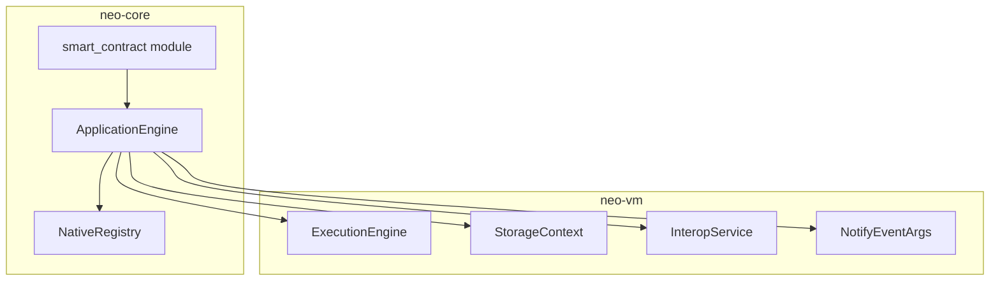
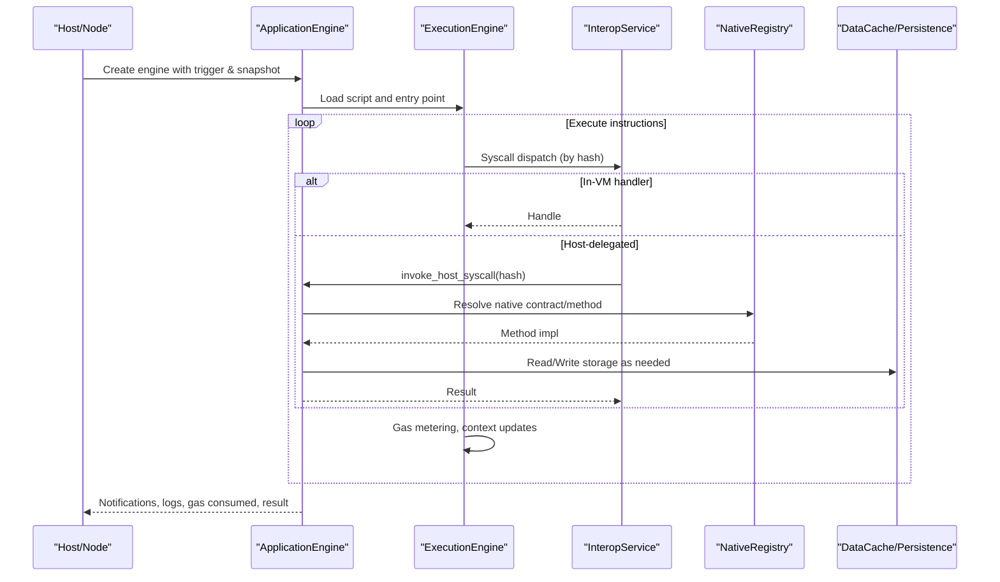
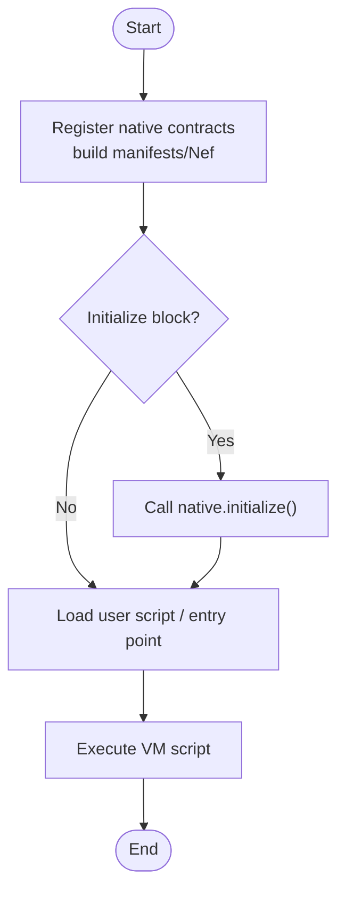
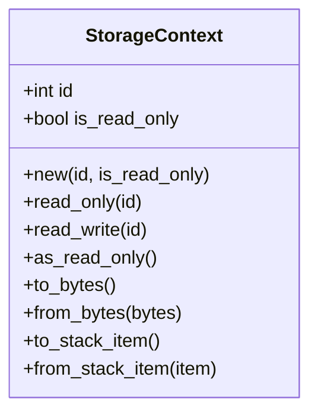
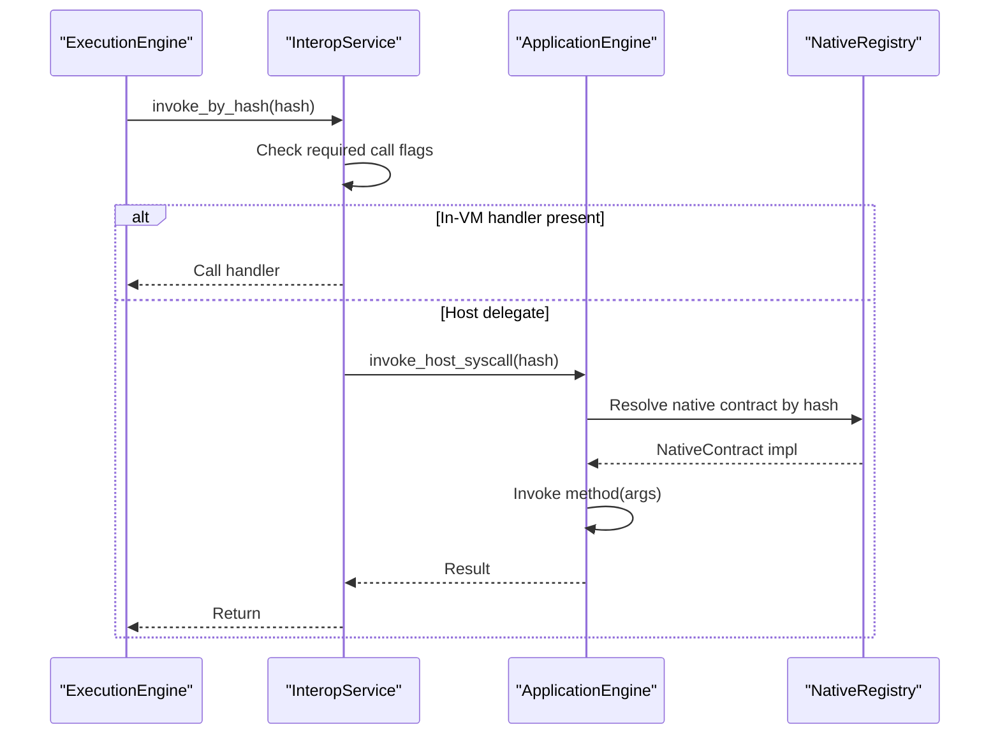
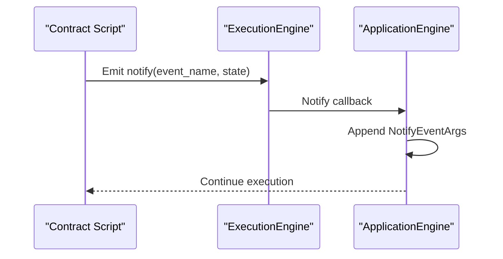
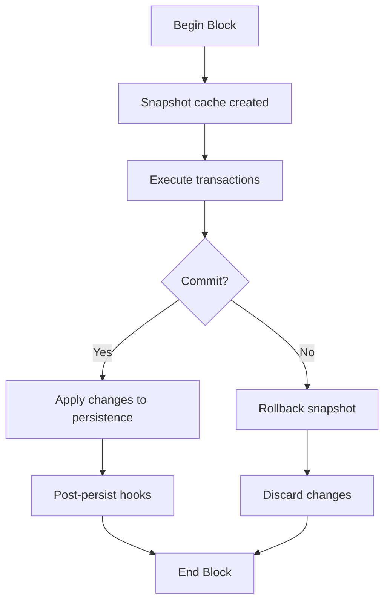
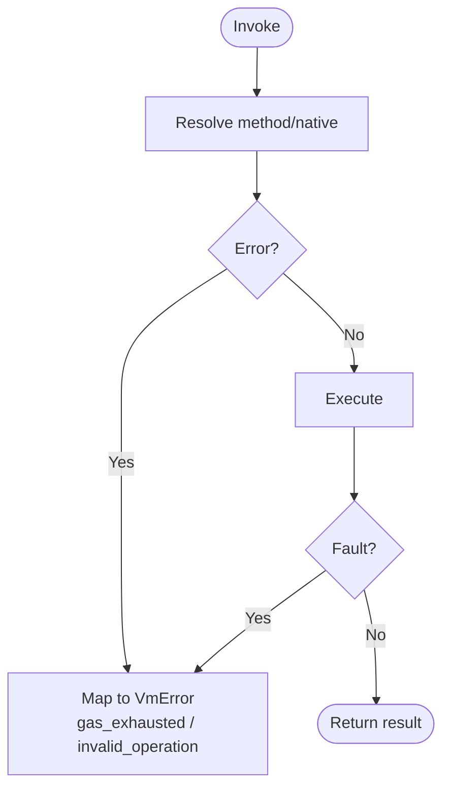
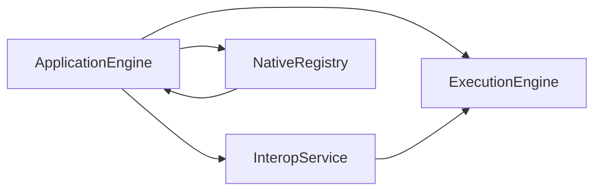

# Smart Contract Runtime

<cite>
**Referenced Files in This Document**
- [neo-core/src/smart_contract/mod.rs](file://neo-core/src/smart_contract/mod.rs)
- [neo-core/src/smart_contract/application_engine/mod.rs](file://neo-core/src/smart_contract/application_engine/mod.rs)
- [neo-core/src/smart_contract/storage_context.rs](file://neo-core/src/smart_contract/storage_context.rs)
- [neo-vm/src/lib.rs](file://neo-vm/src/lib.rs)
- [neo-vm/src/interop_service.rs](file://neo-vm/src/interop_service.rs)
- [neo-vm/src/storage_context.rs](file://neo-vm/src/storage_context.rs)
- [neo-vm/src/notify_event_args.rs](file://neo-vm/src/notify_event_args.rs)
- [neo-core/src/smart_contract/native/mod.rs](file://neo-core/src/smart_contract/native/mod.rs)
- [neo-core/src/smart_contract/native/native_contract.rs](file://neo-core/src/smart_contract/native/native_contract.rs)
</cite>

## Table of Contents
1. Introduction
2. Project Structure
3. Core Components
4. Architecture Overview
5. Detailed Component Analysis
6. Dependency Analysis
7. Performance Considerations
8. Troubleshooting Guide
9. Conclusion

## Introduction
This document explains the smart contract runtime environment implemented in this repository. It covers how contracts are deployed, initialized, and invoked; how persistent storage is accessed via a storage context; how interop services expose native functionality to smart contracts; and how events are emitted. It also details state management, persistence patterns, the interop service registry, lifecycle hooks, error handling during execution, and debugging techniques.

## Project Structure
The smart contract runtime spans two primary crates:
- neo-vm: The embedded Neo Virtual Machine with execution engine, storage context, interop service registry, and event argument types.
- neo-core: The application engine that wires VM execution to blockchain state, registers interop handlers, manages native contracts, and orchestrates deployment, invocation, and persistence.

**Diagram sources**
- [neo-vm/src/lib.rs:142-212](file://neo-vm/src/lib.rs#L142-L212)
- [neo-vm/src/interop_service.rs:126-156](file://neo-vm/src/interop_service.rs#L126-L156)
- [neo-vm/src/storage_context.rs:6-20](file://neo-vm/src/storage_context.rs#L6-L20)
- [neo-vm/src/notify_event_args.rs:9-24](file://neo-vm/src/notify_event_args.rs#L9-L24)
- [neo-core/src/smart_contract/application_engine/mod.rs:209-248](file://neo-core/src/smart_contract/application_engine/mod.rs#L209-L248)
- [neo-core/src/smart_contract/native/mod.rs:91-197](file://neo-core/src/smart_contract/native/mod.rs#L91-L197)
- [neo-core/src/smart_contract/mod.rs:56-85](file://neo-core/src/smart_contract/mod.rs#L56-L85)

**Section sources**
- [neo-vm/src/lib.rs:142-212](file://neo-vm/src/lib.rs#L142-L212)
- [neo-core/src/smart_contract/mod.rs:56-85](file://neo-core/src/smart_contract/mod.rs#L56-L85)

## Core Components
- ApplicationEngine: Orchestrates script loading, execution, gas accounting, notifications/logs collection, and persistence boundaries. It hosts interop handlers and integrates native contracts.
- ExecutionEngine (VM): Executes scripts, manages call stack and contexts, and dispatches syscalls through InteropService.
- InteropService: Registry of syscall descriptors with name-to-hash mapping, price, required call flags, and optional in-VM handlers or host delegation.
- StorageContext: Per-contract storage handle with read-only/read-write modes and serialization for stack interoperability.
- NativeRegistry: Central registry of built-in native contracts (NEO, GAS, Policy, Ledger, etc.) used by the runtime.
- NotifyEventArgs: Event payload emitted by System.Runtime.Notify, including container reference, script hash, event name, and state.

**Section sources**
- [neo-core/src/smart_contract/application_engine/mod.rs:209-248](file://neo-core/src/smart_contract/application_engine/mod.rs#L209-L248)
- [neo-vm/src/lib.rs:167-194](file://neo-vm/src/lib.rs#L167-L194)
- [neo-vm/src/interop_service.rs:18-41](file://neo-vm/src/interop_service.rs#L18-L41)
- [neo-vm/src/storage_context.rs:6-20](file://neo-vm/src/storage_context.rs#L6-L20)
- [neo-core/src/smart_contract/native/mod.rs:91-197](file://neo-core/src/smart_contract/native/mod.rs#L91-L197)
- [neo-vm/src/notify_event_args.rs:9-24](file://neo-vm/src/notify_event_args.rs#L9-L24)

## Architecture Overview
The runtime composes a layered architecture:
- Layer 0 (Foundation): primitives, IO, crypto.
- Layer 1 (Core): neo-vm embedded runtime (execution engine, storage context, interop service).
- Layer 2 (Service): ApplicationEngine wiring VM to blockchain state, native contracts, and persistence.

**Diagram sources**
- [neo-core/src/smart_contract/application_engine/mod.rs:209-248](file://neo-core/src/smart_contract/application_engine/mod.rs#L209-L248)
- [neo-vm/src/interop_service.rs:187-228](file://neo-vm/src/interop_service.rs#L187-L228)
- [neo-core/src/smart_contract/native/mod.rs:91-197](file://neo-core/src/smart_contract/native/mod.rs#L91-L197)

## Detailed Component Analysis

### Contract Deployment, Initialization, and Invocation
- Deployment: Native contracts are registered at startup via NativeRegistry, which builds their manifest and NEF automatically from method metadata. User contracts are loaded into the engine’s contract store when invoked or persisted by system logic.
- Initialization: Native contracts implement initialize/on_persist/post_persist hooks invoked by the application engine at appropriate block boundaries.
- Invocation: Contracts are invoked through the VM with an entry script; cross-contract calls use CALLT resolved by the host. Native methods are exposed via System.Contract.CallNative and resolved by the native registry.

**Diagram sources**
- [neo-core/src/smart_contract/native/mod.rs:159-197](file://neo-core/src/smart_contract/native/mod.rs#L159-L197)
- [neo-core/src/smart_contract/native/native_contract.rs:138-159](file://neo-core/src/smart_contract/native/native_contract.rs#L138-L159)
- [neo-core/src/smart_contract/native/native_contract.rs:437-512](file://neo-core/src/smart_contract/native/native_contract.rs#L437-L512)

**Section sources**
- [neo-core/src/smart_contract/native/mod.rs:159-197](file://neo-core/src/smart_contract/native/mod.rs#L159-L197)
- [neo-core/src/smart_contract/native/native_contract.rs:138-159](file://neo-core/src/smart_contract/native/native_contract.rs#L138-L159)
- [neo-core/src/smart_contract/native/native_contract.rs:437-512](file://neo-core/src/smart_contract/native/native_contract.rs#L437-L512)

### Storage Context and Persistent Data Access
- StorageContext identifies per-contract storage scope and enforces read-only semantics where applicable. It serializes to a compact byte representation for stack interoperability.
- ApplicationEngine exposes high-level storage operations backed by DataCache and persistence layers. Low-level storage access is provided for fine-grained control.

**Diagram sources**
- [neo-vm/src/storage_context.rs:6-118](file://neo-vm/src/storage_context.rs#L6-L118)

**Section sources**
- [neo-vm/src/storage_context.rs:6-118](file://neo-vm/src/storage_context.rs#L6-L118)
- [neo-core/src/smart_contract/storage_context.rs:1-3](file://neo-core/src/smart_contract/storage_context.rs#L1-L3)
- [neo-core/src/smart_contract/application_engine/mod.rs:209-248](file://neo-core/src/smart_contract/application_engine/mod.rs#L209-L248)

### Interop Service Registry and Native Contract Exposure
- InteropService maps syscall names to descriptors, computes hashes, validates required call flags, charges fixed prices, and either executes in-VM handlers or delegates to the host.
- Native contracts are exposed to smart contracts via System.Contract.CallNative. The native registry resolves the target contract by hash and invokes the requested method.

**Diagram sources**
- [neo-vm/src/interop_service.rs:187-228](file://neo-vm/src/interop_service.rs#L187-L228)
- [neo-core/src/smart_contract/native/mod.rs:91-197](file://neo-core/src/smart_contract/native/mod.rs#L91-L197)
- [neo-core/src/smart_contract/native/native_contract.rs:138-159](file://neo-core/src/smart_contract/native/native_contract.rs#L138-L159)

**Section sources**
- [neo-vm/src/interop_service.rs:18-41](file://neo-vm/src/interop_service.rs#L18-L41)
- [neo-vm/src/interop_service.rs:187-228](file://neo-vm/src/interop_service.rs#L187-L228)
- [neo-core/src/smart_contract/native/mod.rs:91-197](file://neo-core/src/smart_contract/native/mod.rs#L91-L197)

### Event Notification System
- Events are emitted using System.Runtime.Notify. The runtime captures NotifyEventArgs containing the container, script hash, event name, and state array. These are collected by ApplicationEngine and can be observed by node services.

**Diagram sources**
- [neo-vm/src/notify_event_args.rs:9-24](file://neo-vm/src/notify_event_args.rs#L9-L24)
- [neo-core/src/smart_contract/application_engine/mod.rs:209-248](file://neo-core/src/smart_contract/application_engine/mod.rs#L209-L248)

**Section sources**
- [neo-vm/src/notify_event_args.rs:9-24](file://neo-vm/src/notify_event_args.rs#L9-L24)
- [neo-core/src/smart_contract/mod.rs:38-45](file://neo-core/src/smart_contract/mod.rs#L38-L45)

### Contract State Management and Persistence Patterns
- Contract state includes both on-chain data (via StorageContext/DataCache) and in-memory runtime state (e.g., iterators, pending native calls, invocation counters).
- Persistence boundaries align with block persistence phases (OnPersist/PostPersist), ensuring consistent snapshots and rollbacks.

[No sources needed since this diagram shows conceptual workflow, not actual code structure]

**Section sources**
- [neo-core/src/smart_contract/application_engine/mod.rs:209-248](file://neo-core/src/smart_contract/application_engine/mod.rs#L209-L248)

### Lifecycle Hooks and Error Handling
- Lifecycle: Native contracts implement initialize, on_persist, post_persist to manage state transitions across blocks.
- Error handling: VM errors propagate through VmResult; insufficient gas becomes gas_exhausted; invalid operations raise descriptive errors. ApplicationEngine maps core errors to VM errors and collects faults for diagnostics.

**Diagram sources**
- [neo-core/src/smart_contract/application_engine/mod.rs:162-170](file://neo-core/src/smart_contract/application_engine/mod.rs#L162-L170)
- [neo-vm/src/interop_service.rs:197-228](file://neo-vm/src/interop_service.rs#L197-L228)

**Section sources**
- [neo-core/src/smart_contract/application_engine/mod.rs:162-170](file://neo-core/src/smart_contract/application_engine/mod.rs#L162-L170)
- [neo-core/src/smart_contract/native/native_contract.rs:138-159](file://neo-core/src/smart_contract/native/native_contract.rs#L138-L159)

### Examples of Common Operations
- Contract deployment: Register native contracts and build manifests/Nef; user contracts are loaded via invocation and stored in the engine’s contract map.
- Method invocation: Use CALLT or System.Contract.CallNative to invoke user or native methods.
- Storage operations: Use StorageContext to read/write/delete/find keys within a contract’s scope.
- Event emission: Emit events via System.Runtime.Notify; observe NotifyEventArgs.

[No sources needed since this section provides general guidance without analyzing specific files]

## Dependency Analysis
The runtime exhibits clear layering and controlled coupling:
- ApplicationEngine depends on VM ExecutionEngine, InteropService, NativeRegistry, and persistence caches.
- InteropService depends on ExecutionEngine and CallFlags; it delegates to the host for syscalls without in-VM handlers.
- NativeRegistry encapsulates all built-in contracts and their activation rules.

**Diagram sources**
- [neo-core/src/smart_contract/application_engine/mod.rs:209-248](file://neo-core/src/smart_contract/application_engine/mod.rs#L209-L248)
- [neo-vm/src/interop_service.rs:126-156](file://neo-vm/src/interop_service.rs#L126-L156)
- [neo-core/src/smart_contract/native/mod.rs:91-197](file://neo-core/src/smart_contract/native/mod.rs#L91-L197)

**Section sources**
- [neo-core/src/smart_contract/application_engine/mod.rs:209-248](file://neo-core/src/smart_contract/application_engine/mod.rs#L209-L248)
- [neo-vm/src/interop_service.rs:126-156](file://neo-vm/src/interop_service.rs#L126-L156)
- [neo-core/src/smart_contract/native/mod.rs:91-197](file://neo-core/src/smart_contract/native/mod.rs#L91-L197)

## Performance Considerations
- Gas metering: Every instruction and syscall incurs cost; ensure efficient scripts and avoid excessive storage writes.
- Storage costs: Reads and writes have different costs; batch operations and minimize key churn.
- Iterator usage: Prefer iterators for large scans to avoid memory pressure.
- Native calls: Batch native interactions where possible to reduce overhead.

[No sources needed since this section provides general guidance]

## Troubleshooting Guide
Common issues and diagnostics:
- Insufficient gas: Errors map to gas_exhausted; increase gas limit or optimize script.
- Missing syscall registration: Ensure InteropService has the descriptor or host is configured.
- Invalid call flags: Verify required_call_flags match the current call context.
- Storage context misuse: Ensure correct read-only vs read-write mode and valid context bytes.
- Event size/name limits: Respect maximum notification size and event name length enforced by the runtime.

**Section sources**
- [neo-core/src/smart_contract/application_engine/mod.rs:139-150](file://neo-core/src/smart_contract/application_engine/mod.rs#L139-L150)
- [neo-vm/src/interop_service.rs:197-228](file://neo-vm/src/interop_service.rs#L197-L228)
- [neo-vm/src/storage_context.rs:46-70](file://neo-vm/src/storage_context.rs#L46-L70)

## Conclusion
The smart contract runtime combines a robust VM with a flexible interop registry and a comprehensive application engine. Contracts interact with storage through typed contexts, call native services via a well-defined syscall mechanism, and emit events captured by the node. Lifecycle hooks and strict error handling ensure deterministic, auditable execution aligned with protocol semantics.