# P2P Networking

<cite>
**Referenced Files in This Document**
- [neo-p2p/src/lib.rs](file://neo-p2p/src/lib.rs)
- [neo-p2p/src/message.rs](file://neo-p2p/src/message.rs)
- [neo-p2p/src/message_command.rs](file://neo-p2p/src/message_command.rs)
- [neo-p2p/src/inventory_type.rs](file://neo-p2p/src/inventory_type.rs)
- [neo-p2p/src/payloads/mod.rs](file://neo-p2p/src/payloads/mod.rs)
- [neo-p2p/src/payloads/version_payload.rs](file://neo-p2p/src/payloads/version_payload.rs)
- [neo-p2p/src/payloads/inv_payload.rs](file://neo-p2p/src/payloads/inv_payload.rs)
- [neo-p2p/src/payloads/get_blocks_payload.rs](file://neo-p2p/src/payloads/get_blocks_payload.rs)
- [neo-core/src/network/p2p/mod.rs](file://neo-core/src/network/p2p/mod.rs)
</cite>

## Table of Contents
1. [Introduction](#introduction)
2. [Project Structure](#project-structure)
3. [Core Components](#core-components)
4. [Architecture Overview](#architecture-overview)
5. [Detailed Component Analysis](#detailed-component-analysis)
6. [Dependency Analysis](#dependency-analysis)
7. [Performance Considerations](#performance-considerations)
8. [Troubleshooting Guide](#troubleshooting-guide)
9. [Conclusion](#conclusion)

## Introduction
This document explains the Neo N3 P2P networking layer as implemented in this repository. It covers message framing, command types, payload structures, protocol versioning, peer discovery and connection management, synchronization flows for blocks and transactions, inventory management, request/response patterns, local and remote node abstractions, task/session handling, examples for custom messages and diagnostics, and security/performance considerations including rate limiting and high-throughput tuning.

## Project Structure
The P2P stack is split into two layers:
- neo-p2p: Lightweight protocol primitives (message framing, commands, payloads, enums).
- neo-core::network::p2p: Full runtime implementation (connections, peers, tasks, sessions, reputation, rate limiting).

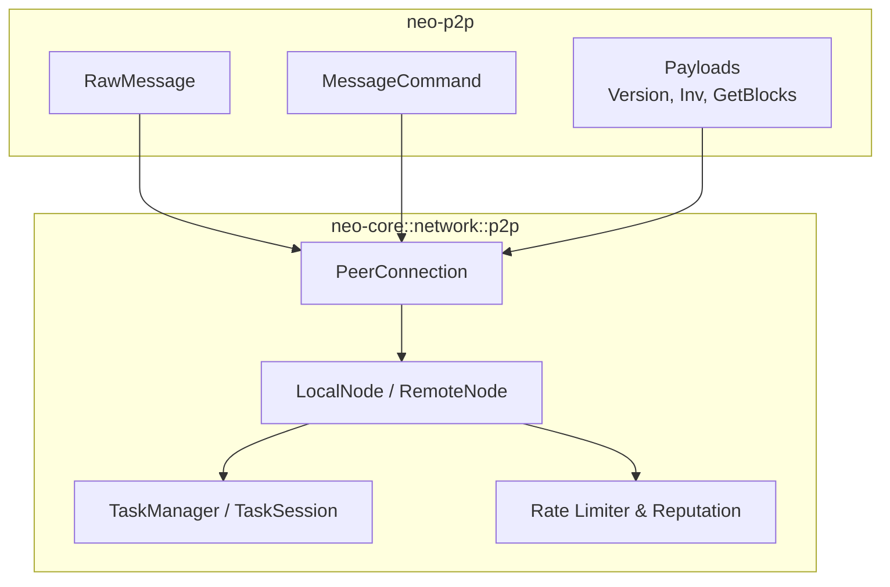

**Diagram sources**
- [neo-p2p/src/message.rs:17-29](file://neo-p2p/src/message.rs#L17-L29)
- [neo-p2p/src/message_command.rs:6-18](file://neo-p2p/src/message_command.rs#L6-L18)
- [neo-p2p/src/payloads/mod.rs:8-27](file://neo-p2p/src/payloads/mod.rs#L8-L27)
- [neo-core/src/network/p2p/mod.rs:69-92](file://neo-core/src/network/p2p/mod.rs#L69-L92)

**Section sources**
- [neo-p2p/src/lib.rs:6-118](file://neo-p2p/src/lib.rs#L6-L118)
- [neo-core/src/network/p2p/mod.rs:12-45](file://neo-core/src/network/p2p/mod.rs#L12-L45)

## Core Components
- Message framing: RawMessage carries flags, command, and payload bytes with optional LZ4 compression.
- Commands: MessageCommand enumerates all P2P commands and classifies single-queued and high-priority commands.
- Payloads: VersionPayload (handshake), InvPayload (inventory announcements), GetBlocksPayload (block requests), plus others re-exported from payloads module.
- Inventory mapping: InventoryType maps to corresponding MessageCommand for relay and data exchange.
- Runtime helpers: Inbound rate limiter, peer reputation tracking, ban list, endpoint validation.

Key responsibilities:
- Wire format serialization/deserialization and size limits.
- Command routing hints (priority, queue deduplication).
- Protocol handshake and capability negotiation via VersionPayload.
- Inventory-driven sync using InvPayload and GetBlocksPayload.
- Security controls: inbound rate limiting, reputation scoring, banning, endpoint validation.

**Section sources**
- [neo-p2p/src/message.rs:11-105](file://neo-p2p/src/message.rs#L11-L105)
- [neo-p2p/src/message_command.rs:22-53](file://neo-p2p/src/message_command.rs#L22-L53)
- [neo-p2p/src/payloads/version_payload.rs:20-111](file://neo-p2p/src/payloads/version_payload.rs#L20-L111)
- [neo-p2p/src/payloads/inv_payload.rs:8-102](file://neo-p2p/src/payloads/inv_payload.rs#L8-L102)
- [neo-p2p/src/payloads/get_blocks_payload.rs:16-44](file://neo-p2p/src/payloads/get_blocks_payload.rs#L16-L44)
- [neo-core/src/network/p2p/mod.rs:94-204](file://neo-core/src/network/p2p/mod.rs#L94-L204)
- [neo-core/src/network/p2p/mod.rs:229-363](file://neo-core/src/network/p2p/mod.rs#L229-L363)
- [neo-core/src/network/p2p/mod.rs:443-472](file://neo-core/src/network/p2p/mod.rs#L443-L472)

## Architecture Overview
The P2P layer uses a TCP-based wire format without per-message magic or checksums; integrity relies on TCP and higher-level signatures. The handshake exchanges VersionPayload to negotiate capabilities and network identity. Inventory-driven synchronization uses InvPayload to announce hashes, followed by GetData/Block/Transaction exchanges. Request/response patterns are implemented via paired commands (e.g., GetBlocks -> Block(s)).

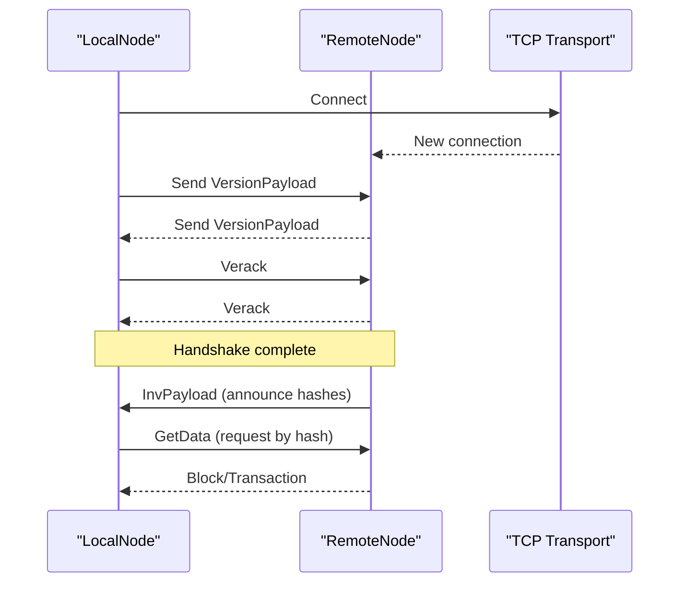

**Diagram sources**
- [neo-p2p/src/payloads/version_payload.rs:26-71](file://neo-p2p/src/payloads/version_payload.rs#L26-L71)
- [neo-p2p/src/payloads/inv_payload.rs:16-42](file://neo-p2p/src/payloads/inv_payload.rs#L16-L42)
- [neo-p2p/src/message.rs:51-70](file://neo-p2p/src/message.rs#L51-L70)

## Detailed Component Analysis

### Message Framing and Compression
- RawMessage holds flags, command, and uncompressed payload bytes.
- Serialization optionally compresses payloads using LZ4 when enabled and beneficial.
- Deserialization enforces maximum payload size and handles decompression.

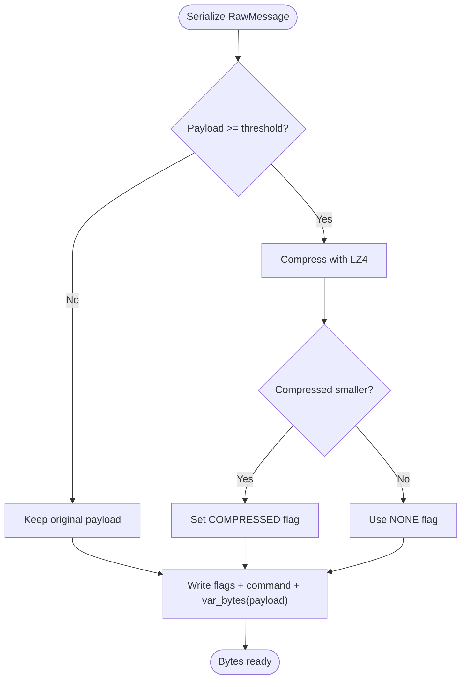

**Diagram sources**
- [neo-p2p/src/message.rs:51-70](file://neo-p2p/src/message.rs#L51-L70)
- [neo-p2p/src/message.rs:73-104](file://neo-p2p/src/message.rs#L73-L104)

**Section sources**
- [neo-p2p/src/message.rs:11-105](file://neo-p2p/src/message.rs#L11-L105)

### Message Commands and Prioritization
- MessageCommand defines all P2P commands and provides:
  - Single-queued set to avoid redundant requests (e.g., GetAddr, GetBlocks, Ping).
  - High-priority set for critical control traffic (e.g., Extensible, FilterLoad).
- Unknown commands are preserved for forward compatibility.

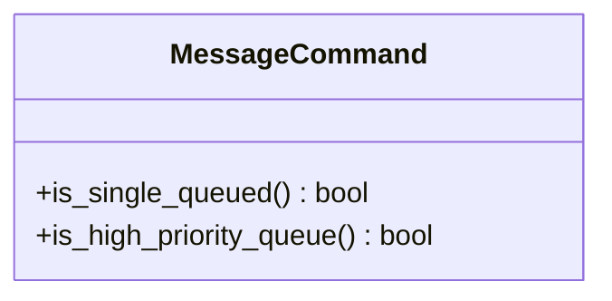

**Diagram sources**
- [neo-p2p/src/message_command.rs:22-53](file://neo-p2p/src/message_command.rs#L22-L53)

**Section sources**
- [neo-p2p/src/message_command.rs:6-18](file://neo-p2p/src/message_command.rs#L6-L18)
- [neo-p2p/src/message_command.rs:22-53](file://neo-p2p/src/message_command.rs#L22-L53)

### Inventory and Synchronization
- InvPayload announces lists of hashes for Blocks, Transactions, or Extensible items, with a maximum count per message.
- GetBlocksPayload requests blocks starting at a given hash with a bounded count.
- InventoryType maps to appropriate MessageCommand for relay and data retrieval.

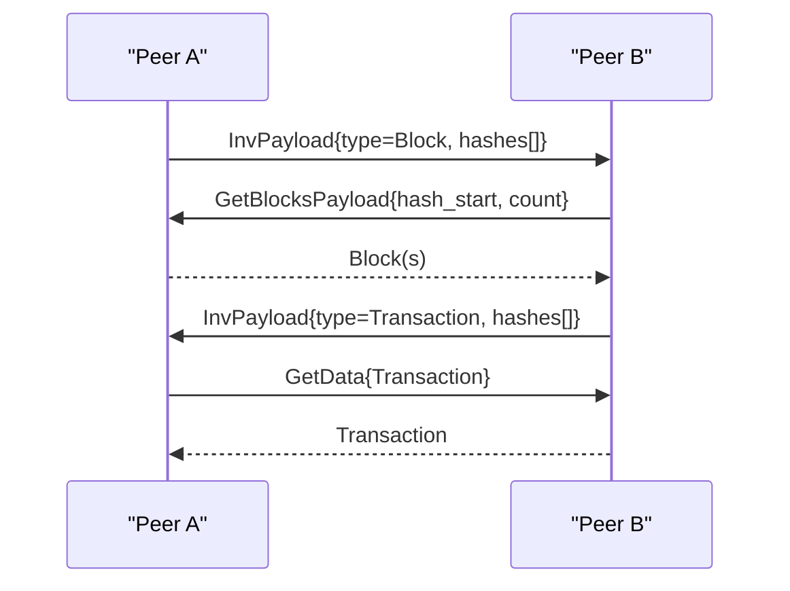

**Diagram sources**
- [neo-p2p/src/payloads/inv_payload.rs:16-58](file://neo-p2p/src/payloads/inv_payload.rs#L16-L58)
- [neo-p2p/src/payloads/get_blocks_payload.rs:16-44](file://neo-p2p/src/payloads/get_blocks_payload.rs#L16-L44)
- [neo-p2p/src/inventory_type.rs:8-17](file://neo-p2p/src/inventory_type.rs#L8-L17)

**Section sources**
- [neo-p2p/src/payloads/inv_payload.rs:8-102](file://neo-p2p/src/payloads/inv_payload.rs#L8-L102)
- [neo-p2p/src/payloads/get_blocks_payload.rs:16-44](file://neo-p2p/src/payloads/get_blocks_payload.rs#L16-L44)
- [neo-p2p/src/inventory_type.rs:1-17](file://neo-p2p/src/inventory_type.rs#L1-L17)

### Protocol Versioning and Handshake
- VersionPayload includes network magic, protocol version, timestamp, nonce, user agent, and capabilities.
- PROTOCOL_VERSION constant defines the current version used during handshake.
- Capabilities allow negotiating features between peers.

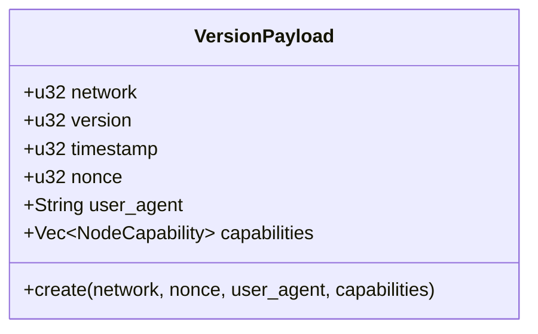

**Diagram sources**
- [neo-p2p/src/payloads/version_payload.rs:20-71](file://neo-p2p/src/payloads/version_payload.rs#L20-L71)
- [neo-p2p/src/payloads/version_payload.rs:73-111](file://neo-p2p/src/payloads/version_payload.rs#L73-L111)

**Section sources**
- [neo-p2p/src/payloads/version_payload.rs:20-111](file://neo-p2p/src/payloads/version_payload.rs#L20-L111)

### Local Node and Remote Node Abstractions
- LocalNode and RemoteNode are exposed from neo-core::network::p2p for full runtime behavior (connection lifecycle, message routing, task scheduling).
- These components coordinate peer discovery, synchronization, and message handling across the network.

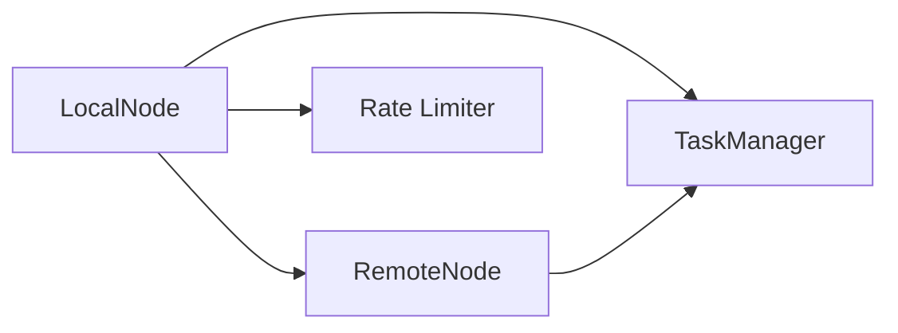

**Diagram sources**
- [neo-core/src/network/p2p/mod.rs:69-92](file://neo-core/src/network/p2p/mod.rs#L69-L92)

**Section sources**
- [neo-core/src/network/p2p/mod.rs:69-92](file://neo-core/src/network/p2p/mod.rs#L69-L92)

### Task Management and Session Handling
- TaskManager and TaskSession orchestrate background work such as block/transaction sync, inventory processing, and keepalive tasks.
- They integrate with LocalNode/RemoteNode to schedule and track long-running operations.

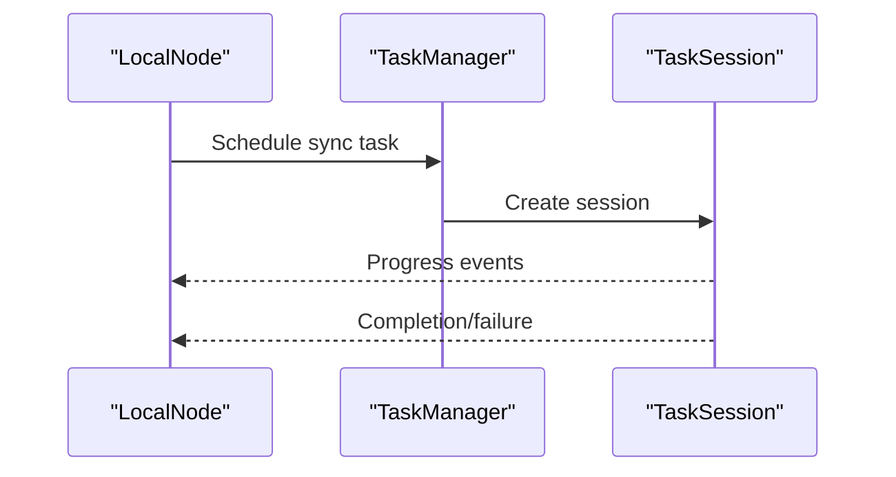

**Diagram sources**
- [neo-core/src/network/p2p/mod.rs:69-92](file://neo-core/src/network/p2p/mod.rs#L69-L92)

**Section sources**
- [neo-core/src/network/p2p/mod.rs:69-92](file://neo-core/src/network/p2p/mod.rs#L69-L92)

### Peer Discovery and Connection Management
- Endpoint validation rejects unspecified, multicast, broadcast addresses and invalid ports before connecting.
- Inbound connections are rate-limited to protect against floods.
- Peer reputation tracks violations and contributions; misbehaving peers can be banned.

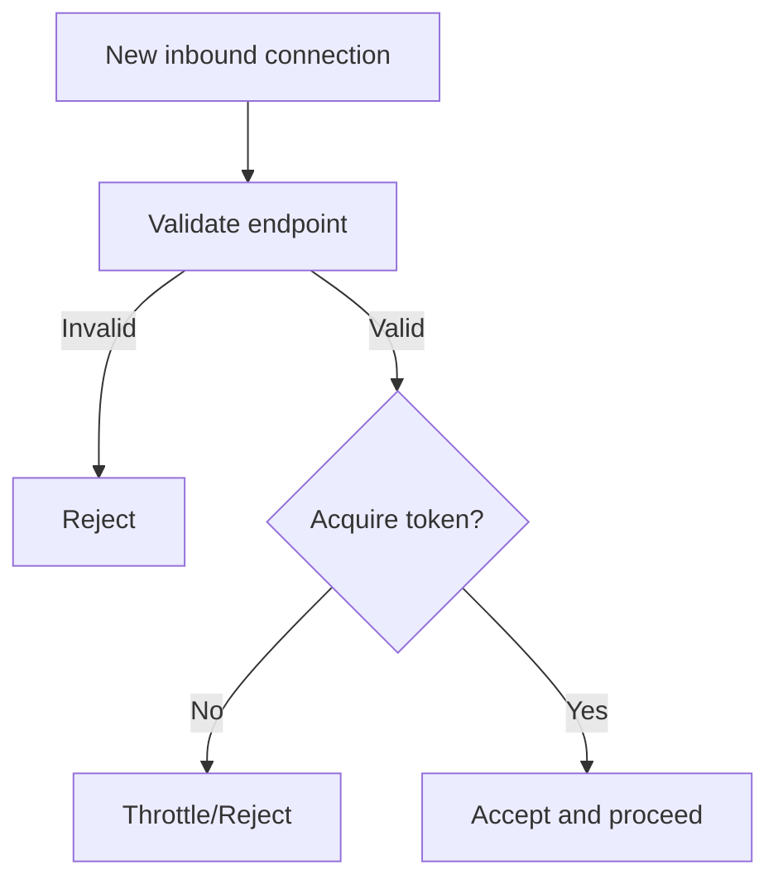

**Diagram sources**
- [neo-core/src/network/p2p/mod.rs:94-204](file://neo-core/src/network/p2p/mod.rs#L94-L204)
- [neo-core/src/network/p2p/mod.rs:443-472](file://neo-core/src/network/p2p/mod.rs#L443-L472)

**Section sources**
- [neo-core/src/network/p2p/mod.rs:94-204](file://neo-core/src/network/p2p/mod.rs#L94-L204)
- [neo-core/src/network/p2p/mod.rs:443-472](file://neo-core/src/network/p2p/mod.rs#L443-L472)

### Request/Response Patterns
- Typical pairs:
  - GetBlocksPayload -> Block(s)
  - InvPayload -> GetData -> Block/Transaction
  - Keepalive: Ping/Pong
- Commands may be single-queued to prevent duplicate in-flight requests.

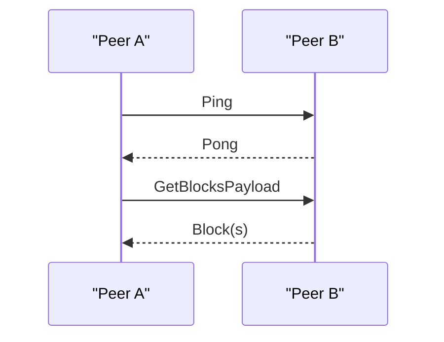

**Diagram sources**
- [neo-p2p/src/message_command.rs:22-53](file://neo-p2p/src/message_command.rs#L22-L53)
- [neo-p2p/src/payloads/get_blocks_payload.rs:16-44](file://neo-p2p/src/payloads/get_blocks_payload.rs#L16-L44)

**Section sources**
- [neo-p2p/src/message_command.rs:22-53](file://neo-p2p/src/message_command.rs#L22-L53)
- [neo-p2p/src/payloads/get_blocks_payload.rs:16-44](file://neo-p2p/src/payloads/get_blocks_payload.rs#L16-L44)

### Examples

- Custom message creation:
  - Build a RawMessage with a chosen MessageCommand and serialized payload; optionally enable compression for large payloads.
  - Path reference: [neo-p2p/src/message.rs:31-70](file://neo-p2p/src/message.rs#L31-L70)

- Peer interaction (sync flow):
  - Exchange VersionPayload during handshake, then use InvPayload and GetBlocksPayload to synchronize blocks and transactions.
  - Path references:
    - [neo-p2p/src/payloads/version_payload.rs:26-71](file://neo-p2p/src/payloads/version_payload.rs#L26-L71)
    - [neo-p2p/src/payloads/inv_payload.rs:16-58](file://neo-p2p/src/payloads/inv_payload.rs#L16-L58)
    - [neo-p2p/src/payloads/get_blocks_payload.rs:16-44](file://neo-p2p/src/payloads/get_blocks_payload.rs#L16-L44)

- Network diagnostics:
  - Use InboundRateLimiter.available_tokens to monitor inbound capacity.
  - Inspect BanList.active_bans and PeerReputationTracker metrics to assess peer health.
  - Path references:
    - [neo-core/src/network/p2p/mod.rs:176-186](file://neo-core/src/network/p2p/mod.rs#L176-L186)
    - [neo-core/src/network/p2p/mod.rs:311-363](file://neo-core/src/network/p2p/mod.rs#L311-L363)
    - [neo-core/src/network/p2p/mod.rs:474-543](file://neo-core/src/network/p2p/mod.rs#L474-L543)

## Dependency Analysis
- neo-p2p depends on neo-io for serialization/compression and neo-primitives for core types.
- neo-core::network::p2p builds on neo-p2p primitives and adds runtime services (rate limiting, reputation, task management).

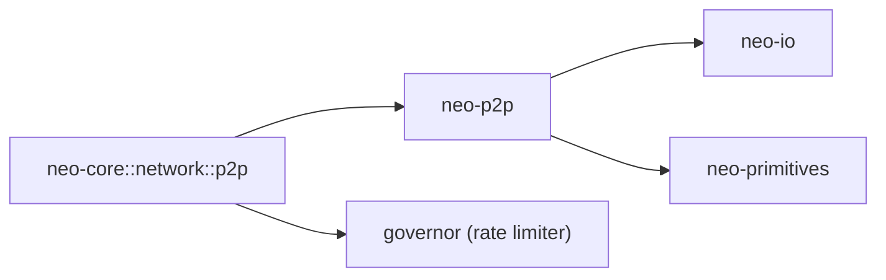

**Diagram sources**
- [neo-p2p/src/lib.rs:165-213](file://neo-p2p/src/lib.rs#L165-L213)
- [neo-core/src/network/p2p/mod.rs:123-129](file://neo-core/src/network/p2p/mod.rs#L123-L129)

**Section sources**
- [neo-p2p/src/lib.rs:165-213](file://neo-p2p/src/lib.rs#L165-L213)
- [neo-core/src/network/p2p/mod.rs:123-129](file://neo-core/src/network/p2p/mod.rs#L123-L129)

## Performance Considerations
- Compression: Enable LZ4 for large payloads when it reduces size; thresholds and flags are handled automatically during serialization.
- Batch sizes: InvPayload supports up to a defined maximum number of hashes per message; chunk large inventories accordingly.
- Priority queues: Route high-priority commands (e.g., Extensible, FilterLoad) through prioritized paths to reduce latency.
- Rate limiting: Tune inbound connection rate and burst to match expected topology and protection needs.
- Task scheduling: Use TaskManager/TaskSession to parallelize sync work while respecting backpressure.

[No sources needed since this section provides general guidance]

## Troubleshooting Guide
Common issues and remedies:
- Unknown command errors: Ensure both peers support the same command set; unknown commands are preserved but not processed.
- Payload too large: Enforced by maximum payload size; split inventories into multiple InvPayload messages.
- Excessive inbound connections: Adjust rate limiter settings; monitor available tokens and consider increasing burst cautiously.
- Misbehaving peers: Track reputation and apply bans when thresholds are exceeded; clean expired bans periodically.
- Invalid endpoints: Validate peer endpoints before connecting to reject malformed or unsafe addresses.

**Section sources**
- [neo-p2p/src/message.rs:73-104](file://neo-p2p/src/message.rs#L73-L104)
- [neo-p2p/src/payloads/inv_payload.rs:8-15](file://neo-p2p/src/payloads/inv_payload.rs#L8-L15)
- [neo-core/src/network/p2p/mod.rs:94-204](file://neo-core/src/network/p2p/mod.rs#L94-L204)
- [neo-core/src/network/p2p/mod.rs:229-363](file://neo-core/src/network/p2p/mod.rs#L229-L363)
- [neo-core/src/network/p2p/mod.rs:443-472](file://neo-core/src/network/p2p/mod.rs#L443-L472)

## Conclusion
The Neo N3 P2P layer in this repository provides a robust, efficient foundation for peer-to-peer communication. It separates protocol primitives (neo-p2p) from runtime orchestration (neo-core::network::p2p), enabling flexible integration and clear boundaries. With explicit message framing, command classification, inventory-driven synchronization, and strong security/performance controls (rate limiting, reputation, banning), it supports high-throughput, resilient blockchain operation. For production deployments, combine these controls with operational best practices and monitoring to maintain stability and security.