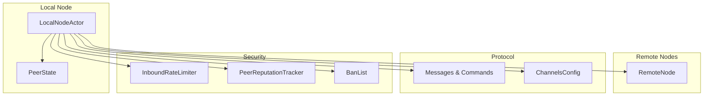
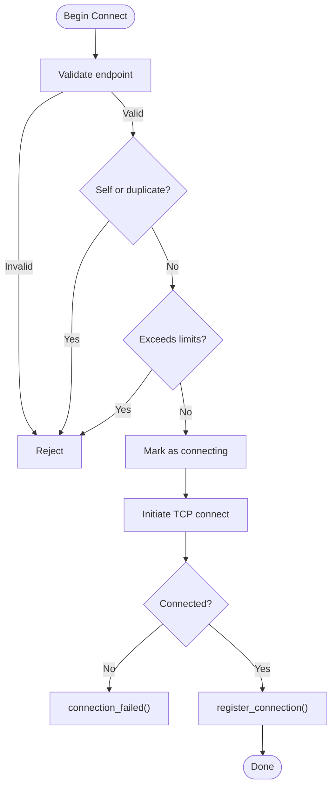
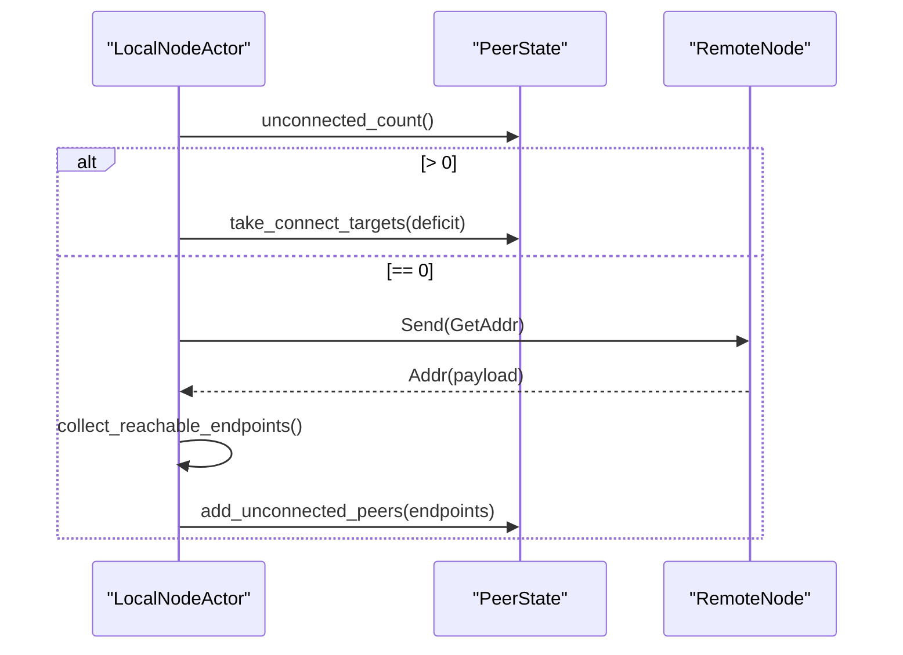
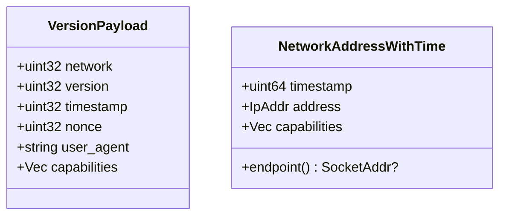
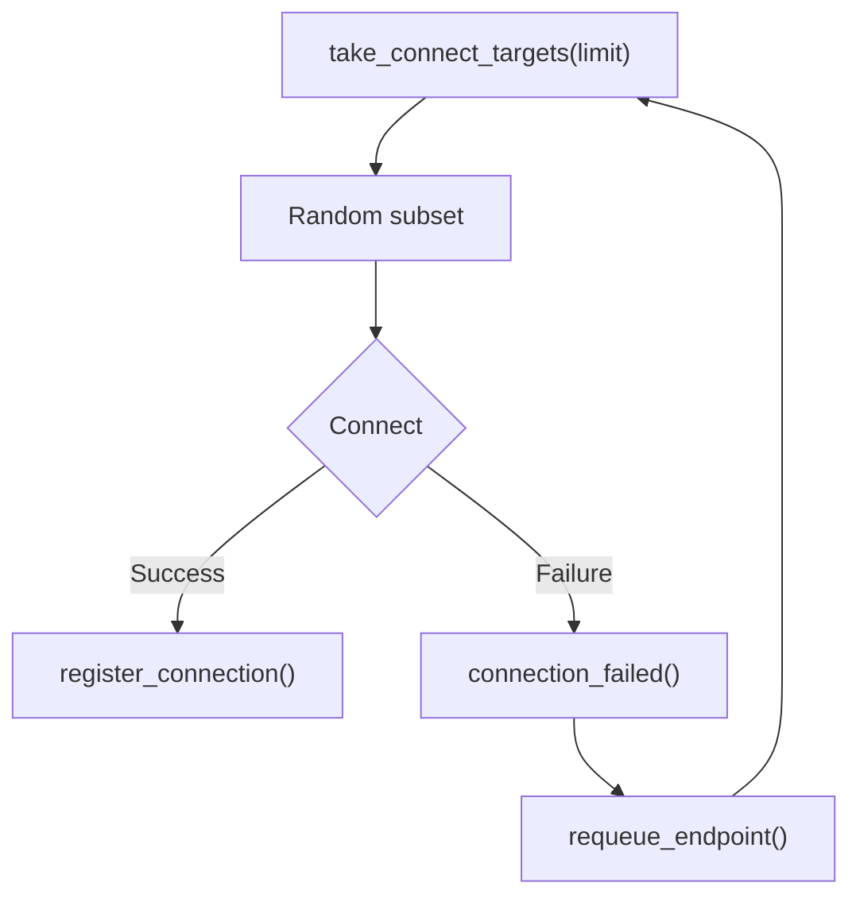
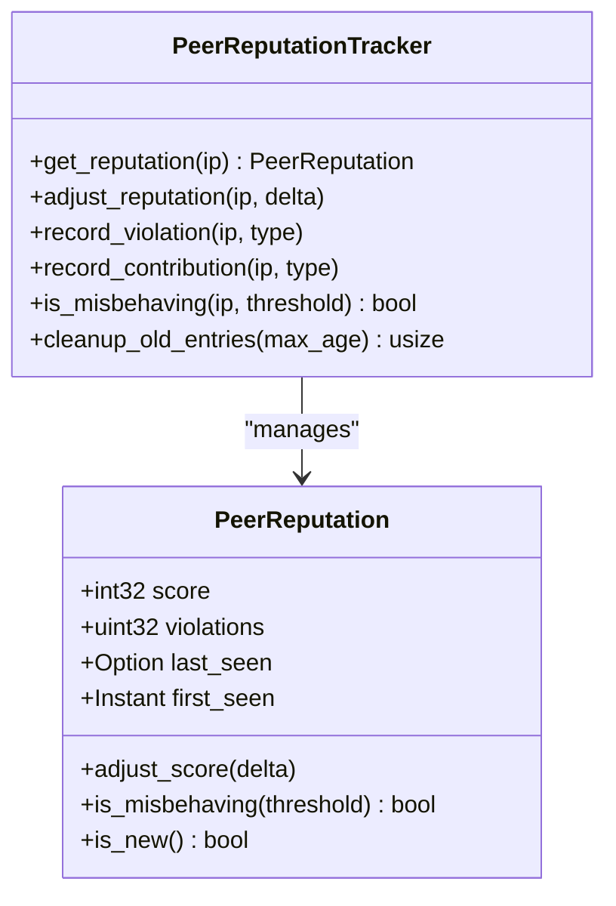
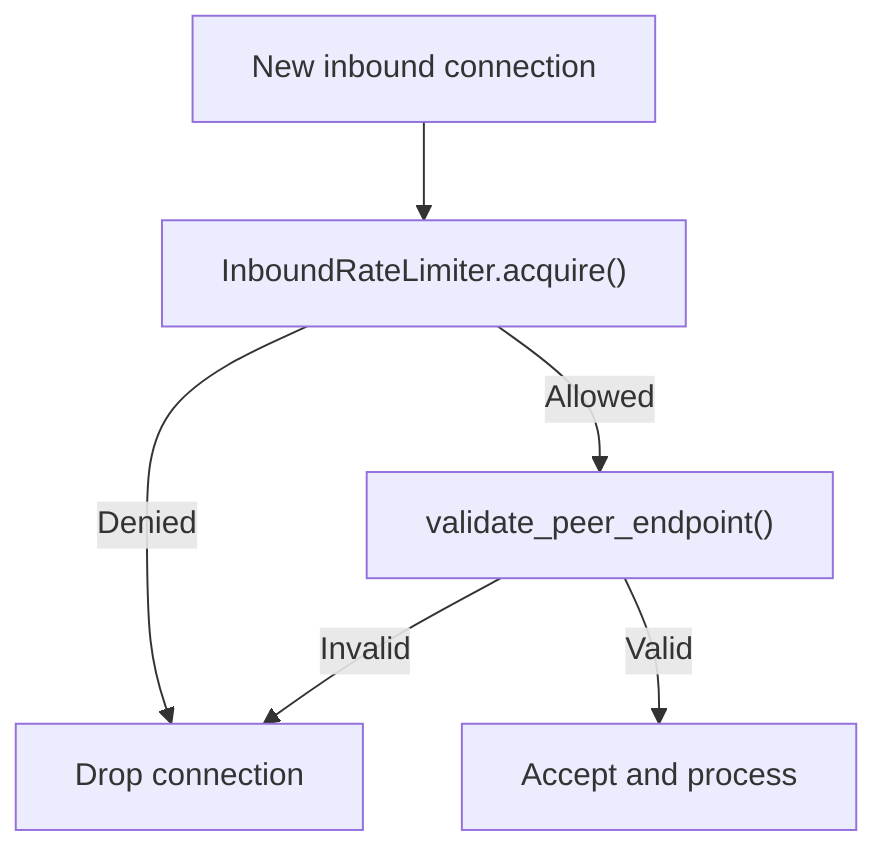
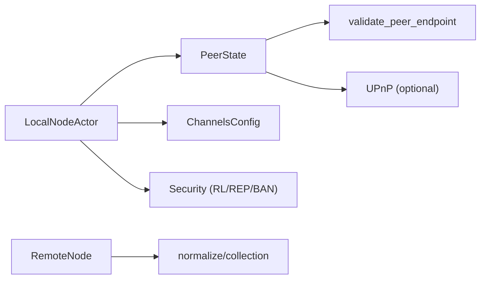

# Peer Management

<cite>
**Referenced Files in This Document**
- [peer.rs](file://neo-core/src/network/p2p/peer.rs)
- [mod.rs](file://neo-core/src/network/p2p/mod.rs)
- [channels_config.rs](file://neo-p2p/src/channels_config.rs)
- [actor.rs](file://neo-core/src/network/p2p/local_node/actor.rs)
- [peer_messages.rs](file://neo-core/src/network/p2p/remote_node/peer_messages.rs)
- [peer_commands.rs](file://neo-core/src/network/p2p/task_manager/peer_commands.rs)
- [mainnet.toml](file://config/mainnet.toml)
- [testnet.toml](file://config/testnet.toml)
- [peer.rs](file://neo-primitives/src/blockchain/peer.rs)
</cite>

## Table of Contents
1. Introduction
2. Project Structure
3. Core Components
4. Architecture Overview
5. Detailed Component Analysis
6. Dependency Analysis
7. Performance Considerations
8. Troubleshooting Guide
9. Conclusion
10. Appendices

## Introduction
This document explains peer management in the Neo P2P network as implemented in this repository. It covers peer discovery, connection lifecycle, state tracking, capability negotiation, address management, scoring and reputation, connection pooling, load balancing, failover, monitoring and health checks, security measures (validation, rate limiting, DDoS protection), and configuration tuning for different topologies.

## Project Structure
The peer management system spans several modules:
- Peer state and connection bookkeeping live in the core P2P module.
- The LocalNode actor orchestrates discovery, connection attempts, and maintenance timers.
- Remote node message handling normalizes addresses and requests.
- Task manager helpers send protocol messages to peers.
- Configuration defines connection limits, timeouts, and seed lists.
- Primitives define peer identifiers and info structures used across layers.



**Diagram sources**
- [actor.rs:348-363](file://neo-core/src/network/p2p/local_node/actor.rs#L348-L363)
- [peer.rs:50-107](file://neo-core/src/network/p2p/peer.rs#L50-L107)
- [mod.rs:131-187](file://neo-core/src/network/p2p/mod.rs#L131-L187)
- [mod.rs:229-363](file://neo-core/src/network/p2p/mod.rs#L229-L363)
- [channels_config.rs:14-88](file://neo-p2p/src/channels_config.rs#L14-L88)

**Section sources**
- [peer.rs:1-107](file://neo-core/src/network/p2p/peer.rs#L1-L107)
- [mod.rs:12-92](file://neo-core/src/network/p2p/mod.rs#L12-L92)
- [channels_config.rs:14-88](file://neo-p2p/src/channels_config.rs#L14-L88)

## Core Components
- PeerState: Tracks connected, connecting, and unconnected peers; enforces per-address and global connection limits; manages timer-driven maintenance; validates endpoints; supports trusted peers and UPnP integration.
- InboundRateLimiter: Token-bucket limiter for inbound connections to mitigate floods.
- PeerReputation and PeerReputationTracker: Score-based reputation with violations, thresholds, and cleanup.
- BanList: Time-bounded bans with expiration and queries.
- ChannelsConfig: Connection limits, timeouts, compression, and broadcast history settings.
- LocalNodeActor: Drives discovery (GetAddr or seeds), selects targets, initiates connections, handles failures, and requeues endpoints.
- RemoteNode message helpers: Normalize requests and collect reachable endpoints from received addresses.
- TaskManager peer commands: Send GetData, GetHeaders, GetBlockByIndex, MemPool, and disconnect.

**Section sources**
- [peer.rs:50-107](file://neo-core/src/network/p2p/peer.rs#L50-L107)
- [mod.rs:131-187](file://neo-core/src/network/p2p/mod.rs#L131-L187)
- [mod.rs:229-363](file://neo-core/src/network/p2p/mod.rs#L229-L363)
- [channels_config.rs:14-88](file://neo-p2p/src/channels_config.rs#L14-L88)
- [actor.rs:348-363](file://neo-core/src/network/p2p/local_node/actor.rs#L348-L363)
- [peer_messages.rs:114-136](file://neo-core/src/network/p2p/remote_node/peer_messages.rs#L114-L136)
- [peer_commands.rs:11-56](file://neo-core/src/network/p2p/task_manager/peer_commands.rs#L11-L56)

## Architecture Overview
The LocalNodeActor runs a periodic timer that:
- Computes connection deficit against configured minimum desired connections.
- Requests more peers when the unconnected pool is empty (either via GetAddr to connected peers or by falling back to seed nodes).
- Selects random targets from the unconnected pool up to available connecting capacity.
- Initiates outbound connections, registers successful handshakes, and tracks per-IP connection counts.

```mermaid
sequenceDiagram
participant Timer as "PeerTimer"
participant Local as "LocalNodeActor"
participant Peer as "PeerState"
participant Remote as "RemoteNode"
participant Net as "Network"
Timer->>Local : tick()
Local->>Peer : connection_deficit()
alt deficit > 0 and capacity > 0
Local->>Peer : unconnected_count()
alt unconnected_count == 0
Local->>Local : need_more_peers(count)
opt connected peers exist
Local->>Remote : Send(GetAddr)
else no connected peers
Local->>Local : resolve_seed_endpoints()
Local->>Peer : add_unconnected_peers(seeds)
end
end
Local->>Peer : take_connect_targets(deficit)
loop for each target
Local->>Net : connect(target)
Net-->>Local : success/failure
alt success
Local->>Peer : register_connection(...)
else failure
Local->>Peer : connection_failed(target)
end
end
else no deficit or capacity
Note over Local : idle until next timer
end
```

**Diagram sources**
- [actor.rs:348-363](file://neo-core/src/network/p2p/local_node/actor.rs#L348-L363)
- [actor.rs:585-642](file://neo-core/src/network/p2p/local_node/actor.rs#L585-L642)
- [peer.rs:362-407](file://neo-core/src/network/p2p/peer.rs#L362-L407)

## Detailed Component Analysis

### Peer State and Lifecycle
- Endpoint validation: Rejects unspecified, multicast, broadcast, and port 0 addresses before adding to pools or initiating connections.
- Trusted peers: Bypass per-address and global connection limits; marked during connection registration.
- Duplicate prevention: Avoids self-connections and duplicate remote endpoints.
- Per-IP accounting: Tracks active connections per IP to enforce max_connections_per_address.
- Connecting capacity: Allows up to 4× min_desired_connections concurrent attempts, capped by max_connections if set.
- Timer-driven maintenance: Schedules a 5-second interval task to drive discovery and connection attempts.



**Diagram sources**
- [peer.rs:167-220](file://neo-core/src/network/p2p/peer.rs#L167-L220)
- [peer.rs:231-314](file://neo-core/src/network/p2p/peer.rs#L231-L314)
- [peer.rs:409-419](file://neo-core/src/network/p2p/peer.rs#L409-L419)

**Section sources**
- [peer.rs:126-220](file://neo-core/src/network/p2p/peer.rs#L126-L220)
- [peer.rs:231-314](file://neo-core/src/network/p2p/peer.rs#L231-L314)
- [peer.rs:362-419](file://neo-core/src/network/p2p/peer.rs#L362-L419)

### Discovery and Address Management
- When the unconnected pool is empty and there is a deficit, the LocalNodeActor either:
  - Sends GetAddr to all connected peers to request new addresses, or
  - Falls back to seed nodes and adds them to the unconnected pool.
- Received addresses are normalized: zero ports are dropped and duplicates removed.



**Diagram sources**
- [actor.rs:348-363](file://neo-core/src/network/p2p/local_node/actor.rs#L348-L363)
- [actor.rs:598-642](file://neo-core/src/network/p2p/local_node/actor.rs#L598-L642)
- [peer_messages.rs:122-136](file://neo-core/src/network/p2p/remote_node/peer_messages.rs#L122-L136)

**Section sources**
- [actor.rs:598-642](file://neo-core/src/network/p2p/local_node/actor.rs#L598-L642)
- [peer_messages.rs:114-136](file://neo-core/src/network/p2p/remote_node/peer_messages.rs#L114-L136)

### Capability Negotiation and Version Handling
- VersionPayload carries network ID, protocol version, timestamp, nonce, user agent, and capabilities (e.g., TCP server port, full node service).
- Tests validate creation, serialization, rejection of duplicate known capabilities, and allowance of unknown capabilities.
- NetworkAddressWithTime encodes an address with optional capabilities and exposes its endpoint.



**Diagram sources**
- [version_payload.rs:37-85](file://neo-p2p/src/payloads/version_payload.rs#L37-L85)
- [p2p_payloads_csharp_tests.rs:96-177](file://neo-core/tests/p2p_payloads_csharp_tests.rs#L96-L177)

**Section sources**
- [p2p_payloads_csharp_tests.rs:96-177](file://neo-core/tests/p2p_payloads_csharp_tests.rs#L96-L177)

### Connection Pooling, Load Balancing, and Failover
- Pooling: PeerState maintains sets for connected, connecting, and unconnected peers; per-IP counters prevent single-IP saturation.
- Load balancing: Random selection from the unconnected pool using a thread RNG ensures even distribution.
- Failover: On connection failure, the endpoint is removed from connecting set and can be requeued by higher-level logic; on spawn/start failures, outbound attempts are retried by requeuing.



**Diagram sources**
- [peer.rs:370-388](file://neo-core/src/network/p2p/peer.rs#L370-L388)
- [peer.rs:222-226](file://neo-core/src/network/p2p/peer.rs#L222-L226)
- [actor.rs:585-607](file://neo-core/src/network/p2p/local_node/actor.rs#L585-L607)

**Section sources**
- [peer.rs:370-388](file://neo-core/src/network/p2p/peer.rs#L370-L388)
- [actor.rs:585-607](file://neo-core/src/network/p2p/local_node/actor.rs#L585-L607)

### Peer Scoring and Reputation
- PeerReputation tracks score, violation count, last_seen, and first_seen.
- PeerReputationTracker provides async access to adjust scores based on events (protocol violations, invalid data, handshake outcomes, valid relays).
- Thresholds determine misbehavior; entries can be cleaned by age.



**Diagram sources**
- [mod.rs:229-273](file://neo-core/src/network/p2p/mod.rs#L229-L273)
- [mod.rs:474-543](file://neo-core/src/network/p2p/mod.rs#L474-L543)

**Section sources**
- [mod.rs:229-273](file://neo-core/src/network/p2p/mod.rs#L229-L273)
- [mod.rs:474-543](file://neo-core/src/network/p2p/mod.rs#L474-L543)

### Security Measures
- Endpoint validation: Rejects unspecified, multicast, broadcast, and port 0 addresses at multiple entry points (adding to pools, beginning connections, registering connections).
- Rate limiting: InboundRateLimiter uses a token bucket to allow initial bursts then throttle excess inbound connections.
- Bans: BanEntry and BanList support time-bounded bans with expiration and cleanup.
- Security warning: P2P traffic is plaintext; operators should use tunnels or private networks for production.



**Diagram sources**
- [mod.rs:131-187](file://neo-core/src/network/p2p/mod.rs#L131-L187)
- [mod.rs:443-472](file://neo-core/src/network/p2p/mod.rs#L443-L472)
- [mod.rs:275-363](file://neo-core/src/network/p2p/mod.rs#L275-L363)

**Section sources**
- [mod.rs:131-187](file://neo-core/src/network/p2p/mod.rs#L131-L187)
- [mod.rs:443-472](file://neo-core/src/network/p2p/mod.rs#L443-L472)
- [mod.rs:275-363](file://neo-core/src/network/p2p/mod.rs#L275-L363)

### Monitoring and Health Checks
- Health framework provides component health status aggregation and liveness/readiness checks suitable for exposing node health.
- Peer metrics such as connection counts, unconnected pool size, and reputation/ban states can be surfaced via telemetry hooks.

**Section sources**
- [health.rs:1-159](file://neo-telemetry/src/health.rs#L1-L159)

### Peer Interaction Patterns and Protocol Messages
- Task manager helpers encapsulate sending GetData groups, GetHeaders, GetBlockByIndex, MemPool, and Disconnect commands to remote nodes.
- These ensure consistent message construction and error logging.

**Section sources**
- [peer_commands.rs:11-56](file://neo-core/src/network/p2p/task_manager/peer_commands.rs#L11-L56)

## Dependency Analysis
- LocalNodeActor depends on PeerState for connection bookkeeping and on ChannelsConfig for runtime parameters.
- PeerState depends on endpoint validation utilities and optionally UPnP for NAT traversal.
- Security components (rate limiter, reputation, ban list) are shared across the P2P module and consumed by actors.
- Remote node message processing normalizes incoming addresses and integrates with peer state updates.



**Diagram sources**
- [actor.rs:348-363](file://neo-core/src/network/p2p/local_node/actor.rs#L348-L363)
- [peer.rs:126-220](file://neo-core/src/network/p2p/peer.rs#L126-L220)
- [mod.rs:131-187](file://neo-core/src/network/p2p/mod.rs#L131-L187)
- [peer_messages.rs:122-136](file://neo-core/src/network/p2p/remote_node/peer_messages.rs#L122-L136)

**Section sources**
- [actor.rs:348-363](file://neo-core/src/network/p2p/local_node/actor.rs#L348-L363)
- [peer.rs:126-220](file://neo-core/src/network/p2p/peer.rs#L126-L220)
- [mod.rs:131-187](file://neo-core/src/network/p2p/mod.rs#L131-L187)
- [peer_messages.rs:122-136](file://neo-core/src/network/p2p/remote_node/peer_messages.rs#L122-L136)

## Performance Considerations
- Tuning connection limits: Adjust min_desired_connections and max_connections to match bandwidth and CPU capacity.
- Per-address caps: Increase max_connections_per_address cautiously to avoid single-peer saturation while improving resilience.
- Timeouts: Tune handshake_timeout, read_timeout_active, write_timeout, and shutdown_timeout for network conditions.
- Compression: Enable compression to reduce bandwidth usage where CPU permits.
- Known hashes and broadcast history: Scale max_known_hashes and broadcast_history_limit according to memory and throughput needs.
- Rate limiting: Configure inbound rate and burst to balance availability and protection under load.

[No sources needed since this section provides general guidance]

## Troubleshooting Guide
Common issues and diagnostics:
- No peers discovered: Ensure seed list is configured and reachable; verify GetAddr behavior and that unconnected pool is being populated.
- Excessive connection failures: Check endpoint validation logs; confirm firewall/NAT rules and that ports are open.
- High connection churn: Review per-IP limits and reputation/bans; consider adjusting thresholds and timeouts.
- Misbehaving peers: Inspect reputation adjustments and ban list; tune thresholds and durations.

**Section sources**
- [actor.rs:324-343](file://neo-core/src/network/p2p/local_node/actor.rs#L324-L343)
- [mod.rs:443-472](file://neo-core/src/network/p2p/mod.rs#L443-L472)
- [mod.rs:275-363](file://neo-core/src/network/p2p/mod.rs#L275-L363)

## Conclusion
The Neo P2P peer management implementation provides robust discovery, lifecycle control, and security mechanisms aligned with the reference design. Operators can tailor performance and resilience through configuration and monitoring, while leveraging built-in safeguards like endpoint validation, rate limiting, reputation tracking, and bans.

[No sources needed since this section summarizes without analyzing specific files]

## Appendices

### Configuration Options and Tuning
- Mainnet example:
  - p2p.port, p2p.max_connections, p2p.min_desired_connections, seed_nodes, enable_compression, broadcast_history_limit.
- Testnet example:
  - p2p.listen_port, p2p.max_connections, p2p.min_desired_connections, seed_nodes, enable_compression, broadcast_history_limit.
- Runtime defaults and constants:
  - ChannelsConfig defaults for compression, connection limits, timeouts, and history sizes.

**Section sources**
- [mainnet.toml:12-24](file://config/mainnet.toml#L12-L24)
- [testnet.toml:13-25](file://config/testnet.toml#L13-L25)
- [channels_config.rs:41-88](file://neo-p2p/src/channels_config.rs#L41-L88)

### Peer Identifiers and Info
- PeerId and PeerInfo provide stable identification and metadata for connected peers.

**Section sources**
- [peer.rs:1-65](file://neo-primitives/src/blockchain/peer.rs#L1-L65)