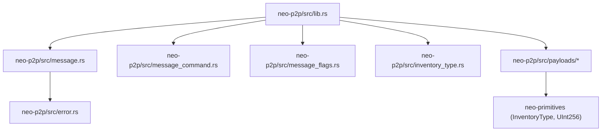
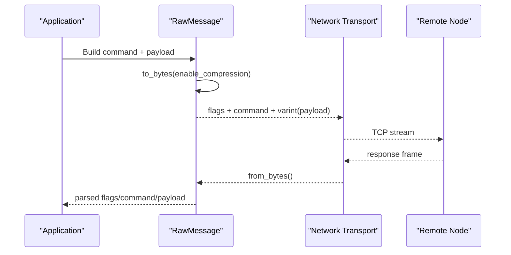
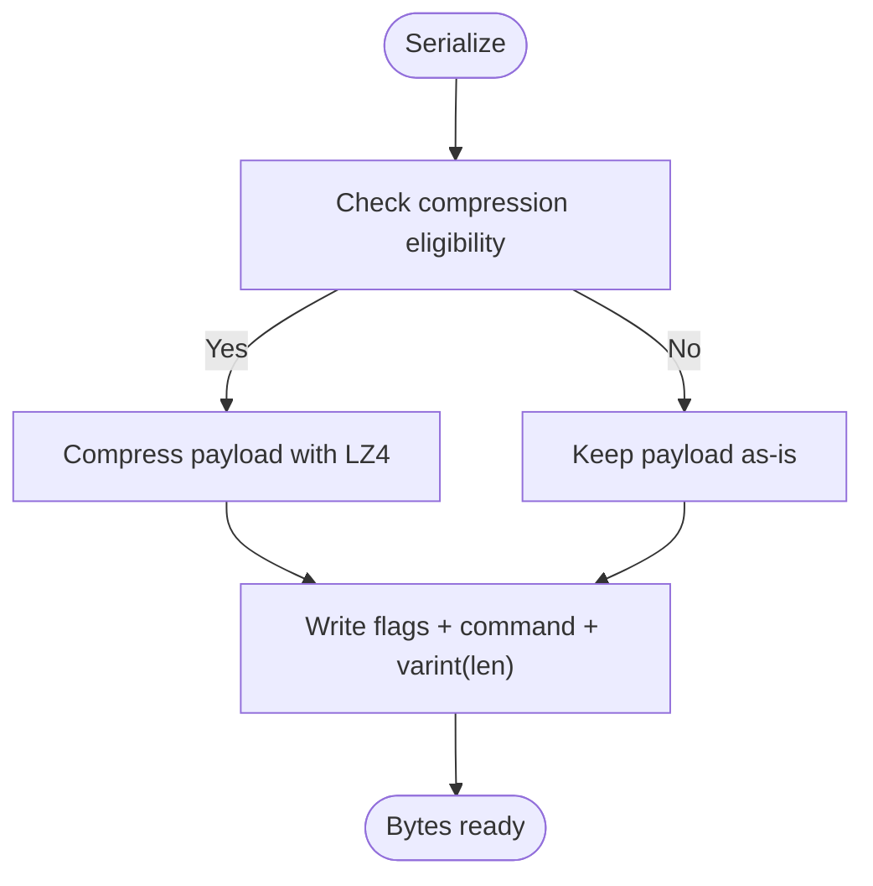
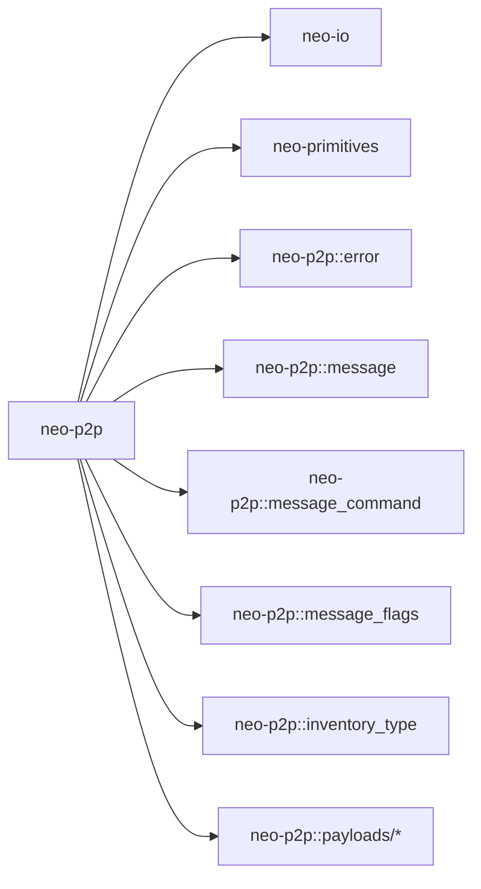

# Protocol Specification

<cite>
**Referenced Files in This Document**
- [lib.rs](file://neo-p2p/src/lib.rs)
- [message.rs](file://neo-p2p/src/message.rs)
- [message_command.rs](file://neo-p2p/src/message_command.rs)
- [message_flags.rs](file://neo-p2p/src/message_flags.rs)
- [inventory_type.rs](file://neo-p2p/src/inventory_type.rs)
- [version_payload.rs](file://neo-p2p/src/payloads/version_payload.rs)
- [inv_payload.rs](file://neo-p2p/src/payloads/inv_payload.rs)
- [get_blocks_payload.rs](file://neo-p2p/src/payloads/get_blocks_payload.rs)
- [ping_payload.rs](file://neo-p2p/src/payloads/ping_payload.rs)
- [addr_payload.rs](file://neo-p2p/src/payloads/addr_payload.rs)
- [filter_load_payload.rs](file://neo-p2p/src/payloads/filter_load_payload.rs)
- [get_block_by_index_payload.rs](file://neo-p2p/src/payloads/get_block_by_index_payload.rs)
- [error.rs](file://neo-p2p/src/error.rs)
</cite>

## Table of Contents
1. [Introduction](#introduction)
2. [Project Structure](#project-structure)
3. [Core Components](#core-components)
4. [Architecture Overview](#architecture-overview)
5. [Detailed Component Analysis](#detailed-component-analysis)
6. [Dependency Analysis](#dependency-analysis)
7. [Performance Considerations](#performance-considerations)
8. [Troubleshooting Guide](#troubleshooting-guide)
9. [Conclusion](#conclusion)
10. [Appendices](#appendices)

## Introduction
This document specifies the Neo P2P protocol as implemented in this repository. It covers message framing, command types, payload structures, version negotiation, inventory types, message flags, and error handling patterns. It also provides examples for constructing, parsing, and serializing messages using the reference implementation.

## Project Structure
The P2P protocol is defined primarily in the neo-p2p crate:
- Message framing and wire format are in message.rs
- Command identifiers and queue policies are in message_command.rs
- Flags (e.g., compression) are in message_flags.rs
- Inventory types and conversions are in inventory_type.rs
- Payloads for specific commands live under payloads/
- Error types and results are in error.rs
- The crate root lib.rs documents the wire format and lists supported commands

**Diagram sources**
- [lib.rs:165-210](file://neo-p2p/src/lib.rs#L165-L210)
- [message.rs:1-30](file://neo-p2p/src/message.rs#L1-L30)
- [message_command.rs:1-20](file://neo-p2p/src/message_command.rs#L1-L20)
- [message_flags.rs:1-16](file://neo-p2p/src/message_flags.rs#L1-L16)
- [inventory_type.rs:1-18](file://neo-p2p/src/inventory_type.rs#L1-L18)

**Section sources**
- [lib.rs:106-147](file://neo-p2p/src/lib.rs#L106-L147)
- [message.rs:11-29](file://neo-p2p/src/message.rs#L11-L29)

## Core Components
- RawMessage: Wire-format container with flags, command, and payload bytes. Supports serialization/deserialization with optional LZ4 compression.
- MessageCommand: Single-byte command discriminator with helpers for single-queue and high-priority classification.
- MessageFlags: Bit flags for message behavior; currently includes a compression flag.
- InventoryType: Enumerates block, transaction, consensus, and extensible inventory kinds.
- Payloads: VersionPayload, InvPayload, GetBlocksPayload, PingPayload, AddrPayload, FilterLoadPayload, GetBlockByIndexPayload.

Key behaviors:
- Framing: flags (1 byte), command (1 byte), length-prefixed payload (var_int).
- Compression: Optional LZ4 compression when enabled and payload exceeds threshold; indicated by flags.
- Validation: Payload size limits and field constraints enforced during deserialization.

**Section sources**
- [message.rs:17-105](file://neo-p2p/src/message.rs#L17-L105)
- [message_command.rs:22-53](file://neo-p2p/src/message_command.rs#L22-L53)
- [message_flags.rs:5-16](file://neo-p2p/src/message_flags.rs#L5-L16)
- [inventory_type.rs:1-18](file://neo-p2p/src/inventory_type.rs#L1-L18)

## Architecture Overview
The P2P layer sits above transport and below application logic. It handles framing, command dispatch, and payload serialization. Higher layers (neo-core) interpret typed payloads and implement synchronization, mempool, and consensus messaging.

**Diagram sources**
- [message.rs:51-105](file://neo-p2p/src/message.rs#L51-L105)
- [lib.rs:106-118](file://neo-p2p/src/lib.rs#L106-L118)

## Detailed Component Analysis

### Message Framing and Serialization
- Header: flags (1 byte), command (1 byte), payload length (variable-length integer).
- Payload: variable-length bytes; may be compressed if flags indicate compression and size threshold met.
- Deserialization: reads flags, command, payload; decompresses if flagged; returns RawMessage.

**Diagram sources**
- [message.rs:51-71](file://neo-p2p/src/message.rs#L51-L71)
- [message.rs:73-105](file://neo-p2p/src/message.rs#L73-L105)

**Section sources**
- [message.rs:11-15](file://neo-p2p/src/message.rs#L11-L15)
- [message.rs:51-105](file://neo-p2p/src/message.rs#L51-L105)

### Message Commands
- Defined as a single-byte enum with known values and an Unknown variant for unknown bytes.
- Includes sets for single-queued and high-priority commands used by the networking stack.

Supported commands include Version, Verack, GetAddr, Addr, Ping, Pong, GetHeaders, Headers, GetBlocks, Mempool, Inv, GetData, GetBlockByIndex, NotFound, Transaction, Block, Extensible, Reject, FilterLoad, FilterAdd, FilterClear, MerkleBlock, Alert.

**Section sources**
- [message_command.rs:6-18](file://neo-p2p/src/message_command.rs#L6-L18)
- [message_command.rs:22-53](file://neo-p2p/src/message_command.rs#L22-L53)
- [lib.rs:120-147](file://neo-p2p/src/lib.rs#L120-L147)

### Message Flags
- Currently supports a compression flag.
- Unknown bits are preserved to allow future extensions without breaking compatibility.

**Section sources**
- [message_flags.rs:5-16](file://neo-p2p/src/message_flags.rs#L5-L16)
- [message_flags.rs:18-97](file://neo-p2p/src/message_flags.rs#L18-L97)

### Inventory Types
- InventoryType enumerates Transaction, Block, Consensus, Extensible.
- Conversion to MessageCommand maps inventory kinds to appropriate relay commands.

**Section sources**
- [inventory_type.rs:1-18](file://neo-p2p/src/inventory_type.rs#L1-L18)
- [inventory_type.rs:20-39](file://neo-p2p/src/inventory_type.rs#L20-L39)

### Version Negotiation
- VersionPayload carries network magic, protocol version, timestamp, nonce, user agent, and node capabilities.
- PROTOCOL_VERSION constant defines the current protocol version.
- Capabilities list is bounded by MAX_CAPABILITIES.

Wire layout (VersionPayload):
- network: u32
- version: u32
- timestamp: u32
- nonce: u32
- user_agent: var string
- capabilities: array of NodeCapability

**Section sources**
- [version_payload.rs:20-47](file://neo-p2p/src/payloads/version_payload.rs#L20-L47)
- [version_payload.rs:73-111](file://neo-p2p/src/payloads/version_payload.rs#L73-L111)

### Inventory Announcement (Inv)
- InvPayload contains an inventory type and a vector of hashes.
- Maximum hashes per payload is limited to ensure protocol compliance.
- Helper methods split large hash sets into multiple payloads.

Wire layout (InvPayload):
- inventory_type: u8 (InventoryType)
- hashes: array of UInt256 (bounded)

**Section sources**
- [inv_payload.rs:8-23](file://neo-p2p/src/payloads/inv_payload.rs#L8-L23)
- [inv_payload.rs:71-92](file://neo-p2p/src/payloads/inv_payload.rs#L71-L92)

### Block Requests (GetBlocks)
- GetBlocksPayload requests blocks starting from a given hash with a count.
- Count must be -1 (as many as possible) or a positive value within bounds; zero is invalid.

Wire layout (GetBlocksPayload):
- hash_start: UInt256
- count: i16

**Section sources**
- [get_blocks_payload.rs:16-32](file://neo-p2p/src/payloads/get_blocks_payload.rs#L16-L32)
- [get_blocks_payload.rs:34-44](file://neo-p2p/src/payloads/get_blocks_payload.rs#L34-L44)

### Block Requests by Index (GetBlockByIndex)
- GetBlockByIndexPayload requests blocks by index range.
- Count must be -1 or a positive value up to a maximum; zero is invalid.

Wire layout (GetBlockByIndexPayload):
- index_start: u32
- count: i16

**Section sources**
- [get_block_by_index_payload.rs:18-33](file://neo-p2p/src/payloads/get_block_by_index_payload.rs#L18-L33)
- [get_block_by_index_payload.rs:36-46](file://neo-p2p/src/payloads/get_block_by_index_payload.rs#L36-L46)

### Address Exchange (GetAddr / Addr)
- AddrPayload responds to GetAddr with a list of NetworkAddressWithTime entries.
- Enforces maximum number of addresses per message and non-empty list on receive.

Wire layout (AddrPayload):
- address_list: array of NetworkAddressWithTime (bounded)

**Section sources**
- [addr_payload.rs:19-27](file://neo-p2p/src/payloads/addr_payload.rs#L19-L27)
- [addr_payload.rs:38-58](file://neo-p2p/src/payloads/addr_payload.rs#L38-L58)

### Bloom Filters (FilterLoad / FilterAdd / FilterClear)
- FilterLoadPayload configures a Bloom filter with filter bytes, k (hash functions), and tweak.
- Enforces maximum filter size and k value.

Wire layout (FilterLoadPayload):
- filter: var bytes (bounded)
- k: u8 (bounded)
- tweak: u32

**Section sources**
- [filter_load_payload.rs:17-34](file://neo-p2p/src/payloads/filter_load_payload.rs#L17-L34)
- [filter_load_payload.rs:57-88](file://neo-p2p/src/payloads/filter_load_payload.rs#L57-L88)

### Keepalive (Ping / Pong)
- PingPayload carries last block index, timestamp, and a nonce echoed by Pong.
- Used to detect liveness and measure latency.

Wire layout (PingPayload):
- last_block_index: u32
- timestamp: u32
- nonce: u32

**Section sources**
- [ping_payload.rs:15-27](file://neo-p2p/src/payloads/ping_payload.rs#L15-L27)
- [ping_payload.rs:50-56](file://neo-p2p/src/payloads/ping_payload.rs#L50-L56)

### Example Workflows

#### Construct and Serialize a Version Message
- Create VersionPayload with network, nonce, user agent, and capabilities.
- Wrap in RawMessage with command Version and serialize to bytes.

Steps:
1. Build VersionPayload fields.
2. Create RawMessage::from_serializable(command=Version, payload=&VersionPayload).
3. Call to_bytes(enable_compression=false) to get wire bytes.

**Section sources**
- [version_payload.rs:20-47](file://neo-p2p/src/payloads/version_payload.rs#L20-L47)
- [message.rs:41-49](file://neo-p2p/src/message.rs#L41-L49)
- [message.rs:51-71](file://neo-p2p/src/message.rs#L51-L71)

#### Parse an Incoming Message
- Read flags, command, and payload bytes from the socket.
- Use RawMessage::from_bytes to decode and optionally decompress.
- Dispatch based on command to deserialize typed payload.

**Section sources**
- [message.rs:73-105](file://neo-p2p/src/message.rs#L73-L105)

#### Announce Inventory (Inv)
- Build InvPayload with inventory type and hashes.
- Split large sets using create_group to respect limits.
- Wrap in RawMessage with command Inv and serialize.

**Section sources**
- [inv_payload.rs:25-58](file://neo-p2p/src/payloads/inv_payload.rs#L25-L58)
- [inv_payload.rs:71-92](file://neo-p2p/src/payloads/inv_payload.rs#L71-L92)
- [message.rs:41-71](file://neo-p2p/src/message.rs#L41-L71)

#### Request Blocks (GetBlocks)
- Build GetBlocksPayload with hash_start and count (-1 for all available).
- Wrap in RawMessage with command GetBlocks and serialize.

**Section sources**
- [get_blocks_payload.rs:16-32](file://neo-p2p/src/payloads/get_blocks_payload.rs#L16-L32)
- [get_blocks_payload.rs:34-44](file://neo-p2p/src/payloads/get_blocks_payload.rs#L34-L44)
- [message.rs:41-71](file://neo-p2p/src/message.rs#L41-L71)

## Dependency Analysis
- neo-p2p depends on neo-io for serialization and compression utilities.
- neo-p2p re-exports core enums from neo-primitives (e.g., InventoryType).
- Payloads depend on primitives like UInt256 and helper utilities for arrays and strings.

**Diagram sources**
- [lib.rs:165-210](file://neo-p2p/src/lib.rs#L165-L210)
- [message.rs:7-9](file://neo-p2p/src/message.rs#L7-L9)
- [inventory_type.rs:1-4](file://neo-p2p/src/inventory_type.rs#L1-L4)

**Section sources**
- [lib.rs:165-210](file://neo-p2p/src/lib.rs#L165-L210)
- [message.rs:7-9](file://neo-p2p/src/message.rs#L7-L9)

## Performance Considerations
- Compression: Enabled conditionally when payload meets minimum size and compression reduces size; controlled via flags.
- Limits: Max payload size, max hashes per InvPayload, max addresses per AddrPayload, and Bloom filter size/k constraints prevent excessive memory use.
- Queueing: Certain commands are single-queued or high-priority to reduce congestion and improve responsiveness.

[No sources needed since this section provides general guidance]

## Troubleshooting Guide
Common errors and their meanings:
- InvalidMessage: Malformed or unexpected payload content.
- ProtocolError: Violation of framing or field constraints.
- ProtocolViolation: Peer sent unsupported command or invalid combination.
- Timeout: Operation exceeded expected time.
- Io: Underlying I/O failure.

Recommendations:
- Validate incoming payloads against documented limits before processing.
- Log peer address and violation details for diagnostics.
- Use timeouts around request-response pairs (e.g., GetBlocks -> Block/Headers).

**Section sources**
- [error.rs:6-66](file://neo-p2p/src/error.rs#L6-L66)
- [error.rs:68-126](file://neo-p2p/src/error.rs#L68-L126)

## Conclusion
The Neo P2P protocol in this repository defines a compact, extensible wire format with clear command semantics, robust payload validation, and optional compression. Implementers should adhere to the documented limits and handle errors according to the provided error taxonomy. The reference payloads and message framing provide a solid foundation for building compatible nodes and clients.

[No sources needed since this section summarizes without analyzing specific files]

## Appendices

### Wire Format Summary
- Frame: flags (1 byte), command (1 byte), payload length (var_int), payload (bytes, possibly compressed).
- No per-message checksum; integrity relies on TCP.

**Section sources**
- [lib.rs:106-118](file://neo-p2p/src/lib.rs#L106-L118)
- [message.rs:51-71](file://neo-p2p/src/message.rs#L51-L71)

### Command Reference
- See the full list of commands and descriptions in the crate documentation.

**Section sources**
- [lib.rs:120-147](file://neo-p2p/src/lib.rs#L120-L147)

### Payload Quick Reference
- VersionPayload: network, version, timestamp, nonce, user_agent, capabilities
- InvPayload: inventory_type, hashes[]
- GetBlocksPayload: hash_start, count
- GetBlockByIndexPayload: index_start, count
- AddrPayload: address_list[]
- FilterLoadPayload: filter[], k, tweak
- PingPayload: last_block_index, timestamp, nonce

**Section sources**
- [version_payload.rs:20-47](file://neo-p2p/src/payloads/version_payload.rs#L20-L47)
- [inv_payload.rs:16-23](file://neo-p2p/src/payloads/inv_payload.rs#L16-L23)
- [get_blocks_payload.rs:16-24](file://neo-p2p/src/payloads/get_blocks_payload.rs#L16-L24)
- [get_block_by_index_payload.rs:18-26](file://neo-p2p/src/payloads/get_block_by_index_payload.rs#L18-L26)
- [addr_payload.rs:22-27](file://neo-p2p/src/payloads/addr_payload.rs#L22-L27)
- [filter_load_payload.rs:23-34](file://neo-p2p/src/payloads/filter_load_payload.rs#L23-L34)
- [ping_payload.rs:15-27](file://neo-p2p/src/payloads/ping_payload.rs#L15-L27)