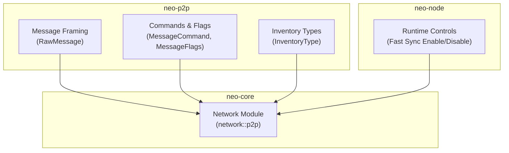
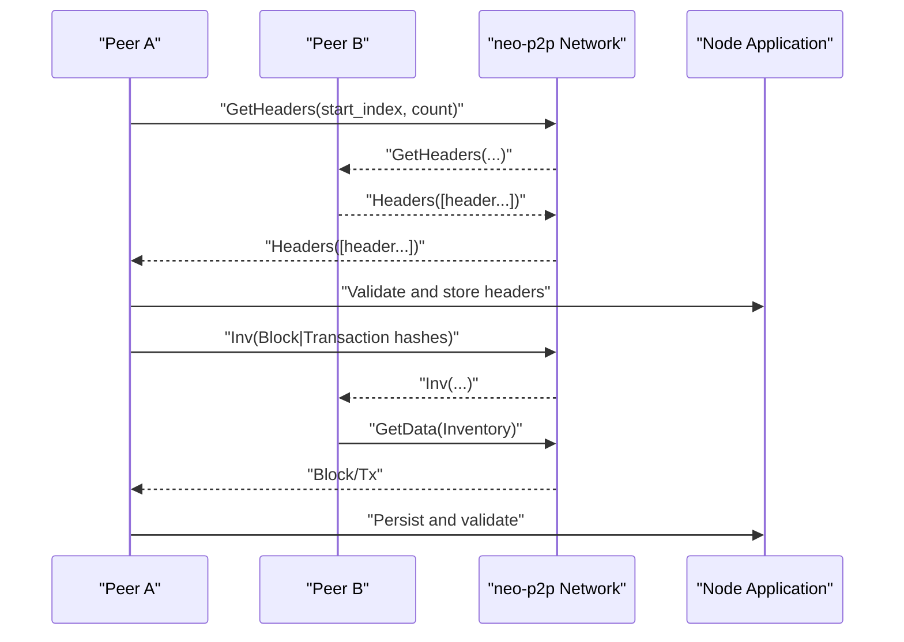
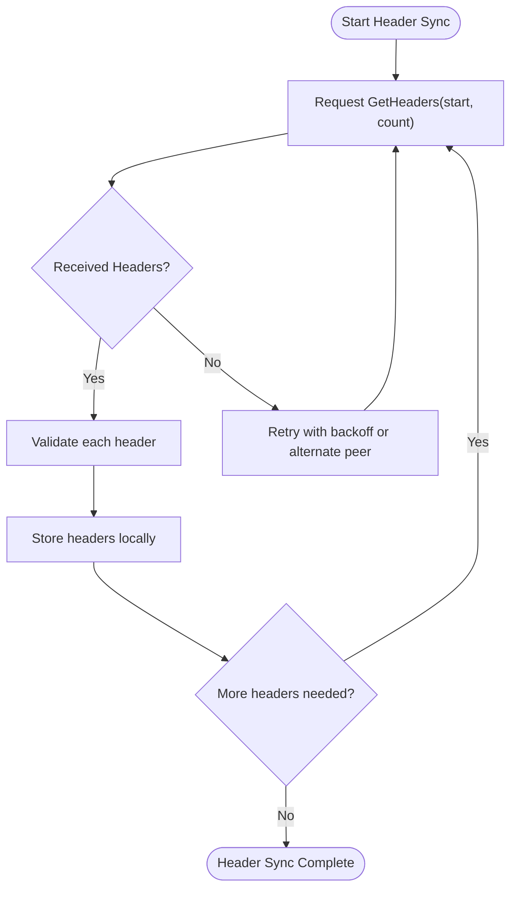
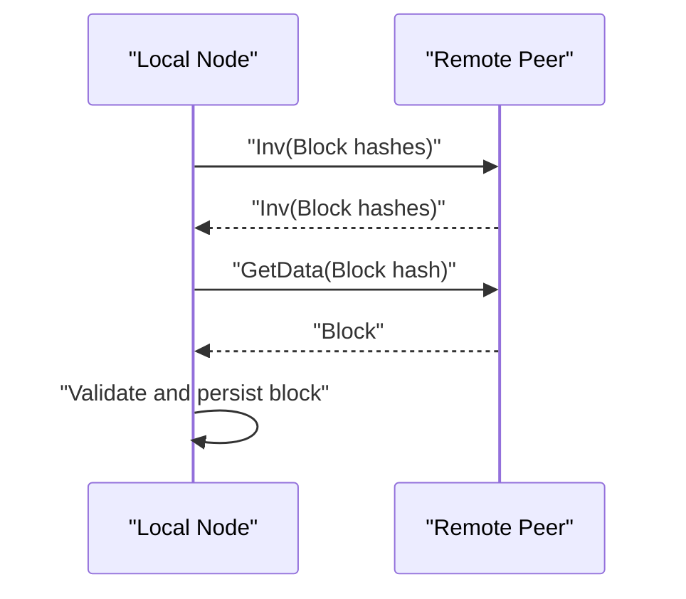
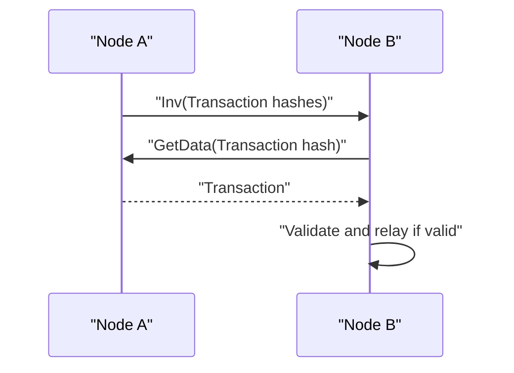
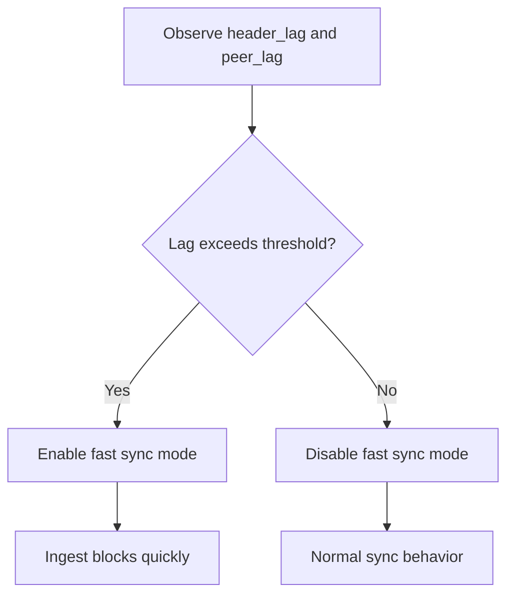
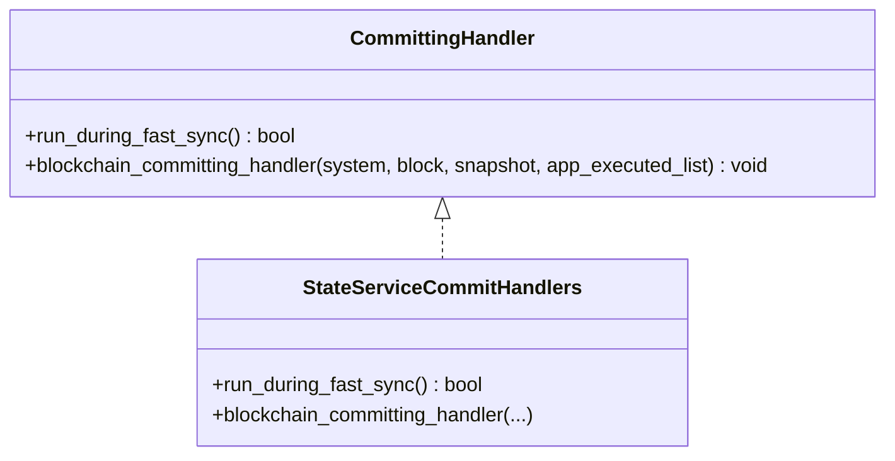
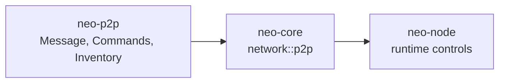

# Synchronization Protocols

<cite>
**Referenced Files in This Document**
- [lib.rs](file://neo-p2p/src/lib.rs)
- [message.rs](file://neo-p2p/src/message.rs)
- [message_command.rs](file://neo-p2p/src/message_command.rs)
- [inventory_type.rs](file://neo-p2p/src/inventory_type.rs)
- [mod.rs](file://neo-core/src/network/mod.rs)
- [logging.rs](file://neo-node/src/startup/logging.rs)
- [fast_sync_p2p_e2e_tests.rs](file://tests/tests/fast_sync_p2p_e2e_tests.rs)
- [persistence_fast_sync_handler_tests.rs](file://neo-core/tests/persistence_fast_sync_handler_tests.rs)
</cite>

## Table of Contents
1. Introduction
2. Project Structure
3. Core Components
4. Architecture Overview
5. Detailed Component Analysis
6. Dependency Analysis
7. Performance Considerations
8. Troubleshooting Guide
9. Conclusion

## Introduction
This document explains blockchain synchronization protocols in the Neo P2P network with a focus on block synchronization, transaction propagation, header synchronization, request/response patterns, inventory-based data fetching, and parallel synchronization strategies. It also covers fast sync mode behavior, checkpoint-like synchronization via headers and blocks, catch-up mechanisms, state management during sync, retry logic, error recovery, and practical guidance for implementing custom synchronization tasks and optimizing performance.

## Project Structure
The synchronization stack spans several crates:
- neo-p2p: wire protocol types, message framing, command definitions, and inventory mappings used by all nodes.
- neo-core: higher-level networking and node orchestration that uses neo-p2p to implement sync flows.
- neo-node: runtime behaviors such as enabling/disabling fast sync based on observed lag.

**Diagram sources**
- [message.rs:1-106](file://neo-p2p/src/message.rs#L1-L106)
- [message_command.rs:1-154](file://neo-p2p/src/message_command.rs#L1-L154)
- [inventory_type.rs:1-39](file://neo-p2p/src/inventory_type.rs#L1-L39)
- [mod.rs:1-21](file://neo-core/src/network/mod.rs#L1-L21)

**Section sources**
- [lib.rs:6-118](file://neo-p2p/src/lib.rs#L6-L118)
- [mod.rs:1-21](file://neo-core/src/network/mod.rs#L1-L21)

## Core Components
- Wire framing and compression: RawMessage handles flags, commands, payload length, LZ4 compression when enabled, and size limits.
- Message commands: Centralized enum for all P2P commands, including GetHeaders, Headers, GetBlocks, Block, Inv, GetData, Transaction, Ping/Pong, etc., with queueing and priority policies.
- Inventory mapping: InventoryType maps to appropriate MessageCommand for announcements and requests.
- Fast sync control: Node runtime toggles fast sync mode based on header/peer lag thresholds.

Key responsibilities:
- Header sync: Request and receive contiguous header ranges.
- Block sync: Fetch full blocks after headers or via inventory.
- Transaction propagation: Announce and fetch transactions using inventory and data messages.
- Keepalive and liveness: Ping/Pong exchange.

**Section sources**
- [message.rs:11-106](file://neo-p2p/src/message.rs#L11-L106)
- [message_command.rs:22-54](file://neo-p2p/src/message_command.rs#L22-L54)
- [inventory_type.rs:1-39](file://neo-p2p/src/inventory_type.rs#L1-L39)
- [logging.rs:70-105](file://neo-node/src/startup/logging.rs#L70-L105)

## Architecture Overview
The sync architecture is layered:
- Transport layer (TCP) carries framed messages defined in neo-p2p.
- Protocol layer defines commands and payloads for sync operations.
- Node layer orchestrates peers, queues, retries, and fast sync decisions.

**Diagram sources**
- [message_command.rs:22-54](file://neo-p2p/src/message_command.rs#L22-L54)
- [message.rs:51-106](file://neo-p2p/src/message.rs#L51-L106)

## Detailed Component Analysis

### Header Synchronization
- Request pattern: Use GetHeaders to obtain a range of headers starting from a known index.
- Response pattern: Receive Headers containing a list of block headers.
- Validation: Each header is validated before being stored; gaps trigger targeted re-fetches.
- Parallelism: Multiple header ranges can be requested concurrently to different peers.

**Section sources**
- [message_command.rs:22-54](file://neo-p2p/src/message_command.rs#L22-L54)
- [message.rs:51-106](file://neo-p2p/src/message.rs#L51-L106)

### Block Synchronization
- After headers are synchronized, blocks are fetched either by explicit range or via inventory announcements.
- Request pattern: GetData with Inventory items (blocks).
- Response pattern: Block messages carrying full block data.
- Deduplication: Avoid requesting already-known blocks; track pending requests per peer.

**Diagram sources**
- [inventory_type.rs:1-39](file://neo-p2p/src/inventory_type.rs#L1-L39)
- [message_command.rs:22-54](file://neo-p2p/src/message_command.rs#L22-L54)

**Section sources**
- [message_command.rs:22-54](file://neo-p2p/src/message_command.rs#L22-L54)
- [inventory_type.rs:1-39](file://neo-p2p/src/inventory_type.rs#L1-L39)

### Transaction Propagation
- Announcement: Nodes broadcast Inv(Transaction hashes) to peers.
- Fetch: Peers respond with GetData(Transaction hash), receiving Transaction messages.
- Filtering: Bloom filters can be used to reduce bandwidth for lightweight clients.

**Section sources**
- [message_command.rs:22-54](file://neo-p2p/src/message_command.rs#L22-L54)
- [message.rs:51-106](file://neo-p2p/src/message.rs#L51-L106)

### Fast Sync Mode and Catch-Up
- Fast sync enables accelerated ingestion when the node detects significant lag relative to peers or highest header height.
- Runtime toggling: The node monitors header lag and peer lag, then enables or disables fast sync accordingly.
- During fast sync, committing handlers can run to maintain auxiliary state while blocks are ingested rapidly.

**Diagram sources**
- [logging.rs:70-105](file://neo-node/src/startup/logging.rs#L70-L105)

**Section sources**
- [logging.rs:70-105](file://neo-node/src/startup/logging.rs#L70-L105)
- [persistence_fast_sync_handler_tests.rs:17-48](file://neo-core/tests/persistence_fast_sync_handler_tests.rs#L17-L48)

### Checkpoint Synchronization
- While checkpoints are not explicitly implemented here, header-first synchronization acts as a logical checkpoint mechanism: peers share headers to establish consensus on chain topology before downloading full blocks.
- This reduces bandwidth and allows rapid catch-up by validating compact structures first.

**Section sources**
- [message_command.rs:22-54](file://neo-p2p/src/message_command.rs#L22-L54)
- [message.rs:51-106](file://neo-p2p/src/message.rs#L51-L106)

### Custom Synchronization Tasks
- Implementors can register committing handlers to perform side effects during block commits, including during fast sync.
- Handlers should be idempotent and resilient to failures; they can capture application execution events for auditing or metrics.

**Diagram sources**
- [persistence_fast_sync_handler_tests.rs:17-48](file://neo-core/tests/persistence_fast_sync_handler_tests.rs#L17-L48)

**Section sources**
- [persistence_fast_sync_handler_tests.rs:17-48](file://neo-core/tests/persistence_fast_sync_handler_tests.rs#L17-L48)

### Handling Network Partitions
- Partition resilience relies on:
  - Multi-peer redundancy: request headers/blocks from multiple peers.
  - Queue deduplication: single-queued commands prevent duplicate requests.
  - Timeouts and retries: use exponential backoff and peer rotation.
  - Reconciliation: detect gaps in headers/blocks and re-request missing ranges.

**Section sources**
- [message_command.rs:22-54](file://neo-p2p/src/message_command.rs#L22-L54)
- [message.rs:51-106](file://neo-p2p/src/message.rs#L51-L106)

### Optimizing Sync Performance
- Compression: Large payloads (blocks, headers, transactions) can be compressed with LZ4 when enabled and above a size threshold.
- Priority queues: Certain commands are prioritized to keep sync responsive.
- Parallelism: Concurrent requests across peers for disjoint ranges.
- Fast sync: Accelerate ingestion when lag is high.

**Section sources**
- [message.rs:51-106](file://neo-p2p/src/message.rs#L51-L106)
- [message_command.rs:22-54](file://neo-p2p/src/message_command.rs#L22-L54)
- [logging.rs:70-105](file://neo-node/src/startup/logging.rs#L70-L105)

## Dependency Analysis
The sync flow depends on well-defined primitives:
- neo-p2p provides message framing, commands, and inventory mappings.
- neo-core’s network module consumes these primitives to implement peer management and sync orchestration.
- neo-node controls runtime behavior like fast sync toggling based on observed metrics.

**Diagram sources**
- [lib.rs:6-118](file://neo-p2p/src/lib.rs#L6-L118)
- [mod.rs:1-21](file://neo-core/src/network/mod.rs#L1-L21)

**Section sources**
- [lib.rs:6-118](file://neo-p2p/src/lib.rs#L6-L118)
- [mod.rs:1-21](file://neo-core/src/network/mod.rs#L1-L21)

## Performance Considerations
- Use compression for large messages to reduce bandwidth.
- Leverage high-priority queues for critical sync commands.
- Employ parallel requests across peers to maximize throughput.
- Toggle fast sync dynamically based on lag thresholds to accelerate catch-up.
- Monitor header and peer lag to avoid overloading peers and to balance load.

[No sources needed since this section provides general guidance]

## Troubleshooting Guide
Common issues and remedies:
- Unknown command errors: Ensure both peers support the same command set; handle unknown commands gracefully.
- Payload size violations: Enforce maximum payload sizes and consider compression.
- Stalled sync: Rotate peers, retry with backoff, and verify header continuity.
- Fast sync anomalies: Verify committing handlers run correctly and do not block sync; ensure they are idempotent.

**Section sources**
- [message.rs:73-106](file://neo-p2p/src/message.rs#L73-L106)
- [message_command.rs:22-54](file://neo-p2p/src/message_command.rs#L22-L54)
- [persistence_fast_sync_handler_tests.rs:17-48](file://neo-core/tests/persistence_fast_sync_handler_tests.rs#L17-L48)

## Conclusion
Neo’s P2P synchronization leverages a robust wire protocol with clear separation between framing, commands, and inventory. Header-first synchronization establishes chain topology efficiently, followed by block and transaction retrieval via inventory-driven requests. Fast sync mode accelerates catch-up when lag is detected, while committing handlers enable auxiliary state maintenance. Proper handling of partitions, retries, and performance optimizations ensures reliable and efficient synchronization across diverse network conditions.

[No sources needed since this section summarizes without analyzing specific files]