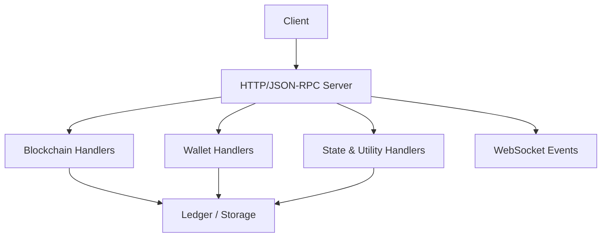
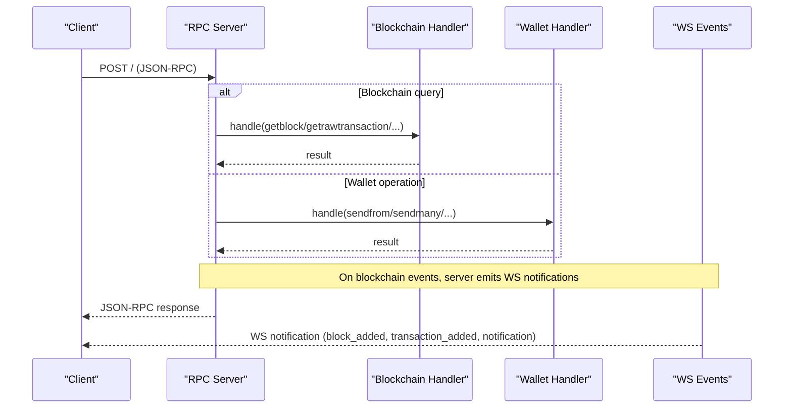
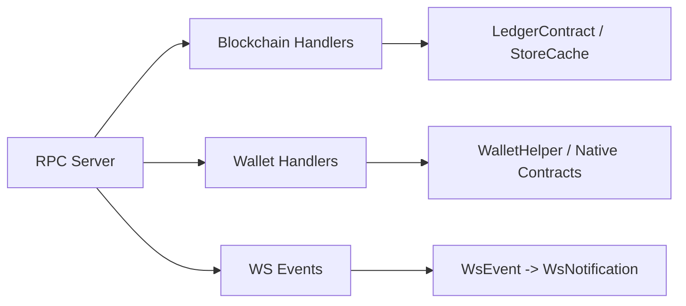

# API Reference

<cite>
**Referenced Files in This Document**
- [lib.rs](file://neo-rpc/src/lib.rs)
- [mod.rs (blockchain)](file://neo-rpc/src/server/rpc_server_blockchain/mod.rs)
- [mod.rs (wallet)](file://neo-rpc/src/server/rpc_server_wallet/mod.rs)
- [events.rs](file://neo-rpc/src/server/ws/events.rs)
- [ws_events.rs (tests)](file://neo-rpc/tests/ws_events.rs)
- [RpcServer.json](file://neo-node/config/RpcServer/RpcServer.json)
- [Cargo.toml](file://neo-rpc/Cargo.toml)
</cite>

## Table of Contents
1. Introduction
2. Project Structure
3. Core Components
4. Architecture Overview
5. Detailed Component Analysis
6. Dependency Analysis
7. Performance Considerations
8. Troubleshooting Guide
9. Conclusion
10. Appendices

## Introduction
This document provides a comprehensive API reference for the JSON-RPC endpoints exposed by the Neo RPC server, including blockchain queries, wallet operations, state queries, and utility functions. It also documents WebSocket notifications for real-time events such as block additions, transaction lifecycle events, and contract execution logs. For each endpoint, you will find:
- HTTP method and URL path
- Request parameters with validation rules and data types
- Response schema
- Error codes
- Example request/response pairs
- Usage patterns across multiple languages

The implementation is provided by the neo-rpc crate, which exposes both server and client functionality and implements the standard Neo JSON-RPC specification.

## Project Structure
The RPC layer is implemented under neo-rpc/src/server with modular handlers per domain:
- Blockchain methods: getbestblockhash, getblock, getrawtransaction, getstorage, etc.
- Wallet methods: openwallet, sendfrom, sendmany, calculatenetworkfee, etc.
- State utilities: getnativecontracts, getcommittee, getnextblockvalidators
- WebSocket events: block_added, transaction_added, transaction_removed, notification

Configuration for the RPC server is loaded from RpcServer.json and parsed into typed settings.

**Diagram sources**
- [lib.rs:56-99](file://neo-rpc/src/lib.rs#L56-L99)
- [mod.rs (blockchain):35-56](file://neo-rpc/src/server/rpc_server_blockchain/mod.rs#L35-L56)
- [mod.rs (wallet):56-80](file://neo-rpc/src/server/rpc_server_wallet/mod.rs#L56-L80)
- [events.rs:133-179](file://neo-rpc/src/server/ws/events.rs#L133-L179)

**Section sources**
- [lib.rs:6-13](file://neo-rpc/src/lib.rs#L6-L13)
- [Cargo.toml:16-79](file://neo-rpc/Cargo.toml#L16-L79)
- [RpcServer.json:1-16](file://neo-node/config/RpcServer/RpcServer.json#L1-L16)

## Core Components
- Blockchain RPCs: block and transaction retrieval, mempool inspection, native contracts, committee, validators, storage queries.
- Wallet RPCs: wallet lifecycle, address management, balance queries, transfers, fee estimation, cancellation.
- State/Utility RPCs: native contracts listing, committee info, next block validators.
- WebSocket Notifications: block added, transaction added/removed, contract notifications.

Key configuration:
- Bind address, port, CORS, rate limiting, max batch size, session settings, wallet directory, and gas limits are configurable via RpcServer.json.

**Section sources**
- [mod.rs (blockchain):35-56](file://neo-rpc/src/server/rpc_server_blockchain/mod.rs#L35-L56)
- [mod.rs (wallet):56-80](file://neo-rpc/src/server/rpc_server_wallet/mod.rs#L56-L80)
- [events.rs:133-179](file://neo-rpc/src/server/ws/events.rs#L133-L179)
- [RpcServer.json:1-16](file://neo-node/config/RpcServer/RpcServer.json#L1-L16)

## Architecture Overview
The RPC server registers handlers for each domain and routes JSON-RPC requests to the appropriate handler. Responses are serialized to JSON or base64 where applicable. WebSocket notifications are emitted for blockchain events.

**Diagram sources**
- [lib.rs:56-99](file://neo-rpc/src/lib.rs#L56-L99)
- [mod.rs (blockchain):35-56](file://neo-rpc/src/server/rpc_server_blockchain/mod.rs#L35-L56)
- [mod.rs (wallet):56-80](file://neo-rpc/src/server/rpc_server_wallet/mod.rs#L56-L80)
- [events.rs:133-179](file://neo-rpc/src/server/ws/events.rs#L133-L179)

## Detailed Component Analysis

### Blockchain Endpoints

#### getbestblockhash
- Method: POST
- Path: /
- Params: none
- Response: string (block hash)
- Errors: none expected

Example
- Request: {"jsonrpc":"2.0","id":1,"method":"getbestblockhash","params":[]}
- Response: {"jsonrpc":"2.0","id":1,"result":"0x..."}

**Section sources**
- [mod.rs (blockchain):58-63](file://neo-rpc/src/server/rpc_server_blockchain/mod.rs#L58-L63)

#### getblockcount
- Method: POST
- Path: /
- Params: none
- Response: integer (current block count)
- Errors: none expected

Example
- Request: {"jsonrpc":"2.0","id":1,"method":"getblockcount","params":[]}
- Response: {"jsonrpc":"2.0","id":1,"result":12345}

**Section sources**
- [mod.rs (blockchain):65-73](file://neo-rpc/src/server/rpc_server_blockchain/mod.rs#L65-L73)

#### getblockheadercount
- Method: POST
- Path: /
- Params: none
- Response: integer (header cache height + 1)

**Section sources**
- [mod.rs (blockchain):75-90](file://neo-rpc/src/server/rpc_server_blockchain/mod.rs#L75-L90)

#### getblockhash
- Method: POST
- Path: /
- Params:
  - index: integer (non-negative)
- Response: string (block hash)
- Validation: index must be <= current height; otherwise returns unknown_height error

Example
- Request: {"jsonrpc":"2.0","id":1,"method":"getblockhash","params":[10]}
- Response: {"jsonrpc":"2.0","id":1,"result":"0x..."}

**Section sources**
- [mod.rs (blockchain):92-106](file://neo-rpc/src/server/rpc_server_blockchain/mod.rs#L92-L106)

#### getblock
- Method: POST
- Path: /
- Params:
  - identifier: string (hash) or integer (index)
  - verbose: boolean or 0/1 (optional, default false)
- Response:
  - If verbose=false: base64-encoded block
  - If verbose=true: object with header fields, transactions array, confirmations, nextblockhash when available
- Validation: identifier must be valid hash or index within range

Example
- Request: {"jsonrpc":"2.0","id":1,"method":"getblock","params":["0x...", true]}
- Response: {"jsonrpc":"2.0","id":1,"result":{"hash":"...","tx":[...],...}}

**Section sources**
- [mod.rs (blockchain):108-128](file://neo-rpc/src/server/rpc_server_blockchain/mod.rs#L108-L128)
- [mod.rs (blockchain):573-647](file://neo-rpc/src/server/rpc_server_blockchain/mod.rs#L573-L647)

#### getblockheader
- Method: POST
- Path: /
- Params:
  - identifier: string (hash) or integer (index)
  - verbose: boolean or 0/1 (optional)
- Response:
  - If verbose=false: base64-encoded header
  - If verbose=true: header object with confirmations and nextblockhash

**Section sources**
- [mod.rs (blockchain):130-151](file://neo-rpc/src/server/rpc_server_blockchain/mod.rs#L130-L151)

#### getblocksysfee
- Method: POST
- Path: /
- Params:
  - height: integer (non-negative)
- Response: string (sum of system fees for block)
- Validation: height must be <= current height

**Section sources**
- [mod.rs (blockchain):153-173](file://neo-rpc/src/server/rpc_server_blockchain/mod.rs#L153-L173)

#### getrawmempool
- Method: POST
- Path: /
- Params:
  - include_unverified: boolean or 0/1 (optional, default false)
- Response:
  - If false: array of tx hashes
  - If true: object with height, verified[], unverified[]
- Validation: parameter must be boolean or 0/1

**Section sources**
- [mod.rs (blockchain):175-226](file://neo-rpc/src/server/rpc_server_blockchain/mod.rs#L175-L226)

#### getrawtransaction
- Method: POST
- Path: /
- Params:
  - hash: string (transaction hash)
  - verbose: boolean or 0/1 (optional)
- Response:
  - If verbose=false: base64-encoded transaction
  - If verbose=true: transaction object with confirmations, blockhash, blocktime
- Validation: hash must be valid; unknown_transaction if not found

Example
- Request: {"jsonrpc":"2.0","id":1,"method":"getrawtransaction","params":["0x...", true]}
- Response: {"jsonrpc":"2.0","id":1,"result":{"txid":"...","confirmations":5,...}}

**Section sources**
- [mod.rs (blockchain):228-282](file://neo-rpc/src/server/rpc_server_blockchain/mod.rs#L228-L282)

#### getcontractstate
- Method: POST
- Path: /
- Params:
  - identifier: string (name or hash) or integer (contract id)
- Response: contract state object
- Validation: invalid contract identifier or unknown_contract

**Section sources**
- [mod.rs (blockchain):284-290](file://neo-rpc/src/server/rpc_server_blockchain/mod.rs#L284-L290)
- [mod.rs (blockchain):721-789](file://neo-rpc/src/server/rpc_server_blockchain/mod.rs#L721-L789)

#### getstorage
- Method: POST
- Path: /
- Params:
  - identifier: string (name or hash) or integer (contract id)
  - key: string (Base64-encoded storage key)
- Response: string (Base64-encoded value)
- Validation: Base64 key must be valid; unknown_storage_item if missing

Example
- Request: {"jsonrpc":"2.0","id":1,"method":"getstorage","params":["0x...","aGVsbG8="]}
- Response: {"jsonrpc":"2.0","id":1,"result":"d29ybGQ="}

**Section sources**
- [mod.rs (blockchain):292-312](file://neo-rpc/src/server/rpc_server_blockchain/mod.rs#L292-L312)

#### findstorage
- Method: POST
- Path: /
- Params:
  - identifier: string (name or hash) or integer (contract id)
  - prefix: string (Base64-encoded storage prefix)
  - start: integer (non-negative, optional, default 0)
- Response: object with truncated (boolean), next (integer), results (array of {key,value})
- Validation: Base64 prefix must be valid; start must be non-negative integer

**Section sources**
- [mod.rs (blockchain):314-380](file://neo-rpc/src/server/rpc_server_blockchain/mod.rs#L314-L380)

#### getnativecontracts
- Method: POST
- Path: /
- Params: none
- Response: array of native contract states

**Section sources**
- [mod.rs (blockchain):382-407](file://neo-rpc/src/server/rpc_server_blockchain/mod.rs#L382-L407)

#### getnextblockvalidators
- Method: POST
- Path: /
- Params: none
- Response: array of {publickey, votes}

**Section sources**
- [mod.rs (blockchain):409-441](file://neo-rpc/src/server/rpc_server_blockchain/mod.rs#L409-L441)

#### getcandidates
- Method: POST
- Path: /
- Params: none
- Response: array of {publickey, votes, active}

**Section sources**
- [mod.rs (blockchain):443-475](file://neo-rpc/src/server/rpc_server_blockchain/mod.rs#L443-L475)

#### gettransactionheight
- Method: POST
- Path: /
- Params:
  - hash: string (transaction hash)
- Response: integer (block index)
- Validation: unknown_transaction if not found

**Section sources**
- [mod.rs (blockchain):477-486](file://neo-rpc/src/server/rpc_server_blockchain/mod.rs#L477-L486)

#### getcommittee
- Method: POST
- Path: /
- Params: none
- Response: array of hex-encoded public keys

**Section sources**
- [mod.rs (blockchain):488-502](file://neo-rpc/src/server/rpc_server_blockchain/mod.rs#L488-L502)

### Wallet Endpoints

Note: Wallet methods are protected metadata and require an opened wallet. Authentication may be enforced based on server configuration.

#### openwallet
- Method: POST
- Path: /
- Params:
  - path: string (wallet file path, resolved under configured WalletDirectory or CWD)
  - password: string
- Response: boolean (true on success)
- Validation: path traversal prevented; invalid password or file not found mapped to specific errors

**Section sources**
- [mod.rs (wallet):209-245](file://neo-rpc/src/server/rpc_server_wallet/mod.rs#L209-L245)
- [mod.rs (wallet):247-284](file://neo-rpc/src/server/rpc_server_wallet/mod.rs#L247-L284)

#### closewallet
- Method: POST
- Path: /
- Params: none
- Response: boolean (true)

**Section sources**
- [mod.rs (wallet):82-85](file://neo-rpc/src/server/rpc_server_wallet/mod.rs#L82-L85)

#### dumpprivkey
- Method: POST
- Path: /
- Params:
  - address: string (address or script hash)
- Response: string (WIF private key)
- Validation: account must exist and have a key (not watch-only)

**Section sources**
- [mod.rs (wallet):87-103](file://neo-rpc/src/server/rpc_server_wallet/mod.rs#L87-L103)

#### getnewaddress
- Method: POST
- Path: /
- Params: none
- Response: string (new address)

**Section sources**
- [mod.rs (wallet):105-117](file://neo-rpc/src/server/rpc_server_wallet/mod.rs#L105-L117)

#### getwalletbalance
- Method: POST
- Path: /
- Params:
  - asset: string (asset ID as UInt160)
- Response: object {balance: string}
- Notes: special handling for NEO and GAS tokens; NEP-17 balances computed via read-only invocation

**Section sources**
- [mod.rs (wallet):119-159](file://neo-rpc/src/server/rpc_server_wallet/mod.rs#L119-L159)

#### getwalletunclaimedgas
- Method: POST
- Path: /
- Params: none
- Response: string (total unclaimed gas)

**Section sources**
- [mod.rs (wallet):161-185](file://neo-rpc/src/server/rpc_server_wallet/mod.rs#L161-L185)

#### importprivkey
- Method: POST
- Path: /
- Params:
  - privkey: string (WIF)
- Response: object (account info)

**Section sources**
- [mod.rs (wallet):187-198](file://neo-rpc/src/server/rpc_server_wallet/mod.rs#L187-L198)

#### listaddress
- Method: POST
- Path: /
- Params: none
- Response: array of account objects {address, haskey, label, watchonly}

**Section sources**
- [mod.rs (wallet):200-207](file://neo-rpc/src/server/rpc_server_wallet/mod.rs#L200-L207)

#### calculatenetworkfee
- Method: POST
- Path: /
- Params:
  - rawtransaction: string (base64-encoded transaction)
- Response: object {networkfee: string}
- Validation: base64-decoded transaction must be valid

**Section sources**
- [mod.rs (wallet):286-311](file://neo-rpc/src/server/rpc_server_wallet/mod.rs#L286-L311)

#### sendfrom
- Method: POST
- Path: /
- Params:
  - asset: string (UInt160)
  - from: string (address or script hash)
  - to: string (address or script hash)
  - amount: string (decimal formatted according to asset decimals)
  - signers: array of strings (optional)
- Response: transaction object or hash
- Validation: amount must be positive and correctly formatted; insufficient funds mapped to specific error

Example
- Request: {"jsonrpc":"2.0","id":1,"method":"sendfrom","params":["0x...","N...","M...","1.23",[]]}
- Response: {"jsonrpc":"2.0","id":1,"result":{"txid":"..."}}

**Section sources**
- [mod.rs (wallet):313-331](file://neo-rpc/src/server/rpc_server_wallet/mod.rs#L313-L331)

#### sendtoaddress
- Method: POST
- Path: /
- Params:
  - asset: string (UInt160)
  - to: string (address or script hash)
  - amount: string (decimal)
  - signers: array of strings (optional)
- Response: transaction object or hash

**Section sources**
- [mod.rs (wallet):333-349](file://neo-rpc/src/server/rpc_server_wallet/mod.rs#L333-L349)

#### sendmany
- Method: POST
- Path: /
- Params:
  - from: string (optional, address or script hash)
  - to: array of objects [{asset: string, value: string, address: string}, ...]
  - signers: array of strings (optional)
- Response: transaction object or hash
- Validation: at least one output required; amounts must be positive and correctly formatted

Example
- Request: {"jsonrpc":"2.0","id":1,"method":"sendmany","params":["N...",[{"asset":"0x...","value":"1.0","address":"M..."}]]}
- Response: {"jsonrpc":"2.0","id":1,"result":{"txid":"..."}}

**Section sources**
- [mod.rs (wallet):351-389](file://neo-rpc/src/server/rpc_server_wallet/mod.rs#L351-L389)

#### canceltransaction
- Method: POST
- Path: /
- Params:
  - txid: string (transaction hash)
  - signers: array of strings (addresses)
  - extra_fee: string (optional additional fee)
- Response: transaction object or hash
- Validation: cannot cancel confirmed transactions; signers must be non-empty

**Section sources**
- [mod.rs (wallet):391-465](file://neo-rpc/src/server/rpc_server_wallet/mod.rs#L391-L465)

### State and Utility Endpoints

#### getnativecontracts
- See Blockchain section above.

#### getcommittee
- See Blockchain section above.

#### getnextblockvalidators
- See Blockchain section above.

#### getcandidates
- See Blockchain section above.

### WebSocket Endpoints

WebSocket notifications are pushed to clients subscribed to event streams. Each notification is a JSON-RPC 2.0 notification with method and params.

Event types and payloads:
- block_added
  - method: "block_added"
  - params: {hash: string (prefixed 0x...), height: integer}
- transaction_added
  - method: "transaction_added"
  - params: {hash: string (prefixed 0x...)}
- transaction_removed
  - method: "transaction_removed"
  - params: {hashes: array of strings (prefixed 0x...), reason: string}
- notification
  - method: "notification"
  - params: {contract: string (prefixed 0x...), eventname: string, state: any}

Example notifications
- Block added: {"jsonrpc":"2.0","method":"block_added","params":{"hash":"0x...","height":12345}}
- Transaction added: {"jsonrpc":"2.0","method":"transaction_added","params":{"hash":"0x..."}}
- Contract notification: {"jsonrpc":"2.0","method":"notification","params":{"contract":"0x...","eventname":"Transfer","state":[...]}}

**Section sources**
- [events.rs:133-179](file://neo-rpc/src/server/ws/events.rs#L133-L179)
- [events.rs:176-215](file://neo-rpc/src/server/ws/events.rs#L176-L215)
- [ws_events.rs (tests):42-88](file://neo-rpc/tests/ws_events.rs#L42-L88)

## Dependency Analysis
- The RPC server depends on core ledger and storage interfaces to fetch blocks, transactions, and state.
- Wallet methods depend on wallet helpers and native token contracts for balance and transfer logic.
- WebSocket events are constructed from internal event types and serialized to JSON-RPC notifications.

**Diagram sources**
- [mod.rs (blockchain):35-56](file://neo-rpc/src/server/rpc_server_blockchain/mod.rs#L35-L56)
- [mod.rs (wallet):56-80](file://neo-rpc/src/server/rpc_server_wallet/mod.rs#L56-L80)
- [events.rs:133-179](file://neo-rpc/src/server/ws/events.rs#L133-L179)

**Section sources**
- [lib.rs:56-99](file://neo-rpc/src/lib.rs#L56-L99)
- [Cargo.toml:16-79](file://neo-rpc/Cargo.toml#L16-L79)

## Performance Considerations
- Rate limiting: MaxRequestsPerSecond and RateLimitBurst can be configured to prevent abuse.
- Batch size: MaxBatchSize limits concurrent JSON-RPC calls per request to mitigate amplification attacks.
- Storage pagination: FindStoragePageSize controls page size for findstorage to avoid large responses.
- Invoke limits: MaxGasInvoke caps gas usage for read-only invocations used by wallet balance calculations.

[No sources needed since this section provides general guidance]

## Troubleshooting Guide
Common error scenarios and mappings:
- Invalid parameters: invalid_params with descriptive message (e.g., wrong type, out-of-range values).
- Unknown resources: unknown_block, unknown_transaction, unknown_contract, unknown_storage_item.
- Wallet issues: no_opened_wallet, wallet_not_found, wallet_not_supported (invalid password), insufficient_funds_wallet.
- Internal errors: internal_server_error for unexpected failures.

Error code references are defined centrally and used across handlers.

**Section sources**
- [lib.rs:136-154](file://neo-rpc/src/lib.rs#L136-L154)
- [mod.rs (blockchain):92-106](file://neo-rpc/src/server/rpc_server_blockchain/mod.rs#L92-L106)
- [mod.rs (wallet):209-245](file://neo-rpc/src/server/rpc_server_wallet/mod.rs#L209-L245)

## Conclusion
The Neo RPC server provides a robust set of JSON-RPC endpoints for blockchain queries, wallet operations, state queries, and utility functions, along with WebSocket notifications for real-time updates. Configuration options allow fine-tuning performance and security. Use the documented parameters, validation rules, and error codes to integrate reliably.

[No sources needed since this section summarizes without analyzing specific files]

## Appendices

### Parameter Validation Rules Summary
- Hashes: Must be valid 32-byte hashes represented as hex strings; some endpoints accept prefixed 0x format for WebSocket payloads.
- Indices/Heights: Non-negative integers bounded by current chain height.
- Amounts: Decimal strings parsed with asset-specific decimals; must be positive.
- Base64 fields: Strictly validated; invalid Base64 yields invalid_params.
- Signers: Optional arrays of addresses; must be valid and non-empty where required.

**Section sources**
- [mod.rs (blockchain):504-554](file://neo-rpc/src/server/rpc_server_blockchain/mod.rs#L504-L554)
- [mod.rs (wallet):467-499](file://neo-rpc/src/server/rpc_server_wallet/mod.rs#L467-L499)

### Configuration Options (selected)
- Network, BindAddress, Port
- EnableCors, AllowOrigins
- MaxConcurrentConnections, KeepAliveTimeout, RequestHeadersTimeout
- MaxRequestsPerSecond, RateLimitBurst
- MaxRequestBodySize, MaxBatchSize
- MaxGasInvoke, MaxFee
- SessionEnabled, SessionExpirationTime
- FindStoragePageSize
- WalletDirectory

**Section sources**
- [RpcServer.json:1-16](file://neo-node/config/RpcServer/RpcServer.json#L1-L16)
- [Cargo.toml:87-139](file://neo-rpc/Cargo.toml#L87-L139)