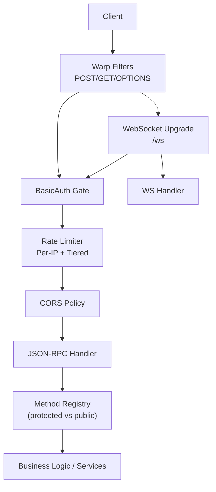
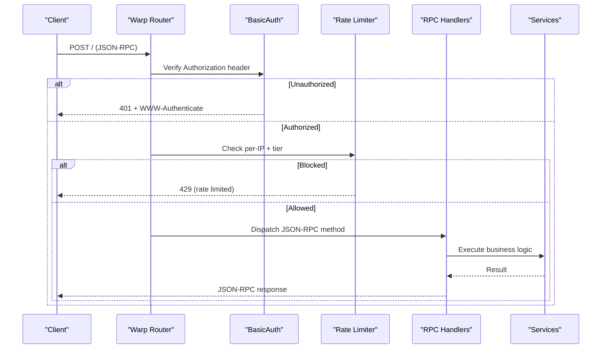
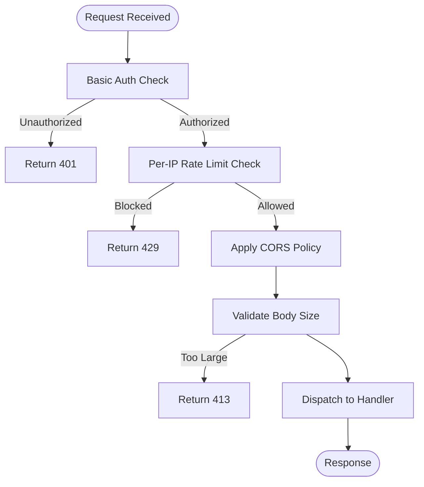
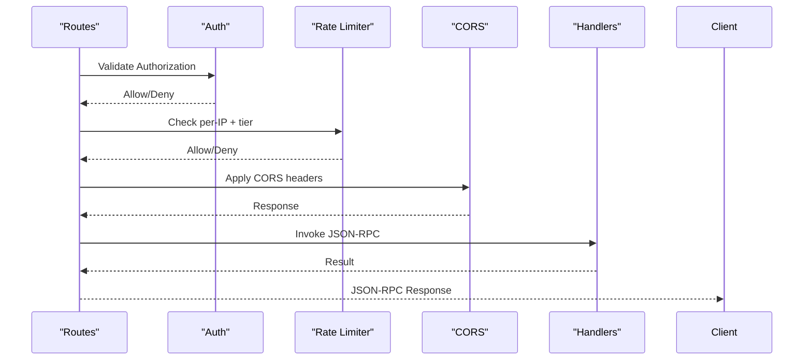
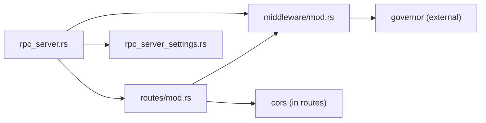

# Authentication & Security

<cite>
**Referenced Files in This Document**
- [SECURITY.md](file://docs/SECURITY.md)
- [RPC_HARDENING.md](file://docs/RPC_HARDENING.md)
- [mod.rs](file://neo-rpc/src/server/mod.rs)
- [rpc_server.rs](file://neo-rpc/src/server/rpc_server.rs)
- [rpc_server_settings.rs](file://neo-rpc/src/server/rpc_server_settings.rs)
- [routes/mod.rs](file://neo-rpc/src/server/routes/mod.rs)
- [middleware/mod.rs](file://neo-rpc/src/server/middleware/mod.rs)
- [middleware/rate_limiter.rs](file://neo-rpc/src/server/middleware/rate_limiter.rs)
- [RpcServer.json](file://neo-node/config/RpcServer/RpcServer.json)
</cite>

## Table of Contents
1. Introduction
2. Project Structure
3. Core Components
4. Architecture Overview
5. Detailed Component Analysis
6. Dependency Analysis
7. Performance Considerations
8. Troubleshooting Guide
9. Conclusion
10. Appendices

## Introduction
This document explains the RPC server authentication and security mechanisms in the project, focusing on:
- Authentication methods supported by the RPC server (HTTP Basic Authentication; TLS with optional client certificate validation)
- Authorization controls and method-level protection
- Rate limiting and DDoS protections
- TLS/SSL configuration and secure communication setup
- Middleware pipeline for request processing, validation, and security checks
- Configuration examples, monitoring, and common vulnerabilities with mitigations

The goal is to help operators and developers configure a hardened RPC surface while understanding how requests are authenticated, authorized, throttled, and protected against abuse.

## Project Structure
The RPC server is implemented under neo-rpc/src/server and integrates with warp filters, hyper/TLS, and a built-in rate limiter. Key elements include:
- Server lifecycle and TLS handling
- Route building with auth, CORS, and rate limiting
- Per-method protection via handler registration
- Configuration-driven security settings
- WebSocket upgrade path with consistent auth enforcement

**Diagram sources**
- [rpc_server.rs:194-516](file://neo-rpc/src/server/rpc_server.rs#L194-L516)
- [routes/mod.rs:54-118](file://neo-rpc/src/server/routes/mod.rs#L54-L118)
- [routes/mod.rs:120-153](file://neo-rpc/src/server/routes/mod.rs#L120-L153)
- [middleware/rate_limiter.rs:196-356](file://neo-rpc/src/server/middleware/rate_limiter.rs#L196-L356)

**Section sources**
- [mod.rs:1-66](file://neo-rpc/src/server/mod.rs#L1-L66)
- [rpc_server.rs:194-516](file://neo-rpc/src/server/rpc_server.rs#L194-L516)
- [routes/mod.rs:54-118](file://neo-rpc/src/server/routes/mod.rs#L54-L118)

## Core Components
- RpcServer: Lifecycle, TLS accept loop, connection limits, session management, and startup warnings when exposing credentials without TLS.
- Routes: Build POST/GET/OPTIONS routes, enforce Basic Auth, apply CORS, and integrate rate limiting.
- Rate Limiter: Per-IP, per-tier throttling using governor-based GCRA with automatic cleanup.
- Settings: JSON-driven configuration for bind address, port, TLS, auth, CORS, body size, timeouts, gas/fee caps, disabled methods, sessions, batch size, and rate limits.
- WebSocket: Upgrade route that enforces the same Basic Auth as HTTP RPC.

Key responsibilities:
- Enforce authentication before routing to handlers
- Limit resource usage via connection limits, body size, timeouts, and batch size
- Throttle abusive clients per IP and per method tier
- Provide TLS termination or recommend reverse proxy termination
- Expose only necessary methods and disable sensitive ones by default

**Section sources**
- [rpc_server.rs:105-128](file://neo-rpc/src/server/rpc_server.rs#L105-L128)
- [rpc_server.rs:194-241](file://neo-rpc/src/server/rpc_server.rs#L194-L241)
- [routes/mod.rs:54-118](file://neo-rpc/src/server/routes/mod.rs#L54-L118)
- [middleware/rate_limiter.rs:196-356](file://neo-rpc/src/server/middleware/rate_limiter.rs#L196-L356)
- [rpc_server_settings.rs:36-146](file://neo-rpc/src/server/rpc_server_settings.rs#L36-L146)

## Architecture Overview
The RPC server uses a layered approach:
- Transport layer: Hyper server with optional rustls TLS acceptor
- Routing layer: Warp filters for POST/GET/OPTIONS and WebSocket upgrade
- Security layer: Basic Auth gate, CORS policy, rate limiter
- Application layer: JSON-RPC dispatch to registered handlers (public vs protected)

**Diagram sources**
- [rpc_server.rs:194-516](file://neo-rpc/src/server/rpc_server.rs#L194-L516)
- [routes/mod.rs:54-118](file://neo-rpc/src/server/routes/mod.rs#L54-L118)
- [routes/mod.rs:120-153](file://neo-rpc/src/server/routes/mod.rs#L120-L153)
- [middleware/rate_limiter.rs:196-356](file://neo-rpc/src/server/middleware/rate_limiter.rs#L196-L356)

## Detailed Component Analysis

### Authentication
- HTTP Basic Authentication:
  - The routes construct a BasicAuth gate from settings and enforce it on both HTTP and WebSocket upgrades.
  - On missing or invalid credentials, the server responds with 401 and includes a WWW-Authenticate header.
- TLS/SSL:
  - Built-in TLS support via rustls is available through settings (certificate and password). When enabled, the server logs whether client certificates are required based on trusted authorities.
  - If credentials are set but the server binds to non-localhost without TLS, a security warning is emitted at startup.
- Certificate-based authentication:
  - Client certificate verification can be enforced by configuring trusted authorities; if configured, at least one matching CA must load or the server refuses to start.

Implementation highlights:
- Startup warning for insecure exposure of credentials without TLS
- TLS acceptor with handshake timeout to avoid stalled connections
- WebSocket upgrade enforces the same Basic Auth as HTTP

**Section sources**
- [rpc_server.rs:207-220](file://neo-rpc/src/server/rpc_server.rs#L207-L220)
- [rpc_server.rs:255-389](file://neo-rpc/src/server/rpc_server.rs#L255-L389)
- [routes/mod.rs:120-153](file://neo-rpc/src/server/routes/mod.rs#L120-L153)
- [RPC_HARDENING.md:24-63](file://docs/RPC_HARDENING.md#L24-L63)

### Authorization and Method Protection
- Protected vs public methods:
  - Handlers can be registered as protected, requiring authentication to execute.
  - Public handlers do not require authentication.
- Disabled methods:
  - Methods listed in configuration are disabled globally, preventing access even if registered.
- CORS:
  - CORS can be enabled with an allowlist of origins; defaults to closed to reduce risk.

Operational guidance:
- Keep sensitive methods disabled unless explicitly needed
- Prefer reverse proxy ACLs to restrict endpoints further
- Use environment overrides for secrets and endpoints

**Section sources**
- [rpc_server.rs:76-81](file://neo-rpc/src/server/rpc_server.rs#L76-L81)
- [rpc_server.rs:221-241](file://neo-rpc/src/server/rpc_server.rs#L221-L241)
- [routes/mod.rs:54-118](file://neo-rpc/src/server/routes/mod.rs#L54-L118)
- [rpc_server_settings.rs:36-146](file://neo-rpc/src/server/rpc_server_settings.rs#L36-L146)

### Rate Limiting and DDoS Protections
- Per-IP rate limiting:
  - Uses a keyed GCRA limiter per IP with tiers for different method costs (Cheap, Standard, Expensive, Write).
  - Tiers adjust limits relative to the configured base; expensive/write methods get stricter limits.
- Burst control:
  - Configurable burst capacity to handle short spikes while protecting steady-state throughput.
- Connection limits:
  - Global semaphore limits concurrent connections to prevent resource exhaustion.
- Request size and timeouts:
  - Max request body size and header read timeouts protect against large payloads and slowloris-style attacks.
- Batch size limit:
  - Limits number of JSON-RPC calls in a single batch to prevent amplification bypassing per-IP limits.
- Stale entry cleanup:
  - Tracks last access time and prunes stale entries to bound memory usage.

**Diagram sources**
- [routes/mod.rs:54-118](file://neo-rpc/src/server/routes/mod.rs#L54-L118)
- [middleware/rate_limiter.rs:196-356](file://neo-rpc/src/server/middleware/rate_limiter.rs#L196-L356)
- [rpc_server.rs:221-241](file://neo-rpc/src/server/rpc_server.rs#L221-L241)

**Section sources**
- [middleware/rate_limiter.rs:41-106](file://neo-rpc/src/server/middleware/rate_limiter.rs#L41-L106)
- [middleware/rate_limiter.rs:196-356](file://neo-rpc/src/server/middleware/rate_limiter.rs#L196-L356)
- [rpc_server.rs:221-241](file://neo-rpc/src/server/rpc_server.rs#L221-L241)
- [rpc_server_settings.rs:58-74](file://neo-rpc/src/server/rpc_server_settings.rs#L58-L74)
- [rpc_server_settings.rs:129-136](file://neo-rpc/src/server/rpc_server_settings.rs#L129-L136)

### TLS/SSL Configuration and Secure Communication
- Built-in TLS:
  - Configure certificate and password; optionally set trusted authorities to require client certificates.
  - Handshake deadline prevents stalled TLS handshakes from blocking the accept loop.
- Reverse proxy recommendation:
  - Terminate TLS at a reverse proxy (nginx/caddy/envoy) for operational simplicity and centralized policy.
- Environment overrides:
  - Use environment variables for secrets and endpoints in containers.

Best practices:
- Bind to localhost and expose via reverse proxy
- Enable CORS only with explicit allowlists
- Disable sensitive methods and wallet operations on untrusted networks

**Section sources**
- [rpc_server.rs:255-389](file://neo-rpc/src/server/rpc_server.rs#L255-L389)
- [RPC_HARDENING.md:24-63](file://docs/RPC_HARDENING.md#L24-L63)

### Middleware Pipeline
The request pipeline applies these stages in order:
1. Route selection (POST/GET/OPTIONS)
2. Basic Auth gate (for both HTTP and WebSocket)
3. Rate limiting (per-IP, per-tier)
4. CORS policy application
5. Body size and timeout enforcement
6. JSON-RPC dispatch to protected/public handlers
7. Response formatting and status codes

**Diagram sources**
- [routes/mod.rs:54-118](file://neo-rpc/src/server/routes/mod.rs#L54-L118)
- [routes/mod.rs:120-153](file://neo-rpc/src/server/routes/mod.rs#L120-L153)
- [middleware/rate_limiter.rs:196-356](file://neo-rpc/src/server/middleware/rate_limiter.rs#L196-L356)

**Section sources**
- [routes/mod.rs:54-118](file://neo-rpc/src/server/routes/mod.rs#L54-L118)
- [routes/mod.rs:120-153](file://neo-rpc/src/server/routes/mod.rs#L120-L153)

### Monitoring and Observability
- Prometheus metrics:
  - Total RPC requests and errors counters are registered and incremented during request processing.
- Logging:
  - Startup warnings for insecure configurations
  - TLS handshake failures and accept errors logged
  - Rate limiting and connection limits logged where applicable

Operational tips:
- Monitor error counters and request rates to detect anomalies
- Alert on repeated 401/429 responses indicating misconfiguration or abuse
- Track TLS handshake failures to identify network issues or misconfigurations

**Section sources**
- [rpc_server.rs:83-103](file://neo-rpc/src/server/rpc_server.rs#L83-L103)
- [rpc_server.rs:207-220](file://neo-rpc/src/server/rpc_server.rs#L207-L220)
- [rpc_server.rs:333-345](file://neo-rpc/src/server/rpc_server.rs#L333-L345)

### Examples and Configuration
- Sample plugin configuration:
  - See the sample RpcServer.json for recommended values including bind address, port, TLS fields, rate limits, body size, timeouts, disabled methods, and session settings.
- Hardening recommendations:
  - Bind to loopback and front with a reverse proxy
  - Disable CORS unless you have a trusted origin list
  - Set strong credentials or rely on proxy authentication
  - Use the hardened CLI switch to force auth and disable dangerous methods
  - Prefer terminating TLS at the proxy; if using built-in TLS, configure trusted authorities appropriately

Environment variables:
- Use environment overrides for secrets and endpoints in containers (e.g., RPC user/pass, TLS cert, bind/port, CORS, disabled methods).

**Section sources**
- [RpcServer.json:1-16](file://neo-node/config/RpcServer/RpcServer.json#L1-L16)
- [RPC_HARDENING.md:24-63](file://docs/RPC_HARDENING.md#L24-L63)

## Dependency Analysis
- rpc_server depends on:
  - routes for filter composition and request handling
  - middleware for rate limiting
  - settings for configuration and validation
  - TLS components for secure transport
- routes depend on:
  - middleware for rate limiting
  - cors utilities for policy application
  - handlers for JSON-RPC dispatch
- middleware depends on:
  - governor for GCRA-based rate limiting
  - dashmap for concurrent maps

Potential coupling risks:
- Tight coupling between routes and middleware requires careful updates to preserve auth and rate limiting semantics
- TLS configuration changes affect accept loop behavior and handshake deadlines

**Diagram sources**
- [rpc_server.rs:194-516](file://neo-rpc/src/server/rpc_server.rs#L194-L516)
- [routes/mod.rs:54-118](file://neo-rpc/src/server/routes/mod.rs#L54-L118)
- [middleware/mod.rs:1-10](file://neo-rpc/src/server/middleware/mod.rs#L1-L10)
- [rpc_server_settings.rs:36-146](file://neo-rpc/src/server/rpc_server_settings.rs#L36-L146)

**Section sources**
- [mod.rs:1-66](file://neo-rpc/src/server/mod.rs#L1-L66)
- [rpc_server.rs:194-516](file://neo-rpc/src/server/rpc_server.rs#L194-L516)
- [routes/mod.rs:54-118](file://neo-rpc/src/server/routes/mod.rs#L54-L118)
- [middleware/mod.rs:1-10](file://neo-rpc/src/server/middleware/mod.rs#L1-L10)

## Performance Considerations
- Connection limits:
  - Use max_concurrent_connections to cap concurrency and prevent resource exhaustion.
- Body size and timeouts:
  - Tune max_request_body_size and request_headers_timeout to balance usability and protection.
- Rate limiting:
  - Adjust max_requests_per_second and rate_limit_burst according to expected traffic patterns.
  - Leverage per-tier limits to protect expensive methods.
- Batch size:
  - Cap max_batch_size to prevent amplification attacks.
- Session management:
  - Configure session expiration and maximum sessions to avoid leaks and resource pressure.

[No sources needed since this section provides general guidance]

## Troubleshooting Guide
Common issues and mitigations:
- 401 Unauthorized:
  - Ensure correct Authorization header or enable Basic Auth in settings
  - For WebSocket upgrades, ensure the same credentials are provided
- 429 Too Many Requests:
  - Review per-IP rate limits and tier assignments; adjust max_requests_per_second and burst
  - Check for misconfigured tiers causing overly strict limits on specific methods
- TLS handshake failures:
  - Inspect certificate paths and passwords; verify trusted authorities configuration
  - Monitor handshake timeout logs for stalled connections
- CORS errors:
  - Ensure allow_origins includes the requesting origin; avoid wildcard (*) in production
- High error rates:
  - Monitor prometheus counters for neo_rpc_errors_total and analyze patterns

Operational checks:
- Confirm bind_address is loopback when exposing via reverse proxy
- Verify disabled_methods includes sensitive endpoints
- Validate environment overrides for secrets and endpoints

**Section sources**
- [routes/mod.rs:120-153](file://neo-rpc/src/server/routes/mod.rs#L120-L153)
- [middleware/rate_limiter.rs:196-356](file://neo-rpc/src/server/middleware/rate_limiter.rs#L196-L356)
- [rpc_server.rs:207-220](file://neo-rpc/src/server/rpc_server.rs#L207-L220)
- [rpc_server.rs:333-345](file://neo-rpc/src/server/rpc_server.rs#L333-L345)

## Conclusion
The RPC server implements a robust security posture with:
- HTTP Basic Authentication and optional TLS with client certificate validation
- Method-level authorization via protected handlers and disabled methods
- Comprehensive rate limiting with per-IP and per-tier controls
- Strong defaults and hardening recommendations to minimize exposure
- Operational safeguards like connection limits, body size caps, timeouts, and batch size limits

For production deployments, prefer terminating TLS at a reverse proxy, binding to localhost, disabling unnecessary methods, and enabling rate limiting with appropriate tiers. Monitor metrics and logs to detect and respond to anomalies quickly.

[No sources needed since this section summarizes without analyzing specific files]

## Appendices

### Appendix A: Threat Model and Network Security Notes
- The broader threat model covers P2P, consensus, VM, and storage layers, with RPC identified as a critical attack surface requiring authentication, CORS controls, method filtering, and rate limiting.
- DoS protections include message size limits, per-peer quotas, and VM execution limits across the system.

**Section sources**
- [SECURITY.md:133-167](file://docs/SECURITY.md#L133-L167)
- [SECURITY.md:550-607](file://docs/SECURITY.md#L550-L607)