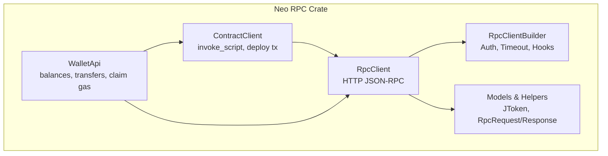
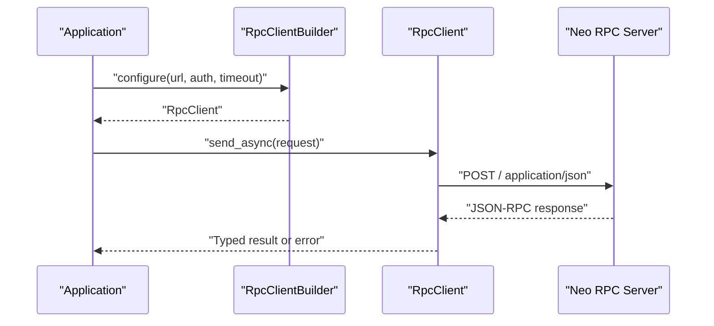
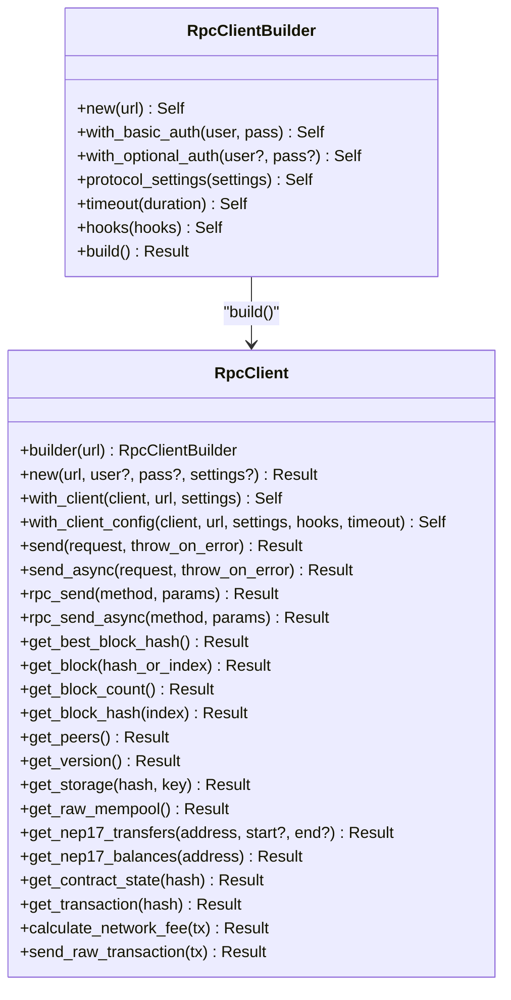
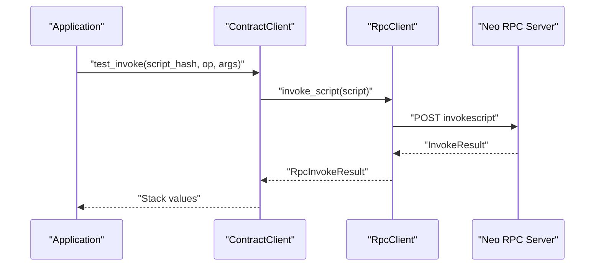
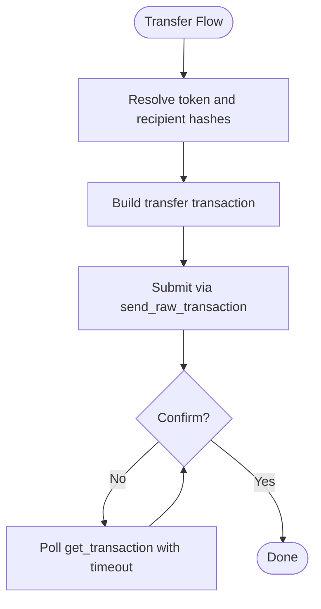
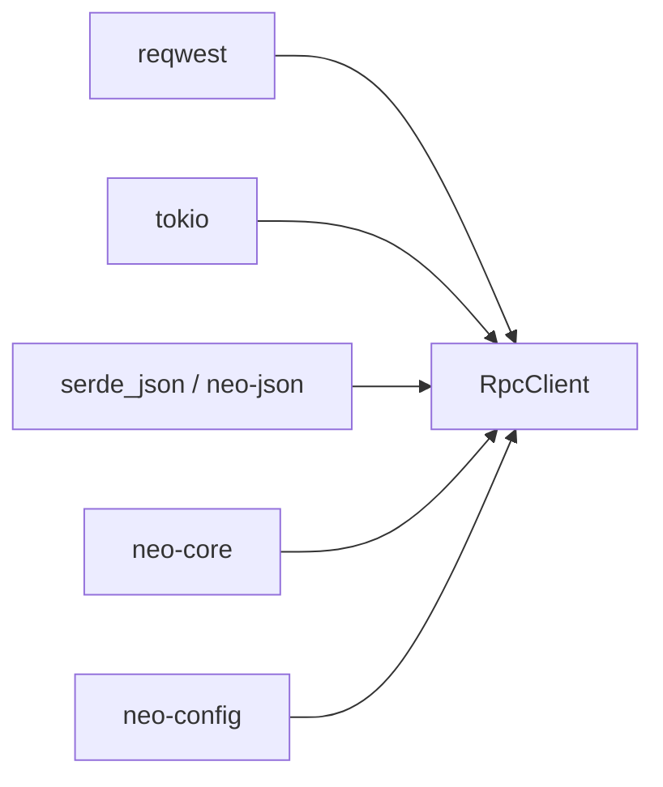

# Client Implementation

<cite>
**Referenced Files in This Document**
- [lib.rs](file://neo-rpc/src/lib.rs)
- [Cargo.toml](file://neo-rpc/Cargo.toml)
- [client/mod.rs](file://neo-rpc/src/client/mod.rs)
- [rpc_client/mod.rs](file://neo-rpc/src/client/rpc_client/mod.rs)
- [rpc_client/client.rs](file://neo-rpc/src/client/rpc_client/client.rs)
- [rpc_client/builder.rs](file://neo-rpc/src/client/rpc_client/builder.rs)
- [contract_client.rs](file://neo-rpc/src/client/contract_client.rs)
- [wallet_api.rs](file://neo-rpc/src/client/wallet_api.rs)
</cite>

## Table of Contents
1. [Introduction](#introduction)
2. [Project Structure](#project-structure)
3. [Core Components](#core-components)
4. [Architecture Overview](#architecture-overview)
5. [Detailed Component Analysis](#detailed-component-analysis)
6. [Dependency Analysis](#dependency-analysis)
7. [Performance Considerations](#performance-considerations)
8. [Troubleshooting Guide](#troubleshooting-guide)
9. [Conclusion](#conclusion)
10. [Appendices](#appendices)

## Introduction
This document provides comprehensive client implementation guidance for interacting with the Neo RPC server using the official Rust client library in this repository. It covers connection setup, authentication configuration, request handling, high-level APIs for blockchain queries, transaction submission, wallet operations, and smart contract interactions. It also includes patterns for synchronous and asynchronous usage, error handling, retry strategies, WebSocket considerations, connection pooling, performance optimization, and troubleshooting techniques for production applications.

The client is implemented under the neo-rpc crate and exposes a typed, ergonomic API that matches the C# RpcClient behavior. It supports both synchronous and asynchronous calls over HTTP JSON-RPC, with hooks for observability and configurable timeouts.

**Section sources**
- [lib.rs:6-54](file://neo-rpc/src/lib.rs#L6-L54)
- [Cargo.toml:16-134](file://neo-rpc/Cargo.toml#L16-L134)

## Project Structure
The client functionality is organized under the neo-rpc crate’s client module. The key entry points are:
- RpcClient and RpcClientBuilder for connection and request lifecycle
- ContractClient for read-only contract invocations and deployment transaction building
- WalletApi for wallet-related operations (balances, transfers, claiming GAS)
- High-level helpers and models for JSON-RPC requests/responses

**Diagram sources**
- [client/mod.rs:17-41](file://neo-rpc/src/client/mod.rs#L17-L41)
- [rpc_client/mod.rs:21-44](file://neo-rpc/src/client/rpc_client/mod.rs#L21-L44)
- [rpc_client/client.rs:48-102](file://neo-rpc/src/client/rpc_client/client.rs#L48-L102)
- [contract_client.rs:24-37](file://neo-rpc/src/client/contract_client.rs#L24-L37)
- [wallet_api.rs:23-41](file://neo-rpc/src/client/wallet_api.rs#L23-L41)

**Section sources**
- [client/mod.rs:12-41](file://neo-rpc/src/client/mod.rs#L12-L41)
- [rpc_client/mod.rs:21-44](file://neo-rpc/src/client/rpc_client/mod.rs#L21-L44)

## Core Components
- RpcClient: Core HTTP JSON-RPC client with async/sync send methods, method wrappers for blockchain, mempool, contracts, and transactions.
- RpcClientBuilder: Configures base URL, basic auth headers, timeout, protocol settings, and hooks; securely handles credentials.
- ContractClient: Builds dynamic call scripts and invokes them via invoke_script; supports deploying contracts by constructing and signing transactions.
- WalletApi: Provides convenient wallet operations such as balance queries, token transfers, claiming GAS, and waiting for confirmations.

Key capabilities:
- Synchronous and asynchronous request sending
- Typed method wrappers for common RPC endpoints
- Error mapping to JSON-RPC codes
- Hook-based observability for metrics/logging
- Protocol-aware serialization/deserialization

**Section sources**
- [rpc_client/client.rs:144-233](file://neo-rpc/src/client/rpc_client/client.rs#L144-L233)
- [rpc_client/builder.rs:22-115](file://neo-rpc/src/client/rpc_client/builder.rs#L22-L115)
- [contract_client.rs:39-109](file://neo-rpc/src/client/contract_client.rs#L39-L109)
- [wallet_api.rs:43-189](file://neo-rpc/src/client/wallet_api.rs#L43-L189)

## Architecture Overview
The client follows a layered design:
- Builder constructs an HTTP client with optional Basic Auth and timeout
- RpcClient encapsulates base URL, protocol settings, and sends JSON-RPC requests
- High-level APIs (ContractClient, WalletApi) compose lower-level RPC calls into domain operations
- Models and helpers parse responses into strongly-typed structures

**Diagram sources**
- [rpc_client/builder.rs:87-115](file://neo-rpc/src/client/rpc_client/builder.rs#L87-L115)
- [rpc_client/client.rs:159-209](file://neo-rpc/src/client/rpc_client/client.rs#L159-L209)

## Detailed Component Analysis

### RpcClient and RpcClientBuilder
Responsibilities:
- Build HTTP client with optional Basic Auth and timeout
- Send synchronous and asynchronous JSON-RPC requests
- Provide typed wrappers for blockchain, mempool, contracts, and transactions
- Emit hook events for observability

Connection setup:
- Use builder to set URL, optional Basic Auth, timeout, and protocol settings
- Build returns an RpcClient ready to send requests

Authentication:
- Basic Auth is configured via builder; credentials are stored securely and cleared after use

Request handling:
- Synchronous send uses current tokio runtime to block on async send
- Asynchronous send posts JSON-RPC request and parses response
- Errors are mapped to JSON-RPC error codes

High-level examples:
- Blockchain queries: get_block_count, get_block, get_block_hash, get_peers, get_version
- Transactions: get_transaction, send_raw_transaction, calculate_network_fee
- Contracts: invoke_function, invoke_script, get_contract_state

**Diagram sources**
- [rpc_client/client.rs:48-102](file://neo-rpc/src/client/rpc_client/client.rs#L48-L102)
- [rpc_client/client.rs:144-233](file://neo-rpc/src/client/rpc_client/client.rs#L144-L233)
- [rpc_client/client.rs:249-791](file://neo-rpc/src/client/rpc_client/client.rs#L249-L791)
- [rpc_client/builder.rs:22-115](file://neo-rpc/src/client/rpc_client/builder.rs#L22-L115)

**Section sources**
- [rpc_client/client.rs:48-102](file://neo-rpc/src/client/rpc_client/client.rs#L48-L102)
- [rpc_client/client.rs:144-233](file://neo-rpc/src/client/rpc_client/client.rs#L144-L233)
- [rpc_client/client.rs:249-791](file://neo-rpc/src/client/rpc_client/client.rs#L249-L791)
- [rpc_client/builder.rs:22-115](file://neo-rpc/src/client/rpc_client/builder.rs#L22-L115)

### ContractClient
Responsibilities:
- Build dynamic call scripts for read-only invocations
- Invoke scripts via RpcClient.invoke_script
- Build and sign deployment transactions for contracts

Usage patterns:
- test_invoke(script_hash, operation, args) performs read-only invocation
- create_deploy_contract_tx(nef, manifest, key) builds and signs a deployment transaction

**Diagram sources**
- [contract_client.rs:39-55](file://neo-rpc/src/client/contract_client.rs#L39-L55)
- [rpc_client/client.rs:278-315](file://neo-rpc/src/client/rpc_client/client.rs#L278-L315)

**Section sources**
- [contract_client.rs:39-109](file://neo-rpc/src/client/contract_client.rs#L39-L109)

### WalletApi
Responsibilities:
- Query balances (NEO, GAS, NEP-17 tokens)
- Transfer tokens (single-sig and multi-sig)
- Claim GAS from NEO holdings
- Wait for transaction confirmation

Key flows:
- Balance queries delegate to Nep17Api and RpcClient
- Transfers build and submit raw transactions
- Claiming GAS triggers a self-transfer of NEO to emit GAS reward
- Confirmation waiting polls until transaction appears in a block

**Diagram sources**
- [wallet_api.rs:191-226](file://neo-rpc/src/client/wallet_api.rs#L191-L226)
- [wallet_api.rs:346-381](file://neo-rpc/src/client/wallet_api.rs#L346-L381)
- [rpc_client/client.rs:761-775](file://neo-rpc/src/client/rpc_client/client.rs#L761-L775)

**Section sources**
- [wallet_api.rs:43-189](file://neo-rpc/src/client/wallet_api.rs#L43-L189)
- [wallet_api.rs:191-381](file://neo-rpc/src/client/wallet_api.rs#L191-L381)

### Synchronous vs Asynchronous Usage
- Synchronous: RpcClient.send blocks on the current tokio runtime; useful in sync contexts
- Asynchronous: RpcClient.send_async returns a future; preferred for non-blocking operations

Error handling:
- Errors map to JSON-RPC error codes
- Response parsing enforces strict structure and type checks

Hooks:
- RpcClient emits RpcRequestOutcome with method, elapsed time, success flag, timeout, and error code

**Section sources**
- [rpc_client/client.rs:144-209](file://neo-rpc/src/client/rpc_client/client.rs#L144-L209)

### Retry Mechanisms
The client does not include built-in retries. Implement retries at the application layer:
- Wrap calls with exponential backoff
- Retry only on transient errors (network timeouts, rate limits)
- Avoid retrying idempotent reads excessively
- Respect server rate limits and backpressure

[No sources needed since this section provides general guidance]

### WebSocket Client Implementation
The provided client focuses on HTTP JSON-RPC. For real-time event subscriptions (e.g., new blocks, transactions), consider:
- Using a separate WebSocket client to connect to the node’s WebSocket endpoint
- Subscribing to relevant events and processing streams asynchronously
- Handling reconnection and backoff for robustness

[No sources needed since this section provides general guidance]

## Dependency Analysis
The client depends on:
- reqwest for HTTP requests
- tokio for async runtime integration
- serde_json and neo-json for JSON parsing
- neo-core types for transactions, contracts, and wallets
- neo-config for protocol settings

**Diagram sources**
- [Cargo.toml:16-134](file://neo-rpc/Cargo.toml#L16-L134)
- [rpc_client/mod.rs:21-44](file://neo-rpc/src/client/rpc_client/mod.rs#L21-L44)

**Section sources**
- [Cargo.toml:16-134](file://neo-rpc/Cargo.toml#L16-L134)

## Performance Considerations
- Connection reuse: Reuse a single RpcClient instance per process to leverage HTTP connection pooling
- Timeouts: Configure appropriate timeouts to avoid hanging connections
- Batch operations: Where possible, batch reads to reduce round trips
- Selective verbosity: Prefer minimal response formats when available
- Hooks: Use hooks to collect latency metrics and identify slow endpoints
- Avoid unnecessary conversions: Parse only required fields from responses

[No sources needed since this section provides general guidance]

## Troubleshooting Guide
Common issues and resolutions:
- Connection failures: Verify URL, network connectivity, and firewall rules
- Authentication errors: Ensure Basic Auth credentials are correct and supported by the node
- Timeouts: Increase timeout if nodes are slow; investigate server load
- Rate limiting: Implement backoff and respect server constraints
- Parsing errors: Validate response structure; check JSON-RPC error codes

Debugging techniques:
- Enable logging/tracing around RPC calls
- Inspect raw request/response payloads via hooks or middleware
- Use mock servers in tests to validate client behavior

**Section sources**
- [rpc_client/client.rs:115-142](file://neo-rpc/src/client/rpc_client/client.rs#L115-L142)
- [rpc_client/client.rs:159-209](file://neo-rpc/src/client/rpc_client/client.rs#L159-L209)

## Conclusion
The Neo RPC Rust client provides a robust, typed interface for interacting with Neo nodes over HTTP JSON-RPC. It supports synchronous and asynchronous calls, secure authentication, configurable timeouts, and extensible hooks for observability. High-level APIs simplify common tasks like querying blockchain state, submitting transactions, managing wallets, and invoking contracts. For production use, apply retry strategies, connection pooling, and careful timeout tuning to ensure reliability and performance.

[No sources needed since this section summarizes without analyzing specific files]

## Appendices

### API Surface Summary
- Blockchain queries: get_block_count, get_block, get_block_hash, get_peers, get_version, get_committee, get_next_block_validators
- Transactions: get_transaction, send_raw_transaction, calculate_network_fee, get_application_log
- Contracts: invoke_function, invoke_script, get_contract_state, get_native_contracts
- Tokens: get_nep17_transfers, get_nep17_balances, get_nep11_transfers, get_nep11_balances

**Section sources**
- [rpc_client/client.rs:249-791](file://neo-rpc/src/client/rpc_client/client.rs#L249-L791)