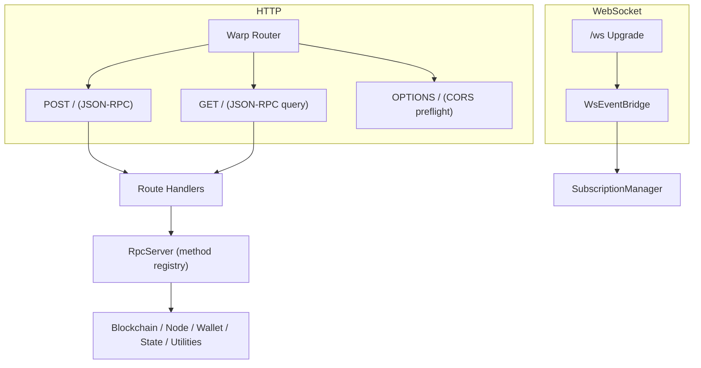
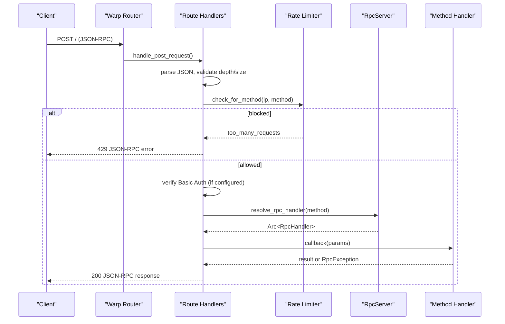
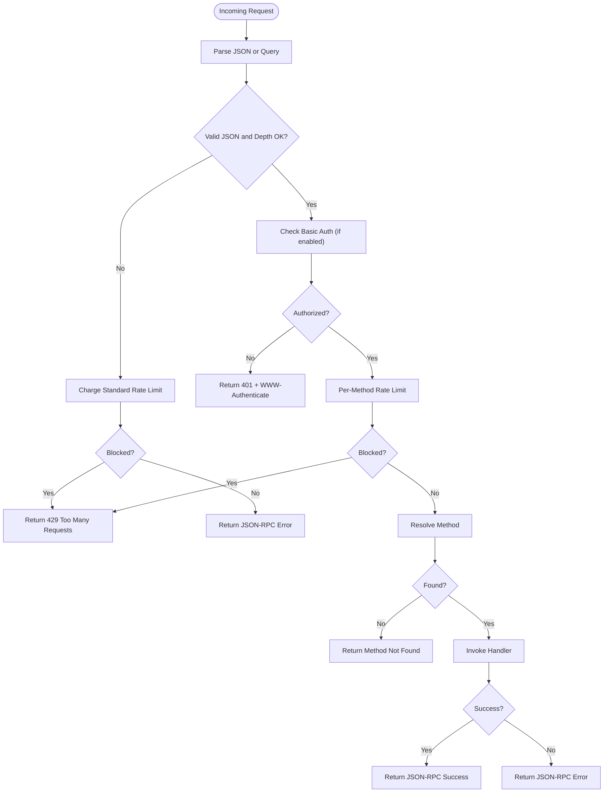
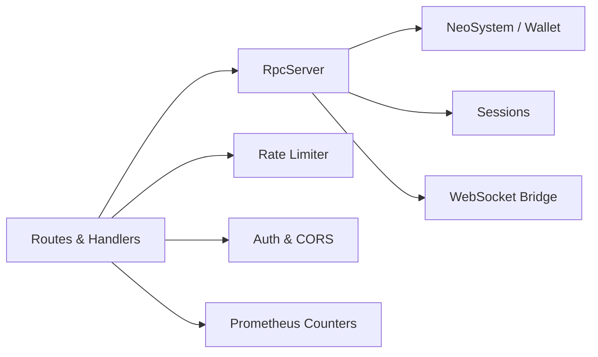

# RPC Server

<cite>
**Referenced Files in This Document**
- [lib.rs](file://neo-rpc/src/lib.rs)
- [Cargo.toml](file://neo-rpc/Cargo.toml)
- [server/mod.rs](file://neo-rpc/src/server/mod.rs)
- [rpc_server.rs](file://neo-rpc/src/server/rpc_server.rs)
- [rpc_registry.rs](file://neo-rpc/src/server/rpc_registry.rs)
- [routes/mod.rs](file://neo-rpc/src/server/routes/mod.rs)
- [routes/handlers.rs](file://neo-rpc/src/server/routes/handlers.rs)
- [middleware/mod.rs](file://neo-rpc/src/server/middleware/mod.rs)
- [middleware/rate_limiter.rs](file://neo-rpc/src/server/middleware/rate_limiter.rs)
- [ws/mod.rs](file://neo-rpc/src/server/ws/mod.rs)
</cite>

## Table of Contents
1. Introduction
2. Project Structure
3. Core Components
4. Architecture Overview
5. Detailed Component Analysis
6. Dependency Analysis
7. Performance Considerations
8. Troubleshooting Guide
9. Conclusion

## Introduction
This document explains the JSON-RPC server implementation for the Neo blockchain node. It covers the request/response pipeline, route registration, middleware and rate limiting, authentication and authorization, error handling and response formatting, WebSocket support for real-time events, and production considerations such as security, performance tuning, and scaling strategies.

The RPC layer exposes standard Neo JSON-RPC methods for blockchain queries, transaction submission, wallet operations (when unlocked), smart contract invocation, and utility functions. It supports both HTTP and WebSocket transports, with optional TLS termination and per-method rate limiting.

## Project Structure
The RPC crate provides a unified server and client implementation. The server is feature-gated and built on Warp/Hyper with optional jsonrpsee integration. Key modules:
- server: core server lifecycle, routing, handlers, middleware, TLS, sessions, and WebSocket bridge
- routes: HTTP entry points, CORS, Basic Auth, batch processing, and JSON-RPC dispatch
- middleware: rate limiting via a token-bucket governor
- ws: WebSocket upgrade, subscription management, and event broadcasting

**Diagram sources**
- [routes/mod.rs:54-118](file://neo-rpc/src/server/routes/mod.rs#L54-L118)
- [routes/mod.rs:120-153](file://neo-rpc/src/server/routes/mod.rs#L120-L153)
- [routes/handlers.rs:22-108](file://neo-rpc/src/server/routes/handlers.rs#L22-L108)
- [rpc_server.rs:194-516](file://neo-rpc/src/server/rpc_server.rs#L194-L516)

**Section sources**
- [lib.rs:6-54](file://neo-rpc/src/lib.rs#L6-L54)
- [Cargo.toml:87-139](file://neo-rpc/Cargo.toml#L87-L139)
- [server/mod.rs:1-66](file://neo-rpc/src/server/mod.rs#L1-L66)

## Core Components
- RpcServer: owns configuration, handler registry, wallet state, sessions, and WebSocket bridge; starts/stops HTTP/TLS servers and background session purging.
- Route handlers: parse JSON-RPC requests (single or batch), enforce depth limits, apply rate limits, authenticate, resolve methods, invoke handlers, and format responses.
- Middleware: per-IP and per-method rate limiting using a token-bucket algorithm.
- WebSocket bridge: enables real-time subscriptions to node events with an event bus and subscription manager.
- Registry: global map of running servers by network ID for lifecycle management.

Key responsibilities:
- Request parsing and validation (depth, size, structure)
- Authentication (Basic Auth) and authorization (disabled methods)
- Rate limiting (global and per-method)
- Method resolution and execution with panic safety
- Response formatting (success/error) and metrics
- Optional TLS and gzip compression
- Session storage and expiration

**Section sources**
- [rpc_server.rs:105-128](file://neo-rpc/src/server/rpc_server.rs#L105-L128)
- [routes/handlers.rs:22-108](file://neo-rpc/src/server/routes/handlers.rs#L22-L108)
- [routes/mod.rs:54-118](file://neo-rpc/src/server/routes/mod.rs#L54-L118)
- [middleware/rate_limiter.rs:1-200](file://neo-rpc/src/server/middleware/rate_limiter.rs#L1-L200)
- [rpc_registry.rs:1-40](file://neo-rpc/src/server/rpc_registry.rs#L1-L40)

## Architecture Overview
The server uses a layered approach:
- Transport layer: Warp router with Hyper backend; optional TLS via rustls; gzip compression enabled.
- Routing layer: POST and GET endpoints for JSON-RPC; OPTIONS for CORS; /ws for WebSocket upgrades.
- Processing layer: request validation, rate limiting, authentication, method resolution, handler invocation.
- Domain layer: Blockchain, Node, Wallet, State, Tokens Tracker, Oracle, Utilities, Smart Contract handlers.
- Infrastructure: Prometheus counters for requests/errors; session store with background purge; WebSocket event bridge.

**Diagram sources**
- [routes/handlers.rs:22-108](file://neo-rpc/src/server/routes/handlers.rs#L22-L108)
- [routes/handlers.rs:221-298](file://neo-rpc/src/server/routes/handlers.rs#L221-L298)
- [routes/handlers.rs:300-368](file://neo-rpc/src/server/routes/handlers.rs#L300-L368)
- [rpc_server.rs:194-516](file://neo-rpc/src/server/rpc_server.rs#L194-L516)

## Detailed Component Analysis

### HTTP Routing and Request Pipeline
- POST / accepts JSON-RPC payloads (single or batch). Supports content-length limits and gzip decoding.
- GET / accepts JSON-RPC via query string with base64-encoded params array.
- OPTIONS / returns CORS preflight responses.
- Batch arrays are validated for size and each object processed individually; notifications (no id) produce no response but still consume bandwidth and are rate-limited at the Standard tier.

Request flow highlights:
- Parse JSON or query parameters
- Enforce maximum parameter depth
- Apply Standard-tier rate limit for malformed/oversized inputs
- For valid requests, apply per-method rate limit
- Authenticate if credentials required
- Resolve method and invoke handler
- Format success or error response

**Diagram sources**
- [routes/handlers.rs:22-108](file://neo-rpc/src/server/routes/handlers.rs#L22-L108)
- [routes/handlers.rs:128-298](file://neo-rpc/src/server/routes/handlers.rs#L128-L298)
- [routes/mod.rs:161-215](file://neo-rpc/src/server/routes/mod.rs#L161-L215)

**Section sources**
- [routes/mod.rs:54-118](file://neo-rpc/src/server/routes/mod.rs#L54-L118)
- [routes/handlers.rs:22-108](file://neo-rpc/src/server/routes/handlers.rs#L22-L108)
- [routes/handlers.rs:128-298](file://neo-rpc/src/server/routes/handlers.rs#L128-L298)

### Authentication and Authorization
- Basic Auth: If configured, requests must include a valid Authorization header; otherwise, the server responds with 401 and a WWW-Authenticate challenge.
- Disabled methods: Methods listed in disabled_methods are rejected with access denied regardless of auth.
- WebSocket upgrades also enforce Basic Auth before upgrading.

Security notes:
- When binding to non-localhost with auth but without TLS, a warning is logged recommending TLS termination via reverse proxy or SSH tunneling.

**Section sources**
- [routes/handlers.rs:278-289](file://neo-rpc/src/server/routes/handlers.rs#L278-L289)
- [routes/mod.rs:120-153](file://neo-rpc/src/server/routes/mod.rs#L120-L153)
- [rpc_server.rs:207-220](file://neo-rpc/src/server/rpc_server.rs#L207-L220)

### Rate Limiting
- Global Standard tier: Applied to malformed, oversized, or notification requests to prevent bypasses.
- Per-method tier: Applied to valid requests after authentication; configurable burst and RPS.
- Implementation: Token-bucket limiter based on the governor crate; keyed by IP and method.

Configuration:
- max_requests_per_second: global RPS limit
- rate_limit_burst: burst allowance (defaults to RPS if zero)
- max_batch_size: limits batched requests

**Section sources**
- [routes/mod.rs:54-81](file://neo-rpc/src/server/routes/mod.rs#L54-L81)
- [routes/handlers.rs:110-126](file://neo-rpc/src/server/routes/handlers.rs#L110-L126)
- [routes/handlers.rs:253-259](file://neo-rpc/src/server/routes/handlers.rs#L253-L259)
- [middleware/rate_limiter.rs:1-200](file://neo-rpc/src/server/middleware/rate_limiter.rs#L1-L200)

### Method Resolution and Execution
- Methods are registered into RpcServer’s handler lookup table.
- Resolution checks disabled methods, then looks up the handler by lowercase name.
- Invocation wraps the callback in panic catch; exceptions are mapped to JSON-RPC errors.
- Unhandled exception policy determines whether to stop the server, node, terminate, log, or continue.

Metrics:
- Total requests counter incremented per object processed
- Total errors counter incremented on failures

**Section sources**
- [routes/handlers.rs:300-368](file://neo-rpc/src/server/routes/handlers.rs#L300-L368)
- [rpc_server.rs:83-103](file://neo-rpc/src/server/rpc_server.rs#L83-L103)
- [rpc_server.rs:552-560](file://neo-rpc/src/server/rpc_server.rs#L552-L560)

### WebSocket Support
- Enabled via enable_websocket(capacity); creates an event bridge and subscription manager.
- /ws endpoint upgrades connections after Basic Auth verification.
- Clients subscribe to events; the bridge broadcasts WsEvent messages to subscribers.

Use cases:
- Real-time block notifications
- Mempool updates
- Contract event streams

**Section sources**
- [rpc_server.rs:164-180](file://neo-rpc/src/server/rpc_server.rs#L164-L180)
- [routes/mod.rs:120-153](file://neo-rpc/src/server/routes/mod.rs#L120-L153)
- [ws/mod.rs:1-200](file://neo-rpc/src/server/ws/mod.rs#L1-L200)

### Sessions and Wallet Integration
- Sessions are stored in a Mutex-backed HashMap keyed by UUID; capacity enforced; background purging removes expired sessions.
- Wallet can be set on the server; changes trigger callbacks; wallet-dependent methods require an open wallet.

**Section sources**
- [rpc_server.rs:112-128](file://neo-rpc/src/server/rpc_server.rs#L112-L128)
- [rpc_server.rs:487-516](file://neo-rpc/src/server/rpc_server.rs#L487-L516)
- [rpc_server.rs:575-589](file://neo-rpc/src/server/rpc_server.rs#L575-L589)

### TLS and Transport
- Optional TLS via rustls; accept loop enforces handshake deadlines to avoid stalled clients.
- Non-blocking TCP listeners and keepalive settings applied.
- HTTP/1 header read timeout configurable.

**Section sources**
- [rpc_server.rs:255-389](file://neo-rpc/src/server/rpc_server.rs#L255-L389)
- [rpc_server.rs:391-479](file://neo-rpc/src/server/rpc_server.rs#L391-L479)

### Available Endpoints and Methods
The server implements standard Neo JSON-RPC methods across categories:
- Blockchain: getbestblockhash, getblock, getblockcount, getblockhash, getblockheader, getrawmempool, getrawtransaction, sendrawtransaction
- Node: getversion, getconnectioncount, getpeers
- Smart Contract: invokefunction, invokescript, getcontractstate, getnativecontracts
- Wallet (requires unlocked wallet): openwallet, closewallet, sendfrom, sendtoaddress, getbalance
- State, Tokens Tracker, Oracle, Utilities: additional domain-specific methods exposed through dedicated server modules

Note: Method availability depends on runtime configuration and disabled_methods list.

**Section sources**
- [lib.rs:56-99](file://neo-rpc/src/lib.rs#L56-L99)
- [server/mod.rs:23-35](file://neo-rpc/src/server/mod.rs#L23-L35)

### Error Handling and Response Formatting
- Success responses follow JSON-RPC 2.0 with jsonrpc, result, and id fields.
- Error responses include code, message, and optional data; standardized codes for common issues.
- Panic safety ensures unhandled panics do not crash the process unless configured; mapped to internal server error.

Common codes:
- -32700 Parse error
- -32600 Invalid request
- -32601 Method not found
- -32602 Invalid params
- -32603 Internal error
- -100 Block not found
- -101 Transaction not found
- -102 Contract not found
- -200 Invalid address
- -201 Invalid public key
- -300 Insufficient funds
- -400 Wallet not open

**Section sources**
- [lib.rs:136-154](file://neo-rpc/src/lib.rs#L136-L154)
- [routes/mod.rs:161-215](file://neo-rpc/src/server/routes/mod.rs#L161-L215)
- [routes/handlers.rs:331-368](file://neo-rpc/src/server/routes/handlers.rs#L331-L368)

### Configuration and Features
- Feature flags control inclusion of server, client, and jsonrpsee-server capabilities.
- Server features add warp, hyper, TLS, rate limiting, prometheus, and utilities.
- Client features provide typed APIs and builders.

**Section sources**
- [Cargo.toml:87-139](file://neo-rpc/Cargo.toml#L87-L139)

## Dependency Analysis
The RPC server depends on:
- warp and hyper for HTTP serving and routing
- tokio for async runtime and networking
- serde_json for JSON parsing/formatting
- governor and dashmap for rate limiting
- rustls/tokio-rustls for TLS
- prometheus for metrics
- neo-core for system integration and wallet interfaces

**Diagram sources**
- [routes/handlers.rs:22-108](file://neo-rpc/src/server/routes/handlers.rs#L22-L108)
- [rpc_server.rs:105-128](file://neo-rpc/src/server/rpc_server.rs#L105-L128)
- [middleware/rate_limiter.rs:1-200](file://neo-rpc/src/server/middleware/rate_limiter.rs#L1-L200)

**Section sources**
- [Cargo.toml:16-80](file://neo-rpc/Cargo.toml#L16-L80)
- [rpc_server.rs:105-128](file://neo-rpc/src/server/rpc_server.rs#L105-L128)

## Performance Considerations
- Connection limiting: Semaphore-based concurrent connection cap prevents overload.
- Request body size limits: Prevent large payload abuse.
- Parameter depth limit: Guard against deeply nested structures.
- Batch size limit: Controls throughput and memory usage.
- TLS handshake deadline: Avoids stalls from slow handshakes.
- Header read timeout: Mitigates slowloris-style attacks.
- Metrics: Track total requests and errors for observability.

Tuning recommendations:
- Set appropriate max_concurrent_connections based on CPU and memory.
- Configure rate limits per environment (dev/test vs production).
- Enable gzip compression for large responses.
- Use TLS termination at a reverse proxy if needed.
- Monitor Prometheus metrics and adjust limits accordingly.

[No sources needed since this section provides general guidance]

## Troubleshooting Guide
Common issues and resolutions:
- 401 Unauthorized: Ensure Authorization header matches configured credentials; verify realm and encoding.
- 429 Too Many Requests: Reduce request rate or increase rate_limit_burst and max_requests_per_second.
- Method not found: Confirm method name case-insensitivity and that it is not in disabled_methods.
- Invalid request: Validate JSON structure, ensure params is an array, and respect max parameter depth.
- Internal error: Check logs for panics; review UnhandledExceptionPolicy; consider increasing timeouts.
- WebSocket upgrade failed: Verify Basic Auth on /ws; ensure event bridge is enabled.

Operational tips:
- Use health checks and metrics endpoints to monitor server status.
- Regularly rotate credentials and restrict CORS origins.
- Keep TLS certificates updated and use strong cipher suites.
- Back up session-related configurations and review purge intervals.

**Section sources**
- [routes/handlers.rs:278-289](file://neo-rpc/src/server/routes/handlers.rs#L278-L289)
- [routes/handlers.rs:110-126](file://neo-rpc/src/server/routes/handlers.rs#L110-L126)
- [routes/handlers.rs:300-368](file://neo-rpc/src/server/routes/handlers.rs#L300-L368)
- [rpc_server.rs:207-220](file://neo-rpc/src/server/rpc_server.rs#L207-L220)

## Conclusion
The Neo JSON-RPC server provides a robust, secure, and extensible interface for interacting with the blockchain. Its layered architecture separates transport, routing, processing, and domain logic, enabling clear maintenance and evolution. With configurable authentication, rate limiting, TLS, and WebSocket support, it meets production requirements for reliability and scalability. Proper configuration and monitoring ensure optimal performance and resilience under load.

[No sources needed since this section summarizes without analyzing specific files]