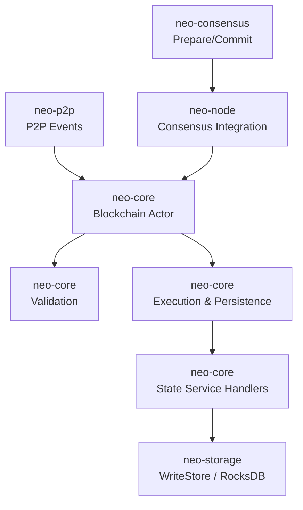
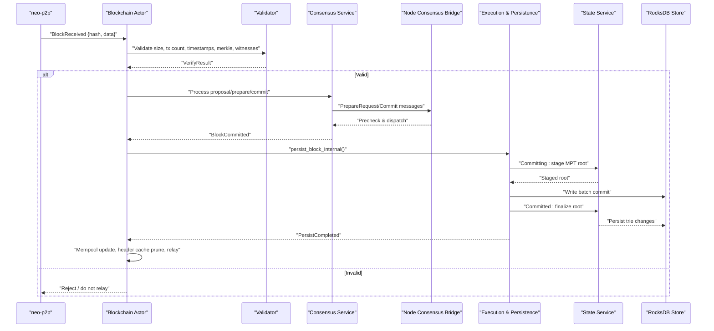
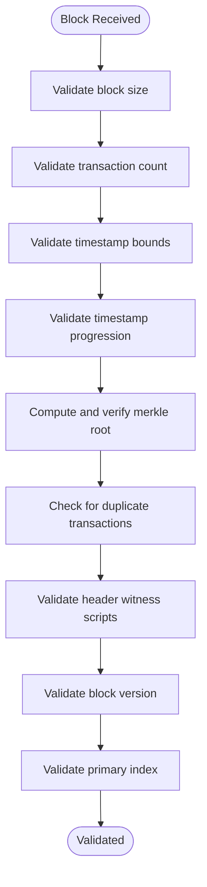
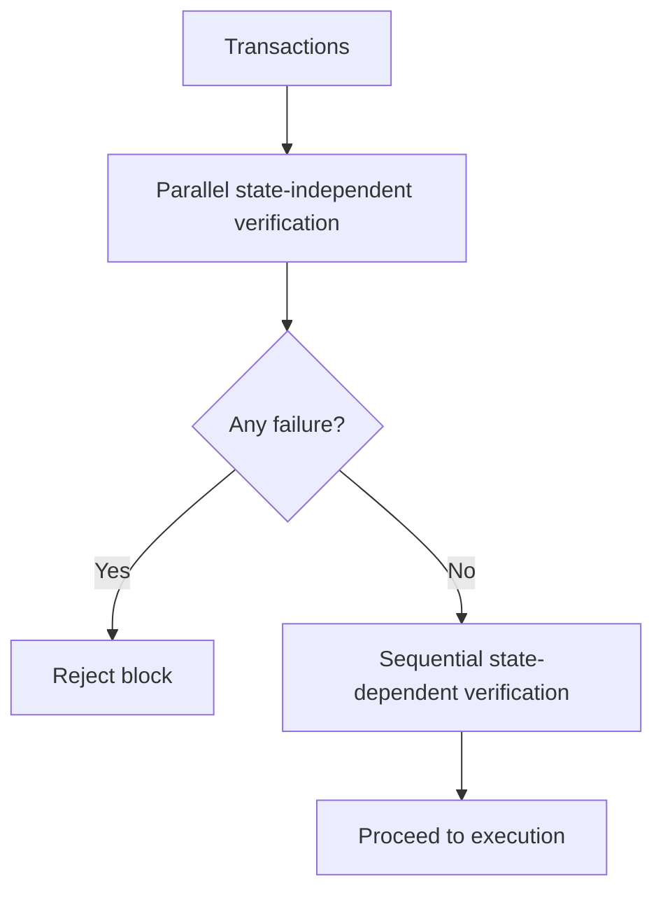
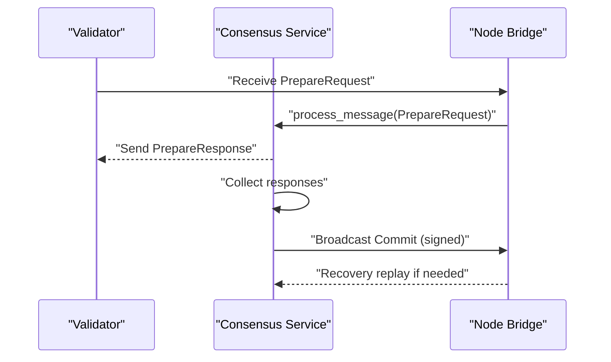
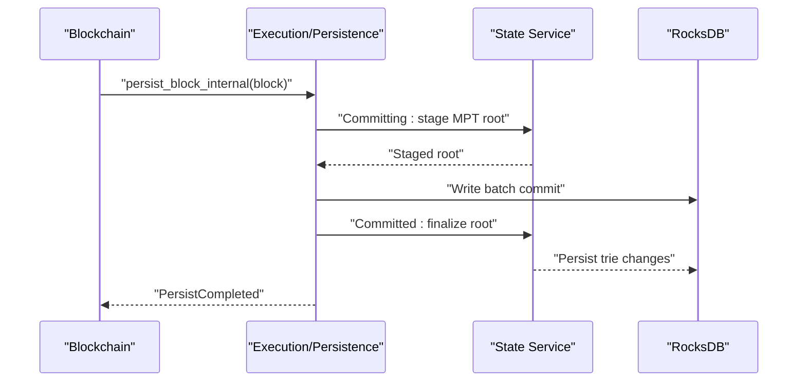
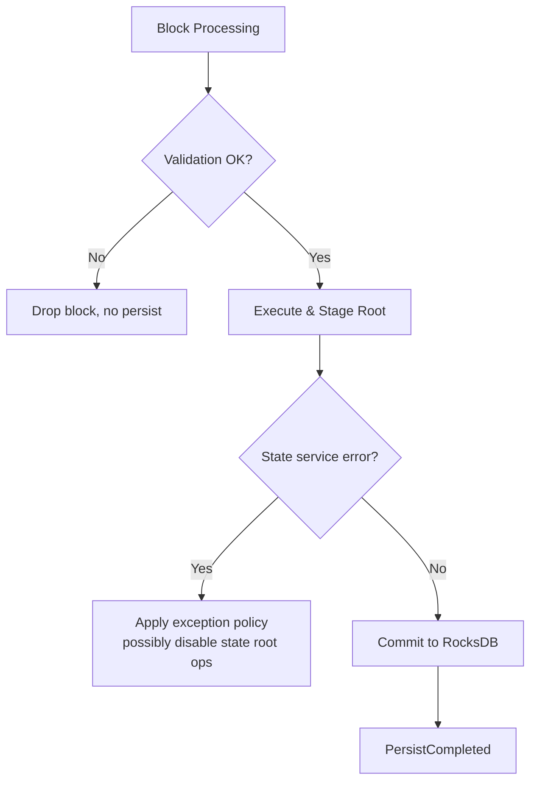
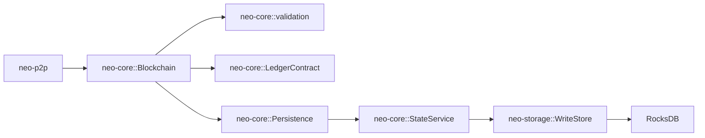

# Block Processing Flow

<cite>
**Referenced Files in This Document**
- [validation.rs](file://neo-core/src/validation.rs)
- [block_processing.rs](file://neo-core/src/ledger/blockchain/block_processing.rs)
- [handlers.rs](file://neo-core/src/ledger/blockchain/handlers.rs)
- [commit_handlers.rs](file://neo-core/src/state_service/commit_handlers.rs)
- [traits.rs](file://neo-p2p/src/traits.rs)
- [prepare.rs](file://neo-consensus/src/service/handlers/prepare.rs)
- [signatures.rs](file://neo-consensus/src/service/helpers/signatures.rs)
- [consensus.rs](file://neo-node/src/consensus.rs)
- [write_store.rs](file://neo-storage/src/persistence/write_store.rs)
- [store.rs](file://neo-core/src/persistence/providers/rocksdb/store.rs)
- [write_batch_buffer.rs](file://neo-core/src/persistence/write_batch_buffer.rs)
- [verification_ops.rs](file://neo-core/src/state_service/state_store/verification_ops.rs)
</cite>

## Table of Contents
1. [Introduction](#introduction)
2. [Project Structure](#project-structure)
3. [Core Components](#core-components)
4. [Architecture Overview](#architecture-overview)
5. [Detailed Component Analysis](#detailed-component-analysis)
6. [Dependency Analysis](#dependency-analysis)
7. [Performance Considerations](#performance-considerations)
8. [Troubleshooting Guide](#troubleshooting-guide)
9. [Conclusion](#conclusion)

## Introduction
This document explains the complete block processing flow in Neo-RS from P2P reception to final persistence, including validation, consensus participation, execution, state root computation, and storage. It details the validation pipeline (header checks, transaction verification, witness validation, merkle root), the interaction with the consensus layer (Prepare and Commit), error handling and rollback behavior, and performance strategies such as parallel transaction verification and caching.

## Project Structure
Neo-RS separates concerns across crates:
- P2P transport and events: neo-p2p
- Core blockchain logic, validation, ledger, persistence: neo-core
- Consensus service and message handlers: neo-consensus
- Node bootstrap and consensus integration: neo-node
- Storage abstractions and RocksDB backend: neo-storage

**Diagram sources**
- [traits.rs:110-144](file://neo-p2p/src/traits.rs#L110-L144)
- [block_processing.rs:14-41](file://neo-core/src/ledger/blockchain/block_processing.rs#L14-L41)
- [validation.rs:12-31](file://neo-core/src/validation.rs#L12-L31)
- [commit_handlers.rs:20-25](file://neo-core/src/state_service/commit_handlers.rs#L20-L25)
- [write_store.rs:3-15](file://neo-storage/src/persistence/write_store.rs#L3-L15)
- [consensus.rs:1034-1062](file://neo-node/src/consensus.rs#L1034-L1062)

**Section sources**
- [traits.rs:110-144](file://neo-p2p/src/traits.rs#L110-L144)
- [block_processing.rs:14-41](file://neo-core/src/ledger/blockchain/block_processing.rs#L14-L41)
- [validation.rs:12-31](file://neo-core/src/validation.rs#L12-L31)
- [commit_handlers.rs:20-25](file://neo-core/src/state_service/commit_handlers.rs#L20-L25)
- [write_store.rs:3-15](file://neo-storage/src/persistence/write_store.rs#L3-L15)
- [consensus.rs:1034-1062](file://neo-node/src/consensus.rs#L1034-L1062)

## Core Components
- P2P event ingestion: Blocks arrive via P2P events and are routed to the Blockchain actor.
- Validation pipeline: Size, transaction count, timestamp bounds and progression, merkle root, duplicate transactions, header/witness checks.
- Consensus participation: PrepareRequest and Commit messages coordinate block acceptance among validators.
- Execution and persistence: Transactions are executed, changes staged, state root computed and committed, then persisted to disk.
- Post-persist cleanup: Mempool updates, header cache pruning, relay notifications.

**Section sources**
- [traits.rs:110-144](file://neo-p2p/src/traits.rs#L110-L144)
- [validation.rs:128-387](file://neo-core/src/validation.rs#L128-L387)
- [prepare.rs:313-339](file://neo-consensus/src/service/handlers/prepare.rs#L313-L339)
- [signatures.rs:104-143](file://neo-consensus/src/service/helpers/signatures.rs#L104-L143)
- [commit_handlers.rs:64-149](file://neo-core/src/state_service/commit_handlers.rs#L64-L149)
- [handlers.rs:75-168](file://neo-core/src/ledger/blockchain/handlers.rs#L75-L168)

## Architecture Overview
The end-to-end flow from receipt to finalization:

**Diagram sources**
- [traits.rs:110-144](file://neo-p2p/src/traits.rs#L110-L144)
- [block_processing.rs:14-41](file://neo-core/src/ledger/blockchain/block_processing.rs#L14-L41)
- [validation.rs:128-387](file://neo-core/src/validation.rs#L128-L387)
- [prepare.rs:313-339](file://neo-consensus/src/service/handlers/prepare.rs#L313-L339)
- [signatures.rs:104-143](file://neo-consensus/src/service/helpers/signatures.rs#L104-L143)
- [consensus.rs:1034-1062](file://neo-node/src/consensus.rs#L1034-L1062)
- [commit_handlers.rs:64-149](file://neo-core/src/state_service/commit_handlers.rs#L64-L149)
- [store.rs:241-273](file://neo-core/src/persistence/providers/rocksdb/store.rs#L241-L273)
- [handlers.rs:75-168](file://neo-core/src/ledger/blockchain/handlers.rs#L75-L168)

## Detailed Component Analysis

### Block Receipt and Routing
- P2P emits a BlockReceived event containing the block hash and serialized data.
- The Blockchain actor receives inventory or direct block payloads and routes them for verification and potential persistence.

Key behaviors:
- Compute block hash early to identify duplicates and cache keys.
- Enqueue unverified blocks and drain them in batches to avoid blocking.

**Section sources**
- [traits.rs:110-144](file://neo-p2p/src/traits.rs#L110-L144)
- [block_processing.rs:14-41](file://neo-core/src/ledger/blockchain/block_processing.rs#L14-L41)
- [handlers.rs:397-452](file://neo-core/src/ledger/blockchain/handlers.rs#L397-L452)

### Validation Pipeline
The validator enforces protocol rules before execution:
- Size limits and transaction count caps
- Timestamp bounds and strict progression
- Merkle root integrity over transaction hashes
- Duplicate transaction detection
- Header and witness script constraints

**Diagram sources**
- [validation.rs:128-387](file://neo-core/src/validation.rs#L128-L387)

**Section sources**
- [validation.rs:128-387](file://neo-core/src/validation.rs#L128-L387)

### Transaction Verification Strategy
Transaction verification is split into two phases to maximize parallelism:
- Phase 1: State-independent checks (e.g., signatures) run in parallel using rayon.
- Phase 2: State-dependent checks run sequentially with a shared context to maintain correctness.

**Diagram sources**
- [plans/fast-sync plan references:124-193](file://docs/superpowers/plans/2026-04-08-phase1-fast-sync.md#L124-L193)

**Section sources**
- [plans/fast-sync plan references:124-193](file://docs/superpowers/plans/2026-04-08-phase1-fast-sync.md#L124-L193)

### Consensus Participation (Prepare and Commit)
Validators exchange PrepareRequest and Commit messages to agree on the proposed block:
- PrepareRequest prechecks include block index, previous hash, timestamp ordering, and transaction count limits.
- When enough PrepareResponses are collected and the proposal is verified, a Commit is signed and broadcast.
- Recovery mechanisms reprocess stored commits when needed.

**Diagram sources**
- [prepare.rs:313-339](file://neo-consensus/src/service/handlers/prepare.rs#L313-L339)
- [signatures.rs:104-143](file://neo-consensus/src/service/helpers/signatures.rs#L104-L143)
- [consensus.rs:1034-1062](file://neo-node/src/consensus.rs#L1034-L1062)
- [recovery handler references:251-284](file://neo-consensus/src/service/handlers/recovery.rs#L251-L284)

**Section sources**
- [prepare.rs:313-339](file://neo-consensus/src/service/handlers/prepare.rs#L313-L339)
- [signatures.rs:104-143](file://neo-consensus/src/service/helpers/signatures.rs#L104-L143)
- [consensus.rs:1034-1062](file://neo-node/src/consensus.rs#L1034-L1062)
- [recovery handler references:251-284](file://neo-consensus/src/service/handlers/recovery.rs#L251-L284)

### Execution and Persistence
After consensus, the block is executed and persisted:
- Staging phase: Collect tracked storage changes and compute/stage the new state root.
- Commit phase: Persist changes to RocksDB via WriteStore and finalize the state root.
- Post-persist: Update mempool, prune headers, clear caches, and publish completion events.

**Diagram sources**
- [commit_handlers.rs:64-149](file://neo-core/src/state_service/commit_handlers.rs#L64-L149)
- [store.rs:241-273](file://neo-core/src/persistence/providers/rocksdb/store.rs#L241-L273)
- [write_store.rs:3-15](file://neo-storage/src/persistence/write_store.rs#L3-L15)
- [handlers.rs:75-168](file://neo-core/src/ledger/blockchain/handlers.rs#L75-L168)

**Section sources**
- [commit_handlers.rs:64-149](file://neo-core/src/state_service/commit_handlers.rs#L64-L149)
- [store.rs:241-273](file://neo-core/src/persistence/providers/rocksdb/store.rs#L241-L273)
- [write_store.rs:3-15](file://neo-storage/src/persistence/write_store.rs#L3-L15)
- [handlers.rs:75-168](file://neo-core/src/ledger/blockchain/handlers.rs#L75-L168)

### Error Handling and Rollback Behavior
- Validation failures short-circuit block processing; invalid blocks are not persisted or relayed.
- State service errors are handled by an exception policy that can disable further state root operations to protect consistency.
- Recovery logs ensure safe Commit broadcasting only after durable persistence of recovery state.

**Diagram sources**
- [validation.rs:128-387](file://neo-core/src/validation.rs#L128-L387)
- [commit_handlers.rs:38-61](file://neo-core/src/state_service/commit_handlers.rs#L38-L61)
- [consensus.rs:562-593](file://neo-node/src/consensus.rs#L562-L593)

**Section sources**
- [validation.rs:128-387](file://neo-core/src/validation.rs#L128-L387)
- [commit_handlers.rs:38-61](file://neo-core/src/state_service/commit_handlers.rs#L38-L61)
- [consensus.rs:562-593](file://neo-node/src/consensus.rs#L562-L593)

## Dependency Analysis
- P2P depends on payload types and message routing to deliver blocks to the Blockchain actor.
- Blockchain depends on validation utilities and the ledger contract for chain state queries.
- Persistence depends on WriteStore abstraction implemented by RocksDB, with batching and sync options.
- State service depends on DataCache snapshots to stage and finalize state roots.

**Diagram sources**
- [traits.rs:110-144](file://neo-p2p/src/traits.rs#L110-L144)
- [validation.rs:128-387](file://neo-core/src/validation.rs#L128-L387)
- [commit_handlers.rs:64-149](file://neo-core/src/state_service/commit_handlers.rs#L64-L149)
- [write_store.rs:3-15](file://neo-storage/src/persistence/write_store.rs#L3-L15)
- [store.rs:241-273](file://neo-core/src/persistence/providers/rocksdb/store.rs#L241-L273)

**Section sources**
- [traits.rs:110-144](file://neo-p2p/src/traits.rs#L110-L144)
- [validation.rs:128-387](file://neo-core/src/validation.rs#L128-L387)
- [commit_handlers.rs:64-149](file://neo-core/src/state_service/commit_handlers.rs#L64-L149)
- [write_store.rs:3-15](file://neo-storage/src/persistence/write_store.rs#L3-L15)
- [store.rs:241-273](file://neo-core/src/persistence/providers/rocksdb/store.rs#L241-L273)

## Performance Considerations
- Parallel transaction verification: Split verification into state-independent (parallel) and state-dependent (sequential) phases to leverage multi-core CPUs during block validation.
- Batched writes and auto-flush: Use write batch buffers with configurable thresholds and background flush loops to reduce RocksDB write overhead.
- DataCache reuse: Reuse DataCache allocations across transactions to reduce memory churn during execution.
- Deferred MPT computation: Defer heavy Merkle Patricia Trie updates to minimize blocking time in the critical persistence path.

Practical tips:
- Tune batch sizes and flush intervals based on workload characteristics.
- Monitor CPU utilization during parallel verification to balance throughput and latency.
- Ensure DataCache reset points align with engine lifetimes to avoid contention.

**Section sources**
- [plans/fast-sync plan references:124-193](file://docs/superpowers/plans/2026-04-08-phase1-fast-sync.md#L124-L193)
- [write_batch_buffer.rs:241-289](file://neo-core/src/persistence/write_batch_buffer.rs#L241-L289)
- [write_batch_buffer.rs:444-489](file://neo-core/src/persistence/write_batch_buffer.rs#L444-L489)
- [specs/phase2a2b design references:1-68](file://docs/superpowers/specs/2026-04-08-phase2a2b-async-mpt-datacache-pool-design.md#L1-L68)

## Troubleshooting Guide
Common issues and where to look:
- Block rejected due to validation failure: Check size, transaction count, timestamps, merkle root, and witness scripts.
- Consensus stalls: Verify PrepareRequest prechecks (index, prev hash, timestamp) and ensure enough PrepareResponses are collected before sending Commit.
- State root mismatch: Confirm local state root availability and expected root matching during persistence.
- Persistence delays: Inspect RocksDB write paths and batch buffer flushing behavior.

Diagnostic entry points:
- Validation errors: [validation.rs:128-387](file://neo-core/src/validation.rs#L128-L387)
- Consensus message handling: [consensus.rs:1034-1062](file://neo-node/src/consensus.rs#L1034-L1062), [prepare.rs:313-339](file://neo-consensus/src/service/handlers/prepare.rs#L313-L339)
- State root verification: [verification_ops.rs:73-110](file://neo-core/src/state_service/state_store/verification_ops.rs#L73-L110)
- RocksDB write errors: [store.rs:241-273](file://neo-core/src/persistence/providers/rocksdb/store.rs#L241-L273)

**Section sources**
- [validation.rs:128-387](file://neo-core/src/validation.rs#L128-L387)
- [consensus.rs:1034-1062](file://neo-node/src/consensus.rs#L1034-L1062)
- [prepare.rs:313-339](file://neo-consensus/src/service/handlers/prepare.rs#L313-L339)
- [verification_ops.rs:73-110](file://neo-core/src/state_service/state_store/verification_ops.rs#L73-L110)
- [store.rs:241-273](file://neo-core/src/persistence/providers/rocksdb/store.rs#L241-L273)

## Conclusion
Neo-RS implements a robust, layered block processing pipeline that validates blocks thoroughly, participates in consensus to achieve agreement, executes transactions deterministically, and persists state changes efficiently. The design emphasizes safety through strict validation and consensus safeguards, while optimizing performance via parallel verification, batched writes, and deferred state root computation. Proper monitoring and tuning of these components ensure reliable operation under production workloads.