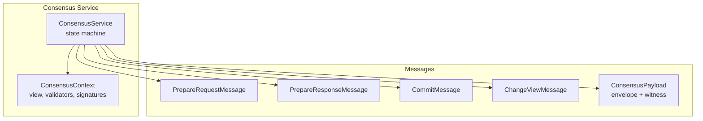
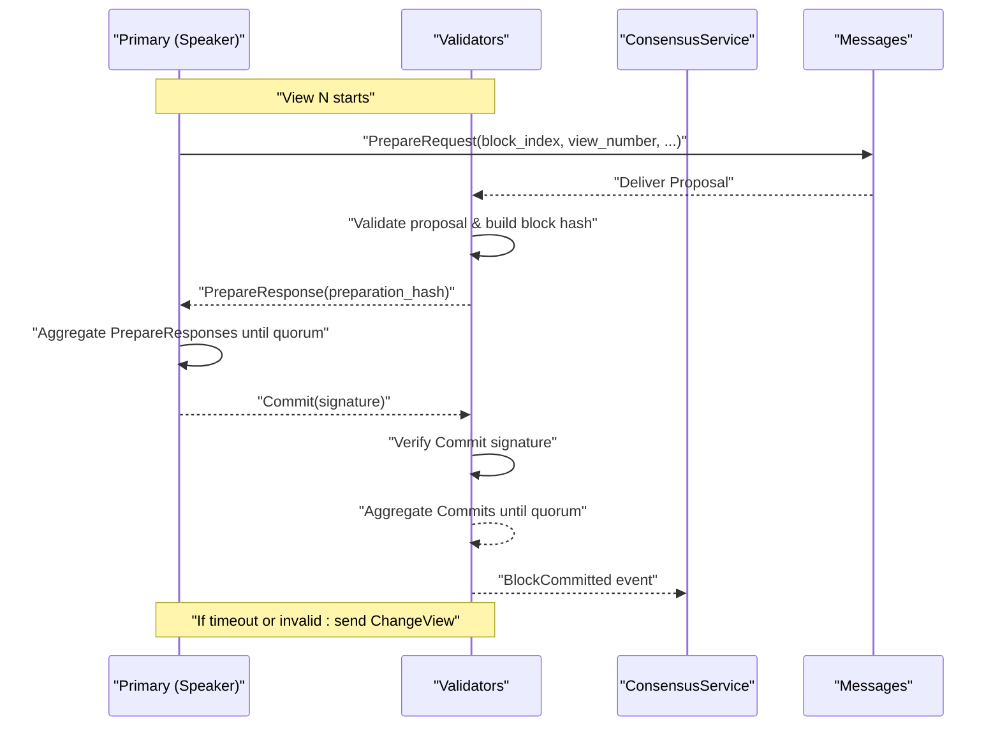
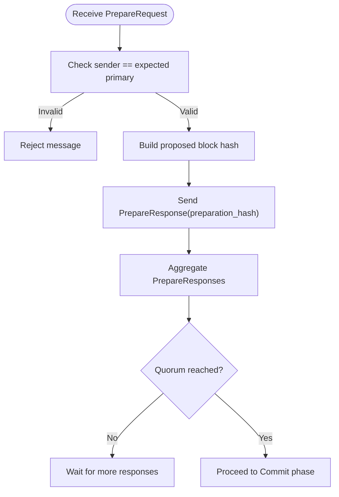
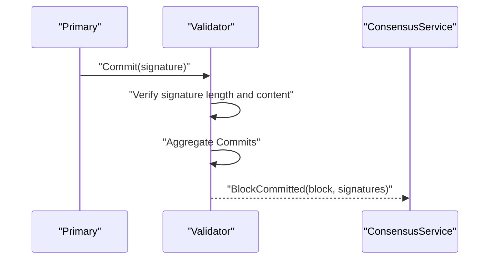
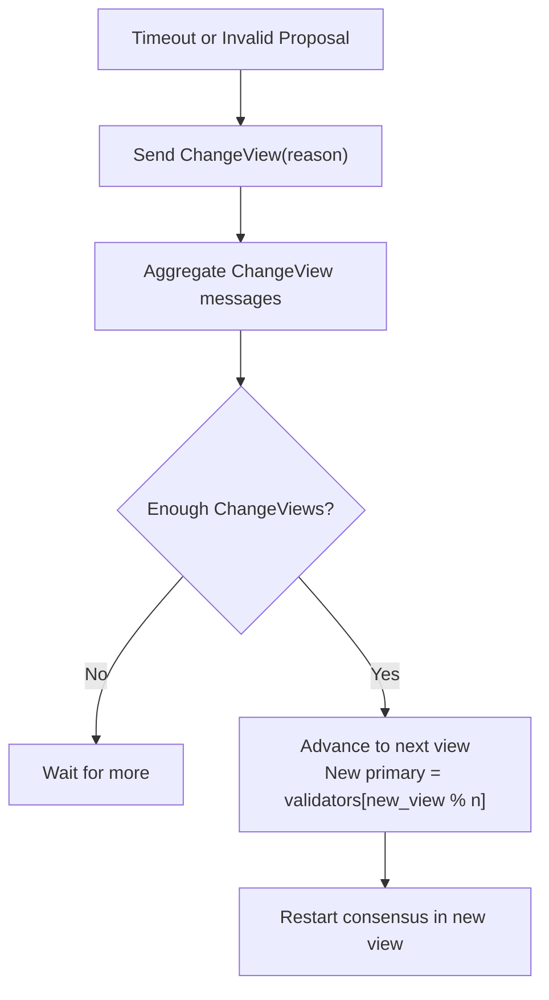
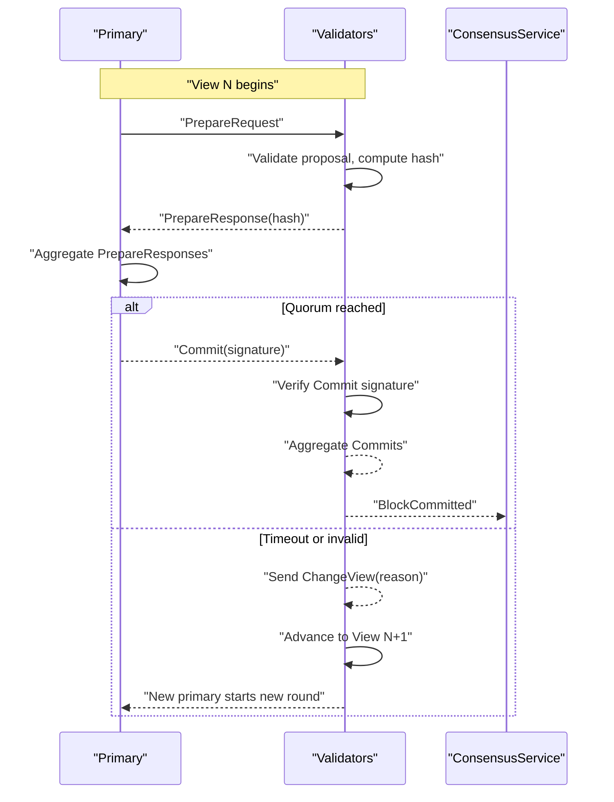
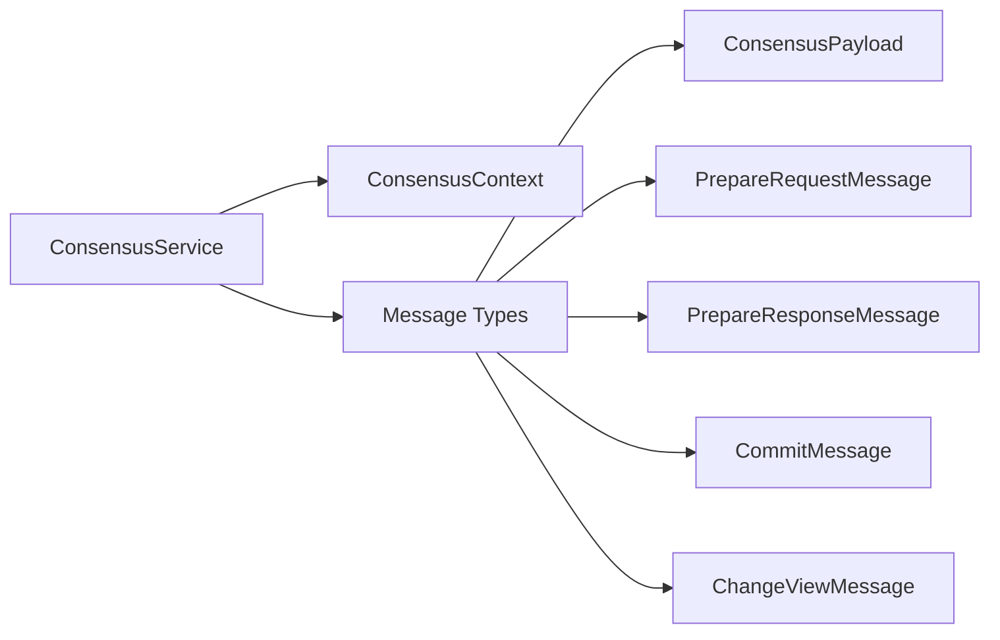

# Consensus Message Flow

<cite>
**Referenced Files in This Document**
- [lib.rs](file://neo-consensus/src/lib.rs)
- [core.rs](file://neo-consensus/src/service/core.rs)
- [mod.rs (service)](file://neo-consensus/src/service/mod.rs)
- [prepare_request.rs](file://neo-consensus/src/messages/prepare_request.rs)
- [prepare_response.rs](file://neo-consensus/src/messages/prepare_response.rs)
- [commit.rs](file://neo-consensus/src/messages/commit.rs)
- [change_view.rs](file://neo-consensus/src/messages/change_view.rs)
- [mod.rs (messages)](file://neo-consensus/src/messages/mod.rs)
</cite>

## Table of Contents
1. [Introduction](#introduction)
2. [Project Structure](#project-structure)
3. [Core Components](#core-components)
4. [Architecture Overview](#architecture-overview)
5. [Detailed Component Analysis](#detailed-component-analysis)
6. [Dependency Analysis](#dependency-analysis)
7. [Performance Considerations](#performance-considerations)
8. [Troubleshooting Guide](#troubleshooting-guide)
9. [Conclusion](#conclusion)

## Introduction
This document explains the consensus message flow in the dBFT 2.0 implementation used by Neo N3. It details how validators exchange PrepareRequest, PrepareResponse, Commit, and ChangeView messages to propose and finalize blocks, including validation, signature verification, aggregation, timeouts, view changes, and recovery. The goal is to make the protocol understandable for both technical and non-technical readers while remaining grounded in the repository’s code.

## Project Structure
The consensus logic lives under neo-consensus with a clear separation between:
- Service layer: main state machine and lifecycle management
- Messages: typed payloads for each phase of dBFT
- Context and utilities: validator set, signing, error types, and message envelopes

**Diagram sources**
- [core.rs:8-25](file://neo-consensus/src/service/core.rs#L8-L25)
- [mod.rs (messages):20-58](file://neo-consensus/src/messages/mod.rs#L20-L58)
- [prepare_request.rs:8-27](file://neo-consensus/src/messages/prepare_request.rs#L8-L27)
- [prepare_response.rs:7-18](file://neo-consensus/src/messages/prepare_response.rs#L7-L18)
- [commit.rs:6-18](file://neo-consensus/src/messages/commit.rs#L6-L18)
- [change_view.rs:6-19](file://neo-consensus/src/messages/change_view.rs#L6-L19)

**Section sources**
- [lib.rs:6-110](file://neo-consensus/src/lib.rs#L6-L110)
- [mod.rs (service):1-16](file://neo-consensus/src/service/mod.rs#L1-L16)

## Core Components
- ConsensusService: Main dBFT 2.0 state machine that orchestrates views, proposals, and finalization. It holds the context, network magic, private key or external signer, and an event channel for broadcasting and notifications.
- ConsensusPayload: Network envelope carrying type, block index, validator index, view number, serialized body, and witness (signature). Provides serialization and parsing helpers for on-wire format.
- Message Types:
  - PrepareRequestMessage: Block proposal from the primary (speaker), including version, previous hash, timestamp, nonce, and transaction hashes.
  - PrepareResponseMessage: Validator acknowledgment of the proposal via the proposed block hash.
  - CommitMessage: Validator commitment to the block, carrying a signature over the block hash.
  - ChangeViewMessage: Request to advance the view when progress stalls or invalid behavior is detected.

Key responsibilities:
- Validation: Each message validates its own fields (e.g., primary identity, hash match, signature length).
- Signing and Verification: The service signs outgoing messages and verifies incoming witnesses using the validator set and cryptographic primitives.
- Aggregation: Collects sufficient PrepareResponses and Commits to reach quorum and finalize a block.
- View Management: Triggers view changes on timeouts or invalid proposals and advances to a new primary deterministically.

**Section sources**
- [core.rs:8-66](file://neo-consensus/src/service/core.rs#L8-L66)
- [mod.rs (messages):20-150](file://neo-consensus/src/messages/mod.rs#L20-L150)
- [prepare_request.rs:8-229](file://neo-consensus/src/messages/prepare_request.rs#L8-L229)
- [prepare_response.rs:7-82](file://neo-consensus/src/messages/prepare_response.rs#L7-L82)
- [commit.rs:6-60](file://neo-consensus/src/messages/commit.rs#L6-L60)
- [change_view.rs:6-100](file://neo-consensus/src/messages/change_view.rs#L6-L100)

## Architecture Overview
The dBFT round proceeds in views. A designated speaker proposes a block; validators validate and acknowledge; upon reaching quorum, the speaker commits; validators commit once they see enough commitments. If progress stalls, validators trigger a view change to rotate the speaker.

**Diagram sources**
- [lib.rs:63-125](file://neo-consensus/src/lib.rs#L63-L125)
- [prepare_request.rs:8-27](file://neo-consensus/src/messages/prepare_request.rs#L8-L27)
- [prepare_response.rs:7-18](file://neo-consensus/src/messages/prepare_response.rs#L7-L18)
- [commit.rs:6-18](file://neo-consensus/src/messages/commit.rs#L6-L18)
- [change_view.rs:6-19](file://neo-consensus/src/messages/change_view.rs#L6-L19)

## Detailed Component Analysis

### Prepare Phase
- Primary constructs a PrepareRequest containing block metadata and transaction hashes.
- Validators validate the proposal:
  - Ensure sender is the expected primary for this view.
  - Validate version and ensure no duplicate transaction hashes.
  - Build the proposed block hash to use in PrepareResponse.
- Validators respond with PrepareResponse containing the preparation hash.
- Primary aggregates PrepareResponses until quorum is reached.

Validation and security:
- Primary identity check prevents spoofed proposals.
- Duplicate transaction hash detection ensures canonical proposals.
- Hash binding in PrepareResponse ties acknowledgments to the exact proposal.

**Diagram sources**
- [prepare_request.rs:205-229](file://neo-consensus/src/messages/prepare_request.rs#L205-L229)
- [prepare_response.rs:72-82](file://neo-consensus/src/messages/prepare_response.rs#L72-L82)

**Section sources**
- [prepare_request.rs:8-229](file://neo-consensus/src/messages/prepare_request.rs#L8-L229)
- [prepare_response.rs:7-82](file://neo-consensus/src/messages/prepare_response.rs#L7-L82)

### Commit Phase
- Once quorum of PrepareResponses is collected, the primary sends a Commit message with a signature over the block hash.
- Validators verify the Commit signature and aggregate Commits until quorum is reached.
- Upon quorum, the block is considered committed and finalized.

Validation and security:
- Commit signature length enforced to prevent malformed messages.
- Signature verification binds commitment to the specific block hash.
- Quorum threshold ensures Byzantine fault tolerance.

**Diagram sources**
- [commit.rs:6-60](file://neo-consensus/src/messages/commit.rs#L6-L60)
- [lib.rs:63-125](file://neo-consensus/src/lib.rs#L63-L125)

**Section sources**
- [commit.rs:6-60](file://neo-consensus/src/messages/commit.rs#L6-L60)

### View Change and Recovery
- If the primary fails to propose or validators detect invalid behavior, they send ChangeView messages with a reason (e.g., Timeout, TxNotFound, BlockInvalid).
- When enough ChangeView messages are aggregated, the view advances deterministically to the next primary.
- Recovery mechanisms allow nodes to synchronize state during or after view changes.

Validation and safety:
- New view number must be strictly greater than current view.
- Reasons encode why the view changed, aiding diagnostics and policy enforcement.

**Diagram sources**
- [change_view.rs:6-100](file://neo-consensus/src/messages/change_view.rs#L6-L100)
- [lib.rs:111-138](file://neo-consensus/src/lib.rs#L111-L138)

**Section sources**
- [change_view.rs:6-100](file://neo-consensus/src/messages/change_view.rs#L6-L100)
- [lib.rs:111-138](file://neo-consensus/src/lib.rs#L111-L138)

### End-to-End Consensus Round
This sequence shows the full round from proposal to finalization, including failure handling and view changes.

**Diagram sources**
- [lib.rs:63-138](file://neo-consensus/src/lib.rs#L63-L138)
- [prepare_request.rs:205-229](file://neo-consensus/src/messages/prepare_request.rs#L205-L229)
- [prepare_response.rs:72-82](file://neo-consensus/src/messages/prepare_response.rs#L72-L82)
- [commit.rs:43-60](file://neo-consensus/src/messages/commit.rs#L43-L60)
- [change_view.rs:40-100](file://neo-consensus/src/messages/change_view.rs#L40-L100)

## Dependency Analysis
- ConsensusService depends on:
  - ConsensusContext for view, validator set, and signature tracking
  - Message types for constructing and validating payloads
  - ConsensusPayload for wire serialization and witness handling
- Message types depend on:
  - ConsensusMessageType enumeration for dispatch
  - Cryptographic primitives for signature verification (via service/signer integration)
- Envelope ConsensusPayload provides consistent header fields across all messages and supports on-wire parsing.

**Diagram sources**
- [core.rs:8-25](file://neo-consensus/src/service/core.rs#L8-L25)
- [mod.rs (messages):20-58](file://neo-consensus/src/messages/mod.rs#L20-L58)
- [prepare_request.rs:8-27](file://neo-consensus/src/messages/prepare_request.rs#L8-L27)
- [prepare_response.rs:7-18](file://neo-consensus/src/messages/prepare_response.rs#L7-L18)
- [commit.rs:6-18](file://neo-consensus/src/messages/commit.rs#L6-L18)
- [change_view.rs:6-19](file://neo-consensus/src/messages/change_view.rs#L6-L19)

**Section sources**
- [core.rs:8-66](file://neo-consensus/src/service/core.rs#L8-L66)
- [mod.rs (messages):20-150](file://neo-consensus/src/messages/mod.rs#L20-L150)

## Performance Considerations
- Quorum thresholds minimize message overhead while ensuring safety and liveness.
- Efficient serialization and deserialization reduce CPU usage during high-throughput consensus rounds.
- Deterministic view rotation avoids contention and centralization risks.
- Timeouts should be tuned to network conditions to balance latency and robustness.

[No sources needed since this section provides general guidance]

## Troubleshooting Guide
Common issues and their indicators:
- Invalid primary: Occurs when a PrepareRequest is not from the expected speaker for the current view.
- Hash mismatch: Indicates a PrepareResponse does not correspond to the proposed block hash.
- Invalid signature length: Commit messages must carry correctly sized signatures.
- View overflow: ChangeView must produce a strictly increasing view number without overflow.

Recovery steps:
- On proposal failures or timeouts, validators should send ChangeView with appropriate reasons.
- Use recovery mechanisms to re-sync state if necessary before restarting consensus.

**Section sources**
- [prepare_request.rs:205-229](file://neo-consensus/src/messages/prepare_request.rs#L205-L229)
- [prepare_response.rs:72-82](file://neo-consensus/src/messages/prepare_response.rs#L72-L82)
- [commit.rs:43-60](file://neo-consensus/src/messages/commit.rs#L43-L60)
- [change_view.rs:40-100](file://neo-consensus/src/messages/change_view.rs#L40-L100)

## Conclusion
The dBFT 2.0 implementation in neo-consensus provides a robust, secure, and efficient consensus mechanism for Neo N3. Through well-defined message types, strict validation, cryptographic signing, and deterministic view changes, it achieves single-block finality with Byzantine fault tolerance. Proper timeout handling and recovery procedures ensure liveness even under adversarial conditions.

[No sources needed since this section summarizes without analyzing specific files]