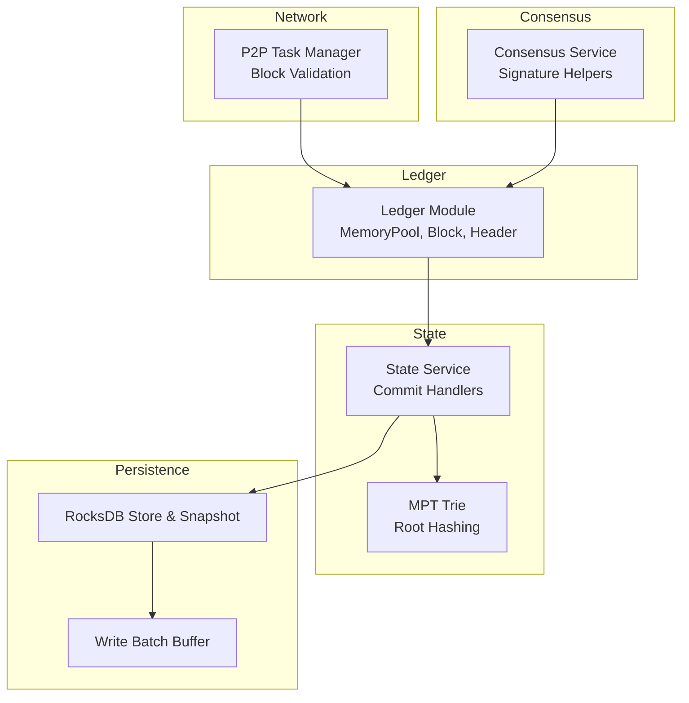
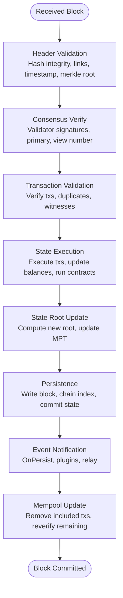
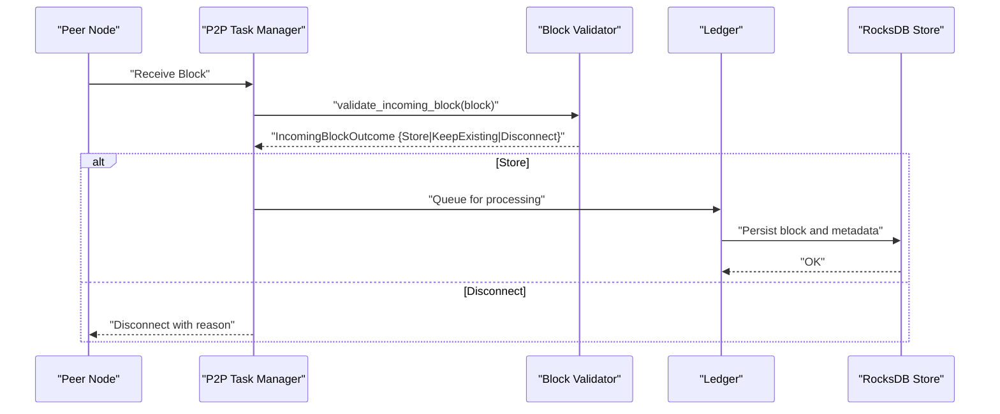
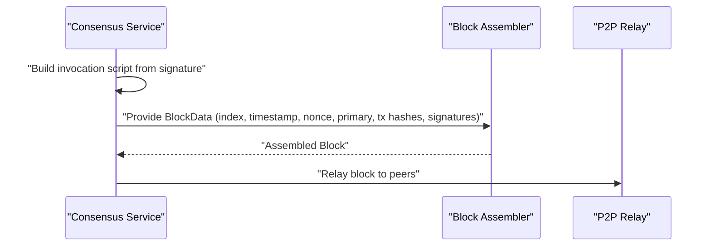
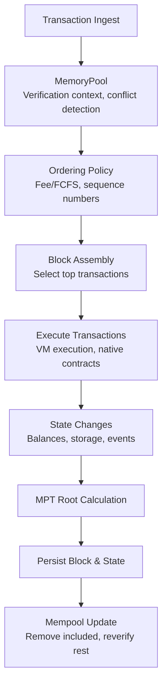
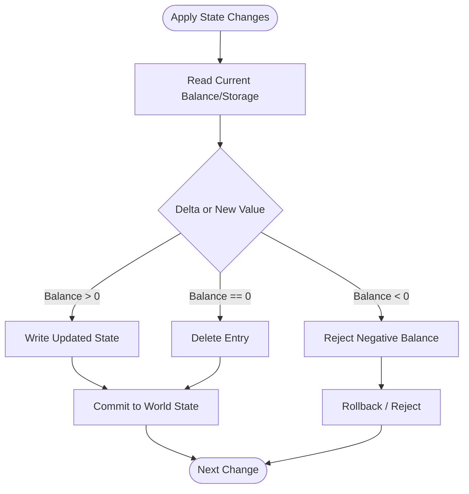
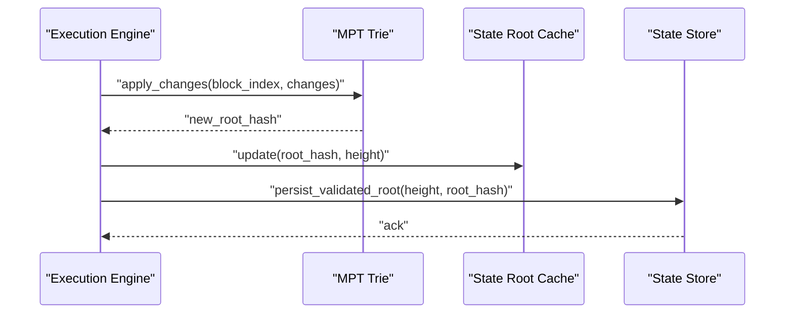
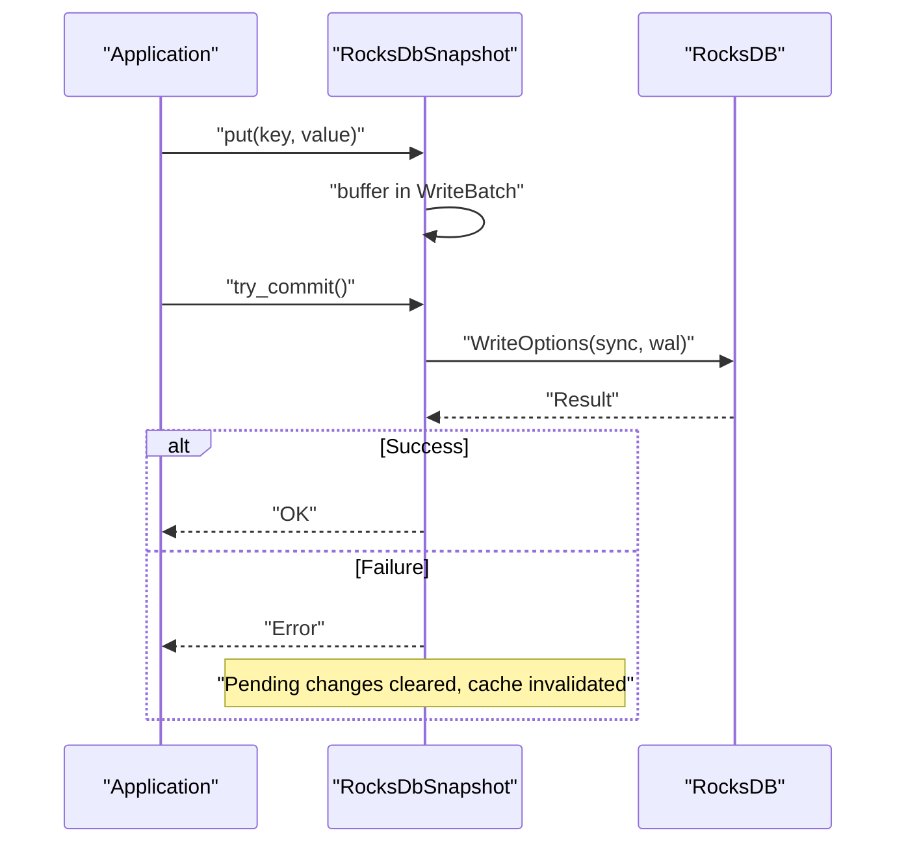
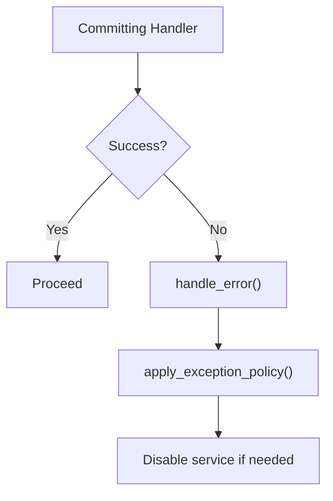
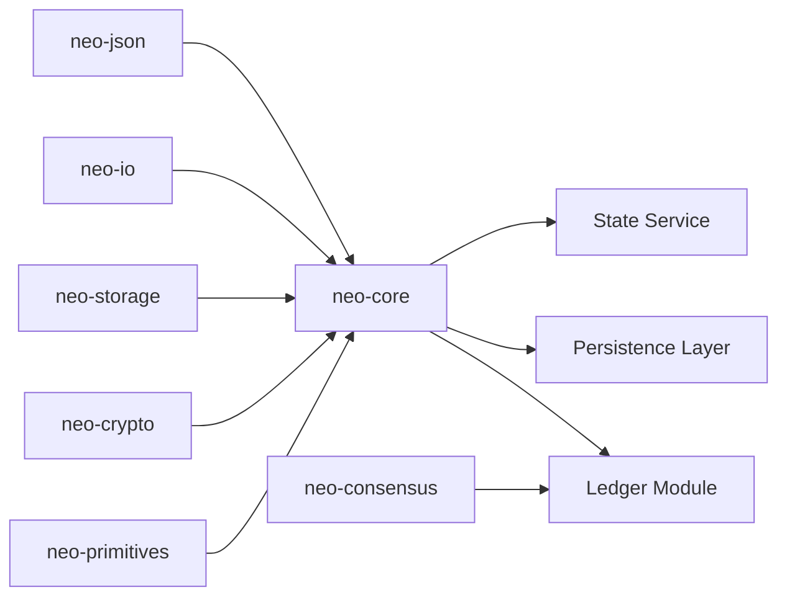

# Data Flows

<cite>
**Referenced Files in This Document**
- [neo-core/src/lib.rs](file://neo-core/src/lib.rs)
- [neo-core/src/ledger/mod.rs](file://neo-core/src/ledger/mod.rs)
- [neo-core/src/network/p2p/task_manager/block_validation.rs](file://neo-core/src/network/p2p/task_manager/block_validation.rs)
- [neo-core/src/state_service/mod.rs](file://neo-core/src/state_service/mod.rs)
- [neo-core/src/state_service/commit_handlers.rs](file://neo-core/src/state_service/commit_handlers.rs)
- [neo-core/src/persistence/write_batch_buffer.rs](file://neo-core/src/persistence/write_batch_buffer.rs)
- [neo-core/src/persistence/providers/rocksdb/store.rs](file://neo-core/src/persistence/providers/rocksdb/store.rs)
- [neo-crypto/src/mpt_trie/trie.rs](file://neo-crypto/src/mpt_trie/trie.rs)
- [neo-consensus/src/service/helpers/signatures.rs](file://neo-consensus/src/service/helpers/signatures.rs)
- [neo-node/tests/block_assembly_test.rs](file://neo-node/tests/block_assembly_test.rs)
- [tests/tests/state_integration_tests.rs](file://tests/tests/state_integration_tests.rs)
- [docs/ARCHITECTURE.md](file://docs/ARCHITECTURE.md)
</cite>

## Table of Contents
1. [Introduction](#introduction)
2. [Project Structure](#project-structure)
3. [Core Components](#core-components)
4. [Architecture Overview](#architecture-overview)
5. [Detailed Component Analysis](#detailed-component-analysis)
6. [Dependency Analysis](#dependency-analysis)
7. [Performance Considerations](#performance-considerations)
8. [Troubleshooting Guide](#troubleshooting-guide)
9. [Conclusion](#conclusion)

## Introduction
This document explains the end-to-end data flows in Neo-RS, covering:
- Block lifecycle from P2P reception to validation, consensus participation, and persistence
- Transaction processing from mempool inclusion to block assembly and execution
- State management including account balance updates, smart contract storage changes, and Merkle Patricia Trie (MPT) root computation
- Message passing between components, error handling paths, and rollback mechanisms
- Performance considerations and bottlenecks across the pipeline

The goal is to provide both a high-level understanding and code-mapped details for engineers working on or operating Neo nodes.

## Project Structure
Neo-RS organizes core logic into layered modules:
- Ledger: blocks, transactions, memory pool, and blockchain orchestration
- Network/P2P: message handling and incoming block validation
- Consensus: validator messaging and signature handling
- Persistence: RocksDB-backed storage with batched writes and snapshots
- State Service: state root computation, caching, and verification hooks
- Crypto: MPT trie implementation for state hashing

**Diagram sources**
- [neo-core/src/network/p2p/task_manager/block_validation.rs:1-48](file://neo-core/src/network/p2p/task_manager/block_validation.rs#L1-L48)
- [neo-consensus/src/service/helpers/signatures.rs:1-39](file://neo-consensus/src/service/helpers/signatures.rs#L1-L39)
- [neo-core/src/ledger/mod.rs:1-95](file://neo-core/src/ledger/mod.rs#L1-L95)
- [neo-core/src/state_service/mod.rs:1-38](file://neo-core/src/state_service/mod.rs#L1-L38)
- [neo-core/src/persistence/write_batch_buffer.rs:1-40](file://neo-core/src/persistence/write_batch_buffer.rs#L1-L40)
- [neo-core/src/persistence/providers/rocksdb/store.rs:629-697](file://neo-core/src/persistence/providers/rocksdb/store.rs#L629-L697)
- [neo-crypto/src/mpt_trie/trie.rs:1-53](file://neo-crypto/src/mpt_trie/trie.rs#L1-L53)

**Section sources**
- [neo-core/src/lib.rs:18-46](file://neo-core/src/lib.rs#L18-L46)
- [neo-core/src/ledger/mod.rs:1-95](file://neo-core/src/ledger/mod.rs#L1-L95)

## Core Components
- P2P Block Validation: Validates incoming blocks, compares hashes, and decides whether to store, keep existing, or disconnect peers.
- Consensus Service: Builds invocation scripts from signatures and validates consensus messages.
- Ledger Module: Exposes MemoryPool, Block, Header, and related types; orchestrates transaction flow and block processing.
- State Service: Hooks into commit phases, computes and persists validated state roots, and manages caches.
- Persistence Layer: Batches writes via WriteBatchBuffer and commits through RocksDbSnapshot with configurable WAL/sync behavior.
- MPT Trie: Maintains world state as a Merkle Patricia Trie, computing root hashes for each state transition.

**Section sources**
- [neo-core/src/network/p2p/task_manager/block_validation.rs:1-48](file://neo-core/src/network/p2p/task_manager/block_validation.rs#L1-L48)
- [neo-consensus/src/service/helpers/signatures.rs:1-39](file://neo-consensus/src/service/helpers/signatures.rs#L1-L39)
- [neo-core/src/ledger/mod.rs:1-95](file://neo-core/src/ledger/mod.rs#L1-L95)
- [neo-core/src/state_service/mod.rs:1-38](file://neo-core/src/state_service/mod.rs#L1-L38)
- [neo-core/src/persistence/write_batch_buffer.rs:1-40](file://neo-core/src/persistence/write_batch_buffer.rs#L1-L40)
- [neo-core/src/persistence/providers/rocksdb/store.rs:629-697](file://neo-core/src/persistence/providers/rocksdb/store.rs#L629-L697)
- [neo-crypto/src/mpt_trie/trie.rs:1-53](file://neo-crypto/src/mpt_trie/trie.rs#L1-L53)

## Architecture Overview
The block processing pipeline follows a strict sequence: header validation, consensus verification, transaction validation, state execution, state root update, persistence, event notification, and mempool update.

**Diagram sources**
- [docs/ARCHITECTURE.md:496-562](file://docs/ARCHITECTURE.md#L496-L562)

## Detailed Component Analysis

### Block Reception and Validation Flow
Incoming blocks are validated by comparing computed hashes against expected values and checking for conflicts. Outcomes include storing the block, keeping an existing one, or disconnecting the peer with a reason.

**Diagram sources**
- [neo-core/src/network/p2p/task_manager/block_validation.rs:1-48](file://neo-core/src/network/p2p/task_manager/block_validation.rs#L1-L48)
- [neo-core/src/persistence/providers/rocksdb/store.rs:629-697](file://neo-core/src/persistence/providers/rocksdb/store.rs#L629-L697)

**Section sources**
- [neo-core/src/network/p2p/task_manager/block_validation.rs:1-48](file://neo-core/src/network/p2p/task_manager/block_validation.rs#L1-L48)

### Consensus Participation and Block Assembly
Consensus service constructs invocation scripts from signatures and participates in block proposals. Tests demonstrate assembling a block from consensus-provided data, verifying structure and fields.

**Diagram sources**
- [neo-consensus/src/service/helpers/signatures.rs:1-39](file://neo-consensus/src/service/helpers/signatures.rs#L1-L39)
- [neo-node/tests/block_assembly_test.rs:1-45](file://neo-node/tests/block_assembly_test.rs#L1-L45)

**Section sources**
- [neo-consensus/src/service/helpers/signatures.rs:1-39](file://neo-consensus/src/service/helpers/signatures.rs#L1-L39)
- [neo-node/tests/block_assembly_test.rs:1-45](file://neo-node/tests/block_assembly_test.rs#L1-L45)

### Transaction Processing: Mempool to Block Assembly
Transactions enter the mempool, get verified and ordered, then are selected for block assembly. After inclusion, they are removed from the mempool and remaining transactions may be reverified.

**Diagram sources**
- [neo-core/src/ledger/mod.rs:1-95](file://neo-core/src/ledger/mod.rs#L1-L95)
- [neo-crypto/src/mpt_trie/trie.rs:1-53](file://neo-crypto/src/mpt_trie/trie.rs#L1-L53)
- [neo-core/src/persistence/write_batch_buffer.rs:1-40](file://neo-core/src/persistence/write_batch_buffer.rs#L1-L40)

**Section sources**
- [neo-core/src/ledger/mod.rs:1-95](file://neo-core/src/ledger/mod.rs#L1-L95)

### State Management: Account Balances and Contract Storage
Account balance updates and contract storage modifications are applied during transaction execution. Native token implementations read, update, and write back account states, ensuring non-negative balances and deleting zero-balance entries when appropriate.

**Diagram sources**
- [neo-core/src/smart_contract/native/token_management/storage.rs:150-188](file://neo-core/src/smart_contract/native/token_management/storage.rs#L150-L188)
- [neo-core/src/smart_contract/native/gas_token/mod.rs:264-308](file://neo-core/src/smart_contract/native/gas_token/mod.rs#L264-L308)

**Section sources**
- [neo-core/src/smart_contract/native/token_management/storage.rs:150-188](file://neo-core/src/smart_contract/native/token_management/storage.rs#L150-L188)
- [neo-core/src/smart_contract/native/gas_token/mod.rs:264-308](file://neo-core/src/smart_contract/native/gas_token/mod.rs#L264-L308)

### Merkle Tree Construction and State Roots
World state is represented by a Merkle Patricia Trie. Each block’s state changes produce a new root hash, which is cached and persisted for verification.

**Diagram sources**
- [neo-crypto/src/mpt_trie/trie.rs:1-53](file://neo-crypto/src/mpt_trie/trie.rs#L1-L53)
- [neo-core/src/state_service/mod.rs:1-38](file://neo-core/src/state_service/mod.rs#L1-L38)
- [tests/tests/state_integration_tests.rs:184-199](file://tests/tests/state_integration_tests.rs#L184-L199)

**Section sources**
- [neo-crypto/src/mpt_trie/trie.rs:1-53](file://neo-crypto/src/mpt_trie/trie.rs#L1-L53)
- [neo-core/src/state_service/mod.rs:1-38](file://neo-core/src/state_service/mod.rs#L1-L38)
- [tests/tests/state_integration_tests.rs:184-199](file://tests/tests/state_integration_tests.rs#L184-L199)

### Persistence and Rollback Mechanisms
Writes are batched and committed atomically via RocksDbSnapshot. On failure, pending changes can be discarded, and caches invalidated to maintain consistency.

**Diagram sources**
- [neo-core/src/persistence/providers/rocksdb/store.rs:629-697](file://neo-core/src/persistence/providers/rocksdb/store.rs#L629-L697)
- [neo-core/src/persistence/write_batch_buffer.rs:208-244](file://neo-core/src/persistence/write_batch_buffer.rs#L208-L244)

**Section sources**
- [neo-core/src/persistence/providers/rocksdb/store.rs:629-697](file://neo-core/src/persistence/providers/rocksdb/store.rs#L629-L697)
- [neo-core/src/persistence/write_batch_buffer.rs:208-244](file://neo-core/src/persistence/write_batch_buffer.rs#L208-L244)

### Error Handling and Exception Policy
State service handlers centralize error and panic handling, applying exception policies that can disable services temporarily to protect node stability.

**Diagram sources**
- [neo-core/src/state_service/commit_handlers.rs:38-84](file://neo-core/src/state_service/commit_handlers.rs#L38-L84)

**Section sources**
- [neo-core/src/state_service/commit_handlers.rs:38-84](file://neo-core/src/state_service/commit_handlers.rs#L38-L84)

## Dependency Analysis
Neo-RS layers enforce clear dependencies:
- neo-core depends on foundation crates (neo-primitives, neo-crypto, neo-storage, neo-io, neo-json)
- Ledger module exposes core types and orchestrates flows
- Persistence layer abstracts RocksDB interactions with batching and snapshots
- State service integrates with ledger and persistence to compute and persist state roots
- Consensus interacts with ledger and network to propose and validate blocks

**Diagram sources**
- [neo-core/src/lib.rs:18-46](file://neo-core/src/lib.rs#L18-L46)
- [neo-core/src/ledger/mod.rs:1-95](file://neo-core/src/ledger/mod.rs#L1-L95)

**Section sources**
- [neo-core/src/lib.rs:18-46](file://neo-core/src/lib.rs#L18-L46)
- [neo-core/src/ledger/mod.rs:1-95](file://neo-core/src/ledger/mod.rs#L1-L95)

## Performance Considerations
- Write Batching: Accumulate writes and flush periodically to reduce RocksDB overhead; monitor pending operations and bytes.
- Snapshot Commits: Use atomic try_commit to ensure consistent state transitions; configure WAL and sync settings based on durability needs.
- MPT Efficiency: Apply changes in batches to minimize tree recomputation; leverage caching for frequent reads.
- Mempool Ordering: Optimize ordering policy to balance fairness and throughput; consider fee-based selection under load.
- P2P Validation: Early rejection of invalid blocks reduces downstream work; disconnect peers with precise reasons.

[No sources needed since this section provides general guidance]

## Troubleshooting Guide
Common issues and diagnostics:
- Invalid Incoming Block Hash: Check block hash computation and peer synchronization; inspect disconnect reasons.
- Conflicting Blocks: Ensure consistent chain tip and validator set; review consensus messages and signatures.
- Write Batch Flush Failures: Inspect RocksDB logs, adjust batch size/delay, verify disk health and WAL configuration.
- Negative Balance Errors: Validate native contract logic and transaction inputs; trace storage updates.
- State Root Divergence: Compare roots across nodes; verify MPT apply_changes and snapshot commits.

**Section sources**
- [neo-core/src/network/p2p/task_manager/block_validation.rs:1-48](file://neo-core/src/network/p2p/task_manager/block_validation.rs#L1-L48)
- [neo-core/src/persistence/write_batch_buffer.rs:365-407](file://neo-core/src/persistence/write_batch_buffer.rs#L365-L407)
- [neo-core/src/state_service/commit_handlers.rs:38-84](file://neo-core/src/state_service/commit_handlers.rs#L38-L84)

## Conclusion
Neo-RS implements a robust, layered data flow pipeline:
- P2P validation ensures only valid blocks proceed
- Consensus coordinates block proposals and signatures
- Ledger orchestrates transaction execution and state changes
- State service computes and persists verifiable state roots
- Persistence provides durable, atomic commits with rollback support

By understanding these flows and their interdependencies, operators and developers can optimize performance, troubleshoot effectively, and maintain protocol consistency across the network.