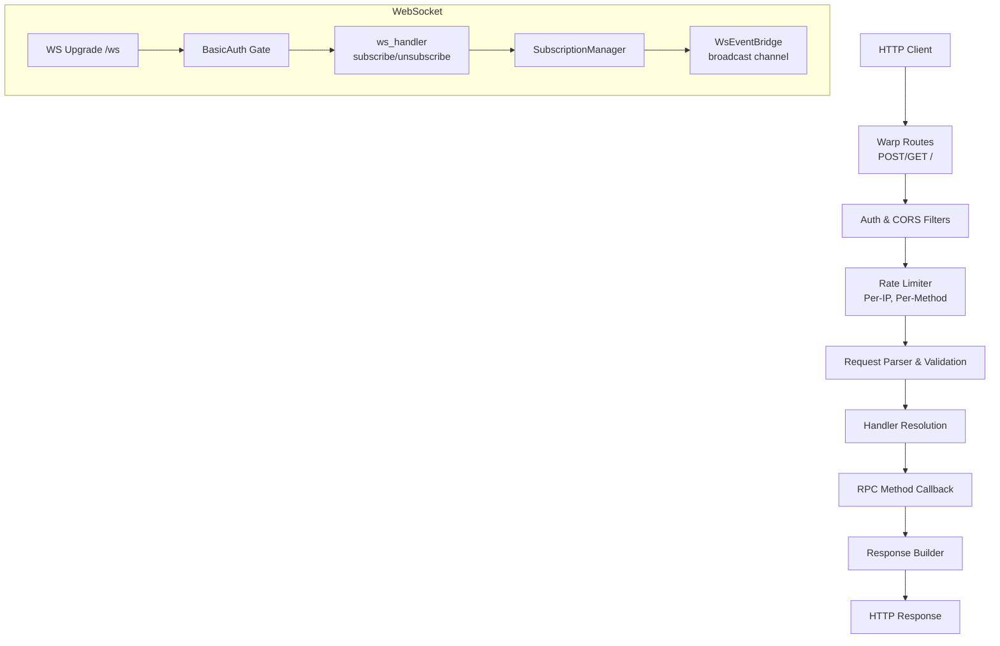
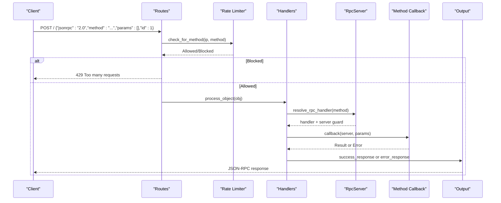
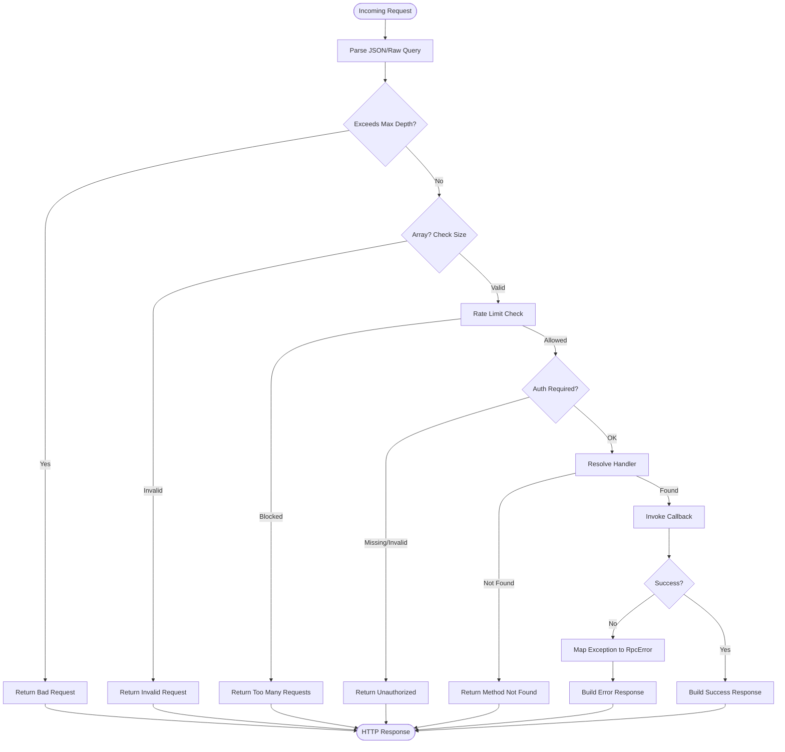
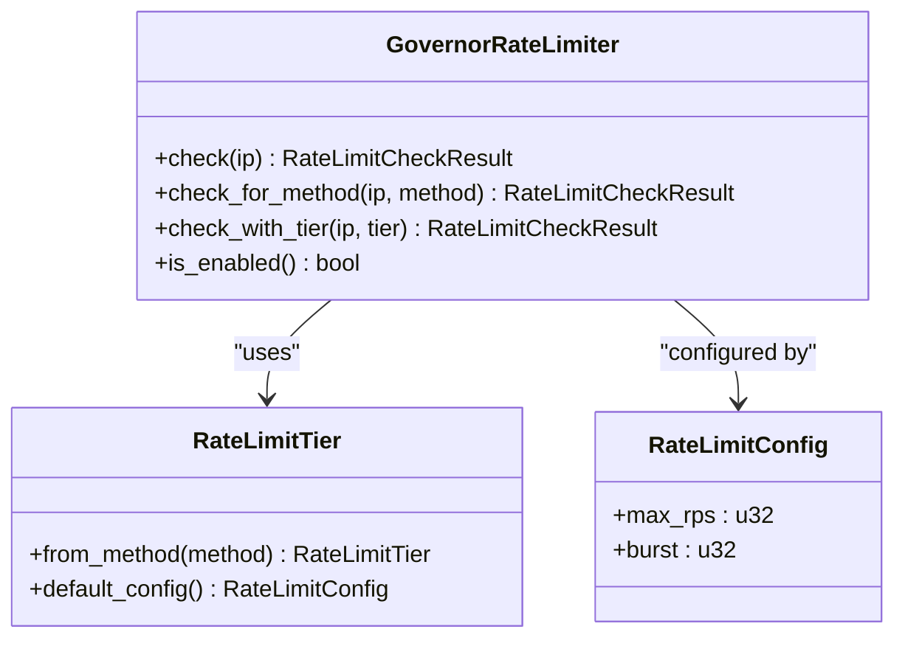
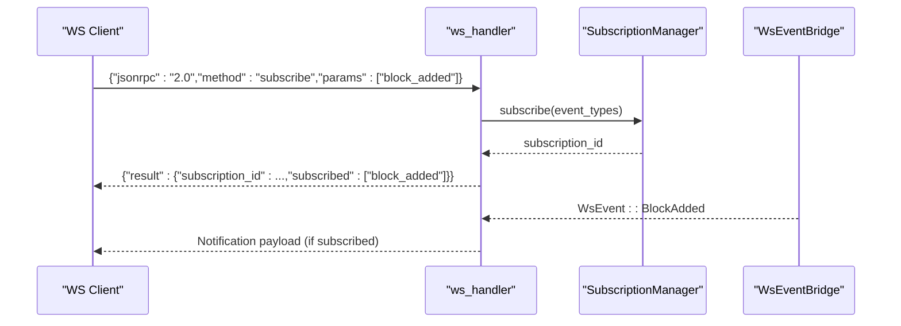
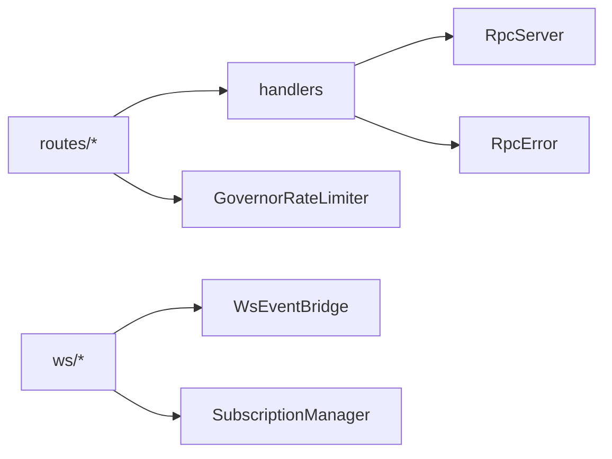

# RPC Request Flow

<cite>
**Referenced Files in This Document**
- [mod.rs](file://neo-rpc/src/server/mod.rs)
- [rpc_server.rs](file://neo-rpc/src/server/rpc_server.rs)
- [routes/mod.rs](file://neo-rpc/src/server/routes/mod.rs)
- [routes/handlers.rs](file://neo-rpc/src/server/routes/handlers.rs)
- [middleware/mod.rs](file://neo-rpc/src/server/middleware/mod.rs)
- [middleware/rate_limiter.rs](file://neo-rpc/src/server/middleware/rate_limiter.rs)
- [ws/mod.rs](file://neo-rpc/src/server/ws/mod.rs)
- [ws/bridge.rs](file://neo-rpc/src/server/ws/bridge.rs)
- [ws/handler.rs](file://neo-rpc/src/server/ws/handler.rs)
- [rpc_error.rs](file://neo-rpc/src/server/rpc_error.rs)
</cite>

## Table of Contents
1. Introduction
2. Project Structure
3. Core Components
4. Architecture Overview
5. Detailed Component Analysis
6. Dependency Analysis
7. Performance Considerations
8. Troubleshooting Guide
9. Conclusion

## Introduction
This document explains the end-to-end RPC request processing flow in Neo-RS, from incoming JSON-RPC requests to authentication, parameter validation, method dispatch, and response serialization. It also covers middleware processing (rate limiting), request queuing via connection limits, error handling and exception mapping, WebSocket event streaming with subscription management, and security measures such as input sanitization, access control, and protection against abuse.

## Project Structure
The RPC subsystem is implemented under neo-rpc/src/server. Key responsibilities:
- Server lifecycle and transport setup: rpc_server.rs
- HTTP routes and request pipeline: routes/mod.rs, routes/handlers.rs
- Middleware for rate limiting: middleware/mod.rs, middleware/rate_limiter.rs
- WebSocket support: ws/mod.rs, ws/bridge.rs, ws/handler.rs
- Error model and codes: rpc_error.rs
- Public exports and module wiring: mod.rs

**Diagram sources**
- [routes/mod.rs:54-118](file://neo-rpc/src/server/routes/mod.rs#L54-L118)
- [routes/handlers.rs:22-108](file://neo-rpc/src/server/routes/handlers.rs#L22-L108)
- [middleware/rate_limiter.rs:192-356](file://neo-rpc/src/server/middleware/rate_limiter.rs#L192-L356)
- [ws/handler.rs:73-164](file://neo-rpc/src/server/ws/handler.rs#L73-L164)
- [ws/bridge.rs:16-86](file://neo-rpc/src/server/ws/bridge.rs#L16-L86)

**Section sources**
- [mod.rs:1-66](file://neo-rpc/src/server/mod.rs#L1-L66)
- [rpc_server.rs:105-128](file://neo-rpc/src/server/rpc_server.rs#L105-L128)

## Core Components
- RpcServer: owns settings, handler registry, sessions, WebSocket bridge, and server lifecycle.
- Route handlers: parse JSON-RPC payloads, enforce depth limits, batch size, auth, and rate limits; resolve and invoke methods.
- Rate limiter: per-IP and per-method tiers using a keyed GCRA limiter.
- WebSocket subsystem: upgrade gate, subscription manager, broadcast bridge for real-time events.
- Error model: strongly-typed errors mapped to JSON-RPC responses.

**Section sources**
- [rpc_server.rs:105-128](file://neo-rpc/src/server/rpc_server.rs#L105-L128)
- [routes/mod.rs:32-40](file://neo-rpc/src/server/routes/mod.rs#L32-L40)
- [middleware/rate_limiter.rs:41-106](file://neo-rpc/src/server/middleware/rate_limiter.rs#L41-L106)
- [ws/mod.rs:1-18](file://neo-rpc/src/server/ws/mod.rs#L1-L18)
- [rpc_error.rs:10-17](file://neo-rpc/src/server/rpc_error.rs#L10-L17)

## Architecture Overview
The HTTP path:
- POST/GET / receives JSON-RPC requests.
- Filters apply CORS and extract client IP and Authorization header.
- Body/query parsing enforces max depth and payload size.
- Rate limiter checks are applied per method tier.
- Handler resolution validates disabled methods and looks up registered handlers.
- Authentication (Basic Auth) is enforced when configured.
- The selected handler callback executes and returns a result or error.
- Responses are serialized into JSON-RPC format with proper status codes.

The WebSocket path:
- /ws upgrades to WebSocket after Basic Auth check.
- Client sends subscribe/unsubscribe messages.
- SubscriptionManager tracks per-connection subscriptions.
- WsEventBridge publishes chain events to all subscribers.

**Diagram sources**
- [routes/handlers.rs:22-108](file://neo-rpc/src/server/routes/handlers.rs#L22-L108)
- [routes/handlers.rs:221-298](file://neo-rpc/src/server/routes/handlers.rs#L221-L298)
- [routes/handlers.rs:300-368](file://neo-rpc/src/server/routes/handlers.rs#L300-L368)
- [middleware/rate_limiter.rs:265-319](file://neo-rpc/src/server/middleware/rate_limiter.rs#L265-L319)

**Section sources**
- [routes/mod.rs:54-118](file://neo-rpc/src/server/routes/mod.rs#L54-L118)
- [routes/handlers.rs:22-108](file://neo-rpc/src/server/routes/handlers.rs#L22-L108)
- [routes/handlers.rs:221-298](file://neo-rpc/src/server/routes/handlers.rs#L221-L298)
- [routes/handlers.rs:300-368](file://neo-rpc/src/server/routes/handlers.rs#L300-L368)

## Detailed Component Analysis

### HTTP Request Pipeline
- Parsing and validation:
  - POST body parsed to JSON; GET query converted to JSON-RPC object.
  - Depth limit prevents deeply nested structures.
  - Batch arrays validated for empty and maximum size.
- Rate limiting:
  - Standard pre-check for malformed or oversized inputs.
  - Method-tiered check for valid requests.
- Authentication:
  - Basic Auth enforced when configured; missing or invalid credentials return 401 with WWW-Authenticate challenge.
- Dispatch:
  - Disabled methods rejected.
  - Registered handlers invoked with server context and parameters.
  - Panics caught and mapped to internal server error based on policy.
- Response:
  - Success responses include jsonrpc version, id, and result.
  - Errors include code, message, optional data, and appropriate HTTP status.

**Diagram sources**
- [routes/handlers.rs:128-166](file://neo-rpc/src/server/routes/handlers.rs#L128-L166)
- [routes/handlers.rs:168-219](file://neo-rpc/src/server/routes/handlers.rs#L168-L219)
- [routes/handlers.rs:221-298](file://neo-rpc/src/server/routes/handlers.rs#L221-L298)
- [routes/handlers.rs:300-368](file://neo-rpc/src/server/routes/handlers.rs#L300-L368)

**Section sources**
- [routes/mod.rs:54-118](file://neo-rpc/src/server/routes/mod.rs#L54-L118)
- [routes/handlers.rs:22-108](file://neo-rpc/src/server/routes/handlers.rs#L22-L108)
- [routes/handlers.rs:128-219](file://neo-rpc/src/server/routes/handlers.rs#L128-L219)
- [routes/handlers.rs:221-298](file://neo-rpc/src/server/routes/handlers.rs#L221-L298)
- [routes/handlers.rs:300-368](file://neo-rpc/src/server/routes/handlers.rs#L300-L368)

### Authentication and Access Control
- Basic Auth is enforced at route level for both HTTP and WebSocket.
- Missing or incorrect credentials yield 401 Unauthorized with WWW-Authenticate header.
- Disabled methods are rejected before invocation.

**Section sources**
- [routes/mod.rs:120-153](file://neo-rpc/src/server/routes/mod.rs#L120-L153)
- [routes/handlers.rs:278-289](file://neo-rpc/src/server/routes/handlers.rs#L278-L289)
- [routes/handlers.rs:300-320](file://neo-rpc/src/server/routes/handlers.rs#L300-L320)

### Parameter Validation and Input Sanitization
- Maximum parameter depth enforced to prevent deep-nested attacks.
- Payload size limited by content-length; query length limited for GET.
- Batch arrays validated for emptiness and maximum size.

**Section sources**
- [routes/mod.rs:30-40](file://neo-rpc/src/server/routes/mod.rs#L30-L40)
- [routes/mod.rs:83-104](file://neo-rpc/src/server/routes/mod.rs#L83-L104)
- [routes/handlers.rs:128-166](file://neo-rpc/src/server/routes/handlers.rs#L128-L166)
- [routes/handlers.rs:168-219](file://neo-rpc/src/server/routes/handlers.rs#L168-L219)

### Method Dispatch and Execution
- Handlers are resolved by lowercase method name; disabled methods blocked.
- Callbacks execute within a read guard over RpcServer to access system state safely.
- Panics are caught and mapped to internal server error according to policy.

**Section sources**
- [routes/handlers.rs:300-320](file://neo-rpc/src/server/routes/handlers.rs#L300-L320)
- [routes/handlers.rs:331-368](file://neo-rpc/src/server/routes/handlers.rs#L331-L368)
- [rpc_server.rs:552-561](file://neo-rpc/src/server/rpc_server.rs#L552-L561)

### Response Serialization
- Success responses include jsonrpc version, id, and result.
- Error responses include code, message, optional data, and set HTTP status accordingly.
- Challenge headers added for unauthorized responses when auth is enabled.

**Section sources**
- [routes/mod.rs:161-215](file://neo-rpc/src/server/routes/mod.rs#L161-L215)
- [routes/handlers.rs:221-298](file://neo-rpc/src/server/routes/handlers.rs#L221-L298)

### Middleware Processing and Rate Limiting
- Per-IP and per-method rate limiting using tiers:
  - Cheap: simple lookups
  - Standard: typical reads
  - Expensive: VM execution and complex queries
  - Write: transaction submission
- Configurable burst and rps; disabled when max_rps is zero.
- Stale entries cleaned periodically to bound memory usage.

**Diagram sources**
- [middleware/rate_limiter.rs:192-356](file://neo-rpc/src/server/middleware/rate_limiter.rs#L192-L356)
- [middleware/rate_limiter.rs:41-106](file://neo-rpc/src/server/middleware/rate_limiter.rs#L41-L106)

**Section sources**
- [middleware/mod.rs:1-10](file://neo-rpc/src/server/middleware/mod.rs#L1-L10)
- [middleware/rate_limiter.rs:192-356](file://neo-rpc/src/server/middleware/rate_limiter.rs#L192-L356)
- [routes/mod.rs:54-81](file://neo-rpc/src/server/routes/mod.rs#L54-L81)

### Request Queuing and Connection Limits
- Connection-level concurrency limited by a semaphore to protect resources.
- TLS handshake deadlines prevent stalled handshakes from blocking accept loops.
- Graceful shutdown aborts accept loops and cleans up tasks.

**Section sources**
- [rpc_server.rs:194-231](file://neo-rpc/src/server/rpc_server.rs#L194-L231)
- [rpc_server.rs:255-389](file://neo-rpc/src/server/rpc_server.rs#L255-L389)
- [rpc_server.rs:390-479](file://neo-rpc/src/server/rpc_server.rs#L390-L479)
- [rpc_server.rs:518-550](file://neo-rpc/src/server/rpc_server.rs#L518-L550)

### WebSocket Event Streaming and Subscriptions
- WebSocket upgrade requires Basic Auth if configured.
- Clients send subscribe/unsubscribe JSON-RPC messages over WS.
- SubscriptionManager tracks per-connection subscriptions.
- WsEventBridge broadcasts chain events to all subscribers.

**Diagram sources**
- [ws/handler.rs:73-164](file://neo-rpc/src/server/ws/handler.rs#L73-L164)
- [ws/handler.rs:166-319](file://neo-rpc/src/server/ws/handler.rs#L166-L319)
- [ws/bridge.rs:16-86](file://neo-rpc/src/server/ws/bridge.rs#L16-L86)

**Section sources**
- [ws/mod.rs:1-18](file://neo-rpc/src/server/ws/mod.rs#L1-L18)
- [ws/handler.rs:73-164](file://neo-rpc/src/server/ws/handler.rs#L73-L164)
- [ws/handler.rs:166-319](file://neo-rpc/src/server/ws/handler.rs#L166-L319)
- [ws/bridge.rs:16-86](file://neo-rpc/src/server/ws/bridge.rs#L16-L86)

### Error Handling and Exception Mapping
- All JSON-RPC errors are modeled as RpcError with standardized codes and messages.
- Handler panics are caught and mapped to internal server error; policy determines node behavior.
- Errors are serialized into JSON-RPC error objects with optional data.

**Section sources**
- [rpc_error.rs:10-219](file://neo-rpc/src/server/rpc_error.rs#L10-L219)
- [routes/handlers.rs:331-368](file://neo-rpc/src/server/routes/handlers.rs#L331-L368)
- [routes/mod.rs:169-183](file://neo-rpc/src/server/routes/mod.rs#L169-L183)

### Security Measures
- Input sanitization:
  - Max depth enforcement for JSON structures.
  - Content-length and query length limits.
  - Batch size limits.
- Access control:
  - Basic Auth for HTTP and WebSocket.
  - Disabled methods cannot be invoked.
- Resource protection:
  - Connection concurrency limits via semaphore.
  - TLS handshake deadlines.
  - Session capacity limits and background purge.

**Section sources**
- [routes/mod.rs:83-104](file://neo-rpc/src/server/routes/mod.rs#L83-L104)
- [routes/handlers.rs:128-166](file://neo-rpc/src/server/routes/handlers.rs#L128-L166)
- [routes/handlers.rs:168-219](file://neo-rpc/src/server/routes/handlers.rs#L168-L219)
- [routes/mod.rs:120-153](file://neo-rpc/src/server/routes/mod.rs#L120-L153)
- [rpc_server.rs:194-231](file://neo-rpc/src/server/rpc_server.rs#L194-L231)
- [rpc_server.rs:255-389](file://neo-rpc/src/server/rpc_server.rs#L255-L389)
- [rpc_server.rs:609-620](file://neo-rpc/src/server/rpc_server.rs#L609-L620)

## Dependency Analysis
- Routes depend on middleware for rate limiting and on handlers for request processing.
- Handlers depend on RpcServer for method lookup and on error model for responses.
- WebSocket depends on SubscriptionManager and WsEventBridge for event delivery.
- RpcServer manages lifecycle, sessions, and TLS configuration.

**Diagram sources**
- [routes/mod.rs:54-118](file://neo-rpc/src/server/routes/mod.rs#L54-L118)
- [routes/handlers.rs:22-108](file://neo-rpc/src/server/routes/handlers.rs#L22-L108)
- [middleware/rate_limiter.rs:192-356](file://neo-rpc/src/server/middleware/rate_limiter.rs#L192-L356)
- [ws/handler.rs:73-164](file://neo-rpc/src/server/ws/handler.rs#L73-L164)
- [ws/bridge.rs:16-86](file://neo-rpc/src/server/ws/bridge.rs#L16-L86)

**Section sources**
- [mod.rs:1-66](file://neo-rpc/src/server/mod.rs#L1-L66)
- [rpc_server.rs:105-128](file://neo-rpc/src/server/rpc_server.rs#L105-L128)

## Performance Considerations
- Use method-tiered rate limiting to protect expensive operations like contract invocations.
- Keep TLS handshake deadlines to avoid accept loop stalls.
- Enable compression for HTTP responses where supported.
- Monitor session capacity and adjust expiration intervals to balance memory and responsiveness.

[No sources needed since this section provides general guidance]

## Troubleshooting Guide
Common issues and resolutions:
- 401 Unauthorized: Ensure Basic Auth credentials are correct and present; verify realm matches expected value.
- 429 Too Many Requests: Reduce request rate or adjust rate limit configuration; consider tier-specific limits.
- Method not found: Verify method name case-insensitivity and that it is not disabled.
- Internal server error: Check handler panics and unhandled exception policy; review logs for panic messages.
- WebSocket disconnects: Inspect lag warnings and ensure clients handle reconnections; verify event channel is active.

**Section sources**
- [routes/handlers.rs:278-289](file://neo-rpc/src/server/routes/handlers.rs#L278-L289)
- [routes/handlers.rs:300-320](file://neo-rpc/src/server/routes/handlers.rs#L300-L320)
- [routes/handlers.rs:331-368](file://neo-rpc/src/server/routes/handlers.rs#L331-L368)
- [ws/handler.rs:134-155](file://neo-rpc/src/server/ws/handler.rs#L134-L155)

## Conclusion
Neo-RS implements a robust RPC request pipeline with strong security, rate limiting, and resource protection. HTTP requests pass through parsing, validation, authentication, and method dispatch, while WebSocket connections provide real-time event streaming with subscription management. Centralized error modeling ensures consistent responses, and lifecycle controls enable graceful operation under load.

[No sources needed since this section summarizes without analyzing specific files]