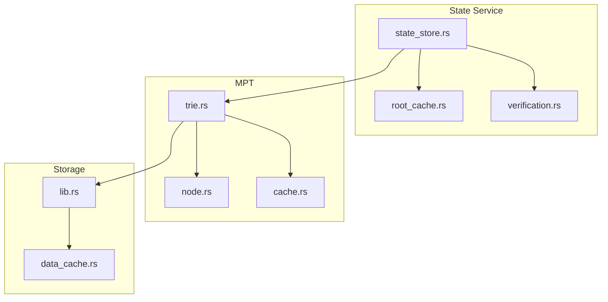
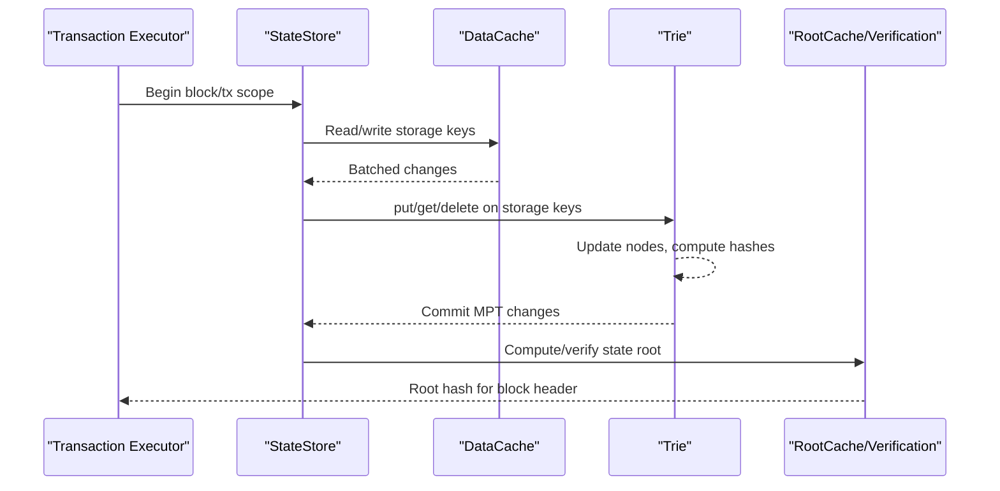
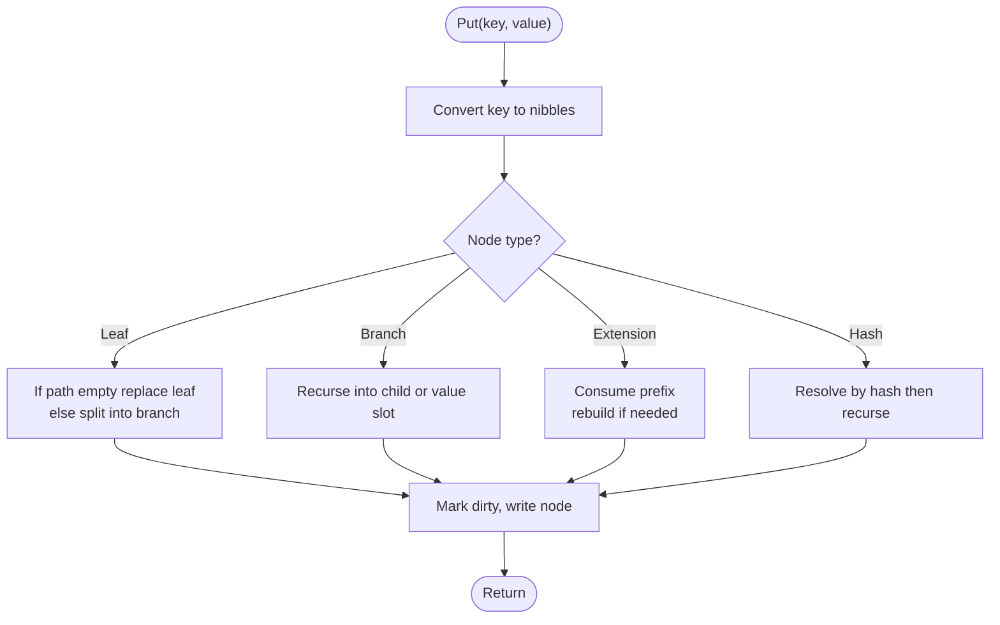
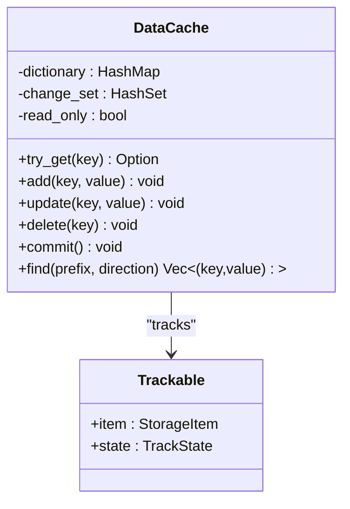
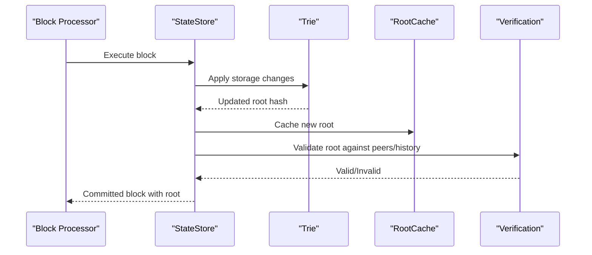
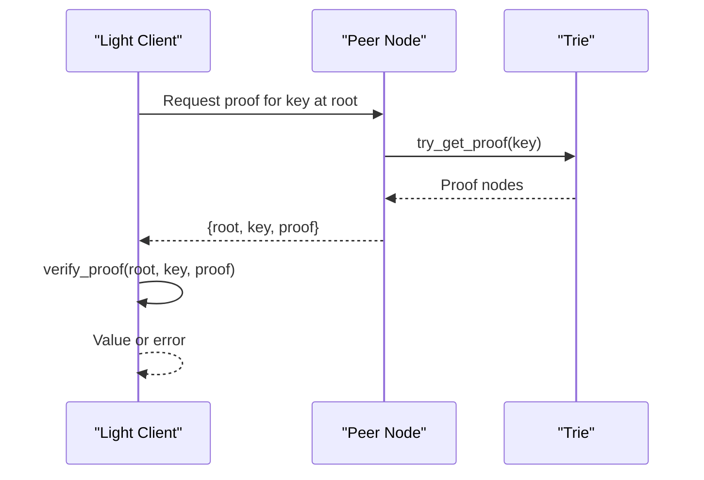
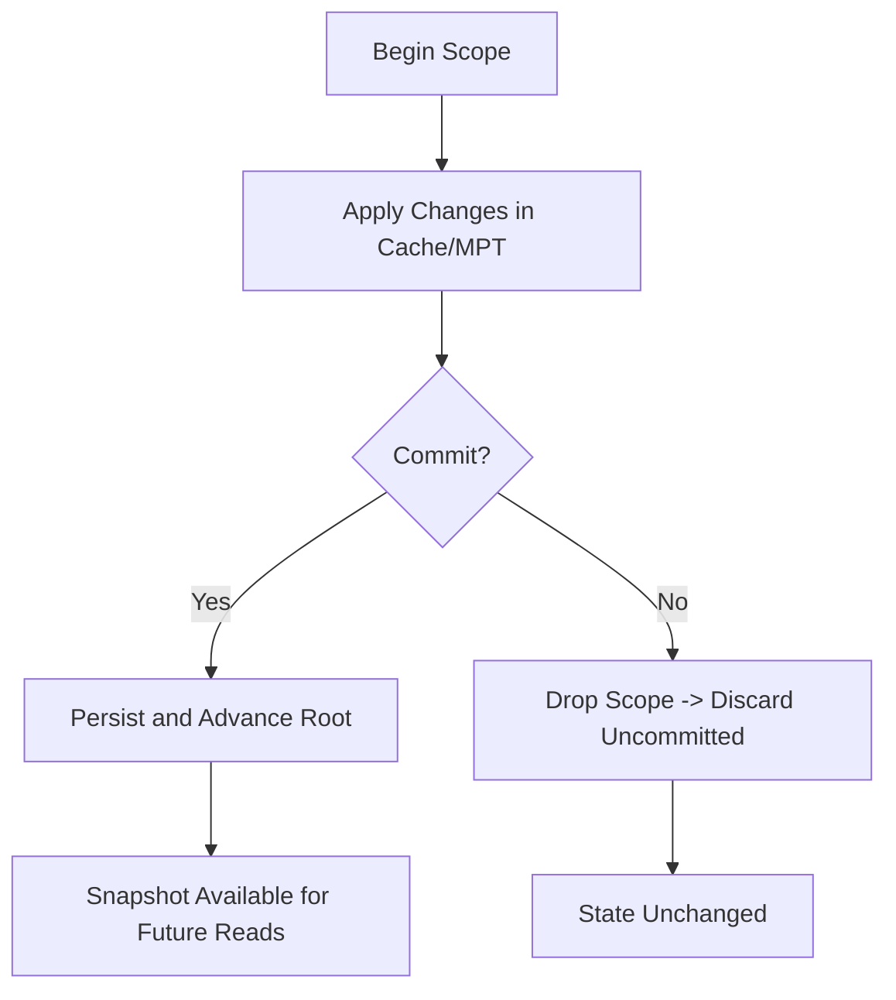
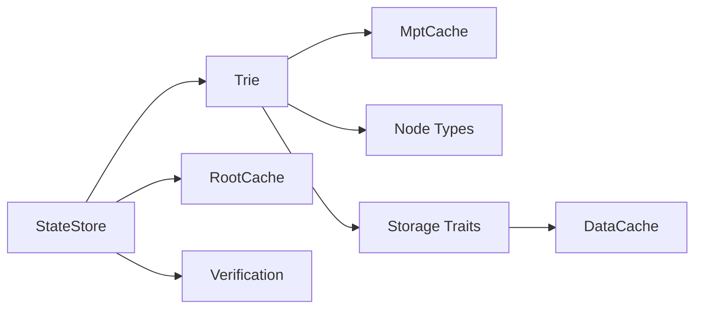

# State Management Flow

<cite>
**Referenced Files in This Document**
- [neo-core/src/state_service/mod.rs](file://neo-core/src/state_service/mod.rs)
- [neo-core/src/state_service/state_store.rs](file://neo-core/src/state_service/state_store.rs)
- [neo-core/src/state_service/root_cache.rs](file://neo-core/src/state_service/root_cache.rs)
- [neo-core/src/state_service/verification.rs](file://neo-core/src/state_service/verification.rs)
- [neo-crypto/src/mpt_trie/mod.rs](file://neo-crypto/src/mpt_trie/mod.rs)
- [neo-crypto/src/mpt_trie/trie.rs](file://neo-crypto/src/mpt_trie/trie.rs)
- [neo-crypto/src/mpt_trie/node.rs](file://neo-crypto/src/mpt_trie/node.rs)
- [neo-crypto/src/mpt_trie/cache.rs](file://neo-crypto/src/mpt_trie/cache.rs)
- [neo-storage/src/lib.rs](file://neo-storage/src/lib.rs)
- [neo-storage/src/cache/data_cache.rs](file://neo-storage/src/cache/data_cache.rs)
</cite>

## Table of Contents
1. [Introduction](#introduction)
2. [Project Structure](#project-structure)
3. [Core Components](#core-components)
4. [Architecture Overview](#architecture-overview)
5. [Detailed Component Analysis](#detailed-component-analysis)
6. [Dependency Analysis](#dependency-analysis)
7. [Performance Considerations](#performance-considerations)
8. [Troubleshooting Guide](#troubleshooting-guide)
9. [Conclusion](#conclusion)

## Introduction
This document explains how Neo-RS manages state during transaction execution and block processing. It covers:
- How account balances, smart contract storage, and system state are modified
- The Merkle Patricia Trie (MPT) implementation for efficient updates and verification
- State snapshots, checkpoints, and fast synchronization
- Rollback mechanisms, undo operations, and consistency guarantees
- Performance considerations including caching, batched writes, and memory management

## Project Structure
Neo-RS separates concerns across crates:
- neo-core/state_service: state root computation, persistence, caching, and verification
- neo-crypto/mpt_trie: MPT data structure, node types, cache-backed trie, and proof generation
- neo-storage: storage traits, in-memory DataCache with change tracking, and persistence abstractions

**Diagram sources**
- [neo-core/src/state_service/state_store.rs](file://neo-core/src/state_service/state_store.rs)
- [neo-core/src/state_service/root_cache.rs](file://neo-core/src/state_service/root_cache.rs)
- [neo-core/src/state_service/verification.rs](file://neo-core/src/state_service/verification.rs)
- [neo-crypto/src/mpt_trie/trie.rs](file://neo-crypto/src/mpt_trie/trie.rs)
- [neo-crypto/src/mpt_trie/node.rs](file://neo-crypto/src/mpt_trie/node.rs)
- [neo-crypto/src/mpt_trie/cache.rs](file://neo-crypto/src/mpt_trie/cache.rs)
- [neo-storage/src/lib.rs](file://neo-storage/src/lib.rs)
- [neo-storage/src/cache/data_cache.rs](file://neo-storage/src/cache/data_cache.rs)

**Section sources**
- [neo-core/src/state_service/mod.rs:1-38](file://neo-core/src/state_service/mod.rs#L1-L38)
- [neo-storage/src/lib.rs:1-71](file://neo-storage/src/lib.rs#L1-L71)

## Core Components
- State Store and transactions: encapsulates state mutations and commits for blocks and transactions
- MPT Trie: immutable-by-default tree with copy-on-write semantics; supports get/put/delete/find/proofs
- MPT Cache: resolves nodes by hash and batches writes to the underlying store snapshot
- Storage DataCache: in-memory cache with change tracking for key/value storage used by VM/runtime
- Root Cache and Verification: caches recent state roots and validates incoming roots

Key responsibilities:
- Apply changes to account balances and contract storage via storage APIs
- Build and update the MPT over storage keys/values to derive a deterministic state root
- Persist validated roots and support proofs for light clients and fast sync

**Section sources**
- [neo-core/src/state_service/state_store.rs](file://neo-core/src/state_service/state_store.rs)
- [neo-crypto/src/mpt_trie/trie.rs:16-206](file://neo-crypto/src/mpt_trie/trie.rs#L16-L206)
- [neo-crypto/src/mpt_trie/cache.rs](file://neo-crypto/src/mpt_trie/cache.rs)
- [neo-storage/src/cache/data_cache.rs:58-376](file://neo-storage/src/cache/data_cache.rs#L58-L376)
- [neo-core/src/state_service/root_cache.rs](file://neo-core/src/state_service/root_cache.rs)
- [neo-core/src/state_service/verification.rs](file://neo-core/src/state_service/verification.rs)

## Architecture Overview
The state management pipeline connects transaction execution, storage, and MPT-based state root computation.

**Diagram sources**
- [neo-core/src/state_service/state_store.rs](file://neo-core/src/state_service/state_store.rs)
- [neo-storage/src/cache/data_cache.rs:58-376](file://neo-storage/src/cache/data_cache.rs#L58-L376)
- [neo-crypto/src/mpt_trie/trie.rs:16-206](file://neo-crypto/src/mpt_trie/trie.rs#L16-L206)
- [neo-core/src/state_service/root_cache.rs](file://neo-core/src/state_service/root_cache.rs)
- [neo-core/src/state_service/verification.rs](file://neo-core/src/state_service/verification.rs)

## Detailed Component Analysis

### MPT Implementation and State Tree Modifications
- Node types include leaf, branch, extension, hash, and empty nodes
- Copy-on-write semantics ensure structural sharing while allowing efficient updates
- Path is derived from storage keys; nibble-based traversal optimizes prefix handling
- Put/Delete traverse and mutate nodes, recomputing hashes up to the root
- Find enumerates entries under a prefix with optional resume offset
- Proof generation collects serialized nodes along the path; verification reconstructs and reads values using an in-memory store built from proof nodes

**Diagram sources**
- [neo-crypto/src/mpt_trie/trie.rs:79-403](file://neo-crypto/src/mpt_trie/trie.rs#L79-L403)
- [neo-crypto/src/mpt_trie/node.rs](file://neo-crypto/src/mpt_trie/node.rs)

**Section sources**
- [neo-crypto/src/mpt_trie/trie.rs:16-206](file://neo-crypto/src/mpt_trie/trie.rs#L16-L206)
- [neo-crypto/src/mpt_trie/trie.rs:208-403](file://neo-crypto/src/mpt_trie/trie.rs#L208-L403)
- [neo-crypto/src/mpt_trie/trie.rs:405-570](file://neo-crypto/src/mpt_trie/trie.rs#L405-L570)
- [neo-crypto/src/mpt_trie/trie.rs:572-623](file://neo-crypto/src/mpt_trie/trie.rs#L572-L623)
- [neo-crypto/src/mpt_trie/trie.rs:625-784](file://neo-crypto/src/mpt_trie/trie.rs#L625-L784)
- [neo-crypto/src/mpt_trie/mod.rs:1-25](file://neo-crypto/src/mpt_trie/mod.rs#L1-L25)

### Storage Caching and Change Tracking
- DataCache provides read/write with change tracking states: Added, Changed, Deleted, NotFound
- Reads first check in-memory dictionary; misses delegate to backing store and cache results
- Writes mark entries as Added or Changed and maintain a change set for efficient commit
- Commits reset tracked states and remove deleted/not-found markers
- Find merges backing store results with cached overlays respecting contract ID and key prefixes

**Diagram sources**
- [neo-storage/src/cache/data_cache.rs:58-376](file://neo-storage/src/cache/data_cache.rs#L58-L376)

**Section sources**
- [neo-storage/src/cache/data_cache.rs:58-376](file://neo-storage/src/cache/data_cache.rs#L58-L376)

### State Store, Snapshots, and Checkpoints
- StateStore wraps storage and coordinates MPT updates per transaction/block
- Snapshots provide point-in-time views for verification and rollback
- RootCache stores recent state roots to speed up validation and sync
- Verification module validates incoming state roots against known history

**Diagram sources**
- [neo-core/src/state_service/state_store.rs](file://neo-core/src/state_service/state_store.rs)
- [neo-core/src/state_service/root_cache.rs](file://neo-core/src/state_service/root_cache.rs)
- [neo-core/src/state_service/verification.rs](file://neo-core/src/state_service/verification.rs)
- [neo-crypto/src/mpt_trie/trie.rs:16-206](file://neo-crypto/src/mpt_trie/trie.rs#L16-L206)

**Section sources**
- [neo-core/src/state_service/state_store.rs](file://neo-core/src/state_service/state_store.rs)
- [neo-core/src/state_service/root_cache.rs](file://neo-core/src/state_service/root_cache.rs)
- [neo-core/src/state_service/verification.rs](file://neo-core/src/state_service/verification.rs)

### Fast Synchronization and Proofs
- Nodes can be verified using Merkle proofs generated by the trie
- A proof is a set of serialized nodes that allow reconstructing the path to a key
- Verification builds an in-memory store from proof nodes and reads the requested key

**Diagram sources**
- [neo-crypto/src/mpt_trie/trie.rs:153-206](file://neo-crypto/src/mpt_trie/trie.rs#L153-L206)

**Section sources**
- [neo-crypto/src/mpt_trie/trie.rs:153-206](file://neo-crypto/src/mpt_trie/trie.rs#L153-L206)

### Rollback Mechanisms and Undo Operations
- DataCache tracks changes per scope; uncommitted changes can be discarded by dropping the cache instance
- For committed scopes, rollbacks rely on snapshot isolation: read paths use historical snapshots
- MPT uses copy-on-write; old nodes remain reachable via previous roots until garbage collected
- StateStore coordinates begin/commit/rollback around transactional scopes

[No sources needed since this diagram shows conceptual workflow, not actual code structure]

**Section sources**
- [neo-storage/src/cache/data_cache.rs:58-376](file://neo-storage/src/cache/data_cache.rs#L58-L376)
- [neo-crypto/src/mpt_trie/trie.rs:258-403](file://neo-crypto/src/mpt_trie/trie.rs#L258-L403)
- [neo-core/src/state_service/state_store.rs](file://neo-core/src/state_service/state_store.rs)

## Dependency Analysis
- StateService depends on MPT for state hashing and proofs
- MPT depends on a store snapshot abstraction for node resolution and persistence
- Storage layer provides DataCache for high-throughput key/value access
- RootCache and Verification depend on persisted roots and network messages

**Diagram sources**
- [neo-core/src/state_service/state_store.rs](file://neo-core/src/state_service/state_store.rs)
- [neo-crypto/src/mpt_trie/trie.rs:16-206](file://neo-crypto/src/mpt_trie/trie.rs#L16-L206)
- [neo-crypto/src/mpt_trie/cache.rs](file://neo-crypto/src/mpt_trie/cache.rs)
- [neo-crypto/src/mpt_trie/node.rs](file://neo-crypto/src/mpt_trie/node.rs)
- [neo-storage/src/lib.rs:1-71](file://neo-storage/src/lib.rs#L1-L71)
- [neo-storage/src/cache/data_cache.rs:58-376](file://neo-storage/src/cache/data_cache.rs#L58-L376)

**Section sources**
- [neo-core/src/state_service/mod.rs:1-38](file://neo-core/src/state_service/mod.rs#L1-L38)
- [neo-storage/src/lib.rs:1-71](file://neo-storage/src/lib.rs#L1-L71)

## Performance Considerations
- In-memory caching: DataCache reduces disk reads and batches writes via change tracking
- Structural sharing: MPT nodes are shared via Arc where possible; copy-on-write minimizes copies
- Prefix enumeration: Efficient find with seek and traversal avoids full scans
- Root caching: Recent roots are cached to accelerate validation and sync
- Memory management:
  - DataCache clears tracked states after commit and removes deleted markers
  - MPT cache resolves nodes lazily and persists only when dirty
  - Snapshot isolation allows concurrent reads without blocking writes

Recommendations:
- Tune cache sizes based on workload patterns
- Use batched writes for bulk updates (e.g., native contract migrations)
- Monitor root cache hit rates and adjust capacity
- Profile MPT node sizes and consider compression for large values

[No sources needed since this section provides general guidance]

## Troubleshooting Guide
Common issues and diagnostics:
- Key not found errors during reads: verify key encoding and prefix matching
- Proof verification failures: ensure proof nodes correspond to the claimed root and include all necessary ancestors
- State divergence: compare state roots between peers and inspect MPT differences using find and proof tools
- Performance regressions: measure cache hit ratios, MPT resolve latency, and I/O throughput

Actions:
- Use find with prefixes to locate affected keys
- Generate and validate proofs for suspect keys
- Inspect root cache and persistence logs for anomalies
- Replay blocks from a known-good root to isolate divergences

**Section sources**
- [neo-crypto/src/mpt_trie/trie.rs:153-206](file://neo-crypto/src/mpt_trie/trie.rs#L153-L206)
- [neo-storage/src/cache/data_cache.rs:58-376](file://neo-storage/src/cache/data_cache.rs#L58-L376)

## Conclusion
Neo-RS implements robust state management through:
- A high-performance MPT for deterministic state hashing and proofs
- Layered caching with change tracking for efficient reads/writes
- Clear separation of concerns between state service, storage, and cryptographic primitives
- Strong consistency guarantees via snapshots, root validation, and rollback-friendly designs

These components together enable scalable transaction processing, reliable block finalization, and efficient synchronization across the network.