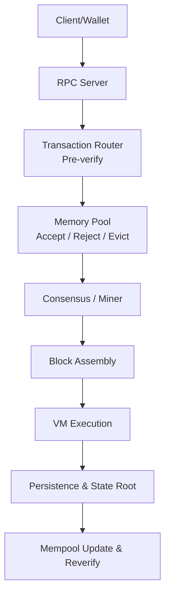
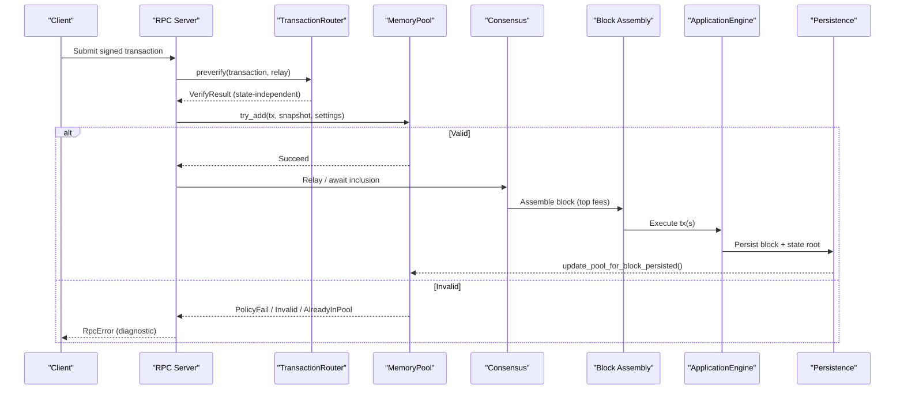
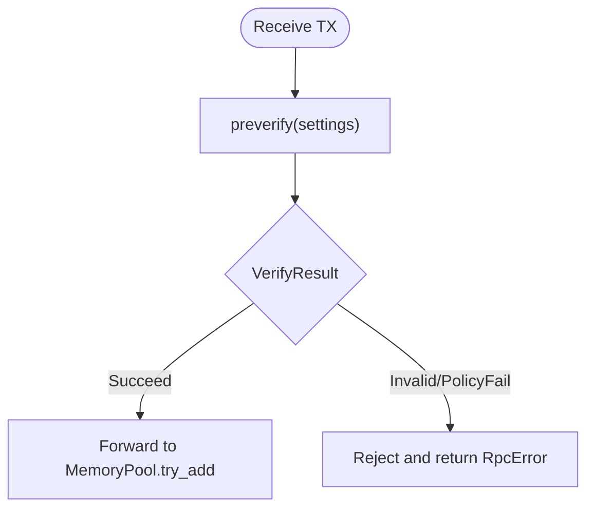
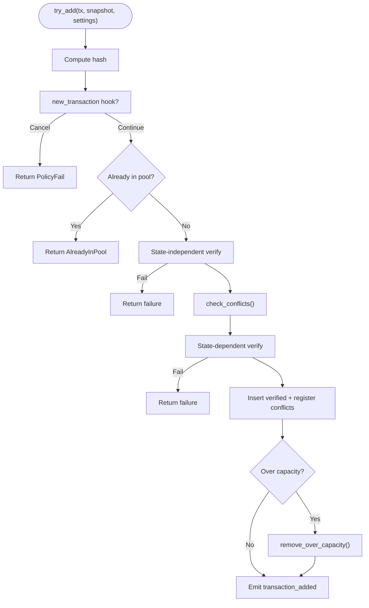
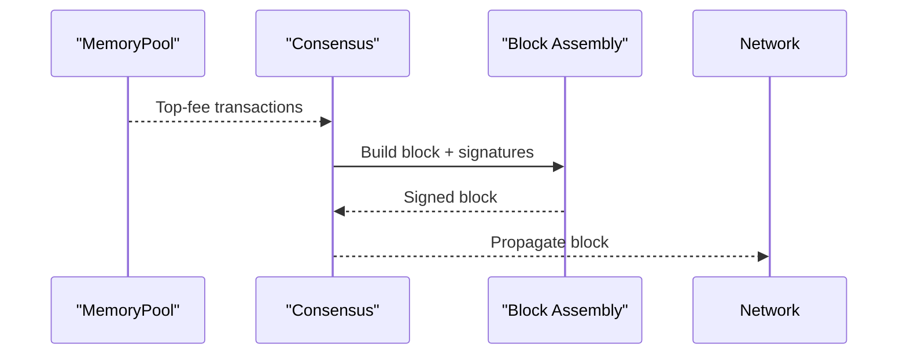
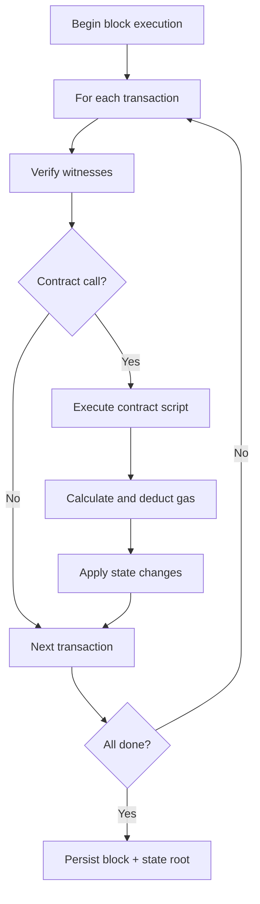
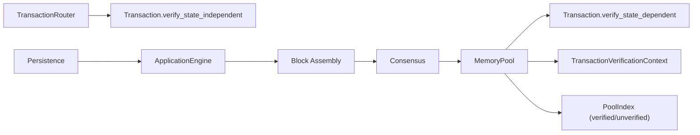

# Transaction Lifecycle

<cite>
**Referenced Files in This Document**
- [neo-core/src/ledger/memory_pool/mod.rs](file://neo-core/src/ledger/memory_pool/mod.rs)
- [neo-core/src/ledger/transaction_router.rs](file://neo-core/src/ledger/transaction_router.rs)
- [neo-core/src/neo_system/actors.rs](file://neo-core/src/neo_system/actors.rs)
- [neo-core/tests/transaction_fee_calculation_tests.rs](file://neo-core/tests/transaction_fee_calculation_tests.rs)
- [neo-core/tests/smart_contract_helper_tests.rs](file://neo-core/tests/smart_contract_helper_tests.rs)
- [neo-core/tests/transaction_validation_edge_cases.rs](file://neo-core/tests/transaction_validation_edge_cases.rs)
- [neo-node/tests/block_assembly_test.rs](file://neo-node/tests/block_assembly_test.rs)
- [neo-rpc/src/server/rpc_error.rs](file://neo-rpc/src/server/rpc_error.rs)
- [neo-storage/src/persistence/data_cache/prefetch.rs](file://neo-storage/src/persistence/data_cache/prefetch.rs)
- [docs/ARCHITECTURE.md](file://docs/ARCHITECTURE.md)
- [docs/audits/transaction-validation-audit.md](file://docs/audits/transaction-validation-audit.md)
- [docs/audits/critical-004-fee-calculation-analysis.md](file://docs/audits/critical-004-fee-calculation-analysis.md)
</cite>

## Table of Contents
1. Introduction
2. Project Structure
3. Core Components
4. Architecture Overview
5. Detailed Component Analysis
6. Dependency Analysis
7. Performance Considerations
8. Troubleshooting Guide
9. Conclusion

## Introduction
This document explains the complete transaction lifecycle in Neo-RS from creation and signing through mempool inclusion, validation, execution, and final confirmation. It covers:
- Transaction pool management: fee-based prioritization, size limits, and eviction policies
- Verification pipeline: signature validation, script execution, gas calculation, and state changes
- Different transaction types and their processing paths
- Error handling, rejection reasons, and recovery mechanisms
- Performance optimizations such as parallel verification and caching strategies

## Project Structure
Neo-RS organizes transaction-related logic across several modules:
- Transaction router for pre-verification (state-independent checks)
- Memory pool for transaction acceptance, conflict resolution, capacity enforcement, and revalidation
- Block assembly and consensus integration for inclusion into blocks
- VM execution and persistence for state updates and finality
- RPC error taxonomy for consistent client-facing diagnostics

**Diagram sources**
- [neo-core/src/ledger/transaction_router.rs:1-43](file://neo-core/src/ledger/transaction_router.rs#L1-L43)
- [neo-core/src/ledger/memory_pool/mod.rs:236-384](file://neo-core/src/ledger/memory_pool/mod.rs#L236-L384)
- [neo-node/tests/block_assembly_test.rs:1-85](file://neo-node/tests/block_assembly_test.rs#L1-L85)
- [docs/ARCHITECTURE.md:416-495](file://docs/ARCHITECTURE.md#L416-L495)

**Section sources**
- [neo-core/src/ledger/transaction_router.rs:1-43](file://neo-core/src/ledger/transaction_router.rs#L1-L43)
- [neo-core/src/ledger/memory_pool/mod.rs:1-118](file://neo-core/src/ledger/memory_pool/mod.rs#L1-L118)
- [docs/ARCHITECTURE.md:416-495](file://docs/ARCHITECTURE.md#L416-L495)

## Core Components
- TransactionRouter: Performs fast, state-independent verification to gate transactions before they enter deeper processing.
- MemoryPool: Accepts transactions, enforces policy and capacity, resolves conflicts, and revalidates over time.
- Block Assembly: Builds blocks with top-fee transactions from the pool and signs them via consensus.
- VM Execution and Persistence: Executes transactions, applies state changes, computes state roots, and persists blocks.
- RPC Errors: Standardized error codes returned to clients for failures at various stages.

Key responsibilities:
- Pre-verify: lightweight checks without blockchain state access
- Mempool: fee ordering, conflict detection, capacity control, rebroadcasting
- Block inclusion: selection by fee priority and consensus signing
- Execution: witness verification, contract invocation, gas accounting, state updates
- Finality: block persistence and event notifications

**Section sources**
- [neo-core/src/ledger/transaction_router.rs:21-43](file://neo-core/src/ledger/transaction_router.rs#L21-L43)
- [neo-core/src/ledger/memory_pool/mod.rs:63-118](file://neo-core/src/ledger/memory_pool/mod.rs#L63-L118)
- [neo-node/tests/block_assembly_test.rs:1-85](file://neo-node/tests/block_assembly_test.rs#L1-L85)
- [neo-rpc/src/server/rpc_error.rs:358-381](file://neo-rpc/src/server/rpc_error.rs#L358-L381)

## Architecture Overview
The transaction lifecycle spans multiple phases:

**Diagram sources**
- [neo-core/src/neo_system/actors.rs:86-122](file://neo-core/src/neo_system/actors.rs#L86-L122)
- [neo-core/src/ledger/transaction_router.rs:32-43](file://neo-core/src/ledger/transaction_router.rs#L32-L43)
- [neo-core/src/ledger/memory_pool/mod.rs:236-384](file://neo-core/src/ledger/memory_pool/mod.rs#L236-L384)
- [neo-node/tests/block_assembly_test.rs:1-85](file://neo-node/tests/block_assembly_test.rs#L1-L85)

**Section sources**
- [neo-core/src/neo_system/actors.rs:86-122](file://neo-core/src/neo_system/actors.rs#L86-L122)
- [neo-core/src/ledger/transaction_router.rs:32-43](file://neo-core/src/ledger/transaction_router.rs#L32-L43)
- [neo-core/src/ledger/memory_pool/mod.rs:236-384](file://neo-core/src/ledger/memory_pool/mod.rs#L236-L384)

## Detailed Component Analysis

### Transaction Creation and Signing
- Clients build a transaction with script, signers, attributes, witnesses, and set network/system fees.
- Signatures are produced using private keys; witnesses contain invocation and verification scripts.
- The node’s RPC layer accepts the serialized transaction and forwards it for pre-verification.

Processing notes:
- Size and structure constraints are enforced early to avoid expensive work on malformed payloads.
- Fee fields must be sufficient to cover both network and system costs.

**Section sources**
- [neo-node/tests/block_assembly_test.rs:1-85](file://neo-node/tests/block_assembly_test.rs#L1-L85)
- [neo-core/tests/transaction_fee_calculation_tests.rs:36-87](file://neo-core/tests/transaction_fee_calculation_tests.rs#L36-L87)

### Pre-Verification (State-Independent)
- The TransactionRouter runs state-independent verification immediately upon receipt.
- Checks include structural validity, attribute correctness, and basic script parseability.
- Results are reported back to the caller and determine whether to proceed to mempool insertion.

**Diagram sources**
- [neo-core/src/ledger/transaction_router.rs:32-43](file://neo-core/src/ledger/transaction_router.rs#L32-L43)
- [neo-core/src/neo_system/actors.rs:104-122](file://neo-core/src/neo_system/actors.rs#L104-L122)

**Section sources**
- [neo-core/src/ledger/transaction_router.rs:32-43](file://neo-core/src/ledger/transaction_router.rs#L32-L43)
- [neo-core/src/neo_system/actors.rs:86-122](file://neo-core/src/neo_system/actors.rs#L86-L122)

### Mempool Inclusion and Management
The memory pool is the central hub for pending transactions.

Key behaviors:
- Acceptance path:
  - Compute hash and run new-transaction hook (optional policy gate).
  - Skip duplicates.
  - Run state-independent checks first, then state-dependent checks with snapshot and conflict context.
  - Register conflicts and add to verified set if valid.
- Conflict resolution:
  - Detect conflicts via Conflicts attributes and shared signers.
  - Replace lower-fee conflicting transactions when a higher-fee replacement arrives.
- Capacity and eviction:
  - Enforce maximum pool size; evict lowest-priority items when over capacity.
  - Emit removal events with reason (Conflict or CapacityExceeded).
- Revalidation:
  - Periodically reverify unverified transactions within time budgets.
  - Promote valid ones to verified; invalidate stale ones and notify.
- Rebroadcast:
  - Re-broadcast validated transactions after thresholds to improve propagation.

**Diagram sources**
- [neo-core/src/ledger/memory_pool/mod.rs:236-384](file://neo-core/src/ledger/memory_pool/mod.rs#L236-L384)
- [neo-core/src/ledger/memory_pool/mod.rs:153-213](file://neo-core/src/ledger/memory_pool/mod.rs#L153-L213)
- [neo-core/src/ledger/memory_pool/mod.rs:685-718](file://neo-core/src/ledger/memory_pool/mod.rs#L685-L718)

**Section sources**
- [neo-core/src/ledger/memory_pool/mod.rs:236-384](file://neo-core/src/ledger/memory_pool/mod.rs#L236-L384)
- [neo-core/src/ledger/memory_pool/mod.rs:153-213](file://neo-core/src/ledger/memory_pool/mod.rs#L153-L213)
- [neo-core/src/ledger/memory_pool/mod.rs:685-718](file://neo-core/src/ledger/memory_pool/mod.rs#L685-L718)

### Block Inclusion and Consensus
- Validators assemble blocks by selecting high-fee transactions from the pool.
- Blocks are signed with validator signatures and propagated via P2P.
- Integration tests demonstrate block construction and witness formatting.

**Diagram sources**
- [neo-node/tests/block_assembly_test.rs:1-85](file://neo-node/tests/block_assembly_test.rs#L1-L85)

**Section sources**
- [neo-node/tests/block_assembly_test.rs:1-85](file://neo-node/tests/block_assembly_test.rs#L1-L85)

### Execution and State Changes
- Transactions are executed in order within a block using the ApplicationEngine.
- Witness verification runs per transaction; smart contracts may execute in verification or invocation contexts.
- Gas is consumed based on opcodes and syscalls; fees are deducted accordingly.
- State changes are applied and persisted; state root is updated.

**Diagram sources**
- [neo-core/tests/smart_contract_helper_tests.rs:313-355](file://neo-core/tests/smart_contract_helper_tests.rs#L313-L355)
- [neo-core/tests/transaction_validation_edge_cases.rs:917-953](file://neo-core/tests/transaction_validation_edge_cases.rs#L917-L953)

**Section sources**
- [neo-core/tests/smart_contract_helper_tests.rs:313-355](file://neo-core/tests/smart_contract_helper_tests.rs#L313-L355)
- [neo-core/tests/transaction_validation_edge_cases.rs:917-953](file://neo-core/tests/transaction_validation_edge_cases.rs#L917-L953)

### Confirmation and Finality
- After persistence, the block becomes part of the canonical chain.
- Mempool is updated to remove included transactions and revalidate remaining ones.
- Events and plugin notifications are emitted; peers receive the block via P2P.

**Section sources**
- [docs/ARCHITECTURE.md:496-562](file://docs/ARCHITECTURE.md#L496-L562)
- [neo-core/src/ledger/memory_pool/mod.rs:386-483](file://neo-core/src/ledger/memory_pool/mod.rs#L386-L483)

### Transaction Types and Processing Paths
- Signature-based transactions:
  - Single-signature and multi-signature contracts incur predictable verification costs.
  - Network fee includes size fee plus witness verification cost scaled by exec fee factor.
- Contract-based verification:
  - Verification scripts can invoke contracts; execution cost is measured and deducted.
  - Tests validate that verification faults and insufficient gas are handled correctly.

Examples and references:
- Multi-signature cost formula and constants validated against spec.
- Contract verification flow with gas deduction and result checking.

**Section sources**
- [neo-core/tests/transaction_fee_calculation_tests.rs:36-87](file://neo-core/tests/transaction_fee_calculation_tests.rs#L36-L87)
- [neo-core/tests/smart_contract_helper_tests.rs:313-355](file://neo-core/tests/smart_contract_helper_tests.rs#L313-L355)
- [neo-core/tests/transaction_validation_edge_cases.rs:1109-1142](file://neo-core/tests/transaction_validation_edge_cases.rs#L1109-L1142)

## Dependency Analysis
High-level dependencies among components:

**Diagram sources**
- [neo-core/src/ledger/transaction_router.rs:32-43](file://neo-core/src/ledger/transaction_router.rs#L32-L43)
- [neo-core/src/ledger/memory_pool/mod.rs:236-384](file://neo-core/src/ledger/memory_pool/mod.rs#L236-L384)
- [neo-node/tests/block_assembly_test.rs:1-85](file://neo-node/tests/block_assembly_test.rs#L1-L85)

**Section sources**
- [neo-core/src/ledger/transaction_router.rs:32-43](file://neo-core/src/ledger/transaction_router.rs#L32-L43)
- [neo-core/src/ledger/memory_pool/mod.rs:236-384](file://neo-core/src/ledger/memory_pool/mod.rs#L236-L384)

## Performance Considerations
- Parallel verification:
  - State-independent verification (including signature checks) is suitable for parallelization across transactions in a block.
  - State-dependent verification remains sequential due to shared context and conflict tracking.
- DataCache reuse:
  - Reuse and reset DataCache instances across transactions to reduce allocations during block execution.
- Prefetching:
  - Access pattern detection enables prefetching for sequential storage reads.
- Mempool efficiency:
  - Pre-allocate vectors for conflict transactions to minimize reallocations.
  - Use Arc cloning to share transaction references where possible.
- Time budgets:
  - Reverification uses per-block time budgets to bound CPU usage.

[No sources needed since this section provides general guidance]

## Troubleshooting Guide
Common rejection reasons and where they arise:
- Invalid:
  - Structural or parsing failures detected during pre-verification or mempool insertion.
- PolicyFail:
  - New-transaction hook cancellation or per-sender limit exceeded.
- AlreadyInPool:
  - Duplicate transaction attempt.
- HasConflicts:
  - Conflicting transaction with equal or higher total fee or shared signer rules violated.
- OutOfMemory:
  - Evicted due to capacity pressure after insertion.
- InsufficientFunds:
  - Network fee not covering size and witness verification costs.
- ExecutionFailed:
  - VM execution fault or insufficient gas during contract invocation.

RPC error taxonomy includes invalid_signature, invalid_size, expired_transaction, insufficient_funds, invalid_contract_verification, access_denied, sessions_disabled, oracle_disabled, oracle_request_finished, oracle_request_not_found, oracle_not_designated_node, unsupported_state, invalid_proof, execution_failed, session_capacity_exceeded.

Recovery mechanisms:
- Mempool revalidation promotes previously rejected transactions when conditions change.
- Conflict replacement allows higher-fee transactions to displace lower-fee ones.
- Rebroadcast improves propagation for newly verified transactions.

**Section sources**
- [neo-core/src/ledger/memory_pool/mod.rs:236-384](file://neo-core/src/ledger/memory_pool/mod.rs#L236-L384)
- [neo-core/src/ledger/memory_pool/mod.rs:501-654](file://neo-core/src/ledger/memory_pool/mod.rs#L501-L654)
- [neo-rpc/src/server/rpc_error.rs:358-381](file://neo-rpc/src/server/rpc_error.rs#L358-L381)
- [docs/audits/transaction-validation-audit.md:1-44](file://docs/audits/transaction-validation-audit.md#L1-L44)

## Conclusion
Neo-RS implements a robust, efficient transaction lifecycle:
- Fast pre-verification gates costly operations early.
- The memory pool manages acceptance, conflicts, capacity, and revalidation with clear policies and events.
- Block assembly selects high-fee transactions and executes them deterministically with precise gas accounting.
- Persistence and state root updates finalize transactions, while mempool updates keep the system consistent.
- Performance optimizations like parallel verification, DataCache reuse, and prefetching enhance throughput without compromising correctness.

[No sources needed since this section summarizes without analyzing specific files]