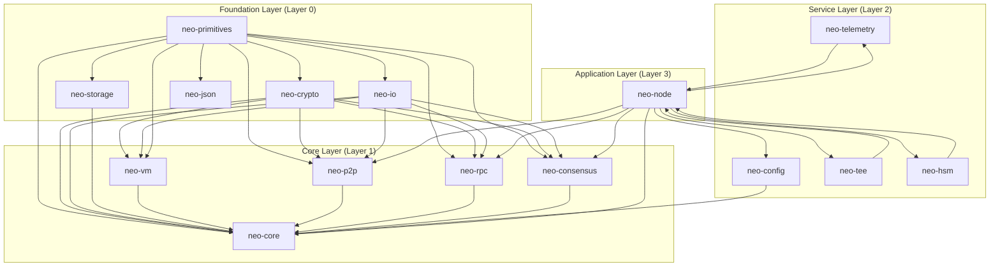
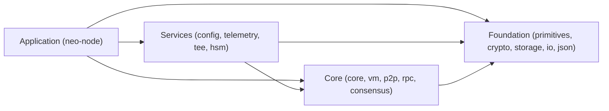
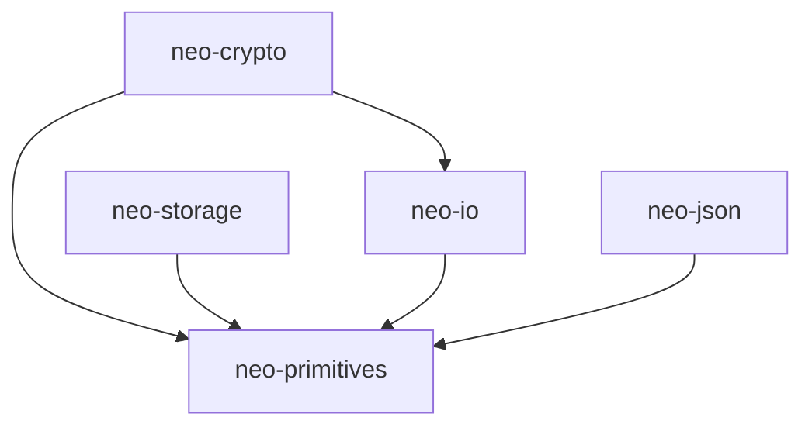
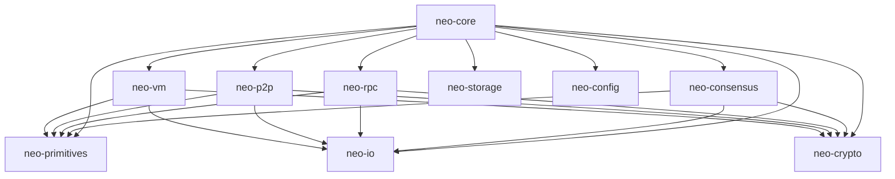
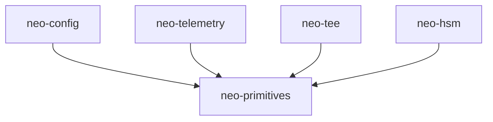
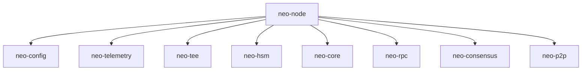
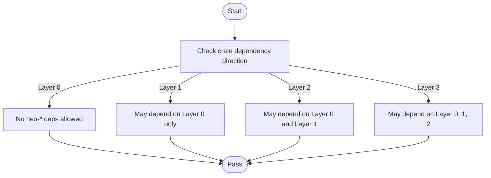

# System Layers

<cite>
**Referenced Files in This Document**
- [Cargo.toml](file://Cargo.toml)
- [README.md](file://README.md)
- [ARCHITECTURE.md](file://ARCHITECTURE.md)
- [neo-primitives/Cargo.toml](file://neo-primitives/Cargo.toml)
- [neo-crypto/Cargo.toml](file://neo-crypto/Cargo.toml)
- [neo-storage/Cargo.toml](file://neo-storage/Cargo.toml)
- [neo-io/Cargo.toml](file://neo-io/Cargo.toml)
- [neo-json/Cargo.toml](file://neo-json/Cargo.toml)
- [neo-vm/Cargo.toml](file://neo-vm/Cargo.toml)
- [neo-core/Cargo.toml](file://neo-core/Cargo.toml)
- [neo-p2p/Cargo.toml](file://neo-p2p/Cargo.toml)
- [neo-rpc/Cargo.toml](file://neo-rpc/Cargo.toml)
- [neo-consensus/Cargo.toml](file://neo-consensus/Cargo.toml)
- [neo-config/Cargo.toml](file://neo-config/Cargo.toml)
- [neo-telemetry/Cargo.toml](file://neo-telemetry/Cargo.toml)
- [neo-tee/Cargo.toml](file://neo-tee/Cargo.toml)
- [neo-hsm/Cargo.toml](file://neo-hsm/Cargo.toml)
- [neo-node/Cargo.toml](file://neo-node/Cargo.toml)
</cite>

## Table of Contents
1. [Introduction](#introduction)
2. [Project Structure](#project-structure)
3. [Core Components](#core-components)
4. [Architecture Overview](#architecture-overview)
5. [Detailed Component Analysis](#detailed-component-analysis)
6. [Dependency Analysis](#dependency-analysis)
7. [Performance Considerations](#performance-considerations)
8. [Troubleshooting Guide](#troubleshooting-guide)
9. [Conclusion](#conclusion)

## Introduction
This document explains the Neo-RS system layers architecture and how the four-layer design enforces strict separation of concerns while enabling a production-grade Neo N3 node. The layers are:
- Foundation Layer (Layer 0): zero-dependency building blocks such as primitives, crypto, storage traits, IO, and JSON.
- Core Layer (Layer 1): blockchain protocol logic including VM, core ledger/contracts, P2P, consensus, and RPC.
- Service Layer (Layer 2): higher-level services like configuration, telemetry, TEE, and HSM that orchestrate and extend core capabilities.
- Application Layer (Layer 3): the user-facing binary neo-node that wires everything together for deployment.

The workspace manifest defines these crates and their intended roles, and the architecture guide codifies dependency rules to prevent upward or circular dependencies.

**Section sources**
- [Cargo.toml:1-68](file://Cargo.toml#L1-L68)
- [ARCHITECTURE.md:30-114](file://ARCHITECTURE.md#L30-L114)

## Project Structure
Neo-RS is organized as a Cargo workspace with clear crate boundaries aligned to architectural layers. The root manifest lists all members grouped by layer and sets default members for common builds. Optional features gate heavier integrations (e.g., RocksDB, TEE/HSM).

**Diagram sources**
- [Cargo.toml:1-68](file://Cargo.toml#L1-L68)
- [neo-primitives/Cargo.toml:16-41](file://neo-primitives/Cargo.toml#L16-L41)
- [neo-crypto/Cargo.toml:16-58](file://neo-crypto/Cargo.toml#L16-L58)
- [neo-storage/Cargo.toml:16-44](file://neo-storage/Cargo.toml#L16-L44)
- [neo-io/Cargo.toml:16-44](file://neo-io/Cargo.toml#L16-L44)
- [neo-json/Cargo.toml:16-28](file://neo-json/Cargo.toml#L16-L28)
- [neo-vm/Cargo.toml:16-31](file://neo-vm/Cargo.toml#L16-L31)
- [neo-core/Cargo.toml:79-95](file://neo-core/Cargo.toml#L79-L95)
- [neo-p2p/Cargo.toml:16-37](file://neo-p2p/Cargo.toml#L16-L37)
- [neo-rpc/Cargo.toml:1-30](file://neo-rpc/Cargo.toml#L1-L30)
- [neo-consensus/Cargo.toml:1-30](file://neo-consensus/Cargo.toml#L1-L30)
- [neo-config/Cargo.toml:1-30](file://neo-config/Cargo.toml#L1-L30)
- [neo-telemetry/Cargo.toml:1-30](file://neo-telemetry/Cargo.toml#L1-L30)
- [neo-tee/Cargo.toml:1-30](file://neo-tee/Cargo.toml#L1-L30)
- [neo-hsm/Cargo.toml:1-30](file://neo-hsm/Cargo.toml#L1-L30)
- [neo-node/Cargo.toml:1-30](file://neo-node/Cargo.toml#L1-L30)

**Section sources**
- [Cargo.toml:1-68](file://Cargo.toml#L1-L68)
- [README.md:93-112](file://README.md#L93-L112)

## Core Components
- Foundation Layer (Layer 0)
  - neo-primitives: Core types (UInt160, UInt256, BigDecimal, Hardfork) with no neo-* dependencies.
  - neo-crypto: Hashing, ECC, signatures, MPT trie; depends on primitives and IO.
  - neo-storage: Storage traits and abstractions (IStore, snapshots, cache) to break cycles and decouple implementations.
  - neo-io: Binary reader/writer, serialization helpers, caching utilities; depends on primitives.
  - neo-json: JSON token/object/array/path matching C# Neo.Json; no neo-* dependencies.

- Core Layer (Layer 1)
  - neo-vm: VM runtime (opcodes, interpreter, stack items, limits); depends on primitives, IO, crypto.
  - neo-core: Protocol implementation (ledger, contracts, wallets, services); depends on VM, P2P, config, primitives, crypto, storage.
  - neo-p2p: Networking messages, handshake, peers; depends on primitives, crypto, IO.
  - neo-rpc: Server/client for JSON-RPC; depends on primitives, crypto, IO.
  - neo-consensus: dBFT consensus service; depends on primitives, crypto, IO.

- Service Layer (Layer 2)
  - neo-config: Configuration parsing and settings (protocol, network, genesis).
  - neo-telemetry: Metrics, health checks, logging integration.
  - neo-tee: Trusted Execution Environment support (feature-gated).
  - neo-hsm: Hardware Security Module support (feature-gated).

- Application Layer (Layer 3)
  - neo-node: User-facing daemon wiring P2P, RPC, consensus, storage, config, telemetry, and optional TEE/HSM.

**Section sources**
- [neo-primitives/Cargo.toml:16-41](file://neo-primitives/Cargo.toml#L16-L41)
- [neo-crypto/Cargo.toml:16-58](file://neo-crypto/Cargo.toml#L16-L58)
- [neo-storage/Cargo.toml:16-44](file://neo-storage/Cargo.toml#L16-L44)
- [neo-io/Cargo.toml:16-44](file://neo-io/Cargo.toml#L16-L44)
- [neo-json/Cargo.toml:16-28](file://neo-json/Cargo.toml#L16-L28)
- [neo-vm/Cargo.toml:16-31](file://neo-vm/Cargo.toml#L16-L31)
- [neo-core/Cargo.toml:79-95](file://neo-core/Cargo.toml#L79-L95)
- [neo-p2p/Cargo.toml:16-37](file://neo-p2p/Cargo.toml#L16-L37)
- [neo-rpc/Cargo.toml:1-30](file://neo-rpc/Cargo.toml#L1-L30)
- [neo-consensus/Cargo.toml:1-30](file://neo-consensus/Cargo.toml#L1-L30)
- [neo-config/Cargo.toml:1-30](file://neo-config/Cargo.toml#L1-L30)
- [neo-telemetry/Cargo.toml:1-30](file://neo-telemetry/Cargo.toml#L1-L30)
- [neo-tee/Cargo.toml:1-30](file://neo-tee/Cargo.toml#L1-L30)
- [neo-hsm/Cargo.toml:1-30](file://neo-hsm/Cargo.toml#L1-L30)
- [neo-node/Cargo.toml:1-30](file://neo-node/Cargo.toml#L1-L30)

## Architecture Overview
Neo-RS enforces a strict layered dependency model:
- Each layer may only depend on lower layers.
- Foundation has no neo-* dependencies.
- Core depends on Foundation.
- Services depend on Core and Foundation.
- Application depends on Services, Core, and Foundation.

**Diagram sources**
- [ARCHITECTURE.md:167-180](file://ARCHITECTURE.md#L167-L180)
- [Cargo.toml:1-68](file://Cargo.toml#L1-L68)

**Section sources**
- [ARCHITECTURE.md:118-180](file://ARCHITECTURE.md#L118-L180)
- [Cargo.toml:1-68](file://Cargo.toml#L1-L68)

## Detailed Component Analysis

### Foundation Layer (Layer 0)
- neo-primitives: Pure type definitions used across the stack; no internal neo-* dependencies.
- neo-crypto: Cryptographic operations built on primitives and IO; includes hashing, ECC, and MPT structures.
- neo-storage: Trait-based storage abstraction to avoid coupling between protocol and persistence.
- neo-io: Serialization and binary I/O primitives; provides caching and compression helpers.
- neo-json: JSON data model compatible with C# Neo.Json.

**Diagram sources**
- [neo-primitives/Cargo.toml:16-41](file://neo-primitives/Cargo.toml#L16-L41)
- [neo-crypto/Cargo.toml:16-58](file://neo-crypto/Cargo.toml#L16-L58)
- [neo-storage/Cargo.toml:16-44](file://neo-storage/Cargo.toml#L16-L44)
- [neo-io/Cargo.toml:16-44](file://neo-io/Cargo.toml#L16-L44)
- [neo-json/Cargo.toml:16-28](file://neo-json/Cargo.toml#L16-L28)

**Section sources**
- [neo-primitives/Cargo.toml:16-41](file://neo-primitives/Cargo.toml#L16-L41)
- [neo-crypto/Cargo.toml:16-58](file://neo-crypto/Cargo.toml#L16-L58)
- [neo-storage/Cargo.toml:16-44](file://neo-storage/Cargo.toml#L16-L44)
- [neo-io/Cargo.toml:16-44](file://neo-io/Cargo.toml#L16-L44)
- [neo-json/Cargo.toml:16-28](file://neo-json/Cargo.toml#L16-L28)

### Core Layer (Layer 1)
- neo-vm: VM runtime depending on primitives, IO, and crypto.
- neo-core: Protocol engine integrating VM, P2P, config, storage, and more.
- neo-p2p: Network message handling and peer management.
- neo-rpc: JSON-RPC server/client for external interfaces.
- neo-consensus: dBFT consensus state machine and messaging.

**Diagram sources**
- [neo-vm/Cargo.toml:16-31](file://neo-vm/Cargo.toml#L16-L31)
- [neo-core/Cargo.toml:79-95](file://neo-core/Cargo.toml#L79-L95)
- [neo-p2p/Cargo.toml:16-37](file://neo-p2p/Cargo.toml#L16-L37)
- [neo-rpc/Cargo.toml:1-30](file://neo-rpc/Cargo.toml#L1-L30)
- [neo-consensus/Cargo.toml:1-30](file://neo-consensus/Cargo.toml#L1-L30)

**Section sources**
- [neo-vm/Cargo.toml:16-31](file://neo-vm/Cargo.toml#L16-L31)
- [neo-core/Cargo.toml:79-95](file://neo-core/Cargo.toml#L79-L95)
- [neo-p2p/Cargo.toml:16-37](file://neo-p2p/Cargo.toml#L16-L37)
- [neo-rpc/Cargo.toml:1-30](file://neo-rpc/Cargo.toml#L1-L30)
- [neo-consensus/Cargo.toml:1-30](file://neo-consensus/Cargo.toml#L1-L30)

### Service Layer (Layer 2)
- neo-config: Parses TOML/JSON settings and exposes protocol/network parameters.
- neo-telemetry: Centralized metrics, health endpoints, and logging hooks.
- neo-tee: Optional enclave client for secure operations (feature-gated).
- neo-hsm: Optional hardware-backed signing (feature-gated).

**Diagram sources**
- [neo-config/Cargo.toml:1-30](file://neo-config/Cargo.toml#L1-L30)
- [neo-telemetry/Cargo.toml:1-30](file://neo-telemetry/Cargo.toml#L1-L30)
- [neo-tee/Cargo.toml:1-30](file://neo-tee/Cargo.toml#L1-L30)
- [neo-hsm/Cargo.toml:1-30](file://neo-hsm/Cargo.toml#L1-L30)

**Section sources**
- [neo-config/Cargo.toml:1-30](file://neo-config/Cargo.toml#L1-L30)
- [neo-telemetry/Cargo.toml:1-30](file://neo-telemetry/Cargo.toml#L1-L30)
- [neo-tee/Cargo.toml:1-30](file://neo-tee/Cargo.toml#L1-L30)
- [neo-hsm/Cargo.toml:1-30](file://neo-hsm/Cargo.toml#L1-L30)

### Application Layer (Layer 3)
- neo-node: Wires configuration, P2P, RPC, consensus, storage, telemetry, and optional TEE/HSM into a runnable daemon. It is the entry point for users and operators.

**Diagram sources**
- [neo-node/Cargo.toml:1-30](file://neo-node/Cargo.toml#L1-L30)
- [neo-core/Cargo.toml:79-95](file://neo-core/Cargo.toml#L79-L95)
- [neo-rpc/Cargo.toml:1-30](file://neo-rpc/Cargo.toml#L1-L30)
- [neo-consensus/Cargo.toml:1-30](file://neo-consensus/Cargo.toml#L1-L30)
- [neo-p2p/Cargo.toml:16-37](file://neo-p2p/Cargo.toml#L16-L37)
- [neo-config/Cargo.toml:1-30](file://neo-config/Cargo.toml#L1-L30)
- [neo-telemetry/Cargo.toml:1-30](file://neo-telemetry/Cargo.toml#L1-L30)
- [neo-tee/Cargo.toml:1-30](file://neo-tee/Cargo.toml#L1-L30)
- [neo-hsm/Cargo.toml:1-30](file://neo-hsm/Cargo.toml#L1-L30)

**Section sources**
- [neo-node/Cargo.toml:1-30](file://neo-node/Cargo.toml#L1-L30)

## Dependency Analysis
Dependency rules ensure maintainability and testability:
- Allowed: Layer N depends on Layer N-1 and below.
- Forbidden: Upward dependencies, cross-layer jumps, and cycles.
- Workspace manifest groups crates by layer and declares defaults.

**Diagram sources**
- [ARCHITECTURE.md:167-180](file://ARCHITECTURE.md#L167-L180)
- [Cargo.toml:1-68](file://Cargo.toml#L1-L68)

**Section sources**
- [ARCHITECTURE.md:167-221](file://ARCHITECTURE.md#L167-L221)
- [Cargo.toml:1-68](file://Cargo.toml#L1-L68)

## Performance Considerations
- Build profiles: Release and production profiles enable optimizations (LTO, codegen units, stripping).
- Feature gating: Heavy features (RocksDB, monitoring, oracle, TEE/HSM) are opt-in to keep minimal builds lean.
- Concurrency: Async runtime and parallel processing features are available where needed.
- Storage: Production uses RocksDB via feature flags; memory storage is suitable for development/testing.

[No sources needed since this section provides general guidance]

## Troubleshooting Guide
- Configuration validation: Use CLI flags to validate configuration without starting the node.
- Storage checks: Validate storage accessibility before running.
- Health and metrics: Expose health endpoints and scrape metrics when enabled.
- Feature requirements: Ensure required features (e.g., full/RocksDB) are enabled for production configs.

**Section sources**
- [README.md:213-246](file://README.md#L213-L246)
- [README.md:260-276](file://README.md#L260-L276)
- [README.md:388-397](file://README.md#L388-L397)

## Conclusion
Neo-RS implements a clean, enforceable four-layer architecture:
- Foundation provides stable, zero-dependency primitives.
- Core encapsulates protocol logic using those primitives.
- Services add configuration, observability, and secure backends.
- Application delivers a deployable node binary.

This structure enables modularity, safety, compatibility, performance, and maintainability across the entire stack.

[No sources needed since this section summarizes without analyzing specific files]