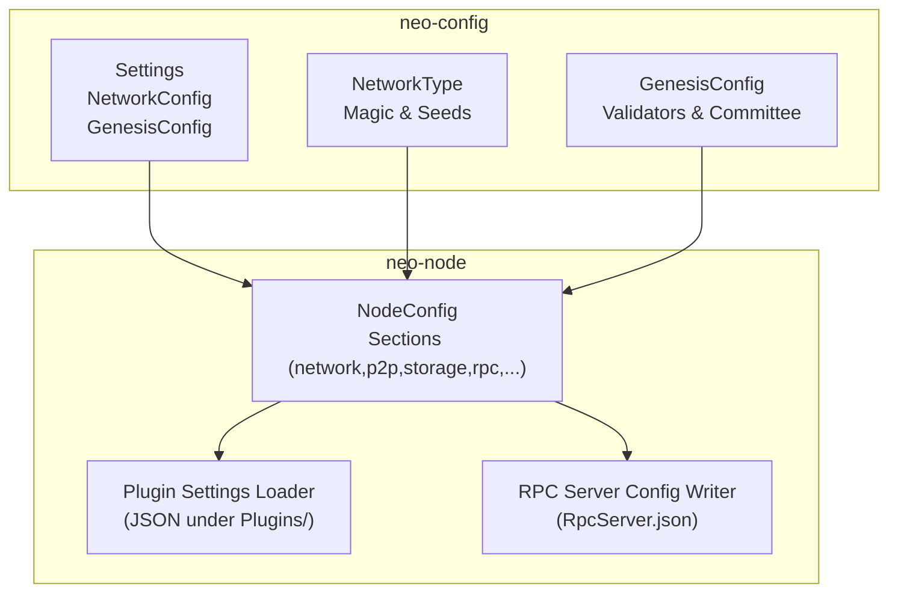
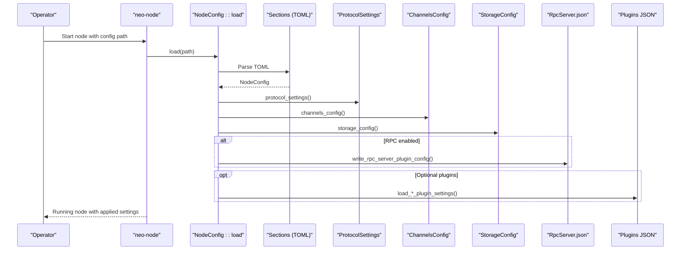
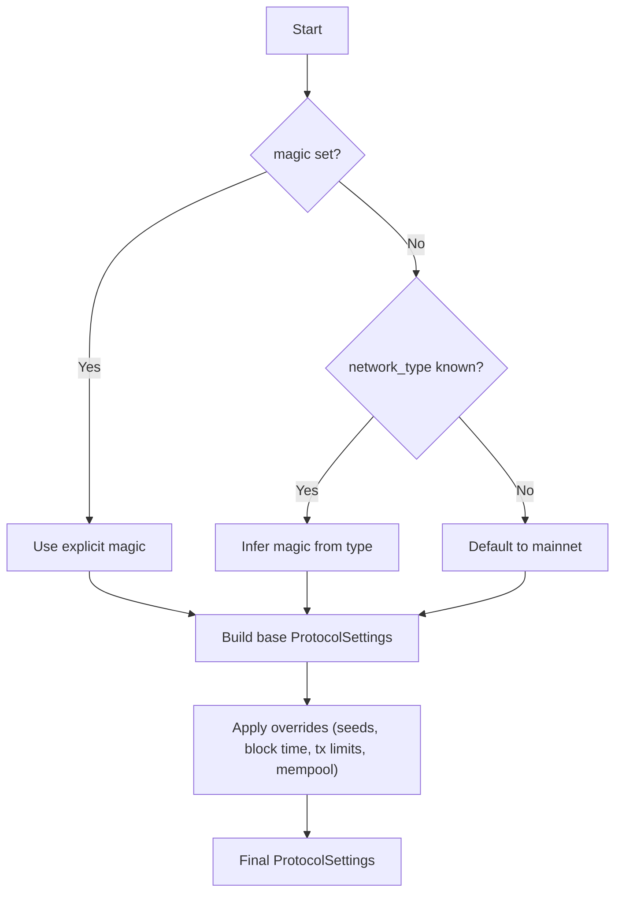
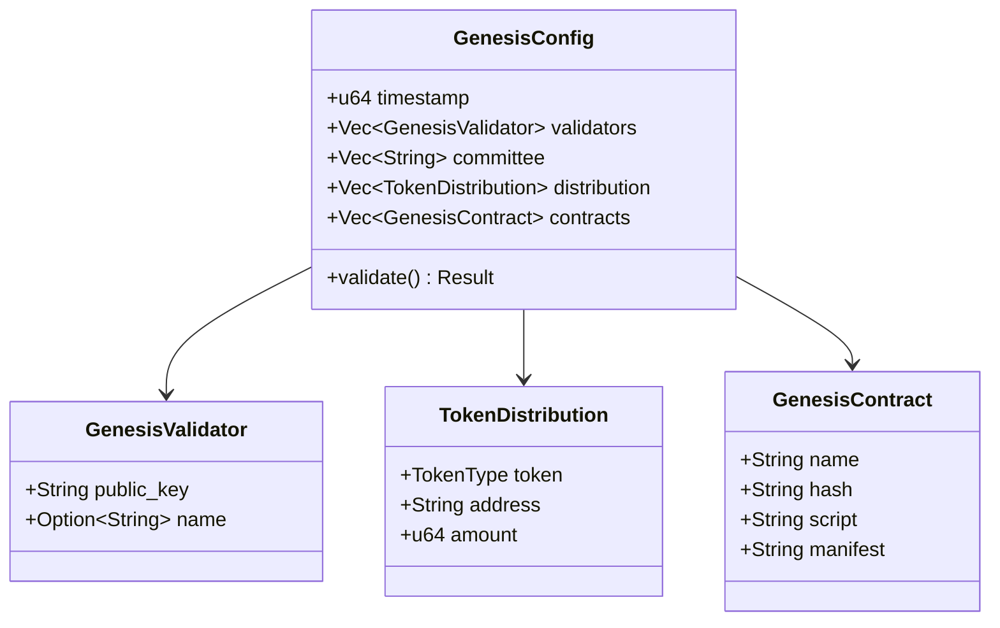
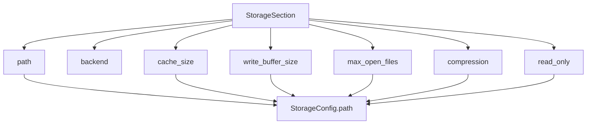
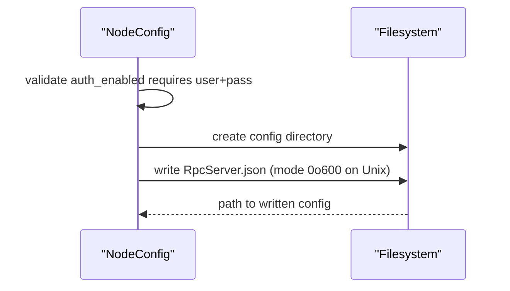
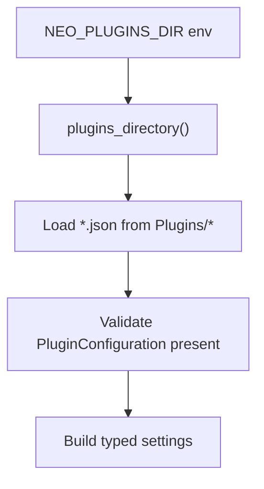
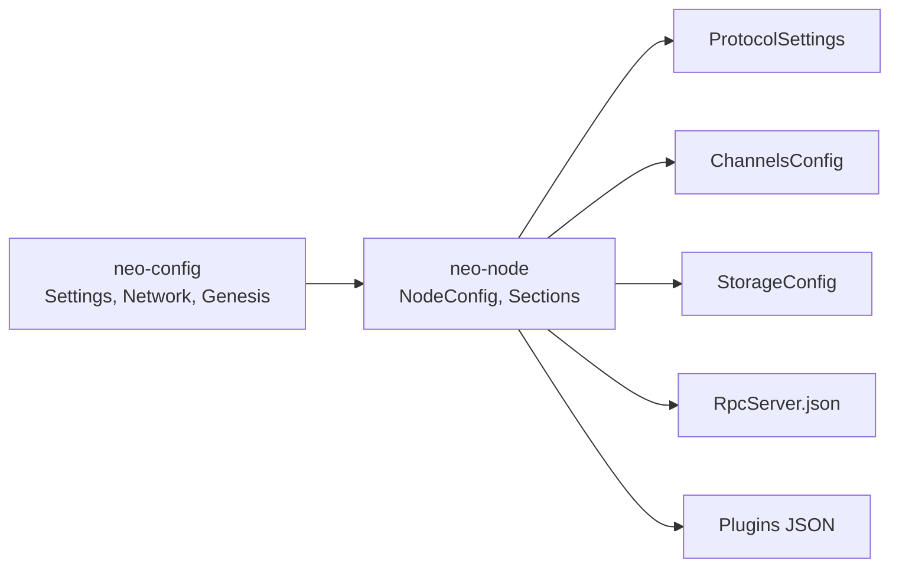

# Configuration Management

<cite>
**Referenced Files in This Document**
- [settings.rs](file://neo-config/src/settings.rs)
- [network.rs](file://neo-config/src/network.rs)
- [genesis.rs](file://neo-config/src/genesis.rs)
- [lib.rs](file://neo-config/src/lib.rs)
- [error.rs](file://neo-config/src/error.rs)
- [sections.rs](file://neo-node/src/config/sections.rs)
- [node_config.rs](file://neo-node/src/config/node_config.rs)
- [plugin_settings.rs](file://neo-node/src/config/plugin_settings.rs)
- [mainnet.toml](file://config/mainnet.toml)
- [testnet.toml](file://config/testnet.toml)
- [local.toml](file://config/local.toml)
- [mainnet-full-validation.toml](file://config/mainnet-full-validation.toml)
- [env_flags.rs](file://neo-core/src/smart_contract/env_flags.rs)
</cite>

## Table of Contents
1. [Introduction](#introduction)
2. [Project Structure](#project-structure)
3. [Core Components](#core-components)
4. [Architecture Overview](#architecture-overview)
5. [Detailed Component Analysis](#detailed-component-analysis)
6. [Dependency Analysis](#dependency-analysis)
7. [Performance Considerations](#performance-considerations)
8. [Troubleshooting Guide](#troubleshooting-guide)
9. [Conclusion](#conclusion)
10. [Appendices](#appendices)

## Introduction
This document explains how Neo-RS node configuration works for production deployments. It covers the TOML configuration file format, environment variable overrides and precedence, network-specific settings (mainnet, testnet, private), runtime configuration changes and hot-reload capabilities, validation tools, best practices, secure setup guidance, sensitive data handling, and templating strategies across environments.

## Project Structure
Neo-RS separates configuration into two complementary layers:
- Shared configuration model (neo-config crate): defines typed settings, network presets, genesis parameters, protocol settings, and validation.
- Node-level configuration loader (neo-node crate): parses the CLI-compatible TOML schema used by deployed nodes, maps it to runtime subsystems (P2P, storage, RPC, consensus, plugins), and writes plugin JSON configs where needed.

**Diagram sources**
- [settings.rs:10-47](file://neo-config/src/settings.rs#L10-L47)
- [network.rs:86-158](file://neo-config/src/network.rs#L86-L158)
- [genesis.rs:7-24](file://neo-config/src/genesis.rs#L7-L24)
- [sections.rs:10-33](file://neo-node/src/config/sections.rs#L10-L33)
- [node_config.rs:35-101](file://neo-node/src/config/node_config.rs#L35-L101)
- [plugin_settings.rs:16-67](file://neo-node/src/config/plugin_settings.rs#L16-L67)

**Section sources**
- [settings.rs:10-47](file://neo-config/src/settings.rs#L10-L47)
- [sections.rs:10-33](file://neo-node/src/config/sections.rs#L10-L33)

## Core Components
- Settings (neo-config): Centralized typed settings with defaults per network, TOML load/save, and validation. Includes node identity, network, protocol, genesis, storage, RPC, consensus, logging, telemetry.
- NetworkConfig and NetworkType: Defines magic numbers, address versions, seed nodes, peer limits, timeouts; supports overriding via explicit values.
- GenesisConfig: Provides mainnet/testnet/private genesis templates including validators, committee, distribution, and contracts.
- NodeConfig sections (neo-node): The TOML schema used at runtime, mapping to P2P, storage, blockchain, RPC, application logs, state service, tokens tracker, oracle service, dBFT, logging, unlock wallet, contracts, plugins, consensus, telemetry, mempool.
- Plugin settings loader: Reads plugin JSON files from a configurable directory (default data/Plugins) and builds strongly-typed settings for each plugin.

Key behaviors:
- Defaults are provided per network type (mainnet/testnet/private).
- TOML parsing is strict (unknown fields denied) to catch misconfiguration early.
- Validation enforces required fields and value constraints.

**Section sources**
- [settings.rs:10-47](file://neo-config/src/settings.rs#L10-L47)
- [settings.rs:342-394](file://neo-config/src/settings.rs#L342-L394)
- [settings.rs:426-453](file://neo-config/src/settings.rs#L426-L453)
- [network.rs:86-158](file://neo-config/src/network.rs#L86-L158)
- [genesis.rs:82-254](file://neo-config/src/genesis.rs#L82-L254)
- [sections.rs:10-33](file://neo-node/src/config/sections.rs#L10-L33)

## Architecture Overview
Configuration flows from TOML files into typed structures, then into subsystems and plugin configurations.

**Diagram sources**
- [node_config.rs:35-101](file://neo-node/src/config/node_config.rs#L35-L101)
- [node_config.rs:103-171](file://neo-node/src/config/node_config.rs#L103-L171)
- [node_config.rs:266-337](file://neo-node/src/config/node_config.rs#L266-L337)
- [plugin_settings.rs:268-374](file://neo-node/src/config/plugin_settings.rs#L268-L374)

## Detailed Component Analysis

### TOML Configuration Schema (neo-node)
The node reads a TOML file that contains these top-level sections:
- network: network_type, network_magic
- p2p: listen_port, min_desired_connections, max_connections, max_connections_per_address, max_known_hashes, broadcast_history_limit, enable_compression, seed_nodes
- storage: path, backend, cache_size, compression, write_buffer_size, max_open_files, read_only
- blockchain: block_time, max_transactions_per_block, max_free_transactions_per_block
- rpc: enabled, bind_address, port, cors_enabled, allow_origins, max_connections, max_request_body_size, max_gas_invoke, max_fee, max_iterator_result_items, max_stack_size, keep_alive_timeout, request_headers_timeout, auth_enabled, session_enabled, session_expiration_time, find_storage_page_size, unhandled_exception_policy, rpc_user, rpc_pass, tls_cert_file, tls_cert_password, trusted_authorities, disabled_methods
- application_logs: enabled, path, network, max_stack_size, debug, unhandled_exception_policy
- state_service: enabled, path, full_state, network, auto_verify, max_find_result_items, unhandled_exception_policy
- tokens_tracker: enabled, db_path, track_history, max_results, network, enabled_trackers, unhandled_exception_policy
- oracle_service: enabled, network, nodes, max_task_timeout, max_oracle_timeout, allow_private_host, allowed_content_types, https.timeout, neofs.*, auto_start, unhandled_exception_policy
- dbft: enabled, recovery_logs, ignore_recovery_logs, auto_start, network, max_block_size, max_block_system_fee, unhandled_exception_policy
- logging: active, level, format, console_output, file_enabled, file_path, max_file_size, max_files
- unlock_wallet: path, password, is_active
- contracts: neo_name_service
- plugins: download_url, prerelease, version
- consensus: enabled, auto_start
- telemetry: metrics.enabled, metrics.port, metrics.bind_address
- mempool: max_transactions, max_transactions_per_sender

Notes:
- Many fields support aliases for compatibility with legacy names.
- Unknown fields are rejected to prevent silent misconfiguration.

Examples in repository:
- Mainnet, testnet, local development, and full validation profiles demonstrate realistic combinations.

**Section sources**
- [sections.rs:35-400](file://neo-node/src/config/sections.rs#L35-L400)
- [mainnet.toml:1-68](file://config/mainnet.toml#L1-L68)
- [testnet.toml:1-50](file://config/testnet.toml#L1-L50)
- [local.toml:1-53](file://config/local.toml#L1-L53)
- [mainnet-full-validation.toml:1-73](file://config/mainnet-full-validation.toml#L1-L73)

### Network Presets and Overrides
- NetworkType provides built-in magic numbers, address versions, and seed lists for mainnet, testnet, and private networks.
- NetworkConfig allows overriding magic and address_version explicitly.
- NodeConfig.protocol_settings selects base ProtocolSettings based on magic or network_type, then applies overrides such as seed list, milliseconds per block, max transactions per block, and mempool size.

**Diagram sources**
- [node_config.rs:45-101](file://neo-node/src/config/node_config.rs#L45-L101)
- [network.rs:18-60](file://neo-config/src/network.rs#L18-L60)
- [network.rs:131-158](file://neo-config/src/network.rs#L131-L158)

**Section sources**
- [network.rs:86-158](file://neo-config/src/network.rs#L86-L158)
- [node_config.rs:45-101](file://neo-node/src/config/node_config.rs#L45-L101)

### Genesis Configuration
- GenesisConfig includes timestamp, validators, committee, token distribution, and initial contracts.
- Predefined templates exist for mainnet and testnet; private networks can be created with a single validator.
- Validation ensures at least one validator and correct public key lengths.

**Diagram sources**
- [genesis.rs:7-74](file://neo-config/src/genesis.rs#L7-L74)
- [genesis.rs:256-274](file://neo-config/src/genesis.rs#L256-L274)

**Section sources**
- [genesis.rs:82-254](file://neo-config/src/genesis.rs#L82-L254)
- [genesis.rs:256-274](file://neo-config/src/genesis.rs#L256-L274)

### Storage Configuration
- StorageSection controls backend selection, data path, cache sizes, compression algorithm, open files limit, and read-only mode.
- Compression supports none, lz4, zstd.
- Path resolution for plugins uses a configurable plugins directory (NEO_PLUGINS_DIR) and network-aware paths.

**Diagram sources**
- [sections.rs:65-82](file://neo-node/src/config/sections.rs#L65-L82)
- [node_config.rs:147-171](file://neo-node/src/config/node_config.rs#L147-L171)

**Section sources**
- [sections.rs:65-82](file://neo-node/src/config/sections.rs#L65-L82)
- [node_config.rs:147-171](file://neo-node/src/config/node_config.rs#L147-L171)

### RPC Configuration
- RpcSection enables/disables RPC server, sets bind address/port, CORS, authentication, rate limits, stack size, timeouts, sessions, page sizes, TLS, trusted authorities, and method disabling.
- When enabled, the node writes RpcServer.json under the configured plugins directory with restrictive permissions on Unix.

**Diagram sources**
- [node_config.rs:266-337](file://neo-node/src/config/node_config.rs#L266-L337)
- [sections.rs:95-146](file://neo-node/src/config/sections.rs#L95-L146)

**Section sources**
- [node_config.rs:266-337](file://neo-node/src/config/node_config.rs#L266-L337)
- [sections.rs:95-146](file://neo-node/src/config/sections.rs#L95-L146)

### Consensus (dBFT) Configuration
- DbftSection controls recovery logs, ignoring recovery logs, auto-start, network override, block size/fee limits, and exception policy.
- NodeConfig.dbft_settings merges section values with defaults and validates inputs.

**Section sources**
- [sections.rs:258-288](file://neo-node/src/config/sections.rs#L258-L288)
- [plugin_settings.rs:478-521](file://neo-node/src/config/plugin_settings.rs#L478-L521)
- [node_config.rs:248-264](file://neo-node/src/config/node_config.rs#L248-L264)

### Logging Configuration
- LoggingSection toggles active logging, level, format, console/file outputs, file path, rotation size, and file count.
- Defaults ensure basic logging is available without extra configuration.

**Section sources**
- [sections.rs:290-320](file://neo-node/src/config/sections.rs#L290-L320)

### Telemetry Configuration
- TelemetrySection exposes metrics enablement, port, and bind address.
- Example profiles show enabling metrics for monitoring.

**Section sources**
- [sections.rs:371-389](file://neo-node/src/config/sections.rs#L371-L389)
- [mainnet.toml:40-44](file://config/mainnet.toml#L40-L44)
- [local.toml:34-38](file://config/local.toml#L34-L38)

### Mempool Configuration
- MempoolSection allows setting maximum transactions and per-sender limits.
- Runtime application applies per-sender limits to the mempool during startup.

**Section sources**
- [sections.rs:391-400](file://neo-node/src/config/sections.rs#L391-L400)
- [node_config.rs:94-98](file://neo-node/src/config/node_config.rs#L94-L98)
- [services.rs:36-53](file://neo-node/src/startup/services.rs#L36-L53)

### Plugin Configuration Loading
- Plugin settings are loaded from JSON files under a plugins directory (default data/Plugins), overridable via NEO_PLUGINS_DIR.
- Each plugin has a dedicated JSON file (e.g., ApplicationLogs.json, StateService.json, TokensTracker.json, OracleService.json, DBFTPlugin.json).
- Paths can include network placeholders replaced at runtime.

**Diagram sources**
- [plugin_settings.rs:16-67](file://neo-node/src/config/plugin_settings.rs#L16-L67)
- [plugin_settings.rs:169-189](file://neo-node/src/config/plugin_settings.rs#L169-L189)
- [plugin_settings.rs:376-405](file://neo-node/src/config/plugin_settings.rs#L376-L405)

**Section sources**
- [plugin_settings.rs:16-67](file://neo-node/src/config/plugin_settings.rs#L16-L67)
- [plugin_settings.rs:169-189](file://neo-node/src/config/plugin_settings.rs#L169-L189)
- [plugin_settings.rs:268-374](file://neo-node/src/config/plugin_settings.rs#L268-L374)
- [plugin_settings.rs:376-405](file://neo-node/src/config/plugin_settings.rs#L376-L405)

## Dependency Analysis
- neo-config provides reusable types and defaults for networks and genesis.
- neo-node consumes those types and adds TOML parsing, section mapping, and plugin integration.
- Runtime services depend on derived settings (ProtocolSettings, ChannelsConfig, StorageConfig) produced from NodeConfig.

**Diagram sources**
- [lib.rs:23-39](file://neo-config/src/lib.rs#L23-L39)
- [sections.rs:10-33](file://neo-node/src/config/sections.rs#L10-L33)
- [node_config.rs:35-171](file://neo-node/src/config/node_config.rs#L35-L171)

**Section sources**
- [lib.rs:23-39](file://neo-config/src/lib.rs#L23-L39)
- [sections.rs:10-33](file://neo-node/src/config/sections.rs#L10-L33)
- [node_config.rs:35-171](file://neo-node/src/config/node_config.rs#L35-L171)

## Performance Considerations
- P2P: Tune max/min connections, broadcast history limit, and compression based on bandwidth and CPU capacity.
- Storage: Adjust RocksDB cache size, write buffer size, and compression algorithm to balance throughput vs. disk usage.
- RPC: Limit concurrent connections, body size, and iterator results to protect resources; consider enabling sessions only when necessary.
- Mempool: Set per-sender limits to mitigate spam and resource exhaustion.
- Logging: Use appropriate log levels and rotation policies to avoid excessive disk I/O.

[No sources needed since this section provides general guidance]

## Troubleshooting Guide
Common issues and diagnostics:
- TOML parse errors: Check for unknown fields or invalid values; the schema denies unknown fields to catch mistakes early.
- Missing required fields: For example, enabling consensus requires a wallet path; enabling RPC auth requires both user and pass.
- Invalid URLs: OracleService.Nodes must be valid absolute URIs; validation will fail otherwise.
- File permissions: On Unix, RpcServer.json is written with restrictive permissions; ensure the process can write to the plugins directory.

Validation utilities:
- Settings::validate enforces constraints like non-zero ports and presence of required fields.
- GenesisConfig::validate checks validator requirements and key formats.
- Oracle node URL validation ensures correctness before starting the oracle service.

Error types:
- ConfigError enumerates common failures (file not found, parse errors, invalid values, missing fields, genesis errors, protocol errors, validation errors).

**Section sources**
- [settings.rs:426-453](file://neo-config/src/settings.rs#L426-L453)
- [genesis.rs:256-274](file://neo-config/src/genesis.rs#L256-L274)
- [plugin_settings.rs:600-628](file://neo-node/src/config/plugin_settings.rs#L600-L628)
- [error.rs:1-51](file://neo-config/src/error.rs#L1-L51)
- [node_config.rs:266-337](file://neo-node/src/config/node_config.rs#L266-L337)

## Conclusion
Neo-RS provides a robust, typed configuration system with clear separation between shared presets and node-level TOML schemas. It supports multiple networks, strong validation, secure defaults, and flexible plugin integration. By following the documented sections and best practices, operators can deploy secure, performant, and maintainable nodes across mainnet, testnet, and private environments.

[No sources needed since this section summarizes without analyzing specific files]

## Appendices

### Environment Variables and Precedence
- NEO_PLUGINS_DIR: Overrides the default plugins directory used to locate plugin JSON files. If unset, defaults to data/Plugins.
- Boolean flags in core runtime use a helper that interprets environment variables as truthy/falsy; this pattern indicates environment-driven feature toggles elsewhere in the codebase.

Precedence:
- TOML sections define primary configuration.
- Environment variables can influence runtime behavior (e.g., plugins directory).
- Where applicable, explicit overrides in TOML take effect after base presets are selected.

**Section sources**
- [plugin_settings.rs:16-25](file://neo-node/src/config/plugin_settings.rs#L16-L25)
- [env_flags.rs:1-32](file://neo-core/src/smart_contract/env_flags.rs#L1-L32)

### Secure Configuration Setup
- Enable RPC authentication and restrict bind addresses to localhost or internal networks.
- Disable unnecessary methods (e.g., openwallet) in production.
- Use TLS certificates for RPC if exposing externally.
- Keep secrets out of TOML; prefer external secret management and inject via environment or secure vaults where supported.
- Restrict file permissions on generated plugin configs (enforced on Unix).

**Section sources**
- [sections.rs:95-146](file://neo-node/src/config/sections.rs#L95-L146)
- [node_config.rs:266-337](file://neo-node/src/config/node_config.rs#L266-L337)

### Templating Strategies
- Use network placeholders in plugin paths (e.g., Data_MPT_{0}) to isolate data per network instance.
- Maintain separate TOML profiles per environment (mainnet, testnet, local, validation) and compose them with environment-specific overrides.
- Leverage NEO_PLUGINS_DIR to switch plugin directories per deployment target.

**Section sources**
- [plugin_settings.rs:376-405](file://neo-node/src/config/plugin_settings.rs#L376-L405)
- [mainnet.toml:1-68](file://config/mainnet.toml#L1-L68)
- [testnet.toml:1-50](file://config/testnet.toml#L1-L50)
- [local.toml:1-53](file://config/local.toml#L1-L53)
- [mainnet-full-validation.toml:1-73](file://config/mainnet-full-validation.toml#L1-L73)

### Hot-Reload and Runtime Changes
- Some subsystems apply runtime limits (e.g., mempool per-sender limits) during startup; further hot-reload capability depends on subsystem implementations.
- Ensure any runtime changes are validated and logged appropriately.

**Section sources**
- [node_config.rs:94-98](file://neo-node/src/config/node_config.rs#L94-L98)
- [services.rs:36-53](file://neo-node/src/startup/services.rs#L36-L53)