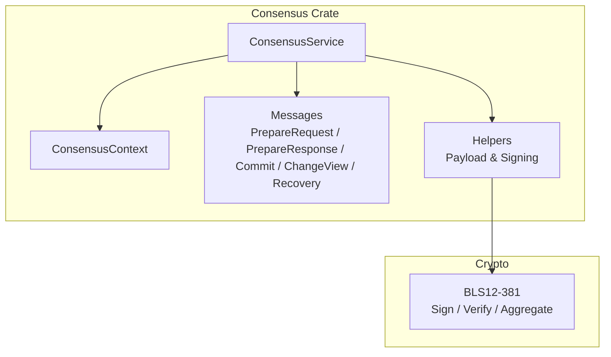
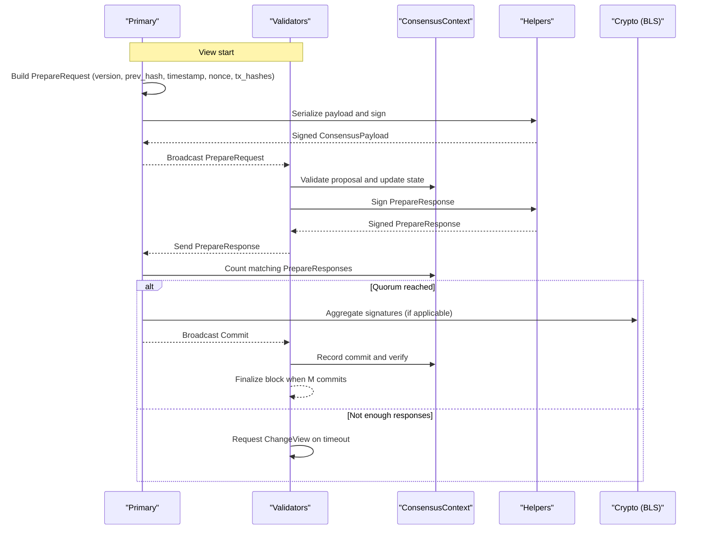
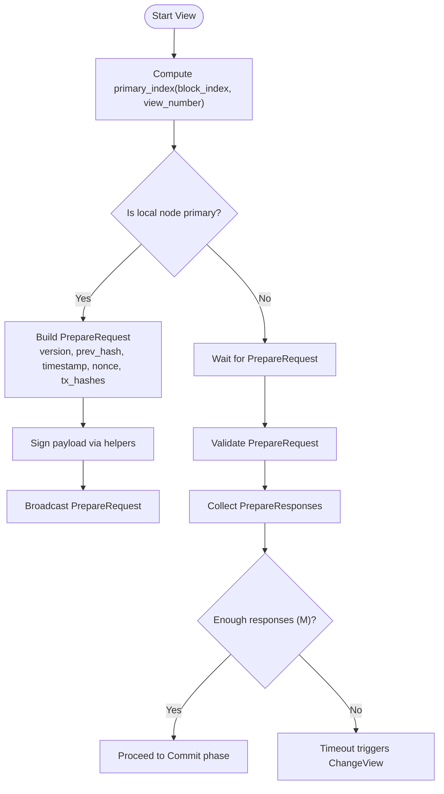
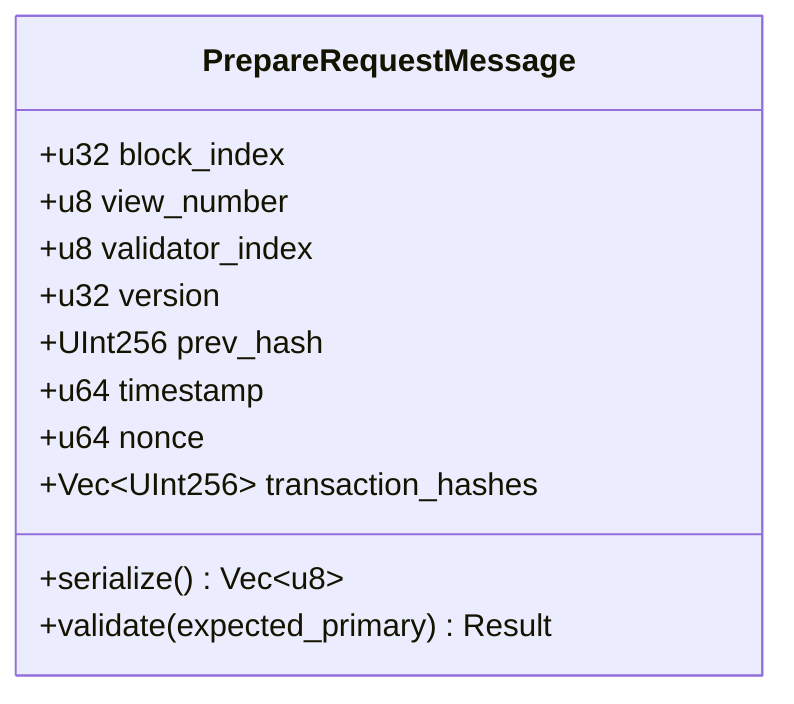
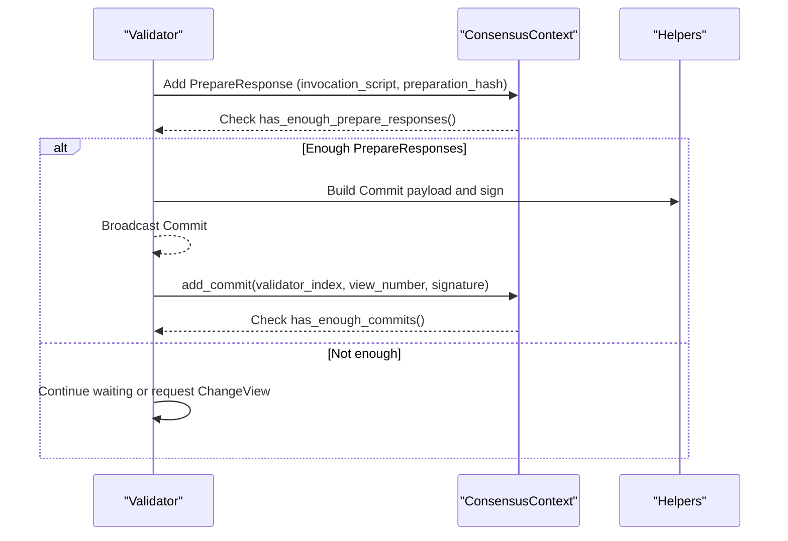
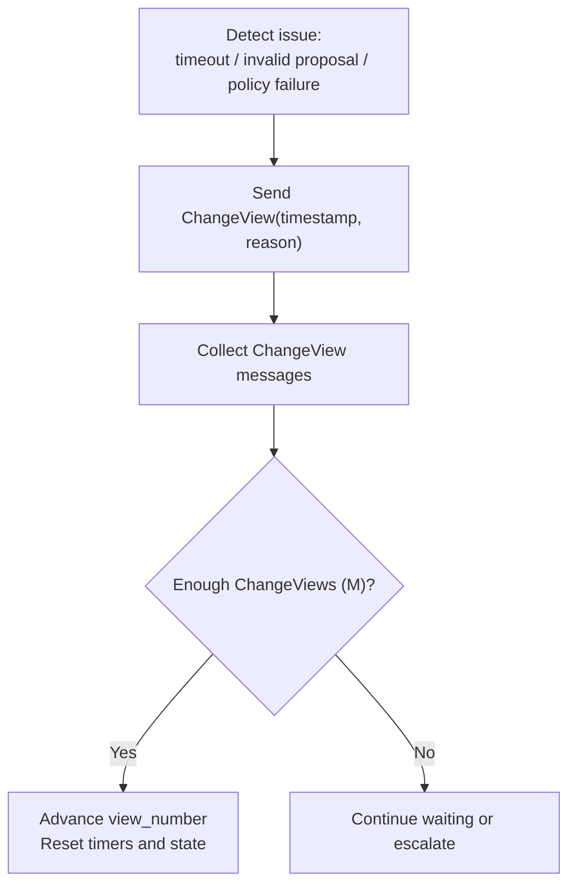
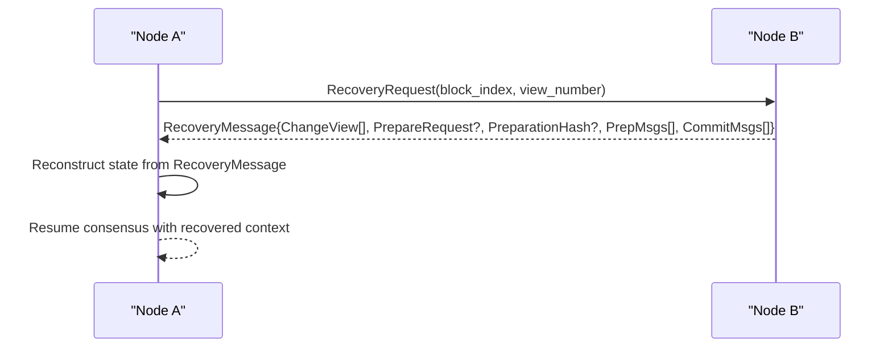
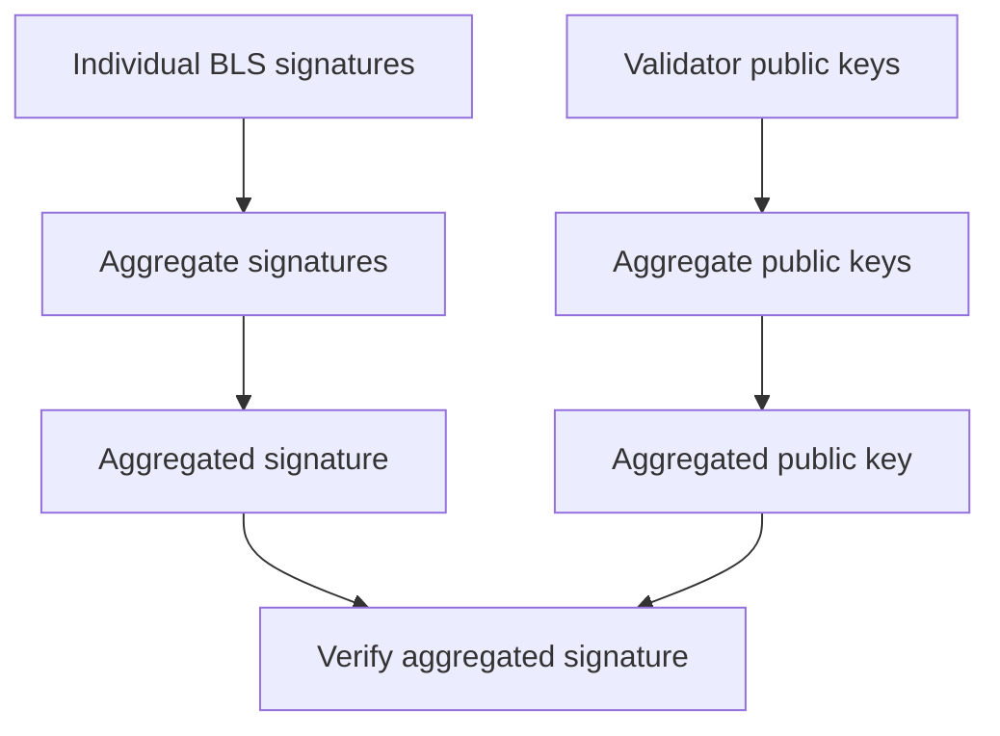
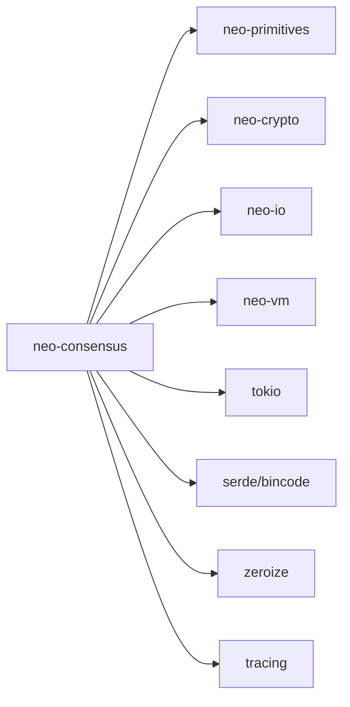

# Consensus (dBFT)

<cite>
**Referenced Files in This Document**
- [lib.rs](file://neo-consensus/src/lib.rs)
- [message_type.rs](file://neo-consensus/src/message_type.rs)
- [messages/mod.rs](file://neo-consensus/src/messages/mod.rs)
- [prepare_request.rs](file://neo-consensus/src/messages/prepare_request.rs)
- [commit.rs](file://neo-consensus/src/messages/commit.rs)
- [change_view.rs](file://neo-consensus/src/messages/change_view.rs)
- [recovery.rs](file://neo-consensus/src/messages/recovery.rs)
- [context/mod.rs](file://neo-consensus/src/context/mod.rs)
- [service/core.rs](file://neo-consensus/src/service/core.rs)
- [service/handlers.rs](file://neo-consensus/src/service/handlers.rs)
- [service/helpers/dbft.rs](file://neo-consensus/src/service/helpers/dbft.rs)
- [bls12381.rs](file://neo-crypto/src/bls12381.rs)
</cite>

## Table of Contents
1. Introduction
2. Project Structure
3. Core Components
4. Architecture Overview
5. Detailed Component Analysis
6. Dependency Analysis
7. Performance Considerations
8. Troubleshooting Guide
9. Conclusion
10. Appendices

## Introduction
This document explains the Delegated Byzantine Fault Tolerance (dBFT) consensus implementation in Neo-RS. It covers the algorithm mechanics, message types, view change process, signature aggregation and verification, fault tolerance guarantees, validator operations, network requirements, monitoring approaches, and integration with the blockchain layer for block finalization and state updates.

## Project Structure
The dBFT implementation is implemented as a dedicated crate that provides:
- A main service orchestrating the dBFT 2.0 state machine
- A context tracking view, validators, signatures, and proposal data
- Message definitions for PrepareRequest, PrepareResponse, Commit, ChangeView, RecoveryRequest, and RecoveryMessage
- Helpers for signing and payload construction
- Cryptographic primitives for BLS signature aggregation and verification

**Diagram sources**
- [service/core.rs:8-25](file://neo-consensus/src/service/core.rs#L8-L25)
- [context/mod.rs:111-191](file://neo-consensus/src/context/mod.rs#L111-L191)
- [messages/mod.rs:20-58](file://neo-consensus/src/messages/mod.rs#L20-L58)
- [bls12381.rs:99-199](file://neo-crypto/src/bls12381.rs#L99-L199)

**Section sources**
- [lib.rs:6-110](file://neo-consensus/src/lib.rs#L6-L110)
- [service/core.rs:8-25](file://neo-consensus/src/service/core.rs#L8-L25)
- [messages/mod.rs:20-58](file://neo-consensus/src/messages/mod.rs#L20-L58)

## Core Components
- ConsensusService: The main state machine implementing dBFT 2.0. It holds the current context, network identity, private key material, optional external signer, event channel, and recovery mode flags.
- ConsensusContext: Tracks per-round state including view number, validator set, proposal fields, collected signatures, timers, and replay protection caches. It also computes thresholds (f and m), primary index, timeouts, and safety checks.
- Messages: Typed payloads for each dBFT phase, with serialization/deserialization and validation logic aligned to Neo N3 DBFTPlugin wire format.
- Helpers: Utilities to build dBFT extensible payload bytes and compute signing inputs.
- Crypto: BLS12-381 support for signature aggregation and verification used by consensus.

Key responsibilities:
- Primary rotation: Deterministic selection based on block index and view number.
- Proposal generation: Primary builds PrepareRequest with version, prev hash, timestamp, nonce, and transaction hashes.
- Vote collection: Validators validate proposals, collect PrepareResponses, and proceed to Commit when quorum is reached.
- View change: Validators request new views upon timeout or invalidity; new primary takes over.
- Recovery: Nodes exchange ChangeView and Recovery messages to resynchronize state when needed.

**Section sources**
- [service/core.rs:8-66](file://neo-consensus/src/service/core.rs#L8-L66)
- [context/mod.rs:111-191](file://neo-consensus/src/context/mod.rs#L111-L191)
- [messages/mod.rs:20-58](file://neo-consensus/src/messages/mod.rs#L20-L58)
- [service/helpers/dbft.rs:6-39](file://neo-consensus/src/service/helpers/dbft.rs#L6-L39)
- [bls12381.rs:99-199](file://neo-crypto/src/bls12381.rs#L99-L199)

## Architecture Overview
The dBFT flow proceeds in views. Each view has a designated primary and multiple validators. The primary proposes a block; validators validate and respond; once enough responses are collected, commits are exchanged to finalize the block. If progress stalls, validators trigger view changes.

**Diagram sources**
- [messages/prepare_request.rs:8-27](file://neo-consensus/src/messages/prepare_request.rs#L8-L27)
- [messages/prepare_request.rs:61-83](file://neo-consensus/src/messages/prepare_request.rs#L61-L83)
- [messages/commit.rs:6-18](file://neo-consensus/src/messages/commit.rs#L6-L18)
- [messages/change_view.rs:6-19](file://neo-consensus/src/messages/change_view.rs#L6-L19)
- [service/helpers/dbft.rs:15-39](file://neo-consensus/src/service/helpers/dbft.rs#L15-L39)
- [bls12381.rs:125-199](file://neo-crypto/src/bls12381.rs#L125-L199)

## Detailed Component Analysis

### Primary Validator Rotation and Timing
- Primary selection: Determined by block index and view number using modulo arithmetic over the validator set.
- Timers: Base timeout depends on expected block time; exponential backoff applies across views. After the primary sends PrepareRequest, specific timeouts govern response collection.
- State transitions: Context tracks whether the node is primary or backup, and resets state appropriately for new views/blocks.

**Diagram sources**
- [context/mod.rs:275-286](file://neo-consensus/src/context/mod.rs#L275-L286)
- [context/mod.rs:514-611](file://neo-consensus/src/context/mod.rs#L514-L611)
- [messages/prepare_request.rs:8-27](file://neo-consensus/src/messages/prepare_request.rs#L8-L27)
- [messages/prepare_request.rs:61-83](file://neo-consensus/src/messages/prepare_request.rs#L61-L83)

**Section sources**
- [context/mod.rs:275-286](file://neo-consensus/src/context/mod.rs#L275-L286)
- [context/mod.rs:514-611](file://neo-consensus/src/context/mod.rs#L514-L611)

### Block Proposal Generation (PrepareRequest)
- Fields: Version, previous block hash, timestamp, nonce, and transaction hashes.
- Validation: Enforces version constraints, uniqueness of transaction hashes, and primary index correctness.
- Serialization: Matches Neo N3 DBFTPlugin body layout after the common header.

**Diagram sources**
- [messages/prepare_request.rs:8-27](file://neo-consensus/src/messages/prepare_request.rs#L8-L27)
- [messages/prepare_request.rs:61-83](file://neo-consensus/src/messages/prepare_request.rs#L61-L83)
- [messages/prepare_request.rs:205-229](file://neo-consensus/src/messages/prepare_request.rs#L205-L229)

**Section sources**
- [messages/prepare_request.rs:8-27](file://neo-consensus/src/messages/prepare_request.rs#L8-L27)
- [messages/prepare_request.rs:61-83](file://neo-consensus/src/messages/prepare_request.rs#L61-L83)
- [messages/prepare_request.rs:205-229](file://neo-consensus/src/messages/prepare_request.rs#L205-L229)

### Vote Collection Processes (PrepareResponse and Commit)
- PrepareResponse: Validators validate the proposal and return signed acknowledgments. Context tracks preparation hashes and counts matching responses against threshold m.
- Commit: Once enough PrepareResponses are collected, validators broadcast Commit messages containing their signatures over the block hash. Context records commits and verifies quorum.

**Diagram sources**
- [context/mod.rs:457-494](file://neo-consensus/src/context/mod.rs#L457-L494)
- [context/mod.rs:303-370](file://neo-consensus/src/context/mod.rs#L303-L370)
- [messages/commit.rs:6-18](file://neo-consensus/src/messages/commit.rs#L6-L18)
- [messages/commit.rs:43-59](file://neo-consensus/src/messages/commit.rs#L43-L59)

**Section sources**
- [context/mod.rs:303-370](file://neo-consensus/src/context/mod.rs#L303-L370)
- [context/mod.rs:457-494](file://neo-consensus/src/context/mod.rs#L457-L494)
- [messages/commit.rs:6-18](file://neo-consensus/src/messages/commit.rs#L6-L18)
- [messages/commit.rs:43-59](file://neo-consensus/src/messages/commit.rs#L43-L59)

### View Change Mechanism
- Trigger conditions: Timeouts, invalid proposals, policy failures, or agreement among validators.
- ChangeView message: Includes timestamp and reason; validates new view number strictly greater than current view.
- Progress: When enough ChangeView requests are collected, nodes transition to a new view and restart the consensus round with a different primary.

**Diagram sources**
- [messages/change_view.rs:6-19](file://neo-consensus/src/messages/change_view.rs#L6-L19)
- [messages/change_view.rs:40-45](file://neo-consensus/src/messages/change_view.rs#L40-L45)
- [messages/change_view.rs:53-61](file://neo-consensus/src/messages/change_view.rs#L53-L61)
- [messages/change_view.rs:89-99](file://neo-consensus/src/messages/change_view.rs#L89-L99)
- [context/mod.rs:372-382](file://neo-consensus/src/context/mod.rs#L372-L382)

**Section sources**
- [messages/change_view.rs:6-19](file://neo-consensus/src/messages/change_view.rs#L6-L19)
- [messages/change_view.rs:40-45](file://neo-consensus/src/messages/change_view.rs#L40-L45)
- [messages/change_view.rs:53-61](file://neo-consensus/src/messages/change_view.rs#L53-L61)
- [messages/change_view.rs:89-99](file://neo-consensus/src/messages/change_view.rs#L89-L99)
- [context/mod.rs:372-382](file://neo-consensus/src/context/mod.rs#L372-L382)

### Recovery Mechanism
- Purpose: Resynchronize state when nodes diverge or miss critical messages.
- Messages: RecoveryRequest and RecoveryMessage carry ChangeView payloads, PrepareRequest, preparation hashes, compact preparation and commit payloads.
- Deduplication: Nodes track seen message hashes and avoid sending duplicate recovery responses.

**Diagram sources**
- [messages/recovery.rs:191-230](file://neo-consensus/src/messages/recovery.rs#L191-L230)
- [context/mod.rs:673-682](file://neo-consensus/src/context/mod.rs#L673-L682)

**Section sources**
- [messages/recovery.rs:191-230](file://neo-consensus/src/messages/recovery.rs#L191-L230)
- [context/mod.rs:673-682](file://neo-consensus/src/context/mod.rs#L673-L682)

### Signature Aggregation Using BLS Signatures
- BLS12-381 support includes signing, verification, and aggregation of multiple signatures into one.
- Aggregation combines individual validator signatures and corresponding public keys to produce an aggregated signature verifiable against an aggregated public key.
- Used in consensus to efficiently prove quorum with compact proofs.

**Diagram sources**
- [bls12381.rs:99-123](file://neo-crypto/src/bls12381.rs#L99-L123)
- [bls12381.rs:125-199](file://neo-crypto/src/bls12381.rs#L125-L199)

**Section sources**
- [bls12381.rs:99-123](file://neo-crypto/src/bls12381.rs#L99-L123)
- [bls12381.rs:125-199](file://neo-crypto/src/bls12381.rs#L125-L199)

### Fault Tolerance Properties and Security Guarantees
- Safety: No two honest nodes commit different blocks at the same height.
- Liveness: With synchronous network and fewer than one-third faulty nodes, blocks are eventually committed.
- Accountability: All consensus actions are signed and auditable.
- Thresholds: f = floor((n-1)/3); m = n - f; quorum requires m signatures.

**Section sources**
- [lib.rs:211-216](file://neo-consensus/src/lib.rs#L211-L216)
- [context/mod.rs:263-273](file://neo-consensus/src/context/mod.rs#L263-L273)

### Validator Operation Guidelines
- Participation: Provide validator indices and public keys; ensure correct ordering and synchronization.
- Keys: Securely manage private keys; optionally integrate external signers via ConsensusSigner interface.
- Timers: Configure expected block time; monitor timeouts and view changes.
- Monitoring: Track failed validators and message deduplication; observe recovery flows.

**Section sources**
- [service/core.rs:8-25](file://neo-consensus/src/service/core.rs#L8-L25)
- [context/mod.rs:690-717](file://neo-consensus/src/context/mod.rs#L690-L717)

### Network Requirements
- Reliable peer-to-peer messaging for consensus payloads.
- Low latency to meet timeouts; handle retransmissions and deduplication.
- Support for extensible payloads carrying dBFT messages.

**Section sources**
- [messages/mod.rs:82-95](file://neo-consensus/src/messages/mod.rs#L82-L95)
- [messages/mod.rs:97-126](file://neo-consensus/src/messages/mod.rs#L97-L126)

### Integration with Blockchain Layer
- Consensus results trigger block finalization: Upon reaching commit quorum, the block is finalized and state updates occur.
- Events: Service emits events for committed blocks, broadcast messages, and view changes to coordinate with higher layers.

**Section sources**
- [lib.rs:139-197](file://neo-consensus/src/lib.rs#L139-L197)
- [service/core.rs:8-25](file://neo-consensus/src/service/core.rs#L8-L25)

## Dependency Analysis
The consensus module depends on:
- Internal crates: neo-primitives, neo-crypto, neo-io, neo-vm
- Async runtime: tokio, async-trait
- Serialization: serde, bincode
- Utilities: rand, lru
- Security: zeroize
- Error handling: thiserror
- Logging: tracing

**Diagram sources**
- [Cargo.toml:16-40](file://neo-consensus/Cargo.toml#L16-L40)

**Section sources**
- [Cargo.toml:16-40](file://neo-consensus/Cargo.toml#L16-L40)

## Performance Considerations
- Message caching: Use bounded LRU cache to prevent memory exhaustion while avoiding replay attacks.
- Timer management: Exponential backoff across views reduces churn during instability.
- Signature aggregation: BLS aggregation minimizes bandwidth and verification overhead.
- Transaction limits: Enforce maximum transactions per block to control proposal size.

[No sources needed since this section provides general guidance]

## Troubleshooting Guide
Common issues and diagnostics:
- Invalid proposal: Check version, prev hash, timestamp, nonce, and transaction hash uniqueness.
- Duplicate messages: Ensure message hash deduplication is active and caches are cleared per block.
- Failed validators: Monitor last seen messages and count failed nodes; consider recovery if more than f nodes committed or lost.
- View change storms: Validate ChangeView reasons and timestamps; ensure strict ordering of new view numbers.

**Section sources**
- [messages/prepare_request.rs:205-229](file://neo-consensus/src/messages/prepare_request.rs#L205-L229)
- [context/mod.rs:640-682](file://neo-consensus/src/context/mod.rs#L640-L682)
- [context/mod.rs:690-736](file://neo-consensus/src/context/mod.rs#L690-L736)
- [messages/change_view.rs:89-99](file://neo-consensus/src/messages/change_view.rs#L89-L99)

## Conclusion
Neo-RS implements dBFT 2.0 with robust mechanisms for primary rotation, proposal generation, vote collection, view changes, and recovery. The design emphasizes safety, liveness, and accountability through cryptographic signatures and careful state management. Proper configuration, monitoring, and integration with the blockchain layer ensure reliable block finalization and state updates.

[No sources needed since this section summarizes without analyzing specific files]

## Appendices

### Message Types Reference
- ChangeView: Requests view change with timestamp and reason.
- PrepareRequest: Proposes a new block with version, prev hash, timestamp, nonce, and transaction hashes.
- PrepareResponse: Acknowledges proposal with preparation hash and invocation script.
- Commit: Confirms readiness to commit with signature over block hash.
- RecoveryRequest / RecoveryMessage: Facilitates state synchronization across nodes.

**Section sources**
- [message_type.rs:5-22](file://neo-consensus/src/message_type.rs#L5-L22)
- [messages/mod.rs:20-58](file://neo-consensus/src/messages/mod.rs#L20-L58)
- [messages/change_view.rs:6-19](file://neo-consensus/src/messages/change_view.rs#L6-L19)
- [messages/prepare_request.rs:8-27](file://neo-consensus/src/messages/prepare_request.rs#L8-L27)
- [messages/commit.rs:6-18](file://neo-consensus/src/messages/commit.rs#L6-L18)
- [messages/recovery.rs:191-230](file://neo-consensus/src/messages/recovery.rs#L191-L230)