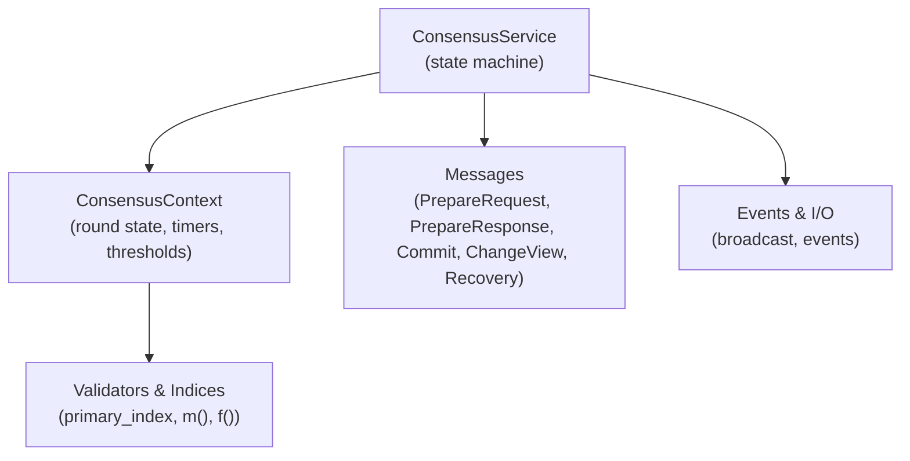
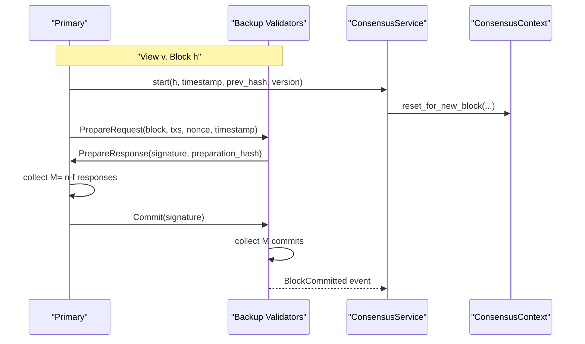
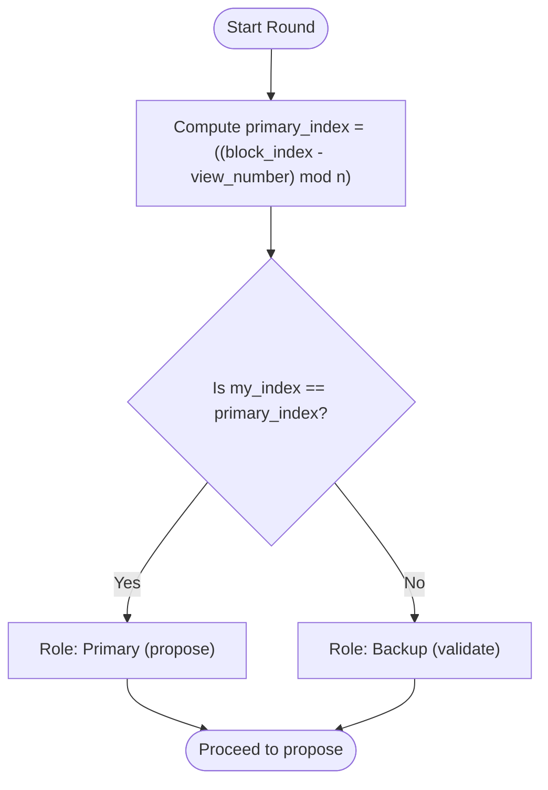
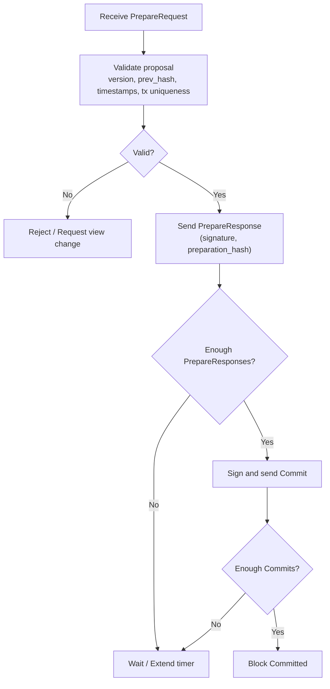
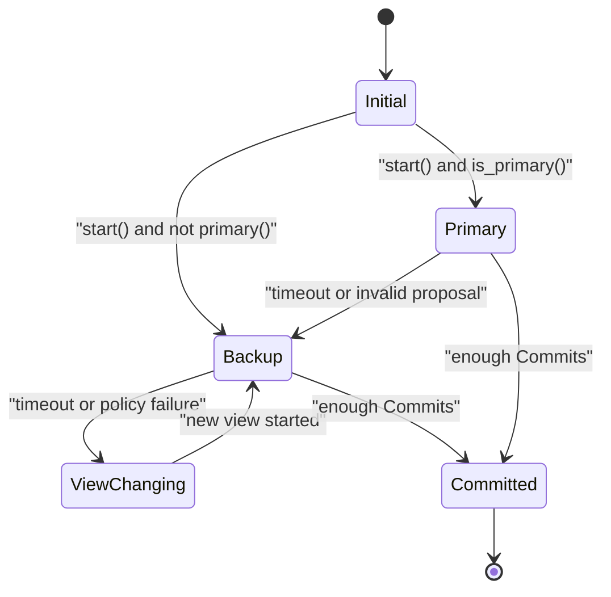
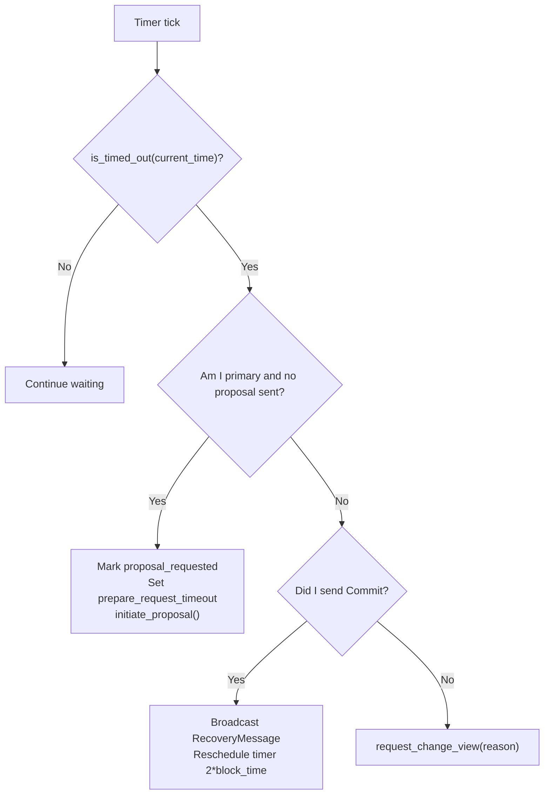
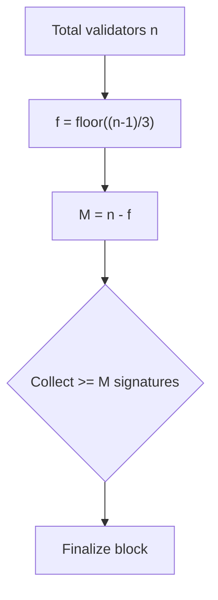
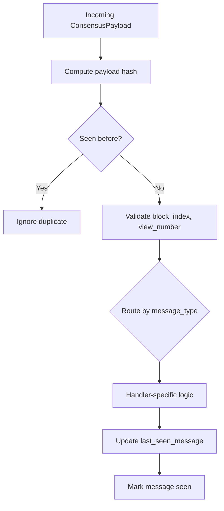
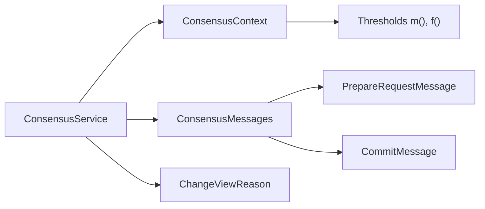

# Consensus Algorithm

<cite>
**Referenced Files in This Document**
- [lib.rs](file://neo-consensus/src/lib.rs)
- [context/mod.rs](file://neo-consensus/src/context/mod.rs)
- [service/core.rs](file://neo-consensus/src/service/core.rs)
- [service/lifecycle.rs](file://neo-consensus/src/service/lifecycle.rs)
- [messages/mod.rs](file://neo-consensus/src/messages/mod.rs)
- [messages/prepare_request.rs](file://neo-consensus/src/messages/prepare_request.rs)
- [messages/commit.rs](file://neo-consensus/src/messages/commit.rs)
- [change_view_reason.rs](file://neo-consensus/src/change_view_reason.rs)
</cite>

## Table of Contents
1. [Introduction](#introduction)
2. [Project Structure](#project-structure)
3. [Core Components](#core-components)
4. [Architecture Overview](#architecture-overview)
5. [Detailed Component Analysis](#detailed-component-analysis)
6. [Dependency Analysis](#dependency-analysis)
7. [Performance Considerations](#performance-considerations)
8. [Troubleshooting Guide](#troubleshooting-guide)
9. [Conclusion](#conclusion)
10. [Appendices](#appendices)

## Introduction
This document explains the dBFT 2.0 consensus algorithm implementation in Neo-RS. It covers primary validator rotation, block proposal generation, and the two-phase commit protocol (Prepare and Commit). It also details how validators participate in rounds, how speaking order is determined by validator indices, and the mathematical foundations of Byzantine fault tolerance with f = (n-1)/3. The state machine transitions across views, prepare phase, and commit phase are described, along with timing parameters, timeout mechanisms, and liveness guarantees under network delays or faulty nodes. Practical examples illustrate consensus rounds under different configurations and failure scenarios.

## Project Structure
The consensus implementation resides in the neo-consensus crate. Key modules include:
- Service layer: main state machine and lifecycle management
- Context: per-round state, timeouts, thresholds, and recovery helpers
- Messages: on-wire formats for PrepareRequest, PrepareResponse, Commit, ChangeView, Recovery
- Reasoning: change view reasons for robustness

**Diagram sources**
- [service/core.rs:8-25](file://neo-consensus/src/service/core.rs#L8-L25)
- [context/mod.rs:111-191](file://neo-consensus/src/context/mod.rs#L111-L191)
- [messages/mod.rs:20-58](file://neo-consensus/src/messages/mod.rs#L20-L58)

**Section sources**
- [lib.rs:6-61](file://neo-consensus/src/lib.rs#L6-L61)
- [service/core.rs:8-25](file://neo-consensus/src/service/core.rs#L8-L25)
- [context/mod.rs:111-191](file://neo-consensus/src/context/mod.rs#L111-L191)
- [messages/mod.rs:20-58](file://neo-consensus/src/messages/mod.rs#L20-L58)

## Core Components
- ConsensusService: orchestrates message processing, timer handling, and view changes; holds context, network magic, private key/signer, and event channel.
- ConsensusContext: tracks current block index, view number, validator set, my role, proposed block data, signatures, timers, and recovery state; provides thresholds m() and f().
- Messages: typed payloads for each step of dBFT with serialization and validation.
- ChangeViewReason: enumerates why a view change is requested (timeout, policy failures, etc.).

Key responsibilities:
- Primary selection via deterministic rotation based on block index and view number
- Two-phase commit: Prepare (proposal and acknowledgment) then Commit (finalization)
- View change and recovery to maintain liveness when primary fails or network stalls
- Replay protection via message hash caching and recovery response deduplication

**Section sources**
- [service/core.rs:8-66](file://neo-consensus/src/service/core.rs#L8-L66)
- [context/mod.rs:111-191](file://neo-consensus/src/context/mod.rs#L111-L191)
- [messages/mod.rs:20-58](file://neo-consensus/src/messages/mod.rs#L20-L58)
- [change_view_reason.rs:5-23](file://neo-consensus/src/change_view_reason.rs#L5-L23)

## Architecture Overview
dBFT 2.0 proceeds in views. Each view has a designated primary (speaker) and multiple backup validators. The primary proposes a block via PrepareRequest; backups validate and respond with PrepareResponse. Once enough PrepareResponses are collected, validators sign and broadcast Commit. After collecting enough Commits, the block is finalized. If progress stalls, validators request a view change to rotate the primary.

**Diagram sources**
- [service/lifecycle.rs:8-29](file://neo-consensus/src/service/lifecycle.rs#L8-L29)
- [messages/prepare_request.rs:8-27](file://neo-consensus/src/messages/prepare_request.rs#L8-L27)
- [messages/commit.rs:6-18](file://neo-consensus/src/messages/commit.rs#L6-L18)
- [context/mod.rs:263-273](file://neo-consensus/src/context/mod.rs#L263-L273)

## Detailed Component Analysis

### Primary Validator Rotation and Speaking Order
- Deterministic primary selection uses block index and view number to compute the speaker index.
- Formula ensures fair rotation and prevents centralization.

**Diagram sources**
- [context/mod.rs:275-292](file://neo-consensus/src/context/mod.rs#L275-L292)

**Section sources**
- [context/mod.rs:275-292](file://neo-consensus/src/context/mod.rs#L275-L292)

### Two-Phase Commit Protocol
- Prepare Phase:
  - Primary sends PrepareRequest with block metadata and transaction hashes.
  - Backups validate and send PrepareResponse with signatures and preparation hash.
  - Primary counts matching preparation hashes to reach threshold M = n - f.
- Commit Phase:
  - Upon sufficient PrepareResponses, validators sign and broadcast Commit.
  - Collecting M commits finalizes the block.

**Diagram sources**
- [messages/prepare_request.rs:205-229](file://neo-consensus/src/messages/prepare_request.rs#L205-L229)
- [messages/commit.rs:6-18](file://neo-consensus/src/messages/commit.rs#L6-L18)
- [context/mod.rs:303-370](file://neo-consensus/src/context/mod.rs#L303-L370)

**Section sources**
- [messages/prepare_request.rs:205-229](file://neo-consensus/src/messages/prepare_request.rs#L205-L229)
- [messages/commit.rs:6-18](file://neo-consensus/src/messages/commit.rs#L6-L18)
- [context/mod.rs:303-370](file://neo-consensus/src/context/mod.rs#L303-L370)

### State Machine Transitions (Views, Prepare, Commit)
- States: Initial, Primary, Backup, ViewChanging, Committed.
- Transitions:
  - On start/reset: set state to Primary if my_index equals primary_index, else Backup.
  - On timeout without progress: transition to ViewChanging and request ChangeView.
  - On sufficient Commits: transition to Committed and finalize.

**Diagram sources**
- [context/mod.rs:37-51](file://neo-consensus/src/context/mod.rs#L37-L51)
- [service/lifecycle.rs:8-29](file://neo-consensus/src/service/lifecycle.rs#L8-L29)
- [service/lifecycle.rs:156-203](file://neo-consensus/src/service/lifecycle.rs#L156-L203)

**Section sources**
- [context/mod.rs:37-51](file://neo-consensus/src/context/mod.rs#L37-L51)
- [service/lifecycle.rs:8-29](file://neo-consensus/src/service/lifecycle.rs#L8-L29)
- [service/lifecycle.rs:156-203](file://neo-consensus/src/service/lifecycle.rs#L156-L203)

### Timing Parameters and Timeout Mechanisms
- Base timeout derives from expected block time; exponential backoff increases timeouts with view number.
- Special case: primary at view 0 starts with base timeout; other cases use shifted timeout.
- Timer extension: after receiving PrepareRequest, primary extends timer by a fraction of block interval divided by M to allow more responses.
- Post-commit resilience: after sending Commit, node resends RecoveryMessage and waits for two block times before further action.

**Diagram sources**
- [context/mod.rs:514-562](file://neo-consensus/src/context/mod.rs#L514-L562)
- [context/mod.rs:595-617](file://neo-consensus/src/context/mod.rs#L595-L617)
- [service/lifecycle.rs:156-203](file://neo-consensus/src/service/lifecycle.rs#L156-L203)

**Section sources**
- [context/mod.rs:514-562](file://neo-consensus/src/context/mod.rs#L514-L562)
- [context/mod.rs:595-617](file://neo-consensus/src/context/mod.rs#L595-L617)
- [service/lifecycle.rs:156-203](file://neo-consensus/src/service/lifecycle.rs#L156-L203)

### Byzantine Fault Tolerance Foundations
- Thresholds:
  - f = (n-1)/3 maximum Byzantine nodes tolerated.
  - M = n - f minimum signatures required for consensus.
- Safety: No two honest nodes commit different blocks at the same height.
- Liveness: Under synchronous network and fewer than 1/3 faulty nodes, blocks are eventually committed.

**Diagram sources**
- [context/mod.rs:263-273](file://neo-consensus/src/context/mod.rs#L263-L273)
- [lib.rs:12-13](file://neo-consensus/src/lib.rs#L12-L13)

**Section sources**
- [context/mod.rs:263-273](file://neo-consensus/src/context/mod.rs#L263-L273)
- [lib.rs:12-13](file://neo-consensus/src/lib.rs#L12-L13)

### Message Handling and Deduplication
- All messages pass through process_message which validates block index, view number, and type routing.
- Replay protection:
  - Compute ExtensiblePayload.Hash and cache seen message hashes.
  - Recovery response deduplication via separate cache.
- Off-view messages are ignored except for ChangeView and Recovery types.

**Diagram sources**
- [service/lifecycle.rs:68-153](file://neo-consensus/src/service/lifecycle.rs#L68-L153)
- [context/mod.rs:640-682](file://neo-consensus/src/context/mod.rs#L640-L682)

**Section sources**
- [service/lifecycle.rs:68-153](file://neo-consensus/src/service/lifecycle.rs#L68-L153)
- [context/mod.rs:640-682](file://neo-consensus/src/context/mod.rs#L640-L682)

### Practical Examples and Failure Scenarios
- Example 1: Healthy 4-validator network (n=4, f=1, M=3)
  - Primary rotates deterministically; all phases complete within base timeout; block committed after M PrepareResponses and M Commits.
- Example 2: One faulty primary (n=4, f=1)
  - If primary does not propose or proposes invalid block, backups trigger ChangeView; new primary selected; round resumes.
- Example 3: Network delay during Prepare phase
  - Primary extends timer by factor to accommodate delayed responses; if still insufficient, view change occurs.
- Example 4: More than f nodes committed or lost
  - Node prefers recovery path to avoid splitting across views; broadcasts RecoveryMessage and waits for two block times.

[No sources needed since this section synthesizes behavior from previously analyzed components]

## Dependency Analysis
- ConsensusService depends on ConsensusContext for state and thresholds, and on messages for on-wire formats.
- Messages depend on primitives for hashing and serialization.
- ChangeViewReason drives view change decisions and recovery paths.

**Diagram sources**
- [service/core.rs:8-25](file://neo-consensus/src/service/core.rs#L8-L25)
- [context/mod.rs:263-273](file://neo-consensus/src/context/mod.rs#L263-L273)
- [messages/prepare_request.rs:8-27](file://neo-consensus/src/messages/prepare_request.rs#L8-L27)
- [messages/commit.rs:6-18](file://neo-consensus/src/messages/commit.rs#L6-L18)
- [change_view_reason.rs:5-23](file://neo-consensus/src/change_view_reason.rs#L5-L23)

**Section sources**
- [service/core.rs:8-25](file://neo-consensus/src/service/core.rs#L8-L25)
- [context/mod.rs:263-273](file://neo-consensus/src/context/mod.rs#L263-L273)
- [messages/prepare_request.rs:8-27](file://neo-consensus/src/messages/prepare_request.rs#L8-L27)
- [messages/commit.rs:6-18](file://neo-consensus/src/messages/commit.rs#L6-L18)
- [change_view_reason.rs:5-23](file://neo-consensus/src/change_view_reason.rs#L5-L23)

## Performance Considerations
- Exponential backoff on timeouts reduces churn during transient issues while ensuring eventual progress.
- Message hash caching prevents replay attacks and avoids redundant processing; bounded LRU protects memory.
- Timer extensions balance responsiveness and tolerance to network delays.
- Recovery path minimizes view splits by prioritizing recovery when many nodes have already committed or are lost.

[No sources needed since this section provides general guidance derived from analyzed components]

## Troubleshooting Guide
Common issues and diagnostics:
- Duplicate messages: Ensure message hash caching is active; check last_seen_message updates.
- Wrong block index: Validate incoming payloads against current block_index; handle future blocks appropriately.
- Invalid primary: Verify primary_index computation and validator ordering; reject mismatched PrepareRequest.
- Signature length errors: Validate Commit signature length; ensure correct signing path.
- Stalled rounds: Inspect timeouts and view changes; confirm ChangeViewReason and recovery flow.

**Section sources**
- [service/lifecycle.rs:68-153](file://neo-consensus/src/service/lifecycle.rs#L68-L153)
- [messages/commit.rs:49-59](file://neo-consensus/src/messages/commit.rs#L49-L59)
- [messages/prepare_request.rs:205-229](file://neo-consensus/src/messages/prepare_request.rs#L205-L229)
- [context/mod.rs:640-682](file://neo-consensus/src/context/mod.rs#L640-L682)

## Conclusion
Neo-RS implements dBFT 2.0 with a clear separation of concerns: service orchestration, contextual state management, typed message handling, and robust recovery. Deterministic primary rotation, two-phase commit, and exponential backoff ensure safety and liveness under Byzantine faults and network delays. The design supports practical operation across varying validator sets and failure modes, with explicit recovery paths to maintain consensus progress.

[No sources needed since this section summarizes without analyzing specific files]

## Appendices

### API and Data Flow Summary
- Start/resume: initialize round, set timers, determine role.
- Process message: validate, route, handle, update liveness, cache.
- Timer tick: detect timeouts, propose or change view, recover post-commit.
- Events: emit block committed, broadcast messages, view changed.

**Section sources**
- [service/lifecycle.rs:8-66](file://neo-consensus/src/service/lifecycle.rs#L8-L66)
- [service/lifecycle.rs:68-203](file://neo-consensus/src/service/lifecycle.rs#L68-L203)