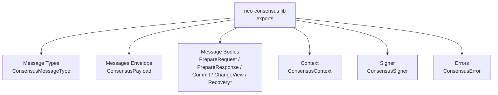
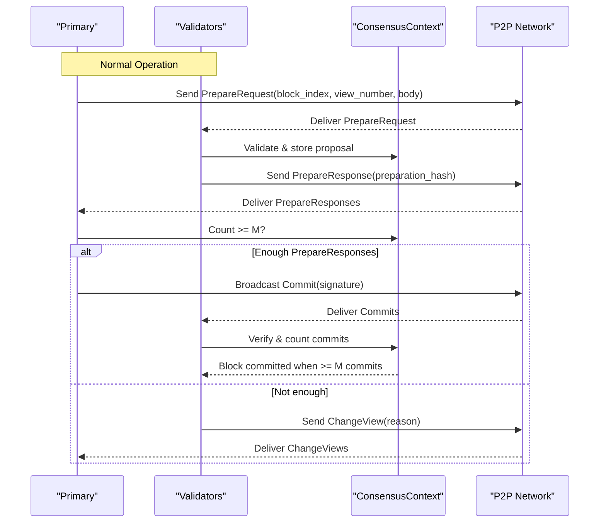
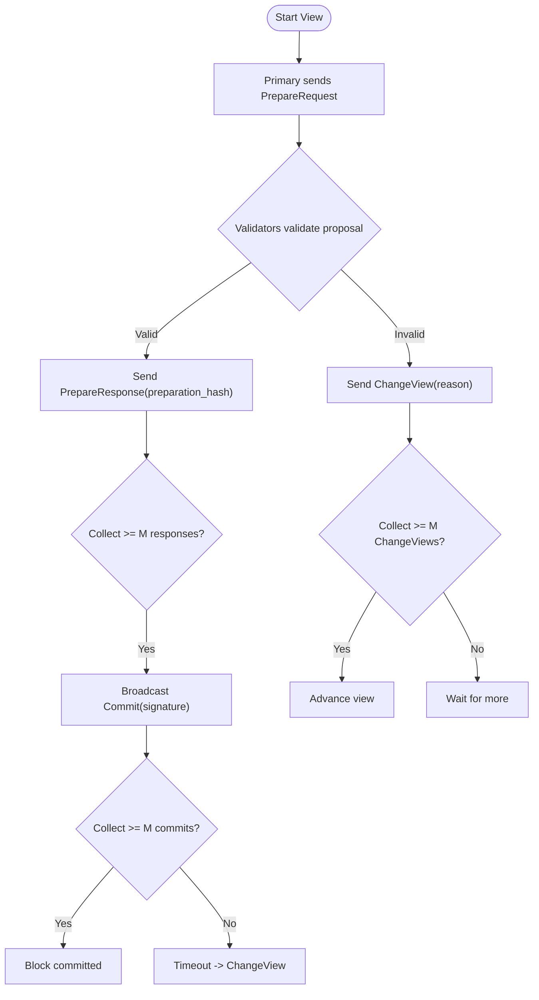
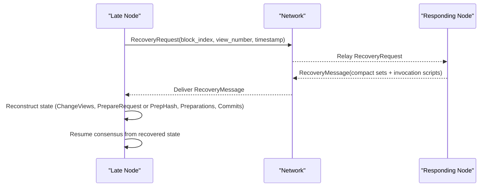
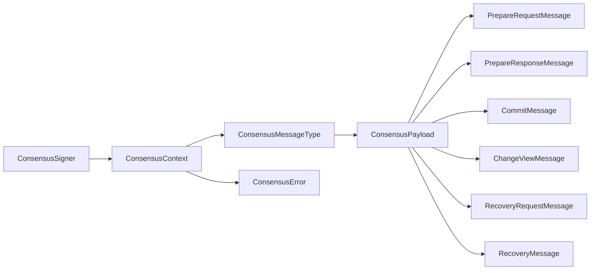

# Consensus Message Protocol

<cite>
**Referenced Files in This Document**
- [lib.rs](file://neo-consensus/src/lib.rs)
- [message_type.rs](file://neo-consensus/src/message_type.rs)
- [mod.rs](file://neo-consensus/src/messages/mod.rs)
- [prepare_request.rs](file://neo-consensus/src/messages/prepare_request.rs)
- [prepare_response.rs](file://neo-consensus/src/messages/prepare_response.rs)
- [commit.rs](file://neo-consensus/src/messages/commit.rs)
- [change_view.rs](file://neo-consensus/src/messages/change_view.rs)
- [recovery.rs](file://neo-consensus/src/messages/recovery.rs)
- [context/mod.rs](file://neo-consensus/src/context/mod.rs)
- [signer.rs](file://neo-consensus/src/signer.rs)
- [error.rs](file://neo-consensus/src/error.rs)
</cite>

## Table of Contents
1. Introduction
2. Project Structure
3. Core Components
4. Architecture Overview
5. Detailed Component Analysis
6. Dependency Analysis
7. Performance Considerations
8. Troubleshooting Guide
9. Conclusion

## Introduction
This document specifies the consensus message protocol used by the Neo-RS dBFT implementation. It covers all on-wire message types, their data structures, serialization formats, signing and validation rules, message flow during normal operation and recovery, authentication via BLS signatures, ordering guarantees, network delivery semantics, and error handling for malformed messages, signature verification failures, and timeouts.

## Project Structure
The consensus module exposes a cohesive API for dBFT 2.0 with clearly separated concerns:
- Message type enumeration and wire envelope
- Per-message definitions and serialization
- Context tracking state across views and blocks
- Signing abstraction for validator keys
- Error taxonomy for robust failure handling

**Diagram sources**
- [lib.rs:221-285](file://neo-consensus/src/lib.rs#L221-L285)
- [message_type.rs:5-22](file://neo-consensus/src/message_type.rs#L5-L22)
- [mod.rs:20-150](file://neo-consensus/src/messages/mod.rs#L20-L150)
- [context/mod.rs:111-191](file://neo-consensus/src/context/mod.rs#L111-L191)
- [signer.rs:41-51](file://neo-consensus/src/signer.rs#L41-L51)
- [error.rs:31-173](file://neo-consensus/src/error.rs#L31-L173)

**Section sources**
- [lib.rs:221-285](file://neo-consensus/src/lib.rs#L221-L285)

## Core Components
- ConsensusMessageType: Enumerates on-wire message identifiers (ChangeView, PrepareRequest, PrepareResponse, Commit, RecoveryRequest, RecoveryMessage).
- ConsensusPayload: Network envelope carrying type, block index, validator index, view number, serialized body, and witness.
- Message bodies:
  - PrepareRequestMessage: Primary’s proposal payload.
  - PrepareResponseMessage: Validator acknowledgment of a proposal.
  - CommitMessage: Validator commitment to a block.
  - ChangeViewMessage: Request to advance the view.
  - RecoveryRequestMessage / RecoveryMessage: State synchronization payloads.
- ConsensusContext: Tracks per-round state, thresholds (M), timers, and deduplication caches.
- ConsensusSigner: Abstraction over validator key material for signing.
- ConsensusError: Typed errors for validation and runtime failures.

Key responsibilities:
- Serialization/deserialization of each message body and the common envelope.
- Validation of fields, lengths, and protocol invariants.
- Threshold checks for M = n − f.
- Replay protection via seen message hashes.
- Timer management and view change logic hooks.

**Section sources**
- [message_type.rs:5-22](file://neo-consensus/src/message_type.rs#L5-L22)
- [mod.rs:20-150](file://neo-consensus/src/messages/mod.rs#L20-L150)
- [prepare_request.rs:8-229](file://neo-consensus/src/messages/prepare_request.rs#L8-L229)
- [prepare_response.rs:7-82](file://neo-consensus/src/messages/prepare_response.rs#L7-L82)
- [commit.rs:6-60](file://neo-consensus/src/messages/commit.rs#L6-L60)
- [change_view.rs:6-100](file://neo-consensus/src/messages/change_view.rs#L6-L100)
- [recovery.rs:12-353](file://neo-consensus/src/messages/recovery.rs#L12-L353)
- [context/mod.rs:111-191](file://neo-consensus/src/context/mod.rs#L111-L191)
- [signer.rs:41-51](file://neo-consensus/src/signer.rs#L41-L51)
- [error.rs:31-173](file://neo-consensus/src/error.rs#L31-L173)

## Architecture Overview
dBFT proceeds in views with a rotating primary. Validators exchange PrepareRequest, PrepareResponse, and Commit messages. If progress stalls or proposals are invalid, validators request a view change. Recovery messages allow nodes to synchronize missing state after failures.

**Diagram sources**
- [lib.rs:63-138](file://neo-consensus/src/lib.rs#L63-L138)
- [mod.rs:82-150](file://neo-consensus/src/messages/mod.rs#L82-L150)
- [context/mod.rs:303-382](file://neo-consensus/src/context/mod.rs#L303-L382)

## Detailed Component Analysis

### Common Envelope and Wire Format
- On-wire layout for DBFTPlugin payloads:
  - Header: [type:1][block_index:4][validator_index:1][view_number:1]
  - Body: message-specific bytes
- ConsensusPayload provides:
  - to_message_bytes() for serialization
  - from_message_bytes() for parsing with strict length/type checks
  - set_witness() to attach the validator’s invocation script/witness

Validation highlights:
- Rejects too-short buffers and unknown message types.
- Preserves network magic separately; not part of the on-wire header.

**Section sources**
- [mod.rs:41-150](file://neo-consensus/src/messages/mod.rs#L41-L150)

### PrepareRequestMessage
- Purpose: Primary proposes a new block for the current view.
- Fields:
  - block_index, view_number, validator_index
  - version (must be 0)
  - prev_hash (UInt256)
  - timestamp (u64)
  - nonce (u64)
  - transaction_hashes (Vec<UInt256>)
- Serialization:
  - Body encodes version, prev_hash, timestamp, nonce, then varint-counted transaction hashes.
- Validation:
  - Enforces version == 0.
  - Ensures no duplicate transaction hashes.
  - Validates that sender is the expected primary.

Processing notes:
- The preparation hash used by PrepareResponse is the ExtensiblePayload.Hash of this message (computed from the full on-wire header + body).
- Receivers must verify the proposal against policy (e.g., max transactions per block, timestamp bounds) before accepting.

**Section sources**
- [prepare_request.rs:8-229](file://neo-consensus/src/messages/prepare_request.rs#L8-L229)
- [context/mod.rs:111-191](file://neo-consensus/src/context/mod.rs#L111-L191)

### PrepareResponseMessage
- Purpose: Validator acknowledges a specific proposal identified by its preparation hash.
- Fields:
  - block_index, view_number, validator_index
  - preparation_hash (UInt256)
- Serialization:
  - Body is exactly the 32-byte preparation hash.
- Validation:
  - Checks that preparation_hash matches the expected proposal hash.

Processing notes:
- Each validator contributes at most one response per validator slot; the primary’s own PrepareRequest implicitly counts toward M if it matches the accepted hash.

**Section sources**
- [prepare_response.rs:7-82](file://neo-consensus/src/messages/prepare_response.rs#L7-L82)
- [context/mod.rs:303-334](file://neo-consensus/src/context/mod.rs#L303-L334)

### CommitMessage
- Purpose: Validator commits to the proposed block after verifying sufficient PrepareResponses.
- Fields:
  - block_index, view_number, validator_index
  - signature (64 bytes ECDSA r||s)
- Serialization:
  - Body is the 64-byte signature.
- Validation:
  - Signature length must be exactly 64 bytes.
  - Higher-level verification uses the signer to validate the signature over the block hash.

Processing notes:
- A node may sign a commit only if it has verified both the proposal and the preparation hash (R02 safety).
- Commits are counted per view; duplicates from the same validator in the same view are rejected.

**Section sources**
- [commit.rs:6-60](file://neo-consensus/src/messages/commit.rs#L6-L60)
- [context/mod.rs:475-494](file://neo-consensus/src/context/mod.rs#L475-L494)

### ChangeViewMessage
- Purpose: Request to advance to a new view due to timeout or invalid proposal.
- Fields:
  - block_index, view_number, validator_index
  - timestamp (u64)
  - reason (ChangeViewReason)
- Serialization:
  - Body encodes timestamp followed by a single-byte reason.
- Validation:
  - New view number must be strictly greater than current view (no overflow).
  - Reason codes include Timeout, ChangeAgreement, TxNotFound, TxRejectedByPolicy, TxInvalid, BlockRejectedByPolicy.

Processing notes:
- Validators collect ChangeView requests and trigger a new view once M requests for a new view >= requested are observed.

**Section sources**
- [change_view.rs:6-100](file://neo-consensus/src/messages/change_view.rs#L6-L100)
- [change_view_reason.rs:5-23](file://neo-consensus/src/change_view_reason.rs#L5-L23)
- [context/mod.rs:372-382](file://neo-consensus/src/context/mod.rs#L372-L382)

### RecoveryRequestMessage and RecoveryMessage
- RecoveryRequestMessage:
  - Fields: block_index, view_number, validator_index, timestamp.
  - Serialization: 8-byte timestamp.
- RecoveryMessage:
  - Carries compact sets of:
    - ChangeViewPayloadCompact (validator_index, original_view_number, timestamp, invocation_script)
    - Optional embedded PrepareRequestMessage (including its common header) OR PreparationHash (var-bytes)
    - PreparationPayloadCompact (validator_index, invocation_script)
    - CommitPayloadCompact (view_number, validator_index, signature[64], invocation_script)
  - Serialization order:
    - Array of ChangeViewPayloadCompact (sorted by validator_index)
    - Boolean flag indicating presence of embedded PrepareRequestMessage
    - Either the embedded PrepareRequestMessage bytes or PreparationHash var-bytes
    - Array of PreparationPayloadCompact (sorted by validator_index)
    - Array of CommitPayloadCompact (sorted by validator_index)
  - Validation:
    - No duplicate validator indices within each compact array.
    - Strict sizes for fixed fields (e.g., 64-byte commit signatures).

Processing notes:
- Used to recover consensus state when nodes miss messages or crash-restart.
- Invocation scripts serve as witnesses for verification of the corresponding payloads.

**Section sources**
- [recovery.rs:12-353](file://neo-consensus/src/messages/recovery.rs#L12-L353)

### Message Authentication and Signing
- All consensus messages are wrapped in ConsensusPayload with a witness field.
- The ConsensusSigner trait abstracts signing operations using validator private keys without exposing them.
- Verification:
  - For PrepareRequest: verify the primary’s invocation script/witness against the prepared payload hash.
  - For PrepareResponse: verify the validator’s invocation script/witness against the preparation hash.
  - For Commit: verify the validator’s invocation script/witness against the block hash.
  - For ChangeView/Recovery: verify invocation scripts associated with compact payloads.

Ordering and delivery semantics:
- Messages are delivered via the P2P layer as DBFTPlugin payloads; ordering is best-effort but idempotent processing is enforced via seen message hashes.
- Duplicate detection prevents replay attacks within a round.

**Section sources**
- [signer.rs:41-51](file://neo-consensus/src/signer.rs#L41-L51)
- [mod.rs:41-150](file://neo-consensus/src/messages/mod.rs#L41-L150)
- [context/mod.rs:640-682](file://neo-consensus/src/context/mod.rs#L640-L682)

### Message Flow Patterns

#### Normal Consensus Operation

**Diagram sources**
- [lib.rs:63-138](file://neo-consensus/src/lib.rs#L63-L138)
- [context/mod.rs:303-382](file://neo-consensus/src/context/mod.rs#L303-L382)

#### Recovery Scenario

**Diagram sources**
- [recovery.rs:12-353](file://neo-consensus/src/messages/recovery.rs#L12-L353)

## Dependency Analysis
- ConsensusMessageType depends on primitive enum utilities and is consumed by all message modules and the envelope parser.
- ConsensusPayload depends on ConsensusMessageType and provides shared serialization helpers used by message builders.
- Message bodies depend on primitives (UInt256), IO utilities (BinaryWriter/MemoryReader), and error types.
- Context depends on cryptographic types (ECPoint), primitives, and error types; it also tracks thresholds and timers used by service logic.
- Signer is independent and injected into higher layers to perform signing/verification.

**Diagram sources**
- [message_type.rs:5-22](file://neo-consensus/src/message_type.rs#L5-L22)
- [mod.rs:20-150](file://neo-consensus/src/messages/mod.rs#L20-L150)
- [context/mod.rs:111-191](file://neo-consensus/src/context/mod.rs#L111-L191)
- [signer.rs:41-51](file://neo-consensus/src/signer.rs#L41-L51)
- [error.rs:31-173](file://neo-consensus/src/error.rs#L31-L173)

**Section sources**
- [message_type.rs:5-22](file://neo-consensus/src/message_type.rs#L5-L22)
- [mod.rs:20-150](file://neo-consensus/src/messages/mod.rs#L20-L150)
- [context/mod.rs:111-191](file://neo-consensus/src/context/mod.rs#L111-L191)
- [signer.rs:41-51](file://neo-consensus/src/signer.rs#L41-L51)
- [error.rs:31-173](file://neo-consensus/src/error.rs#L31-L173)

## Performance Considerations
- Use compact recovery payloads to minimize bandwidth during recovery.
- Maintain bounded LRU caches for seen message hashes to prevent memory exhaustion while ensuring replay protection.
- Avoid redundant work by checking thresholds (M) early and skipping unnecessary validations.
- Serialize only necessary fields; reuse buffers where possible.

[No sources needed since this section provides general guidance]

## Troubleshooting Guide
Common issues and how they are handled:
- Malformed messages:
  - Too short buffers or invalid message types are rejected with InvalidProposal errors.
  - Incorrect field sizes (e.g., wrong signature length) produce InvalidSignatureLength errors.
- Signature verification failures:
  - Failures surface as SignatureVerificationFailed; ensure correct invocation scripts and keys.
- Hash mismatches:
  - PrepareResponse mismatch yields HashMismatch; verify the preparation hash used.
- Wrong view/block:
  - Errors include WrongView and WrongBlock; ensure consistent context across peers.
- Timeouts:
  - Timed-out phases raise Timeout errors; trigger ChangeView or recovery as appropriate.
- Duplicate messages:
  - Seen message hash cache prevents reprocessing; check context caches if unexpected behavior occurs.

Operational tips:
- Log the exact error variant and relevant fields (block_index, view_number, validator_index).
- When encountering repeated signature failures, inspect the invocation scripts and validator public keys.
- During recovery, confirm that compact arrays contain unique validator indices and that invocation scripts match the referenced payloads.

**Section sources**
- [error.rs:31-173](file://neo-consensus/src/error.rs#L31-L173)
- [mod.rs:97-126](file://neo-consensus/src/messages/mod.rs#L97-L126)
- [prepare_request.rs:85-136](file://neo-consensus/src/messages/prepare_request.rs#L85-L136)
- [prepare_response.rs:49-82](file://neo-consensus/src/messages/prepare_response.rs#L49-L82)
- [commit.rs:43-60](file://neo-consensus/src/messages/commit.rs#L43-L60)
- [change_view.rs:63-100](file://neo-consensus/src/messages/change_view.rs#L63-L100)
- [recovery.rs:264-353](file://neo-consensus/src/messages/recovery.rs#L264-L353)
- [context/mod.rs:640-682](file://neo-consensus/src/context/mod.rs#L640-L682)

## Conclusion
The Neo-RS dBFT consensus message protocol defines a clear, secure, and efficient set of messages for proposing, validating, committing, and recovering blocks. With strict serialization, robust validation, threshold-based agreement, and comprehensive error handling, the implementation ensures safety and liveness under Byzantine conditions. Proper use of the ConsensusPayload envelope, ConsensusSigner interface, and ConsensusContext enables reliable message construction, parsing, and processing across normal and recovery scenarios.