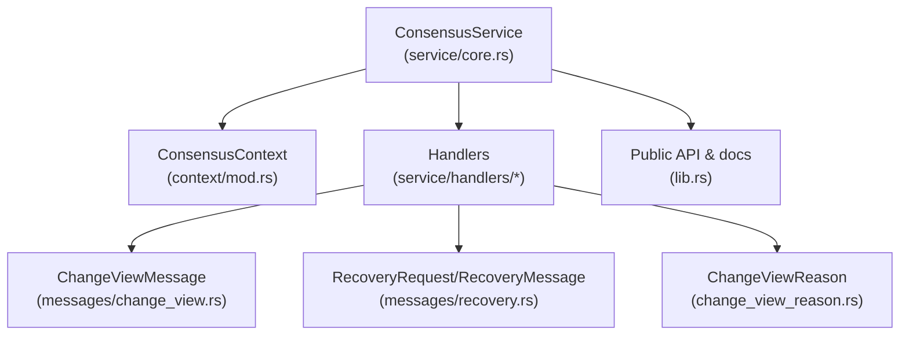
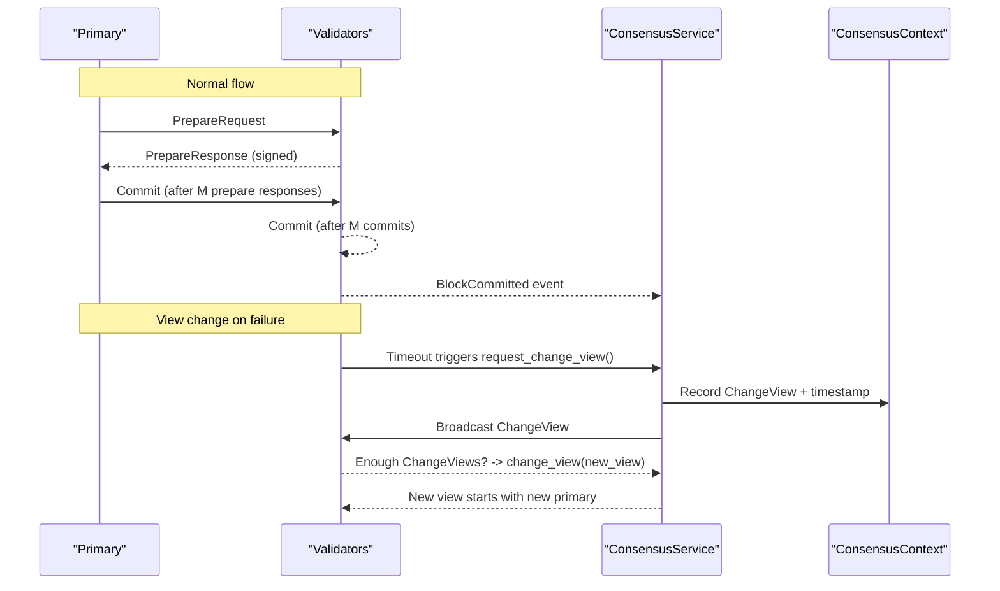
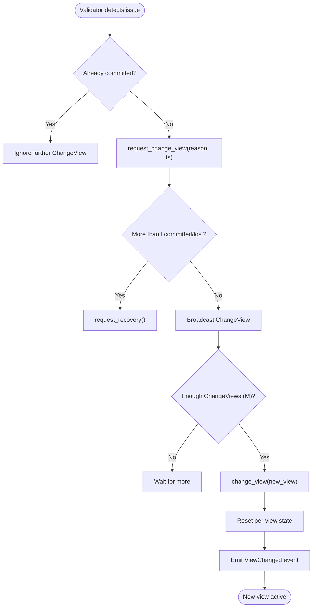
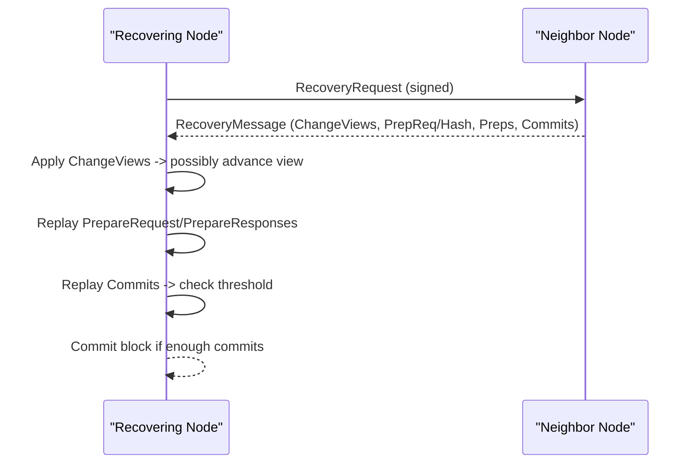
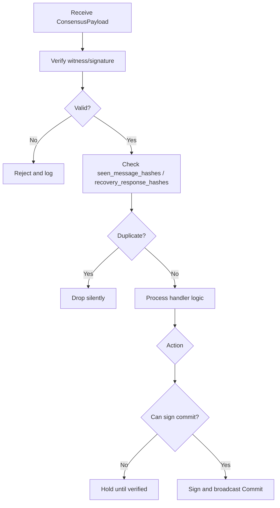
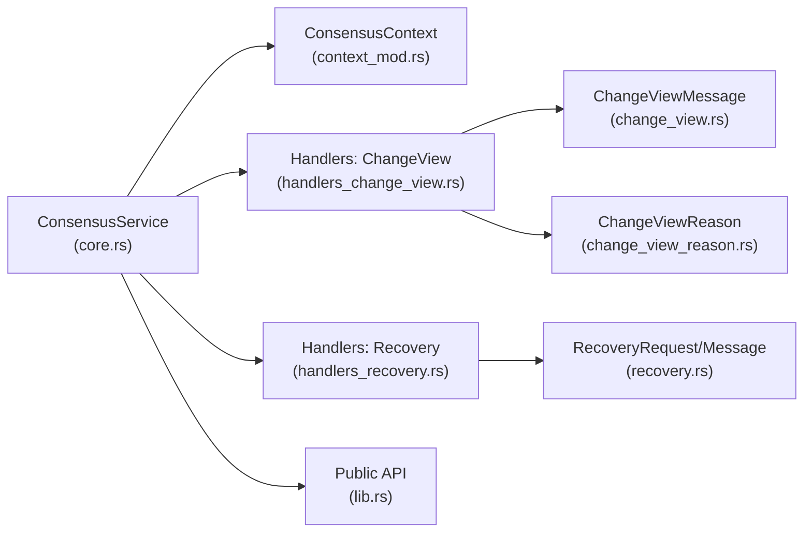

# Fault Tolerance & Recovery

<cite>
**Referenced Files in This Document**
- [lib.rs](file://neo-consensus/src/lib.rs)
- [change_view_reason.rs](file://neo-consensus/src/change_view_reason.rs)
- [change_view.rs](file://neo-consensus/src/messages/change_view.rs)
- [recovery.rs](file://neo-consensus/src/messages/recovery.rs)
- [handlers_change_view.rs](file://neo-consensus/src/service/handlers/change_view.rs)
- [handlers_recovery.rs](file://neo-consensus/src/service/handlers/recovery.rs)
- [context_mod.rs](file://neo-consensus/src/context/mod.rs)
- [core.rs](file://neo-consensus/src/service/core.rs)
</cite>

## Table of Contents
1. Introduction
2. Project Structure
3. Core Components
4. Architecture Overview
5. Detailed Component Analysis
6. Dependency Analysis
7. Performance Considerations
8. Troubleshooting Guide
9. Conclusion
10. Appendices

## Introduction
This document explains the Byzantine fault tolerance (BFT) mechanisms and recovery procedures implemented by Neo-RS consensus (dBFT 2.0). It covers how the system tolerates faulty validators, handles network partitions, detects malicious behavior, and continues progress via view changes and recovery protocols. It also details safety guarantees, liveness conditions, accountability, and operational guidance for automatic and manual recovery.

## Project Structure
The consensus implementation is organized into:
- Consensus service and state machine
- Context tracking current round state and signatures
- Message types for dBFT phases and recovery
- Handlers for processing messages and triggering transitions
- Change view reasons and message validation

**Diagram sources**
- [core.rs:8-25](file://neo-consensus/src/service/core.rs#L8-L25)
- [context_mod.rs:111-191](file://neo-consensus/src/context/mod.rs#L111-L191)
- [change_view.rs:6-19](file://neo-consensus/src/messages/change_view.rs#L6-L19)
- [recovery.rs:12-23](file://neo-consensus/src/messages/recovery.rs#L12-L23)
- [change_view_reason.rs:5-23](file://neo-consensus/src/change_view_reason.rs#L5-L23)
- [lib.rs:6-12](file://neo-consensus/src/lib.rs#L6-L12)

**Section sources**
- [lib.rs:6-12](file://neo-consensus/src/lib.rs#L6-L12)
- [core.rs:8-25](file://neo-consensus/src/service/core.rs#L8-L25)
- [context_mod.rs:111-191](file://neo-consensus/src/context/mod.rs#L111-L191)

## Core Components
- ConsensusService: Main state machine orchestrating dBFT 2.0, signing, broadcasting, and event emission.
- ConsensusContext: Tracks view number, validator set, proposal data, collected signatures, timers, and recovery metadata.
- Messages: PrepareRequest/Response, Commit, ChangeView, RecoveryRequest, RecoveryMessage with compact payloads.
- Handlers: Process inbound messages, enforce security checks, trigger view changes, and drive recovery.
- ChangeViewReason: Enumerates why a view change is requested (timeout, invalid block/txs, agreement, etc.).

Key responsibilities:
- Enforce M = n - f thresholds for prepare responses and commits.
- Rotate primary deterministically per view.
- Trigger view changes on timeouts or policy violations.
- Provide recovery to synchronize state across nodes.

**Section sources**
- [lib.rs:14-23](file://neo-consensus/src/lib.rs#L14-L23)
- [context_mod.rs:257-286](file://neo-consensus/src/context/mod.rs#L257-L286)
- [change_view_reason.rs:5-23](file://neo-consensus/src/change_view_reason.rs#L5-L23)

## Architecture Overview
The consensus protocol proceeds in views. The primary proposes a block; validators validate and respond; upon sufficient prepare responses, validators commit; after enough commits, the block is finalized. If the primary fails or behaves incorrectly, validators request a view change. When nodes fall behind or lose state, they use recovery requests and messages to reassemble necessary votes and proposals.

**Diagram sources**
- [handlers_change_view.rs:98-173](file://neo-consensus/src/service/handlers/change_view.rs#L98-L173)
- [handlers_change_view.rs:205-243](file://neo-consensus/src/service/handlers/change_view.rs#L205-L243)
- [context_mod.rs:384-409](file://neo-consensus/src/context/mod.rs#L384-L409)
- [lib.rs:63-98](file://neo-consensus/src/lib.rs#L63-L98)

## Detailed Component Analysis

### Byzantine Fault Tolerance Model and Thresholds
- Tolerates up to f = floor((n-1)/3) Byzantine validators.
- Requires M = n - f signatures for both prepare responses and commits.
- Primary selection is deterministic based on block index and view number.

These properties ensure:
- Safety: No two honest nodes commit different blocks at the same height.
- Liveness: Under synchronous network and fewer than f faults, progress is guaranteed.
- Accountability: All consensus actions are signed and auditable.

**Section sources**
- [context_mod.rs:263-273](file://neo-consensus/src/context/mod.rs#L263-L273)
- [context_mod.rs:303-382](file://neo-consensus/src/context/mod.rs#L303-L382)
- [lib.rs:211-215](file://neo-consensus/src/lib.rs#L211-L215)

### View Change Mechanism
When the primary is unresponsive or malicious, validators initiate a view change:
- Validators detect timeout or invalid proposal and call request_change_view(reason, timestamp).
- If more than f nodes have committed or are lost, the node requests recovery instead of view change to avoid splits.
- Upon receiving M ChangeView requests for a new view, the service transitions to the new view, resets per-view state, and emits a ViewChanged event.
- The new primary starts proposing after an initial timer; recovering primaries get exponential backoff.

**Diagram sources**
- [handlers_change_view.rs:98-173](file://neo-consensus/src/service/handlers/change_view.rs#L98-L173)
- [handlers_change_view.rs:205-243](file://neo-consensus/src/service/handlers/change_view.rs#L205-L243)
- [context_mod.rs:384-409](file://neo-consensus/src/context/mod.rs#L384-L409)

**Section sources**
- [handlers_change_view.rs:98-173](file://neo-consensus/src/service/handlers/change_view.rs#L98-L173)
- [handlers_change_view.rs:205-243](file://neo-consensus/src/service/handlers/change_view.rs#L205-L243)
- [change_view_reason.rs:5-23](file://neo-consensus/src/change_view_reason.rs#L5-L23)

### Recovery Protocol for Stalled or Lagging Nodes
Nodes that miss messages or fall behind can recover using recovery requests and messages:
- A node sends RecoveryRequest when it needs consensus state.
- Eligible responders build a RecoveryMessage containing:
  - Collected ChangeView messages
  - Either the embedded PrepareRequest or the preparation hash
  - Preparation messages (validator indices and invocation scripts)
  - Commit messages (with view numbers and signatures)
- The requester applies these messages to reconstruct local state, potentially advancing views, replaying prepare responses, and committing if enough commits are present.

**Diagram sources**
- [handlers_recovery.rs:13-57](file://neo-consensus/src/service/handlers/recovery.rs#L13-L57)
- [handlers_recovery.rs:59-297](file://neo-consensus/src/service/handlers/recovery.rs#L59-L297)
- [recovery.rs:173-353](file://neo-consensus/src/messages/recovery.rs#L173-L353)

**Section sources**
- [handlers_recovery.rs:13-57](file://neo-consensus/src/service/handlers/recovery.rs#L13-L57)
- [handlers_recovery.rs:59-297](file://neo-consensus/src/service/handlers/recovery.rs#L59-L297)
- [recovery.rs:173-353](file://neo-consensus/src/messages/recovery.rs#L173-L353)

### Security Properties and Enforcement
- Signature verification: All consensus messages require valid witnesses; missing or invalid signatures are rejected.
- Deduplication: Seen message hashes prevent replay attacks; recovery response deduplication avoids duplicate broadcasts.
- Commit binding: A node may only sign a Commit when it has verified the proposal and preparation hash, preventing zero-hash commitments.
- View monotonicity: View numbers must strictly increase; stale or regressive views are ignored.

**Diagram sources**
- [handlers_change_view.rs:14-34](file://neo-consensus/src/service/handlers/change_view.rs#L14-L34)
- [handlers_recovery.rs:71-91](file://neo-consensus/src/service/handlers/recovery.rs#L71-L91)
- [context_mod.rs:185-191](file://neo-consensus/src/context/mod.rs#L185-L191)
- [context_mod.rs:336-346](file://neo-consensus/src/context/mod.rs#L336-L346)

**Section sources**
- [handlers_change_view.rs:14-34](file://neo-consensus/src/service/handlers/change_view.rs#L14-L34)
- [handlers_recovery.rs:71-91](file://neo-consensus/src/service/handlers/recovery.rs#L71-L91)
- [context_mod.rs:185-191](file://neo-consensus/src/context/mod.rs#L185-L191)
- [context_mod.rs:336-346](file://neo-consensus/src/context/mod.rs#L336-L346)

### Fault Detection and Automatic Recovery
- Timeout detection: Validators monitor expected block time and trigger view changes when the primary does not propose in time.
- Policy-based detection: Invalid transactions or blocks cause immediate view changes with appropriate reasons.
- Automatic recovery: Nodes request recovery when more than f nodes are committed or lost, ensuring safe convergence without network splits.

Operational indicators:
- ViewChanged events indicate successful rotation.
- RecoveryMessage application logs show state reconstruction steps.
- Commit thresholds enable finalization once enough signatures are gathered.

**Section sources**
- [lib.rs:111-138](file://neo-consensus/src/lib.rs#L111-L138)
- [handlers_change_view.rs:98-173](file://neo-consensus/src/service/handlers/change_view.rs#L98-L173)
- [handlers_recovery.rs:312-340](file://neo-consensus/src/service/handlers/recovery.rs#L312-L340)

### Manual Intervention Procedures
While most failures are self-healing, operators may intervene when:
- Persistent network partitions prevent quorum:
  - Ensure connectivity among at least M validators.
  - Monitor ViewChanged events to confirm rotation.
- A node is severely lagging:
  - Allow RecoveryRequest/RecoveryMessage exchange to catch up.
  - Validate that RecoveryMessage contains sufficient commits to finalize.
- Suspected malicious behavior:
  - Inspect ChangeViewReason values and signature verification logs.
  - Confirm that invalid proposals triggered view changes and were not accepted.

[No sources needed since this section provides general operational guidance]

## Dependency Analysis
The consensus service depends on context for state, handlers for message processing, and message modules for serialization/validation.

**Diagram sources**
- [core.rs:8-25](file://neo-consensus/src/service/core.rs#L8-L25)
- [context_mod.rs:111-191](file://neo-consensus/src/context/mod.rs#L111-L191)
- [handlers_change_view.rs:98-173](file://neo-consensus/src/service/handlers/change_view.rs#L98-L173)
- [handlers_recovery.rs:13-57](file://neo-consensus/src/service/handlers/recovery.rs#L13-L57)
- [change_view.rs:6-19](file://neo-consensus/src/messages/change_view.rs#L6-L19)
- [recovery.rs:12-23](file://neo-consensus/src/messages/recovery.rs#L12-L23)
- [change_view_reason.rs:5-23](file://neo-consensus/src/change_view_reason.rs#L5-L23)
- [lib.rs:6-12](file://neo-consensus/src/lib.rs#L6-L12)

**Section sources**
- [core.rs:8-25](file://neo-consensus/src/service/core.rs#L8-L25)
- [context_mod.rs:111-191](file://neo-consensus/src/context/mod.rs#L111-L191)

## Performance Considerations
- Message caching: An LRU cache limits seen message hashes to protect memory while preventing replays.
- Compact recovery payloads: RecoveryMessage uses compact representations to reduce bandwidth during catch-up.
- Timer tuning: Expected block time and view change timeouts influence responsiveness; adjust based on network conditions.
- Commit aggregation: Collecting commits efficiently reduces latency to finality.

[No sources needed since this section provides general guidance]

## Troubleshooting Guide
Common issues and diagnostics:
- Missing or invalid signatures:
  - Logs indicate signature verification failures; ensure correct keys and witnesses.
- Duplicate messages:
  - Seen message hashes drop duplicates; verify cache sizes and block boundaries.
- Stuck view:
  - Check ChangeViewReason and whether M ChangeView requests were received.
- Recovery not progressing:
  - Ensure eligible responders send RecoveryMessage; verify should_send_recovery_response logic and rotation.

Operational checks:
- Monitor ViewChanged events for successful rotations.
- Inspect RecoveryMessage contents to confirm presence of ChangeViews, preparations, and commits.
- Validate that commit counts meet M threshold before finalizing.

**Section sources**
- [handlers_change_view.rs:14-34](file://neo-consensus/src/service/handlers/change_view.rs#L14-L34)
- [handlers_recovery.rs:71-91](file://neo-consensus/src/service/handlers/recovery.rs#L71-L91)
- [context_mod.rs:185-191](file://neo-consensus/src/context/mod.rs#L185-L191)
- [handlers_recovery.rs:312-340](file://neo-consensus/src/service/handlers/recovery.rs#L312-L340)

## Conclusion
Neo-RS consensus implements dBFT 2.0 with robust Byzantine fault tolerance, deterministic view rotation, and comprehensive recovery mechanisms. Safety is enforced through strict signature verification, commit binding, and monotonic view progression. Liveness is maintained via timeouts, view changes, and recovery exchanges. Accountability is ensured by signed, auditable consensus actions. Operators can rely on automatic recovery for most failures and use targeted interventions for complex scenarios.

[No sources needed since this section summarizes without analyzing specific files]

## Appendices

### Key Data Structures and Complexity
- ConsensusContext fields track per-round state with HashMaps for signatures and invocations; operations are O(1) average for insert/lookup.
- Message caches use LRU with bounded size; eviction ensures memory protection.
- Threshold checks (prepare responses, commits, change views) iterate over maps with O(n) complexity where n ≤ MAX_VALIDATORS.

**Section sources**
- [context_mod.rs:111-191](file://neo-consensus/src/context/mod.rs#L111-L191)
- [context_mod.rs:303-382](file://neo-consensus/src/context/mod.rs#L303-L382)

### Example Scenarios
- Faulty primary:
  - Validators detect timeout, request view change, rotate primary, and continue consensus.
- Network partition:
  - Partitioned minority cannot form quorum; majority proceeds; recovery aligns minority later.
- Malicious proposal:
  - Invalid transactions or blocks trigger view change with specific reasons; no commitment occurs.

[No sources needed since this section provides conceptual examples]