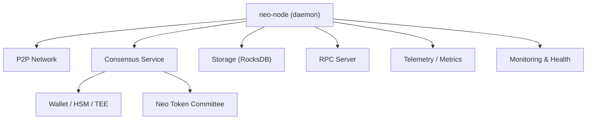
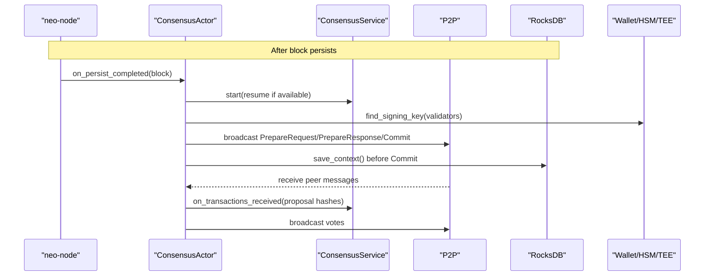
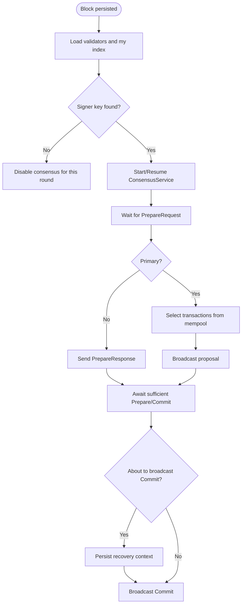
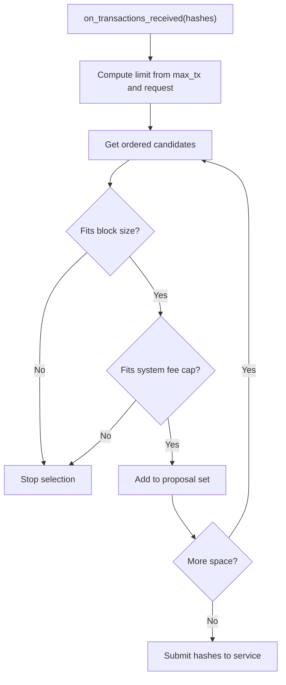
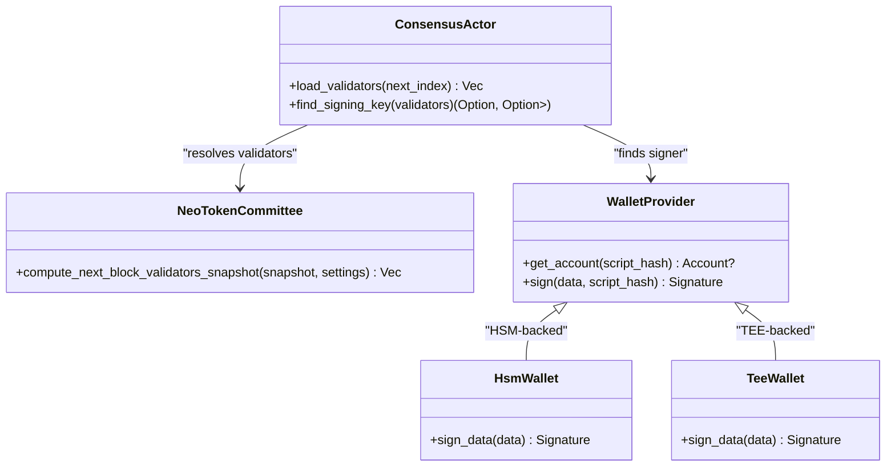
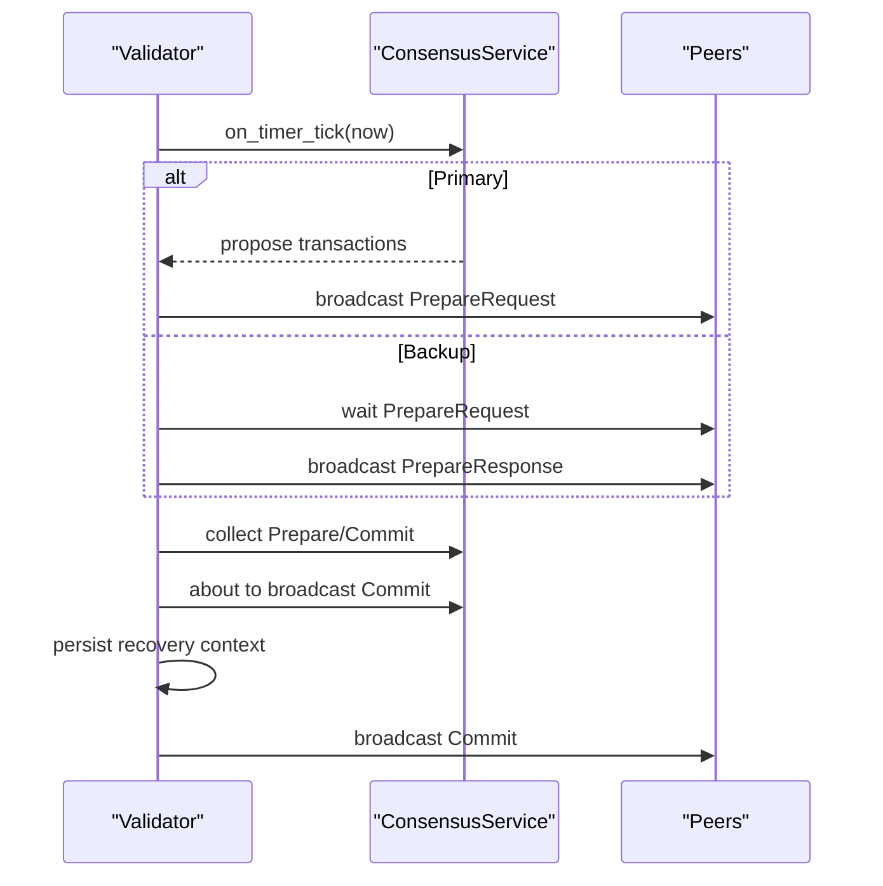
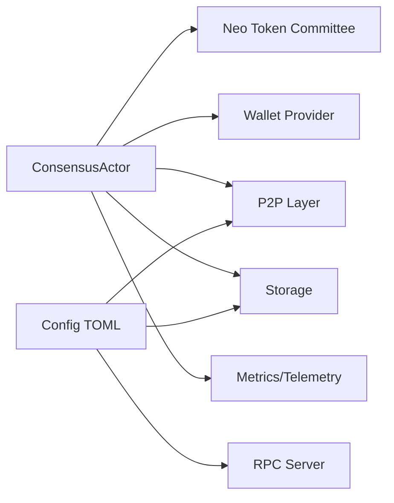

# Validator Operations

<cite>
**Referenced Files in This Document**
- [README.md](file://README.md)
- [OPERATIONS.md](file://docs/OPERATIONS.md)
- [MONITORING.md](file://docs/MONITORING.md)
- [SECURITY.md](file://docs/SECURITY.md)
- [mainnet.toml](file://config/mainnet.toml)
- [testnet.toml](file://config/testnet.toml)
- [consensus.rs](file://neo-node/src/consensus.rs)
- [lifecycle.rs](file://neo-consensus/src/service/lifecycle.rs)
- [metrics.rs](file://neo-node/src/metrics.rs)
- [hsm_wallet.rs](file://neo-node/src/hsm_wallet.rs)
- [tee_wallet.rs](file://neo-node/src/tee_wallet.rs)
- [protocol_settings.rs](file://neo-core/src/protocol_settings.rs)
- [committee.rs](file://neo-core/src/smart_contract/native/neo_token/committee.rs)
</cite>

## Table of Contents
1. [Introduction](#introduction)
2. [Project Structure](#project-structure)
3. [Core Components](#core-components)
4. [Architecture Overview](#architecture-overview)
5. [Detailed Component Analysis](#detailed-component-analysis)
6. [Dependency Analysis](#dependency-analysis)
7. [Performance Considerations](#performance-considerations)
8. [Troubleshooting Guide](#troubleshooting-guide)
9. [Conclusion](#conclusion)
10. [Appendices](#appendices)

## Introduction
This document provides operational guidance for running a Neo blockchain validator node using the neo-rs implementation. It covers setup requirements, cryptographic key management, the validator lifecycle from startup through consensus participation, block proposal and voting behavior, monitoring and alerting, troubleshooting common issues, and configuration/security hardening practices. The content is grounded in the repository’s configuration files, runtime modules, and operational documentation.

## Project Structure
The validator runs as the neo-node daemon and integrates with P2P networking, consensus, storage, RPC, and optional HSM/TEE backends. Configuration files define network identity, peers, storage, RPC exposure, and consensus toggles. Operational scripts and docs describe health checks, backups, and continuous validation workflows.

**Diagram sources**
- [consensus.rs:1-80](file://neo-node/src/consensus.rs#L1-L80)
- [lifecycle.rs:7-29](file://neo-consensus/src/service/lifecycle.rs#L7-L29)
- [metrics.rs:26-102](file://neo-node/src/metrics.rs#L26-L102)
- [mainnet.toml:4-39](file://config/mainnet.toml#L4-L39)
- [testnet.toml:4-39](file://config/testnet.toml#L4-L39)

**Section sources**
- [README.md:29-61](file://README.md#L29-L61)
- [mainnet.toml:4-39](file://config/mainnet.toml#L4-L39)
- [testnet.toml:4-39](file://config/testnet.toml#L4-L39)

## Core Components
- Consensus controller and actor: orchestrates dBFT rounds, selects transactions for proposals, validates incoming proposals, and broadcasts votes.
- Wallet integrations: software wallet, HSM-backed signing, and TEE-backed signing for secure consensus signing.
- Protocol settings and committee resolution: determines current validators and their indices.
- Telemetry and metrics: exposes health endpoints and Prometheus-compatible metrics for observability.
- Configuration: network magic, seeds, storage paths, RPC exposure, and consensus enablement flags.

Key responsibilities:
- Start consensus after each persisted block and manage view changes.
- Select mempool transactions into blocks respecting size and system fee limits.
- Validate incoming proposals and cast Prepare/Commit votes when conditions are met.
- Persist recovery logs before broadcasting Commit to improve liveness.

**Section sources**
- [consensus.rs:46-122](file://neo-node/src/consensus.rs#L46-L122)
- [consensus.rs:225-479](file://neo-node/src/consensus.rs#L225-L479)
- [consensus.rs:632-739](file://neo-node/src/consensus.rs#L632-L739)
- [lifecycle.rs:7-29](file://neo-consensus/src/service/lifecycle.rs#L7-L29)
- [protocol_settings.rs:115-161](file://neo-core/src/protocol_settings.rs#L115-L161)
- [committee.rs:273-317](file://neo-core/src/smart_contract/native/neo_token/committee.rs#L273-L317)
- [metrics.rs:26-102](file://neo-node/src/metrics.rs#L26-L102)

## Architecture Overview
The validator node composes several layers:
- Application layer: neo-node daemon wiring consensus, RPC, and telemetry.
- Consensus layer: dBFT service with lifecycle control, event handling, and recovery log persistence.
- Storage layer: RocksDB-backed chain state and optional StateRoot MPT trie.
- Networking layer: P2P message exchange for inventory, transactions, and consensus payloads.
- Security layer: Wallet/HSM/TEE for private key protection and signing.

**Diagram sources**
- [consensus.rs:517-607](file://neo-node/src/consensus.rs#L517-L607)
- [consensus.rs:364-479](file://neo-node/src/consensus.rs#L364-L479)
- [lifecycle.rs:7-29](file://neo-consensus/src/service/lifecycle.rs#L7-L29)

## Detailed Component Analysis

### Consensus Lifecycle and Round Management
- Startup and round initiation: after each block is persisted, the actor starts or resumes a new consensus round for the next height, loading validators and setting expected block time and transaction limits.
- Recovery: on start, the actor attempts to resume from a persisted context; before broadcasting Commit, it ensures recovery state is saved to disk to avoid losing progress across restarts.
- Timer-driven actions: a 1-second timer drives Prepare responses and ChangeView triggers based on missing transactions or timeouts.

**Diagram sources**
- [consensus.rs:364-479](file://neo-node/src/consensus.rs#L364-L479)
- [consensus.rs:517-607](file://neo-node/src/consensus.rs#L517-L607)
- [consensus.rs:525-546](file://neo-node/src/consensus.rs#L525-L546)

**Section sources**
- [consensus.rs:225-479](file://neo-node/src/consensus.rs#L225-L479)
- [consensus.rs:517-607](file://neo-node/src/consensus.rs#L517-L607)
- [lifecycle.rs:7-29](file://neo-consensus/src/service/lifecycle.rs#L7-L29)

### Block Proposal and Transaction Selection
- When requested by consensus, the actor selects transactions from the verified mempool up to configured limits:
  - Maximum transactions per block.
  - Maximum block size (including header overhead).
  - Maximum system fee per block.
- If TEE ordering is active, selection first follows TEE-ordered hashes, then falls back to sorted mempool order.

**Diagram sources**
- [consensus.rs:632-739](file://neo-node/src/consensus.rs#L632-L739)

**Section sources**
- [consensus.rs:632-739](file://neo-node/src/consensus.rs#L632-L739)

### Validator Identity and Key Management
- Validator set resolution:
  - At epoch boundaries or when needed, the actor queries the Neo token native contract to compute the next block validators snapshot.
  - Otherwise, it uses the current committee snapshot.
- Signing key discovery:
  - For each validator public key, derive the signature contract script hash and look up an unlocked account with a private key in the configured wallet provider.
  - Supports software wallets, HSM-backed accounts, and TEE-backed accounts.

**Diagram sources**
- [consensus.rs:293-341](file://neo-node/src/consensus.rs#L293-L341)
- [committee.rs:273-317](file://neo-core/src/smart_contract/native/neo_token/committee.rs#L273-L317)
- [hsm_wallet.rs:31-70](file://neo-node/src/hsm_wallet.rs#L31-L70)
- [tee_wallet.rs:365-400](file://neo-node/src/tee_wallet.rs#L365-L400)

**Section sources**
- [consensus.rs:293-341](file://neo-node/src/consensus.rs#L293-L341)
- [protocol_settings.rs:115-161](file://neo-core/src/protocol_settings.rs#L115-L161)
- [committee.rs:273-317](file://neo-core/src/smart_contract/native/neo_token/committee.rs#L273-L317)
- [hsm_wallet.rs:31-70](file://neo-node/src/hsm_wallet.rs#L31-L70)
- [tee_wallet.rs:365-400](file://neo-node/src/tee_wallet.rs#L365-L400)

### Voting and Message Flow
- Prepare phase:
  - Non-primary validators send PrepareResponse once they have the proposed transactions and verify them against the proposal.
- Commit phase:
  - Before broadcasting Commit, the node persists its recovery context to ensure durability across restarts.
- View changes:
  - On timeout or missing transactions, the actor triggers ChangeView with appropriate reasons.

**Diagram sources**
- [consensus.rs:525-607](file://neo-node/src/consensus.rs#L525-L607)
- [consensus.rs:741-800](file://neo-node/src/consensus.rs#L741-L800)

**Section sources**
- [consensus.rs:525-607](file://neo-node/src/consensus.rs#L525-L607)
- [consensus.rs:741-800](file://neo-node/src/consensus.rs#L741-L800)

### Monitoring and Metrics
- Health endpoints:
  - Enable the health server via CLI/environment to expose /healthz and /readyz; configure maximum header lag to fail health when sync lags.
- Metrics collection:
  - Update telemetry and Prometheus-compatible metrics for block height, header height, mempool size, peer count, timeouts, and state root acceptance/rejection.
- Operational signals:
  - Track block/header heights, peer counts, mempool size, RocksDB disk usage/IOPS, process memory/FD usage, and container health.

**Section sources**
- [MONITORING.md:5-35](file://docs/MONITORING.md#L5-L35)
- [metrics.rs:26-102](file://neo-node/src/metrics.rs#L26-L102)
- [README.md:260-276](file://README.md#L260-L276)

## Dependency Analysis
- Consensus depends on:
  - Neo token committee for validator set computation.
  - Wallet provider for signing (software, HSM, or TEE).
  - P2P for broadcasting consensus payloads and receiving peer messages.
  - Storage for recovery logs and chain state.
- Configuration influences:
  - Network magic and seed nodes determine connectivity.
  - Storage backend and path affect performance and durability.
  - RPC settings control external access surface.

**Diagram sources**
- [consensus.rs:293-341](file://neo-node/src/consensus.rs#L293-L341)
- [committee.rs:273-317](file://neo-core/src/smart_contract/native/neo_token/committee.rs#L273-L317)
- [mainnet.toml:4-39](file://config/mainnet.toml#L4-L39)
- [testnet.toml:4-39](file://config/testnet.toml#L4-L39)

**Section sources**
- [consensus.rs:293-341](file://neo-node/src/consensus.rs#L293-L341)
- [mainnet.toml:4-39](file://config/mainnet.toml#L4-L39)
- [testnet.toml:4-39](file://config/testnet.toml#L4-L39)

## Performance Considerations
- Storage:
  - Use RocksDB with adequate disk throughput and capacity; keep free space above recommended thresholds.
  - Tune import flush intervals and batch profiles during bootstrap/import phases.
- Networking:
  - Configure peer limits and compression; monitor connection churn and timeouts.
- Consensus timing:
  - Ensure system clock accuracy and stable CPU; the 1-second timer aids timely view changes.
- RPC:
  - Harden RPC exposure; use reverse proxy with rate limiting and authentication when exposing beyond localhost.
- Process resources:
  - Increase file descriptor limits; monitor FD usage and memory.

[No sources needed since this section provides general guidance]

## Troubleshooting Guide
Common issues and remediation steps:
- Missed blocks:
  - Check peer connectivity and network magic; validate seed list and ports; review logs for timeouts or invalid proposals; ensure recovery logs are persisted and not stale.
- Signature verification failures:
  - Verify wallet/HSM/TEE availability and that the correct validator account is unlocked and has keys; confirm script hash matches the validator’s public key; check HSM/TEE signing outputs and error logs.
- Network connectivity problems:
  - Confirm firewall rules for P2P/RPC ports; validate seed nodes reachability; inspect peer counts and connection churn; adjust max connections and timeouts if necessary.
- Storage errors:
  - Validate RocksDB permissions and disk space; restore from backup if corruption detected; resync from clean data directory if divergence is suspected.
- RPC overload:
  - Raise connection limits, place behind a reverse proxy, or move RPC to a dedicated instance.

Operational references:
- Daily checks, service control, data/storage procedures, and incident response basics are documented in the operations runbook.
- Continuous state-root validation scripts help detect divergence early.

**Section sources**
- [OPERATIONS.md:5-61](file://docs/OPERATIONS.md#L5-L61)
- [OPERATIONS.md:93-119](file://docs/OPERATIONS.md#L93-L119)
- [SECURITY.md:483-607](file://docs/SECURITY.md#L483-L607)

## Conclusion
Running a reliable Neo validator requires careful attention to configuration, key management, and observability. The neo-rs implementation provides robust consensus lifecycle management, secure signing options, and comprehensive monitoring hooks. By following the operational guidelines, tuning performance parameters, and proactively addressing issues, operators can maintain high availability and contribute effectively to consensus.

[No sources needed since this section summarizes without analyzing specific files]

## Appendices

### Configuration Guidelines for Optimal Validator Performance
- Network:
  - Set correct network magic and seed nodes for your target network.
  - Enable compression and tune broadcast history limits.
- Storage:
  - Use RocksDB with fast, durable disks; ensure sufficient free space and inode headroom.
- RPC:
  - Bind to localhost by default; enable hardened mode and authentication when exposing remotely.
- Consensus:
  - Enable consensus only on validator nodes; ensure auto-start aligns with operator workflow.
- Telemetry:
  - Enable health endpoints and scrape metrics for proactive alerting.

**Section sources**
- [mainnet.toml:4-39](file://config/mainnet.toml#L4-L39)
- [testnet.toml:4-39](file://config/testnet.toml#L4-L39)
- [README.md:260-288](file://README.md#L260-L288)
- [MONITORING.md:14-35](file://docs/MONITORING.md#L14-L35)

### Security Hardening Practices
- Use HSM or TEE for private key protection; prefer strict TEE mode for fail-closed operation.
- Harden RPC: disable CORS, require authentication, and restrict methods.
- Enforce P2P protections: message size limits, per-peer memory quotas, and rate limiting.
- Keep dependencies updated and apply security patches promptly.

**Section sources**
- [SECURITY.md:9-14](file://docs/SECURITY.md#L9-L14)
- [SECURITY.md:314-318](file://docs/SECURITY.md#L314-L318)
- [SECURITY.md:483-607](file://docs/SECURITY.md#L483-L607)