# Block Processing

<cite>
**Referenced Files in This Document**
- [block.rs](file://neo-core/src/ledger/block.rs)
- [block_header.rs](file://neo-core/src/ledger/block_header.rs)
- [genesis.rs](file://neo-core/src/ledger/genesis.rs)
- [validation.rs](file://neo-core/src/validation.rs)
- [block_processing.rs](file://neo-core/src/ledger/blockchain/block_processing.rs)
- [transaction.rs](file://neo-core/src/ledger/blockchain/transaction.rs)
- [state_root.rs](file://neo-core/src/state_service/state_root.rs)
- [header tests.rs](file://neo-core/src/network/p2p/payloads/header/tests.rs)
- [block p2p payload tests.rs](file://neo-core/src/network/p2p/payloads/block.rs)
- [merkle_tree_tests.rs](file://neo-core/tests/merkle_tree_tests.rs)
</cite>

## Table of Contents
1. Introduction
2. Project Structure
3. Core Components
4. Architecture Overview
5. Detailed Component Analysis
6. Dependency Analysis
7. Performance Considerations
8. Troubleshooting Guide
9. Conclusion

## Introduction
This document explains the Neo-RS block processing pipeline with a focus on validation, state root computation, and persistence from genesis to final storage. It covers header verification, transaction validation, Merkle tree construction, signature verification, and the relationship between blocks, headers, and blockchain state. Practical workflows, error handling patterns, and performance optimizations for high-throughput scenarios are included.

## Project Structure
Neo-RS organizes block-related logic across several modules:
- Ledger data models: Block, BlockHeader, Genesis utilities
- Validation utilities: size, timestamp, merkle root, witness checks
- Blockchain actor: block reception, caching, sequencing, and persistence
- State service: state root verification and persistence
- P2P payloads and tests: header/block verification flows and Merkle tree behavior

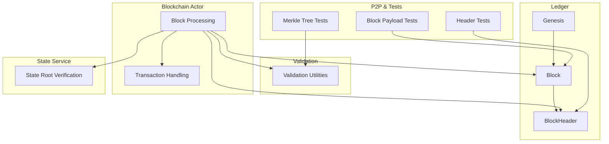

**Diagram sources**
- [block.rs:6-38](file://neo-core/src/ledger/block.rs#L6-L38)
- [block_header.rs:13-38](file://neo-core/src/ledger/block_header.rs#L13-L38)
- [genesis.rs:17-41](file://neo-core/src/ledger/genesis.rs#L17-L41)
- [validation.rs:12-126](file://neo-core/src/validation.rs#L12-L126)
- [block_processing.rs:13-138](file://neo-core/src/ledger/blockchain/block_processing.rs#L13-L138)
- [transaction.rs:72-146](file://neo-core/src/ledger/blockchain/transaction.rs#L72-L146)
- [state_root.rs:121-178](file://neo-core/src/state_service/state_root.rs#L121-L178)
- [header tests.rs:111-192](file://neo-core/src/network/p2p/payloads/header/tests.rs#L111-L192)
- [block p2p payload tests.rs:424-440](file://neo-core/src/network/p2p/payloads/block.rs#L424-L440)
- [merkle_tree_tests.rs:21-44](file://neo-core/tests/merkle_tree_tests.rs#L21-L44)

**Section sources**
- [block.rs:6-38](file://neo-core/src/ledger/block.rs#L6-L38)
- [block_header.rs:13-38](file://neo-core/src/ledger/block_header.rs#L13-L38)
- [genesis.rs:17-41](file://neo-core/src/ledger/genesis.rs#L17-L41)
- [validation.rs:12-126](file://neo-core/src/validation.rs#L12-L126)
- [block_processing.rs:13-138](file://neo-core/src/ledger/blockchain/block_processing.rs#L13-L138)
- [transaction.rs:72-146](file://neo-core/src/ledger/blockchain/transaction.rs#L72-L146)
- [state_root.rs:121-178](file://neo-core/src/state_service/state_root.rs#L121-L178)
- [header tests.rs:111-192](file://neo-core/src/network/p2p/payloads/header/tests.rs#L111-L192)
- [block p2p payload tests.rs:424-440](file://neo-core/src/network/p2p/payloads/block.rs#L424-L440)
- [merkle_tree_tests.rs:21-44](file://neo-core/tests/merkle_tree_tests.rs#L21-L44)

## Core Components
- Block and Header: Immutable structures representing chain units; header carries version, previous hash, merkle root, timestamp, nonce, index, primary index, next consensus, and witnesses. Hash is computed over unsigned bytes using SHA-256 and cached.
- Genesis: Deterministic creation of the first block based on protocol settings (no transactions, zero merkle root, fixed timestamp/nonce, next consensus derived from standby validators).
- Validation: Enforces block size limits, transaction count caps, timestamp bounds and progression, merkle root integrity, duplicate detection, witness script constraints, version support, and primary index range.
- Blockchain Actor: Orchestrates receiving blocks, verifying against header cache, caching unverified blocks, and persisting contiguous sequences efficiently.
- Transaction Handling: Mempool admission checks including existence, conflicts, and basic pre-validation before inclusion in blocks.
- State Root: Verifies designated state validator signatures and threshold for state roots, enabling optional external state service integration.

**Section sources**
- [block.rs:6-38](file://neo-core/src/ledger/block.rs#L6-L38)
- [block_header.rs:73-164](file://neo-core/src/ledger/block_header.rs#L73-L164)
- [genesis.rs:17-41](file://neo-core/src/ledger/genesis.rs#L17-L41)
- [validation.rs:128-409](file://neo-core/src/validation.rs#L128-L409)
- [block_processing.rs:13-138](file://neo-core/src/ledger/blockchain/block_processing.rs#L13-L138)
- [transaction.rs:72-146](file://neo-core/src/ledger/blockchain/transaction.rs#L72-L146)
- [state_root.rs:121-178](file://neo-core/src/state_service/state_root.rs#L121-L178)

## Architecture Overview
The block processing pipeline integrates multiple stages:
- Reception and deduplication via caches
- Header verification against previous block and protocol rules
- Transaction validation and Merkle root recomputation
- Optional state root verification for designated validators
- Sequential persistence with batching and backpressure

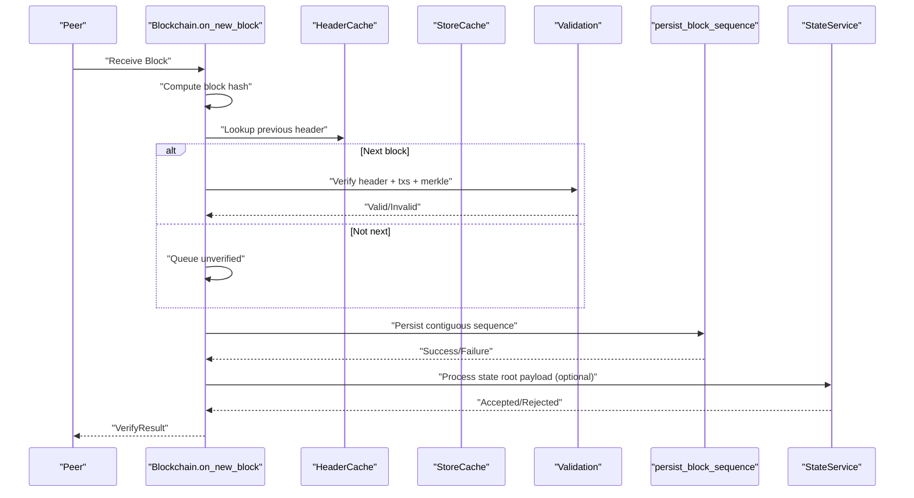

**Diagram sources**
- [block_processing.rs:13-138](file://neo-core/src/ledger/blockchain/block_processing.rs#L13-L138)
- [validation.rs:256-298](file://neo-core/src/validation.rs#L256-L298)
- [state_root.rs:121-178](file://neo-core/src/state_service/state_root.rs#L121-L178)

## Detailed Component Analysis

### Block and Header Model
- Block wraps a header and a list of transactions; exposes hash and index by delegating to header.
- Header serializes/deserializes unsigned fields, computes SHA-256 hash over those fields, and caches the result. Deserialization enforces exactly one witness per header.

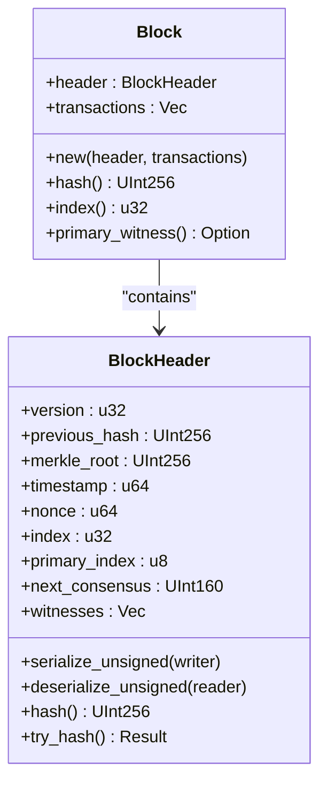

**Diagram sources**
- [block.rs:6-38](file://neo-core/src/ledger/block.rs#L6-L38)
- [block_header.rs:13-38](file://neo-core/src/ledger/block_header.rs#L13-L38)
- [block_header.rs:73-164](file://neo-core/src/ledger/block_header.rs#L73-L164)
- [block_header.rs:189-205](file://neo-core/src/ledger/block_header.rs#L189-L205)

**Section sources**
- [block.rs:6-38](file://neo-core/src/ledger/block.rs#L6-L38)
- [block_header.rs:73-164](file://neo-core/src/ledger/block_header.rs#L73-L164)
- [block_header.rs:189-205](file://neo-core/src/ledger/block_header.rs#L189-L205)

### Genesis Creation
- Genesis block is created deterministically from protocol settings: no transactions, zero merkle root, fixed timestamp/nonce, and next consensus derived from standby validators’ BFT multisig address.

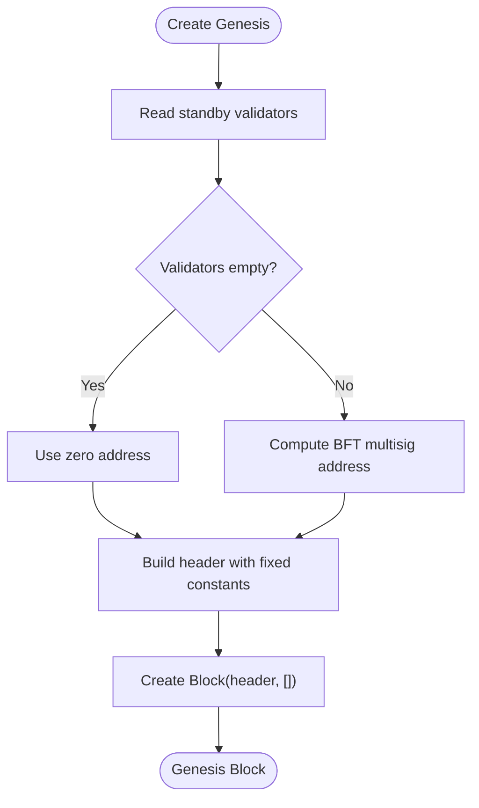

**Diagram sources**
- [genesis.rs:17-41](file://neo-core/src/ledger/genesis.rs#L17-L41)

**Section sources**
- [genesis.rs:17-41](file://neo-core/src/ledger/genesis.rs#L17-L41)

### Block Validation Workflow
Key validations enforced during block processing:
- Size and transaction count limits
- Timestamp bounds and strict progression
- Merkle root recomputation and match
- Duplicate transaction detection
- Witness script constraints and opcode checks
- Version and primary index validity

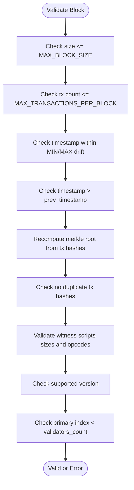

**Diagram sources**
- [validation.rs:128-409](file://neo-core/src/validation.rs#L128-L409)

**Section sources**
- [validation.rs:128-409](file://neo-core/src/validation.rs#L128-L409)

### Merkle Tree Construction and Verification
- Merkle root is computed from transaction hashes; empty blocks must have a zero merkle root.
- Tests demonstrate manual construction matching library implementation.

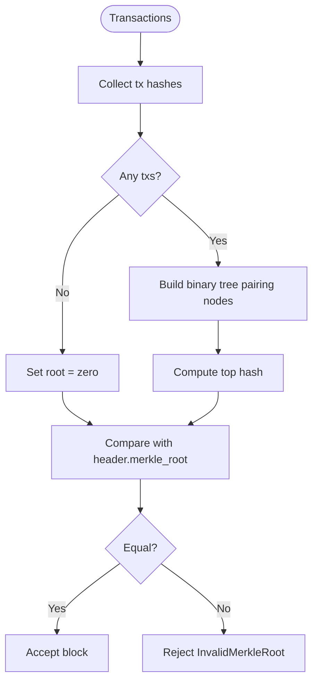

**Diagram sources**
- [validation.rs:256-298](file://neo-core/src/validation.rs#L256-L298)
- [merkle_tree_tests.rs:21-44](file://neo-core/tests/merkle_tree_tests.rs#L21-L44)

**Section sources**
- [validation.rs:256-298](file://neo-core/src/validation.rs#L256-L298)
- [merkle_tree_tests.rs:21-44](file://neo-core/tests/merkle_tree_tests.rs#L21-L44)

### Signature Verification and Header Consensus
- Header contains a single witness used for consensus signing; deserialization enforces exactly one witness.
- Header hash is computed over unsigned fields using SHA-256 and cached for performance.
- Tests validate sequential header verification and timestamp progression enforcement.

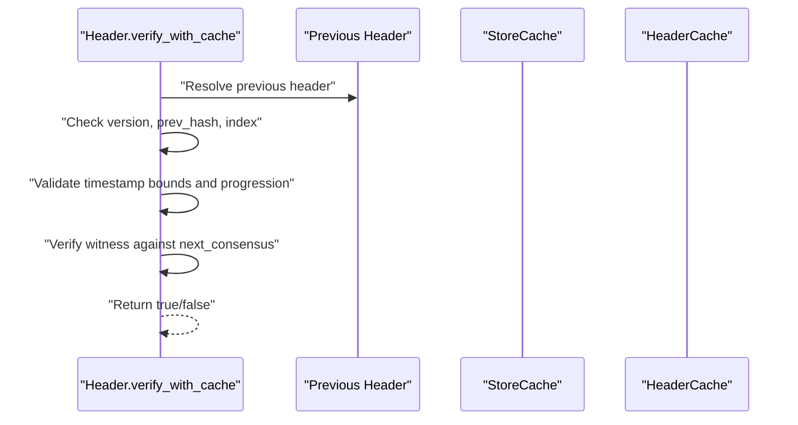

**Diagram sources**
- [block_header.rs:189-205](file://neo-core/src/ledger/block_header.rs#L189-L205)
- [header tests.rs:111-192](file://neo-core/src/network/p2p/payloads/header/tests.rs#L111-L192)

**Section sources**
- [block_header.rs:189-205](file://neo-core/src/ledger/block_header.rs#L189-L205)
- [header tests.rs:111-192](file://neo-core/src/network/p2p/payloads/header/tests.rs#L111-L192)

### Block Assembly and Persistence Pipeline
- Reception path computes block hash, checks duplicates, validates if it is the next block, and either persists immediately or queues for later.
- Persistence batches up to a configurable drain size, yielding to process other messages and resuming via self-scheduled drain tasks.
- Unverified blocks are stored by index to enable contiguous draining even when out-of-order arrivals occur.

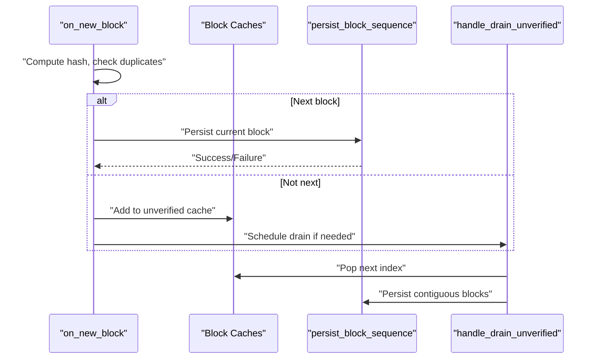

**Diagram sources**
- [block_processing.rs:13-138](file://neo-core/src/ledger/blockchain/block_processing.rs#L13-L138)
- [block_processing.rs:168-220](file://neo-core/src/ledger/blockchain/block_processing.rs#L168-L220)
- [block_processing.rs:222-295](file://neo-core/src/ledger/blockchain/block_processing.rs#L222-L295)

**Section sources**
- [block_processing.rs:13-138](file://neo-core/src/ledger/blockchain/block_processing.rs#L13-L138)
- [block_processing.rs:168-220](file://neo-core/src/ledger/blockchain/block_processing.rs#L168-L220)
- [block_processing.rs:222-295](file://neo-core/src/ledger/blockchain/block_processing.rs#L222-L295)

### State Root Verification and Integration
- State roots carry a witness that must be verified against designated state validators at the given index.
- The verification builds the expected multi-signature redeem script from the validator set and ensures the witness matches and satisfies the BFT threshold.
- Extensible payloads carrying state roots are processed optionally; when disabled, they are accepted but not persisted.

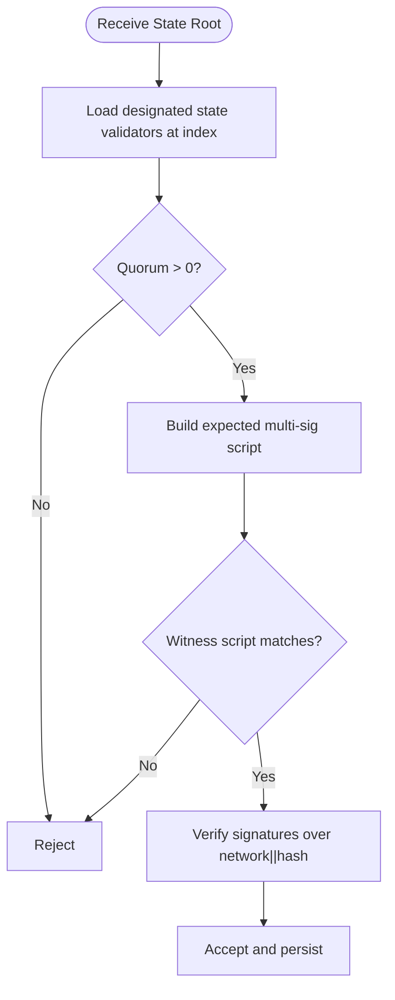

**Diagram sources**
- [state_root.rs:121-178](file://neo-core/src/state_service/state_root.rs#L121-L178)
- [block_processing.rs:424-463](file://neo-core/src/ledger/blockchain/block_processing.rs#L424-L463)

**Section sources**
- [state_root.rs:121-178](file://neo-core/src/state_service/state_root.rs#L121-L178)
- [block_processing.rs:424-463](file://neo-core/src/ledger/blockchain/block_processing.rs#L424-L463)

### Relationship Between Blocks, Headers, and State
- Each Block contains a Header and Transactions; the Header’s merkle root commits to the transactions.
- The Header’s next_consensus points to the validator set responsible for signing the next block.
- State roots provide an off-chain commitment to application state at specific indices, signed by designated state validators.

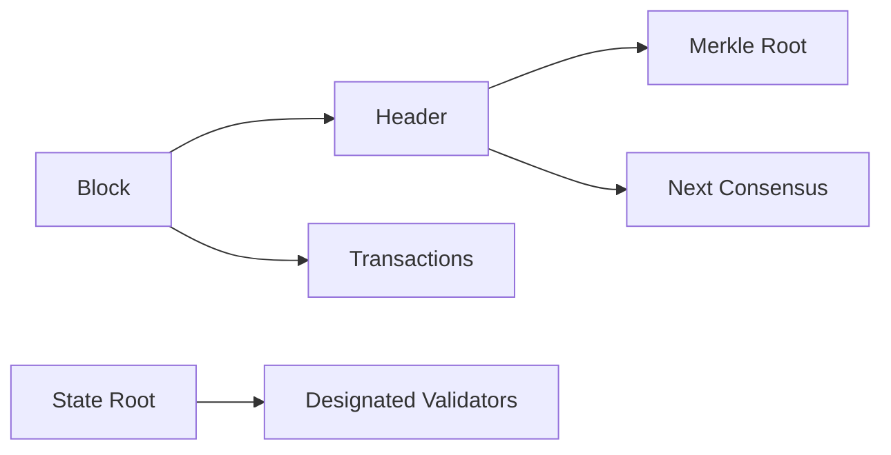

**Diagram sources**
- [block.rs:6-38](file://neo-core/src/ledger/block.rs#L6-L38)
- [block_header.rs:13-38](file://neo-core/src/ledger/block_header.rs#L13-L38)
- [state_root.rs:121-178](file://neo-core/src/state_service/state_root.rs#L121-L178)

**Section sources**
- [block.rs:6-38](file://neo-core/src/ledger/block.rs#L6-L38)
- [block_header.rs:13-38](file://neo-core/src/ledger/block_header.rs#L13-L38)
- [state_root.rs:121-178](file://neo-core/src/state_service/state_root.rs#L121-L178)

## Dependency Analysis
- Block depends on BlockHeader for hashing and serialization.
- Validation depends on cryptographic primitives (SHA-256, MerkleTree) and protocol constants.
- Blockchain actor depends on header cache, store cache, and system context to coordinate verification and persistence.
- State service depends on role management to resolve designated validators and native helpers to build multisig scripts.

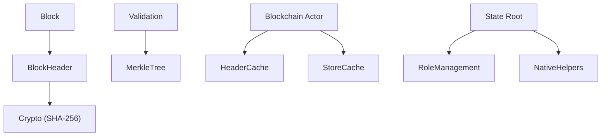

**Diagram sources**
- [block_header.rs:143-164](file://neo-core/src/ledger/block_header.rs#L143-L164)
- [validation.rs:256-298](file://neo-core/src/validation.rs#L256-L298)
- [block_processing.rs:13-138](file://neo-core/src/ledger/blockchain/block_processing.rs#L13-L138)
- [state_root.rs:121-178](file://neo-core/src/state_service/state_root.rs#L121-L178)

**Section sources**
- [block_header.rs:143-164](file://neo-core/src/ledger/block_header.rs#L143-L164)
- [validation.rs:256-298](file://neo-core/src/validation.rs#L256-L298)
- [block_processing.rs:13-138](file://neo-core/src/ledger/blockchain/block_processing.rs#L13-L138)
- [state_root.rs:121-178](file://neo-core/src/state_service/state_root.rs#L121-L178)

## Performance Considerations
- Header hash caching avoids repeated SHA-256 computations.
- Batched persistence with a drain limit yields control to process other messages, improving responsiveness under load.
- Unverified block cache eviction strategy keeps lower indices to maintain contiguous sequences.
- Early rejection checks (size, tx count, timestamp bounds) reduce expensive operations.
- Merkle root computation uses efficient tree construction; empty blocks shortcut to zero root.

[No sources needed since this section provides general guidance]

## Troubleshooting Guide
Common validation errors and their meanings:
- BlockTooLarge: Serialized block exceeds maximum allowed size.
- TooManyTransactions: Transaction count exceeds protocol limit.
- TimestampTooOld/TimestampTooFarInFuture: Timestamp outside acceptable bounds relative to genesis and current time.
- TimestampNotIncreasing: Current timestamp not strictly greater than previous block’s timestamp.
- InvalidMerkleRoot: Recomputed merkle root does not match header field.
- DuplicateTransactions: Block contains repeated transaction hashes.
- InvalidWitnessScript: Invocation/verification scripts exceed size limits or contain invalid opcodes.
- UnsupportedVersion: Block version not supported.
- InvalidPrimaryIndex: Primary index out of range for active validators.

Operational tips:
- If verification fails due to missing previous header, ensure header cache or store has the prior block.
- For state root rejections, verify designated validators and witness script match the expected multisig configuration.
- When persistence stalls, check batch limits and unverified cache eviction logs.

**Section sources**
- [validation.rs:36-126](file://neo-core/src/validation.rs#L36-L126)
- [block_processing.rs:13-138](file://neo-core/src/ledger/blockchain/block_processing.rs#L13-L138)
- [state_root.rs:121-178](file://neo-core/src/state_service/state_root.rs#L121-L178)

## Conclusion
Neo-RS implements a robust block processing pipeline that validates headers, transactions, and state roots while ensuring efficient persistence and scalability. The design separates concerns across ledger models, validation utilities, the blockchain actor, and the state service, enabling clear error handling and performance optimizations suitable for high-throughput environments.

[No sources needed since this section summarizes without analyzing specific files]