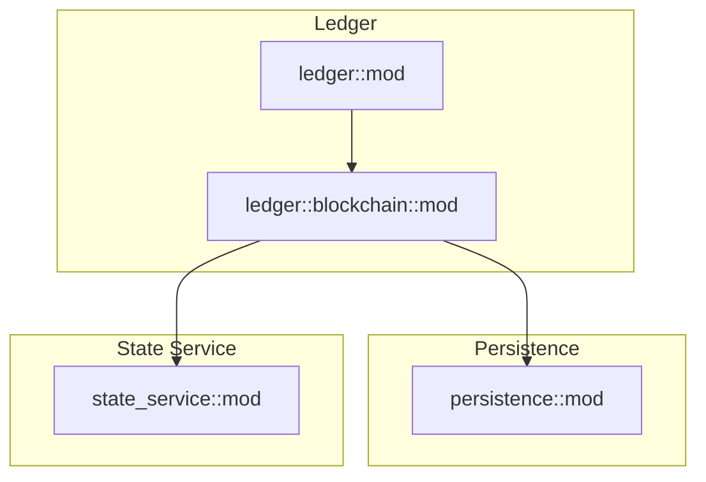
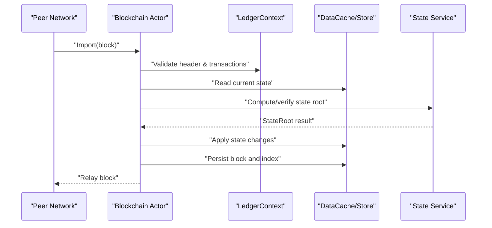
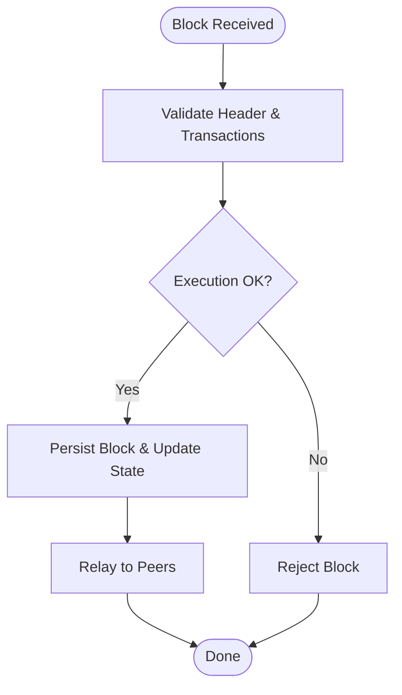
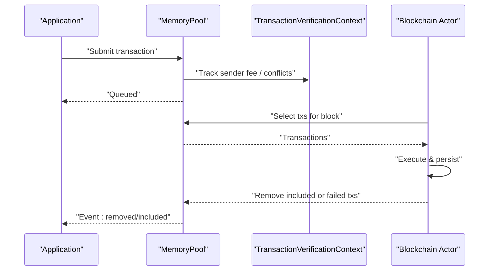
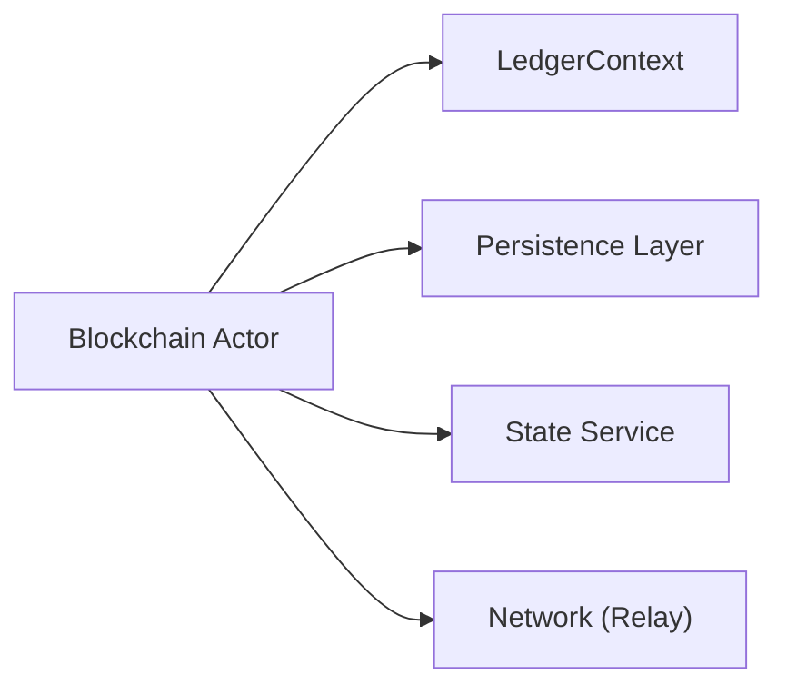

# Blockchain Ledger

<cite>
**Referenced Files in This Document**
- [mod.rs](file://neo-core/src/ledger/mod.rs)
- [blockchain_mod.rs](file://neo-core/src/ledger/blockchain/mod.rs)
- [state_service_mod.rs](file://neo-core/src/state_service/mod.rs)
- [persistence_mod.rs](file://neo-core/src/persistence/mod.rs)
</cite>

## Table of Contents
1. Introduction
2. Project Structure
3. Core Components
4. Architecture Overview
5. Detailed Component Analysis
6. Dependency Analysis
7. Performance Considerations
8. Troubleshooting Guide
9. Conclusion

## Introduction
This document explains the Neo-RS blockchain ledger system with a focus on:
- Block processing pipeline: validation, transaction inclusion, and state root computation
- Transaction lifecycle: from mempool to finalization, including fee calculation, witness validation, and execution context management
- Blockchain state management: account balances, contract storage, and Merkle tree construction
- Block header structure, chain synchronization, and fork resolution strategies
- Practical workflows, error handling patterns, and performance optimizations for high-throughput scenarios

The documentation is grounded in the repository’s core modules that implement the ledger, block processing, persistence, and state service.

## Project Structure
At a high level, the ledger subsystem is organized into:
- Ledger module: block structures, header, memory pool, verification context, and the blockchain actor
- Persistence layer: data cache, store abstractions, and write batching
- State service: state root computation, caching, and verification hooks

**Diagram sources**
- [mod.rs:15-65](file://neo-core/src/ledger/mod.rs#L15-L65)
- [blockchain_mod.rs:1-80](file://neo-core/src/ledger/blockchain/mod.rs#L1-L80)
- [persistence_mod.rs:1-45](file://neo-core/src/persistence/mod.rs#L1-L45)
- [state_service_mod.rs:1-38](file://neo-core/src/state_service/mod.rs#L1-L38)

**Section sources**
- [mod.rs:15-65](file://neo-core/src/ledger/mod.rs#L15-L65)
- [blockchain_mod.rs:1-80](file://neo-core/src/ledger/blockchain/mod.rs#L1-L80)
- [persistence_mod.rs:1-45](file://neo-core/src/persistence/mod.rs#L1-L45)
- [state_service_mod.rs:1-38](file://neo-core/src/state_service/mod.rs#L1-L38)

## Core Components
- Ledger module entrypoint exposes block, header, memory pool, verification context, and re-exported types for runtime features. It documents the canonical memory pool behavior and event callbacks for transaction lifecycle.
- Blockchain actor coordinates block import, verification, persistence, and relaying, with caches for verified and unverified blocks and an inventory cache for reverification.
- Persistence layer provides a tracked DataCache over pluggable stores, read-only and cached reads, and batched writes.
- State service implements state root computation and verification, with caching and metrics, and integrates via extensible payload category.

Key responsibilities:
- Block processing orchestration and caching strategy
- Transaction verification context and mempool operations
- Persistent state updates and snapshotting
- State root generation and validation

**Section sources**
- [mod.rs:1-65](file://neo-core/src/ledger/mod.rs#L1-L65)
- [blockchain_mod.rs:1-127](file://neo-core/src/ledger/blockchain/mod.rs#L1-L127)
- [persistence_mod.rs:1-45](file://neo-core/src/persistence/mod.rs#L1-L45)
- [state_service_mod.rs:1-38](file://neo-core/src/state_service/mod.rs#L1-L38)

## Architecture Overview
The ledger architecture centers around the Blockchain actor, which orchestrates:
- Importing blocks (validation and execution)
- Persisting validated blocks and updating chain state
- Relaying blocks to peers
- Managing caches for verified/unverified blocks and inventory payloads
- Integrating with the state service for state root computation and verification

**Diagram sources**
- [blockchain_mod.rs:1-80](file://neo-core/src/ledger/blockchain/mod.rs#L1-L80)
- [persistence_mod.rs:1-45](file://neo-core/src/persistence/mod.rs#L1-L45)
- [state_service_mod.rs:1-38](file://neo-core/src/state_service/mod.rs#L1-L38)

## Detailed Component Analysis

### Block Processing Pipeline
The Blockchain actor handles block import through a structured flow:
- Receive block via Import command
- Validate block header and transactions
- Execute transactions using the application engine
- Persist block and update chain state
- Relay block to connected peers
- Emit plugin events for persistence and commit phases

Caching strategy:
- Verified block cache to avoid reprocessing
- Unverified block cache for out-of-order arrivals
- Inventory cache to deduplicate reverification requests

**Diagram sources**
- [blockchain_mod.rs:1-80](file://neo-core/src/ledger/blockchain/mod.rs#L1-L80)

**Section sources**
- [blockchain_mod.rs:1-127](file://neo-core/src/ledger/blockchain/mod.rs#L1-L127)

### Transaction Lifecycle (Mempool to Finalization)
The ledger module documents the MemoryPool as the canonical implementation with:
- Per-sender fee tracking and oracle responses in the verification context
- Conflict attribute detection and resolution
- Verified and unverified queues
- Reverification logic and event callbacks for lifecycle transitions

Typical flow:
- Transaction enters mempool and is queued for verification
- Verification context tracks sender fees and conflict state
- On block inclusion, transactions are executed; failures may trigger removal
- Removal reasons and events are emitted for downstream consumers

**Diagram sources**
- [mod.rs:1-65](file://neo-core/src/ledger/mod.rs#L1-L65)

**Section sources**
- [mod.rs:1-65](file://neo-core/src/ledger/mod.rs#L1-L65)

### Fee Calculation, Witness Validation, and Execution Context Management
- Fee calculation and per-sender fee tracking are managed within the transaction verification context used by the memory pool.
- Witness validation occurs during transaction verification prior to execution; invalid witnesses cause rejection before inclusion.
- Execution context is established per transaction during block execution, ensuring isolation and consistent state access.

Practical implications:
- Accurate fee accounting prevents double-spending and ensures economic security
- Witness validation enforces authorization policies at the protocol level
- Execution context guarantees deterministic state transitions

**Section sources**
- [mod.rs:1-65](file://neo-core/src/ledger/mod.rs#L1-L65)

### Blockchain State Management (Balances, Storage, Merkle Tree)
- Account balances and contract storage are updated via the persistence layer’s DataCache, which tracks changes and applies them atomically.
- The state service computes and verifies the state root, enabling efficient integrity checks and synchronization.
- Merkle tree construction underpins state roots and block hashes, ensuring tamper-evident chains.

Operational notes:
- Use DataCache for tracked writes and Store for durable persistence
- Leverage state root verification to validate chain consistency across nodes

**Section sources**
- [persistence_mod.rs:1-45](file://neo-core/src/persistence/mod.rs#L1-L45)
- [state_service_mod.rs:1-38](file://neo-core/src/state_service/mod.rs#L1-L38)

### Block Header Structure and Chain Synchronization
- Block headers contain metadata necessary for consensus and linking blocks in the chain.
- The Blockchain actor includes mechanisms to handle out-of-order blocks via unverified caches and to relay blocks to peers for synchronization.
- Fast sync mode tolerates certain failures while continuing to synchronize, improving resilience.

Synchronization highlights:
- Caches prevent redundant work and support parallel download windows
- Relaying ensures network propagation and peer discovery

**Section sources**
- [blockchain_mod.rs:1-127](file://neo-core/src/ledger/blockchain/mod.rs#L1-L127)

### Fork Resolution Strategies
- Fork resolution relies on validating headers and transactions against protocol rules and applying state changes only when valid.
- The unverified block cache allows temporary buffering while the node determines the canonical chain.
- State root verification helps detect divergent histories and select the correct branch.

[No additional sources needed beyond those already cited for block processing and state service]

## Dependency Analysis
The ledger depends on:
- LedgerContext for shared state (headers, blocks, transactions)
- Persistence layer for state reads/writes and batched commits
- State service for state root computation and verification
- Network components for relaying and peer communication

**Diagram sources**
- [blockchain_mod.rs:1-80](file://neo-core/src/ledger/blockchain/mod.rs#L1-L80)
- [persistence_mod.rs:1-45](file://neo-core/src/persistence/mod.rs#L1-L45)
- [state_service_mod.rs:1-38](file://neo-core/src/state_service/mod.rs#L1-L38)

**Section sources**
- [blockchain_mod.rs:1-127](file://neo-core/src/ledger/blockchain/mod.rs#L1-L127)
- [persistence_mod.rs:1-45](file://neo-core/src/persistence/mod.rs#L1-L45)
- [state_service_mod.rs:1-38](file://neo-core/src/state_service/mod.rs#L1-L38)

## Performance Considerations
Optimization techniques observed in the codebase:
- Caches:
  - Verified block cache limits memory growth and avoids reprocessing
  - Unverified block cache supports out-of-order delivery and fast sync windows
  - Inventory cache reduces duplicate reverification work
- Batched writes:
  - WriteBatchBuffer and DataCache minimize disk I/O and ensure atomicity
- Read caching:
  - ReadCache and ReadOnlyStore improve query performance
- Resilience:
  - Fast sync continues despite transient failures, maintaining throughput

Recommendations:
- Tune cache sizes based on network conditions and hardware
- Monitor write batch stats and adjust flush thresholds
- Profile VM execution paths to identify hotspots

[No sources needed since this section provides general guidance derived from referenced modules]

## Troubleshooting Guide
Common issues and patterns:
- Block hash computation failure during persistence triggers warnings and skips persistence for that block
- Persistence errors are logged with block index and hash, aiding diagnostics
- In fast sync mode, some blocks may fail but synchronization proceeds

Debugging steps:
- Inspect logs for warnings about hash computation or persistence failures
- Check state root verification results for divergence indicators
- Review mempool events for transaction removal reasons

**Section sources**
- [blockchain_mod.rs:156-201](file://neo-core/src/ledger/blockchain/mod.rs#L156-L201)

## Conclusion
The Neo-RS ledger system implements a robust, actor-based block processing pipeline with strong separation of concerns:
- Blockchain orchestrates validation, execution, persistence, and relaying
- Persistence provides tracked, batched state updates
- State service ensures integrity via state root computation and verification
- Caches and fast sync enable high-throughput operation

By leveraging these components, developers can build reliable, performant nodes that maintain protocol consistency and resilience under load.