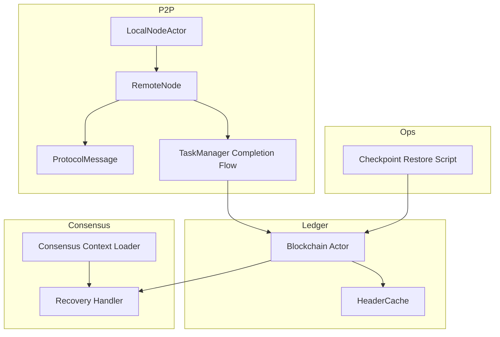
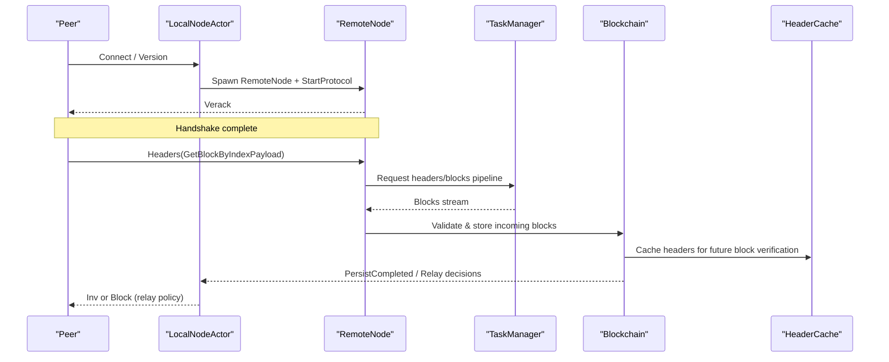
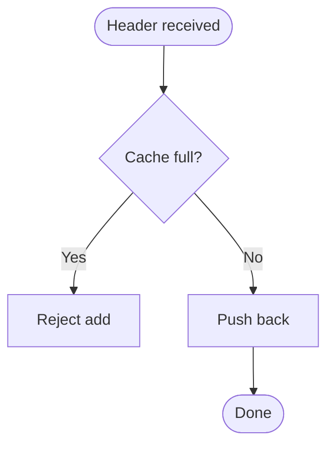
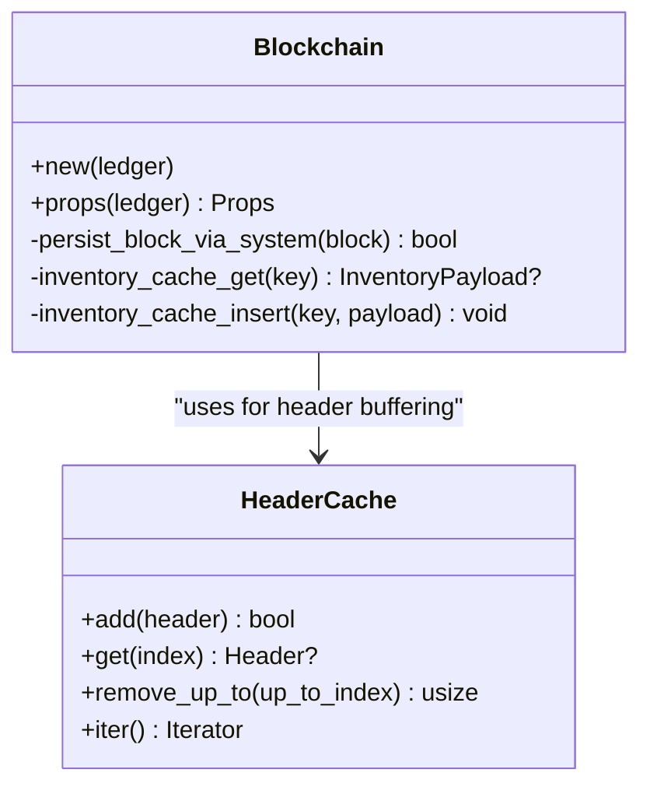
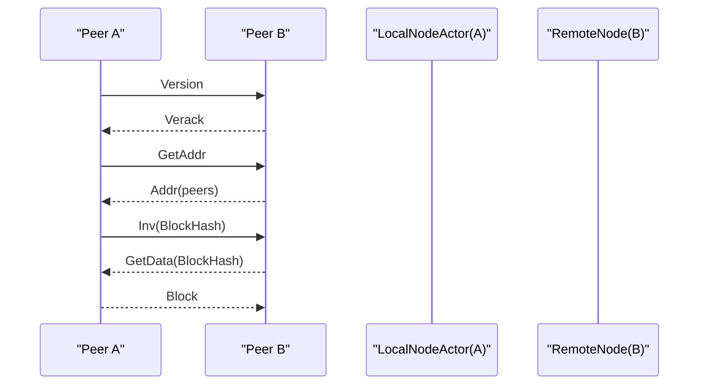
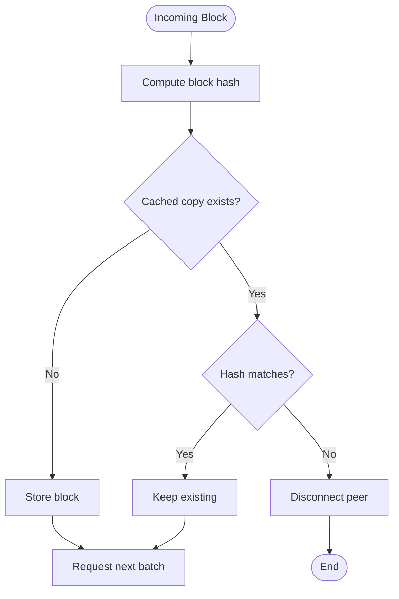
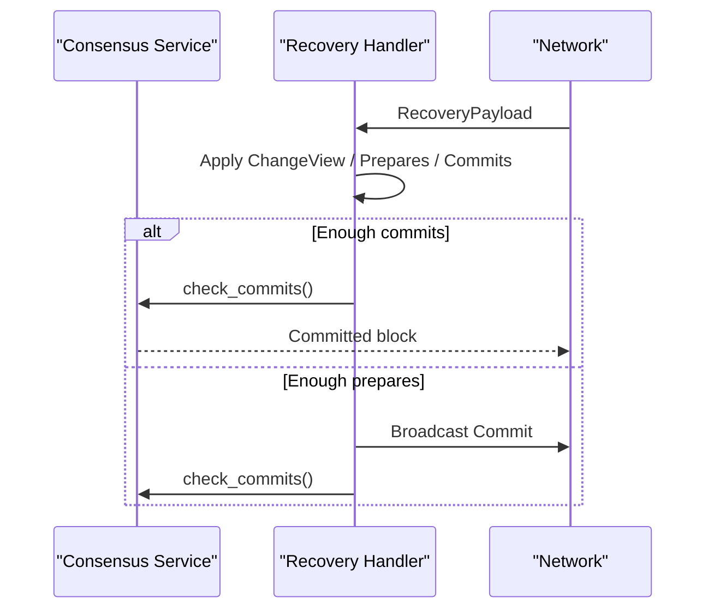
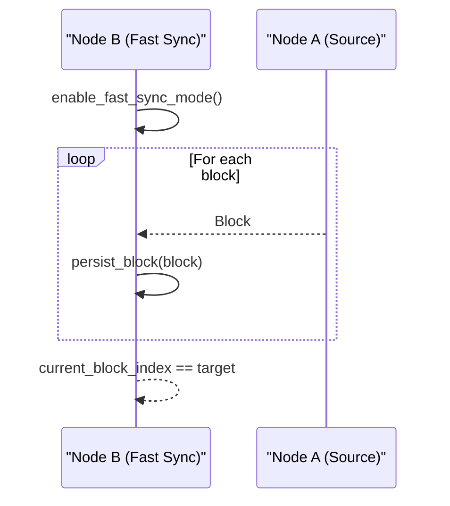
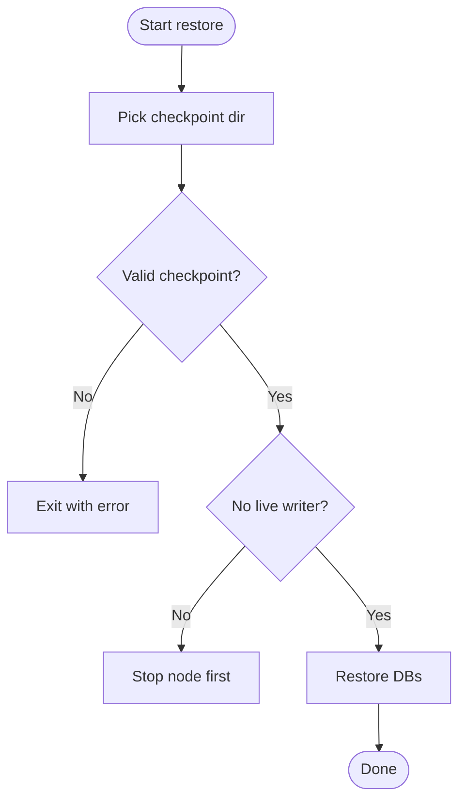
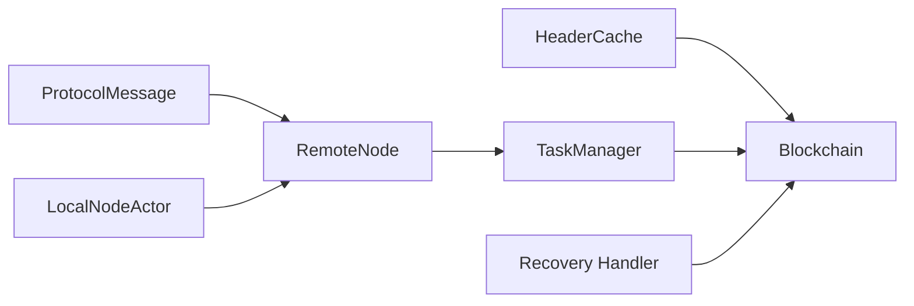

# Chain Synchronization

<cite>
**Referenced Files in This Document**
- [header_cache.rs](file://neo-core/src/ledger/header_cache.rs)
- [blockchain/mod.rs](file://neo-core/src/ledger/blockchain/mod.rs)
- [messages.rs](file://neo-core/src/network/p2p/messages.rs)
- [remote_node.rs](file://neo-core/src/network/p2p/remote_node.rs)
- [local_node/actor.rs](file://neo-core/src/network/p2p/local_node/actor.rs)
- [task_manager/completion_flow.rs](file://neo-core/src/network/p2p/task_manager/completion_flow.rs)
- [block_validation.rs](file://neo-core/src/network/p2p/task_manager/block_validation.rs)
- [recovery.rs](file://neo-consensus/src/service/handlers/recovery.rs)
- [consensus.rs](file://neo-node/src/consensus.rs)
- [restore-checkpoint.sh](file://scripts/restore-checkpoint.sh)
- [fast_sync_p2p_e2e_tests.rs](file://tests/tests/fast_sync_p2p_e2e_tests.rs)
</cite>

## Table of Contents
1. Introduction
2. Project Structure
3. Core Components
4. Architecture Overview
5. Detailed Component Analysis
6. Dependency Analysis
7. Performance Considerations
8. Troubleshooting Guide
9. Conclusion

## Introduction
This document explains Neo-RS chain synchronization mechanisms with a focus on:
- Header cache for efficient block header storage and retrieval during sync
- Blockchain synchronization protocols, peer discovery, and block propagation
- Fork resolution strategies, chain selection algorithms, and rollback mechanisms
- Fast sync capabilities, checkpoint-based synchronization, and recovery procedures
- Practical sync workflows, network communication patterns, and troubleshooting
- Performance optimization for large blockchain datasets and network latency handling

## Project Structure
Neo-RS implements synchronization across several modules:
- Ledger layer: block processing, caching, and persistence orchestration
- P2P layer: peer management, message framing, inventory, and fast-sync task coordination
- Consensus layer: recovery and commit logic to stabilize the chain
- Node bootstrap: checkpoint restore and consensus context loading

**Diagram sources**
- [blockchain/mod.rs:1-239](file://neo-core/src/ledger/blockchain/mod.rs#L1-L239)
- [header_cache.rs:1-171](file://neo-core/src/ledger/header_cache.rs#L1-L171)
- [messages.rs:1-486](file://neo-core/src/network/p2p/messages.rs#L1-L486)
- [remote_node.rs:1-800](file://neo-core/src/network/p2p/remote_node.rs#L1-L800)
- [local_node/actor.rs:1-791](file://neo-core/src/network/p2p/local_node/actor.rs#L1-L791)
- [task_manager/completion_flow.rs:71-97](file://neo-core/src/network/p2p/task_manager/completion_flow.rs#L71-L97)
- [recovery.rs:284-315](file://neo-consensus/src/service/handlers/recovery.rs#L284-L315)
- [consensus.rs:405-437](file://neo-node/src/consensus.rs#L405-L437)
- [restore-checkpoint.sh:77-117](file://scripts/restore-checkpoint.sh#L77-L117)

**Section sources**
- [blockchain/mod.rs:1-239](file://neo-core/src/ledger/blockchain/mod.rs#L1-L239)
- [messages.rs:1-486](file://neo-core/src/network/p2p/messages.rs#L1-L486)
- [remote_node.rs:1-800](file://neo-core/src/network/p2p/remote_node.rs#L1-L800)
- [local_node/actor.rs:1-791](file://neo-core/src/network/p2p/local_node/actor.rs#L1-L791)

## Core Components
- HeaderCache: thread-safe bounded buffer for headers arriving before blocks; supports add, get by index, iteration, removal up to height, and capacity checks.
- Blockchain actor: orchestrates import, verification, persistence, relay, and maintains caches for verified and unverified blocks.
- P2P messaging: strongly typed ProtocolMessage enum covering version handshake, GetHeaders/Headers, GetBlocks/Inv/GetData, Block/Transaction broadcast, and more.
- RemoteNode: per-peer protocol state machine enforcing handshake order, compression negotiation, inventory deduplication, and outbound queueing.
- LocalNodeActor: peer lifecycle, connection limits, seed resolution, GetAddr requests, and inventory relay policy (INV vs direct send).
- TaskManager completion flow: validates incoming blocks, stores or discards based on hash match, and keeps fast-sync pipeline full.
- Consensus recovery: reprocesses recovery payloads to advance view and commit when enough prepare/commit messages are available.
- Checkpoint restore: script-driven restoration from validated snapshots with safety checks.

**Section sources**
- [header_cache.rs:1-171](file://neo-core/src/ledger/header_cache.rs#L1-L171)
- [blockchain/mod.rs:108-239](file://neo-core/src/ledger/blockchain/mod.rs#L108-L239)
- [messages.rs:117-269](file://neo-core/src/network/p2p/messages.rs#L117-L269)
- [remote_node.rs:54-176](file://neo-core/src/network/p2p/remote_node.rs#L54-L176)
- [local_node/actor.rs:11-22](file://neo-core/src/network/p2p/local_node/actor.rs#L11-L22)
- [task_manager/completion_flow.rs:71-97](file://neo-core/src/network/p2p/task_manager/completion_flow.rs#L71-L97)
- [recovery.rs:284-315](file://neo-consensus/src/service/handlers/recovery.rs#L284-L315)
- [restore-checkpoint.sh:77-117](file://scripts/restore-checkpoint.sh#L77-L117)

## Architecture Overview
The synchronization stack coordinates peers, downloads headers and blocks, validates and persists them, and stabilizes via consensus recovery when needed.

**Diagram sources**
- [remote_node.rs:208-400](file://neo-core/src/network/p2p/remote_node.rs#L208-L400)
- [messages.rs:117-269](file://neo-core/src/network/p2p/messages.rs#L117-L269)
- [task_manager/completion_flow.rs:71-97](file://neo-core/src/network/p2p/task_manager/completion_flow.rs#L71-L97)
- [blockchain/mod.rs:151-201](file://neo-core/src/ledger/blockchain/mod.rs#L151-L201)
- [header_cache.rs:16-104](file://neo-core/src/ledger/header_cache.rs#L16-L104)

## Detailed Component Analysis

### Header Cache System
- Purpose: Buffer headers that arrive before their corresponding blocks to speed up verification and reduce redundant fetches.
- Data structure: Bounded VecDeque protected by RwLock; capacity set for faster sync.
- Operations:
  - Add with capacity guard
  - Get by index using first_index offset arithmetic
  - Iteration via snapshot iterator
  - Remove up to a given height to free space
  - last() and count() for monitoring
- Complexity: O(1) amortized push/pop; O(1) get by index via offset; O(n) remove_up_to proportional to removed items.

**Diagram sources**
- [header_cache.rs:16-104](file://neo-core/src/ledger/header_cache.rs#L16-L104)

**Section sources**
- [header_cache.rs:1-171](file://neo-core/src/ledger/header_cache.rs#L1-L171)

### Blockchain Synchronization and Caching
- The Blockchain actor manages:
  - Import of blocks and transactions
  - Verification and execution
  - Persistence via system integration
  - Relay to peers
  - Caches for verified and unverified blocks with bounded sizes to prevent memory growth
- Fast sync mode tolerates certain persistence failures while continuing to sync.

**Diagram sources**
- [blockchain/mod.rs:118-239](file://neo-core/src/ledger/blockchain/mod.rs#L118-L239)
- [header_cache.rs:16-104](file://neo-core/src/ledger/header_cache.rs#L16-L104)

**Section sources**
- [blockchain/mod.rs:1-239](file://neo-core/src/ledger/blockchain/mod.rs#L1-L239)

### P2P Protocols, Peer Discovery, and Block Propagation
- Message types include Version/Verack, GetHeaders/Headers, GetBlocks/Inv/GetData, Block/Transaction, and filters.
- RemoteNode enforces handshake order, negotiates compression, tracks known/sent hashes, and queues outbound messages.
- LocalNodeActor handles peer lifecycle, connection limits, seed resolution, GetAddr requests, and relay policies:
  - INV announcement for bandwidth efficiency
  - Direct send for targeted transfers
  - Height-aware relaying to avoid sending already-known blocks

**Diagram sources**
- [messages.rs:117-269](file://neo-core/src/network/p2p/messages.rs#L117-L269)
- [remote_node.rs:208-533](file://neo-core/src/network/p2p/remote_node.rs#L208-L533)
- [local_node/actor.rs:512-546](file://neo-core/src/network/p2p/local_node/actor.rs#L512-L546)

**Section sources**
- [messages.rs:1-486](file://neo-core/src/network/p2p/messages.rs#L1-L486)
- [remote_node.rs:1-800](file://neo-core/src/network/p2p/remote_node.rs#L1-L800)
- [local_node/actor.rs:1-791](file://neo-core/src/network/p2p/local_node/actor.rs#L1-L791)

### Incoming Block Validation and Fast-Sync Pipeline
- Task manager validates incoming blocks:
  - Computes block hash
  - Compares with cached copy if present
  - Stores new blocks or disconnects on conflicts
  - Keeps pipeline full by requesting more after each delivered block

**Diagram sources**
- [task_manager/completion_flow.rs:71-97](file://neo-core/src/network/p2p/task_manager/completion_flow.rs#L71-L97)
- [block_validation.rs:43-69](file://neo-core/src/network/p2p/task_manager/block_validation.rs#L43-L69)

**Section sources**
- [task_manager/completion_flow.rs:71-97](file://neo-core/src/network/p2p/task_manager/completion_flow.rs#L71-L97)
- [block_validation.rs:43-69](file://neo-core/src/network/p2p/task_manager/block_validation.rs#L43-L69)

### Fork Resolution, Chain Selection, and Rollback
- Fork resolution is primarily driven by consensus:
  - Recovery handler reprocesses recovery payloads to apply ChangeView, PrepareRequest/Response, and Commit messages
  - If enough commits exist, it triggers check_commits to finalize the block
  - If not enough commits but enough prepares, it may broadcast its own Commit
- Consensus context loader can load recovery logs to resume consensus at the correct height

**Diagram sources**
- [recovery.rs:284-315](file://neo-consensus/src/service/handlers/recovery.rs#L284-L315)
- [consensus.rs:405-437](file://neo-node/src/consensus.rs#L405-L437)

**Section sources**
- [recovery.rs:284-315](file://neo-consensus/src/service/handlers/recovery.rs#L284-L315)
- [consensus.rs:405-437](file://neo-node/src/consensus.rs#L405-L437)

### Fast Sync Capabilities and E2E Behavior
- Fast sync mode enables rapid ingestion of blocks with relaxed persistence constraints where applicable
- Tests demonstrate enabling fast sync, persisting blocks, and verifying final height and readiness

**Diagram sources**
- [fast_sync_p2p_e2e_tests.rs:98-135](file://tests/tests/fast_sync_p2p_e2e_tests.rs#L98-L135)
- [fast_sync_p2p_e2e_tests.rs:137-175](file://tests/tests/fast_sync_p2p_e2e_tests.rs#L137-L175)

**Section sources**
- [fast_sync_p2p_e2e_tests.rs:98-175](file://tests/tests/fast_sync_p2p_e2e_tests.rs#L98-L175)

### Checkpoint-Based Synchronization and Recovery Procedures
- Checkpoint restore script provides safe restoration from validated snapshots:
  - Validates presence of required directories and absence of in-progress markers
  - Ensures no live node process is running
  - Checks lock files to avoid concurrent writes
  - Supports selecting latest or specific heights

**Diagram sources**
- [restore-checkpoint.sh:77-117](file://scripts/restore-checkpoint.sh#L77-L117)

**Section sources**
- [restore-checkpoint.sh:77-117](file://scripts/restore-checkpoint.sh#L77-L117)

## Dependency Analysis
Key dependencies and interactions:
- Blockchain depends on HeaderCache for header availability during block verification
- P2P layers depend on ProtocolMessage for consistent serialization/deserialization
- RemoteNode depends on LocalNodeActor for peer lifecycle and relay policy
- TaskManager coordinates block validation and pipeline throughput
- Consensus recovery integrates with network to propagate or accept commits

**Diagram sources**
- [header_cache.rs:16-104](file://neo-core/src/ledger/header_cache.rs#L16-L104)
- [blockchain/mod.rs:118-239](file://neo-core/src/ledger/blockchain/mod.rs#L118-L239)
- [messages.rs:117-269](file://neo-core/src/network/p2p/messages.rs#L117-L269)
- [remote_node.rs:208-533](file://neo-core/src/network/p2p/remote_node.rs#L208-L533)
- [local_node/actor.rs:512-546](file://neo-core/src/network/p2p/local_node/actor.rs#L512-L546)
- [task_manager/completion_flow.rs:71-97](file://neo-core/src/network/p2p/task_manager/completion_flow.rs#L71-L97)
- [recovery.rs:284-315](file://neo-consensus/src/service/handlers/recovery.rs#L284-L315)

**Section sources**
- [blockchain/mod.rs:118-239](file://neo-core/src/ledger/blockchain/mod.rs#L118-L239)
- [remote_node.rs:208-533](file://neo-core/src/network/p2p/remote_node.rs#L208-L533)
- [local_node/actor.rs:512-546](file://neo-core/src/network/p2p/local_node/actor.rs#L512-L546)
- [messages.rs:117-269](file://neo-core/src/network/p2p/messages.rs#L117-L269)
- [task_manager/completion_flow.rs:71-97](file://neo-core/src/network/p2p/task_manager/completion_flow.rs#L71-L97)
- [recovery.rs:284-315](file://neo-consensus/src/service/handlers/recovery.rs#L284-L315)

## Performance Considerations
- HeaderCache capacity tuned for faster sync reduces header fetch overhead during high-throughput periods
- Bounded caches in Blockchain (verified/unverified blocks) prevent unbounded memory growth under adversarial or out-of-order scenarios
- P2P relay policy uses INV announcements to minimize bandwidth usage and leverage GETDATA on demand
- Compression negotiation between peers reduces payload size when both sides allow it
- TaskManager keeps download pipeline full to maximize throughput despite persistence lag
- Seed resolution and GetAddr requests ensure steady peer supply for robust connectivity

[No sources needed since this section provides general guidance]

## Troubleshooting Guide
Common synchronization issues and diagnostics:
- Invalid incoming block hash: Peer disconnected due to unhashable header; inspect peer logs and block source integrity
- Conflicting block at same index: Indicates fork or malicious peer; disconnect and continue syncing from other peers
- Handshake violations: Ensure Version precedes Verack; verify network magic and capability compatibility
- Missing peers: Trigger GetAddr or rely on seed list; check DNS resolution and firewall rules
- Checkpoint restore failures: Verify checkpoint completeness, absence of in-progress markers, and no live node processes

**Section sources**
- [block_validation.rs:43-69](file://neo-core/src/network/p2p/task_manager/block_validation.rs#L43-L69)
- [remote_node.rs:208-246](file://neo-core/src/network/p2p/remote_node.rs#L208-L246)
- [restore-checkpoint.sh:77-117](file://scripts/restore-checkpoint.sh#L77-L117)

## Conclusion
Neo-RS implements a robust, scalable synchronization stack:
- Efficient header caching accelerates block verification
- Strongly typed P2P messaging and strict handshake enforcement improve reliability
- Bounded caches and validation protect against memory pressure and adversarial inputs
- Consensus recovery stabilizes the chain during forks or transient failures
- Fast sync and checkpoint restore provide practical bootstrapping paths
- Operational scripts and tests validate behavior and aid troubleshooting

[No sources needed since this section summarizes without analyzing specific files]