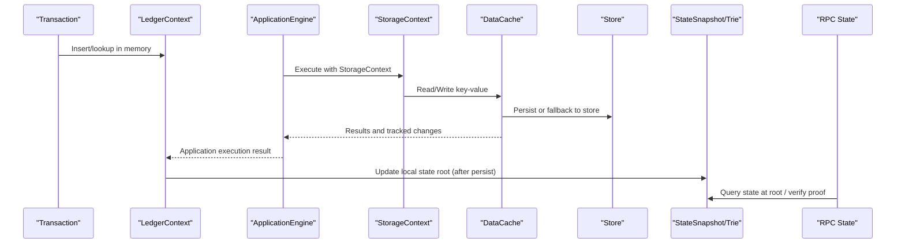
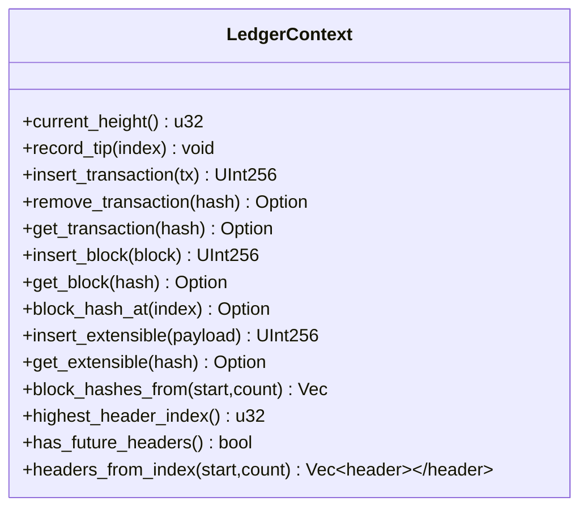
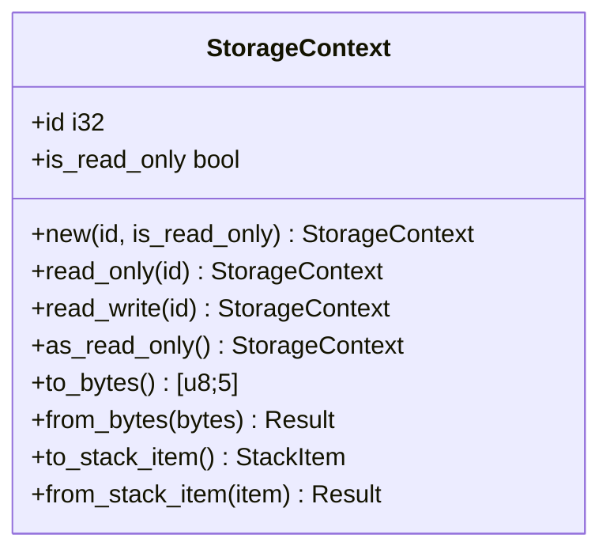
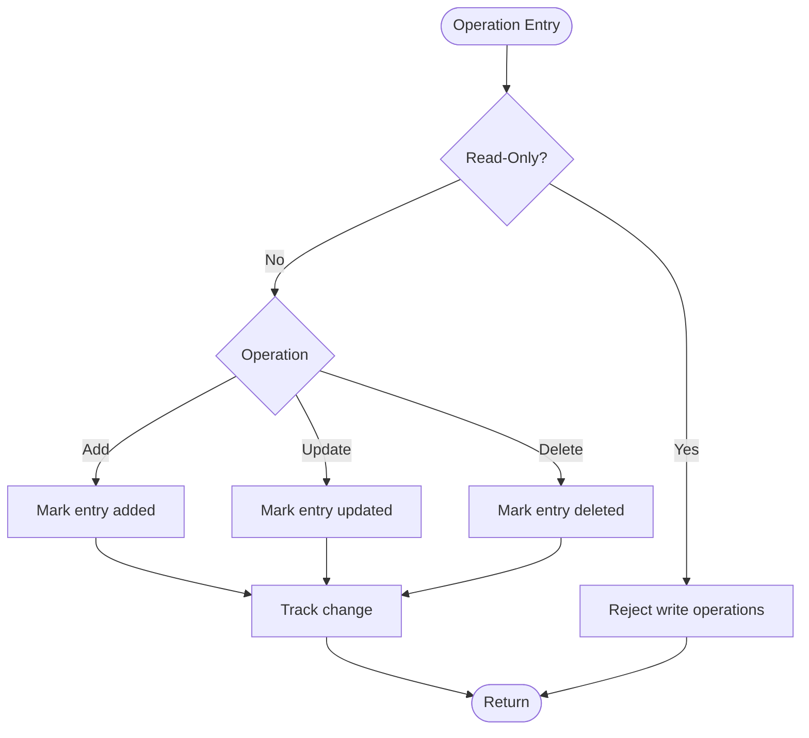
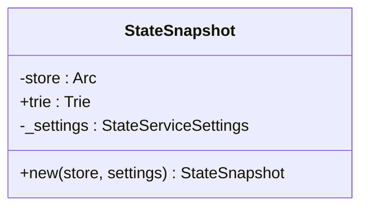
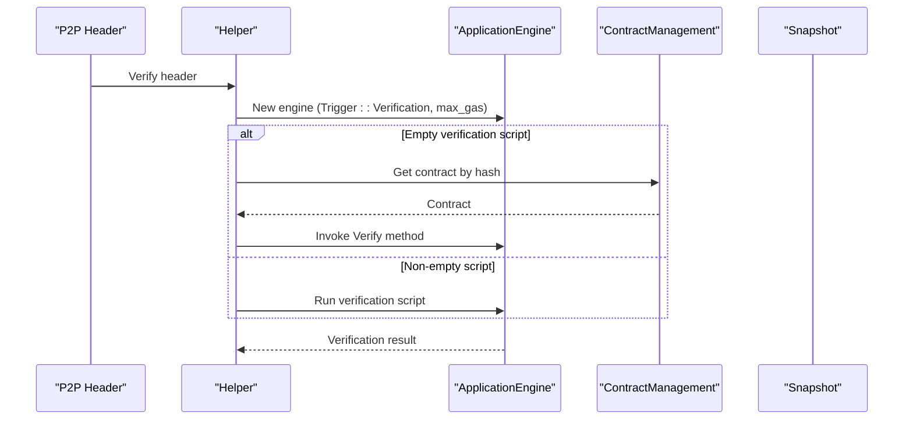
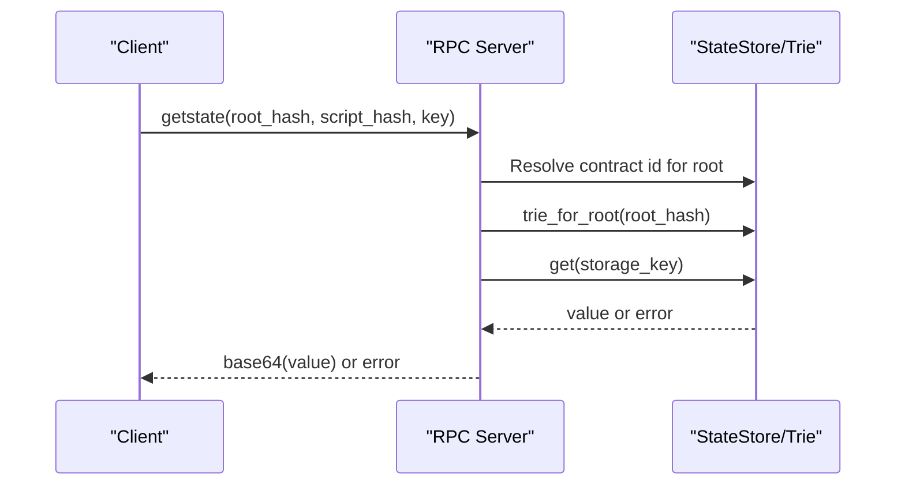
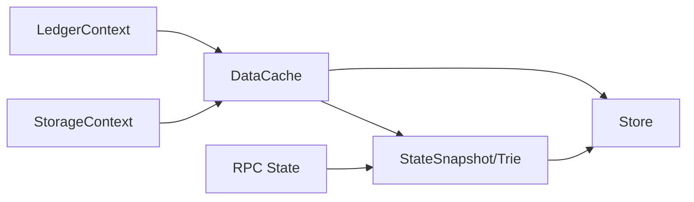

# State Management

<cite>
**Referenced Files in This Document**
- [ledger_context.rs](file://neo-core/src/ledger/ledger_context.rs)
- [mod.rs (ledger)](file://neo-core/src/ledger/mod.rs)
- [storage_context.rs (VM)](file://neo-vm/src/storage_context.rs)
- [storage_context.rs (re-export)](file://neo-core/src/smart_contract/storage_context.rs)
- [data_cache.rs](file://neo-storage/src/cache/data_cache.rs)
- [snapshot.rs (state store)](file://neo-core/src/state_service/state_store/snapshot.rs)
- [mod.rs (state service)](file://neo-core/src/state_service/mod.rs)
- [rpc_server_state.rs](file://neo-rpc/src/server/rpc_server_state.rs)
- [helper.rs](file://neo-core/src/smart_contract/helper.rs)
- [verification.rs (header verification)](file://neo-core/src/network/p2p/payloads/header/verification.rs)
- [mod.rs (persistence)](file://neo-core/src/persistence/mod.rs)
</cite>

## Table of Contents
1. Introduction
2. Project Structure
3. Core Components
4. Architecture Overview
5. Detailed Component Analysis
6. Dependency Analysis
7. Performance Considerations
8. Troubleshooting Guide
9. Conclusion

## Introduction
This document explains the Neo-RS blockchain state management system with a focus on:
- Ledger context for managing execution state, account balances, and contract storage
- Verification result handling and application execution results
- Storage context management and key-value operations
- State root computation, Merkle Patricia Trie construction, and snapshot mechanisms
- Smart contract interaction with storage and persistence
- Practical examples of state transitions, error handling, and performance considerations for large-scale state management

The goal is to provide both high-level architecture and code-level detail so that developers can understand how state changes flow from transaction execution through storage to verifiable state roots.

## Project Structure
Neo-RS organizes state-related functionality across several modules:
- Ledger layer provides in-memory caching and lifecycle tracking for blocks, headers, transactions, and extensible payloads
- Persistence layer exposes DataCache and related primitives for tracked, snapshot-style writes over pluggable stores
- VM layer defines StorageContext used by smart contracts to read/write storage under a contract-scoped context
- State Service computes and verifies state roots using a Merkle Patricia Trie backed by a state store snapshot
- RPC layer exposes queries against historical state roots and proofs

```mermaid
graph TB
subgraph "Ledger"
LC["LedgerContext"]
end
subgraph "Persistence"
DC["DataCache"]
Store["Store / StoreCache"]
end
subgraph "VM"
SC["StorageContext"]
end
subgraph "State Service"
SS["StateSnapshot + Trie"]
end
subgraph "RPC"
RPC["State RPC"]
end
LC --> DC
DC --> Store
SC --> DC
DC --> SS
SS --> Store
RPC --> SS
```

**Diagram sources**
- [ledger_context.rs:1-228](file://neo-core/src/ledger/ledger_context.rs#L1-L228)
- [data_cache.rs:405-619](file://neo-storage/src/cache/data_cache.rs#L405-L619)
- [storage_context.rs (VM):1-119](file://neo-vm/src/storage_context.rs#L1-L119)
- [snapshot.rs (state store):1-30](file://neo-core/src/state_service/state_store/snapshot.rs#L1-L30)
- [rpc_server_state.rs:95-113](file://neo-rpc/src/server/rpc_server_state.rs#L95-L113)

**Section sources**
- [mod.rs (ledger):15-44](file://neo-core/src/ledger/mod.rs#L15-L44)
- [mod.rs (persistence):1-45](file://neo-core/src/persistence/mod.rs#L1-L45)

## Core Components
- LedgerContext: In-memory cache for recent ledger data (blocks, headers, transactions, extensible payloads), tracking best height and enabling fast lookups during sync and execution.
- DataCache: Tracked, snapshot-style cache over a persistent store; supports add/update/delete, read-only mode, commit, and change tracking for later persistence and state root updates.
- StorageContext: Contract-scoped storage handle passed into VM execution; encodes contract id and read-only flag, and serializes/deserializes to/from stack items.
- StateSnapshot + Trie: A snapshot-backed Merkle Patricia Trie view of state at a given root hash; used for reads and incremental writes during block processing.
- RPC State API: Exposes querying state at a specific root and verifying state proofs.

**Section sources**
- [ledger_context.rs:11-164](file://neo-core/src/ledger/ledger_context.rs#L11-L164)
- [data_cache.rs:405-619](file://neo-storage/src/cache/data_cache.rs#L405-L619)
- [storage_context.rs (VM):6-119](file://neo-vm/src/storage_context.rs#L6-L119)
- [snapshot.rs (state store):9-30](file://neo-core/src/state_service/state_store/snapshot.rs#L9-L30)
- [rpc_server_state.rs:95-113](file://neo-rpc/src/server/rpc_server_state.rs#L95-L113)

## Architecture Overview
The state management pipeline spans execution, persistence, and state root computation:



**Diagram sources**
- [ledger_context.rs:25-164](file://neo-core/src/ledger/ledger_context.rs#L25-L164)
- [helper.rs:383-413](file://neo-core/src/smart_contract/helper.rs#L383-L413)
- [storage_context.rs (VM):16-119](file://neo-vm/src/storage_context.rs#L16-L119)
- [data_cache.rs:405-619](file://neo-storage/src/cache/data_cache.rs#L405-L619)
- [snapshot.rs (state store):18-30](file://neo-core/src/state_service/state_store/snapshot.rs#L18-L30)
- [rpc_server_state.rs:95-113](file://neo-rpc/src/server/rpc_server_state.rs#L95-L113)

## Detailed Component Analysis

### Ledger Context
LedgerContext maintains an in-memory index of recently seen ledger objects and tracks the best height and header index. It supports:
- Recording tip updates
- Inserting/retrieving blocks, headers, transactions, and extensible payloads
- Enumerating block hashes and headers within ranges
- Detecting future headers

These capabilities enable fast access during synchronization and execution without repeatedly hitting persistent storage.



**Diagram sources**
- [ledger_context.rs:11-164](file://neo-core/src/ledger/ledger_context.rs#L11-L164)

**Section sources**
- [ledger_context.rs:11-164](file://neo-core/src/ledger/ledger_context.rs#L11-L164)

### Storage Context (VM)
StorageContext represents a contract-scoped storage handle used by smart contracts. It carries:
- Contract id
- Read-only flag

It supports serialization to/from bytes and stack items, enabling seamless integration with the VM’s interop layer.



**Diagram sources**
- [storage_context.rs (VM):6-119](file://neo-vm/src/storage_context.rs#L6-L119)

**Section sources**
- [storage_context.rs (VM):6-119](file://neo-vm/src/storage_context.rs#L6-L119)
- [storage_context.rs (re-export):1-3](file://neo-core/src/smart_contract/storage_context.rs#L1-L3)

### Data Cache and Persistence
DataCache provides a tracked, snapshot-style interface over a persistent store:
- Add/update/delete with change tracking
- Read-only mode enforcement
- Committing changes to underlying store
- Fallback to store when keys are not present in cache

This abstraction enables efficient batched writes and consistent snapshots for state root computation.



**Diagram sources**
- [data_cache.rs:405-619](file://neo-storage/src/cache/data_cache.rs#L405-L619)

**Section sources**
- [data_cache.rs:405-619](file://neo-storage/src/cache/data_cache.rs#L405-L619)
- [mod.rs (persistence):1-45](file://neo-core/src/persistence/mod.rs#L1-L45)

### State Snapshot and Merkle Patricia Trie
StateSnapshot wraps a state store backend and a Merkle Patricia Trie rooted at a specific state root hash. It supports:
- Creating snapshots for atomic operations
- Building a trie view over stored state
- Enabling full-state or compact modes via settings

This is the foundation for computing and verifying state roots deterministically.



**Diagram sources**
- [snapshot.rs (state store):9-30](file://neo-core/src/state_service/state_store/snapshot.rs#L9-L30)

**Section sources**
- [snapshot.rs (state store):9-30](file://neo-core/src/state_service/state_store/snapshot.rs#L9-L30)
- [mod.rs (state service):1-38](file://neo-core/src/state_service/mod.rs#L1-L38)

### Verification and Execution Flow
Verification uses ApplicationEngine with a verification trigger and a cloned snapshot to execute witness scripts or contract Verify methods. Execution results are propagated back to the ledger layer.



**Diagram sources**
- [helper.rs:383-413](file://neo-core/src/smart_contract/helper.rs#L383-L413)
- [verification.rs (header verification):159-197](file://neo-core/src/network/p2p/payloads/header/verification.rs#L159-L197)

**Section sources**
- [helper.rs:383-413](file://neo-core/src/smart_contract/helper.rs#L383-L413)
- [verification.rs (header verification):159-197](file://neo-core/src/network/p2p/payloads/header/verification.rs#L159-L197)

### RPC State Queries and Proofs
The RPC layer exposes endpoints to:
- Retrieve storage values at a specific state root
- Verify state proofs against a supplied root hash

These operations use the state store’s trie for deterministic reads and proof verification.



**Diagram sources**
- [rpc_server_state.rs:95-113](file://neo-rpc/src/server/rpc_server_state.rs#L95-L113)

**Section sources**
- [rpc_server_state.rs:95-113](file://neo-rpc/src/server/rpc_server_state.rs#L95-L113)

## Dependency Analysis
Key dependencies and relationships:
- LedgerContext depends on core types (Block, Header, Transaction, ExtensiblePayload) and provides fast in-memory access for networking and execution paths.
- DataCache depends on Store abstractions and provides tracked writes; it is central to applying state changes and generating diffs for state root updates.
- StorageContext is consumed by the VM and bridges contract calls to DataCache operations.
- StateSnapshot depends on StateStoreBackend and builds a Trie view for deterministic reads/writes and root computation.
- RPC depends on StateSnapshot/Trie to serve historical state queries and proofs.



**Diagram sources**
- [ledger_context.rs:11-164](file://neo-core/src/ledger/ledger_context.rs#L11-L164)
- [data_cache.rs:405-619](file://neo-storage/src/cache/data_cache.rs#L405-L619)
- [storage_context.rs (VM):6-119](file://neo-vm/src/storage_context.rs#L6-L119)
- [snapshot.rs (state store):9-30](file://neo-core/src/state_service/state_store/snapshot.rs#L9-L30)
- [rpc_server_state.rs:95-113](file://neo-rpc/src/server/rpc_server_state.rs#L95-L113)

**Section sources**
- [mod.rs (ledger):15-44](file://neo-core/src/ledger/mod.rs#L15-L44)
- [mod.rs (persistence):1-45](file://neo-core/src/persistence/mod.rs#L1-L45)
- [mod.rs (state service):1-38](file://neo-core/src/state_service/mod.rs#L1-L38)

## Performance Considerations
- Use DataCache’s tracked changes to minimize redundant writes and enable efficient batch commits.
- Prefer read-only contexts where possible to avoid accidental mutations and reduce contention.
- Leverage LedgerContext’s in-memory caches for hot paths like block/header/transaction lookups during sync and execution.
- For large-scale state management, ensure state root computation is decoupled from the critical persistence path to avoid blocking block production.
- Reuse snapshots and trie views per block to reduce I/O and improve locality.

[No sources needed since this section provides general guidance]

## Troubleshooting Guide
Common issues and resolutions:
- Key not found: When reading from DataCache, missing keys return errors; ensure proper initialization or fallback to store.
- Read-only violations: Attempting writes in read-only DataCache or StorageContext will fail; verify context flags before mutation.
- Verification failures: If verification scripts or contract Verify methods fail, check gas limits and contract availability; inspect ApplicationEngine creation and invocation paths.
- State root mismatch: Ensure all state changes are committed and tracked before computing the new root; validate trie updates and store consistency.

**Section sources**
- [data_cache.rs:405-619](file://neo-storage/src/cache/data_cache.rs#L405-L619)
- [helper.rs:383-413](file://neo-core/src/smart_contract/helper.rs#L383-L413)
- [verification.rs (header verification):159-197](file://neo-core/src/network/p2p/payloads/header/verification.rs#L159-L197)

## Conclusion
Neo-RS implements a robust state management system that separates concerns across ledger caching, persistent storage, VM storage contexts, and deterministic state root computation. The design enables efficient execution, reliable persistence, and verifiable state snapshots suitable for large-scale blockchain operation. By leveraging tracked caches, snapshot-based tries, and clear separation between execution and persistence, the system achieves both correctness and performance.

[No sources needed since this section summarizes without analyzing specific files]