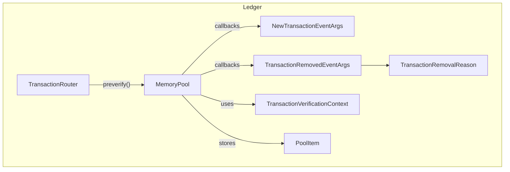
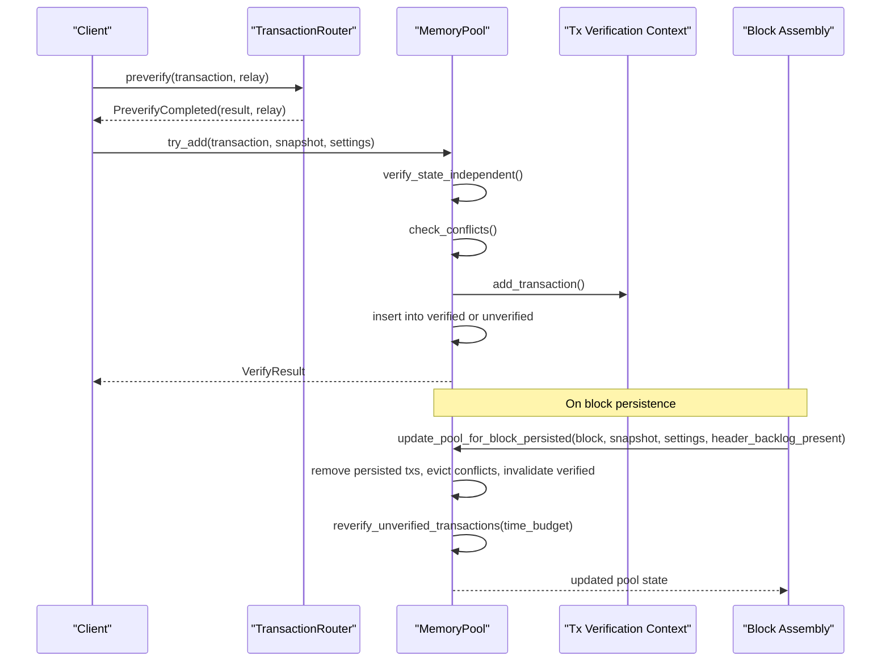
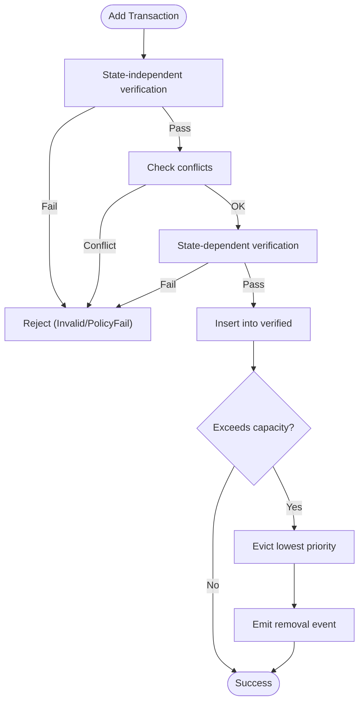
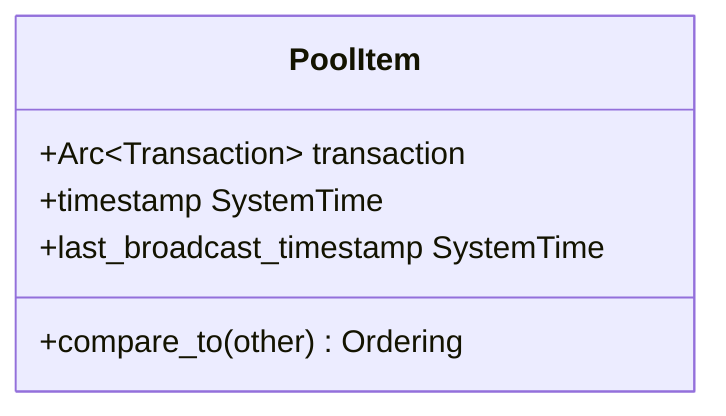
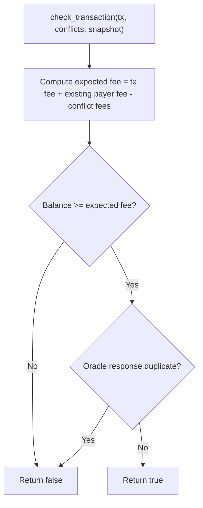
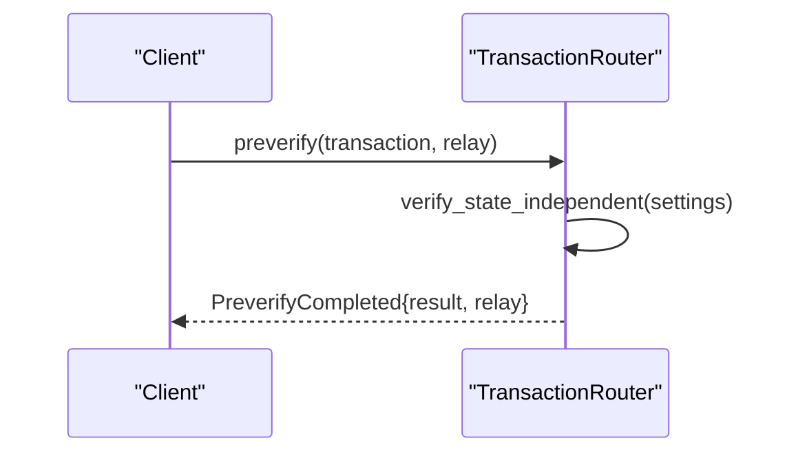
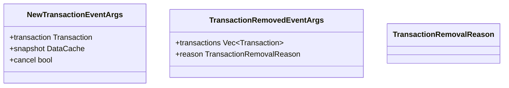
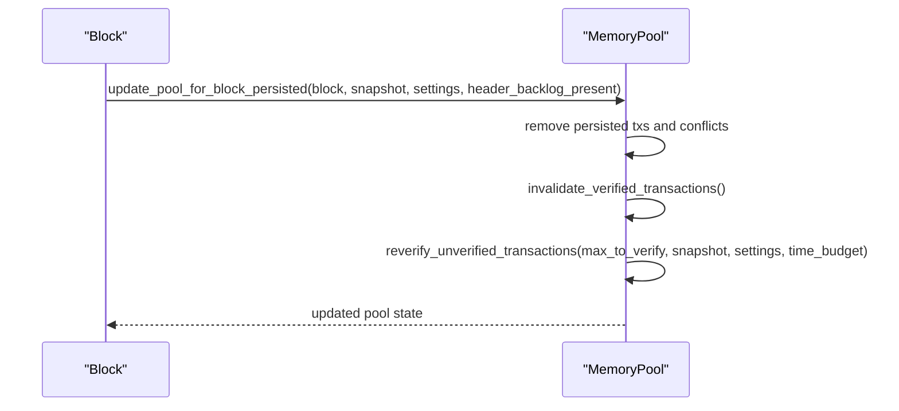
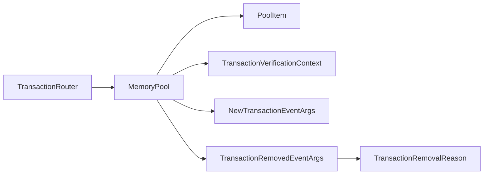

# Transaction Management

<cite>
**Referenced Files in This Document**
- [mod.rs](file://neo-core/src/ledger/memory_pool/mod.rs)
- [views.rs](file://neo-core/src/ledger/memory_pool/views.rs)
- [pool_item.rs](file://neo-core/src/ledger/pool_item.rs)
- [transaction_verification_context.rs](file://neo-core/src/ledger/transaction_verification_context.rs)
- [transaction_router.rs](file://neo-core/src/ledger/transaction_router.rs)
- [new_transaction_event_args.rs](file://neo-core/src/ledger/new_transaction_event_args.rs)
- [transaction_removed_event_args.rs](file://neo-core/src/ledger/transaction_removed_event_args.rs)
- [transaction_removal_reason.rs](file://neo-core/src/ledger/transaction_removal_reason.rs)
</cite>

## Table of Contents
1. [Introduction](#introduction)
2. [Project Structure](#project-structure)
3. [Core Components](#core-components)
4. [Architecture Overview](#architecture-overview)
5. [Detailed Component Analysis](#detailed-component-analysis)
6. [Dependency Analysis](#dependency-analysis)
7. [Performance Considerations](#performance-considerations)
8. [Troubleshooting Guide](#troubleshooting-guide)
9. [Conclusion](#conclusion)

## Introduction
This document explains the Neo-RS transaction management system with a focus on memory pool architecture, verification lifecycle, conflict handling, fee tracking, and event-driven routing. It covers how transactions flow from initial acceptance to block assembly, including reverification after blocks are persisted, oracle response deduplication, and removal reasons. The goal is to provide both conceptual understanding and code-level traceability for developers and operators.

## Project Structure
The transaction management subsystem lives under the ledger module and centers around:
- Memory pool: verified/unverified queues, capacity enforcement, conflict detection, and rebroadcast logic
- Pool item: priority ordering and metadata for pooled transactions
- Verification context: per-payer fee tracking and oracle response deduplication
- Router: pre-verification (state-independent checks) before blockchain validation
- Event args and removal reasons: structured events for lifecycle hooks

**Diagram sources**
- [mod.rs:66-91](file://neo-core/src/ledger/memory_pool/mod.rs#L66-L91)
- [pool_item.rs:6-16](file://neo-core/src/ledger/pool_item.rs#L6-L16)
- [transaction_verification_context.rs:15-20](file://neo-core/src/ledger/transaction_verification_context.rs#L15-L20)
- [transaction_router.rs:21-24](file://neo-core/src/ledger/transaction_router.rs#L21-L24)
- [new_transaction_event_args.rs:9-17](file://neo-core/src/ledger/new_transaction_event_args.rs#L9-L17)
- [transaction_removed_event_args.rs:12-22](file://neo-core/src/ledger/transaction_removed_event_args.rs#L12-L22)
- [transaction_removal_reason.rs:1-7](file://neo-core/src/ledger/transaction_removal_reason.rs#L1-L7)

**Section sources**
- [mod.rs:66-91](file://neo-core/src/ledger/memory_pool/mod.rs#L66-L91)
- [pool_item.rs:6-16](file://neo-core/src/ledger/pool_item.rs#L6-L16)
- [transaction_verification_context.rs:15-20](file://neo-core/src/ledger/transaction_verification_context.rs#L15-L20)
- [transaction_router.rs:21-24](file://neo-core/src/ledger/transaction_router.rs#L21-L24)
- [new_transaction_event_args.rs:9-17](file://neo-core/src/ledger/new_transaction_event_args.rs#L9-L17)
- [transaction_removed_event_args.rs:12-22](file://neo-core/src/ledger/transaction_removed_event_args.rs#L12-L22)
- [transaction_removal_reason.rs:1-7](file://neo-core/src/ledger/transaction_removal_reason.rs#L1-L7)

## Core Components
- MemoryPool: Maintains verified and unverified transaction sets, enforces capacity, detects conflicts, triggers callbacks, and coordinates revalidation after blocks.
- PoolItem: Wraps a transaction with timestamps and defines priority ordering by high-priority flag, fee-per-byte, network fee, and hash tie-breaker.
- TransactionVerificationContext: Tracks cumulative fees per payer and oracle responses to enforce sender balance and avoid duplicate oracle responses.
- TransactionRouter: Performs state-independent verification early in the pipeline and returns a result that can influence relay decisions.
- Event Args and Removal Reasons: Structured payloads for new and removed transaction events, with explicit reasons for removal.

Key responsibilities:
- Verified queue: ready-to-use transactions for block assembly
- Unverified queue: pending transactions awaiting revalidation
- Conflict detection: based on Conflicts attributes and shared signers
- Fee accounting: sum of system_fee and network_fee per payer
- Oracle response handling: reject duplicates within the same mempool window
- Reverification: promote valid unverified transactions into verified set with time budgets

**Section sources**
- [mod.rs:66-91](file://neo-core/src/ledger/memory_pool/mod.rs#L66-L91)
- [pool_item.rs:28-62](file://neo-core/src/ledger/pool_item.rs#L28-L62)
- [transaction_verification_context.rs:42-148](file://neo-core/src/ledger/transaction_verification_context.rs#L42-L148)
- [transaction_router.rs:32-41](file://neo-core/src/ledger/transaction_router.rs#L32-L41)
- [new_transaction_event_args.rs:9-17](file://neo-core/src/ledger/new_transaction_event_args.rs#L9-L17)
- [transaction_removed_event_args.rs:12-22](file://neo-core/src/ledger/transaction_removed_event_args.rs#L12-L22)
- [transaction_removal_reason.rs:1-7](file://neo-core/src/ledger/transaction_removal_reason.rs#L1-L7)

## Architecture Overview
The transaction lifecycle spans pre-verification, mempool admission, conflict resolution, optional rebroadcasting, and post-block revalidation.

**Diagram sources**
- [transaction_router.rs:32-41](file://neo-core/src/ledger/transaction_router.rs#L32-L41)
- [mod.rs:243-383](file://neo-core/src/ledger/memory_pool/mod.rs#L243-L383)
- [mod.rs:388-483](file://neo-core/src/ledger/memory_pool/mod.rs#L388-L483)
- [mod.rs:503-654](file://neo-core/src/ledger/memory_pool/mod.rs#L503-L654)

## Detailed Component Analysis

### MemoryPool: Verified/Unverified Queues, Capacity, and Lifecycle
- Verified queue: holds transactions that passed full validation and are eligible for block inclusion.
- Unverified queue: holds transactions that failed some validation step or require later revalidation; promoted when conditions change.
- Capacity enforcement: if total count exceeds configured capacity, lowest-priority items are evicted; evictions trigger removal events.
- Conflict detection: uses Conflicts attributes and signer overlap to identify conflicting transactions; may evict lower-fee or conflicting entries.
- Reverification: after block persistence, verified transactions are invalidated and moved back to unverified; top candidates are revalidated within time budgets.
- Rebroadcast: successfully revalidated transactions may be rebroadcast if enough time has elapsed since last broadcast.

**Diagram sources**
- [mod.rs:243-383](file://neo-core/src/ledger/memory_pool/mod.rs#L243-L383)
- [mod.rs:685-718](file://neo-core/src/ledger/memory_pool/mod.rs#L685-L718)

**Section sources**
- [mod.rs:243-383](file://neo-core/src/ledger/memory_pool/mod.rs#L243-L383)
- [mod.rs:388-483](file://neo-core/src/ledger/memory_pool/mod.rs#L388-L483)
- [mod.rs:503-654](file://neo-core/src/ledger/memory_pool/mod.rs#L503-L654)
- [mod.rs:685-718](file://neo-core/src/ledger/memory_pool/mod.rs#L685-L718)

### PoolItem: Priority Ordering and Metadata
- Priority order: high-priority attribute first, then fee-per-byte, then network fee, then descending hash for determinism.
- Metadata: timestamp of insertion and last broadcast time used for rebroadcast throttling.

**Diagram sources**
- [pool_item.rs:6-16](file://neo-core/src/ledger/pool_item.rs#L6-L16)
- [pool_item.rs:28-62](file://neo-core/src/ledger/pool_item.rs#L28-L62)

**Section sources**
- [pool_item.rs:6-16](file://neo-core/src/ledger/pool_item.rs#L6-L16)
- [pool_item.rs:28-62](file://neo-core/src/ledger/pool_item.rs#L28-L62)

### TransactionVerificationContext: Sender Fee Tracking and Oracle Responses
- Payer identification: primary sender, with optional secondary payer for notary-sponsored transactions.
- Fee tracking: accumulates total fees (system_fee + network_fee) per payer; subtracts fees of replaced conflicts.
- Oracle response deduplication: tracks oracle response IDs to prevent duplicate responses in the same mempool window.
- Balance checks: ensures payer has sufficient funds (GAS or Notary deposit) to cover expected fees.

**Diagram sources**
- [transaction_verification_context.rs:93-133](file://neo-core/src/ledger/transaction_verification_context.rs#L93-L133)
- [transaction_verification_context.rs:139-148](file://neo-core/src/ledger/transaction_verification_context.rs#L139-L148)

**Section sources**
- [transaction_verification_context.rs:42-148](file://neo-core/src/ledger/transaction_verification_context.rs#L42-L148)

### TransactionRouter: Pre-verification and Relay Decision
- Runs state-independent verification prior to blockchain validation.
- Returns a structured result indicating whether the transaction should be relayed and its verification outcome.

**Diagram sources**
- [transaction_router.rs:32-41](file://neo-core/src/ledger/transaction_router.rs#L32-L41)

**Section sources**
- [transaction_router.rs:21-41](file://neo-core/src/ledger/transaction_router.rs#L21-L41)

### Event Callbacks and Removal Reasons
- NewTransactionEventArgs: allows external policy to cancel a transaction before it enters the pool.
- TransactionRemovedEventArgs: reports which transactions were removed and why.
- Removal reasons include conflict eviction, capacity pressure, and no longer valid after revalidation.

**Diagram sources**
- [new_transaction_event_args.rs:9-17](file://neo-core/src/ledger/new_transaction_event_args.rs#L9-L17)
- [transaction_removed_event_args.rs:12-22](file://neo-core/src/ledger/transaction_removed_event_args.rs#L12-L22)
- [transaction_removal_reason.rs:1-7](file://neo-core/src/ledger/transaction_removal_reason.rs#L1-L7)

**Section sources**
- [new_transaction_event_args.rs:9-17](file://neo-core/src/ledger/new_transaction_event_args.rs#L9-L17)
- [transaction_removed_event_args.rs:12-22](file://neo-core/src/ledger/transaction_removed_event_args.rs#L12-L22)
- [transaction_removal_reason.rs:1-7](file://neo-core/src/ledger/transaction_removal_reason.rs#L1-L7)

### Block Assembly Integration and Reverification Logic
- After a block is persisted, the pool removes included transactions and evicts any that conflict with newly persisted ones.
- Verified transactions are invalidated and moved back to unverified; top candidates are revalidated within a per-block time budget.
- Successful revalidations may trigger rebroadcast if enough time has passed since last broadcast.

**Diagram sources**
- [mod.rs:388-483](file://neo-core/src/ledger/memory_pool/mod.rs#L388-L483)
- [mod.rs:503-654](file://neo-core/src/ledger/memory_pool/mod.rs#L503-L654)

**Section sources**
- [mod.rs:388-483](file://neo-core/src/ledger/memory_pool/mod.rs#L388-L483)
- [mod.rs:503-654](file://neo-core/src/ledger/memory_pool/mod.rs#L503-L654)

### Practical Transaction Flow Examples
- Mempool inclusion to block assembly:
  - Pre-verify via router to quickly filter invalid transactions.
  - Add to pool with state-independent and state-dependent checks.
  - If accepted, block assembler retrieves highest-priority verified transactions for inclusion.
- Error handling strategies:
  - Immediate rejection for invalid structure or policy failures.
  - Conflict-based eviction with clear removal reason.
  - Capacity-based eviction with removal events.
  - Post-block revalidation moves stale or invalid transactions out with appropriate reasons.
- Performance tuning for high-volume processing:
  - Use Arc<Transaction> references to minimize cloning overhead.
  - Limit revalidation work per block using time budgets.
  - Reserve capacities for verified/unverified sets during initial sync to reduce reallocations.
  - Tune max_transactions_per_sender to mitigate spam from single senders.

[No sources needed since this section provides general guidance]

## Dependency Analysis
The following diagram shows key dependencies between components involved in transaction management.

**Diagram sources**
- [transaction_router.rs:21-41](file://neo-core/src/ledger/transaction_router.rs#L21-L41)
- [mod.rs:66-91](file://neo-core/src/ledger/memory_pool/mod.rs#L66-L91)
- [pool_item.rs:6-16](file://neo-core/src/ledger/pool_item.rs#L6-L16)
- [transaction_verification_context.rs:15-20](file://neo-core/src/ledger/transaction_verification_context.rs#L15-L20)
- [new_transaction_event_args.rs:9-17](file://neo-core/src/ledger/new_transaction_event_args.rs#L9-L17)
- [transaction_removed_event_args.rs:12-22](file://neo-core/src/ledger/transaction_removed_event_args.rs#L12-L22)
- [transaction_removal_reason.rs:1-7](file://neo-core/src/ledger/transaction_removal_reason.rs#L1-L7)

**Section sources**
- [mod.rs:66-91](file://neo-core/src/ledger/memory_pool/mod.rs#L66-L91)
- [transaction_router.rs:21-41](file://neo-core/src/ledger/transaction_router.rs#L21-L41)
- [pool_item.rs:6-16](file://neo-core/src/ledger/pool_item.rs#L6-L16)
- [transaction_verification_context.rs:15-20](file://neo-core/src/ledger/transaction_verification_context.rs#L15-L20)
- [new_transaction_event_args.rs:9-17](file://neo-core/src/ledger/new_transaction_event_args.rs#L9-L17)
- [transaction_removed_event_args.rs:12-22](file://neo-core/src/ledger/transaction_removed_event_args.rs#L12-L22)
- [transaction_removal_reason.rs:1-7](file://neo-core/src/ledger/transaction_removal_reason.rs#L1-L7)

## Performance Considerations
- Minimize cloning: use Arc<Transaction> in iterators and views to avoid deep copies.
- Time-bounded revalidation: cap revalidation work per block to maintain responsiveness.
- Capacity planning: reserve space for verified/unverified sets during initial sync to reduce allocations.
- Per-sender limits: configure max_transactions_per_sender to control load from single accounts.
- Rebroadcast throttling: scale rebroadcast intervals based on pool size to reduce network churn.

[No sources needed since this section provides general guidance]

## Troubleshooting Guide
Common issues and diagnostics:
- Transactions rejected immediately:
  - Check state-independent verification results returned by the router.
  - Review policy failures and per-sender limits.
- Conflicts causing eviction:
  - Inspect Conflicts attributes and overlapping signers.
  - Confirm fee thresholds relative to conflicting transactions.
- Capacity pressure evictions:
  - Monitor pool size vs configured capacity.
  - Adjust capacity or per-sender limits as needed.
- Stale transactions after block persistence:
  - Ensure revalidation runs with adequate time budget.
  - Validate that oracle responses are not duplicated.

Relevant event data:
- NewTransactionEventArgs: inspect cancel flag to understand policy cancellations.
- TransactionRemovedEventArgs: review reason and affected transactions to diagnose evictions.

**Section sources**
- [transaction_router.rs:32-41](file://neo-core/src/ledger/transaction_router.rs#L32-L41)
- [mod.rs:243-383](file://neo-core/src/ledger/memory_pool/mod.rs#L243-L383)
- [mod.rs:388-483](file://neo-core/src/ledger/memory_pool/mod.rs#L388-L483)
- [new_transaction_event_args.rs:9-17](file://neo-core/src/ledger/new_transaction_event_args.rs#L9-L17)
- [transaction_removed_event_args.rs:12-22](file://neo-core/src/ledger/transaction_removed_event_args.rs#L12-L22)

## Conclusion
Neo-RS transaction management provides a robust, efficient pipeline for handling high-volume transactions. The memory pool separates verified and unverified states, enforces capacity and conflict rules, and integrates closely with block assembly through revalidation and rebroadcast mechanisms. Fee tracking and oracle response deduplication ensure correctness under concurrent mempool activity. Operators can tune performance via capacity reservations, per-sender limits, and revalidation budgets while relying on structured events for observability and troubleshooting.