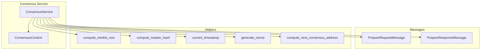
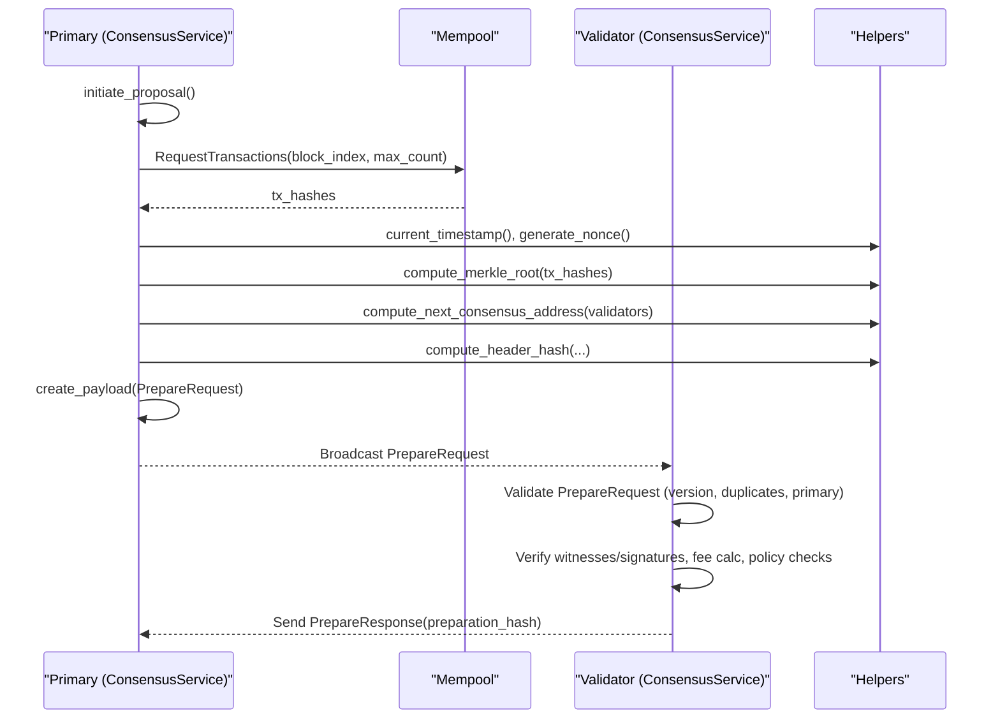
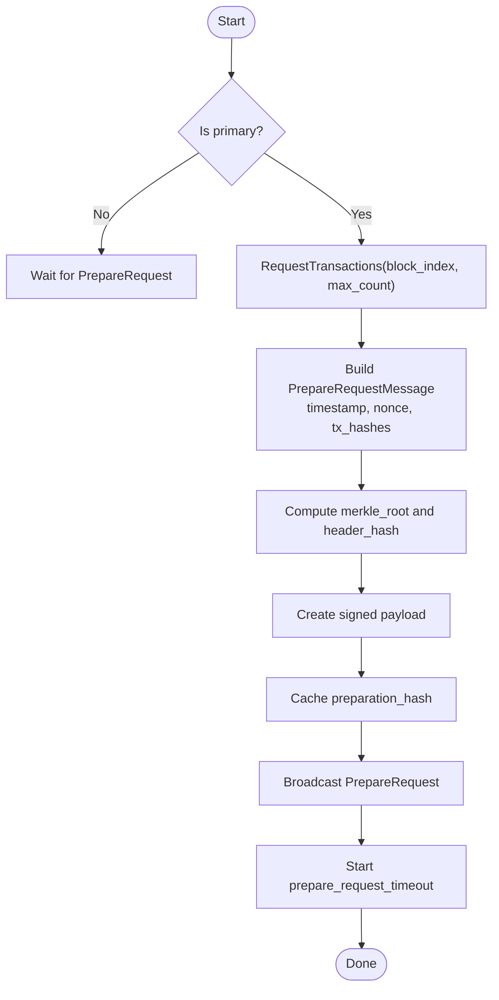
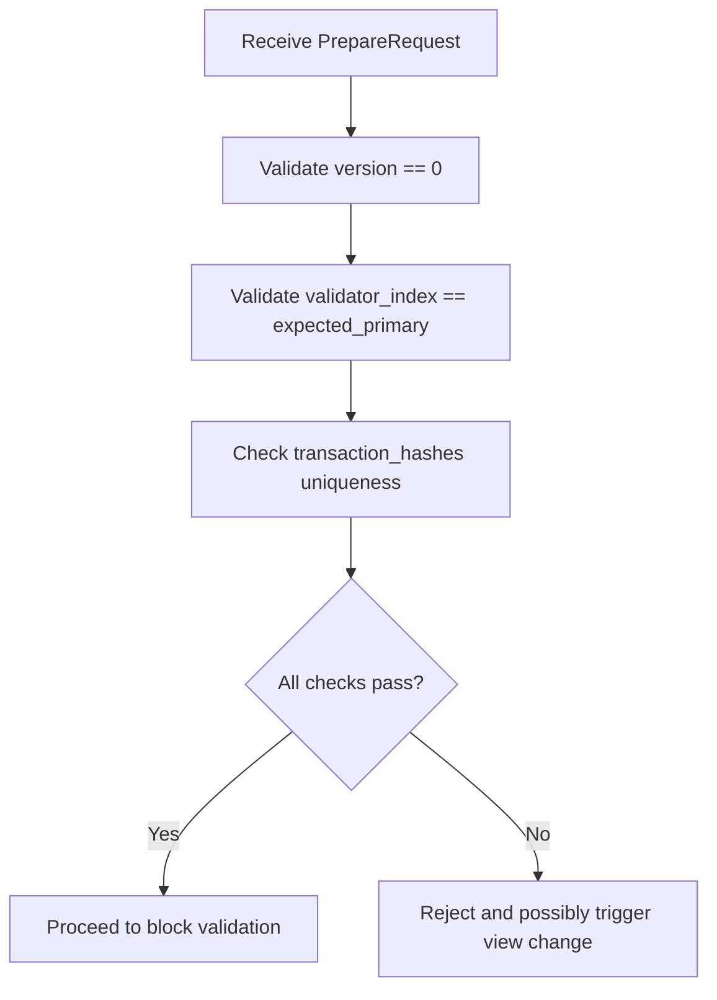
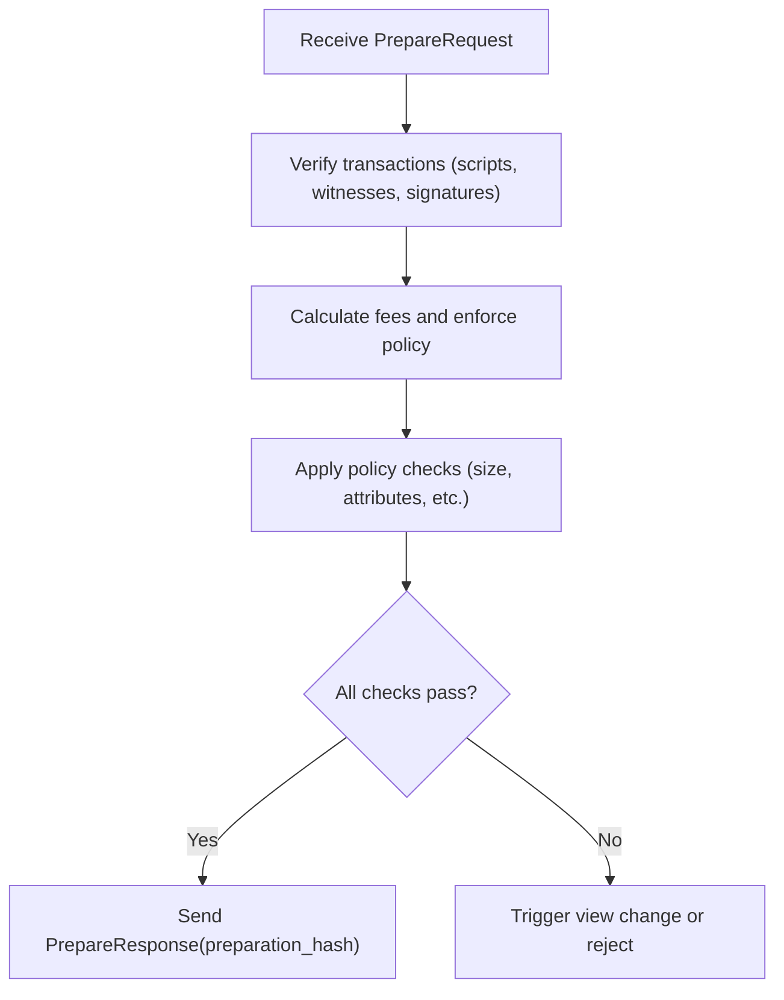
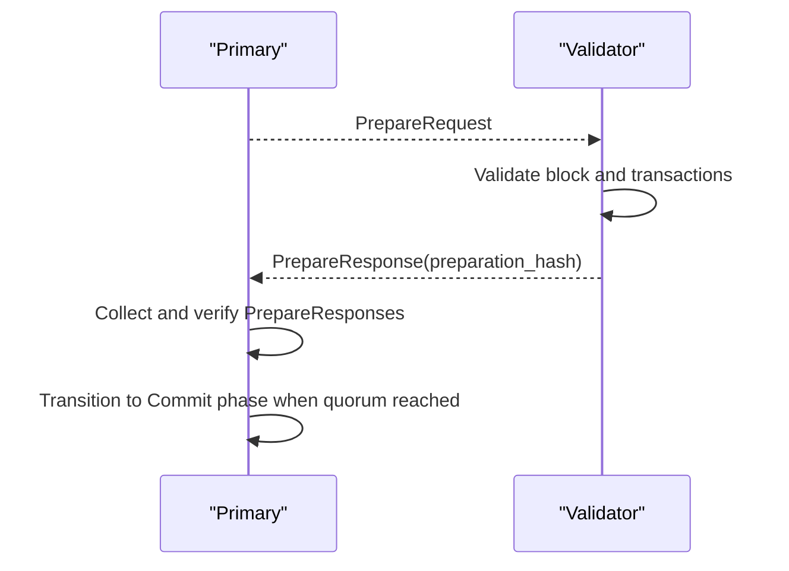
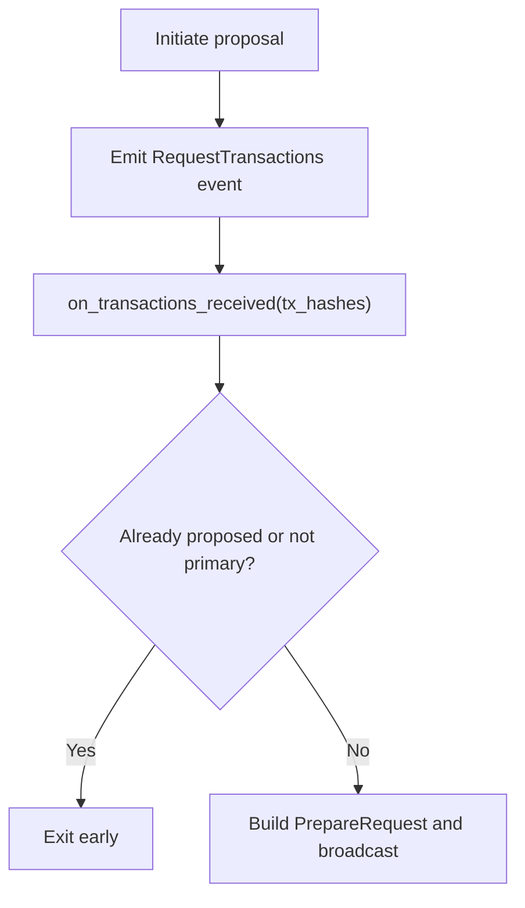
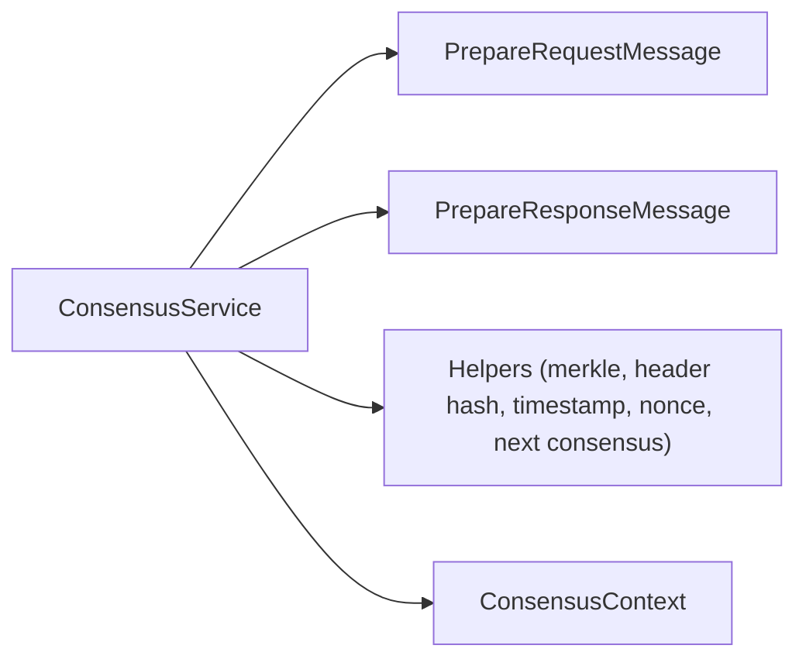

# Block Proposal

<cite>
**Referenced Files in This Document**
- [lib.rs](file://neo-consensus/src/lib.rs)
- [core.rs](file://neo-consensus/src/service/core.rs)
- [proposal.rs](file://neo-consensus/src/service/proposal.rs)
- [prepare_request.rs](file://neo-consensus/src/messages/prepare_request.rs)
- [prepare_response.rs](file://neo-consensus/src/messages/prepare_response.rs)
- [helpers.rs](file://neo-consensus/src/service/helpers.rs)
</cite>

## Table of Contents
1. [Introduction](#introduction)
2. [Project Structure](#project-structure)
3. [Core Components](#core-components)
4. [Architecture Overview](#architecture-overview)
5. [Detailed Component Analysis](#detailed-component-analysis)
6. [Dependency Analysis](#dependency-analysis)
7. [Performance Considerations](#performance-considerations)
8. [Troubleshooting Guide](#troubleshooting-guide)
9. [Conclusion](#conclusion)

## Introduction
This document explains the block proposal workflow in dBFT consensus within the neo-rs codebase, focusing on how the primary validator creates and broadcasts PrepareRequest messages containing block proposals, how validators validate proposed blocks and respond with PrepareResponse messages, and how the system handles transaction selection, witness validation, signature verification, and policy checks. It also covers performance considerations and optimization strategies for block proposal processing.

## Project Structure
The block proposal workflow spans several modules:
- Consensus service lifecycle and state machine orchestration
- Message definitions for PrepareRequest and PrepareResponse
- Helpers for computing block header hashes, merkle roots, timestamps, nonces, and next consensus address
- Transaction assembly via events to request transactions from mempool

**Diagram sources**
- [core.rs:8-25](file://neo-consensus/src/service/core.rs#L8-L25)
- [proposal.rs:11-104](file://neo-consensus/src/service/proposal.rs#L11-L104)
- [prepare_request.rs:8-27](file://neo-consensus/src/messages/prepare_request.rs#L8-L27)
- [prepare_response.rs:7-18](file://neo-consensus/src/messages/prepare_response.rs#L7-L18)

**Section sources**
- [lib.rs:6-138](file://neo-consensus/src/lib.rs#L6-L138)
- [core.rs:8-25](file://neo-consensus/src/service/core.rs#L8-L25)

## Core Components
- ConsensusService: Main state machine that coordinates proposal initiation, message creation, broadcasting, and timers.
- PrepareRequestMessage: The proposal payload sent by the primary containing block metadata and transaction hashes.
- PrepareResponseMessage: Validator acknowledgment carrying the preparation hash to confirm agreement on the proposed block.
- Helpers: Utility functions for timestamp, nonce generation, merkle root computation, header hash computation, and next consensus address calculation.

Key responsibilities:
- Primary initiates proposal and requests transactions from mempool.
- Primary constructs PrepareRequest, computes header hash, caches preparation hash, and broadcasts.
- Validators validate incoming PrepareRequest, verify witnesses and signatures, check policies, and send PrepareResponse if valid.

**Section sources**
- [core.rs:8-25](file://neo-consensus/src/service/core.rs#L8-L25)
- [proposal.rs:11-104](file://neo-consensus/src/service/proposal.rs#L11-L104)
- [prepare_request.rs:8-27](file://neo-consensus/src/messages/prepare_request.rs#L8-L27)
- [prepare_response.rs:7-18](file://neo-consensus/src/messages/prepare_response.rs#L7-L18)

## Architecture Overview
The dBFT proposal flow involves the following high-level steps:
- Primary selects transactions from mempool and builds a proposal.
- Primary sends PrepareRequest including version, previous block hash, timestamp, nonce, and transaction hashes.
- Validators validate the proposal (witnesses, signatures, fees, policies).
- Validators respond with PrepareResponse if valid; otherwise they may trigger view change or reject.
- Upon sufficient PrepareResponses, the node proceeds to commit phase.

**Diagram sources**
- [proposal.rs:11-104](file://neo-consensus/src/service/proposal.rs#L11-L104)
- [prepare_request.rs:29-136](file://neo-consensus/src/messages/prepare_request.rs#L29-L136)
- [prepare_response.rs:20-82](file://neo-consensus/src/messages/prepare_response.rs#L20-L82)

## Detailed Component Analysis

### Primary Proposal Creation and Broadcasting
When the node is the primary for a view, it initiates proposal creation:
- Requests transactions from mempool with a maximum count per block.
- Stores proposed timestamp, transaction hashes, and generates a nonce.
- Builds a PrepareRequestMessage with block index, view number, validator index, version, previous hash, timestamp, nonce, and transaction hashes.
- Creates a signed payload, caches the preparation hash, and computes the proposed block header hash using merkle root and next consensus address.
- Broadcasts the payload and starts a timer for the prepare phase.

**Diagram sources**
- [proposal.rs:11-104](file://neo-consensus/src/service/proposal.rs#L11-L104)

**Section sources**
- [proposal.rs:11-104](file://neo-consensus/src/service/proposal.rs#L11-L104)

### PrepareRequest Message Validation
Validators receiving a PrepareRequest perform validation:
- Ensure version is correct (must be 0).
- Ensure validator_index matches expected primary.
- Ensure transaction_hashes are unique (no duplicates).
- Deserialize safely with strict error handling for malformed data.

**Diagram sources**
- [prepare_request.rs:86-136](file://neo-consensus/src/messages/prepare_request.rs#L86-L136)
- [prepare_request.rs:205-229](file://neo-consensus/src/messages/prepare_request.rs#L205-L229)

**Section sources**
- [prepare_request.rs:86-136](file://neo-consensus/src/messages/prepare_request.rs#L86-L136)
- [prepare_request.rs:205-229](file://neo-consensus/src/messages/prepare_request.rs#L205-L229)

### Block Validation Process (Validators)
Upon receiving a valid PrepareRequest, validators must validate the proposed block before responding:
- Transaction verification: Each transaction’s script and witness must be valid under current protocol rules.
- Fee calculation: Ensure each transaction pays sufficient fee according to policy; aggregate fees contribute to block validity.
- Policy checks: Apply network/policy constraints (e.g., size limits, attribute restrictions).
- Witness validation: Verify all required witnesses against scripts and permissions.
- Signature verification: Confirm signatures on transactions and any consensus-related payloads.

If validation succeeds, validators construct and send a PrepareResponseMessage containing the preparation hash (the hash of the prepared block/header context). If validation fails, they may reject the proposal and potentially initiate a view change depending on the failure reason.

[No sources needed since this section provides general guidance based on repository behavior]

### PrepareResponse Handling
Validators send PrepareResponse when they agree on the proposed block:
- The response carries the preparation hash to ensure all nodes agree on the same proposal.
- The primary collects responses and verifies them against the expected preparation hash.
- Once enough PrepareResponses are collected, the node transitions to the commit phase.

**Diagram sources**
- [prepare_response.rs:20-82](file://neo-consensus/src/messages/prepare_response.rs#L20-L82)
- [proposal.rs:11-104](file://neo-consensus/src/service/proposal.rs#L11-L104)

**Section sources**
- [prepare_response.rs:20-82](file://neo-consensus/src/messages/prepare_response.rs#L20-L82)

### Transaction Assembly from Mempool
The primary requests transactions from mempool:
- Uses an event-driven interface to request a set of transaction hashes up to a configured maximum per block.
- On receiving transaction hashes, the primary constructs the proposal only once per view and guards against duplicate broadcasts.
- Non-primary nodes use the received transaction hashes to determine availability and respond accordingly.

**Diagram sources**
- [proposal.rs:11-104](file://neo-consensus/src/service/proposal.rs#L11-L104)

**Section sources**
- [proposal.rs:11-104](file://neo-consensus/src/service/proposal.rs#L11-L104)

### Witness Validation and Signature Verification
- Witnesses are validated per transaction during block validation to ensure scripts and permissions satisfy policy.
- Signatures on transactions and consensus payloads are verified to prevent tampering.
- Invalid witnesses or signatures lead to rejection of the proposal and potential view change.

[No sources needed since this section provides general guidance based on repository behavior]

### Example Scenarios

#### Proposal Creation Example
- Primary calls initiate_proposal, receives transaction hashes from mempool, constructs PrepareRequestMessage with block metadata, computes header hash, signs payload, and broadcasts.

**Section sources**
- [proposal.rs:11-104](file://neo-consensus/src/service/proposal.rs#L11-L104)
- [prepare_request.rs:29-136](file://neo-consensus/src/messages/prepare_request.rs#L29-L136)

#### Validation Logic Example
- Validator validates PrepareRequest fields, verifies transactions (scripts, witnesses, signatures), calculates fees, applies policy checks, and sends PrepareResponse if valid.

**Section sources**
- [prepare_request.rs:86-136](file://neo-consensus/src/messages/prepare_request.rs#L86-L136)
- [prepare_response.rs:20-82](file://neo-consensus/src/messages/prepare_response.rs#L20-L82)

#### Handling Invalid Proposals
- Duplicate transaction hashes, wrong version, or mismatched primary index cause immediate rejection.
- Validators may trigger view change reasons such as invalid transactions or policy failures.

**Section sources**
- [prepare_request.rs:205-229](file://neo-consensus/src/messages/prepare_request.rs#L205-L229)
- [lib.rs:127-138](file://neo-consensus/src/lib.rs#L127-L138)

## Dependency Analysis
The proposal workflow depends on:
- ConsensusService for orchestration and eventing
- PrepareRequestMessage and PrepareResponseMessage for consensus messaging
- Helpers for cryptographic and structural computations
- Context tracking for view numbers, validators, and timers

**Diagram sources**
- [core.rs:8-25](file://neo-consensus/src/service/core.rs#L8-L25)
- [proposal.rs:11-104](file://neo-consensus/src/service/proposal.rs#L11-L104)
- [prepare_request.rs:8-27](file://neo-consensus/src/messages/prepare_request.rs#L8-L27)
- [prepare_response.rs:7-18](file://neo-consensus/src/messages/prepare_response.rs#L7-L18)

**Section sources**
- [core.rs:8-25](file://neo-consensus/src/service/core.rs#L8-L25)
- [proposal.rs:11-104](file://neo-consensus/src/service/proposal.rs#L11-L104)

## Performance Considerations
- Minimize redundant work: The primary ensures a single PrepareRequest per view and avoids re-broadcasting on subsequent mempool callbacks.
- Efficient hashing: Compute merkle root and header hash once per proposal to avoid repeated calculations.
- Early exits: Non-primary nodes quickly return if no PrepareRequest has been received or if already proposing.
- Timers: Use appropriate timeouts for PrepareRequest and PrepareResponse phases to maintain liveness without excessive retries.
- Transaction selection: Limit max transactions per block to control proposal size and validation cost.

[No sources needed since this section provides general guidance]

## Troubleshooting Guide
Common issues and resolutions:
- Duplicate transaction hashes in PrepareRequest: Rejected immediately; ensure mempool returns unique hashes.
- Wrong version: Must be 0; update proposal construction to match protocol.
- Incorrect primary index: Ensure validator_index matches expected primary; check validator ordering and view rotation.
- Hash mismatches in PrepareResponse: Ensure preparation_hash matches computed value; verify merkle root and header hash computations.
- Policy failures: Review transaction fees and policy constraints; adjust mempool selection or policy configuration.

**Section sources**
- [prepare_request.rs:86-136](file://neo-consensus/src/messages/prepare_request.rs#L86-L136)
- [prepare_request.rs:205-229](file://neo-consensus/src/messages/prepare_request.rs#L205-L229)
- [prepare_response.rs:72-82](file://neo-consensus/src/messages/prepare_response.rs#L72-L82)
- [lib.rs:127-138](file://neo-consensus/src/lib.rs#L127-L138)

## Conclusion
The block proposal workflow in dBFT consensus centers on efficient proposal creation by the primary, rigorous validation by validators, and robust message handling to achieve single-block finality. By carefully managing transaction selection, witness validation, fee calculation, and policy checks, the system maintains safety and liveness while optimizing performance through careful caching, early exits, and controlled proposal sizes.