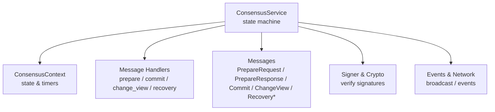
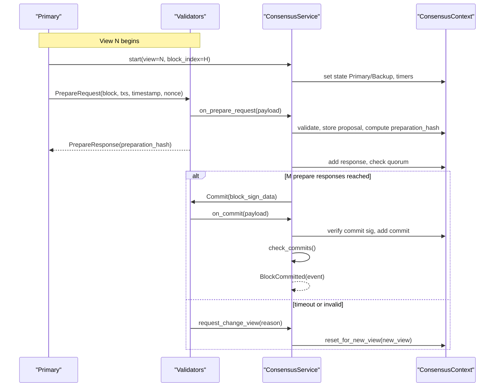
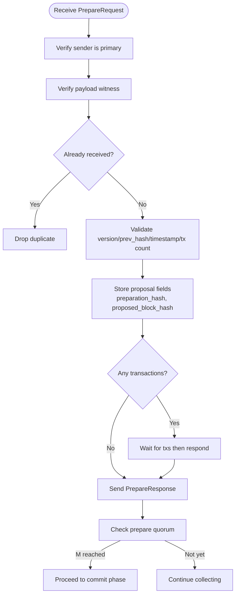
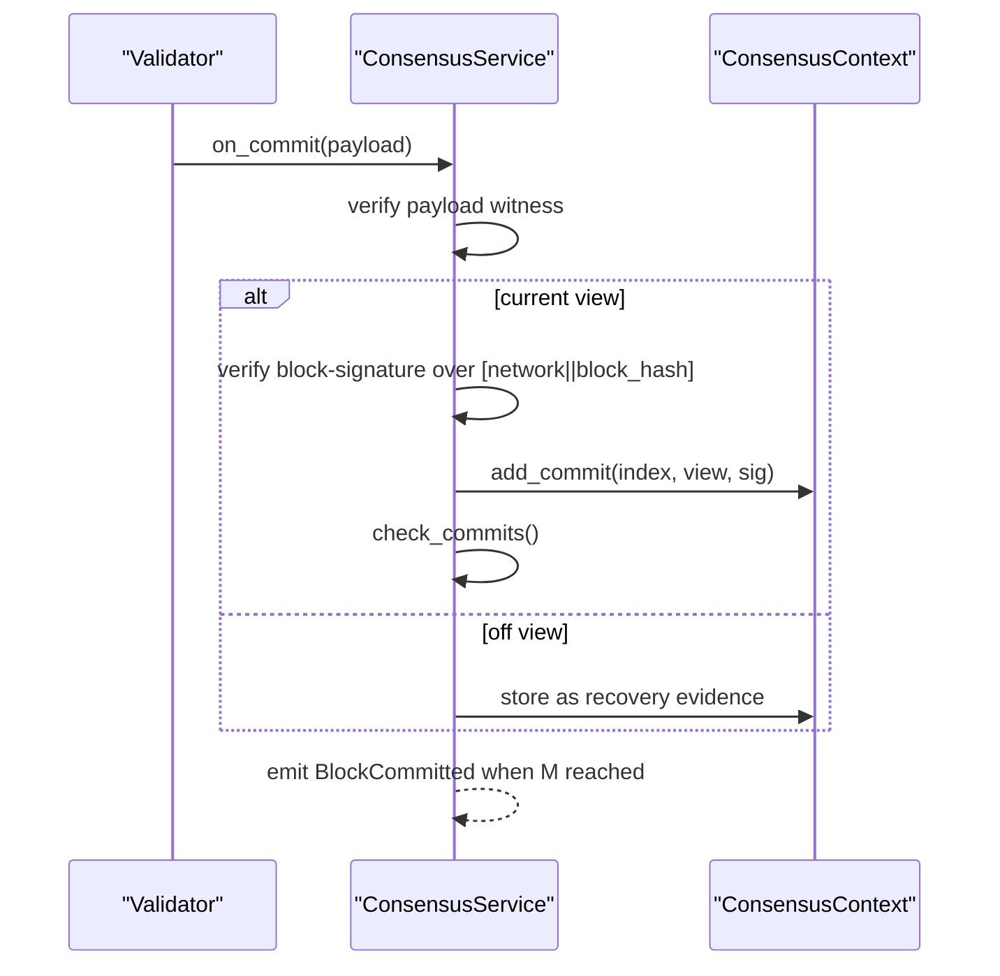
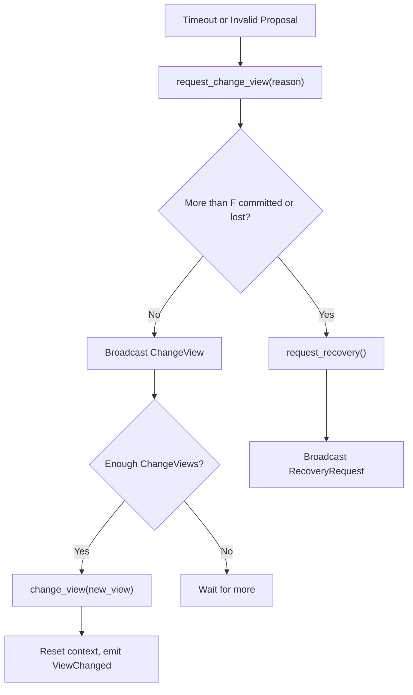
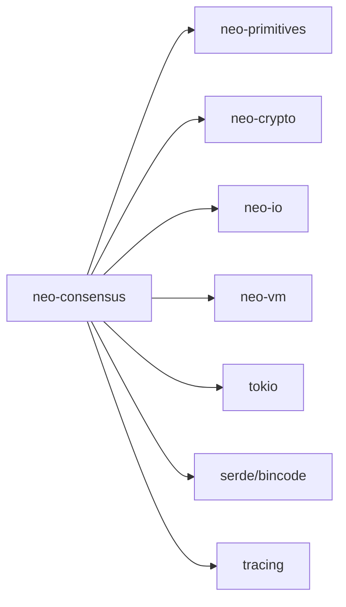

# Consensus Protocol

<cite>
**Referenced Files in This Document**
- [lib.rs](file://neo-consensus/src/lib.rs)
- [Cargo.toml](file://neo-consensus/Cargo.toml)
- [context/mod.rs](file://neo-consensus/src/context/mod.rs)
- [messages/mod.rs](file://neo-consensus/src/messages/mod.rs)
- [service/core.rs](file://neo-consensus/src/service/core.rs)
- [service/handlers/prepare.rs](file://neo-consensus/src/service/handlers/prepare.rs)
- [service/handlers/commit.rs](file://neo-consensus/src/service/handlers/commit.rs)
- [service/handlers/change_view.rs](file://neo-consensus/src/service/handlers/change_view.rs)
- [messages/prepare_request.rs](file://neo-consensus/src/messages/prepare_request.rs)
</cite>

## Table of Contents
1. [Introduction](#introduction)
2. [Project Structure](#project-structure)
3. [Core Components](#core-components)
4. [Architecture Overview](#architecture-overview)
5. [Detailed Component Analysis](#detailed-component-analysis)
6. [Dependency Analysis](#dependency-analysis)
7. [Performance Considerations](#performance-considerations)
8. [Troubleshooting Guide](#troubleshooting-guide)
9. [Conclusion](#conclusion)
10. [Appendices](#appendices)

## Introduction
This document explains the dBFT (Delegated Byzantine Fault Tolerance) consensus implementation in the neo-rs codebase. It covers the consensus service architecture, message handlers, state machine transitions, validator coordination, block proposal workflow from creation to finalization, voting mechanisms (signature aggregation, quorum detection, vote validation), view change protocol for fault tolerance, consensus message formats, network communication patterns, and security considerations. It also provides practical examples of participation, monitoring approaches, and troubleshooting guidance.

## Project Structure
The consensus crate is organized into focused modules:
- Service layer: main state machine and lifecycle management
- Context: persistent and transient consensus state
- Messages: on-wire format and per-message types
- Handlers: prepare, commit, change view, recovery flows
- Signer and error utilities

**Diagram sources**
- [service/core.rs:8-25](file://neo-consensus/src/service/core.rs#L8-L25)
- [context/mod.rs:111-191](file://neo-consensus/src/context/mod.rs#L111-L191)
- [messages/mod.rs:20-58](file://neo-consensus/src/messages/mod.rs#L20-L58)
- [service/handlers/prepare.rs:13-189](file://neo-consensus/src/service/handlers/prepare.rs#L13-L189)
- [service/handlers/commit.rs:8-139](file://neo-consensus/src/service/handlers/commit.rs#L8-L139)
- [service/handlers/change_view.rs:8-96](file://neo-consensus/src/service/handlers/change_view.rs#L8-L96)

**Section sources**
- [lib.rs:6-138](file://neo-consensus/src/lib.rs#L6-L138)
- [Cargo.toml:1-46](file://neo-consensus/Cargo.toml#L1-L46)

## Core Components
- ConsensusService: The main dBFT 2.0 state machine that orchestrates views, proposals, votes, commits, and view changes. It holds the context, network magic, private key material, optional signer, event channel, running flag, and recovery mode.
- ConsensusContext: Tracks current block index, view number, validators, my_index, state, timing, proposal data, signature collections, change view requests, and replay protection caches. Provides quorum checks, primary selection, timeouts, and persistence helpers.
- ConsensusPayload and Message Types: On-wire envelope and typed messages (PrepareRequest, PrepareResponse, Commit, ChangeView, RecoveryRequest, RecoveryMessage). Includes serialization/deserialization and wire format compatibility with Neo N3 DBFTPlugin.
- Handlers: Implement message-specific logic for prepare, commit, change view, and recovery, including validation, timer adjustments, quorum checks, and event emission.

Key responsibilities:
- Validate incoming messages and enforce cryptographic authenticity
- Maintain deterministic state transitions across views
- Enforce safety constraints (e.g., cannot sign commit without verified proposal)
- Provide crash-recovery friendly persistence of essential state

**Section sources**
- [service/core.rs:8-66](file://neo-consensus/src/service/core.rs#L8-L66)
- [context/mod.rs:111-191](file://neo-consensus/src/context/mod.rs#L111-L191)
- [messages/mod.rs:20-150](file://neo-consensus/src/messages/mod.rs#L20-L150)

## Architecture Overview
dBFT proceeds in views with a rotating primary (speaker). Each view attempts to propose and commit one block. Validators validate proposals and respond; once enough responses are collected, they move to commit and finalize. View changes recover from faulty or unresponsive primaries.

**Diagram sources**
- [service/handlers/prepare.rs:13-189](file://neo-consensus/src/service/handlers/prepare.rs#L13-L189)
- [service/handlers/commit.rs:8-139](file://neo-consensus/src/service/handlers/commit.rs#L8-L139)
- [service/handlers/change_view.rs:8-96](file://neo-consensus/src/service/handlers/change_view.rs#L8-L96)
- [context/mod.rs:275-382](file://neo-consensus/src/context/mod.rs#L275-L382)

## Detailed Component Analysis

### Consensus Service and State Machine
- Construction and lifecycle:
  - new(): initializes context with view 0, validators, optional my_index, private key wrapped for zeroization, event channel, and flags.
  - with_context(): supports recovery by loading persisted context.
- Running mode:
  - running flag indicates an active round.
  - is_recovering flag enables recovery-primary behavior during replay.

State transitions:
- Initial -> Primary/Backup at view start
- Backup -> Committed after M commits
- Any -> ViewChanging when requesting or receiving sufficient ChangeView

Timers:
- base_timeout uses expected_block_time and exponential backoff by view.
- extend_timer_by_factor extends deadlines upon valid progress (PrepareRequest, PrepareResponse, Commit).
- change_timer_for_view sets future view timeouts.

Quorum helpers:
- has_enough_prepare_responses: counts matching preparation hashes plus implicit primary vote.
- has_enough_commits: counts commits bound to current view.
- has_enough_change_views: counts ChangeView requests with new_view >= requested.

Persistence:
- save(): persists essential fields for crash recovery using atomic write + rename.

**Section sources**
- [service/core.rs:8-66](file://neo-consensus/src/service/core.rs#L8-L66)
- [context/mod.rs:384-455](file://neo-consensus/src/context/mod.rs#L384-L455)
- [context/mod.rs:514-617](file://neo-consensus/src/context/mod.rs#L514-L617)
- [context/mod.rs:760-800](file://neo-consensus/src/context/mod.rs#L760-L800)

### Prepare Phase
- on_prepare_request:
  - Validates sender is primary, verifies payload witness, rejects duplicates, validates version/prev_hash against local build, enforces MaxTransactionsPerBlock, checks timestamp bounds relative to parent and horizon.
  - Stores proposal metadata, computes preparation_hash, derives proposed_block_hash, and may send PrepareResponse immediately if no transactions.
  - Extends timer on valid receipt.
- on_prepare_response:
  - Rejects duplicates and ignores primary’s extra PrepareResponse (primary’s PrepareRequest occupies its slot).
  - Verifies payload witness, binds response to preparation_hash, stores invocation script, and checks quorum.
- send_prepare_response:
  - Non-primary validators send their signed PrepareResponse only after seeing a verified PrepareRequest (R02 safety).
- check_prepare_responses:
  - If M matching responses are present, triggers commit flow.

**Diagram sources**
- [service/handlers/prepare.rs:13-189](file://neo-consensus/src/service/handlers/prepare.rs#L13-L189)
- [service/handlers/prepare.rs:192-339](file://neo-consensus/src/service/handlers/prepare.rs#L192-L339)

**Section sources**
- [service/handlers/prepare.rs:13-189](file://neo-consensus/src/service/handlers/prepare.rs#L13-L189)
- [service/handlers/prepare.rs:192-339](file://neo-consensus/src/service/handlers/prepare.rs#L192-L339)
- [messages/prepare_request.rs:8-229](file://neo-consensus/src/messages/prepare_request.rs#L8-L229)

### Commit Phase
- on_commit:
  - Enforces one commit per validator per view; off-view commits stored as recovery evidence.
  - Requires non-empty witness and verifies payload signature for all commits to prevent suppression attacks.
  - For current-view commits, verifies block-signature over [network || block_hash] and adds to context.
  - Extends timer on valid current-view commit.
- check_commits:
  - When M commits for current view are present, emits BlockCommitted with prepared block data for upper layers to assemble the final block and multi-sig witness.

**Diagram sources**
- [service/handlers/commit.rs:8-139](file://neo-consensus/src/service/handlers/commit.rs#L8-L139)
- [service/handlers/commit.rs:141-243](file://neo-consensus/src/service/handlers/commit.rs#L141-L243)

**Section sources**
- [service/handlers/commit.rs:8-243](file://neo-consensus/src/service/handlers/commit.rs#L8-L243)

### View Change Protocol
- on_change_view:
  - Verifies payload witness and parses message.
  - Stale ChangeView (new_view <= current) treated as recovery trigger; does not overwrite monotonic state.
  - Skips if node already committed in this round.
  - Records ChangeView and invokes change_view if M requests met.
- request_change_view:
  - Increments view, reschedules timer for prospective view.
  - If more than F nodes committed or lost, requests recovery instead of normal view change.
  - Broadcasts ChangeView and checks for immediate transition.
- change_view:
  - Resets context for new view, updates timers, emits ViewChanged event.
  - Recovery path gives full backoff to new primary.

**Diagram sources**
- [service/handlers/change_view.rs:8-96](file://neo-consensus/src/service/handlers/change_view.rs#L8-L96)
- [service/handlers/change_view.rs:98-173](file://neo-consensus/src/service/handlers/change_view.rs#L98-L173)
- [service/handlers/change_view.rs:175-245](file://neo-consensus/src/service/handlers/change_view.rs#L175-L245)

**Section sources**
- [service/handlers/change_view.rs:8-245](file://neo-consensus/src/service/handlers/change_view.rs#L8-L245)

### Voting Mechanisms
- Signature aggregation:
  - PrepareResponses aggregated by preparation_hash; primary’s PrepareRequest implicitly votes for its own hash.
  - Commits aggregated per view; each validator contributes one commit per view.
- Quorum detection:
  - M = n - f, where f = floor((n-1)/3).
  - has_enough_prepare_responses, has_enough_commits, has_enough_change_views implement thresholds.
- Vote validation:
  - All messages require non-empty witnesses and pass signature verification.
  - R01: primary’s PrepareResponse does not double-count beyond its PrepareRequest slot.
  - R02: never sign Commit without a verified proposal hash; prevents binding to default/zero hash.

**Section sources**
- [context/mod.rs:303-382](file://neo-consensus/src/context/mod.rs#L303-L382)
- [service/handlers/prepare.rs:192-339](file://neo-consensus/src/service/handlers/prepare.rs#L192-L339)
- [service/handlers/commit.rs:8-139](file://neo-consensus/src/service/handlers/commit.rs#L8-L139)

### Consensus Message Formats and Network Communication
- ConsensusPayload:
  - Fields: network, block_index, validator_index, view_number, message_type, data, witness.
  - Wire format: [type:1][block_index:4][validator_index:1][view_number:1][body...].
- Message types:
  - PrepareRequest, PrepareResponse, Commit, ChangeView, RecoveryRequest, RecoveryMessage.
- Serialization:
  - Per-message bodies serialize consistently with C# DBFTPlugin expectations.
  - Recovery payloads embed full messages for state sync.

Network patterns:
- broadcast(payload): sends signed payloads to peers via upper-layer networking.
- Events: BlockCommitted, ViewChanged, BroadcastMessage emitted to observers.

**Section sources**
- [messages/mod.rs:20-150](file://neo-consensus/src/messages/mod.rs#L20-L150)
- [messages/prepare_request.rs:61-136](file://neo-consensus/src/messages/prepare_request.rs#L61-L136)

### Security Considerations
- Mandatory witness verification for all consensus messages to prevent spoofing.
- Strict validation of PrepareRequest fields (version, prev_hash, timestamp bounds, transaction count).
- Commit signature verification over [network || block_hash] ensures binding to specific block.
- Replay protection via LRU cache of seen message hashes and recovery response deduplication.
- Safety guards:
  - R01: primary’s PrepareResponse does not inflate vote count beyond its slot.
  - R02: Commit signing requires verified proposal hash.
- Zeroizing private keys to minimize exposure.

**Section sources**
- [service/handlers/prepare.rs:13-189](file://neo-consensus/src/service/handlers/prepare.rs#L13-L189)
- [service/handlers/commit.rs:8-139](file://neo-consensus/src/service/handlers/commit.rs#L8-L139)
- [context/mod.rs:640-682](file://neo-consensus/src/context/mod.rs#L640-L682)
- [service/core.rs:14-18](file://neo-consensus/src/service/core.rs#L14-L18)

## Dependency Analysis
The consensus crate depends on internal primitives and crypto for serialization, hashing, and cryptography, and uses async runtime and logging for operation.

**Diagram sources**
- [Cargo.toml:16-40](file://neo-consensus/Cargo.toml#L16-L40)

**Section sources**
- [Cargo.toml:1-46](file://neo-consensus/Cargo.toml#L1-L46)

## Performance Considerations
- Timer tuning:
  - Base timeouts scale exponentially with view number to handle delays gracefully.
  - extend_timer_by_factor adapts deadlines based on observed progress.
- Memory limits:
  - LRU caches bound seen_message_hashes and recovery_response_hashes to MAX_MESSAGE_CACHE_SIZE to prevent memory exhaustion.
- Transaction limits:
  - MaxTransactionsPerBlock enforced to avoid oversized proposals.
- Quorum efficiency:
  - Aggregation by preparation_hash avoids redundant work and reduces storage overhead.

[No sources needed since this section provides general guidance]

## Troubleshooting Guide
Common issues and diagnostics:
- Missing or invalid witnesses:
  - Errors indicate missing or invalid signatures on PrepareRequest, PrepareResponse, Commit, ChangeView.
  - Ensure proper signing pipeline and correct validator public keys.
- Invalid proposal:
  - Version/prev_hash mismatch or timestamp out of range leads to rejection.
  - Verify local blockchain state and time synchronization.
- Duplicate messages:
  - AlreadyReceived errors suggest retransmissions or misordered delivery.
  - Check network reliability and idempotent processing.
- Insufficient signatures:
  - Not enough PrepareResponses or Commits can stall progress.
  - Monitor validator connectivity and health; consider view change if primary is unresponsive.
- View change loops:
  - Frequent view changes may indicate network partitions or faulty primary.
  - Use recovery path when more than F nodes committed or lost.

Operational tips:
- Observe events: BlockCommitted, ViewChanged, BroadcastMessage for real-time insights.
- Persist context regularly to enable fast recovery after restarts.
- Tune expected_block_time and timeouts according to network conditions.

**Section sources**
- [service/handlers/prepare.rs:13-189](file://neo-consensus/src/service/handlers/prepare.rs#L13-L189)
- [service/handlers/commit.rs:8-139](file://neo-consensus/src/service/handlers/commit.rs#L8-L139)
- [service/handlers/change_view.rs:8-96](file://neo-consensus/src/service/handlers/change_view.rs#L8-L96)
- [context/mod.rs:640-682](file://neo-consensus/src/context/mod.rs#L640-L682)

## Conclusion
The neo-rs dBFT implementation provides a robust, secure, and efficient consensus mechanism aligned with Neo N3’s protocol. It enforces strict validation, maintains safety through careful signature binding and quorum checks, and supports fault tolerance via view changes and recovery. Operators can monitor progress via events, tune performance parameters, and rely on persistence for resilience.

[No sources needed since this section summarizes without analyzing specific files]

## Appendices

### Example Participation Flow
- As a validator:
  - Initialize ConsensusService with validators and your index.
  - Start consensus for the next block height.
  - Process incoming messages via process_message (upper layer integration).
  - Handle events: BlockCommitted to assemble blocks, ViewChanged to adjust state.
- As an observer:
  - Set my_index to None to receive events without participating.

**Section sources**
- [lib.rs:139-197](file://neo-consensus/src/lib.rs#L139-L197)