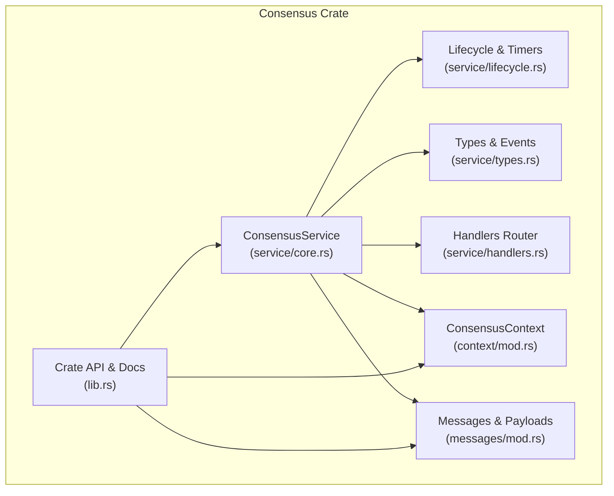
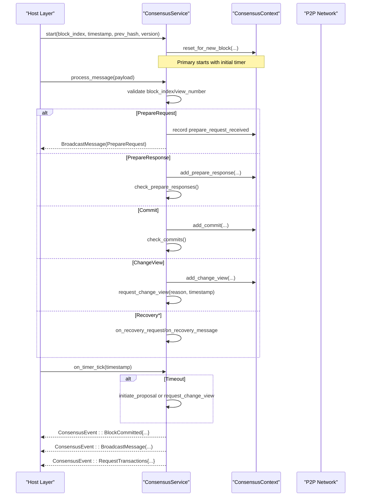
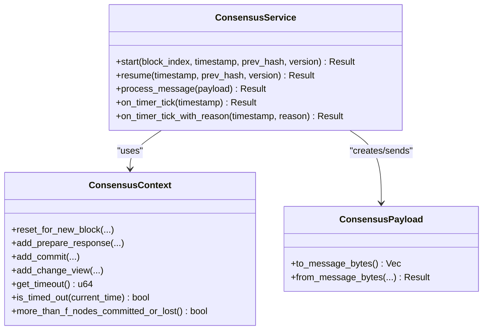
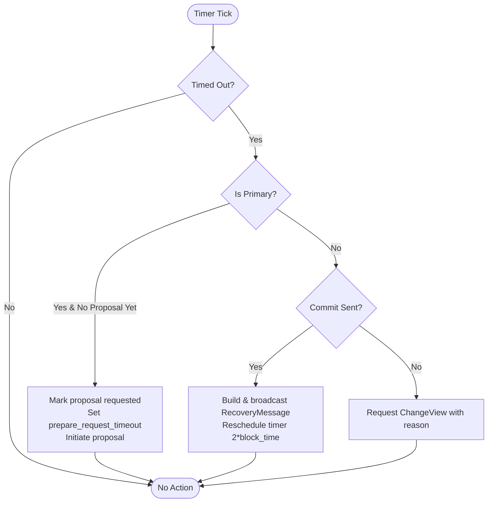
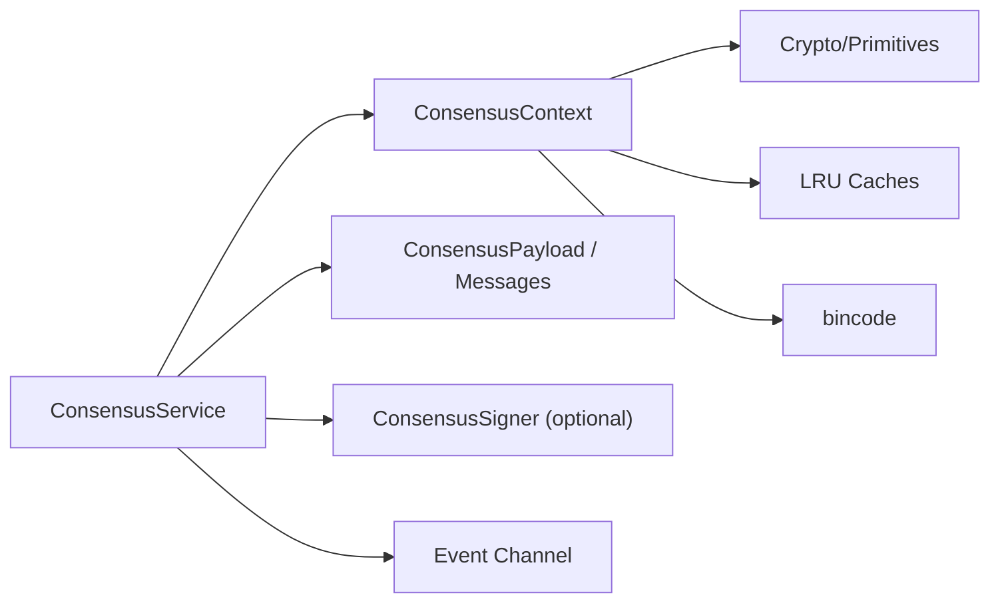

# Consensus Service

<cite>
**Referenced Files in This Document**
- [lib.rs](file://neo-consensus/src/lib.rs)
- [core.rs](file://neo-consensus/src/service/core.rs)
- [lifecycle.rs](file://neo-consensus/src/service/lifecycle.rs)
- [types.rs](file://neo-consensus/src/service/types.rs)
- [mod.rs (service)](file://neo-consensus/src/service/mod.rs)
- [handlers.rs (service)](file://neo-consensus/src/service/handlers.rs)
- [context/mod.rs](file://neo-consensus/src/context/mod.rs)
- [messages/mod.rs](file://neo-consensus/src/messages/mod.rs)
</cite>

## Table of Contents
1. [Introduction](#introduction)
2. [Project Structure](#project-structure)
3. [Core Components](#core-components)
4. [Architecture Overview](#architecture-overview)
5. [Detailed Component Analysis](#detailed-component-analysis)
6. [Dependency Analysis](#dependency-analysis)
7. [Performance Considerations](#performance-considerations)
8. [Troubleshooting Guide](#troubleshooting-guide)
9. [Conclusion](#conclusion)

## Introduction
This document provides comprehensive documentation for the ConsensusService implementation that orchestrates dBFT 2.0 consensus in Neo N3. It explains the service architecture, initialization and lifecycle management, event-driven processing, and the consensus context that tracks view numbers, validator sets, signatures, and block data. It also covers how the service coordinates between different consensus phases, manages validator communication via P2P integration points, and handles errors, timeouts, and recovery mechanisms.

The ConsensusService is the main state machine implementing dBFT 2.0, coordinating PrepareRequest/PrepareResponse/Commit flows, ChangeView transitions, and RecoveryMessage exchanges to achieve single-block finality with Byzantine fault tolerance.

## Project Structure
The consensus subsystem is organized into focused modules:
- Service layer: ConsensusService and its lifecycle, message handling, proposal assembly, and helpers.
- Context: ConsensusContext holds all round state, timers, signatures, and persistence helpers.
- Messages: Message types and wire format for dBFT payloads.
- Public API: Re-exports and crate-level documentation.

**Diagram sources**
- [core.rs:8-25](file://neo-consensus/src/service/core.rs#L8-L25)
- [lifecycle.rs:7-66](file://neo-consensus/src/service/lifecycle.rs#L7-L66)
- [types.rs:4-82](file://neo-consensus/src/service/types.rs#L4-L82)
- [handlers.rs:1-7](file://neo-consensus/src/service/handlers.rs#L1-L7)
- [context/mod.rs:111-191](file://neo-consensus/src/context/mod.rs#L111-L191)
- [messages/mod.rs:41-132](file://neo-consensus/src/messages/mod.rs#L41-L132)
- [lib.rs:221-285](file://neo-consensus/src/lib.rs#L221-L285)

**Section sources**
- [lib.rs:221-285](file://neo-consensus/src/lib.rs#L221-L285)
- [mod.rs (service):1-16](file://neo-consensus/src/service/mod.rs#L1-L16)

## Core Components
- ConsensusService: The dBFT 2.0 state machine that owns a ConsensusContext, network magic, private key/signer, event channel, and running/recovery flags. It exposes start/resume/process_message/timer tick methods and emits events for upper layers.
- ConsensusContext: Tracks current block index, view number, validators, role (primary/backup), timers, proposed block data, signature collections (prepare responses, commits, change views), invocation scripts, liveness tracking, replay protection caches, and persistence helpers.
- Messages: ConsensusPayload and typed messages (PrepareRequest, PrepareResponse, Commit, ChangeView, RecoveryRequest, RecoveryMessage) with serialization and validation.
- Types: BlockData and ConsensusEvent define outputs to upper layers; ConsensusCommand defines inputs from the host.

Key responsibilities:
- Lifecycle: start new rounds, resume after crash, process messages, handle timer ticks.
- Eventing: emit BlockCommitted, ViewChanged, BroadcastMessage, RequestTransactions.
- Coordination: enforce thresholds (M = n - f), manage view changes, and orchestrate recovery.

**Section sources**
- [core.rs:8-66](file://neo-consensus/src/service/core.rs#L8-L66)
- [context/mod.rs:111-191](file://neo-consensus/src/context/mod.rs#L111-L191)
- [messages/mod.rs:41-132](file://neo-consensus/src/messages/mod.rs#L41-L132)
- [types.rs:4-82](file://neo-consensus/src/service/types.rs#L4-L82)

## Architecture Overview
The ConsensusService drives dBFT 2.0 through an event-driven loop:
- Upper layers call start(resume) to begin or continue a round.
- Incoming P2P messages are routed via process_message to handlers based on message type.
- Timers trigger timeout handling, potentially initiating proposals or view changes.
- On commit, the service emits BlockCommitted with full BlockData for assembly.
- For cross-cutting needs, it emits BroadcastMessage to send outbound payloads and RequestTransactions to fetch transactions.

**Diagram sources**
- [lifecycle.rs:8-66](file://neo-consensus/src/service/lifecycle.rs#L8-L66)
- [lifecycle.rs:68-154](file://neo-consensus/src/service/lifecycle.rs#L68-L154)
- [lifecycle.rs:156-203](file://neo-consensus/src/service/lifecycle.rs#L156-L203)
- [types.rs:25-82](file://neo-consensus/src/service/types.rs#L25-L82)
- [messages/mod.rs:41-132](file://neo-consensus/src/messages/mod.rs#L41-L132)

## Detailed Component Analysis

### ConsensusService
- Initialization:
  - new(network, validators, my_index, private_key, event_tx) constructs the service with a fresh context and secure private key storage.
  - with_context allows resuming from persisted state.
- Lifecycle:
  - start resets context for a new block, sets metadata, and enables running mode.
  - resume restores transient fields, reinitializes timers, and resumes processing.
- Message processing:
  - process_message validates payload block_index and view_number, routes to specific handlers, updates liveness, and deduplicates by ExtensiblePayload hash.
- Timer handling:
  - on_timer_tick triggers primary proposal dispatch if needed or requests view change; after sending Commit, it resends RecoveryMessage with extended timeout.
- Events:
  - Emits BlockCommitted, ViewChanged, BroadcastMessage, RequestTransactions to coordinate with upper layers.

**Diagram sources**
- [core.rs:8-66](file://neo-consensus/src/service/core.rs#L8-L66)
- [lifecycle.rs:8-203](file://neo-consensus/src/service/lifecycle.rs#L8-L203)
- [messages/mod.rs:41-132](file://neo-consensus/src/messages/mod.rs#L41-L132)

**Section sources**
- [core.rs:8-66](file://neo-consensus/src/service/core.rs#L8-L66)
- [lifecycle.rs:8-203](file://neo-consensus/src/service/lifecycle.rs#L8-L203)

### ConsensusContext
- State tracking:
  - Current block_index, view_number, validators, my_index, and role (primary/backup).
  - Proposed block metadata (version, prev_hash, prev_timestamp, max_transactions_per_block, proposed_block_hash, preparation_hash, proposed_timestamp, proposed_tx_hashes, nonce).
  - Signature collections: prepare responses, prepare response hashes, commits, commit view numbers, change views, invocation scripts.
- Thresholds and roles:
  - f and m calculations, primary_index, is_primary/is_backup checks.
  - has_enough_prepare_responses, can_sign_commit, has_enough_commits, has_enough_change_views.
- Timers:
  - get_timeout, base_timeout, prepare_request_timeout, change_timer, extend_timer_by_factor, change_timer_for_view, is_timed_out.
- Liveness and safety:
  - last_seen_messages per validator, count_failed, more_than_f_nodes_committed_or_lost.
  - Replay protection via seen_message_hashes and recovery_response_hashes LRU caches.
- Persistence:
  - save/load/from_bytes for crash recovery; atomic write semantics.

**Diagram sources**
- [lifecycle.rs:156-203](file://neo-consensus/src/service/lifecycle.rs#L156-L203)
- [context/mod.rs:514-617](file://neo-consensus/src/context/mod.rs#L514-L617)

**Section sources**
- [context/mod.rs:111-191](file://neo-consensus/src/context/mod.rs#L111-L191)
- [context/mod.rs:257-382](file://neo-consensus/src/context/mod.rs#L257-L382)
- [context/mod.rs:384-455](file://neo-consensus/src/context/mod.rs#L384-L455)
- [context/mod.rs:457-512](file://neo-consensus/src/context/mod.rs#L457-L512)
- [context/mod.rs:514-617](file://neo-consensus/src/context/mod.rs#L514-L617)
- [context/mod.rs:619-758](file://neo-consensus/src/context/mod.rs#L619-L758)
- [context/mod.rs:760-934](file://neo-consensus/src/context/mod.rs#L760-L934)

### Messages and Wire Format
- ConsensusPayload wraps message_type, block_index, validator_index, view_number, serialized data, and witness.
- Serialization uses DBFTPlugin on-wire layout: [type][block_index][validator_index][view_number][body].
- Parsing validates minimum length and message type.

Integration points:
- process_message computes ExtensiblePayload hash for deduplication and routing.
- BroadcastMessage events carry payloads to be sent via P2P.

**Section sources**
- [messages/mod.rs:20-132](file://neo-consensus/src/messages/mod.rs#L20-L132)
- [messages/mod.rs:134-150](file://neo-consensus/src/messages/mod.rs#L134-L150)
- [lifecycle.rs:68-154](file://neo-consensus/src/service/lifecycle.rs#L68-L154)

### Event-Driven Processing and Integration
- Events emitted:
  - BlockCommitted: includes block_index, block_hash, and BlockData for assembly.
  - ViewChanged: includes block_index, old_view, new_view.
  - BroadcastMessage: outbound ConsensusPayload to be sent via P2P.
  - RequestTransactions: asks upper layers for transactions to include in the block.
- Commands accepted:
  - Start, ProcessMessage, TimerTick, TransactionsReceived, Stop.

Integration with P2P:
- Upper layers subscribe to ConsensusEvent::BroadcastMessage to send payloads across the network.
- They also supply transactions via ConsensusCommand::TransactionsReceived when requested.

**Section sources**
- [types.rs:4-82](file://neo-consensus/src/service/types.rs#L4-L82)
- [lib.rs:139-197](file://neo-consensus/src/lib.rs#L139-L197)

## Dependency Analysis
- ConsensusService depends on:
  - ConsensusContext for state and thresholds.
  - ConsensusPayload and typed messages for I/O.
  - ConsensusSigner trait for signing (optional).
  - Event channel for asynchronous notifications.
- Context depends on:
  - Crypto primitives (ECPoint), primitives (UInt160/UInt256), LRU cache for replay protection, bincode for persistence.
- Handlers module organizes message-specific logic (prepare, commit, change_view, recovery).

**Diagram sources**
- [core.rs:8-25](file://neo-consensus/src/service/core.rs#L8-L25)
- [context/mod.rs:1-12](file://neo-consensus/src/context/mod.rs#L1-L12)
- [messages/mod.rs:41-132](file://neo-consensus/src/messages/mod.rs#L41-L132)

**Section sources**
- [core.rs:8-25](file://neo-consensus/src/service/core.rs#L8-L25)
- [context/mod.rs:1-12](file://neo-consensus/src/context/mod.rs#L1-L12)
- [messages/mod.rs:41-132](file://neo-consensus/src/messages/mod.rs#L41-L132)

## Performance Considerations
- Timeouts scale exponentially with view number to balance liveness and stability.
- LRU caches bound memory usage for seen message hashes and recovery response deduplication.
- Atomic file writes prevent corruption during persistence.
- Minimal state persisted reduces disk I/O overhead.
- Avoid unnecessary broadcasts by validating messages early and skipping off-view payloads.

[No sources needed since this section provides general guidance]

## Troubleshooting Guide
Common issues and resolutions:
- NotValidator: Starting without a validator index; ensure my_index is set for participating nodes.
- WrongBlock: Received message for a different block index; verify synchronization and round boundaries.
- InvalidValidatorIndex: Validator index out of range; confirm validator list ordering and indices.
- AlreadyReceived: Duplicate commit for same view; ignore or handle idempotently.
- Replay detection: Duplicate messages ignored; ensure unique payloads and correct witnesses.
- Timeout loops: If repeated view changes occur, inspect network connectivity and validator liveness; consider extending timers or adjusting expected_block_time.

Operational tips:
- Monitor last_seen_messages and count_failed to detect offline validators.
- Use recovery flows when MoreThanFNodesCommittedOrLost to avoid split-brain scenarios.
- Ensure proper timer initialization after resume to avoid immediate timeouts.

**Section sources**
- [lifecycle.rs:68-154](file://neo-consensus/src/service/lifecycle.rs#L68-L154)
- [context/mod.rs:457-512](file://neo-consensus/src/context/mod.rs#L457-L512)
- [context/mod.rs:684-758](file://neo-consensus/src/context/mod.rs#L684-L758)

## Conclusion
The ConsensusService implements a robust, event-driven dBFT 2.0 engine that coordinates validators through well-defined phases, enforces safety and liveness properties, and integrates cleanly with P2P and upper-layer services. Its design emphasizes clear separation of concerns: the service manages flow control and events, the context maintains state and thresholds, and messages provide a stable wire format. With strong error handling, timeout management, and crash recovery, it provides a solid foundation for production-grade consensus in Neo N3.

[No sources needed since this section summarizes without analyzing specific files]