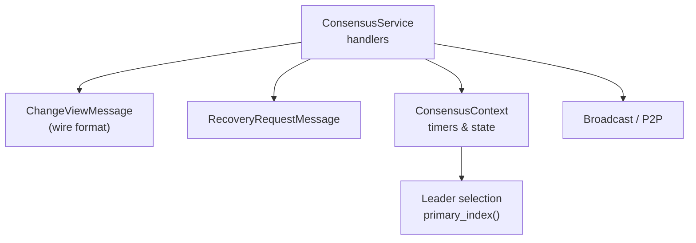
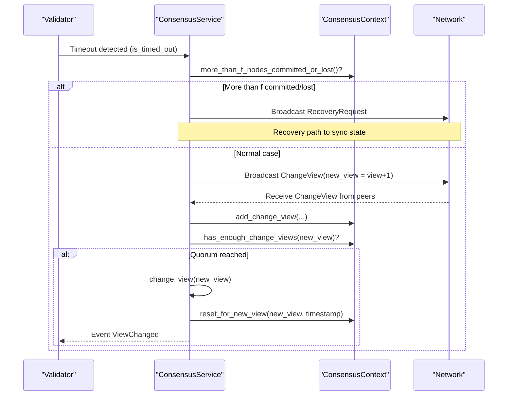
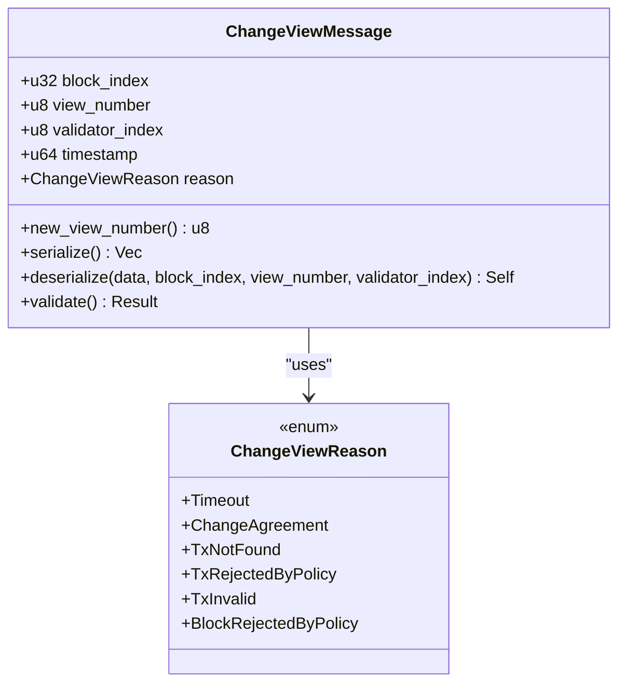
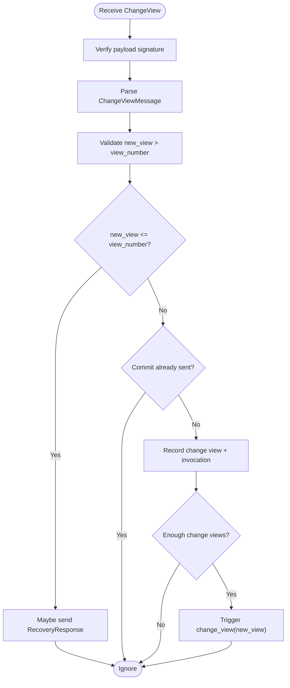
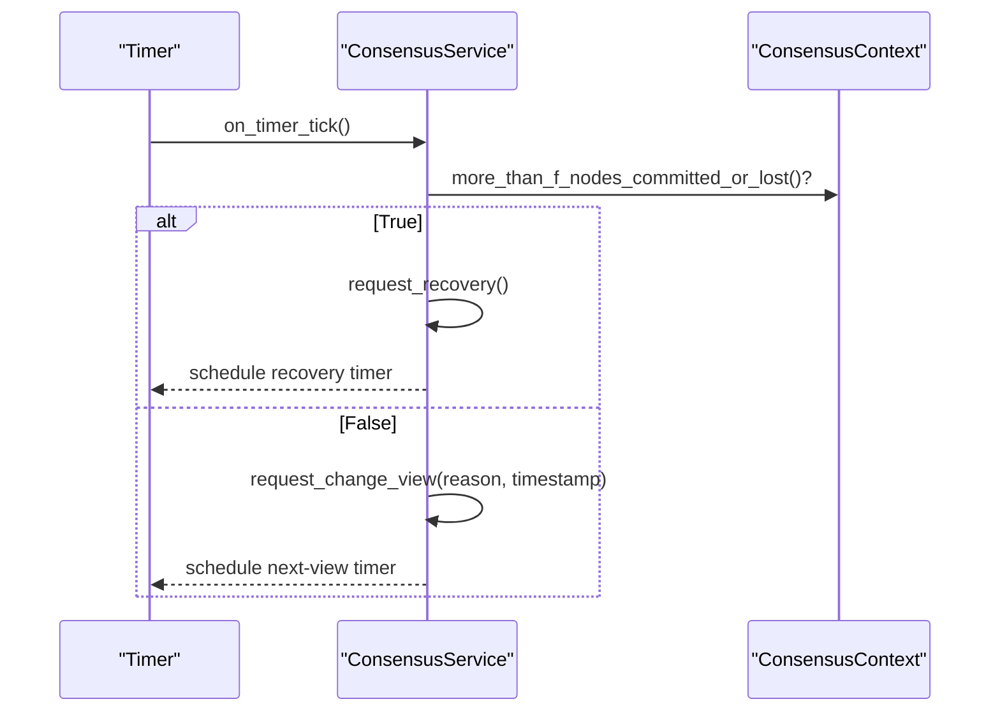
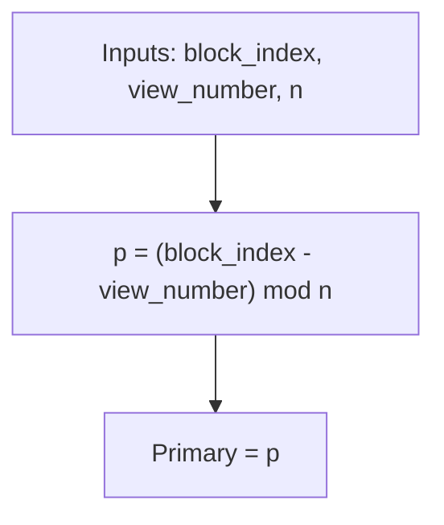
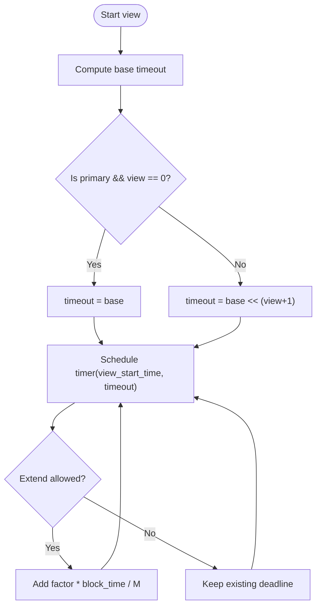
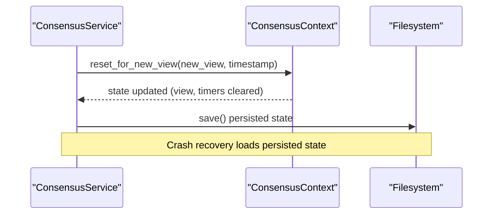
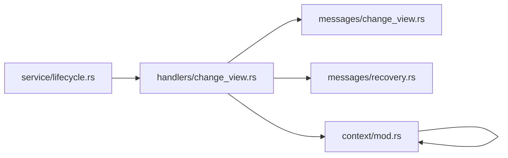

# View Change Protocol

<cite>
**Referenced Files in This Document**
- [change_view.rs](file://neo-consensus/src/messages/change_view.rs)
- [change_view_reason.rs](file://neo-consensus/src/change_view_reason.rs)
- [context/mod.rs](file://neo-consensus/src/context/mod.rs)
- [handlers/change_view.rs](file://neo-consensus/src/service/handlers/change_view.rs)
- [service/lifecycle.rs](file://neo-consensus/src/service/lifecycle.rs)
- [messages/recovery.rs](file://neo-consensus/src/messages/recovery.rs)
</cite>

## Table of Contents
1. [Introduction](#introduction)
2. [Project Structure](#project-structure)
3. [Core Components](#core-components)
4. [Architecture Overview](#architecture-overview)
5. [Detailed Component Analysis](#detailed-component-analysis)
6. [Dependency Analysis](#dependency-analysis)
7. [Performance Considerations](#performance-considerations)
8. [Troubleshooting Guide](#troubleshooting-guide)
9. [Conclusion](#conclusion)

## Introduction
This document explains the view change protocol that provides fault tolerance in dBFT consensus for Neo. It covers how validators detect failed or malicious primaries via timeouts, initiate view changes, and recover through recovery requests when necessary. It documents the ChangeView message format and propagation, leader rotation based on view numbers, state synchronization during view transitions, timing parameters, and troubleshooting guidance.

## Project Structure
The view change logic spans several modules within the consensus subsystem:
- Message definitions for ChangeView and RecoveryRequest
- Consensus context tracking timers, view number, and validator state
- Service handlers processing incoming messages and triggering view changes
- Lifecycle hooks that react to timeouts and decide between view change and recovery

**Diagram sources**
- [handlers/change_view.rs:10-96](file://neo-consensus/src/service/handlers/change_view.rs#L10-L96)
- [messages/change_view.rs:1-100](file://neo-consensus/src/messages/change_view.rs#L1-L100)
- [messages/recovery.rs:1-200](file://neo-consensus/src/messages/recovery.rs#L1-L200)
- [context/mod.rs:275-286](file://neo-consensus/src/context/mod.rs#L275-L286)

**Section sources**
- [handlers/change_view.rs:10-245](file://neo-consensus/src/service/handlers/change_view.rs#L10-L245)
- [messages/change_view.rs:1-170](file://neo-consensus/src/messages/change_view.rs#L1-L170)
- [context/mod.rs:111-191](file://neo-consensus/src/context/mod.rs#L111-L191)

## Core Components
- ChangeViewMessage: Encapsulates a request to advance to the next view with a timestamp and reason.
- ChangeViewReason: Enumerates reasons such as timeout, policy rejections, or agreement on a different view.
- ConsensusContext: Tracks view number, timers, signatures, change view requests, and helper methods for timeouts and leader selection.
- ConsensusService handlers: Validate and process ChangeView messages, trigger view changes, and coordinate recovery when needed.

Key responsibilities:
- Detect timeouts and initiate view change or recovery
- Enforce monotonic view progression and quorum thresholds
- Persist and restore relevant consensus state across restarts

**Section sources**
- [messages/change_view.rs:1-100](file://neo-consensus/src/messages/change_view.rs#L1-L100)
- [change_view_reason.rs:1-79](file://neo-consensus/src/change_view_reason.rs#L1-L79)
- [context/mod.rs:372-382](file://neo-consensus/src/context/mod.rs#L372-L382)
- [handlers/change_view.rs:10-96](file://neo-consensus/src/service/handlers/change_view.rs#L10-L96)

## Architecture Overview
The view change protocol ensures progress even if the primary is unresponsive or malicious. Validators monitor timeouts per view; upon timeout or specific failure conditions, they either:
- Request a normal view change by broadcasting ChangeView, or
- Request recovery via RecoveryRequest when more than f nodes have committed or are lost.

**Diagram sources**
- [handlers/change_view.rs:105-173](file://neo-consensus/src/service/handlers/change_view.rs#L105-L173)
- [handlers/change_view.rs:205-243](file://neo-consensus/src/service/handlers/change_view.rs#L205-L243)
- [context/mod.rs:595-617](file://neo-consensus/src/context/mod.rs#L595-L617)
- [context/mod.rs:384-409](file://neo-consensus/src/context/mod.rs#L384-L409)

## Detailed Component Analysis

### ChangeView Message Format and Validation
- Fields: block index, current view number, validator index, timestamp, reason.
- Wire format: timestamp (8 bytes, little-endian) + reason (1 byte).
- New view number is always current view + 1; validation enforces strict increase and overflow safety.

**Diagram sources**
- [messages/change_view.rs:1-100](file://neo-consensus/src/messages/change_view.rs#L1-L100)
- [change_view_reason.rs:1-79](file://neo-consensus/src/change_view_reason.rs#L1-L79)

**Section sources**
- [messages/change_view.rs:1-100](file://neo-consensus/src/messages/change_view.rs#L1-L100)
- [change_view_reason.rs:1-79](file://neo-consensus/src/change_view_reason.rs#L1-L79)

### Handling Incoming ChangeView Messages
- Verifies payload signature and parses ChangeView data.
- Rejects stale or duplicate requests; ignores if commit already sent.
- Records change view request and invocation script; triggers view change when quorum is met.

**Diagram sources**
- [handlers/change_view.rs:10-96](file://neo-consensus/src/service/handlers/change_view.rs#L10-L96)

**Section sources**
- [handlers/change_view.rs:10-96](file://neo-consensus/src/service/handlers/change_view.rs#L10-L96)

### Initiating View Change and Recovery Decision
- On timeout or explicit trigger, compute new_view = view_number + 1.
- If more than f nodes have committed or are lost, request recovery instead of view change to avoid network splits.
- Otherwise, broadcast ChangeView and check local quorum immediately.

**Diagram sources**
- [service/lifecycle.rs:183-204](file://neo-consensus/src/service/lifecycle.rs#L183-L204)
- [handlers/change_view.rs:105-173](file://neo-consensus/src/service/handlers/change_view.rs#L105-L173)

**Section sources**
- [service/lifecycle.rs:183-204](file://neo-consensus/src/service/lifecycle.rs#L183-L204)
- [handlers/change_view.rs:105-173](file://neo-consensus/src/service/handlers/change_view.rs#L105-L173)

### Leader Rotation Algorithm
- Primary for a given view is computed deterministically from block index and view number.
- Formula matches reference implementation: primary_index = (block_index - view_number) mod n.

**Diagram sources**
- [context/mod.rs:275-286](file://neo-consensus/src/context/mod.rs#L275-L286)

**Section sources**
- [context/mod.rs:275-286](file://neo-consensus/src/context/mod.rs#L275-L286)

### Timing Parameters and Timeouts
- Base timeout uses expected_block_time (default 15 seconds) with exponential backoff per view.
- For view 0 primary, initial timeout equals base; other cases use base << (view_number + 1).
- Timers can be extended by factors during normal rounds but not once view changing or after committing.
- On view change, timers are rescheduled for the prospective view; recovery-primary gets full backoff interval.

**Diagram sources**
- [context/mod.rs:595-617](file://neo-consensus/src/context/mod.rs#L595-L617)
- [context/mod.rs:564-593](file://neo-consensus/src/context/mod.rs#L564-L593)
- [handlers/change_view.rs:205-243](file://neo-consensus/src/service/handlers/change_view.rs#L205-L243)

**Section sources**
- [context/mod.rs:564-617](file://neo-consensus/src/context/mod.rs#L564-L617)
- [handlers/change_view.rs:205-243](file://neo-consensus/src/service/handlers/change_view.rs#L205-L243)

### State Synchronization During View Transitions
- On successful view change, context resets proposal and signature sets while preserving change view history for recovery.
- Persistence captures essential state (views, signatures, proposals) to resume after restart.
- Recovery path broadcasts RecoveryRequest to obtain missing state from peers when needed.

**Diagram sources**
- [context/mod.rs:384-409](file://neo-consensus/src/context/mod.rs#L384-L409)
- [context/mod.rs:771-810](file://neo-consensus/src/context/mod.rs#L771-L810)
- [context/mod.rs:856-921](file://neo-consensus/src/context/mod.rs#L856-L921)
- [handlers/change_view.rs:175-203](file://neo-consensus/src/service/handlers/change_view.rs#L175-L203)

**Section sources**
- [context/mod.rs:384-409](file://neo-consensus/src/context/mod.rs#L384-L409)
- [context/mod.rs:771-921](file://neo-consensus/src/context/mod.rs#L771-L921)
- [handlers/change_view.rs:175-203](file://neo-consensus/src/service/handlers/change_view.rs#L175-L203)

### Example Scenarios
- Timeout-triggered view change: Validator times out, checks commitment/failure counts, sends ChangeView, advances view upon quorum.
- Recovery-triggered path: After commit sent or when more than f nodes are committed/lost, node requests recovery to synchronize state before proceeding.
- Malicious primary: Validators detect lack of valid proposals or invalid transactions and trigger ChangeView with appropriate reasons.

[No sources needed since this section summarizes scenarios without analyzing specific files]

## Dependency Analysis

**Diagram sources**
- [handlers/change_view.rs:10-245](file://neo-consensus/src/service/handlers/change_view.rs#L10-L245)
- [messages/change_view.rs:1-170](file://neo-consensus/src/messages/change_view.rs#L1-L170)
- [messages/recovery.rs:1-200](file://neo-consensus/src/messages/recovery.rs#L1-L200)
- [context/mod.rs:111-191](file://neo-consensus/src/context/mod.rs#L111-L191)
- [service/lifecycle.rs:183-204](file://neo-consensus/src/service/lifecycle.rs#L183-L204)

**Section sources**
- [handlers/change_view.rs:10-245](file://neo-consensus/src/service/handlers/change_view.rs#L10-L245)
- [service/lifecycle.rs:183-204](file://neo-consensus/src/service/lifecycle.rs#L183-L204)
- [context/mod.rs:111-191](file://neo-consensus/src/context/mod.rs#L111-L191)

## Performance Considerations
- Exponential backoff reduces churn under transient failures while ensuring liveness.
- Message deduplication caches prevent replay attacks and reduce redundant processing.
- Timer extensions only apply in normal rounds; once view changing or committed, deadlines remain stable to avoid oscillation.
- Persisting minimal state minimizes I/O overhead during crash recovery.

[No sources needed since this section provides general guidance]

## Troubleshooting Guide
Common issues and diagnostics:
- Repeated view changes: Check if more than f nodes are committed or lost; consider recovery path.
- Stuck in view change: Ensure ChangeView messages are signed and accepted; verify quorum counting and monotonic view advancement.
- Timeout misconfiguration: Validate expected_block_time and timer extension behavior; confirm timers are rescheduled correctly on view change.
- Recovery loops: Confirm RecoveryRequest handling and that peers respond with necessary state; ensure persistence load restores correct view and signatures.

Operational checks:
- Inspect logs for ChangeView and RecoveryRequest events.
- Monitor validator last seen messages to identify failed nodes.
- Verify persisted state integrity across restarts.

**Section sources**
- [handlers/change_view.rs:10-96](file://neo-consensus/src/service/handlers/change_view.rs#L10-L96)
- [context/mod.rs:635-758](file://neo-consensus/src/context/mod.rs#L635-L758)
- [context/mod.rs:771-921](file://neo-consensus/src/context/mod.rs#L771-L921)

## Conclusion
The view change protocol in dBFT provides robust fault tolerance by detecting primary failures via timeouts, coordinating view changes through signed ChangeView messages, and falling back to recovery when necessary. Deterministic leader rotation, careful timer management, and persistent state enable consistent progress and safe recovery across validator nodes.

[No sources needed since this section summarizes without analyzing specific files]