# Voting System

<cite>
**Referenced Files in This Document**
- [commit.rs](file://neo-consensus/src/service/handlers/commit.rs)
- [prepare.rs](file://neo-consensus/src/service/handlers/prepare.rs)
- [mod.rs](file://neo-consensus/src/context/mod.rs)
- [prepare_response.rs](file://neo-consensus/src/messages/prepare_response.rs)
- [signer.rs](file://neo-consensus/src/signer.rs)
- [helpers.rs](file://neo-consensus/src/service/tests/helpers.rs)
</cite>

## Table of Contents
1. [Introduction](#introduction)
2. [Project Structure](#project-structure)
3. [Core Components](#core-components)
4. [Architecture Overview](#architecture-overview)
5. [Detailed Component Analysis](#detailed-component-analysis)
6. [Dependency Analysis](#dependency-analysis)
7. [Performance Considerations](#performance-considerations)
8. [Troubleshooting Guide](#troubleshooting-guide)
9. [Conclusion](#conclusion)

## Introduction
This document explains the voting system in dBFT consensus used by Neo, focusing on the commit phase where validators finalize blocks after collecting sufficient prepare responses. It covers:
- Commit message handling and validation
- Signature aggregation for block finalization
- Quorum detection algorithms (M = n - f)
- Vote validation including signature verification, message authentication, and duplicate prevention
- Examples of vote collection and quorum achievement
- Security considerations to protect against Byzantine behavior

## Project Structure
The voting logic is implemented across a small set of focused modules:
- Service handlers process incoming consensus messages and drive state transitions
- Context tracks votes, signatures, view numbers, and quorum thresholds
- Message types define PrepareResponse payloads and validation rules
- Signer abstraction provides cryptographic signing interfaces
- Test helpers demonstrate how to sign payloads and commits

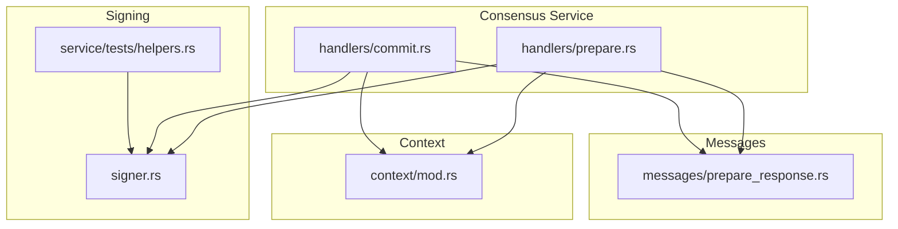

**Diagram sources**
- [prepare.rs:15-189](file://neo-consensus/src/service/handlers/prepare.rs#L15-L189)
- [commit.rs:10-139](file://neo-consensus/src/service/handlers/commit.rs#L10-L139)
- [mod.rs:111-191](file://neo-consensus/src/context/mod.rs#L111-L191)
- [prepare_response.rs:7-81](file://neo-consensus/src/messages/prepare_response.rs#L7-L81)
- [signer.rs:41-51](file://neo-consensus/src/signer.rs#L41-L51)
- [helpers.rs:47-64](file://neo-consensus/src/service/tests/helpers.rs#L47-L64)

**Section sources**
- [prepare.rs:15-189](file://neo-consensus/src/service/handlers/prepare.rs#L15-L189)
- [commit.rs:10-139](file://neo-consensus/src/service/handlers/commit.rs#L10-L139)
- [mod.rs:111-191](file://neo-consensus/src/context/mod.rs#L111-L191)
- [prepare_response.rs:7-81](file://neo-consensus/src/messages/prepare_response.rs#L7-L81)
- [signer.rs:41-51](file://neo-consensus/src/signer.rs#L41-L51)
- [helpers.rs:47-64](file://neo-consensus/src/service/tests/helpers.rs#L47-L64)

## Core Components
- ConsensusService handlers:
  - PrepareRequest/PrepareResponse processing validates proposals, collects votes, and triggers commit when quorum is reached
  - Commit processing verifies payload witness and block-hash signature, stores valid commits, and finalizes the block when enough are collected
- ConsensusContext:
  - Tracks validator sets, view numbers, proposal data, prepared votes, and committed signatures
  - Provides quorum checks for prepare responses and commits, and helper methods for timer management and recovery decisions
- Messages:
  - PrepareResponseMessage carries the preparation hash that binds a validator’s vote to a specific proposal
- Signing:
  - ConsensusSigner abstracts validator key usage; test helpers show how to compute dBFT sign data and sign commits

Key responsibilities:
- Validate every incoming message’s signature and payload integrity
- Prevent duplicates and replay attacks using per-round caches and per-validator slots
- Enforce quorum thresholds based on n and f
- Aggregate signatures into a multi-signature witness for the finalized block

**Section sources**
- [prepare.rs:15-189](file://neo-consensus/src/service/handlers/prepare.rs#L15-L189)
- [prepare.rs:192-338](file://neo-consensus/src/service/handlers/prepare.rs#L192-L338)
- [commit.rs:10-139](file://neo-consensus/src/service/handlers/commit.rs#L10-L139)
- [commit.rs:141-241](file://neo-consensus/src/service/handlers/commit.rs#L141-L241)
- [mod.rs:257-382](file://neo-consensus/src/context/mod.rs#L257-L382)
- [prepare_response.rs:7-81](file://neo-consensus/src/messages/prepare_response.rs#L7-L81)
- [signer.rs:41-51](file://neo-consensus/src/signer.rs#L41-L51)
- [helpers.rs:47-64](file://neo-consensus/src/service/tests/helpers.rs#L47-L64)

## Architecture Overview
The commit phase follows a clear sequence:
1. Primary proposes a block via PrepareRequest
2. Validators respond with PrepareResponse binding to the proposal hash
3. When M prepare responses are collected, validators broadcast Commit signed over network + block hash
4. When M commits are collected, the block is finalized and assembled

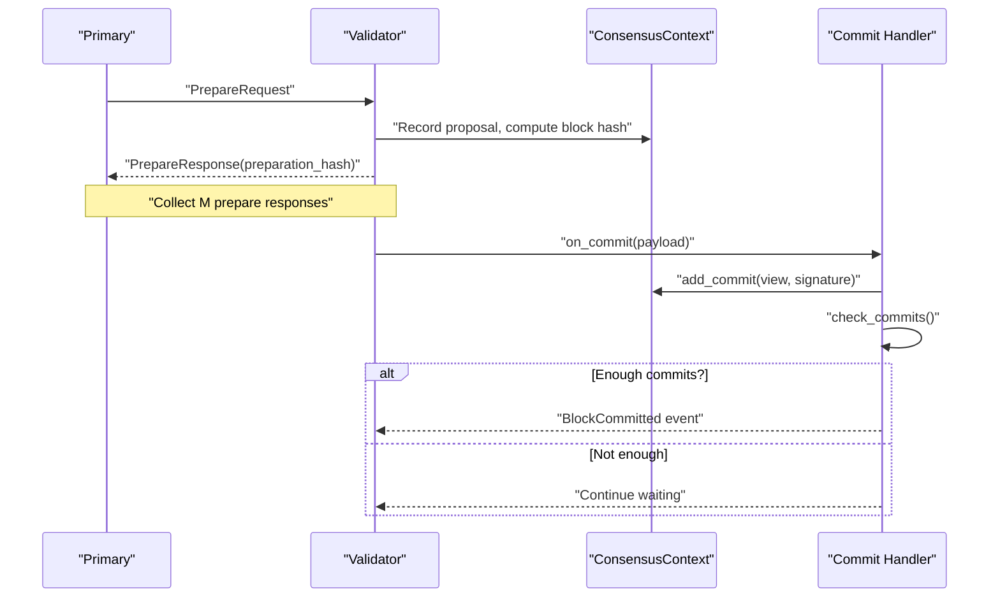

**Diagram sources**
- [prepare.rs:15-189](file://neo-consensus/src/service/handlers/prepare.rs#L15-L189)
- [prepare.rs:192-338](file://neo-consensus/src/service/handlers/prepare.rs#L192-L338)
- [commit.rs:10-139](file://neo-consensus/src/service/handlers/commit.rs#L10-L139)
- [commit.rs:141-241](file://neo-consensus/src/service/handlers/commit.rs#L141-L241)
- [mod.rs:303-382](file://neo-consensus/src/context/mod.rs#L303-L382)

## Detailed Component Analysis

### Commit Phase Processing
- Validates payload length and witness presence
- Verifies ExtensiblePayload witness for all commits regardless of view to prevent slot suppression attacks
- For current-view commits, verifies the block-hash signature over network magic + block hash
- Stores commit signature and invocation script, then checks if quorum is met

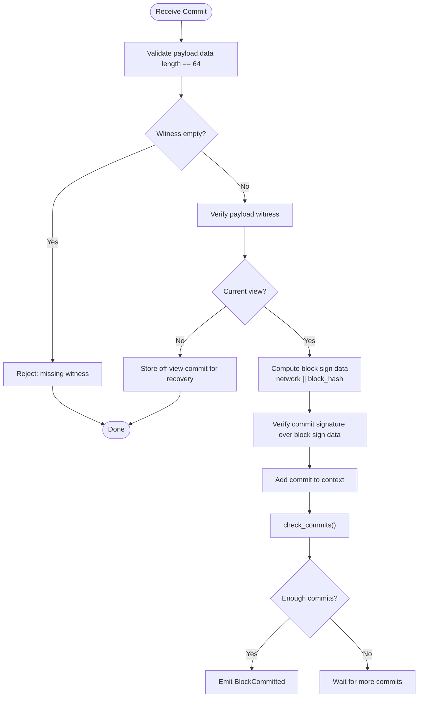

**Diagram sources**
- [commit.rs:32-139](file://neo-consensus/src/service/handlers/commit.rs#L32-L139)

**Section sources**
- [commit.rs:32-139](file://neo-consensus/src/service/handlers/commit.rs#L32-L139)

### Prepare Response Handling and Quorum Detection
- Rejects duplicates per validator index
- Ensures primary’s PrepareResponse does not double-count its implicit PrepareRequest vote
- Validates PrepareResponse hash matches the known preparation hash
- Extends timer on valid response and aggregates votes

Quorum detection:
- has_enough_prepare_responses counts matching preparation hashes plus the primary’s implicit vote
- Threshold is M = n - f

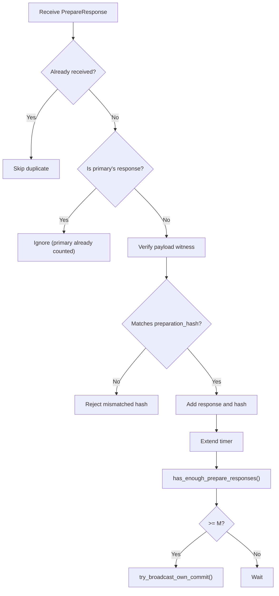

**Diagram sources**
- [prepare.rs:192-338](file://neo-consensus/src/service/handlers/prepare.rs#L192-L338)
- [mod.rs:303-334](file://neo-consensus/src/context/mod.rs#L303-L334)

**Section sources**
- [prepare.rs:192-338](file://neo-consensus/src/service/handlers/prepare.rs#L192-L338)
- [mod.rs:303-334](file://neo-consensus/src/context/mod.rs#L303-L334)

### Commit Quorum and Block Assembly
- check_commits ensures at least M commits from the current view
- On success, prepares block data by collecting validator public keys and commit signatures
- Emits BlockCommitted event with required metadata for upper layers to assemble the final block

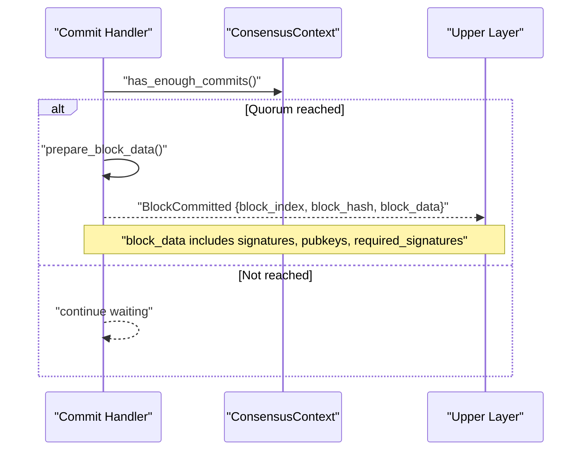

**Diagram sources**
- [commit.rs:141-241](file://neo-consensus/src/service/handlers/commit.rs#L141-L241)
- [mod.rs:348-382](file://neo-consensus/src/context/mod.rs#L348-L382)

**Section sources**
- [commit.rs:141-241](file://neo-consensus/src/service/handlers/commit.rs#L141-L241)
- [mod.rs:348-382](file://neo-consensus/src/context/mod.rs#L348-L382)

### Signature Aggregation Mechanism
- Each validator signs the block sign data (network magic + block hash) for Commit
- The service collects these signatures indexed by validator index
- Upper layer constructs a multi-signature witness using validator public keys and collected signatures
- Required number of signatures equals M computed from validator count and fault tolerance

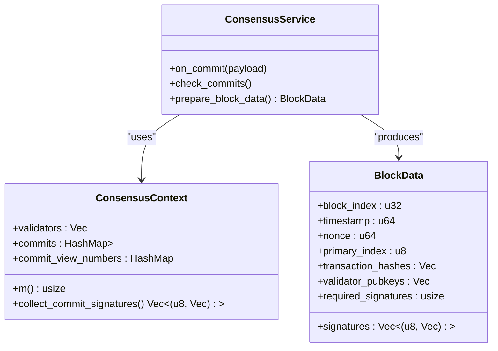

**Diagram sources**
- [commit.rs:183-241](file://neo-consensus/src/service/handlers/commit.rs#L183-L241)
- [mod.rs:257-273](file://neo-consensus/src/context/mod.rs#L257-L273)
- [mod.rs:619-633](file://neo-consensus/src/context/mod.rs#L619-L633)

**Section sources**
- [commit.rs:183-241](file://neo-consensus/src/service/handlers/commit.rs#L183-L241)
- [mod.rs:257-273](file://neo-consensus/src/context/mod.rs#L257-L273)
- [mod.rs:619-633](file://neo-consensus/src/context/mod.rs#L619-L633)

### Vote Validation and Duplicate Prevention
- Every message requires a non-empty witness and passes signature verification
- PrepareRequest enforces version/prev_hash consistency, transaction limits, and timestamp bounds
- PrepareResponse must match the known preparation hash; primary’s extra response is ignored to avoid double counting
- Commits require exact 64-byte signature and verify both payload witness and block-hash signature
- Duplicate prevention:
  - Per-validator slots for commits and prepare responses
  - LRU cache of seen message hashes to block replays
  - Recovery response deduplication

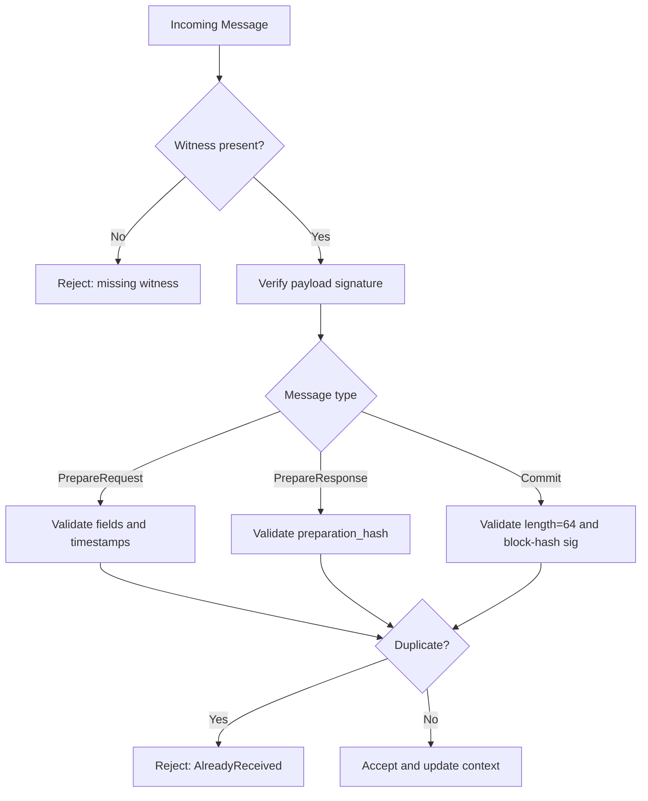

**Diagram sources**
- [prepare.rs:15-189](file://neo-consensus/src/service/handlers/prepare.rs#L15-L189)
- [prepare.rs:192-338](file://neo-consensus/src/service/handlers/prepare.rs#L192-L338)
- [commit.rs:32-139](file://neo-consensus/src/service/handlers/commit.rs#L32-L139)
- [mod.rs:640-682](file://neo-consensus/src/context/mod.rs#L640-L682)

**Section sources**
- [prepare.rs:15-189](file://neo-consensus/src/service/handlers/prepare.rs#L15-L189)
- [prepare.rs:192-338](file://neo-consensus/src/service/handlers/prepare.rs#L192-L338)
- [commit.rs:32-139](file://neo-consensus/src/service/handlers/commit.rs#L32-L139)
- [mod.rs:640-682](file://neo-consensus/src/context/mod.rs#L640-L682)

### Examples

#### Example: Collecting Prepare Responses and Triggering Commit
- After receiving PrepareRequest, validators send PrepareResponse bound to the preparation hash
- Once M matching responses are recorded, each validator attempts to broadcast its own Commit

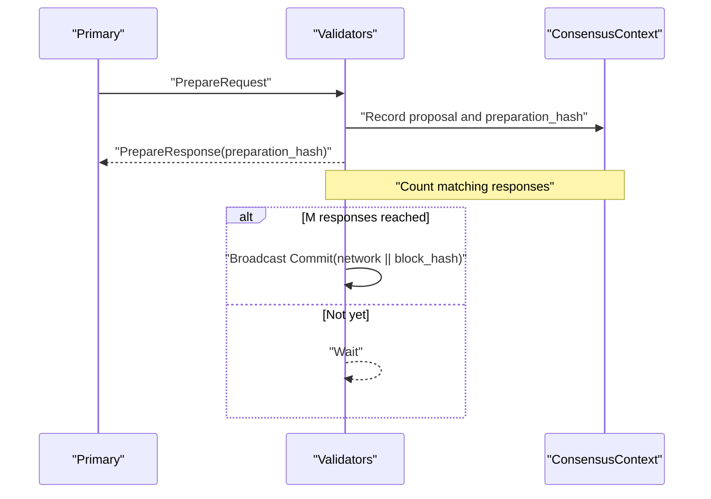

**Diagram sources**
- [prepare.rs:15-189](file://neo-consensus/src/service/handlers/prepare.rs#L15-L189)
- [prepare.rs:192-338](file://neo-consensus/src/service/handlers/prepare.rs#L192-L338)
- [mod.rs:303-334](file://neo-consensus/src/context/mod.rs#L303-L334)

#### Example: Commit Signature Verification and Quorum Achievement
- Each Commit contains a 64-byte signature over network magic + block hash
- The handler verifies this signature and records the commit
- When M commits are recorded, the block is finalized

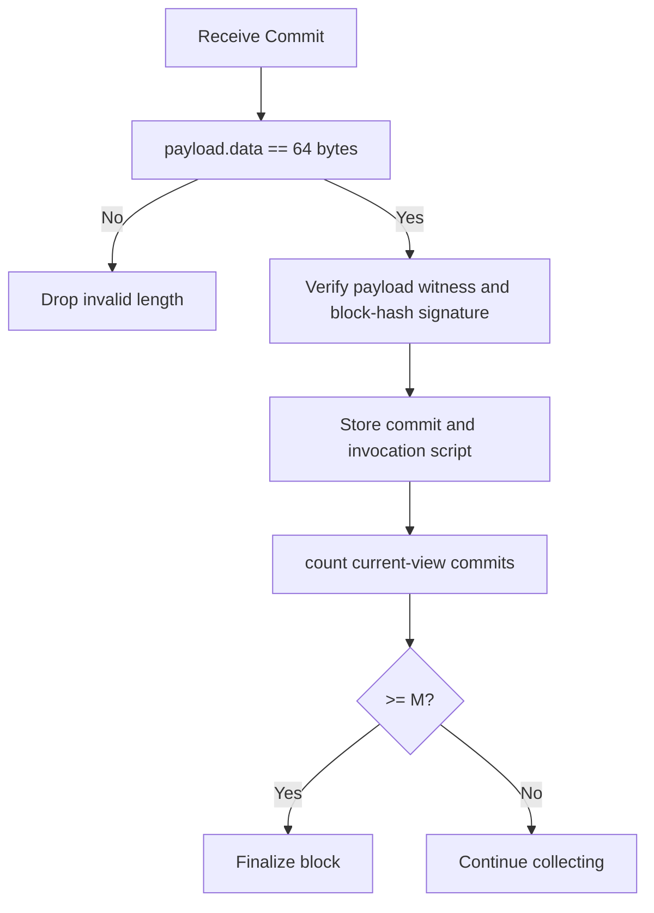

**Diagram sources**
- [commit.rs:32-139](file://neo-consensus/src/service/handlers/commit.rs#L32-L139)
- [commit.rs:141-181](file://neo-consensus/src/service/handlers/commit.rs#L141-L181)
- [mod.rs:348-382](file://neo-consensus/src/context/mod.rs#L348-L382)

#### Example: Signing a Commit Using Test Helpers
- Compute dBFT sign data for a payload
- Sign the prehashed data with the validator’s private key
- For Commit, sign network magic + block hash

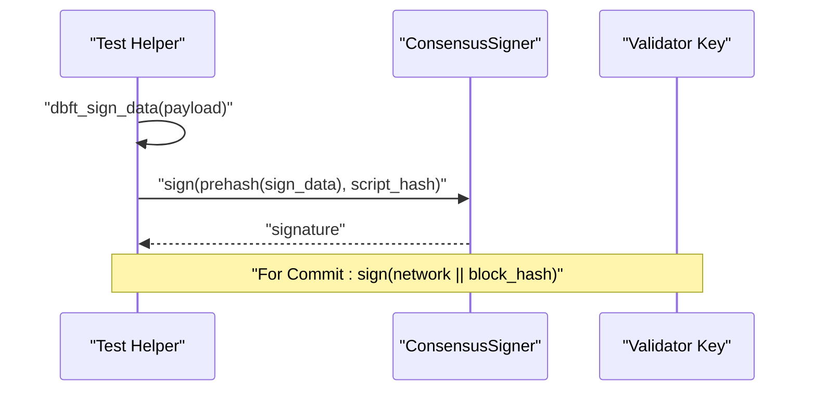

**Diagram sources**
- [helpers.rs:47-64](file://neo-consensus/src/service/tests/helpers.rs#L47-L64)
- [signer.rs:41-51](file://neo-consensus/src/signer.rs#L41-L51)

**Section sources**
- [helpers.rs:47-64](file://neo-consensus/src/service/tests/helpers.rs#L47-L64)
- [signer.rs:41-51](file://neo-consensus/src/signer.rs#L41-L51)

## Dependency Analysis
- Handlers depend on ConsensusContext for state and quorum checks
- Commit handler depends on message validation and cryptographic verification
- PrepareResponse message defines the binding between votes and proposals
- Signer trait abstracts cryptographic operations used throughout

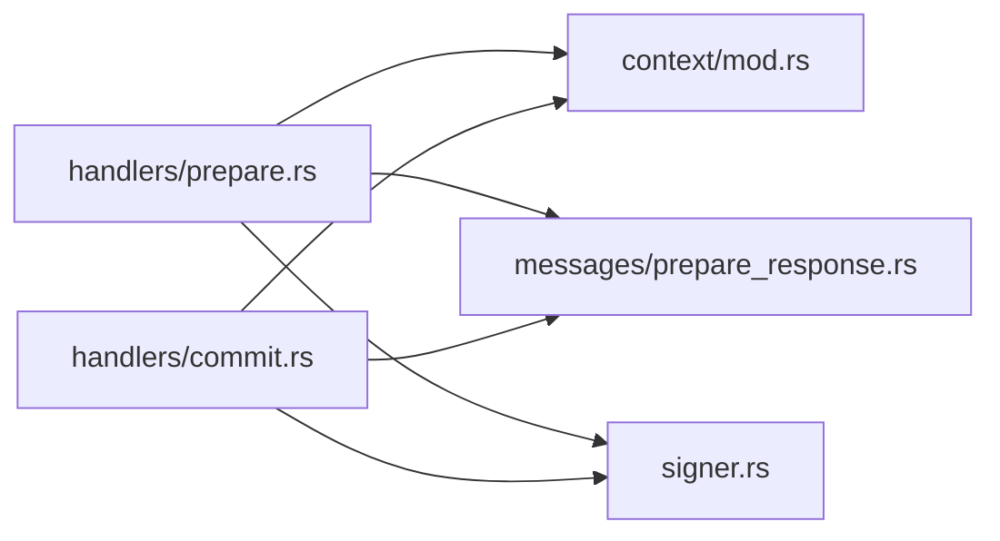

**Diagram sources**
- [prepare.rs:15-189](file://neo-consensus/src/service/handlers/prepare.rs#L15-L189)
- [commit.rs:10-139](file://neo-consensus/src/service/handlers/commit.rs#L10-L139)
- [mod.rs:111-191](file://neo-consensus/src/context/mod.rs#L111-L191)
- [prepare_response.rs:7-81](file://neo-consensus/src/messages/prepare_response.rs#L7-L81)
- [signer.rs:41-51](file://neo-consensus/src/signer.rs#L41-L51)

**Section sources**
- [prepare.rs:15-189](file://neo-consensus/src/service/handlers/prepare.rs#L15-L189)
- [commit.rs:10-139](file://neo-consensus/src/service/handlers/commit.rs#L10-L139)
- [mod.rs:111-191](file://neo-consensus/src/context/mod.rs#L111-L191)
- [prepare_response.rs:7-81](file://neo-consensus/src/messages/prepare_response.rs#L7-L81)
- [signer.rs:41-51](file://neo-consensus/src/signer.rs#L41-L51)

## Performance Considerations
- Timer extensions on valid PrepareRequest and PrepareResponse reduce unnecessary timeouts and improve liveness under partial failures
- LRU caches for seen message hashes and recovery responses limit memory usage while preventing replay attacks
- Early filtering of invalid or duplicate messages reduces cryptographic verification overhead
- Sorting collected signatures by validator index simplifies downstream multi-sig construction

[No sources needed since this section provides general guidance]

## Troubleshooting Guide
Common issues and their causes:
- Missing witness: Rejected immediately to prevent unauthenticated votes
- Invalid payload signature: Indicates tampering or wrong key; reject and log
- Wrong preparation hash: PrepareResponse must match the known proposal hash
- Incorrect commit signature length: Must be exactly 64 bytes
- No proposed block hash: Current-view commits cannot be verified without it; reject to avoid false quorum
- Duplicate messages: Handled by per-validator slots and message hash caches

Recovery and view change:
- If more than F nodes have committed or are lost, prefer recovery over view change to avoid splits
- Off-view commits are stored as recovery evidence even when block-hash verification is unavailable

**Section sources**
- [prepare.rs:15-189](file://neo-consensus/src/service/handlers/prepare.rs#L15-L189)
- [prepare.rs:192-338](file://neo-consensus/src/service/handlers/prepare.rs#L192-L338)
- [commit.rs:32-139](file://neo-consensus/src/service/handlers/commit.rs#L32-L139)
- [mod.rs:640-682](file://neo-consensus/src/context/mod.rs#L640-L682)
- [mod.rs:719-758](file://neo-consensus/src/context/mod.rs#L719-L758)

## Conclusion
The voting system in dBFT consensus ensures secure and efficient block finalization through rigorous validation, robust quorum detection, and careful signature handling. By enforcing strict checks on witnesses, payload integrity, and proposal binding, the system protects against Byzantine behavior and maintains progress even under faults. The design separates concerns cleanly between message handling, state tracking, and cryptographic operations, enabling reliable operation and straightforward integration with higher-level block assembly.