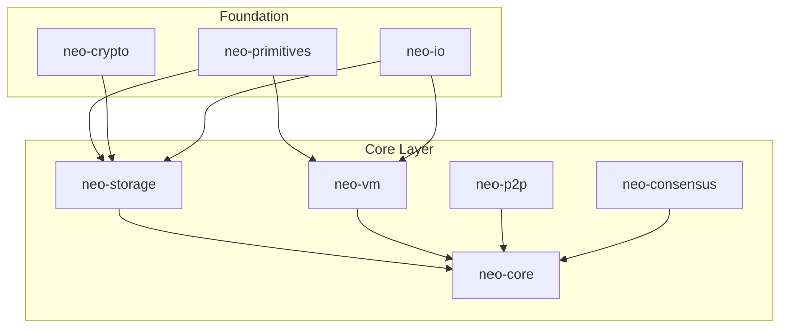
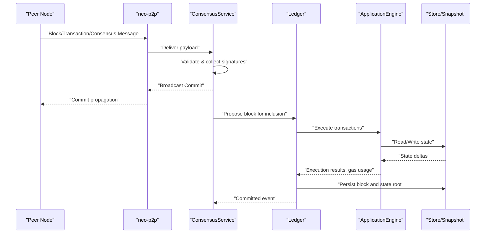
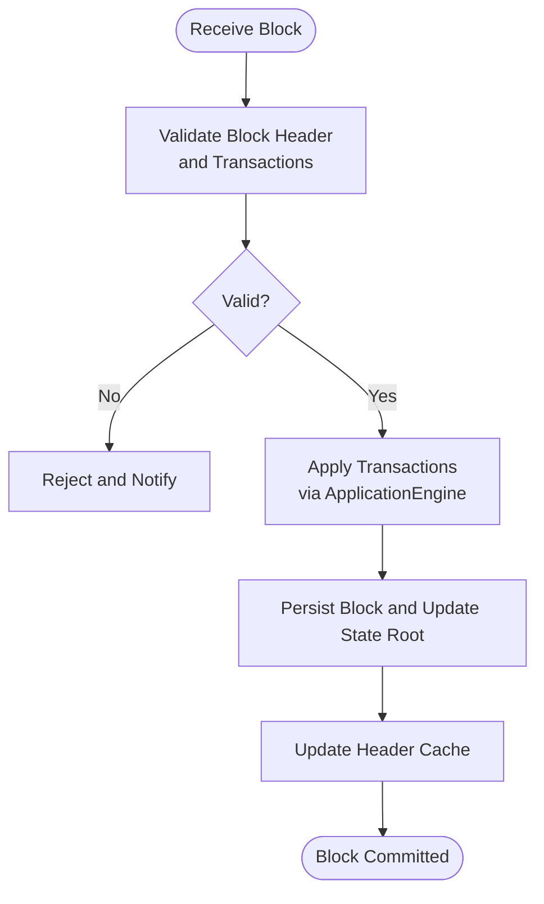
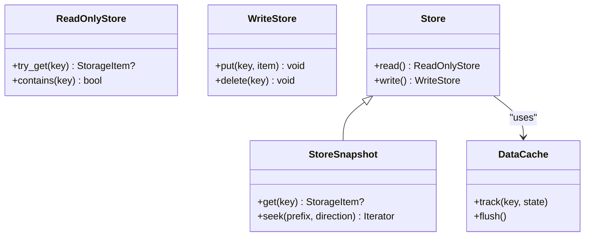
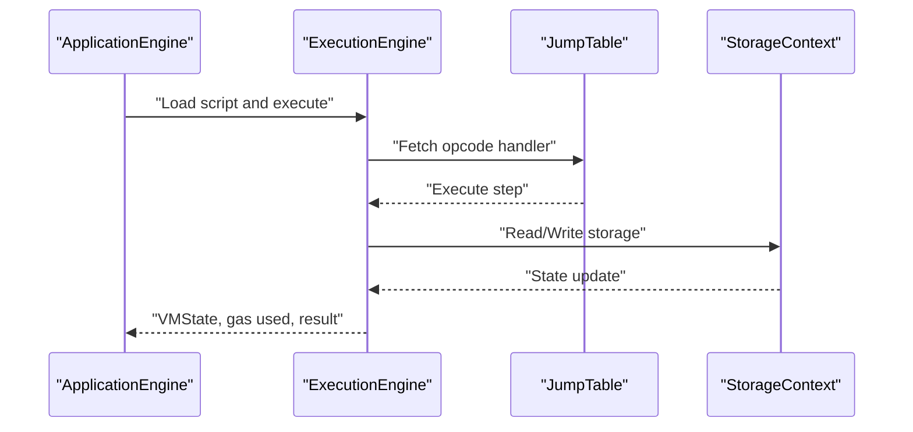
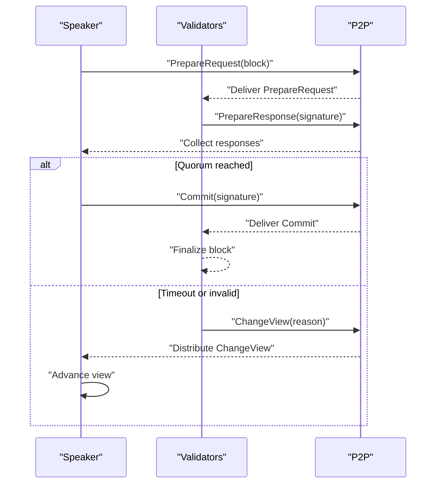
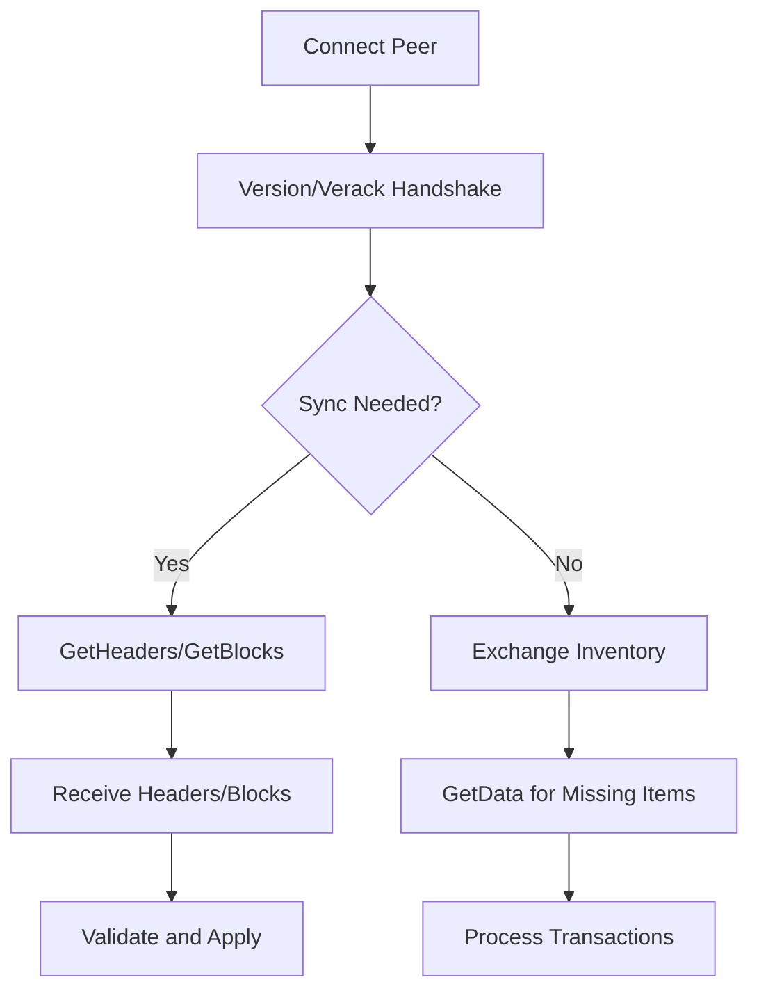
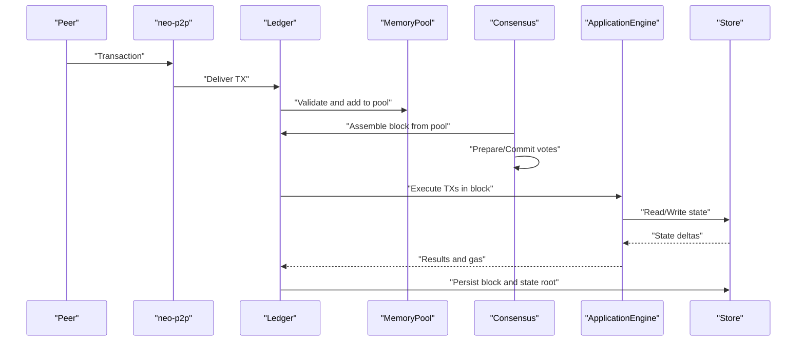
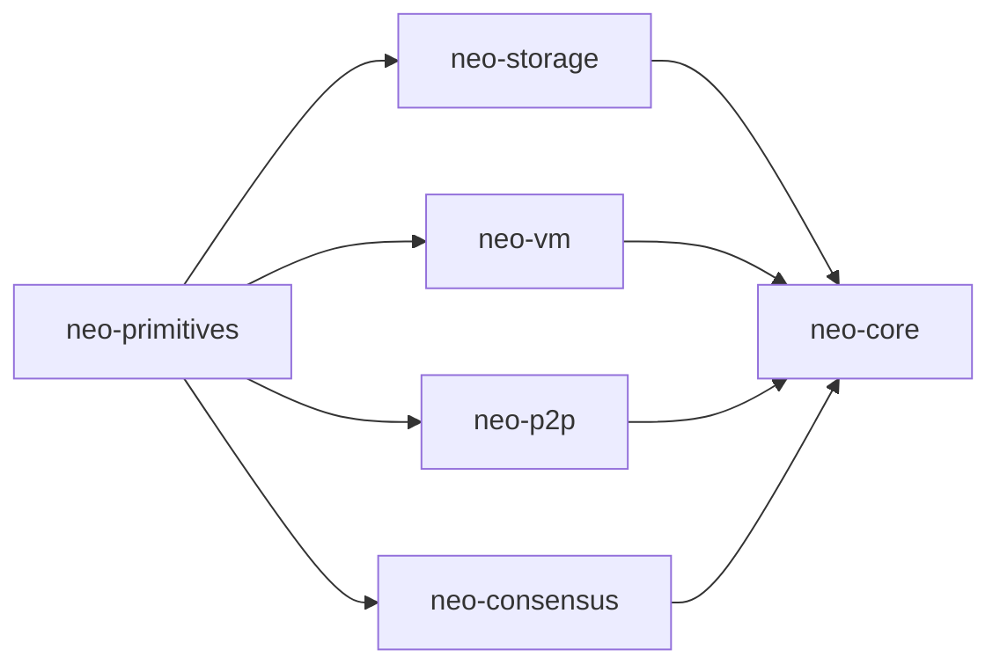

# Core Components

<cite>
**Referenced Files in This Document**
- [neo-core/src/lib.rs](file://neo-core/src/lib.rs)
- [neo-consensus/src/lib.rs](file://neo-consensus/src/lib.rs)
- [neo-p2p/src/lib.rs](file://neo-p2p/src/lib.rs)
- [neo-storage/src/lib.rs](file://neo-storage/src/lib.rs)
- [neo-vm/src/lib.rs](file://neo-vm/src/lib.rs)
- [neo-core/src/ledger/mod.rs](file://neo-core/src/ledger/mod.rs)
- [neo-core/src/ledger/blockchain/mod.rs](file://neo-core/src/ledger/blockchain/mod.rs)
- [neo-core/src/ledger/block.rs](file://neo-core/src/ledger/block.rs)
- [neo-core/src/ledger/block_header.rs](file://neo-core/src/ledger/block_header.rs)
- [neo-core/src/ledger/memory_pool/mod.rs](file://neo-core/src/ledger/memory_pool/mod.rs)
- [neo-core/src/smart_contract/mod.rs](file://neo-core/src/smart_contract/mod.rs)
- [neo-core/src/smart_contract/application_engine/mod.rs](file://neo-core/src/smart_contract/application_engine/mod.rs)
- [neo-core/src/persistence/mod.rs](file://neo-core/src/persistence/mod.rs)
- [neo-core/src/network/mod.rs](file://neo-core/src/network/mod.rs)
- [neo-consensus/src/service/mod.rs](file://neo-consensus/src/service/mod.rs)
- [neo-consensus/src/messages/mod.rs](file://neo-consensus/src/messages/mod.rs)
- [neo-consensus/src/context/mod.rs](file://neo-consensus/src/context/mod.rs)
- [neo-storage/src/cache/mod.rs](file://neo-storage/src/cache/mod.rs)
- [neo-storage/src/persistence/mod.rs](file://neo-storage/src/persistence/mod.rs)
- [neo-storage/src/persistence/store_factory.rs](file://neo-storage/src/persistence/store_factory.rs)
- [neo-storage/src/persistence/store_snapshot.rs](file://neo-storage/src/persistence/store_snapshot.rs)
</cite>

## Table of Contents
1. Introduction
2. Project Structure
3. Core Components
4. Architecture Overview
5. Detailed Component Analysis
6. Dependency Analysis
7. Performance Considerations
8. Troubleshooting Guide
9. Conclusion

## Introduction
This document explains the core components that form the foundation of the Neo blockchain implementation in Neo-RS. It covers:
- Blockchain ledger management: block processing, transaction validation, and state management
- Neo Virtual Machine (NeoVM): opcode execution, gas metering, and smart contract runtime
- dBFT consensus: block proposal, voting, and view change protocols
- P2P networking layer: peer discovery, message protocols, and synchronization
- Storage abstraction: RocksDB-backed persistence with caching strategies
It also describes how these components interact to process transactions and maintain blockchain state, including error handling approaches and performance optimization techniques.

## Project Structure
Neo-RS is organized into layered crates:
- neo-primitives and neo-crypto provide foundational types and cryptography
- neo-storage defines storage traits, caching, and persistence abstractions
- neo-vm provides the embedded VM runtime for smart contracts
- neo-core integrates ledger, smart contracts, network, persistence, and system services
- neo-consensus implements dBFT 2.0
- neo-p2p defines protocol messages and networking primitives used by the full node
- neo-node orchestrates the runtime and wiring of subsystems

**Diagram sources**
- [neo-core/src/lib.rs:14-46](file://neo-core/src/lib.rs#L14-L46)
- [neo-storage/src/lib.rs:1-71](file://neo-storage/src/lib.rs#L1-L71)
- [neo-vm/src/lib.rs:18-56](file://neo-vm/src/lib.rs#L18-L56)
- [neo-consensus/src/lib.rs:49-61](file://neo-consensus/src/lib.rs#L49-L61)
- [neo-p2p/src/lib.rs:40-49](file://neo-p2p/src/lib.rs#L40-L49)

**Section sources**
- [neo-core/src/lib.rs:14-46](file://neo-core/src/lib.rs#L14-L46)
- [neo-storage/src/lib.rs:1-71](file://neo-storage/src/lib.rs#L1-L71)
- [neo-vm/src/lib.rs:18-56](file://neo-vm/src/lib.rs#L18-L56)
- [neo-consensus/src/lib.rs:49-61](file://neo-consensus/src/lib.rs#L49-L61)
- [neo-p2p/src/lib.rs:40-49](file://neo-p2p/src/lib.rs#L40-L49)

## Core Components
- Ledger and blockchain state: blocks, headers, memory pool, and application execution events
- Smart contract runtime: Application Engine, native contracts, and storage context
- Consensus: dBFT service, context, messages, and lifecycle handlers
- P2P: message commands, payloads, verification results, and capabilities
- Storage: read/write stores, snapshots, caches, and key building utilities
- VM: execution engine, evaluation stack, jump table, and gas metering

Key responsibilities:
- Block processing validates and persists new blocks and updates world state
- Transaction validation checks witnesses, fees, and policy constraints
- State management uses a cache-backed store to apply changes per block
- Consensus coordinates validators to propose and commit blocks deterministically
- P2P synchronizes peers via inventory and data requests
- VM executes smart contracts with precise gas accounting and robust error handling

**Section sources**
- [neo-core/src/ledger/mod.rs](file://neo-core/src/ledger/mod.rs)
- [neo-core/src/smart_contract/mod.rs](file://neo-core/src/smart_contract/mod.rs)
- [neo-consensus/src/lib.rs:6-216](file://neo-consensus/src/lib.rs#L6-L216)
- [neo-p2p/src/lib.rs:6-164](file://neo-p2p/src/lib.rs#L6-L164)
- [neo-storage/src/lib.rs:1-71](file://neo-storage/src/lib.rs#L1-L71)
- [neo-vm/src/lib.rs:6-135](file://neo-vm/src/lib.rs#L6-L135)

## Architecture Overview
The runtime composes several layers:
- Consensus produces candidate blocks and drives finality through prepare/commit phases
- The ledger applies validated blocks, processes transactions, and updates state
- The VM executes scripts and native calls under strict gas limits
- Storage provides persistent and cached access to world state
- P2P exchanges blocks, transactions, and consensus messages across peers

**Diagram sources**
- [neo-consensus/src/lib.rs:63-125](file://neo-consensus/src/lib.rs#L63-L125)
- [neo-core/src/ledger/blockchain/mod.rs](file://neo-core/src/ledger/blockchain/mod.rs)
- [neo-core/src/smart_contract/application_engine/mod.rs](file://neo-core/src/smart_contract/application_engine/mod.rs)
- [neo-storage/src/persistence/store_snapshot.rs](file://neo-storage/src/persistence/store_snapshot.rs)
- [neo-p2p/src/lib.rs:106-147](file://neo-p2p/src/lib.rs#L106-L147)

## Detailed Component Analysis

### Blockchain Ledger Management
Responsibilities:
- Validate and persist blocks and headers
- Manage the memory pool for pending transactions
- Execute transactions within a block and record application events
- Maintain header cache and verify results

Key elements:
- Block and BlockHeader structures define chain units
- MemoryPool tracks accepted/rejected transactions and policies
- Blockchain module orchestrates block acceptance, state transitions, and notifications
- Verification results capture outcomes of block and transaction checks

**Diagram sources**
- [neo-core/src/ledger/block.rs](file://neo-core/src/ledger/block.rs)
- [neo-core/src/ledger/block_header.rs](file://neo-core/src/ledger/block_header.rs)
- [neo-core/src/ledger/memory_pool/mod.rs](file://neo-core/src/ledger/memory_pool/mod.rs)
- [neo-core/src/ledger/blockchain/mod.rs](file://neo-core/src/ledger/blockchain/mod.rs)

**Section sources**
- [neo-core/src/ledger/mod.rs](file://neo-core/src/ledger/mod.rs)
- [neo-core/src/ledger/block.rs](file://neo-core/src/ledger/block.rs)
- [neo-core/src/ledger/block_header.rs](file://neo-core/src/ledger/block_header.rs)
- [neo-core/src/ledger/memory_pool/mod.rs](file://neo-core/src/ledger/memory_pool/mod.rs)
- [neo-core/src/ledger/blockchain/mod.rs](file://neo-core/src/ledger/blockchain/mod.rs)

### Transaction Validation and Witness Verification
Validation pipeline:
- Check size, fee, and policy constraints
- Verify witness rules and signatures against script hashes
- Enforce gas limits and script validation rules
- Record verification results for auditability

Error handling:
- Distinguish between policy rejections and cryptographic failures
- Provide structured errors for mempool and ledger paths

Performance considerations:
- Early-exit on invalid inputs
- Batch verification where possible
- Use efficient hashing and signature checks

**Section sources**
- [neo-core/src/lib.rs:383-422](file://neo-core/src/lib.rs#L383-L422)
- [neo-core/src/validation.rs](file://neo-core/src/validation.rs)

### State Management and Persistence
Storage model:
- ReadOnlyStore, WriteStore, Store, and StoreSnapshot define interfaces
- DataCache provides in-memory tracking of added/changed/deleted entries
- KeyBuilder constructs canonical keys compatible with C# parity
- Hash utilities ensure consistent key derivation

Caching strategy:
- Trackable entries allow selective flushes after block commits
- Snapshot isolation supports concurrent reads during writes

RocksDB integration:
- StoreFactory creates backend instances
- StoreSnapshot exposes point-in-time views for reads

**Diagram sources**
- [neo-storage/src/lib.rs:1-71](file://neo-storage/src/lib.rs#L1-L71)
- [neo-storage/src/cache/mod.rs](file://neo-storage/src/cache/mod.rs)
- [neo-storage/src/persistence/store_snapshot.rs](file://neo-storage/src/persistence/store_snapshot.rs)
- [neo-storage/src/persistence/store_factory.rs](file://neo-storage/src/persistence/store_factory.rs)

**Section sources**
- [neo-storage/src/lib.rs:1-71](file://neo-storage/src/lib.rs#L1-L71)
- [neo-storage/src/cache/mod.rs](file://neo-storage/src/cache/mod.rs)
- [neo-storage/src/persistence/mod.rs](file://neo-storage/src/persistence/mod.rs)
- [neo-storage/src/persistence/store_factory.rs](file://neo-storage/src/persistence/store_factory.rs)
- [neo-storage/src/persistence/store_snapshot.rs](file://neo-storage/src/persistence/store_snapshot.rs)

### Neo Virtual Machine (NeoVM)
Components:
- ExecutionEngine runs scripts, manages contexts, and tracks gas
- EvaluationStack holds typed values with reference counting
- JumpTable dispatches opcodes with stateful adapters
- Script and ABI modules define instruction sets and value semantics

Gas metering:
- Precise costs per operation and syscall
- Limits enforced to prevent DoS

Error handling:
- Structured VmError and VmResult propagate failures
- Exception handling supports try/catch/finally semantics

**Diagram sources**
- [neo-vm/src/lib.rs:18-135](file://neo-vm/src/lib.rs#L18-L135)
- [neo-core/src/smart_contract/application_engine/mod.rs](file://neo-core/src/smart_contract/application_engine/mod.rs)

**Section sources**
- [neo-vm/src/lib.rs:6-135](file://neo-vm/src/lib.rs#L6-L135)
- [neo-core/src/smart_contract/application_engine/mod.rs](file://neo-core/src/smart_contract/application_engine/mod.rs)

### dBFT Consensus Mechanism
Overview:
- ConsensusService implements dBFT 2.0 state machine
- ConsensusContext tracks view number, validators, signatures, and proposed block
- Messages include PrepareRequest, PrepareResponse, Commit, ChangeView, RecoveryRequest, RecoveryMessage

Protocol flow:
- Speaker proposes a block via PrepareRequest
- Validators validate and respond with PrepareResponse
- Upon quorum, speaker broadcasts Commit; validators finalize
- View change triggers when timeouts or invalid proposals occur

**Diagram sources**
- [neo-consensus/src/lib.rs:63-125](file://neo-consensus/src/lib.rs#L63-L125)
- [neo-consensus/src/service/mod.rs](file://neo-consensus/src/service/mod.rs)
- [neo-consensus/src/messages/mod.rs](file://neo-consensus/src/messages/mod.rs)
- [neo-consensus/src/context/mod.rs](file://neo-consensus/src/context/mod.rs)

**Section sources**
- [neo-consensus/src/lib.rs:6-216](file://neo-consensus/src/lib.rs#L6-L216)
- [neo-consensus/src/service/mod.rs](file://neo-consensus/src/service/mod.rs)
- [neo-consensus/src/messages/mod.rs](file://neo-consensus/src/messages/mod.rs)
- [neo-consensus/src/context/mod.rs](file://neo-consensus/src/context/mod.rs)

### P2P Networking Layer
Capabilities:
- Message framing and command enumeration
- Inventory types for blocks, transactions, and headers
- Verification results and witness scopes
- Node capability negotiation

Synchronization mechanisms:
- GetBlocks/Headers and GetData flows for fast sync
- Inv announcements to discover missing items
- Keepalive via Ping/Pong

**Diagram sources**
- [neo-p2p/src/lib.rs:106-147](file://neo-p2p/src/lib.rs#L106-L147)

**Section sources**
- [neo-p2p/src/lib.rs:6-164](file://neo-p2p/src/lib.rs#L6-L164)
- [neo-core/src/network/mod.rs](file://neo-core/src/network/mod.rs)

### Component Interaction Patterns
End-to-end transaction processing:
- Peer receives a transaction via P2P
- Ledger validates and accepts into memory pool
- During block assembly, consensus selects transactions
- Block is proposed and voted on; upon commit, ledger executes transactions
- VM executes scripts with gas metering and storage access
- State changes are cached and persisted; state root updated

**Diagram sources**
- [neo-core/src/ledger/memory_pool/mod.rs](file://neo-core/src/ledger/memory_pool/mod.rs)
- [neo-core/src/ledger/blockchain/mod.rs](file://neo-core/src/ledger/blockchain/mod.rs)
- [neo-consensus/src/service/mod.rs](file://neo-consensus/src/service/mod.rs)
- [neo-core/src/smart_contract/application_engine/mod.rs](file://neo-core/src/smart_contract/application_engine/mod.rs)
- [neo-storage/src/persistence/store_snapshot.rs](file://neo-storage/src/persistence/store_snapshot.rs)

## Dependency Analysis
Layered dependencies:
- neo-core depends on neo-storage, neo-vm, neo-p2p, and neo-consensus
- neo-consensus depends on neo-primitives and crypto for signing and validation
- neo-p2p depends on neo-primitives for shared types
- neo-storage depends on neo-primitives and io for serialization

**Diagram sources**
- [neo-core/src/lib.rs:14-46](file://neo-core/src/lib.rs#L14-L46)
- [neo-consensus/src/lib.rs:49-61](file://neo-consensus/src/lib.rs#L49-L61)
- [neo-p2p/src/lib.rs:40-49](file://neo-p2p/src/lib.rs#L40-L49)
- [neo-storage/src/lib.rs:1-71](file://neo-storage/src/lib.rs#L1-L71)
- [neo-vm/src/lib.rs:18-56](file://neo-vm/src/lib.rs#L18-L56)

**Section sources**
- [neo-core/src/lib.rs:14-46](file://neo-core/src/lib.rs#L14-L46)
- [neo-consensus/src/lib.rs:49-61](file://neo-consensus/src/lib.rs#L49-L61)
- [neo-p2p/src/lib.rs:40-49](file://neo-p2p/src/lib.rs#L40-L49)
- [neo-storage/src/lib.rs:1-71](file://neo-storage/src/lib.rs#L1-L71)
- [neo-vm/src/lib.rs:18-56](file://neo-vm/src/lib.rs#L18-L56)

## Performance Considerations
- Gas metering: Tight bounds per opcode and syscall prevent excessive resource use
- Caching: DataCache tracks changes to minimize disk writes; batch flush at block boundaries
- Storage: Snapshot isolation allows concurrent reads without blocking writes
- P2P: Efficient inventory exchange reduces bandwidth and sync time
- Validation: Early exits and parallelizable checks improve throughput
- VM: Reference counting avoids GC pauses and keeps memory predictable

[No sources needed since this section provides general guidance]

## Troubleshooting Guide
Common issues and diagnostics:
- Invalid witness scope or failed signature verification: check witness rules and script hashes
- Policy rejection: review fee, size, and attribute constraints
- VM execution failure: inspect gas usage and exception traces
- Consensus stalls: monitor view changes and timeout reasons
- Sync divergence: compare state roots and block headers across peers

Error surfaces:
- CoreError and VmError categorize failures for targeted handling
- P2PResult and ConsensusResult standardize error propagation
- StorageError indicates backend or cache inconsistencies

**Section sources**
- [neo-core/src/error.rs](file://neo-core/src/error.rs)
- [neo-vm/src/lib.rs:123-135](file://neo-vm/src/lib.rs#L123-L135)
- [neo-p2p/src/lib.rs:153-164](file://neo-p2p/src/lib.rs#L153-L164)
- [neo-consensus/src/lib.rs:127-138](file://neo-consensus/src/lib.rs#L127-L138)
- [neo-storage/src/lib.rs:1-71](file://neo-storage/src/lib.rs#L1-L71)

## Conclusion
Neo-RS composes a robust, layered architecture where consensus drives block production, the ledger validates and applies state changes, the VM executes smart contracts with precise gas control, storage provides efficient persistence with caching, and P2P ensures reliable synchronization. Together, these components enable secure, performant, and deterministic blockchain operations aligned with the Neo N3 protocol.

[No sources needed since this section summarizes without analyzing specific files]