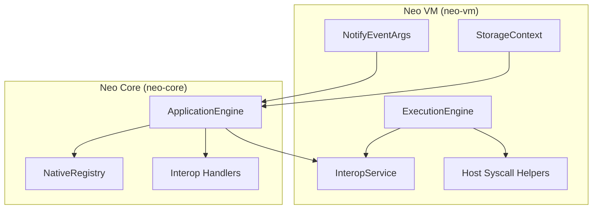
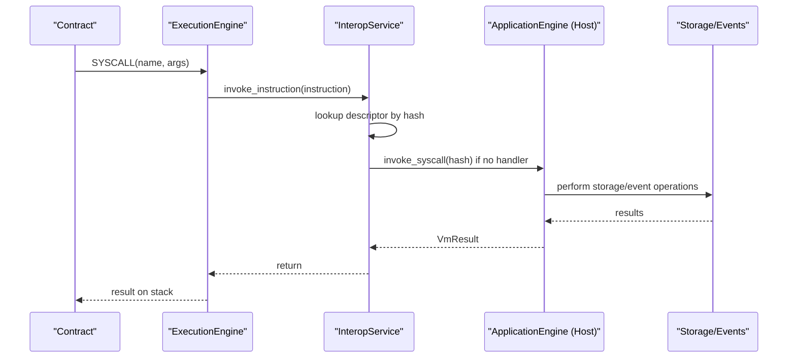
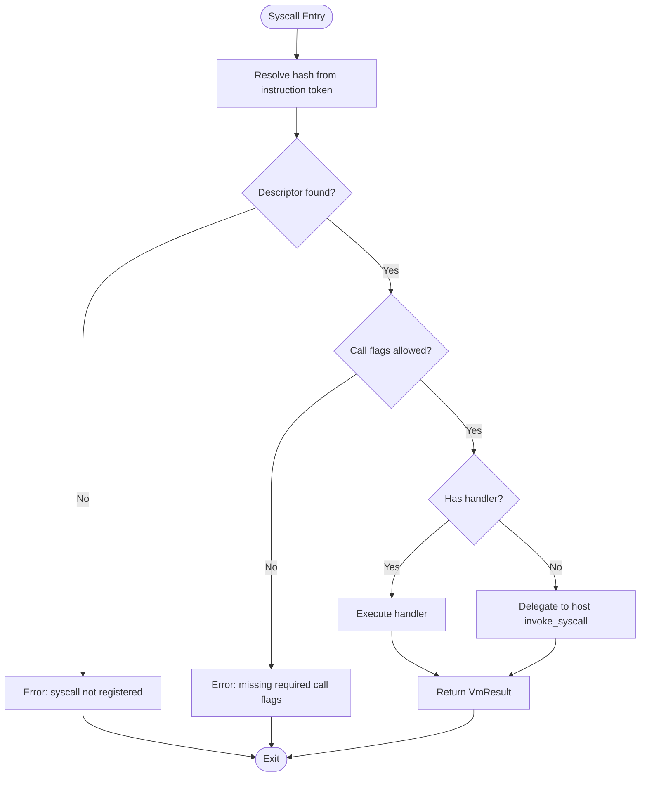
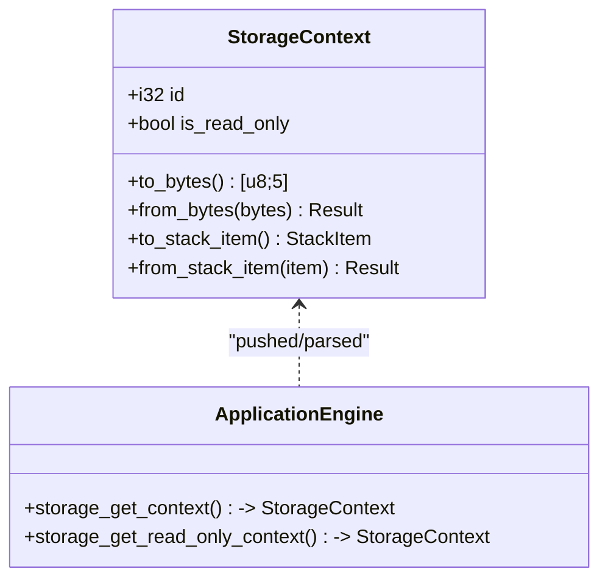
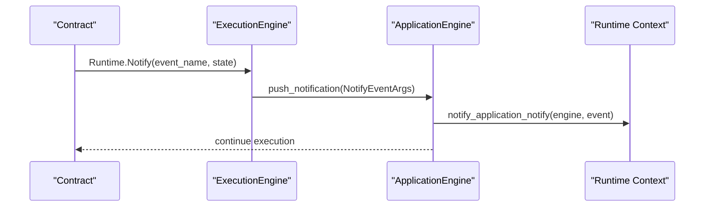
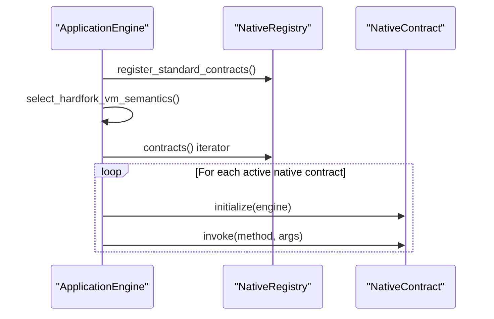
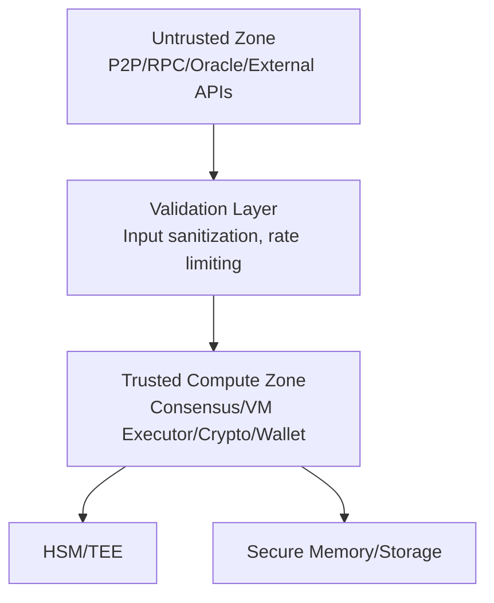
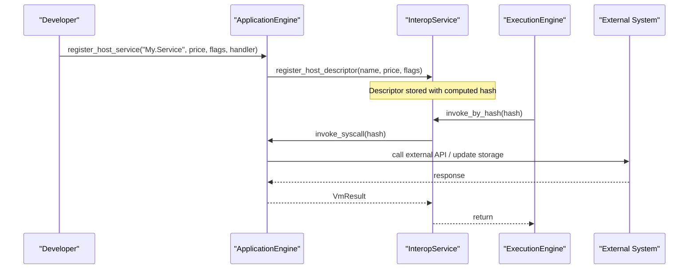
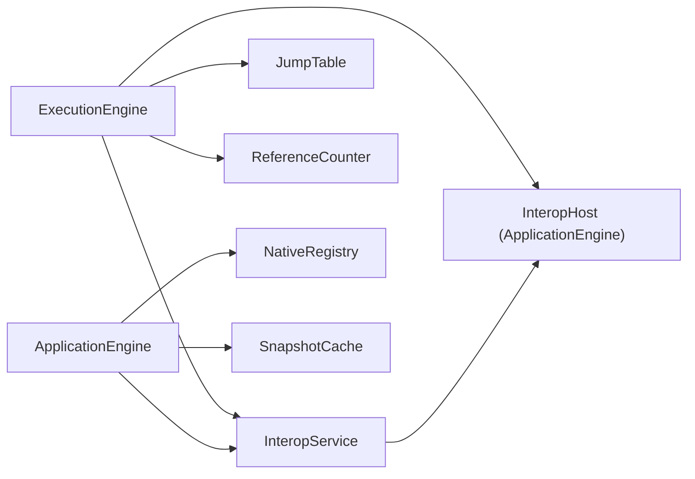

# Contract Runtime & Interop Services

<cite>
**Referenced Files in This Document**
- [lib.rs](file://neo-vm/src/lib.rs)
- [execution_engine/mod.rs](file://neo-vm/src/execution_engine/mod.rs)
- [interop_service.rs](file://neo-vm/src/interop_service.rs)
- [host/syscall.rs](file://neo-vm/src/host/syscall.rs)
- [storage_context.rs](file://neo-vm/src/storage_context.rs)
- [notify_event_args.rs](file://neo-vm/src/notify_event_args.rs)
- [state.rs](file://neo-core/src/smart_contract/application_engine/state.rs)
- [contract.rs](file://neo-core/src/smart_contract/application_engine/contract.rs)
- [storage.rs](file://neo-core/src/smart_contract/application_engine/storage.rs)
- [native/mod.rs](file://neo-core/src/smart_contract/native/mod.rs)
- [native_impl.rs](file://neo-core/src/smart_contract/native/contract_management/native_impl.rs)
- [security.md](file://docs/SECURITY.md)
</cite>

## Table of Contents
1. [Introduction](#introduction)
2. [Project Structure](#project-structure)
3. [Core Components](#core-components)
4. [Architecture Overview](#architecture-overview)
5. [Detailed Component Analysis](#detailed-component-analysis)
6. [Dependency Analysis](#dependency-analysis)
7. [Performance Considerations](#performance-considerations)
8. [Troubleshooting Guide](#troubleshooting-guide)
9. [Conclusion](#conclusion)
10. [Appendices](#appendices)

## Introduction
This document explains the Neo VM contract runtime and interoperability services in the neo-rs codebase. It covers the interop service registry, native contract integration, syscall mechanisms, storage context management, event notifications, contract lifecycle, host boundary interface, security model, isolation mechanisms, debugging techniques, monitoring, and performance optimization strategies. The goal is to provide both a high-level understanding and detailed technical guidance for implementing custom interop services and integrating with external systems while maintaining safety and performance.

## Project Structure
The Neo VM runtime lives primarily in the neo-vm crate, with host-specific logic (ApplicationEngine) in neo-core. Key areas:
- VM core and execution engine: neo-vm/src/execution_engine
- Interop service registry and descriptors: neo-vm/src/interop_service.rs
- Syscall hashing and argument counts: neo-vm/src/host/syscall.rs
- Storage context serialization and stack conversions: neo-vm/src/storage_context.rs
- Event notification payload: neo-vm/src/notify_event_args.rs
- Host registration of interops and native contracts: neo-core/src/smart_contract/application_engine/*
- Native contract registry and lifecycle: neo-core/src/smart_contract/native/*

**Diagram sources**
- [execution_engine/mod.rs:196-242](file://neo-vm/src/execution_engine/mod.rs#L196-L242)
- [interop_service.rs:146-252](file://neo-vm/src/interop_service.rs#L146-L252)
- [host/syscall.rs:110-120](file://neo-vm/src/host/syscall.rs#L110-L120)
- [storage_context.rs:6-14](file://neo-vm/src/storage_context.rs#L6-L14)
- [notify_event_args.rs:9-24](file://neo-vm/src/notify_event_args.rs#L9-L24)
- [state.rs:177-214](file://neo-core/src/smart_contract/application_engine/state.rs#L177-L214)
- [native/mod.rs:159-186](file://neo-core/src/smart_contract/native/mod.rs#L159-L186)

**Section sources**
- [lib.rs:142-213](file://neo-vm/src/lib.rs#L142-L213)
- [execution_engine/mod.rs:196-242](file://neo-vm/src/execution_engine/mod.rs#L196-L242)
- [state.rs:177-214](file://neo-core/src/smart_contract/application_engine/state.rs#L177-L214)

## Core Components
- ExecutionEngine: Manages invocation stack, instruction execution loop, gas metering, limits, and interop host callbacks.
- InteropService: Registry of syscalls with names, hashes, prices, required call flags, and optional handlers; dispatches to host when needed.
- StorageContext: Serializable context identifying a storage scope and read-only mode; bridges VM stack items and persistent storage.
- NotifyEventArgs: Event payload emitted by contracts; includes script hash, event name, and state array.
- ApplicationEngine (host): Registers default interops, attaches host callbacks, manages native contracts, and coordinates storage and events.

**Section sources**
- [execution_engine/mod.rs:196-242](file://neo-vm/src/execution_engine/mod.rs#L196-L242)
- [interop_service.rs:146-252](file://neo-vm/src/interop_service.rs#L146-L252)
- [storage_context.rs:6-14](file://neo-vm/src/storage_context.rs#L6-L14)
- [notify_event_args.rs:9-24](file://neo-vm/src/notify_event_args.rs#L9-L24)
- [state.rs:177-214](file://neo-core/src/smart_contract/application_engine/state.rs#L177-L214)

## Architecture Overview
The runtime follows an adapter-oriented design where canonical opcode semantics are vendored into neo-vm, and stateful host interactions are provided via the InteropHost interface implemented by ApplicationEngine. Syscalls are resolved by name-to-hash mapping and dispatched either to built-in handlers or to the host.

**Diagram sources**
- [interop_service.rs:187-228](file://neo-vm/src/interop_service.rs#L187-L228)
- [execution_engine/mod.rs:177-185](file://neo-vm/src/execution_engine/mod.rs#L177-L185)
- [state.rs:192-214](file://neo-core/src/smart_contract/application_engine/state.rs#L192-L214)

## Detailed Component Analysis

### Interop Service Registry and Syscall Mechanism
- Registration: Descriptors include name, optional handler, price, and required call flags. Hash is derived from name using SHA-256 prefix.
- Invocation: The VM resolves the syscall hash from the instruction token, looks up the descriptor, checks required call flags, then invokes either the embedded handler or delegates to the host via InteropHost.
- Argument handling: Known syscalls have fixed argument counts; unknown ones pass full stack to the host.

**Diagram sources**
- [interop_service.rs:187-228](file://neo-vm/src/interop_service.rs#L187-L228)
- [host/syscall.rs:38-51](file://neo-vm/src/host/syscall.rs#L38-L51)
- [execution_engine/mod.rs:177-185](file://neo-vm/src/execution_engine/mod.rs#L177-L185)

**Section sources**
- [interop_service.rs:146-252](file://neo-vm/src/interop_service.rs#L146-L252)
- [host/syscall.rs:110-120](file://neo-vm/src/host/syscall.rs#L110-L120)

### Storage Context Management
- StorageContext encodes a storage scope identifier and read-only flag, serializable to/from bytes and VM stack items.
- ApplicationEngine exposes get_context and get_read_only_context handlers that push StorageContext onto the stack for contract use.
- Storage interops use these contexts to read/write data within the current snapshot/cache.

**Diagram sources**
- [storage_context.rs:6-14](file://neo-vm/src/storage_context.rs#L6-L14)
- [storage_context.rs:46-70](file://neo-vm/src/storage_context.rs#L46-L70)
- [storage_context.rs:73-118](file://neo-vm/src/storage_context.rs#L73-L118)
- [storage.rs:173-195](file://neo-core/src/smart_contract/application_engine/storage.rs#L173-L195)

**Section sources**
- [storage_context.rs:6-118](file://neo-vm/src/storage_context.rs#L6-L118)
- [storage.rs:173-195](file://neo-core/src/smart_contract/application_engine/storage.rs#L173-L195)

### Event Notification System
- NotifyEventArgs carries container reference, script hash, event name, and state array.
- ApplicationEngine collects notifications during execution and can notify attached runtime context for logging/monitoring.

**Diagram sources**
- [notify_event_args.rs:9-24](file://neo-vm/src/notify_event_args.rs#L9-L24)
- [notify_event_args.rs:68-89](file://neo-vm/src/notify_event_args.rs#L68-L89)
- [state.rs:496-502](file://neo-core/src/smart_contract/application_engine/state.rs#L496-L502)

**Section sources**
- [notify_event_args.rs:9-89](file://neo-vm/src/notify_event_args.rs#L9-L89)
- [state.rs:496-502](file://neo-core/src/smart_contract/application_engine/state.rs#L496-L502)

### Native Contract Integration and Lifecycle
- NativeRegistry registers standard native contracts (e.g., ContractManagement, StdLib, CryptoLib, Ledger, NEO, GAS, Policy, RoleManagement, Oracle).
- ApplicationEngine selects hardfork-dependent semantics and initializes active native contracts at block boundaries.
- ContractManagement implements lifecycle hooks like OnPersist and PostPersist via interop handlers.

**Diagram sources**
- [native/mod.rs:159-186](file://neo-core/src/smart_contract/native/mod.rs#L159-L186)
- [state.rs:357-368](file://neo-core/src/smart_contract/application_engine/state.rs#L357-L368)
- [native_impl.rs:28-64](file://neo-core/src/smart_contract/native/contract_management/native_impl.rs#L28-L64)

**Section sources**
- [native/mod.rs:159-186](file://neo-core/src/smart_contract/native/mod.rs#L159-L186)
- [state.rs:357-368](file://neo-core/src/smart_contract/application_engine/state.rs#L357-L368)
- [native_impl.rs:28-64](file://neo-core/src/smart_contract/native/contract_management/native_impl.rs#L28-L64)

### Host Boundary Interface and Isolation
- ExecutionEngine holds a HostPtr to InteropHost (implemented by ApplicationEngine), encapsulating unsafe pointer access and providing safe wrappers for lifecycle hooks and syscall invocation.
- Call flags enforce isolation: syscalls require specific permissions (e.g., READ_STATES, ALLOW_CALL), preventing unauthorized side effects.
- Security model separates untrusted zones (P2P/RPC/Oracles) from trusted compute (Consensus/VM/Crypto/Wallet), with validation layers and optional HSM/TEE.

**Diagram sources**
- [security.md:100-131](file://docs/SECURITY.md#L100-L131)
- [execution_engine/mod.rs:79-185](file://neo-vm/src/execution_engine/mod.rs#L79-L185)
- [interop_service.rs:197-228](file://neo-vm/src/interop_service.rs#L197-L228)

**Section sources**
- [execution_engine/mod.rs:79-185](file://neo-vm/src/execution_engine/mod.rs#L79-L185)
- [security.md:100-131](file://docs/SECURITY.md#L100-L131)

### Custom Interop Services and External Integrations
- Register a host service by name, price, required call flags, and handler via ApplicationEngine.register_host_service.
- The interop service stores the descriptor and maps the name to a hash; subsequent SYSCALL invocations resolve and execute the handler.
- Use StorageContext to persist data and NotifyEventArgs to emit events; integrate with external systems through ApplicationEngine methods invoked by the handler.

**Diagram sources**
- [state.rs:192-214](file://neo-core/src/smart_contract/application_engine/state.rs#L192-L214)
- [interop_service.rs:158-179](file://neo-vm/src/interop_service.rs#L158-L179)
- [interop_service.rs:197-228](file://neo-vm/src/interop_service.rs#L197-L228)

**Section sources**
- [state.rs:192-214](file://neo-core/src/smart_contract/application_engine/state.rs#L192-L214)
- [interop_service.rs:158-179](file://neo-vm/src/interop_service.rs#L158-L179)

## Dependency Analysis
- ExecutionEngine depends on JumpTable, ReferenceCounter, InteropService, and optionally InteropHost.
- InteropService depends on Instruction metadata and CallFlags; it may delegate to ApplicationEngine via InteropHost.
- ApplicationEngine depends on NativeRegistry, SnapshotCache, and policy settings; it registers default interops and native contracts.
- StorageContext and NotifyEventArgs are used across storage and event flows.

**Diagram sources**
- [execution_engine/mod.rs:196-242](file://neo-vm/src/execution_engine/mod.rs#L196-L242)
- [interop_service.rs:146-252](file://neo-vm/src/interop_service.rs#L146-L252)
- [state.rs:177-214](file://neo-core/src/smart_contract/application_engine/state.rs#L177-L214)
- [native/mod.rs:159-186](file://neo-core/src/smart_contract/native/mod.rs#L159-L186)

**Section sources**
- [execution_engine/mod.rs:196-242](file://neo-vm/src/execution_engine/mod.rs#L196-L242)
- [interop_service.rs:146-252](file://neo-vm/src/interop_service.rs#L146-L252)
- [state.rs:177-214](file://neo-core/src/smart_contract/application_engine/state.rs#L177-L214)

## Performance Considerations
- Gas Metering: ExecutionEngine tracks instructions_executed and gas_consumed; prices are stored per interop descriptor and applied by the host.
- Limits: ExecutionEngineLimits control stack depth, item size, and behavior such as zero-shift conversion rules based on hardforks.
- Storage Efficiency: StorageContext enables scoped reads/writes; avoid unnecessary writes by checking existing values before updates.
- Event Emission: Batch notifications where possible; minimize large state arrays in NotifyEventArgs to reduce serialization overhead.
- Native Contracts: Initialize only active contracts at block boundaries; leverage caching (NativeContractsCache) to reduce metadata lookups.

[No sources needed since this section provides general guidance]

## Troubleshooting Guide
Common issues and diagnostics:
- Syscall Not Registered: Ensure the interop service is configured and the descriptor is registered before execution.
- Missing Call Flags: Verify required_call_flags match the current execution context’s permissions.
- Storage Errors: Validate StorageContext parsing and key/value types; map errors to VmError::InteropService for clarity.
- Event Serialization: Ensure NotifyEventArgs state contains serializable StackItems; recursive references may cause JSON rendering errors.
- Monitoring: Use ApplicationEngine.push_log and push_notification to record execution details; attach a runtime context to surface logs and notifications externally.

**Section sources**
- [interop_service.rs:197-228](file://neo-vm/src/interop_service.rs#L197-L228)
- [storage.rs:160-171](file://neo-core/src/smart_contract/application_engine/storage.rs#L160-L171)
- [state.rs:488-502](file://neo-core/src/smart_contract/application_engine/state.rs#L488-L502)

## Conclusion
The Neo VM contract runtime in neo-rs provides a robust, secure, and extensible platform for smart contract execution. The interop service registry centralizes syscall resolution and dispatch, while the host boundary enforces isolation and policy. StorageContext and NotifyEventArgs enable persistent data access and event-driven architectures. Native contracts integrate seamlessly with lifecycle hooks and policy controls. By following the patterns outlined here, developers can implement custom interop services, integrate external systems, and optimize runtime performance while maintaining security and reliability.

## Appendices

### Example: Implementing a Custom Interop Service
- Define a handler function that performs desired operations (e.g., storage read/write, external API calls).
- Register the handler with ApplicationEngine.register_host_service, specifying name, price, required call flags, and handler.
- From contracts, invoke via SYSCALL using the canonical name; the VM resolves the hash and executes the handler.

**Section sources**
- [state.rs:192-214](file://neo-core/src/smart_contract/application_engine/state.rs#L192-L214)
- [interop_service.rs:158-179](file://neo-vm/src/interop_service.rs#L158-L179)

### Example: Using StorageContext for Persistent Data Access
- Obtain a StorageContext via System.Storage.GetContext or GetReadOnlyContext.
- Use storage interops to read/write/delete keys within the context scope.
- Convert StorageContext to/from StackItem for passing between contracts and interop handlers.

**Section sources**
- [storage_context.rs:46-118](file://neo-vm/src/storage_context.rs#L46-L118)
- [storage.rs:173-195](file://neo-core/src/smart_contract/application_engine/storage.rs#L173-L195)

### Example: Emitting Events with NotifyEventArgs
- Construct NotifyEventArgs with script hash, event name, and state array.
- Push notifications via ApplicationEngine.push_notification; attach a runtime context to forward events to observers.

**Section sources**
- [notify_event_args.rs:9-89](file://neo-vm/src/notify_event_args.rs#L9-L89)
- [state.rs:496-502](file://neo-core/src/smart_contract/application_engine/state.rs#L496-L502)