# Execution Engine

<cite>
**Referenced Files in This Document**
- [execution_engine/mod.rs](file://neo-vm/src/execution_engine/mod.rs)
- [execution_engine/core.rs](file://neo-vm/src/execution_engine/core.rs)
- [execution_engine/execution.rs](file://neo-vm/src/execution_engine/execution.rs)
- [interpreter/executor/mod.rs](file://neo-vm/src/interpreter/executor/mod.rs)
- [interpreter/mod.rs](file://neo-vm/src/interpreter/mod.rs)
- [vm/instruction.rs](file://neo-vm/src/vm/instruction.rs)
- [vm/mod.rs](file://neo-vm/src/vm/mod.rs)
- [execution_context/mod.rs](file://neo-vm/src/execution_context/mod.rs)
</cite>

## Table of Contents
1. [Introduction](#introduction)
2. [Project Structure](#project-structure)
3. [Core Components](#core-components)
4. [Architecture Overview](#architecture-overview)
5. [Detailed Component Analysis](#detailed-component-analysis)
6. [Dependency Analysis](#dependency-analysis)
7. [Performance Considerations](#performance-considerations)
8. [Troubleshooting Guide](#troubleshooting-guide)
9. [Conclusion](#conclusion)
10. [Appendices](#appendices)

## Introduction
This document explains the Neo Virtual Machine Execution Engine, focusing on the core execution loop, instruction fetching and decoding, control flow management, and execution context handling. It covers how the engine manages multiple execution contexts, handles function calls and returns, maintains execution state, and enforces execution limits. It also documents error handling and exception propagation, performance optimizations, debugging capabilities, and integration points with the host environment.

## Project Structure
The execution engine is implemented across several modules:
- Execution engine lifecycle and state management
- Instruction parsing and opcode dispatch
- Interpreter executor for high-performance bytecode interpretation
- Execution context stack and shared states
- Limits and validation constants

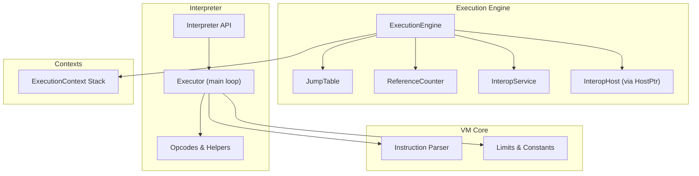

**Diagram sources**
- [execution_engine/mod.rs:195-242](file://neo-vm/src/execution_engine/mod.rs#L195-L242)
- [interpreter/mod.rs:8-15](file://neo-vm/src/interpreter/mod.rs#L8-L15)
- [interpreter/executor/mod.rs:24-761](file://neo-vm/src/interpreter/executor/mod.rs#L24-L761)
- [vm/instruction.rs:62-72](file://neo-vm/src/vm/instruction.rs#L62-L72)
- [vm/mod.rs:16-19](file://neo-vm/src/vm/mod.rs#L16-L19)
- [execution_context/mod.rs:1-5](file://neo-vm/src/execution_context/mod.rs#L1-L5)

**Section sources**
- [execution_engine/mod.rs:1-77](file://neo-vm/src/execution_engine/mod.rs#L1-L77)
- [interpreter/mod.rs:1-16](file://neo-vm/src/interpreter/mod.rs#L1-L16)
- [vm/mod.rs:1-26](file://neo-vm/src/vm/mod.rs#L1-L26)
- [execution_context/mod.rs:1-5](file://neo-vm/src/execution_context/mod.rs#L1-L5)

## Core Components
- ExecutionEngine: Central orchestrator that holds VM state, invocation stack, result stack, gas accounting, limits, jump table, reference counter, and interop hooks.
- ExecutionContext: Per-script execution state including script pointer, evaluation stack, return value count, and more.
- Instruction: Parsed representation of a single bytecode instruction with opcode, operand data, and cached size.
- Interpreter Executor: High-performance interpreter loop implementing opcodes, control flow, exceptions, and call frames.
- Limits: Enforced constraints such as max instructions, max stack depth, and item size.

Key responsibilities:
- Execute the main loop until HALT or FAULT
- Fetch and decode instructions at current IP
- Dispatch to opcode handlers via jump table or interpreter switch
- Manage call stack and return values
- Enforce gas and instruction limits
- Handle exceptions and propagate them through try/catch/finally

**Section sources**
- [execution_engine/mod.rs:195-242](file://neo-vm/src/execution_engine/mod.rs#L195-L242)
- [execution_engine/core.rs:11-45](file://neo-vm/src/execution_engine/core.rs#L11-L45)
- [vm/instruction.rs:62-72](file://neo-vm/src/vm/instruction.rs#L62-L72)
- [interpreter/executor/mod.rs:24-761](file://neo-vm/src/interpreter/executor/mod.rs#L24-L761)
- [vm/mod.rs:16-19](file://neo-vm/src/vm/mod.rs#L16-L19)

## Architecture Overview
The engine supports two execution paths:
- Legacy path: ExecutionEngine drives the loop, fetches Instruction objects, and dispatches via JumpTable handlers.
- Modern path: Interpreter executor runs an in-process loop over raw script bytes, managing call frames, locals, args, static fields, try/finally, and syscalls directly.

Both paths converge on consistent semantics for control flow, exceptions, and results.

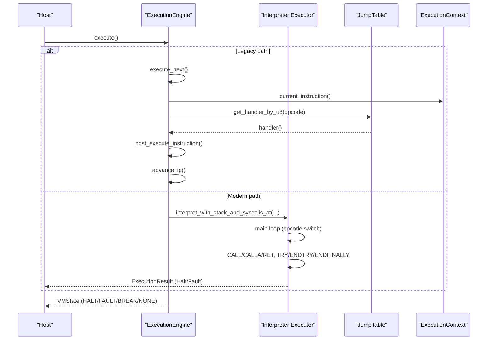

**Diagram sources**
- [execution_engine/execution.rs:9-23](file://neo-vm/src/execution_engine/execution.rs#L9-L23)
- [execution_engine/execution.rs:132-197](file://neo-vm/src/execution_engine/execution.rs#L132-L197)
- [interpreter/executor/mod.rs:79-751](file://neo-vm/src/interpreter/executor/mod.rs#L79-L751)

## Detailed Component Analysis

### Execution Engine Lifecycle and Main Loop
- Initialization sets default limits, reference counter, interop service, and initial state.
- The main loop executes until HALT or FAULT, invoking execute_next per iteration.
- execute_next handles:
  - Empty invocation stack -> HALT
  - End-of-script implicit return: pop rvcount items, route to caller or result stack, remove context, halt if no callers remain
  - Otherwise, delegate to internal execution which checks limits, fetches instruction, invokes pre/post hooks, dispatches via jump table, and advances IP unless jumping.

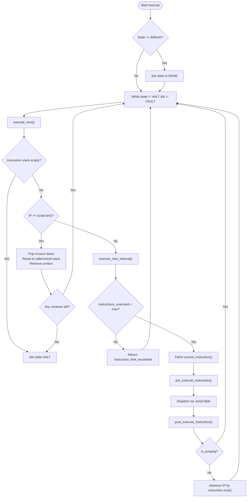

**Diagram sources**
- [execution_engine/execution.rs:9-23](file://neo-vm/src/execution_engine/execution.rs#L9-L23)
- [execution_engine/execution.rs:25-100](file://neo-vm/src/execution_engine/execution.rs#L25-L100)
- [execution_engine/execution.rs:132-197](file://neo-vm/src/execution_engine/execution.rs#L132-L197)

**Section sources**
- [execution_engine/execution.rs:9-100](file://neo-vm/src/execution_engine/execution.rs#L9-L100)
- [execution_engine/execution.rs:132-197](file://neo-vm/src/execution_engine/execution.rs#L132-L197)

### Instruction Fetching and Decoding
- Instructions are parsed from script bytes into Instruction objects containing opcode, operand bytes, and cached size.
- Parsing validates bounds and decodes variable-length operands (PUSHDATA variants).
- Size caching avoids repeated computation during execution.

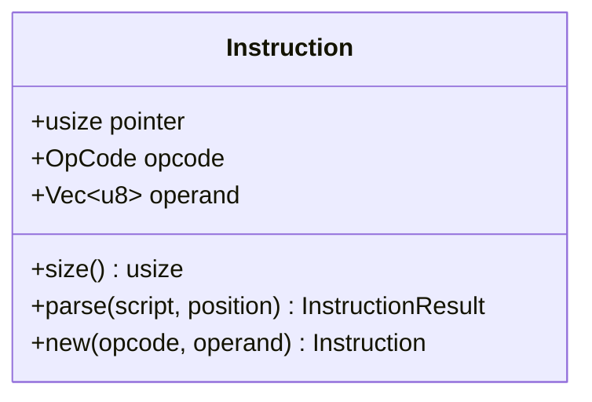

**Diagram sources**
- [vm/instruction.rs:62-72](file://neo-vm/src/vm/instruction.rs#L62-L72)
- [vm/instruction.rs:79-189](file://neo-vm/src/vm/instruction.rs#L79-L189)

**Section sources**
- [vm/instruction.rs:62-189](file://neo-vm/src/vm/instruction.rs#L62-L189)

### Control Flow Management
- The interpreter executor implements control flow opcodes: unconditional and conditional jumps, comparisons, call/call address, return, and exception handling (TRY/ENDTRY/ENDFINALLY).
- Call frames preserve locals, arguments, and slot initialization state; restoration occurs on RET or exception unwind.
- Exception propagation searches for the topmost uncaught frame, pushes catch payload, and resumes at catch or finally targets.

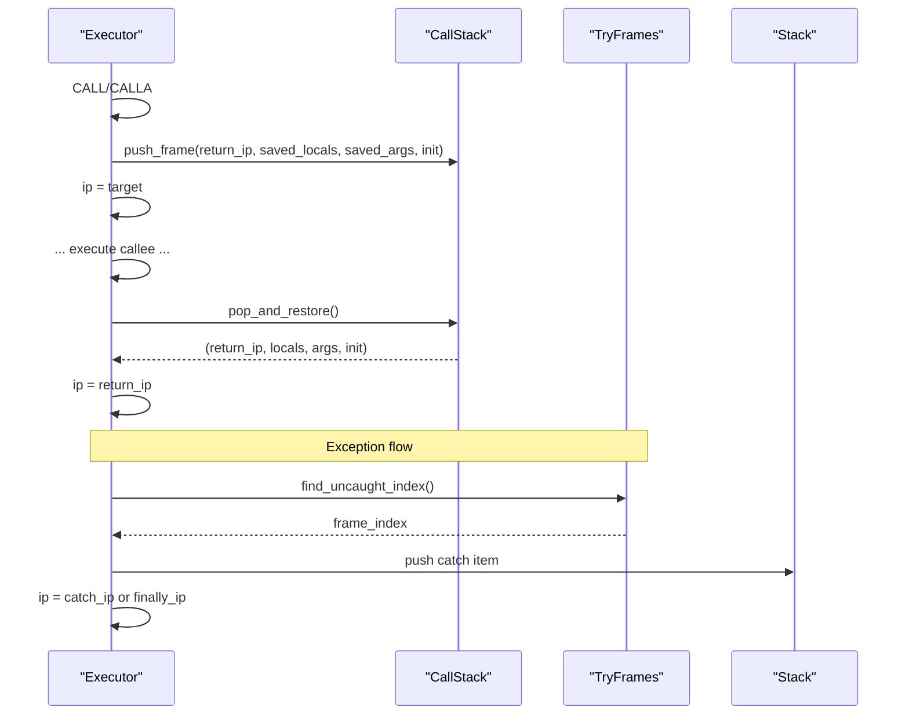

**Diagram sources**
- [interpreter/executor/mod.rs:444-509](file://neo-vm/src/interpreter/executor/mod.rs#L444-L509)
- [interpreter/executor/mod.rs:647-699](file://neo-vm/src/interpreter/executor/mod.rs#L647-L699)
- [interpreter/executor/mod.rs:700-733](file://neo-vm/src/interpreter/executor/mod.rs#L700-L733)
- [interpreter/executor/mod.rs:80-142](file://neo-vm/src/interpreter/executor/mod.rs#L80-L142)

**Section sources**
- [interpreter/executor/mod.rs:79-751](file://neo-vm/src/interpreter/executor/mod.rs#L79-L751)

### Execution Context Handling
- The engine maintains an invocation stack of ExecutionContext instances.
- Each context tracks its own script, instruction pointer, evaluation stack, and return value count.
- When a context ends (explicit RET or end-of-script), return values are routed to the caller’s stack or the engine’s result stack if it was the entry context.

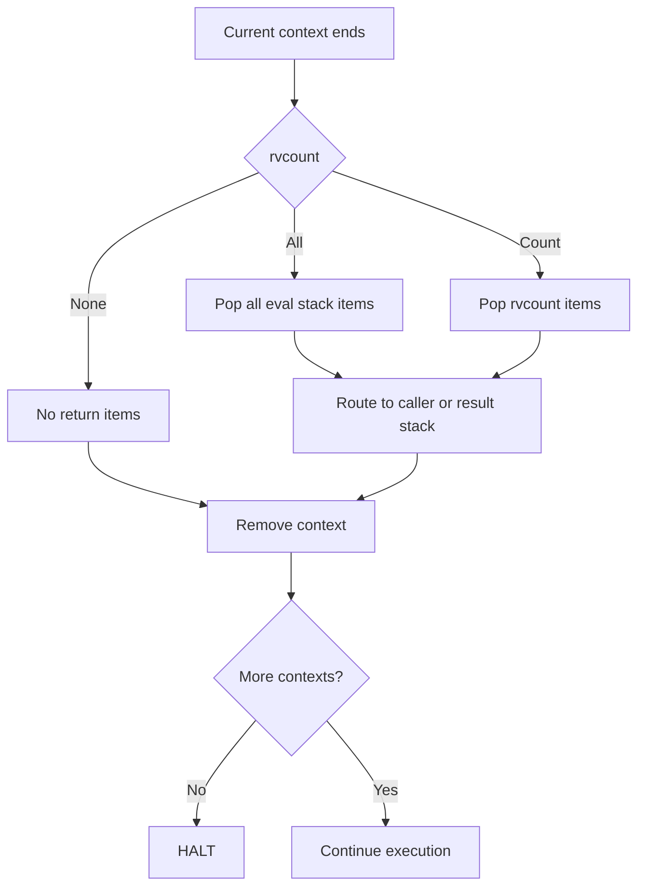

**Diagram sources**
- [execution_engine/execution.rs:43-96](file://neo-vm/src/execution_engine/execution.rs#L43-L96)

**Section sources**
- [execution_engine/execution.rs:43-96](file://neo-vm/src/execution_engine/execution.rs#L43-L96)

### Function Calls and Returns
- CALL/CALLA push call frames preserving locals, args, and slot initialization flags.
- On RET, frames are restored and execution resumes at the recorded return IP.
- The modern interpreter uses local stacks per frame and propagates active aliases back into saved frames before restore.

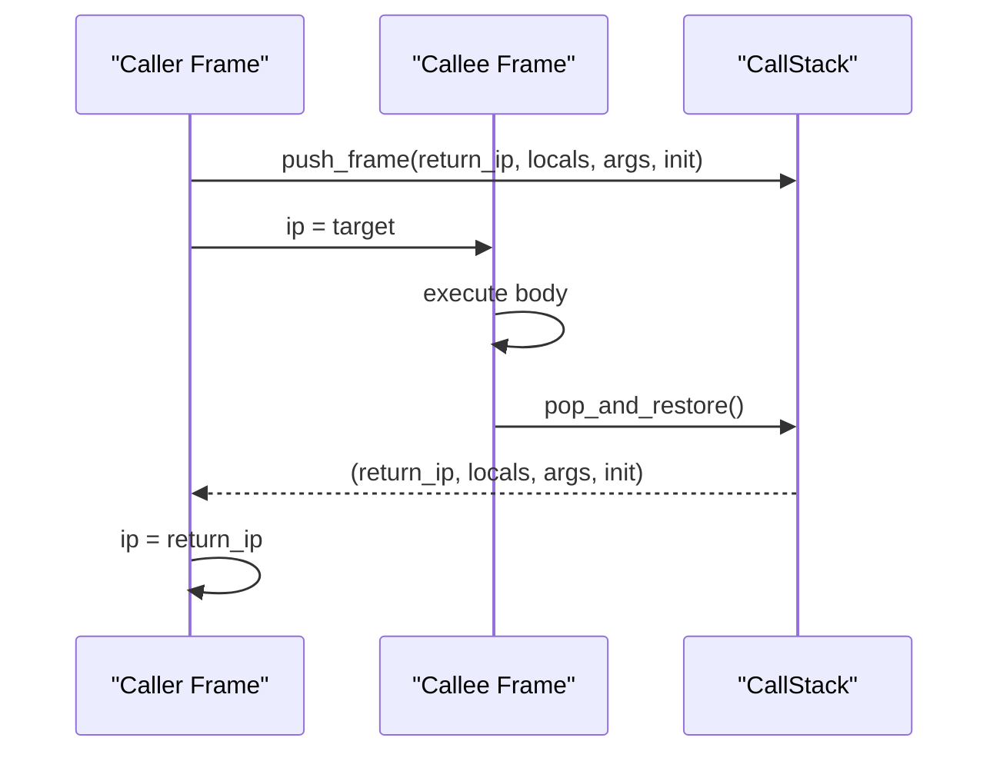

**Diagram sources**
- [interpreter/executor/mod.rs:444-509](file://neo-vm/src/interpreter/executor/mod.rs#L444-L509)
- [interpreter/executor/mod.rs:647-699](file://neo-vm/src/interpreter/executor/mod.rs#L647-L699)

**Section sources**
- [interpreter/executor/mod.rs:444-509](file://neo-vm/src/interpreter/executor/mod.rs#L444-L509)
- [interpreter/executor/mod.rs:647-699](file://neo-vm/src/interpreter/executor/mod.rs#L647-L699)

### Error Handling and Exception Propagation
- The legacy engine captures uncaught exceptions as a byte string and transitions to FAULT.
- Catchable exceptions can be converted into THROW when configured via limits.
- The interpreter executor implements TRY/ENDTRY/ENDFINALLY and routes pending errors to catch or finally blocks; unhandled errors bubble up to fault.

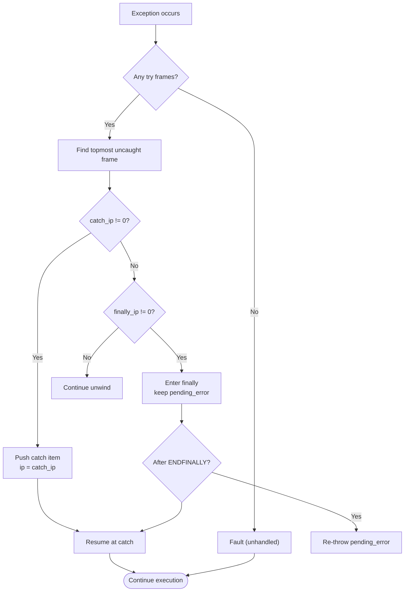

**Diagram sources**
- [execution_engine/core.rs:67-93](file://neo-vm/src/execution_engine/core.rs#L67-L93)
- [execution_engine/execution.rs:173-184](file://neo-vm/src/execution_engine/execution.rs#L173-L184)
- [interpreter/executor/mod.rs:80-142](file://neo-vm/src/interpreter/executor/mod.rs#L80-L142)
- [interpreter/executor/mod.rs:376-393](file://neo-vm/src/interpreter/executor/mod.rs#L376-L393)
- [interpreter/executor/mod.rs:700-733](file://neo-vm/src/interpreter/executor/mod.rs#L700-L733)

**Section sources**
- [execution_engine/core.rs:67-93](file://neo-vm/src/execution_engine/core.rs#L67-L93)
- [execution_engine/execution.rs:173-184](file://neo-vm/src/execution_engine/execution.rs#L173-L184)
- [interpreter/executor/mod.rs:80-142](file://neo-vm/src/interpreter/executor/mod.rs#L80-L142)
- [interpreter/executor/mod.rs:376-393](file://neo-vm/src/interpreter/executor/mod.rs#L376-L393)
- [interpreter/executor/mod.rs:700-733](file://neo-vm/src/interpreter/executor/mod.rs#L700-L733)

### Execution Limits Enforcement
- Instruction limit: checked before each instruction; exceeding triggers instruction_limit_exceeded.
- Stack overflow: interpreter enforces MAX_STACK_SIZE; engine performs post-execution checks with reference counting and GC hints.
- Gas limit: tracked per execution session; default limit provided.

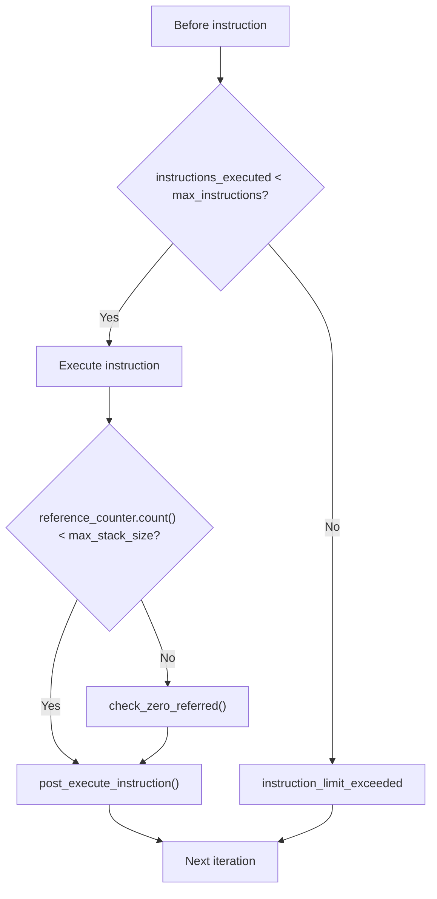

**Diagram sources**
- [execution_engine/execution.rs:132-143](file://neo-vm/src/execution_engine/execution.rs#L132-L143)
- [execution_engine/execution.rs:225-245](file://neo-vm/src/execution_engine/execution.rs#L225-L245)
- [interpreter/executor/mod.rs:144-147](file://neo-vm/src/interpreter/executor/mod.rs#L144-L147)
- [vm/mod.rs:16-19](file://neo-vm/src/vm/mod.rs#L16-L19)

**Section sources**
- [execution_engine/execution.rs:132-143](file://neo-vm/src/execution_engine/execution.rs#L132-L143)
- [execution_engine/execution.rs:225-245](file://neo-vm/src/execution_engine/execution.rs#L225-L245)
- [interpreter/executor/mod.rs:144-147](file://neo-vm/src/interpreter/executor/mod.rs#L144-L147)
- [vm/mod.rs:16-19](file://neo-vm/src/vm/mod.rs#L16-L19)

### Debugging Capabilities
- Step mode: step_next executes one instruction and sets state to BREAK unless already HALT/FAULT, enabling interactive debugging.
- Breakpoints: Initial state set to BREAK allows external debuggers to pause execution.
- Last IP tracking: Interpreter exposes last_interpreter_ip for diagnostics.

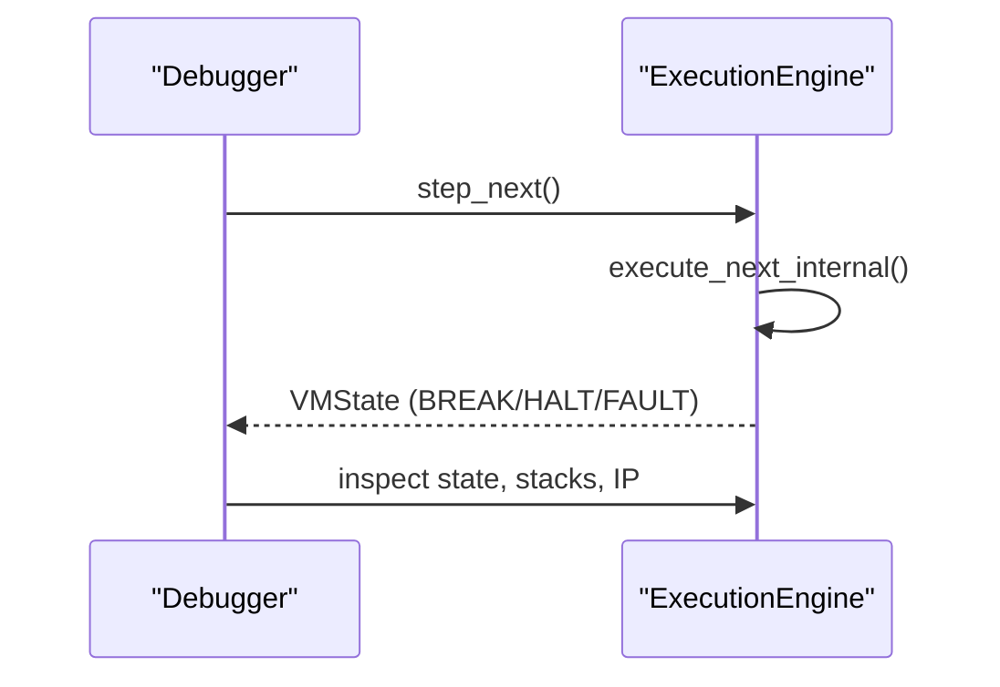

**Diagram sources**
- [execution_engine/execution.rs:108-130](file://neo-vm/src/execution_engine/execution.rs#L108-L130)
- [interpreter/mod.rs:8-15](file://neo-vm/src/interpreter/mod.rs#L8-L15)

**Section sources**
- [execution_engine/execution.rs:108-130](file://neo-vm/src/execution_engine/execution.rs#L108-L130)
- [interpreter/mod.rs:8-15](file://neo-vm/src/interpreter/mod.rs#L8-L15)

### Integration with Host Environment
- InteropHost callbacks: on_context_loaded/unloaded, pre/post_execute_instruction, invoke_syscall, on_callt.
- Syscalls: SYSCALL opcode invokes host-provided services with parameters from the stack.
- CALLT: Host-managed token-based calls integrated into the interpreter loop.

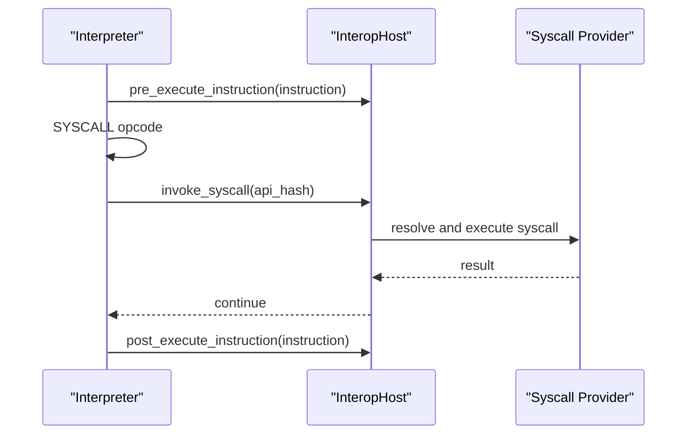

**Diagram sources**
- [execution_engine/mod.rs:135-185](file://neo-vm/src/execution_engine/mod.rs#L135-L185)
- [interpreter/executor/mod.rs:258-287](file://neo-vm/src/interpreter/executor/mod.rs#L258-L287)
- [interpreter/executor/mod.rs:289-314](file://neo-vm/src/interpreter/executor/mod.rs#L289-L314)

**Section sources**
- [execution_engine/mod.rs:135-185](file://neo-vm/src/execution_engine/mod.rs#L135-L185)
- [interpreter/executor/mod.rs:258-314](file://neo-vm/src/interpreter/executor/mod.rs#L258-L314)

## Dependency Analysis
- ExecutionEngine depends on:
  - ExecutionContext for per-script state
  - JumpTable for opcode dispatch
  - ReferenceCounter for object lifetime management
  - InteropService and InteropHost for syscalls and host integration
  - Limits for enforcement
- Interpreter executor depends on:
  - Opcodes and helpers for implementation
  - CallStack and TryFrames for control flow and exceptions
  - Host interface for syscalls and CALLT

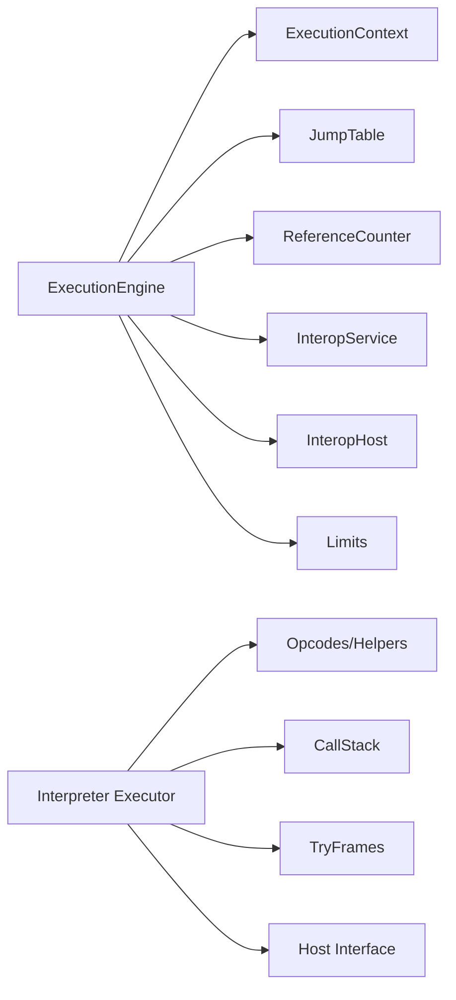

**Diagram sources**
- [execution_engine/mod.rs:195-242](file://neo-vm/src/execution_engine/mod.rs#L195-L242)
- [interpreter/executor/mod.rs:24-761](file://neo-vm/src/interpreter/executor/mod.rs#L24-L761)

**Section sources**
- [execution_engine/mod.rs:195-242](file://neo-vm/src/execution_engine/mod.rs#L195-L242)
- [interpreter/executor/mod.rs:24-761](file://neo-vm/src/interpreter/executor/mod.rs#L24-L761)

## Performance Considerations
- Instruction limit enforcement prevents infinite loops and resource exhaustion.
- Two-phase stack overflow detection balances safety and performance:
  - Fast path under limit
  - Thorough GC check near/at limit
- Cached instruction sizes reduce overhead during IP advancement.
- Interpreter executor minimizes allocations and uses efficient control structures for call frames and try/finally.
- Gas accounting provides predictable cost boundaries.

[No sources needed since this section provides general guidance]

## Troubleshooting Guide
Common issues and where they surface:
- Unsupported opcode: Indicates missing handler in jump table or unsupported bytecode; check opcode definitions and jump table configuration.
- Instruction limit exceeded: Script executed too many instructions; optimize logic or increase limits cautiously.
- Stack overflow: Too many items on evaluation stack; refactor to reduce stack pressure or enable GC checks.
- Unhandled exception: Exception propagated without try/catch; add appropriate exception handling or ensure catch/finally targets exist.
- Syscall failures: Host-provided syscall returned an error; verify host implementation and input parameters.

**Section sources**
- [execution_engine/execution.rs:163-171](file://neo-vm/src/execution_engine/execution.rs#L163-L171)
- [execution_engine/execution.rs:135-143](file://neo-vm/src/execution_engine/execution.rs#L135-L143)
- [interpreter/executor/mod.rs:734-736](file://neo-vm/src/interpreter/executor/mod.rs#L734-L736)
- [interpreter/executor/mod.rs:144-147](file://neo-vm/src/interpreter/executor/mod.rs#L144-L147)
- [interpreter/executor/mod.rs:80-142](file://neo-vm/src/interpreter/executor/mod.rs#L80-L142)

## Conclusion
The Neo Virtual Machine Execution Engine provides a robust, extensible platform for smart contract execution. It supports both a classic jump-table-driven engine and a high-performance interpreter executor, enforcing strict limits while offering rich debugging and host integration. Proper use of execution contexts, control flow, and exception handling ensures reliable and secure execution across diverse workloads.

[No sources needed since this section summarizes without analyzing specific files]

## Appendices

### Execution Lifecycle Summary
- Load script into ExecutionContext
- Push context onto invocation stack
- Execute loop until HALT or FAULT
- Handle implicit returns at end-of-script
- Route results to caller or result stack
- Enforce limits and handle exceptions throughout

**Section sources**
- [execution_engine/execution.rs:9-23](file://neo-vm/src/execution_engine/execution.rs#L9-L23)
- [execution_engine/execution.rs:43-96](file://neo-vm/src/execution_engine/execution.rs#L43-L96)