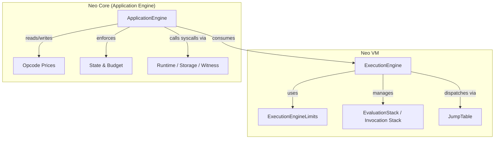
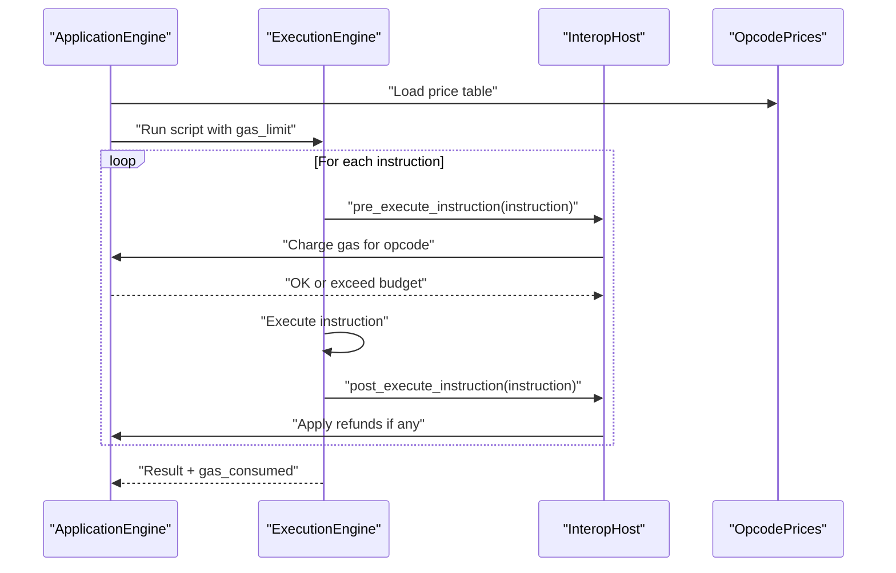
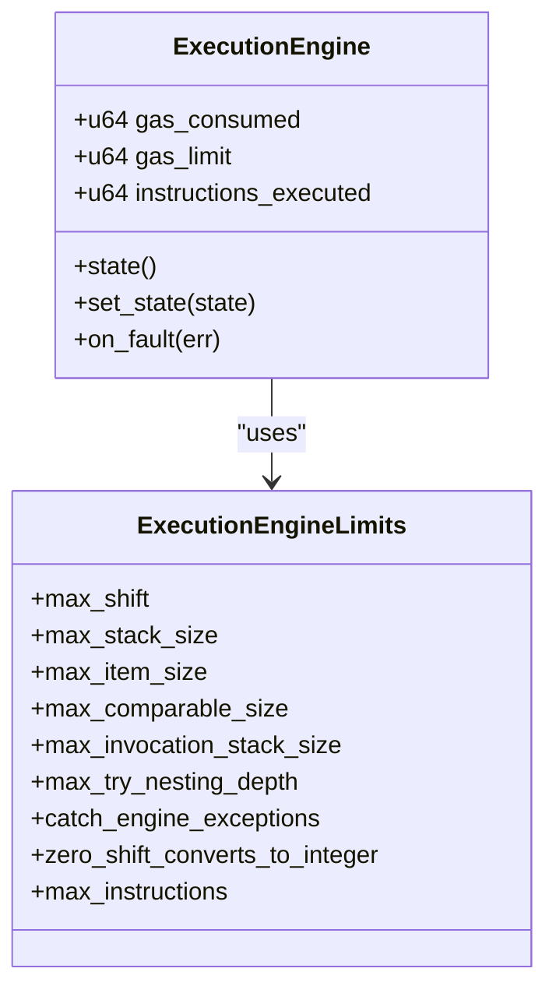
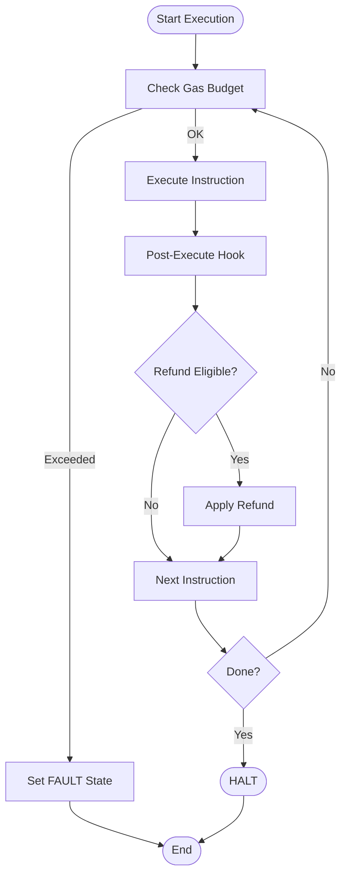
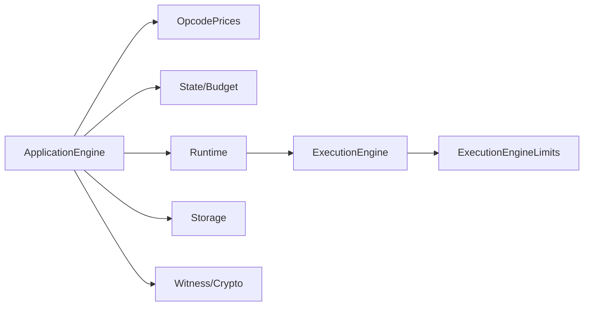

# Gas Metering & Resource Limits

<cite>
**Referenced Files in This Document**
- [limits.rs](file://neo-vm/src/vm/limits.rs)
- [execution_engine/mod.rs](file://neo-vm/src/execution_engine/mod.rs)
- [execution_engine/core.rs](file://neo-vm/src/execution_engine/core.rs)
- [op_code_prices.rs](file://neo-core/src/smart_contract/application_engine/op_code_prices.rs)
- [state.rs](file://neo-core/src/smart_contract/application_engine/state.rs)
- [runtime.rs](file://neo-core/src/smart_contract/application_engine/runtime.rs)
- [storage.rs](file://neo-core/src/smart_contract/application_engine/storage.rs)
- [witness_and_misc.rs](file://neo-core/src/smart_contract/application_engine/witness_and_misc.rs)
- [mod.rs](file://neo-core/src/smart_contract/application_engine/mod.rs)
- [error.rs](file://neo-vm/src/error.rs)
</cite>

## Table of Contents
1. Introduction
2. Project Structure
3. Core Components
4. Architecture Overview
5. Detailed Component Analysis
6. Dependency Analysis
7. Performance Considerations
8. Troubleshooting Guide
9. Conclusion

## Introduction
This document explains the Neo VM gas metering and resource limit system as implemented in this repository. It covers how gas is modeled, consumed, and enforced; how execution limits protect resources; how refunds and fees are handled at the application layer; and how to estimate, monitor, and optimize gas usage for smart contracts.

## Project Structure
The gas model spans two layers:
- Neo VM layer: defines execution limits (stack depth, invocation depth, item sizes), tracks per-execution gas consumed and limits, and provides hooks for host-driven metering.
- Application Engine layer (Neo core): defines opcode prices, enforces gas budgets, records events, and implements refund logic and fee accounting.

**Diagram sources**
- [execution_engine/mod.rs:195-242](file://neo-vm/src/execution_engine/mod.rs#L195-L242)
- [limits.rs:21-97](file://neo-vm/src/vm/limits.rs#L21-L97)
- [op_code_prices.rs](file://neo-core/src/smart_contract/application_engine/op_code_prices.rs)
- [state.rs](file://neo-core/src/smart_contract/application_engine/state.rs)
- [runtime.rs](file://neo-core/src/smart_contract/application_engine/runtime.rs)
- [storage.rs](file://neo-core/src/smart_contract/application_engine/storage.rs)
- [witness_and_misc.rs](file://neo-core/src/smart_contract/application_engine/witness_and_misc.rs)

**Section sources**
- [execution_engine/mod.rs:195-242](file://neo-vm/src/execution_engine/mod.rs#L195-L242)
- [limits.rs:21-97](file://neo-vm/src/vm/limits.rs#L21-L97)

## Core Components
- ExecutionEngine: owns gas_consumed and gas_limit fields, instruction counter, and state transitions. Provides hooks into the host for pre/post instruction metering.
- ExecutionEngineLimits: hard caps on stack size, item size, comparable size, invocation depth, try nesting, shift bounds, and optional instruction count cap.
- Application Engine (Neo core): holds opcode price tables, applies gas costs per operation, manages refunds, and exposes runtime APIs that interact with storage and witness verification under gas constraints.

Key responsibilities:
- VM layer: enforce structural limits and track raw gas counters; provide host callbacks for precise cost attribution.
- App layer: define per-opcode costs, apply them during execution, handle refunds, and ensure total fees are paid by transaction senders.

**Section sources**
- [execution_engine/mod.rs:195-242](file://neo-vm/src/execution_engine/mod.rs#L195-L242)
- [limits.rs:21-97](file://neo-vm/src/vm/limits.rs#L21-L97)
- [op_code_prices.rs](file://neo-core/src/smart_contract/application_engine/op_code_prices.rs)
- [state.rs](file://neo-core/src/smart_contract/application_engine/state.rs)

## Architecture Overview
Gas metering follows a layered design:
- The Application Engine sets up opcode prices and a budget before invoking the VM.
- The VM executes instructions and calls back into the Application Engine to charge gas and check limits.
- Structural limits (stack depth, item size, invocation depth) are enforced by the VM using ExecutionEngineLimits.
- Refunds are applied by the Application Engine after operations complete successfully.

**Diagram sources**
- [execution_engine/mod.rs:159-185](file://neo-vm/src/execution_engine/mod.rs#L159-L185)
- [op_code_prices.rs](file://neo-core/src/smart_contract/application_engine/op_code_prices.rs)
- [state.rs](file://neo-core/src/smart_contract/application_engine/state.rs)

## Detailed Component Analysis

### Execution Limits and Resource Caps
- Script size limit: maximum accepted script bytes for local execution and proof inputs.
- Stack and invocation limits: default maximum evaluation stack depth and maximum invocation depth.
- Item size limits: maximum size for buffers/compound values and comparisons.
- Try/catch nesting depth: bounded to prevent excessive control flow complexity.
- Shift bounds: maximum bit shifts allowed by shift opcodes.
- Instruction count cap: disabled by default to align with protocol semantics where gas is the bound; callers may set a lower value for service-level budgets.

These limits are enforced by the VM’s limits module and checked during execution paths that allocate or manipulate stacks and items.

**Section sources**
- [limits.rs:5-19](file://neo-vm/src/vm/limits.rs#L5-L19)
- [limits.rs:21-97](file://neo-vm/src/vm/limits.rs#L21-L97)

### Gas Tracking in the VM
- The ExecutionEngine maintains:
  - gas_consumed: cumulative gas used during execution.
  - gas_limit: maximum gas allowed for this execution session.
  - instructions_executed: number of instructions executed.
- Default gas_limit is provided for convenience when no explicit budget is set.
- The engine exposes host callbacks to integrate precise per-instruction charging and post-execution adjustments.

**Diagram sources**
- [execution_engine/mod.rs:195-242](file://neo-vm/src/execution_engine/mod.rs#L195-L242)
- [limits.rs:21-97](file://neo-vm/src/vm/limits.rs#L21-L97)

**Section sources**
- [execution_engine/mod.rs:188-242](file://neo-vm/src/execution_engine/mod.rs#L188-L242)
- [execution_engine/core.rs:11-45](file://neo-vm/src/execution_engine/core.rs#L11-L45)

### Opcode Pricing and Fee Calculation
- Opcode prices are defined in the Application Engine layer and consulted during execution to compute gas costs per instruction.
- Fees are charged before or during instruction execution via host callbacks, ensuring that expensive operations are accounted for early.
- Refunds are applied after successful completion of certain operations to avoid overcharging.

Best practices:
- Keep frequently executed paths cheap by minimizing heavy operations.
- Batch operations where possible to reduce per-call overhead.
- Avoid unbounded loops and large data structures in hot paths.

**Section sources**
- [op_code_prices.rs](file://neo-core/src/smart_contract/application_engine/op_code_prices.rs)
- [execution_engine/mod.rs:159-185](file://neo-vm/src/execution_engine/mod.rs#L159-L185)

### Storage and I/O Costs
- Storage reads/writes incur gas based on key/value sizes and persistence operations.
- Iterators and scans are metered to prevent excessive traversal costs.
- Large writes should be chunked and validated to stay within gas budgets.

Optimization tips:
- Prefer compact keys and values.
- Minimize repeated reads by caching results in memory when appropriate.
- Use efficient iteration patterns and avoid scanning entire storages.

**Section sources**
- [storage.rs](file://neo-core/src/smart_contract/application_engine/storage.rs)
- [runtime.rs](file://neo-core/src/smart_contract/application_engine/runtime.rs)

### Witness and Cryptographic Costs
- Signature verification and cryptographic operations have significant gas costs.
- Minimize the number of verifications and reuse computed hashes where safe.
- Validate inputs early to fail fast and avoid unnecessary computation.

**Section sources**
- [witness_and_misc.rs](file://neo-core/src/smart_contract/application_engine/witness_and_misc.rs)

### Refund Mechanisms
- Refunds are applied by the Application Engine after successful operations to return unused gas portions.
- Ensure your contract logic does not rely on partial refunds for correctness; treat refunds as optimizations rather than guarantees.

Monitoring:
- Track gas_consumed and final gas_used to understand actual vs estimated costs.
- Use test harnesses to measure refund behavior across different code paths.

**Section sources**
- [state.rs](file://neo-core/src/smart_contract/application_engine/state.rs)
- [execution_engine/mod.rs:159-185](file://neo-vm/src/execution_engine/mod.rs#L159-L185)

### Execution Flow and State Transitions
- The VM transitions through states such as NONE, HALT, FAULT, and BREAK.
- Faults are recorded with context details (instruction pointer, opcode, stack depth) to aid debugging.
- Exceptions can be caught depending on configuration; otherwise they propagate to FAULT.

**Diagram sources**
- [execution_engine/core.rs:67-93](file://neo-vm/src/execution_engine/core.rs#L67-L93)
- [execution_engine/mod.rs:159-185](file://neo-vm/src/execution_engine/mod.rs#L159-L185)

**Section sources**
- [execution_engine/core.rs:67-93](file://neo-vm/src/execution_engine/core.rs#L67-L93)
- [execution_engine/mod.rs:195-242](file://neo-vm/src/execution_engine/mod.rs#L195-L242)

## Dependency Analysis
- ExecutionEngine depends on ExecutionEngineLimits for structural enforcement and on InteropHost callbacks for gas metering integration.
- Application Engine depends on opcode pricing and state modules to compute and record gas usage.
- Storage and witness modules depend on runtime services and are constrained by gas budgets.

**Diagram sources**
- [execution_engine/mod.rs:195-242](file://neo-vm/src/execution_engine/mod.rs#L195-L242)
- [limits.rs:21-97](file://neo-vm/src/vm/limits.rs#L21-L97)
- [op_code_prices.rs](file://neo-core/src/smart_contract/application_engine/op_code_prices.rs)
- [state.rs](file://neo-core/src/smart_contract/application_engine/state.rs)
- [runtime.rs](file://neo-core/src/smart_contract/application_engine/runtime.rs)
- [storage.rs](file://neo-core/src/smart_contract/application_engine/storage.rs)
- [witness_and_misc.rs](file://neo-core/src/smart_contract/application_engine/witness_and_misc.rs)

**Section sources**
- [execution_engine/mod.rs:195-242](file://neo-vm/src/execution_engine/mod.rs#L195-L242)
- [limits.rs:21-97](file://neo-vm/src/vm/limits.rs#L21-L97)

## Performance Considerations
- Prefer constant-time operations where possible to avoid variable gas spikes.
- Reduce memory allocations and avoid large temporary buffers.
- Batch storage operations and minimize iterator scans.
- Reuse computed hashes and avoid redundant cryptographic checks.
- Tune gas_limit appropriately for RPC admission and batch processing to prevent over-allocation.

[No sources needed since this section provides general guidance]

## Troubleshooting Guide
Common issues and diagnostics:
- Gas exceeded: indicates total gas_consumed surpassed gas_limit; review opcode costs and refactor hot paths.
- Stack overflow: check max_stack_size and reduce recursion or large intermediate data.
- Invocation depth exceeded: reduce deep call chains or restructure logic.
- Item size exceeded: ensure payloads and buffers respect MAX_ITEM_SIZE and max_comparable_size.
- Fault state with context: inspect instruction pointer, opcode, and evaluation stack depth from fault messages.

Error handling:
- The VM records uncaught exceptions and transitions to FAULT; use these signals to surface meaningful errors to callers.
- Leverage pre/post instruction hooks to log detailed gas charges and identify bottlenecks.

**Section sources**
- [execution_engine/core.rs:67-93](file://neo-vm/src/execution_engine/core.rs#L67-L93)
- [limits.rs:73-90](file://neo-vm/src/vm/limits.rs#L73-L90)
- [error.rs](file://neo-vm/src/error.rs)

## Conclusion
The Neo VM gas model combines strict structural limits with flexible, host-driven metering to ensure predictable and secure execution. By understanding opcode pricing, leveraging refunds, and adhering to best practices for efficient contract development, developers can write robust, cost-effective smart contracts while maintaining security and performance.

[No sources needed since this section summarizes without analyzing specific files]