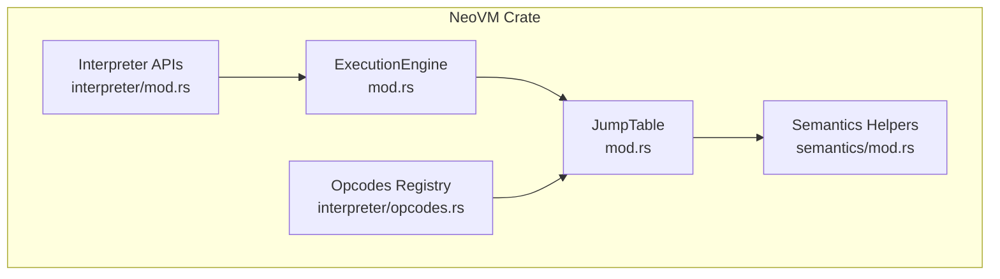
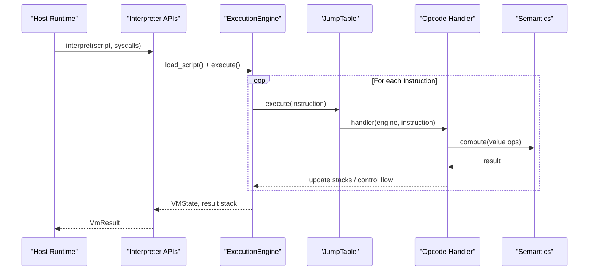
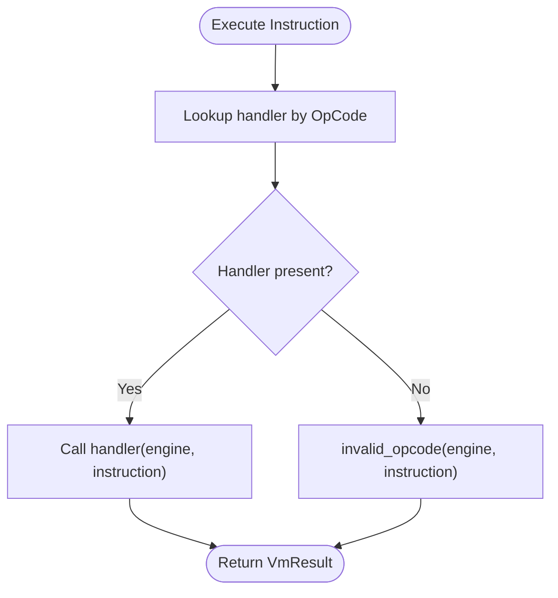
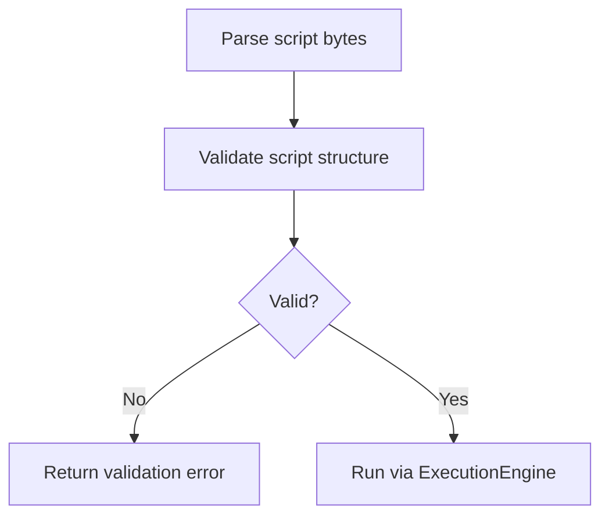
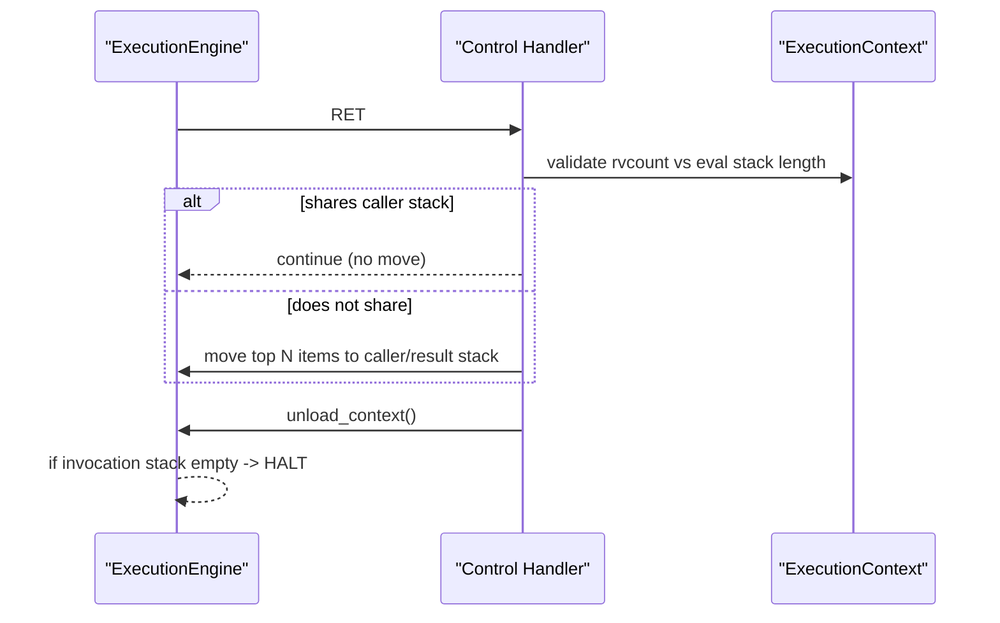
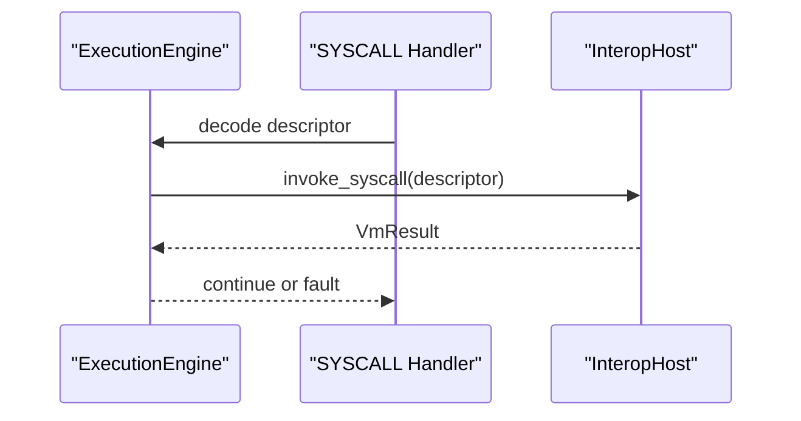
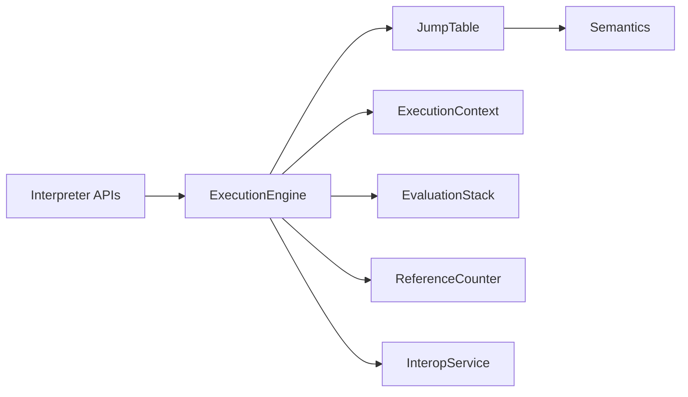

# Interpreter & Opcodes

<cite>
**Referenced Files in This Document**
- [lib.rs](file://neo-vm/src/lib.rs)
- [mod.rs (interpreter)](file://neo-vm/src/interpreter/mod.rs)
- [opcodes.rs (interpreter)](file://neo-vm/src/interpreter/opcodes.rs)
- [mod.rs (jump_table)](file://neo-vm/src/jump_table/mod.rs)
- [numeric.rs (jump_table)](file://neo-vm/src/jump_table/numeric.rs)
- [control.rs (jump_table)](file://neo-vm/src/jump_table/control.rs)
- [stack.rs (jump_table)](file://neo-vm/src/jump_table/stack.rs)
- [mod.rs (semantics)](file://neo-vm/src/semantics/mod.rs)
- [mod.rs (execution_engine)](file://neo-vm/src/execution_engine/mod.rs)
</cite>

## Table of Contents
1. Introduction
2. Project Structure
3. Core Components
4. Architecture Overview
5. Detailed Component Analysis
6. Dependency Analysis
7. Performance Considerations
8. Troubleshooting Guide
9. Conclusion
10. Appendices

## Introduction
This document explains the Neo VM interpreter and opcode system as implemented in the neo-vm crate. It covers how opcodes are parsed, validated, dispatched via a jump table, and executed with well-defined semantics. It also documents the complete opcode set categories, parameter handling, return value processing, performance characteristics, debugging techniques, and guidelines for extending the opcode set with examples of common usage patterns and optimization strategies.

## Project Structure
The Neo VM is organized into focused modules:
- lib.rs exposes the public API and re-exports core types, including the interpreter entry points, instruction parsing/validation, and the execution engine.
- interpreter provides the high-level interpret functions and helper utilities used by the host runtime.
- jump_table implements the stateful dispatch layer that maps each OpCode to an InstructionHandler and groups handlers by category (numeric, control, stack, etc.).
- semantics contains ABI-level helpers for value operations (arithmetic, comparison, conversion, splice, collections).
- execution_engine orchestrates the main execution loop, manages contexts, stacks, gas metering, exceptions, and interop/syscalls.

**Diagram sources**
- [mod.rs (execution_engine):1-70](file://neo-vm/src/execution_engine/mod.rs#L1-L70)
- [mod.rs (jump_table):1-183](file://neo-vm/src/jump_table/mod.rs#L1-L183)
- [mod.rs (interpreter):1-16](file://neo-vm/src/interpreter/mod.rs#L1-L16)
- [mod.rs (semantics):1-16](file://neo-vm/src/semantics/mod.rs#L1-L16)
- [opcodes.rs (interpreter):1-226](file://neo-vm/src/interpreter/opcodes.rs#L1-L226)

**Section sources**
- [lib.rs:1-309](file://neo-vm/src/lib.rs#L1-L309)
- [mod.rs (execution_engine):1-70](file://neo-vm/src/execution_engine/mod.rs#L1-L70)
- [mod.rs (jump_table):1-183](file://neo-vm/src/jump_table/mod.rs#L1-L183)
- [mod.rs (interpreter):1-16](file://neo-vm/src/interpreter/mod.rs#L1-L16)
- [mod.rs (semantics):1-16](file://neo-vm/src/semantics/mod.rs#L1-L16)
- [opcodes.rs (interpreter):1-226](file://neo-vm/src/interpreter/opcodes.rs#L1-L226)

## Core Components
- ExecutionEngine: Manages the invocation stack, evaluation stack, result stack, gas limits, exception state, and the main execute loop. It coordinates context switching, call/return semantics, and syscall dispatch.
- JumpTable: A fixed-size array mapping each byte-valued OpCode to an InstructionHandler. It registers default handlers grouped by category and provides fast lookup via get_handler/get_handler_by_u8.
- Semantics: Pure, ABI-level helpers for numeric, comparison, conversion, splice, and collection operations on StackValue. Handlers in jump_table delegate to these helpers to keep behavior canonical across hosts.
- Interpreter APIs: High-level interpret functions exposed to the host, which parse scripts into instructions and run them using the execution engine and jump table.

Key responsibilities:
- Parsing and validation: Script bytes are parsed into Instruction sequences; validation enforces script constraints and structure.
- Dispatch: The execution loop fetches the next Instruction and calls JumpTable.execute, which invokes the appropriate handler.
- Semantics: Each handler reads/writes the evaluation stack, manipulates control flow, or invokes syscalls/native contracts.

**Section sources**
- [lib.rs:1-309](file://neo-vm/src/lib.rs#L1-L309)
- [mod.rs (execution_engine):1-70](file://neo-vm/src/execution_engine/mod.rs#L1-L70)
- [mod.rs (jump_table):1-183](file://neo-vm/src/jump_table/mod.rs#L1-L183)
- [mod.rs (semantics):1-16](file://neo-vm/src/semantics/mod.rs#L1-L16)

## Architecture Overview
The interpreter follows a layered design:
- Host/runtime calls interpreter APIs to run scripts.
- The execution engine drives the instruction cycle, maintaining contexts and stacks.
- The jump table dispatches each opcode to a handler.
- Handlers perform stack manipulation, control flow changes, arithmetic/comparison via semantics, and invoke syscalls when needed.

**Diagram sources**
- [mod.rs (interpreter):1-16](file://neo-vm/src/interpreter/mod.rs#L1-L16)
- [mod.rs (execution_engine):1-70](file://neo-vm/src/execution_engine/mod.rs#L1-L70)
- [mod.rs (jump_table):1-183](file://neo-vm/src/jump_table/mod.rs#L1-L183)

## Detailed Component Analysis

### Opcode Dispatch Mechanism (Jump Table)
- Fixed-size array of 256 entries maps each OpCode byte to an optional InstructionHandler.
- Default registration groups handlers by category: bitwisee, compound, control, numeric, push, slot, splice, stack, types.
- Fast path: get_handler_by_u8 uses unsafe indexing with debug_assert bounds checks for zero-overhead hot-path access.
- Execute path: If no handler is found, invalid_opcode returns an unsupported operation error.

**Diagram sources**
- [mod.rs (jump_table):1-183](file://neo-vm/src/jump_table/mod.rs#L1-L183)

**Section sources**
- [mod.rs (jump_table):1-183](file://neo-vm/src/jump_table/mod.rs#L1-L183)

### Instruction Parsing and Validation
- Scripts are parsed into Instruction sequences containing an OpCode and tokens/operands.
- Validation ensures script size limits, valid jumps, and structural correctness before execution.
- The interpreter exposes functions to run scripts with or without custom syscalls and result limits.

[No sources needed since this section summarizes parsing/validation workflow without analyzing specific files]

### Relationship Between Opcodes and Semantic Implementations
- Each opcode handler in jump_table performs minimal stack I/O and delegates value computations to semantics helpers.
- This separation keeps opcode handlers small and ensures consistent ABI-level behavior across hosts.

Examples:
- Numeric opcodes (ADD, SUB, MUL, DIV, POW, SHL, SHR, comparisons) use semantics::arithmetic and semantics::comparison.
- Stack opcodes manipulate EvaluationStack directly with optimized paths (e.g., SWAP avoids pop/push churn).

**Section sources**
- [numeric.rs (jump_table):1-470](file://neo-vm/src/jump_table/numeric.rs#L1-L470)
- [stack.rs (jump_table):1-295](file://neo-vm/src/jump_table/stack.rs#L1-L295)
- [mod.rs (semantics):1-16](file://neo-vm/src/semantics/mod.rs#L1-L16)

### Complete Opcode Set and Categories
Categories and representative opcodes (as registered and aliased in the codebase):
- Push constants/data: PUSHINT8/16/32/64/128/256, PUSHT, PUSHF, PUSHA, PUSHNULL, PUSHDATA1/2/4, PUSHM1..PUSH16, PUSH0..PUSH16.
- Flow control: NOP, JMP/JMP_L, JMPIF/JMPIF_L, JMPIFNOT/JMPIFNOT_L, JMPEQ/JMPEQ_L, JMPNE/JMPNE_L, JMPGT/JMPGT_L, JMPGE/JMPGE_L, JMPLT/JMPLT_L, JMPLE/JMPLE_L, CALL/CALL_L/CALLA/CALLT, ABORT, ASSERT, THROW, TRY/TRY_L, ENDTRY/ENDTRY_L, ENDFINALLY, RET, SYSCALL, ABORTMSG, ASSERTMSG.
- Stack manipulation: DEPTH, DROP, NIP, XDROP, CLEAR, DUP, OVER, PICK, TUCK, SWAP, ROT, ROLL, REVERSE3, REVERSE4, REVERSEN.
- Slot storage: INITSSLOT, INITSLOT, LDSFLD0..LDSFLD, STSFLD0..STSFLD, LDLOC0..LDLOC, STLOC0..STLOC, LDARG0..LDARG, STARG0..STARG.
- Splice/string: NEWBUFFER, MEMCPY, CAT, SUBSTR, LEFT, RIGHT.
- Bitwise/logic: INVERT, AND, OR, XOR, EQUAL, NOTEQUAL.
- Arithmetic/comparisons: SIGN, ABS, NEGATE, INC, DEC, ADD, SUB, MUL, DIV, MOD, POW, SQRT, MODMUL, MODPOW, SHL, SHR, NOT, BOOLAND, BOOLOR, NZ, NUMEQUAL, NUMNOTEQUAL, LT, LE, GT, GE, MIN, MAX, WITHIN.
- Compound types: PACKMAP, PACKSTRUCT, PACK, UNPACK, NEWARRAY0, NEWARRAY, NEWARRAY_T, NEWSTRUCT0, NEWSTRUCT, NEWMAP, SIZE, HASKEY, KEYS, VALUES, PICKITEM, APPEND, SETITEM, REVERSEITEMS, REMOVE, CLEARITEMS, POPITEM.
- Types: ISNULL, ISTYPE, CONVERT.

These are defined as aliases and registered in the interpreter and jump_table modules.

**Section sources**
- [opcodes.rs (interpreter):1-226](file://neo-vm/src/interpreter/opcodes.rs#L1-L226)
- [control.rs (jump_table):1-500](file://neo-vm/src/jump_table/control.rs#L1-L500)
- [numeric.rs (jump_table):1-470](file://neo-vm/src/jump_table/numeric.rs#L1-L470)
- [stack.rs (jump_table):1-295](file://neo-vm/src/jump_table/stack.rs#L1-L295)

### Execution Semantics, Parameter Handling, and Return Values
- Parameters: Most binary/ternary handlers pop operands from the evaluation stack in right-to-left order, convert to StackValue via value_from_stack_item, compute results through semantics, and push back results.
- Control flow: Jump opcodes read offsets from instruction tokens and adjust the instruction pointer via engine.execute_jump_offset. CALL variants compute target positions relative to current IP and push new contexts.
- Returns: RET validates expected return count (rvcount), moves items to caller’s stack or result stack depending on sharing policy, and sets HALT when the invocation stack empties.
- Syscalls: SYSCALL decodes a u32 descriptor and delegates to engine.on_syscall, which routes to InteropService or host callbacks.

**Diagram sources**
- [control.rs (jump_table):388-455](file://neo-vm/src/jump_table/control.rs#L388-L455)

**Section sources**
- [control.rs (jump_table):1-500](file://neo-vm/src/jump_table/control.rs#L1-L500)
- [numeric.rs (jump_table):1-470](file://neo-vm/src/jump_table/numeric.rs#L1-L470)
- [stack.rs (jump_table):1-295](file://neo-vm/src/jump_table/stack.rs#L1-L295)

### Native Contract Calls and Syscalls
- SYSCALL opcode decodes a u32 token and triggers engine.on_syscall.
- The execution engine integrates with InteropService and host-provided InteropHost callbacks to implement native contract methods and system services.
- CALLT delegates to host-specific on_callt for method token resolution and cross-contract invocation.

**Diagram sources**
- [control.rs (jump_table):457-461](file://neo-vm/src/jump_table/control.rs#L457-L461)
- [mod.rs (execution_engine):159-185](file://neo-vm/src/execution_engine/mod.rs#L159-L185)

**Section sources**
- [control.rs (jump_table):457-461](file://neo-vm/src/jump_table/control.rs#L457-L461)
- [mod.rs (execution_engine):159-185](file://neo-vm/src/execution_engine/mod.rs#L159-L185)

## Dependency Analysis
- ExecutionEngine depends on JumpTable for opcode dispatch, ExecutionContext for per-call frames, EvaluationStack for operand storage, ReferenceCounter for GC support, and InteropService/InteropHost for syscalls.
- JumpTable categories depend on semantics for value operations and on ExecutionEngine for stack and control flow mutations.
- Interpreter APIs depend on both ExecutionEngine and JumpTable to provide high-level execution entry points.

**Diagram sources**
- [mod.rs (execution_engine):1-70](file://neo-vm/src/execution_engine/mod.rs#L1-L70)
- [mod.rs (jump_table):1-183](file://neo-vm/src/jump_table/mod.rs#L1-L183)
- [mod.rs (semantics):1-16](file://neo-vm/src/semantics/mod.rs#L1-L16)
- [mod.rs (interpreter):1-16](file://neo-vm/src/interpreter/mod.rs#L1-L16)

**Section sources**
- [mod.rs (execution_engine):1-70](file://neo-vm/src/execution_engine/mod.rs#L1-L70)
- [mod.rs (jump_table):1-183](file://neo-vm/src/jump_table/mod.rs#L1-L183)
- [mod.rs (semantics):1-16](file://neo-vm/src/semantics/mod.rs#L1-L16)
- [mod.rs (interpreter):1-16](file://neo-vm/src/interpreter/mod.rs#L1-L16)

## Performance Considerations
- Jump table lookup: Fixed-size array with inline get_handler_by_u8 minimizes branching and enables direct function pointer calls in the hot path.
- Stack operations: Optimized implementations avoid unnecessary reference counting churn (e.g., SWAP swaps in place; ROT/ROLL remove and push once).
- Shift operations: Enforce engine limits to prevent excessive shifts; select pre/post-Gorgon semantics based on configuration.
- Gas model: Precise metering per operation prevents abuse and ensures predictable costs.
- Context management: Efficient push/pop/unload during calls and returns reduces overhead.

Practical tips:
- Prefer compact forms (e.g., JMP over JMP_L when offset fits) to reduce bytecode size.
- Minimize intermediate stack allocations by using direct stack manipulations where possible.
- Batch data operations using splice/collection opcodes to reduce interpreter overhead.

[No sources needed since this section provides general guidance grounded in observed implementation patterns]

## Troubleshooting Guide
Common issues and where to inspect:
- Unsupported opcode: Occurs when a handler is missing; JumpTable.invalid_opcode reports the opcode. Check registration in register_default_handlers and ensure all categories are included.
- Stack underflow: Handlers validate stack depth before popping; errors indicate insufficient items. Verify preceding pushes and correct operand ordering.
- Invalid jump targets: Control flow opcodes compute target positions and may fail on overflow; check offsets and script layout.
- Assertion failures: ASSERT/ASSERTMSG raise explicit errors; inspect condition values prior to assertion.
- Exception handling: TRY/ENDTRY/ENDFINALLY manage try/finally blocks; ensure proper pairing and offsets.

Debugging techniques:
- Use interpreter state queries (last_interpreter_ip, last_result_limit, last_result_stack_len, last_result_stage) to pinpoint failure locations.
- Inspect InvocationStack and EvaluationStack snapshots around faults to trace state transitions.
- Add logging around critical handlers (control flow, syscalls) to observe parameters and outcomes.

**Section sources**
- [mod.rs (jump_table):133-152](file://neo-vm/src/jump_table/mod.rs#L133-L152)
- [control.rs (jump_table):319-349](file://neo-vm/src/jump_table/control.rs#L319-L349)
- [mod.rs (interpreter):1-16](file://neo-vm/src/interpreter/mod.rs#L1-L16)

## Conclusion
The Neo VM interpreter in neo-vm cleanly separates concerns: parsing/validation, dispatch via a fast jump table, and semantic computation in reusable helpers. The execution engine coordinates contexts, stacks, gas, and syscalls while ensuring robust control flow and exception handling. This architecture supports efficient opcode execution, clear debugging, and straightforward extension of the opcode set.

[No sources needed since this section summarizes without analyzing specific files]

## Appendices

### Extending the Opcode Set: Guidelines
- Define the new opcode constant and alias in interpreter/opcodes.rs if needed for internal references.
- Implement a handler in the appropriate jump_table category module (e.g., numeric.rs, control.rs, stack.rs).
- Register the handler using the provided macro in register_handlers.
- If the opcode requires new semantics, add helpers in semantics and reuse them from the handler.
- Ensure parameter parsing matches instruction token formats (i8/i32/u16/u32) and validates ranges.
- Add tests covering normal cases, edge cases (underflow, overflow), and error paths.

Example pattern:
- Handler skeleton: pop operands, convert to StackValue, call semantics function, push result, handle errors consistently.
- Control flow: compute target safely, update instruction pointer via engine methods, maintain context invariants.

**Section sources**
- [mod.rs (jump_table):154-183](file://neo-vm/src/jump_table/mod.rs#L154-L183)
- [numeric.rs (jump_table):70-104](file://neo-vm/src/jump_table/numeric.rs#L70-L104)
- [control.rs (jump_table):10-57](file://neo-vm/src/jump_table/control.rs#L10-L57)

### Common Usage Patterns and Optimization Strategies
- Arithmetic chains: Use dedicated ternary ops like MODMUL/MODPOW to reduce stack shuffling.
- String/buffer manipulation: Combine NEWBUFFER, MEMCPY, CAT, SUBSTR for efficient buffer workflows.
- Conditional logic: Prefer JMPIF/JMPIFNOT with compact offsets; use comparison opcodes to produce booleans for control flow.
- Stack efficiency: Use SWAP, ROT, ROLL, REVERSEN to reorder without full pop/push cycles.
- Syscalls: Group related native calls to minimize context switches and gas overhead.

[No sources needed since this section provides general guidance grounded in observed implementation patterns]