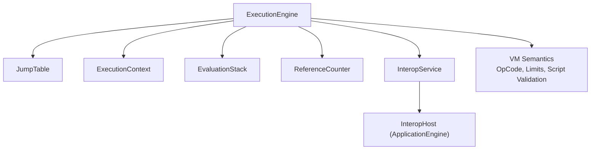
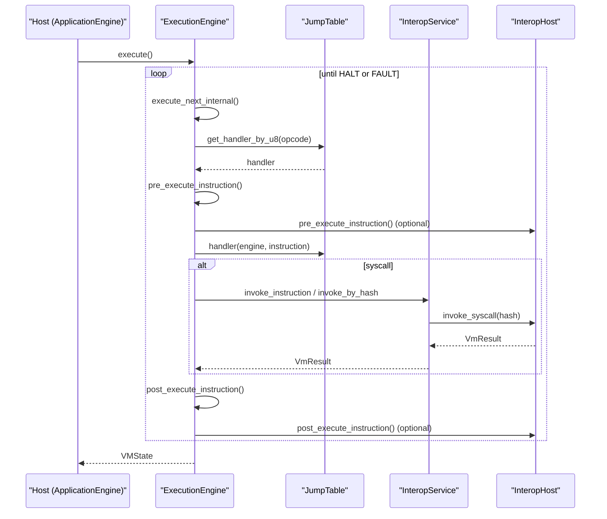
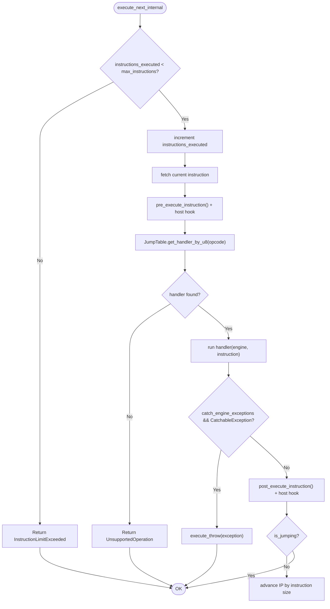
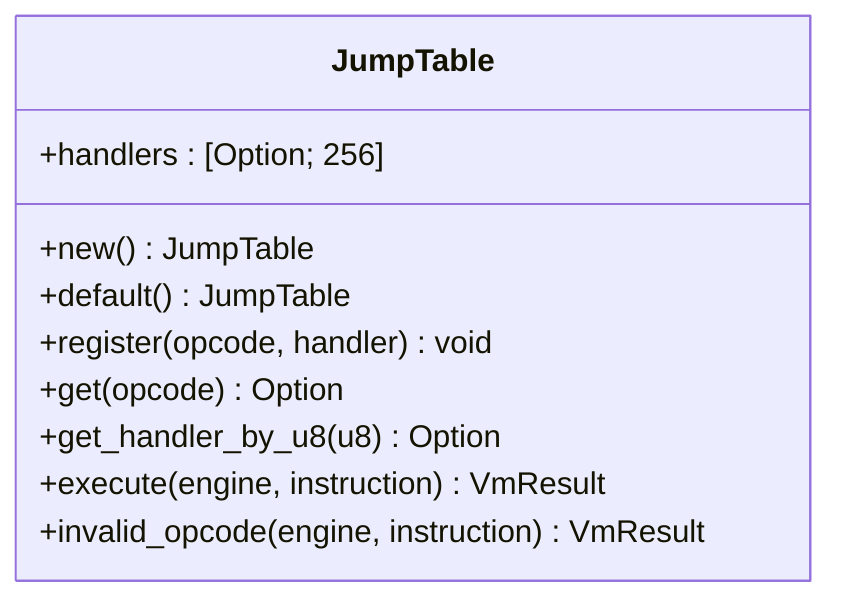
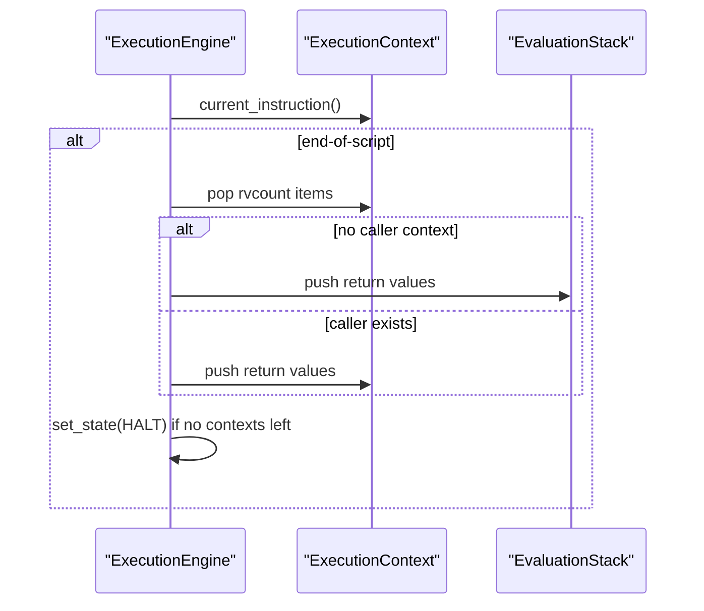
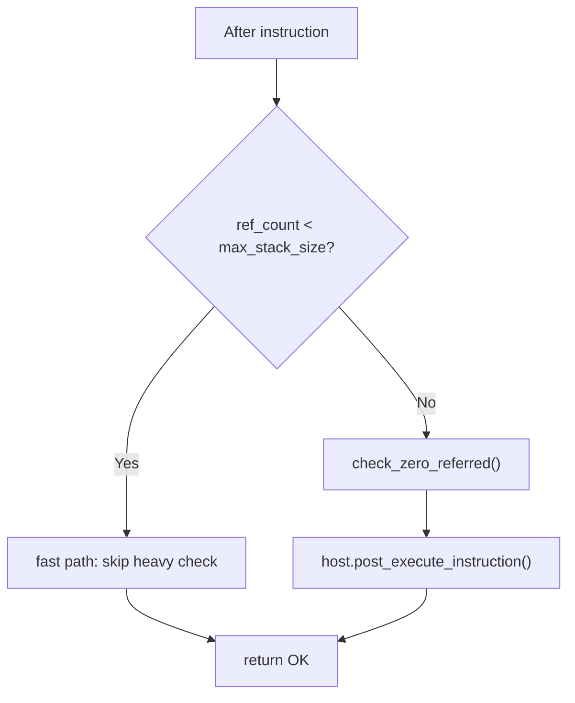
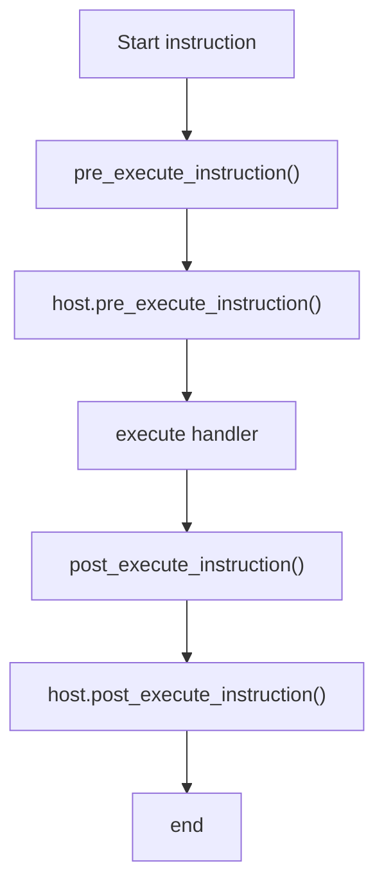
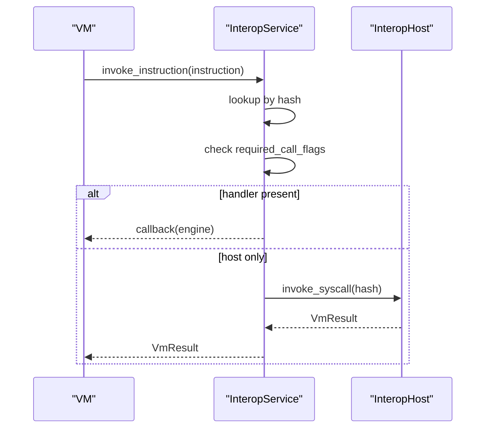
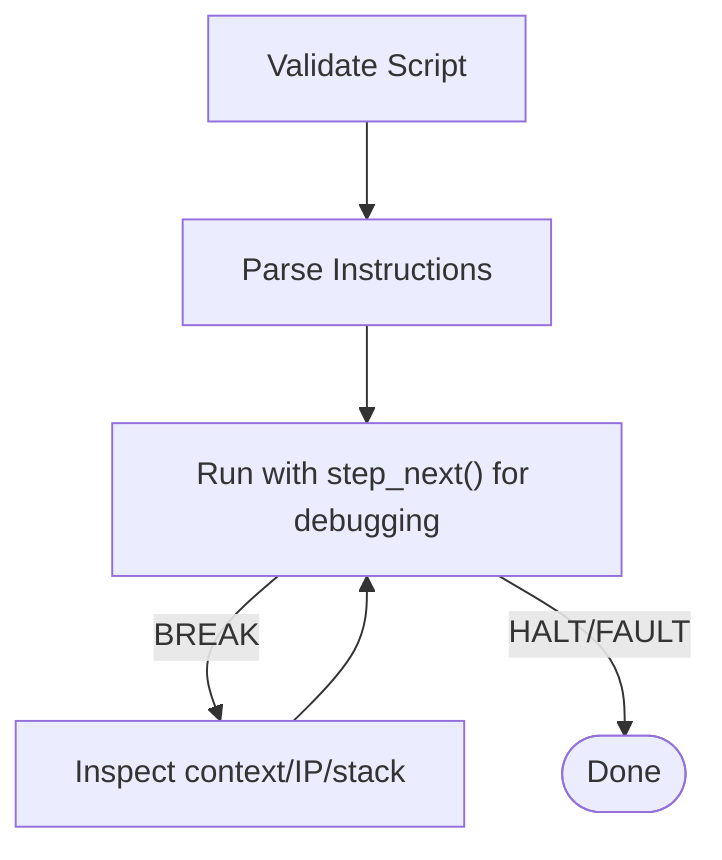
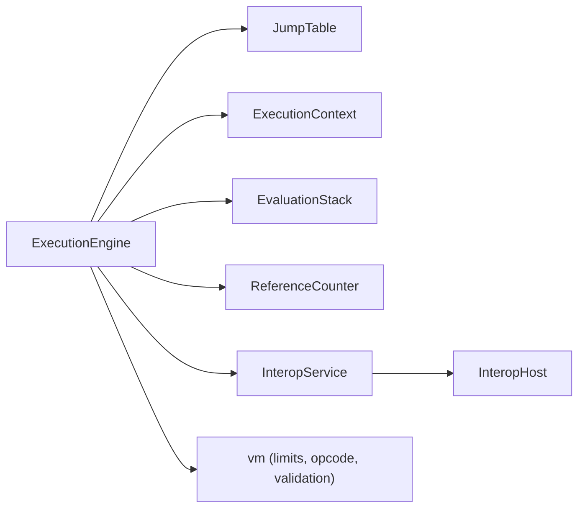

# Neo Virtual Machine

<cite>
**Referenced Files in This Document**
- [lib.rs](file://neo-vm/src/lib.rs)
- [mod.rs (execution_engine)](file://neo-vm/src/execution_engine/mod.rs)
- [core.rs (execution_engine)](file://neo-vm/src/execution_engine/core.rs)
- [execution.rs (execution_engine)](file://neo-vm/src/execution_engine/execution.rs)
- [mod.rs (jump_table)](file://neo-vm/src/jump_table/mod.rs)
- [limits.rs (vm)](file://neo-vm/src/vm/limits.rs)
- [mod.rs (vm)](file://neo-vm/src/vm/mod.rs)
- [interop_service.rs](file://neo-vm/src/interop_service.rs)
- [storage_context.rs](file://neo-vm/src/storage_context.rs)
- [error.rs](file://neo-vm/src/error.rs)
</cite>

## Table of Contents
1. [Introduction](#introduction)
2. [Project Structure](#project-structure)
3. [Core Components](#core-components)
4. [Architecture Overview](#architecture-overview)
5. [Detailed Component Analysis](#detailed-component-analysis)
6. [Dependency Analysis](#dependency-analysis)
7. [Performance Considerations](#performance-considerations)
8. [Troubleshooting Guide](#troubleshooting-guide)
9. [Conclusion](#conclusion)

## Introduction
This document explains the Neo Virtual Machine implementation in neo-rs, focusing on the execution engine, interpreter integration, jump table dispatch, opcode execution flow, stack and memory management, gas metering, smart contract environment with native interop, script validation, and debugging. It provides code-level diagrams and references to source files for traceability.

## Project Structure
The VM crate is self-contained and exposes a layered design:
- Core runtime types and state: ExecutionEngine, ExecutionContext, EvaluationStack, ReferenceCounter
- Instruction parsing and shared semantics: vm module (OpCode, limits, script validation)
- Dispatch layer: JumpTable mapping opcodes to handlers
- Interop boundary: InteropService and InteropHost for syscalls and host callbacks
- Storage context and serialization helpers

**Diagram sources**
- [mod.rs (execution_engine):196-242](file://neo-vm/src/execution_engine/mod.rs#L196-L242)
- [mod.rs (jump_table):34-44](file://neo-vm/src/jump_table/mod.rs#L34-L44)
- [mod.rs (vm):1-26](file://neo-vm/src/vm/mod.rs#L1-L26)
- [interop_service.rs:126-130](file://neo-vm/src/interop_service.rs#L126-L130)

**Section sources**
- [lib.rs:142-235](file://neo-vm/src/lib.rs#L142-L235)
- [mod.rs (execution_engine):1-77](file://neo-vm/src/execution_engine/mod.rs#L1-L77)

## Core Components
- ExecutionEngine: Central VM state machine; manages invocation stack, result stack, gas tracking, limits, and execution loop.
- ExecutionContext: Per-call frame holding instruction pointer, evaluation stack, locals, and return value count.
- EvaluationStack: Type-safe operand stack with reference counting support.
- JumpTable: Fixed-size array of handler function pointers for fast opcode dispatch.
- InteropService: Syscall registry and dispatcher; enforces required call flags and delegates to host when needed.
- VM Semantics: Opcode definitions, script parsing/validation, and execution limits.

Key responsibilities:
- Execution loop and state transitions (NONE/HALT/FAULT/BREAK)
- Instruction fetch-decode-execute via JumpTable
- Stack manipulation and implicit returns at end-of-script
- Gas accounting hooks through host callbacks
- Exception handling and uncaught exception storage

**Section sources**
- [mod.rs (execution_engine):196-242](file://neo-vm/src/execution_engine/mod.rs#L196-L242)
- [core.rs (execution_engine):11-45](file://neo-vm/src/execution_engine/core.rs#L11-L45)
- [execution.rs (execution_engine):8-23](file://neo-vm/src/execution_engine/execution.rs#L8-L23)
- [mod.rs (jump_table):34-44](file://neo-vm/src/jump_table/mod.rs#L34-L44)
- [interop_service.rs:18-35](file://neo-vm/src/interop_service.rs#L18-L35)
- [mod.rs (vm):11-25](file://neo-vm/src/vm/mod.rs#L11-L25)

## Architecture Overview
The VM follows an adapter-oriented architecture where canonical opcode metadata and ABI semantics are vendored/shared, while stateful execution lives in this crate. The execution engine drives the interpreter loop, uses a jump table for opcode dispatch, and integrates with a host via InteropHost for syscalls and lifecycle hooks.

**Diagram sources**
- [execution.rs (execution_engine):132-197](file://neo-vm/src/execution_engine/execution.rs#L132-L197)
- [mod.rs (jump_table):133-140](file://neo-vm/src/jump_table/mod.rs#L133-L140)
- [interop_service.rs:187-228](file://neo-vm/src/interop_service.rs#L187-L228)
- [mod.rs (execution_engine):159-185](file://neo-vm/src/execution_engine/mod.rs#L159-L185)

## Detailed Component Analysis

### Execution Engine and Interpreter Integration
- Main loop: execute() runs until HALT or FAULT, delegating per-instruction work to execute_next().
- Step mode: step_next() executes one instruction and sets BREAK for debuggers.
- Instruction execution:
  - Enforces max_instructions limit from ExecutionEngineLimits.
  - Fetches current instruction from ExecutionContext.
  - Calls pre/post host hooks.
  - Dispatches via JumpTable.get_handler_by_u8.
  - Handles catchable exceptions if configured.
  - Advances IP unless jumping.

**Diagram sources**
- [execution.rs (execution_engine):132-197](file://neo-vm/src/execution_engine/execution.rs#L132-L197)
- [limits.rs (vm):21-49](file://neo-vm/src/vm/limits.rs#L21-L49)

**Section sources**
- [execution.rs (execution_engine):8-23](file://neo-vm/src/execution_engine/execution.rs#L8-L23)
- [execution.rs (execution_engine):108-130](file://neo-vm/src/execution_engine/execution.rs#L108-L130)
- [execution.rs (execution_engine):132-197](file://neo-vm/src/execution_engine/execution.rs#L132-L197)
- [limits.rs (vm):21-49](file://neo-vm/src/vm/limits.rs#L21-L49)

### Jump Table Mechanism
- Fixed-size array of 256 entries for O(1) dispatch.
- Default initialization registers all built-in opcode handlers grouped by category (bitwisee, compound, control, numeric, push, slot, splice, stack, types).
- Provides safe get/set and execute methods; invalid opcodes produce unsupported operation errors.

**Diagram sources**
- [mod.rs (jump_table):34-44](file://neo-vm/src/jump_table/mod.rs#L34-L44)
- [mod.rs (jump_table):57-81](file://neo-vm/src/jump_table/mod.rs#L57-L81)
- [mod.rs (jump_table):133-152](file://neo-vm/src/jump_table/mod.rs#L133-L152)

**Section sources**
- [mod.rs (jump_table):57-182](file://neo-vm/src/jump_table/mod.rs#L57-L182)

### Opcode Execution Flow and Stack Manipulation
- Implicit return at end-of-script: pops rvcount items from eval stack and pushes to caller or result stack.
- Stack operations are performed via ExecutionContext/EvaluationStack APIs; overflow/underflow handled by error types.
- Jump table handlers manipulate stacks according to opcode semantics.

**Diagram sources**
- [execution.rs (execution_engine):43-96](file://neo-vm/src/execution_engine/execution.rs#L43-L96)

**Section sources**
- [execution.rs (execution_engine):43-96](file://neo-vm/src/execution_engine/execution.rs#L43-L96)

### Memory Management and Reference Counting
- ReferenceCounter tracks compound stack items to avoid GC pauses.
- Post-execution checks enforce stack size limits and run zero-referred cleanup when near limits.
- Max item sizes enforced by ExecutionEngineLimits.

**Diagram sources**
- [execution.rs (execution_engine):209-245](file://neo-vm/src/execution_engine/execution.rs#L209-L245)
- [limits.rs (vm):21-49](file://neo-vm/src/vm/limits.rs#L21-L49)

**Section sources**
- [execution.rs (execution_engine):209-245](file://neo-vm/src/execution_engine/execution.rs#L209-L245)
- [limits.rs (vm):21-49](file://neo-vm/src/vm/limits.rs#L21-L49)

### Gas Metering System
- Gas accounting hooks are provided via InteropHost.pre/post_execute_instruction and syscall invocation paths.
- ExecutionEngineLimits controls resource caps (max instructions, max item size, shift bounds).
- Errors include GasExhausted and InstructionLimitExceeded for resource enforcement.

**Diagram sources**
- [execution.rs (execution_engine):157-187](file://neo-vm/src/execution_engine/execution.rs#L157-L187)
- [limits.rs (vm):21-49](file://neo-vm/src/vm/limits.rs#L21-L49)
- [error.rs:197-222](file://neo-vm/src/error.rs#L197-L222)

**Section sources**
- [execution.rs (execution_engine):157-187](file://neo-vm/src/execution_engine/execution.rs#L157-L187)
- [limits.rs (vm):21-49](file://neo-vm/src/vm/limits.rs#L21-L49)
- [error.rs:197-222](file://neo-vm/src/error.rs#L197-L222)

### Smart Contract Execution Environment and Native Integration
- InteropService maps syscall names to descriptors with fixed price and required CallFlags.
- Syscalls can be implemented inside VM (InteropCallback) or delegated to host (InteropHost.invoke_syscall).
- StorageContext models per-contract read-only/read-write storage scopes with serialization compatibility.

**Diagram sources**
- [interop_service.rs:187-228](file://neo-vm/src/interop_service.rs#L187-L228)
- [interop_service.rs:58-124](file://neo-vm/src/interop_service.rs#L58-L124)

**Section sources**
- [interop_service.rs:18-35](file://neo-vm/src/interop_service.rs#L18-L35)
- [interop_service.rs:126-228](file://neo-vm/src/interop_service.rs#L126-L228)
- [storage_context.rs:6-119](file://neo-vm/src/storage_context.rs#L6-L119)

### Bytecode Compilation, Script Validation, and Debugging
- Script validation and parsing are exposed via vm module functions (parse_script_instructions, validate_script, validate_strict_script).
- Debugging: step_next() enables single-step execution; BREAK state used for breakpoints.
- Last interpreter state (IP, result limits) accessible via interpreter state accessors re-exported by lib.

**Diagram sources**
- [mod.rs (vm):11-25](file://neo-vm/src/vm/mod.rs#L11-L25)
- [execution.rs (execution_engine):108-130](file://neo-vm/src/execution_engine/execution.rs#L108-L130)
- [lib.rs:259-266](file://neo-vm/src/lib.rs#L259-L266)

**Section sources**
- [mod.rs (vm):11-25](file://neo-vm/src/vm/mod.rs#L11-L25)
- [execution.rs (execution_engine):108-130](file://neo-vm/src/execution_engine/execution.rs#L108-L130)
- [lib.rs:259-266](file://neo-vm/src/lib.rs#L259-L266)

## Dependency Analysis
- ExecutionEngine depends on:
  - JumpTable for opcode dispatch
  - ExecutionContext/EvaluationStack for per-frame state
  - ReferenceCounter for memory management
  - InteropService for syscall registration/dispatch
  - InteropHost for host-bound syscalls and lifecycle hooks
- VM module provides shared constants, limits, and script validation utilities consumed by execution and interop layers.

**Diagram sources**
- [mod.rs (execution_engine):196-242](file://neo-vm/src/execution_engine/mod.rs#L196-L242)
- [mod.rs (jump_table):34-44](file://neo-vm/src/jump_table/mod.rs#L34-L44)
- [interop_service.rs:126-130](file://neo-vm/src/interop_service.rs#L126-L130)
- [mod.rs (vm):11-25](file://neo-vm/src/vm/mod.rs#L11-L25)

**Section sources**
- [mod.rs (execution_engine):196-242](file://neo-vm/src/execution_engine/mod.rs#L196-L242)
- [interop_service.rs:126-228](file://neo-vm/src/interop_service.rs#L126-L228)
- [mod.rs (vm):11-25](file://neo-vm/src/vm/mod.rs#L11-L25)

## Performance Considerations
- Use JumpTable::get_handler_by_u8 for hot-path dispatch to minimize overhead.
- Avoid unnecessary clones of ExecutionContext; use engine.current_context() where possible.
- Configure ExecutionEngineLimits appropriately:
  - max_instructions for service-level budgets
  - max_item_size and max_comparable_size to bound memory usage
  - max_invocation_stack_size and max_try_nesting_depth to constrain recursion
- Prefer compact scripts and minimal stack churn; leverage implicit returns at end-of-script.
- Use step_next() for targeted profiling and debugging without full re-execution.

[No sources needed since this section provides general guidance]

## Troubleshooting Guide
Common issues and diagnostics:
- Stack underflow/overflow: Ensure correct number of operands before operations; inspect stack depth via ExecutionContext.
- Unsupported opcode: Verify script bytecode and ensure all opcodes are registered in JumpTable.
- Missing syscall handler: Register syscalls via InteropService or provide InteropHost implementation.
- Resource exhaustion: Increase gas_limit or tune ExecutionEngineLimits; monitor gas_consumed and instructions_executed.
- Uncaught exceptions: Check uncaught_exception and VMState; handle CatchableException flows during execution.

Useful entry points:
- Error categories and fault classification via VmError methods.
- Fault state transition via ExecutionEngine.on_fault/handle_exception.

**Section sources**
- [error.rs:44-334](file://neo-vm/src/error.rs#L44-L334)
- [error.rs:570-594](file://neo-vm/src/error.rs#L570-L594)
- [core.rs (execution_engine):67-93](file://neo-vm/src/execution_engine/core.rs#L67-L93)
- [core.rs (execution_engine):182-192](file://neo-vm/src/execution_engine/core.rs#L182-L192)

## Conclusion
The Neo VM in neo-rs implements a robust, high-performance execution engine with clear separation between shared semantics and stateful execution. The jump table ensures fast opcode dispatch, while InteropService and InteropHost provide flexible integration with native contracts and host services. ExecutionEngineLimits and gas hooks enforce resource safety, and comprehensive error handling supports reliable debugging and troubleshooting.

[No sources needed since this section summarizes without analyzing specific files]