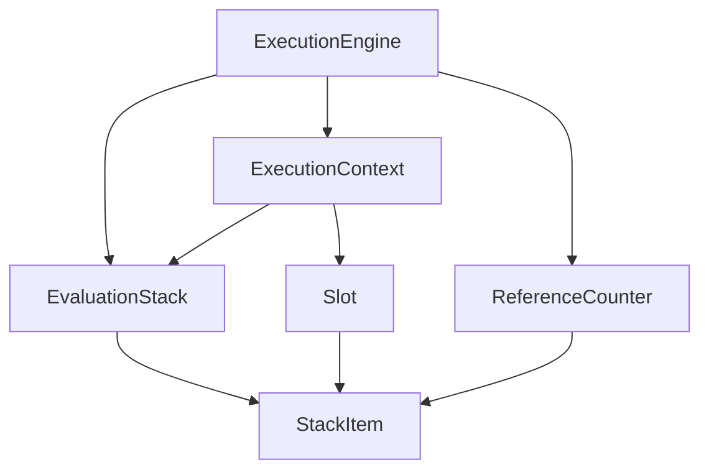
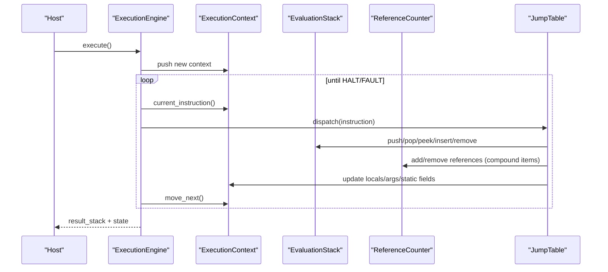
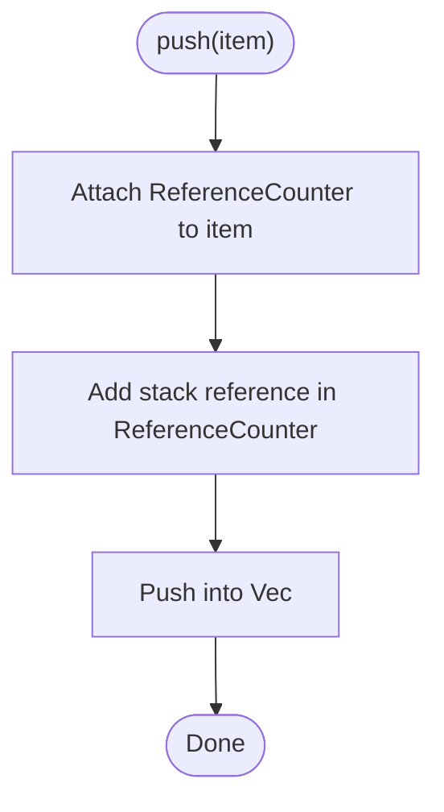
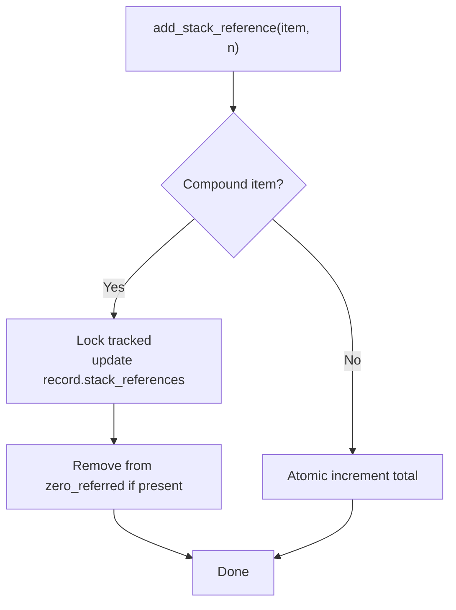
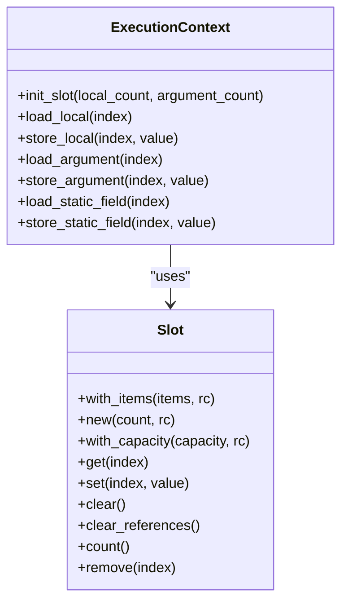
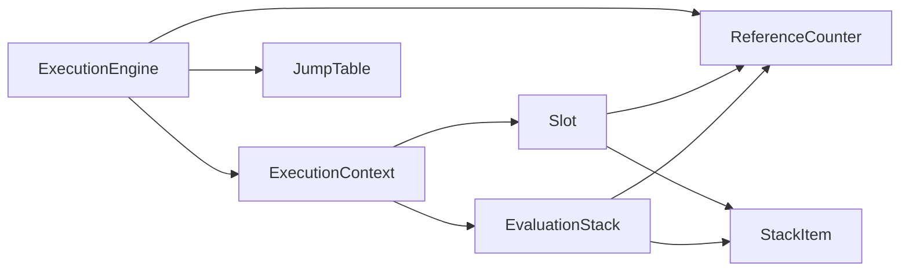

# Stack & Memory Management

<cite>
**Referenced Files in This Document**
- [lib.rs](file://neo-vm/src/lib.rs)
- [evaluation_stack.rs](file://neo-vm/src/evaluation_stack.rs)
- [reference_counter.rs](file://neo-vm/src/reference_counter.rs)
- [slot.rs](file://neo-vm/src/slot.rs)
- [stack_item.rs](file://neo-vm/src/stack_item/stack_item.rs)
- [context.rs](file://neo-vm/src/execution_context/context.rs)
- [mod.rs (execution_engine)](file://neo-vm/src/execution_engine/mod.rs)
</cite>

## Table of Contents
1. Introduction
2. Project Structure
3. Core Components
4. Architecture Overview
5. Detailed Component Analysis
6. Dependency Analysis
7. Performance Considerations
8. Troubleshooting Guide
9. Conclusion

## Introduction
This document explains the Neo VM stack and memory management systems implemented in the neo-vm crate. It covers the evaluation stack, type-safe operations, reference counting, automatic memory management, the slot system for locals/arguments/static fields, garbage collection via zero-referred components, allocation strategies, performance optimizations, safety guarantees, debugging tools, and practical patterns to avoid stack overflow or memory leaks.

## Project Structure
The relevant implementation is organized under the neo-vm crate:
- Evaluation stack: operand stack with push/pop/peek/insert/remove/reverse/copy/move
- Reference counter: global tracking of compound item references and GC of zero-referred cycles
- Slot: typed storage for local variables, arguments, and static fields
- StackItem: value types including primitives and compound types (Array, Struct, Map, Buffer)
- ExecutionContext: per-script call frame holding IP, stacks, slots, try context
- ExecutionEngine: orchestrates invocation stack, jump table, interop, limits, and GC hooks

**Diagram sources**
- [mod.rs (execution_engine):196-242](file://neo-vm/src/execution_engine/mod.rs#L196-L242)
- [evaluation_stack.rs:10-18](file://neo-vm/src/evaluation_stack.rs#L10-L18)
- [reference_counter.rs:21-46](file://neo-vm/src/reference_counter.rs#L21-L46)
- [stack_item.rs:66-98](file://neo-vm/src/stack_item/stack_item.rs#L66-L98)
- [slot.rs:18-25](file://neo-vm/src/slot.rs#L18-L25)
- [context.rs:27-45](file://neo-vm/src/execution_context/context.rs#L27-L45)

**Section sources**
- [lib.rs:146-218](file://neo-vm/src/lib.rs#L146-L218)
- [mod.rs (execution_engine):1-62](file://neo-vm/src/execution_engine/mod.rs#L1-L62)

## Core Components
- EvaluationStack: Type-safe stack with bounds-checked access, integrated reference counting on push/remove, and efficient copy/move between stacks.
- ReferenceCounter: Tracks total references and maintains a graph of parent-child relationships for compound items; supports cycle-aware collection of zero-referred components.
- Slot: Fixed-size storage for locals, arguments, and static fields with batched reference accounting and safe set/get semantics.
- StackItem: Value enum covering primitives and compound types; provides conversions, equality, hashing, deep copy, and reference attachment.
- ExecutionContext: Per-call frame with instruction pointer, shared states (script, evaluation stack, static fields), try-stack, and helpers to load/store locals/arguments/static fields.
- ExecutionEngine: Holds invocation stack, jump table, limits, interop service, result stack, and coordinates execution and GC.

**Section sources**
- [evaluation_stack.rs:10-232](file://neo-vm/src/evaluation_stack.rs#L10-L232)
- [reference_counter.rs:21-323](file://neo-vm/src/reference_counter.rs#L21-L323)
- [slot.rs:18-182](file://neo-vm/src/slot.rs#L18-L182)
- [stack_item.rs:66-196](file://neo-vm/src/stack_item/stack_item.rs#L66-L196)
- [context.rs:27-520](file://neo-vm/src/execution_context/context.rs#L27-L520)
- [mod.rs (execution_engine):196-242](file://neo-vm/src/execution_engine/mod.rs#L196-L242)

## Architecture Overview
The VM executes scripts by pushing contexts onto an invocation stack. Each context owns an evaluation stack and optional slots for locals/arguments/static fields. The engine dispatches opcodes through a jump table, which manipulates the evaluation stack and slots while updating the instruction pointer. Compound values are tracked by a shared ReferenceCounter that enables cycle-aware garbage collection when objects become zero-referred.

**Diagram sources**
- [mod.rs (execution_engine):1-62](file://neo-vm/src/execution_engine/mod.rs#L1-L62)
- [evaluation_stack.rs:52-191](file://neo-vm/src/evaluation_stack.rs#L52-L191)
- [reference_counter.rs:74-132](file://neo-vm/src/reference_counter.rs#L74-L132)
- [context.rs:281-300](file://neo-vm/src/execution_context/context.rs#L281-L300)

## Detailed Component Analysis

### Evaluation Stack
- Purpose: Operand stack for VM instructions with type-safe accessors and bounds checks.
- Key behaviors:
  - Push attaches the stack’s ReferenceCounter to compound items and increments their stack references.
  - Pop/remove decrement stack references before removing from storage.
  - Peek/peek_mut provide fast path bounds checking with unsafe indexing after validation.
  - Insert/swap/reverse support common stack manipulations with error handling.
  - copy_to/move_to transfer items between stacks, ensuring compatible ReferenceCounters and adjusting references correctly.
  - clear releases all stack references and empties storage.
- Safety: All mutating operations validate indices and adjust reference counts consistently to prevent leaks or double-frees.

**Diagram sources**
- [evaluation_stack.rs:52-59](file://neo-vm/src/evaluation_stack.rs#L52-L59)

**Section sources**
- [evaluation_stack.rs:10-232](file://neo-vm/src/evaluation_stack.rs#L10-L232)

### Reference Counter and Garbage Collection
- Purpose: Track references to compound stack items (Array, Struct, Map, Buffer) and collect unreachable cycles.
- Design highlights:
  - Global atomic counter for total references; mutex-protected map of tracked items and zero-referred set.
  - add_stack_reference/remove_stack_reference update both global count and per-item records.
  - add_reference/remove_reference manage parent-child edges for compound containment.
  - check_zero_referred runs Tarjan’s algorithm over tracked items to find strongly connected components that are zero-referred and removes them, updating external references and totals.
- Benefits:
  - Lock-free hot paths for primitive updates.
  - Cycle detection avoids leaks in circular structures.
  - Batched operations reduce lock contention.

**Diagram sources**
- [reference_counter.rs:74-112](file://neo-vm/src/reference_counter.rs#L74-L112)

**Section sources**
- [reference_counter.rs:21-323](file://neo-vm/src/reference_counter.rs#L21-L323)

### Slot System (Locals, Arguments, Static Fields)
- Purpose: Provide indexed storage for local variables, function arguments, and static fields within an execution context.
- Behaviors:
  - Construction pre-allocates capacity and batches Null references to minimize atomic updates.
  - set replaces old item, decrements its stack reference, then increments the new item’s stack reference.
  - clear and clear_references reset slots to Null and release references appropriately.
  - get/remove return items with proper reference adjustments.
- Integration: ExecutionContext initializes and manages Slot instances for locals and arguments; static fields are stored in a shared Slot accessible via shared states.

**Diagram sources**
- [slot.rs:27-182](file://neo-vm/src/slot.rs#L27-L182)
- [context.rs:415-519](file://neo-vm/src/execution_context/context.rs#L415-L519)

**Section sources**
- [slot.rs:18-182](file://neo-vm/src/slot.rs#L18-L182)
- [context.rs:415-519](file://neo-vm/src/execution_context/context.rs#L415-L519)

### StackItem Types and Semantics
- Covers primitives (Null, Boolean, Integer, ByteString, Buffer) and compound types (Array, Struct, Map), plus Pointer and InteropInterface.
- Provides:
  - Constructors for each type.
  - attach_reference_counter to bind compound items to the engine’s ReferenceCounter.
  - Conversions (as_int, as_bytes, convert_to) with strict type rules matching C# behavior.
  - Equality and hashing consistent with C# semantics, including reference equality for Buffer and type-strict comparisons for primitives.
  - Deep copy with limits to respect execution constraints.

**Section sources**
- [stack_item.rs:66-196](file://neo-vm/src/stack_item/stack_item.rs#L66-L196)
- [stack_item.rs:223-337](file://neo-vm/src/stack_item/stack_item.rs#L223-L337)
- [stack_item.rs:588-636](file://neo-vm/src/stack_item/stack_item.rs#L588-L636)
- [stack_item.rs:638-747](file://neo-vm/src/stack_item/stack_item.rs#L638-L747)

### ExecutionContext and Invocation Model
- Holds script, instruction pointer, rvcount, evaluation stack, slots, and try-stack.
- Manages:
  - Instruction advancement and fetching.
  - Local/argument/static field access via Slot.
  - Try context stack for exception handling.
  - Cloning semantics for CALL (shares script/evaluation stack/static fields, resets rvcount).
- Integrates with ExecutionEngine to form the invocation stack.

**Section sources**
- [context.rs:27-520](file://neo-vm/src/execution_context/context.rs#L27-L520)

### ExecutionEngine Coordination
- Maintains invocation stack, jump table, limits, interop service, result stack, gas counters, and uncaught exception.
- Drives the execution loop, invoking JumpTable handlers that manipulate stacks and slots, and coordinates GC via ReferenceCounter.

**Section sources**
- [mod.rs (execution_engine):196-242](file://neo-vm/src/execution_engine/mod.rs#L196-L242)

## Dependency Analysis
- EvaluationStack depends on ReferenceCounter and StackItem for memory safety.
- Slot depends on ReferenceCounter and StackItem for correct reference accounting.
- ExecutionContext composes EvaluationStack and Slot, and holds SharedStates for script and static fields.
- ExecutionEngine aggregates ExecutionContexts, JumpTable, ReferenceCounter, and InteropService.
- StackItem may contain compound types that depend on ReferenceCounter for lifecycle management.

**Diagram sources**
- [evaluation_stack.rs:10-18](file://neo-vm/src/evaluation_stack.rs#L10-L18)
- [slot.rs:18-25](file://neo-vm/src/slot.rs#L18-L25)
- [context.rs:27-45](file://neo-vm/src/execution_context/context.rs#L27-L45)
- [mod.rs (execution_engine):196-242](file://neo-vm/src/execution_engine/mod.rs#L196-L242)

**Section sources**
- [lib.rs:146-218](file://neo-vm/src/lib.rs#L146-L218)

## Performance Considerations
- Pre-allocation:
  - EvaluationStack uses a Vec with initial capacity to reduce reallocations.
  - Slot::with_capacity pre-reserves space and batches Null references.
- Atomic vs Mutex:
  - ReferenceCounter uses an atomic counter for total references to avoid locking in hot paths.
  - Compound tracking uses a mutex-protected map only when necessary.
- Efficient transfers:
  - move_to splits off the tail slice and drains it to target stack, minimizing copies.
  - copy_to validates compatibility once and clones items efficiently.
- Fast paths:
  - peek/peek_mut use early bounds checks and unsafe indexing after validation for speed.
- GC efficiency:
  - check_zero_referred processes only zero-referred candidates and uses Tarjan’s algorithm to remove entire unreachable components at once.

[No sources needed since this section provides general guidance]

## Troubleshooting Guide
Common issues and how to diagnose them:

- Stack underflow:
  - Symptom: Errors when popping or peeking beyond stack depth.
  - Check: Ensure opcodes consume expected operands; verify control flow does not skip pushes.
  - Relevant code: Bounds checks in EvaluationStack peek/pop/remove.

- Mismatched ReferenceCounters:
  - Symptom: Errors when copying/moving items between stacks with different counters.
  - Check: Ensure all compound items belong to the same engine’s ReferenceCounter; use attach_reference_counter on host-provided items.
  - Relevant code: ensure_reference_counter_compatible in EvaluationStack.

- Memory leaks:
  - Symptom: Growing reference count without release.
  - Check: Confirm every push has a corresponding pop/remove/clear; verify Slot.set releases old references; call check_zero_referred periodically to reclaim cycles.
  - Relevant code: ReferenceCounter add/remove methods and check_zero_referred.

- Stack overflow:
  - Symptom: Excessive nesting or large arrays/maps causing resource exhaustion.
  - Check: Enforce ExecutionEngineLimits; monitor max invocation depth and stack size; limit deep copies and map sizes.
  - Relevant code: Limits enforced during deep copy and other heavy operations.

- Incorrect equality/hashing:
  - Symptom: Unexpected behavior in maps or sets using StackItem keys.
  - Check: Use equals_with_limits and hash_code consistent with C# semantics; remember Buffer uses reference equality.
  - Relevant code: StackItem equality and hashing implementations.

**Section sources**
- [evaluation_stack.rs:61-129](file://neo-vm/src/evaluation_stack.rs#L61-L129)
- [evaluation_stack.rs:147-191](file://neo-vm/src/evaluation_stack.rs#L147-L191)
- [reference_counter.rs:134-269](file://neo-vm/src/reference_counter.rs#L134-L269)
- [stack_item.rs:638-747](file://neo-vm/src/stack_item/stack_item.rs#L638-L747)

## Conclusion
The Neo VM’s stack and memory management combine a type-safe evaluation stack, a robust slot system, and a cycle-aware reference counter to deliver deterministic, efficient execution. By adhering to the provided APIs—attaching reference counters, respecting bounds, and leveraging batched operations—you can write contracts that are both performant and free of memory leaks. For production workloads, monitor reference counts, enforce execution limits, and use the provided debugging techniques to identify and resolve stack or memory issues quickly.