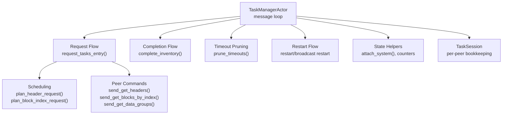
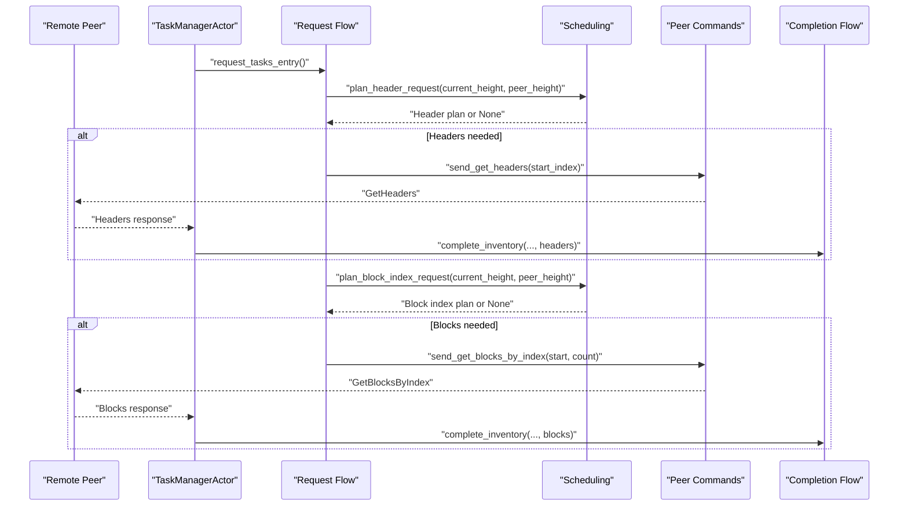
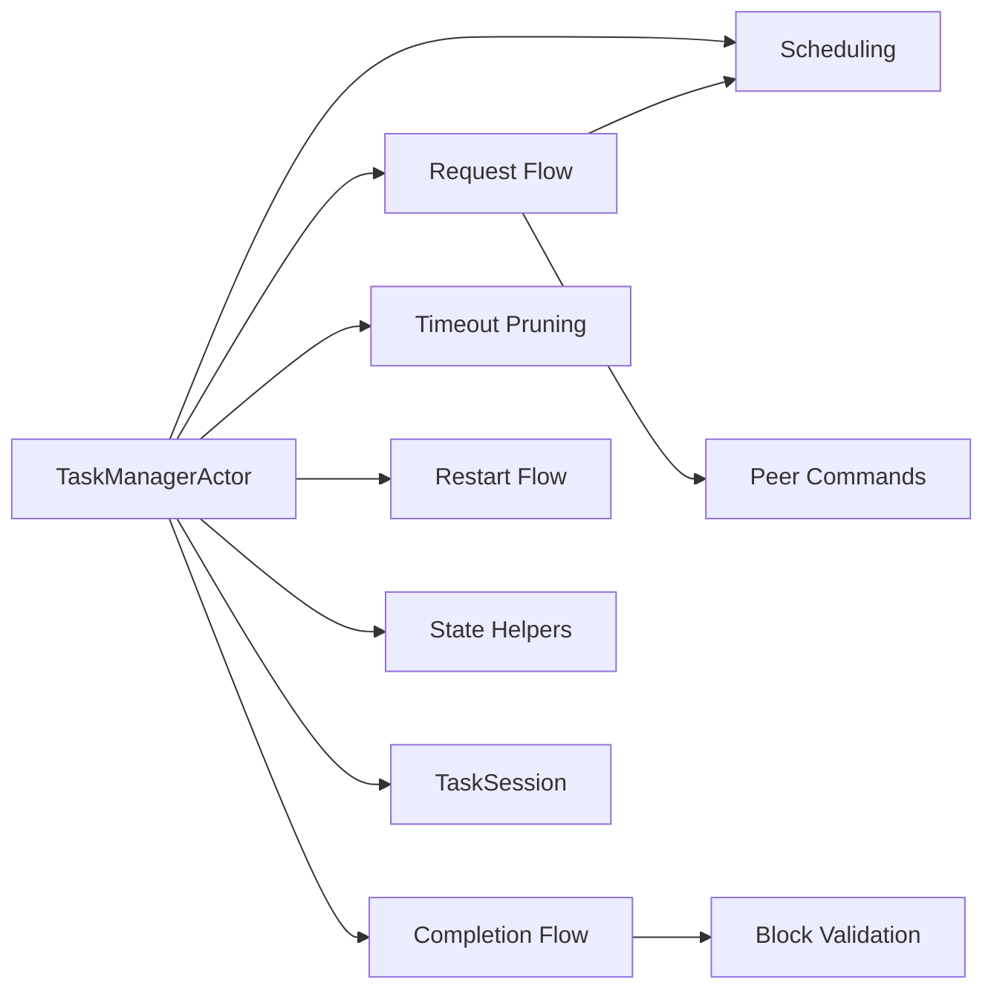
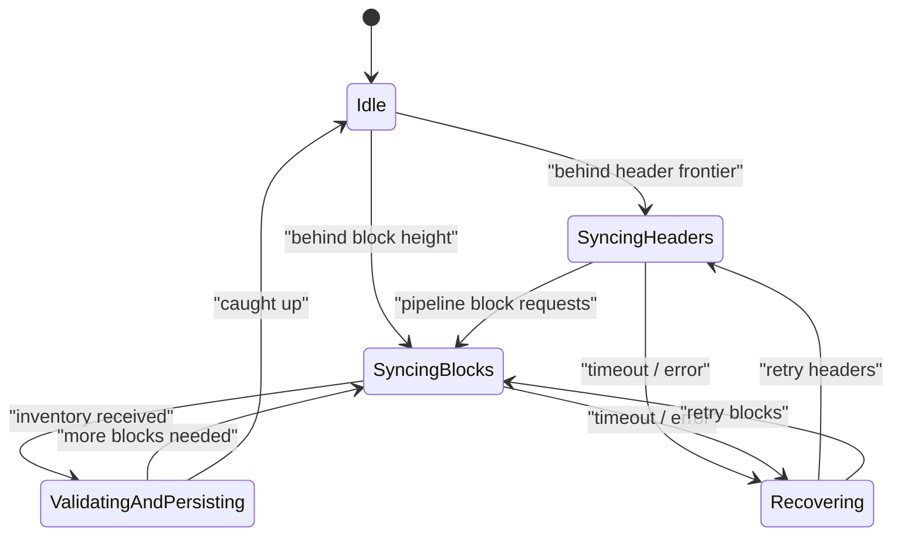

# Chain Synchronization

<cite>
**Referenced Files in This Document**
- [task_manager.rs](file://neo-core/src/network/p2p/task_manager.rs)
- [scheduling.rs](file://neo-core/src/network/p2p/task_manager/scheduling.rs)
- [request_flow.rs](file://neo-core/src/network/p2p/task_manager/request_flow.rs)
- [completion_flow.rs](file://neo-core/src/network/p2p/task_manager/completion_flow.rs)
- [timeout_pruning.rs](file://neo-core/src/network/p2p/task_manager/timeout_pruning.rs)
- [block_validation.rs](file://neo-core/src/network/p2p/task_manager/block_validation.rs)
- [restart_flow.rs](file://neo-core/src/network/p2p/task_manager/restart_flow.rs)
- [state.rs](file://neo-core/src/network/p2p/task_manager/state.rs)
- [session_lifecycle.rs](file://neo-core/src/network/p2p/task_manager/session_lifecycle.rs)
- [peer_commands.rs](file://neo-core/src/network/p2p/task_manager/peer_commands.rs)
- [task_session.rs](file://neo-core/src/network/p2p/task_session.rs)
- [inventory.rs](file://neo-core/src/network/p2p/payloads/inventory.rs)
- [inventory.rs](file://neo-primitives/src/inventory.rs)
</cite>

## Table of Contents
1. [Introduction](#introduction)
2. [Project Structure](#project-structure)
3. [Core Components](#core-components)
4. [Architecture Overview](#architecture-overview)
5. [Detailed Component Analysis](#detailed-component-analysis)
6. [Dependency Analysis](#dependency-analysis)
7. [Performance Considerations](#performance-considerations)
8. [Troubleshooting Guide](#troubleshooting-guide)
9. [Conclusion](#conclusion)
10. [Appendices](#appendices)

## Introduction
This document explains chain synchronization in Neo-RS P2P networking with a focus on how nodes discover, request, and persist blocks and transactions from peers. It covers header-first synchronization, fast sync modes that pipeline block index requests alongside header fetches, checkpoint-based synchronization concepts, inventory propagation and request mechanisms, the task manager architecture for coordinating multiple tasks and concurrent downloads, synchronization state management, progress tracking, error recovery, configuration options, performance tuning, monitoring, and guidance for implementing custom strategies and debugging sync issues.

## Project Structure
The synchronization logic is implemented primarily under the P2P subsystem as an actor-driven task manager. The main components are:
- Task manager actor and its message handling
- Per-peer session state
- Scheduling and planning helpers for headers and block indexes
- Request flow that dispatches GetHeaders, GetBlocksByIndex, and GetDataGroup messages
- Completion flow for inventory results and persistence callbacks
- Timeout pruning and restart flows for resilience
- Block validation helpers to ensure consistency between hashes and payloads

**Diagram sources**
- [task_manager.rs:147-260](file://neo-core/src/network/p2p/task_manager.rs#L147-L260)
- [request_flow.rs:16-196](file://neo-core/src/network/p2p/task_manager/request_flow.rs#L16-L196)
- [scheduling.rs:85-149](file://neo-core/src/network/p2p/task_manager/scheduling.rs#L85-L149)
- [peer_commands.rs:1-200](file://neo-core/src/network/p2p/task_manager/peer_commands.rs#L1-L200)
- [task_session.rs:23-179](file://neo-core/src/network/p2p/task_session.rs#L23-L179)

**Section sources**
- [task_manager.rs:1-135](file://neo-core/src/network/p2p/task_manager.rs#L1-L135)
- [task_session.rs:1-179](file://neo-core/src/network/p2p/task_session.rs#L1-L179)

## Core Components
- TaskManagerActor: Central actor that owns synchronization state, schedules periodic housekeeping, and routes messages to handlers for registration, updates, new tasks, completion, and timeouts.
- TaskSession: Per-peer state tracking in-flight inventory and index tasks, received blocks awaiting persistence, last known peer height, and header request throttling.
- Scheduling: Pure functions that compute next header or block index requests, respecting global concurrency limits and windowing constraints.
- Request Flow: Orchestrates which work to issue next (headers vs blocks by index vs available inventory), sends network requests, and retries when needed.
- Completion Flow: Processes incoming inventory responses, validates, persists, and updates global and per-session counters.
- Timeout Pruning: Periodically prunes stale in-flight tasks to recover from slow or unresponsive peers.
- Restart Flow: Reissues requests after failures or timeouts, including broadcast restart across peers.
- State Helpers: Global counters for concurrent tasks, known hash cache, and system integration via event streams.

**Section sources**
- [task_manager.rs:101-135](file://neo-core/src/network/p2p/task_manager.rs#L101-L135)
- [task_session.rs:23-179](file://neo-core/src/network/p2p/task_session.rs#L23-L179)
- [scheduling.rs:6-149](file://neo-core/src/network/p2p/task_manager/scheduling.rs#L6-L149)
- [request_flow.rs:16-316](file://neo-core/src/network/p2p/task_manager/request_flow.rs#L16-L316)
- [completion_flow.rs:1-200](file://neo-core/src/network/p2p/task_manager/completion_flow.rs#L1-L200)
- [timeout_pruning.rs:1-200](file://neo-core/src/network/p2p/task_manager/timeout_pruning.rs#L1-L200)
- [restart_flow.rs:1-200](file://neo-core/src/network/p2p/task_manager/restart_flow.rs#L1-L200)
- [state.rs:9-45](file://neo-core/src/network/p2p/task_manager/state.rs#L9-L45)

## Architecture Overview
The synchronization architecture uses an actor model to coordinate multiple peers and tasks concurrently while preventing resource exhaustion. Key design points:
- Header-first sync: When behind the ledger’s highest header, the manager requests headers to advance the header frontier quickly.
- Fast sync mode: While headers are being fetched, block index requests are pipelined to download full blocks in parallel, avoiding starvation.
- Checkpoint-based sync: Nodes can bootstrap from trusted checkpoints; once caught up to a checkpoint height, they continue syncing from there.
- Inventory propagation: Peers announce inventories; the manager deduplicates, avoids re-requesting known items, and coordinates sharing among peers.
- Concurrency control: Global counters limit concurrent tasks per inventory hash and per block index to prevent overload.
- Resilience: Timeouts prune stalled tasks; restart flows reissue requests; completion flow integrates with persistence events.

**Diagram sources**
- [request_flow.rs:16-196](file://neo-core/src/network/p2p/task_manager/request_flow.rs#L16-L196)
- [scheduling.rs:85-149](file://neo-core/src/network/p2p/task_manager/scheduling.rs#L85-L149)
- [peer_commands.rs:1-200](file://neo-core/src/network/p2p/task_manager/peer_commands.rs#L1-L200)
- [completion_flow.rs:1-200](file://neo-core/src/network/p2p/task_manager/completion_flow.rs#L1-L200)

## Detailed Component Analysis

### Task Manager Actor and Message Handling
The actor encapsulates synchronization state and processes commands such as attaching system context, registering peers, updating peer heights, scheduling new tasks, restarting tasks, completing inventory, triggering headers sync, and forgetting hashes. A periodic timer triggers timeout pruning.

Key behaviors:
- Attaches to system context and subscribes to persistence and relay result events.
- Maintains per-peer sessions and global task counters.
- Routes messages to specialized modules for request planning, completion, and cleanup.

**Section sources**
- [task_manager.rs:147-260](file://neo-core/src/network/p2p/task_manager.rs#L147-L260)
- [task_manager.rs:301-363](file://neo-core/src/network/p2p/task_manager.rs#L301-L363)

### Per-Peer Session State
Each peer has a TaskSession that tracks:
- In-flight inventory tasks and index tasks with timestamps
- Available tasks discovered from other peers
- Received blocks pending persistence
- Whether the peer advertised full-node capability and its last known block index
- Header request throttling to avoid flooding peers

It exposes methods to register, complete, and prune tasks, and to decide whether to retry header requests.

**Section sources**
- [task_session.rs:23-179](file://neo-core/src/network/p2p/task_session.rs#L23-L179)

### Scheduling and Planning
Scheduling provides pure decision functions:
- Block index request planning: Computes start height and count within a bounded window, skipping already tracked indices.
- Header request planning: Determines if a header range should be requested based on current header height, peer height, concurrency limits, and retry policy.
- Available inventory planning: Filters stale hashes and schedules those with capacity.

Concurrency is enforced via TaskCounter, limiting concurrent tasks per key.

**Section sources**
- [scheduling.rs:6-149](file://neo-core/src/network/p2p/task_manager/scheduling.rs#L6-L149)

### Request Flow
The request flow decides what to ask peers for next:
- Prioritizes available inventory tasks announced by peers
- Requests headers when behind the header frontier
- Pipelines block index requests even during header sync to accelerate fast sync
- Sends mempool snapshot requests once per peer
- Handles errors by decrementing counters and marking tasks incomplete

It interacts with the ledger and header cache to determine current heights and uses peer commands to send network messages.

**Section sources**
- [request_flow.rs:16-316](file://neo-core/src/network/p2p/task_manager/request_flow.rs#L16-L316)

### Completion Flow
When inventory arrives:
- Validates payload against expected hash
- Persists blocks or transactions through the ledger
- Updates global and per-session counters
- Triggers further task scheduling based on persistence outcomes
- Integrates with PersistCompleted events to resume downstream work

**Section sources**
- [completion_flow.rs:1-200](file://neo-core/src/network/p2p/task_manager/completion_flow.rs#L1-L200)

### Timeout Pruning and Restart Flow
- Timeout pruning removes expired in-flight tasks periodically to free resources and allow reissuing requests.
- Restart flow reissues requests to specific peers or broadcasts restarts across all peers when necessary.

These mechanisms improve robustness under network instability and slow peers.

**Section sources**
- [timeout_pruning.rs:1-200](file://neo-core/src/network/p2p/task_manager/timeout_pruning.rs#L1-L200)
- [restart_flow.rs:1-200](file://neo-core/src/network/p2p/task_manager/restart_flow.rs#L1-L200)

### Block Validation
Ensures consistency between requested hashes and received payloads before acceptance, preventing invalid data from entering the ledger.

**Section sources**
- [block_validation.rs:1-200](file://neo-core/src/network/p2p/task_manager/block_validation.rs#L1-L200)

### State Helpers and System Integration
- Attaches to system context, subscribes to events, and configures known hash cache capacity based on memory pool.
- Provides global counters for concurrent tasks and utilities to forget or check known hashes.

**Section sources**
- [state.rs:9-45](file://neo-core/src/network/p2p/task_manager/state.rs#L9-L45)

### Peer Commands
Encapsulates sending GetHeaders, GetBlocksByIndex, and GetDataGroup messages to peers, centralizing error handling and logging.

**Section sources**
- [peer_commands.rs:1-200](file://neo-core/src/network/p2p/task_manager/peer_commands.rs#L1-L200)

### Inventory Types and Traits
Inventory types and traits define relatable items (blocks, transactions, extensible payloads) and their identification for P2P routing.

**Section sources**
- [inventory.rs:1-20](file://neo-core/src/network/p2p/payloads/inventory.rs#L1-L20)
- [inventory.rs:1-28](file://neo-primitives/src/inventory.rs#L1-L28)

## Dependency Analysis
The synchronization stack composes several modules with clear boundaries:
- TaskManagerActor depends on scheduling, request flow, completion flow, timeout pruning, restart flow, state helpers, and peer commands.
- Request flow depends on scheduling and peer commands, and reads from system context (ledger, header cache).
- Completion flow depends on persistence events and block validation.
- TaskSession is used by request flow and completion flow to track per-peer state.

**Diagram sources**
- [task_manager.rs:147-260](file://neo-core/src/network/p2p/task_manager.rs#L147-L260)
- [request_flow.rs:16-316](file://neo-core/src/network/p2p/task_manager/request_flow.rs#L16-L316)
- [completion_flow.rs:1-200](file://neo-core/src/network/p2p/task_manager/completion_flow.rs#L1-L200)
- [timeout_pruning.rs:1-200](file://neo-core/src/network/p2p/task_manager/timeout_pruning.rs#L1-L200)
- [restart_flow.rs:1-200](file://neo-core/src/network/p2p/task_manager/restart_flow.rs#L1-L200)
- [state.rs:9-45](file://neo-core/src/network/p2p/task_manager/state.rs#L9-L45)
- [peer_commands.rs:1-200](file://neo-core/src/network/p2p/task_manager/peer_commands.rs#L1-L200)
- [task_session.rs:23-179](file://neo-core/src/network/p2p/task_session.rs#L23-L179)

**Section sources**
- [task_manager.rs:147-260](file://neo-core/src/network/p2p/task_manager.rs#L147-L260)
- [request_flow.rs:16-316](file://neo-core/src/network/p2p/task_manager/request_flow.rs#L16-L316)

## Performance Considerations
- Concurrency limits: MAX_CONCURRENT_TASKS caps concurrent tasks per inventory hash to prevent overload.
- Batch sizing: MAX_BLOCK_INDEX_BATCH controls the number of sequential block heights requested per round to reduce head-of-line blocking.
- Windowing: BLOCK_INDEX_WINDOW_MULTIPLIER defines how many batch windows remain in flight globally, enabling parallel downloads across peers without overloading any single peer.
- Pending task cap: TaskSession::MAX_PENDING_TASKS bounds per-peer outstanding tasks to protect memory and CPU.
- Header throttling: Last header request tracking prevents repeated identical GetHeaders requests until retry_after elapses.
- Pipeline overlap: Header and block index requests are issued concurrently to speed up fast sync.

Tuning recommendations:
- Increase MAX_BLOCK_INDEX_BATCH cautiously to improve throughput on high-latency networks.
- Adjust BLOCK_INDEX_WINDOW_MULTIPLIER to balance parallelism and peer fairness.
- Monitor TaskSession::MAX_PENDING_TASKS to avoid memory pressure under heavy load.
- Tune retry_after for header requests based on observed processing times.

[No sources needed since this section provides general guidance]

## Troubleshooting Guide
Common issues and diagnostics:
- Stalled sync due to slow peers: Use timeout pruning to detect and remove expired tasks; verify timers are scheduled and intervals configured correctly.
- Duplicate requests: Ensure known hash cache is sized appropriately and that ForgetHash is invoked on failed pre-acceptance processing.
- Starvation of block sync during header sync: Confirm that request flow pipelines block index requests alongside header fetches.
- Excessive memory usage: Check per-peer pending tasks and global counters; adjust MAX_PENDING_TASKS and concurrency limits.
- Missing mempool sync: Verify mempool_sent flag and that send_mempool is called once per peer.

Debugging steps:
- Inspect logs around request_tasks_entry, send_get_headers, send_get_blocks_by_index, and complete_inventory.
- Review TaskSession fields for stuck tasks and last header request timestamps.
- Validate that PersistCompleted events are subscribed and processed.
- Use restart flows to reissue requests when peers fail to respond.

**Section sources**
- [task_manager.rs:182-200](file://neo-core/src/network/p2p/task_manager.rs#L182-L200)
- [task_session.rs:117-179](file://neo-core/src/network/p2p/task_session.rs#L117-L179)
- [request_flow.rs:124-196](file://neo-core/src/network/p2p/task_manager/request_flow.rs#L124-L196)
- [completion_flow.rs:1-200](file://neo-core/src/network/p2p/task_manager/completion_flow.rs#L1-L200)
- [timeout_pruning.rs:1-200](file://neo-core/src/network/p2p/task_manager/timeout_pruning.rs#L1-L200)
- [restart_flow.rs:1-200](file://neo-core/src/network/p2p/task_manager/restart_flow.rs#L1-L200)

## Conclusion
Neo-RS implements a robust, actor-based chain synchronization mechanism that supports header-first sync, fast sync with pipelined block downloads, and checkpoint-based bootstrapping. The task manager coordinates multiple peers and tasks with strict concurrency controls, resilient timeout handling, and careful state management. By tuning batch sizes, window multipliers, and pending task limits, operators can optimize performance for diverse network conditions. Monitoring and debugging tools built into the task manager enable effective troubleshooting of sync issues.

[No sources needed since this section summarizes without analyzing specific files]

## Appendices

### Synchronization State Machine
Conceptual states for synchronization:
- Idle: No active sync tasks
- SyncingHeaders: Requesting headers to advance header frontier
- SyncingBlocks: Requesting blocks by index to catch up
- ValidatingAndPersisting: Processing and persisting received inventory
- Recovering: Restarting or pruning tasks after timeouts

[No sources needed since this diagram shows conceptual workflow, not actual code structure]

### Configuration Options and Tuning Parameters
- Timer interval: Controls periodic housekeeping frequency for timeout pruning.
- Task timeout: Duration after which in-flight tasks are considered expired.
- Max concurrent tasks: Limits shared workload per inventory hash.
- Max block index batch: Number of sequential heights requested per round.
- Block index window multiplier: Number of batch windows kept in flight globally.
- Pending task cap: Upper bound on per-peer outstanding tasks.

These parameters influence throughput, latency, and resource usage during synchronization.

**Section sources**
- [task_manager.rs:59-78](file://neo-core/src/network/p2p/task_manager.rs#L59-L78)
- [task_session.rs:45-82](file://neo-core/src/network/p2p/task_session.rs#L45-L82)

### Custom Synchronization Strategies
To implement custom strategies:
- Extend scheduling plans to incorporate domain-specific heuristics (e.g., prefer certain peers or ranges).
- Hook into request flow to add preconditions or postconditions for task issuance.
- Integrate with completion flow to handle custom inventory types or validation rules.
- Use restart flow to trigger custom recovery actions on failures.
- Leverage peer commands to send custom messages or adapt existing ones.

Ensure concurrency controls and timeout pruning remain consistent with your strategy to avoid resource exhaustion.

**Section sources**
- [scheduling.rs:85-149](file://neo-core/src/network/p2p/task_manager/scheduling.rs#L85-L149)
- [request_flow.rs:16-316](file://neo-core/src/network/p2p/task_manager/request_flow.rs#L16-L316)
- [completion_flow.rs:1-200](file://neo-core/src/network/p2p/task_manager/completion_flow.rs#L1-L200)
- [restart_flow.rs:1-200](file://neo-core/src/network/p2p/task_manager/restart_flow.rs#L1-L200)
- [peer_commands.rs:1-200](file://neo-core/src/network/p2p/task_manager/peer_commands.rs#L1-L200)