# Connection Management

<cite>
**Referenced Files in This Document**
- [neo-p2p/src/lib.rs](file://neo-p2p/src/lib.rs)
- [neo-p2p/src/timeouts.rs](file://neo-p2p/src/timeouts.rs)
- [neo-core/src/network/mod.rs](file://neo-core/src/network/mod.rs)
- [neo-core/src/network/p2p/mod.rs](file://neo-core/src/network/p2p/mod.rs)
- [neo-core/src/network/p2p/local_node/mod.rs](file://neo-core/src/network/p2p/local_node/mod.rs)
- [neo-core/src/network/p2p/peer.rs](file://neo-core/src/network/p2p/peer.rs)
- [neo-core/src/network/p2p/remote_node/handshake.rs](file://neo-core/src/network/p2p/remote_node/handshake.rs)
</cite>

## Table of Contents
1. Introduction
2. Project Structure
3. Core Components
4. Architecture Overview
5. Detailed Component Analysis
6. Dependency Analysis
7. Performance Considerations
8. Troubleshooting Guide
9. Conclusion
10. Appendices

## Introduction
This document explains P2P connection management in Neo-RS, focusing on peer discovery, address book management, peer selection and connection pooling, the full connection lifecycle (handshake to established), validation and capability negotiation, timeouts, reputation and scoring, per-IP connection limits, bandwidth throttling, remote node abstraction, state management, error recovery, and practical guidance for custom discovery implementations, configuration options, and troubleshooting connectivity issues such as firewall problems and NAT traversal.

## Project Structure
Neo’s P2P layer is split into a lightweight protocol crate and a runtime-enabled implementation:
- neo-p2p: Protocol types, message framing, traits, and shared timeout counters used by consumers without the full stack.
- neo-core::network::p2p: Full networking stack including LocalNode actor, PeerState, RemoteNode handshake, task/session management, and rate limiting/reputation utilities.

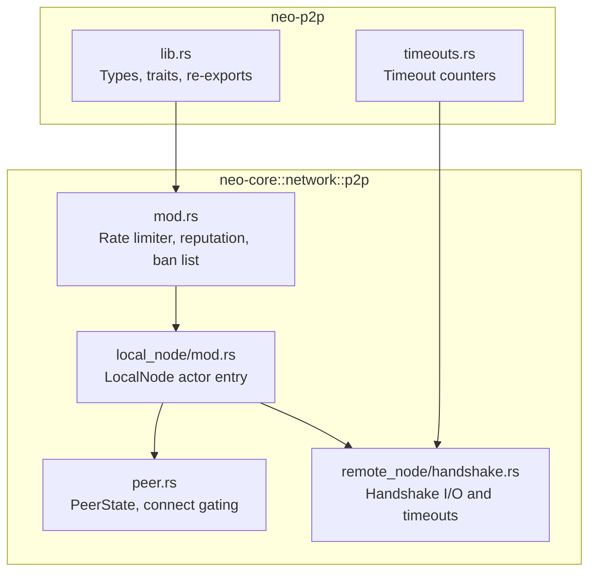

**Diagram sources**
- [neo-p2p/src/lib.rs:169-252](file://neo-p2p/src/lib.rs#L169-L252)
- [neo-p2p/src/timeouts.rs:1-57](file://neo-p2p/src/timeouts.rs#L1-L57)
- [neo-core/src/network/p2p/mod.rs:94-204](file://neo-core/src/network/p2p/mod.rs#L94-L204)
- [neo-core/src/network/p2p/local_node/mod.rs:1-117](file://neo-core/src/network/p2p/local_node/mod.rs#L1-L117)
- [neo-core/src/network/p2p/peer.rs:518-574](file://neo-core/src/network/p2p/peer.rs#L518-L574)
- [neo-core/src/network/p2p/remote_node/handshake.rs:133-148](file://neo-core/src/network/p2p/remote_node/handshake.rs#L133-L148)

**Section sources**
- [neo-p2p/src/lib.rs:169-252](file://neo-p2p/src/lib.rs#L169-L252)
- [neo-core/src/network/mod.rs:1-21](file://neo-core/src/network/mod.rs#L1-L21)
- [neo-core/src/network/p2p/mod.rs:94-204](file://neo-core/src/network/p2p/mod.rs#L94-L204)

## Core Components
- LocalNode actor: Orchestrates inbound listener, outbound connections, peer registry, broadcast history, seed list, capabilities, and pending connects. It exposes commands to configure channels, add unconnected peers, and manage lifecycle.
- PeerState: Tracks connected peers, connecting set, per-IP counts, endpoint normalization, and safety checks before initiating connections.
- RemoteNode handshake: Manages Version exchange, read/write timeouts, and transitions from connecting to established session.
- Rate limiter and reputation: Inbound connection rate limiting via token bucket; reputation tracking with configurable thresholds and ban list for misbehaving peers.
- Timeouts: Shared atomic counters for handshake/read/write timeouts with logging support.

Key responsibilities:
- Address book and peer discovery integration via LocalNode commands and snapshot registration.
- Connection pooling through configured min/max desired connections and per-IP caps.
- Validation and capability negotiation during handshake.
- Error recovery via timers, retries, and reputation-driven actions.

**Section sources**
- [neo-core/src/network/p2p/local_node/mod.rs:1-117](file://neo-core/src/network/p2p/local_node/mod.rs#L1-L117)
- [neo-core/src/network/p2p/peer.rs:518-574](file://neo-core/src/network/p2p/peer.rs#L518-L574)
- [neo-core/src/network/p2p/remote_node/handshake.rs:133-148](file://neo-core/src/network/p2p/remote_node/handshake.rs#L133-L148)
- [neo-core/src/network/p2p/mod.rs:94-204](file://neo-core/src/network/p2p/mod.rs#L94-L204)
- [neo-p2p/src/timeouts.rs:1-57](file://neo-p2p/src/timeouts.rs#L1-L57)

## Architecture Overview
The P2P architecture centers around an actor-based LocalNode that coordinates TCP listeners, outbound connectors, and RemoteNode sessions. PeerState enforces connection policies and capacity. The handshake process validates endpoints, negotiates capabilities, and applies reputation and bans.

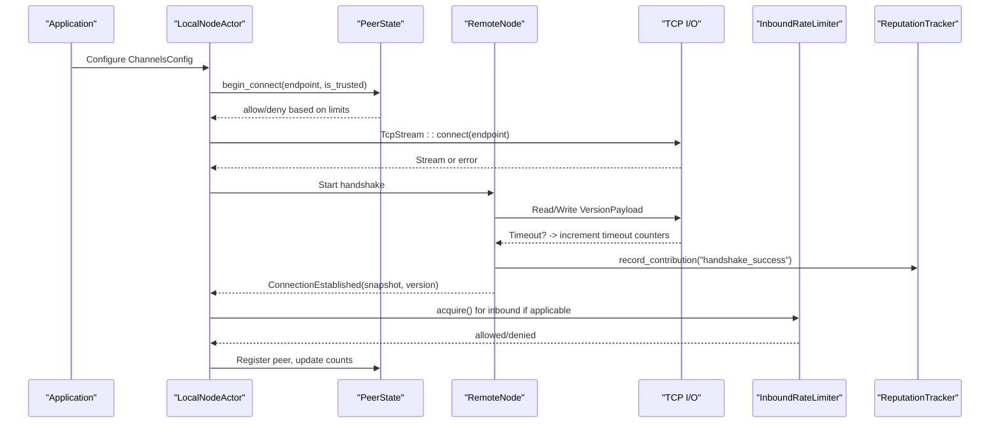

**Diagram sources**
- [neo-core/src/network/p2p/local_node/mod.rs:1-117](file://neo-core/src/network/p2p/local_node/mod.rs#L1-L117)
- [neo-core/src/network/p2p/peer.rs:518-574](file://neo-core/src/network/p2p/peer.rs#L518-L574)
- [neo-core/src/network/p2p/remote_node/handshake.rs:133-148](file://neo-core/src/network/p2p/remote_node/handshake.rs#L133-L148)
- [neo-core/src/network/p2p/mod.rs:131-204](file://neo-core/src/network/p2p/mod.rs#L131-L204)
- [neo-p2p/src/timeouts.rs:1-57](file://neo-p2p/src/timeouts.rs#L1-L57)

## Detailed Component Analysis

### Peer Discovery and Address Book Management
- Address book population occurs when RemoteNode snapshots are registered with LocalNode. Only peers advertising the TCP server capability are considered for address book inclusion.
- Tests demonstrate that peers without TCP server capability are ignored and that grouping by IP uses the version timestamp for deduplication.
- Unconnected peer queues can be populated via LocalNode commands; the timer loop attempts connections respecting configured limits and rejection rules.

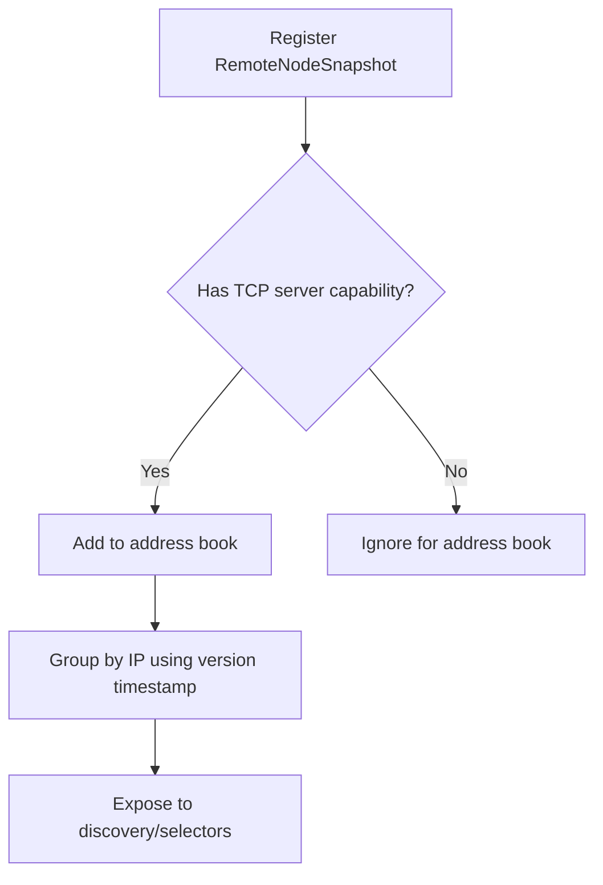

**Diagram sources**
- [neo-core/src/network/p2p/local_node/mod.rs:1-117](file://neo-core/src/network/p2p/local_node/mod.rs#L1-L117)

**Section sources**
- [neo-core/tests/local_node_relay_tests.rs:174-211](file://neo-core/tests/local_node_relay_tests.rs#L174-L211)
- [neo-core/tests/local_node_relay_tests.rs:452-472](file://neo-core/tests/local_node_relay_tests.rs#L452-L472)

### Peer Selection Algorithms and Connection Pooling
- Connection gating in PeerState prevents self-connects, duplicate endpoints, and respects global max_connections and per-IP max_connections_per_address.
- Outbound capacity is enforced via connecting_capacity to avoid overloading the system.
- Channel configuration drives desired connection targets and per-IP limits; tests show how configuring these values affects behavior.

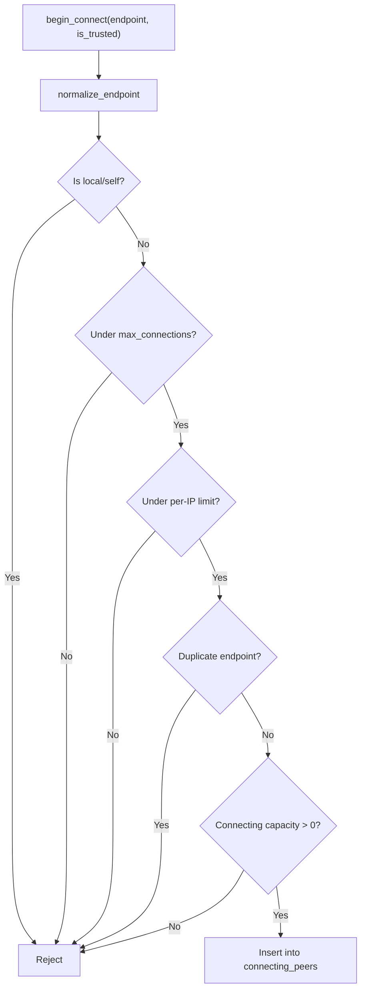

**Diagram sources**
- [neo-core/src/network/p2p/peer.rs:518-574](file://neo-core/src/network/p2p/peer.rs#L518-L574)

**Section sources**
- [neo-core/src/network/p2p/peer.rs:518-574](file://neo-core/src/network/p2p/peer.rs#L518-L574)
- [neo-core/tests/local_node_relay_tests.rs:425-450](file://neo-core/tests/local_node_relay_tests.rs#L425-L450)

### Connection Lifecycle: Handshake to Established
- Outbound flow: LocalNode initiates TCP connect, starts RemoteNode handshake, exchanges VersionPayload, validates network magic and capabilities, then registers the peer.
- Inbound flow: Listener accepts, applies inbound rate limiter, performs handshake, and upon success registers the peer.
- Timeouts: Handshake reads and active session reads increment shared timeout counters; explicit timers own teardown decisions.

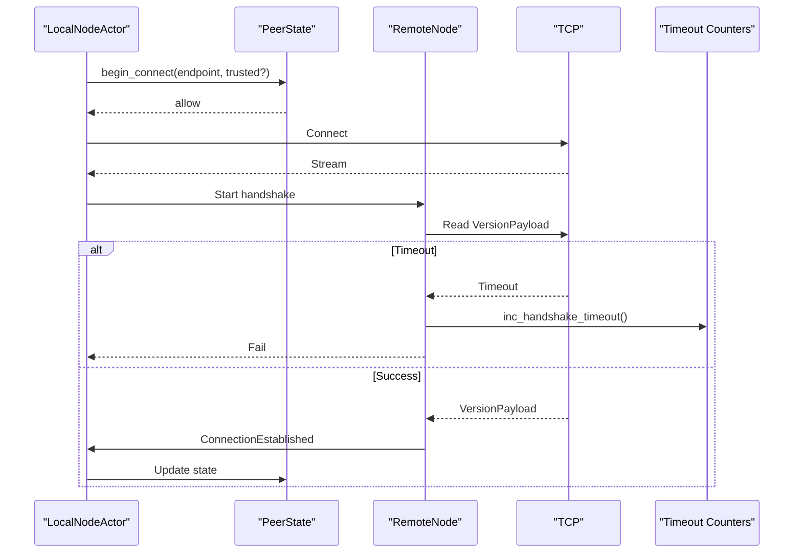

**Diagram sources**
- [neo-core/src/network/p2p/local_node/mod.rs:1-117](file://neo-core/src/network/p2p/local_node/mod.rs#L1-L117)
- [neo-core/src/network/p2p/remote_node/handshake.rs:133-148](file://neo-core/src/network/p2p/remote_node/handshake.rs#L133-L148)
- [neo-p2p/src/timeouts.rs:1-57](file://neo-p2p/src/timeouts.rs#L1-L57)

**Section sources**
- [neo-core/src/network/p2p/remote_node/handshake.rs:133-148](file://neo-core/src/network/p2p/remote_node/handshake.rs#L133-L148)
- [neo-p2p/src/timeouts.rs:1-57](file://neo-p2p/src/timeouts.rs#L1-L57)

### Connection Validation, Capability Negotiation, and Security
- Endpoint validation rejects unspecified, multicast, broadcast addresses, and port 0.
- Capability negotiation ensures only peers with required services (e.g., TCP server) participate in address book and relay.
- Security note: P2P traffic is plaintext; use tunnels or private networks for production.

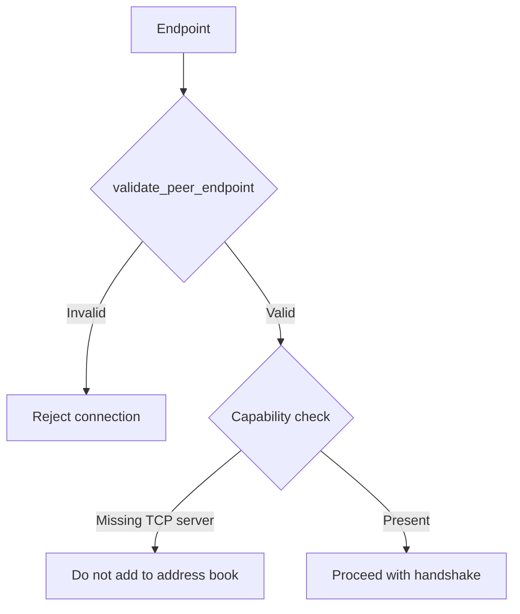

**Diagram sources**
- [neo-core/src/network/p2p/mod.rs:443-472](file://neo-core/src/network/p2p/mod.rs#L443-L472)
- [neo-core/tests/local_node_relay_tests.rs:174-211](file://neo-core/tests/local_node_relay_tests.rs#L174-L211)

**Section sources**
- [neo-core/src/network/p2p/mod.rs:12-45](file://neo-core/src/network/p2p/mod.rs#L12-L45)
- [neo-core/src/network/p2p/mod.rs:443-472](file://neo-core/src/network/p2p/mod.rs#L443-L472)

### Peer Scoring and Reputation System
- Reputation scores track peer behavior with penalties for invalid messages, handshake failures, and protocol violations; rewards for successful handshakes and valid relays.
- Misbehavior threshold triggers potential bans; ban entries include duration and reason, with automatic expiration and cleanup.
- Tracker provides async access to adjust scores, query misbehavior, and clean old entries.

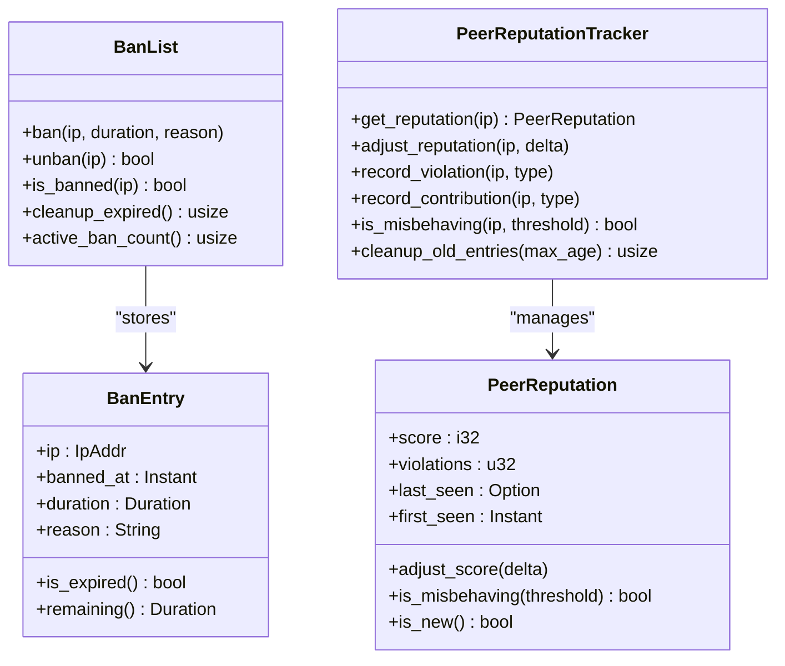

**Diagram sources**
- [neo-core/src/network/p2p/mod.rs:229-363](file://neo-core/src/network/p2p/mod.rs#L229-L363)
- [neo-core/src/network/p2p/mod.rs:474-543](file://neo-core/src/network/p2p/mod.rs#L474-L543)

**Section sources**
- [neo-core/src/network/p2p/mod.rs:94-121](file://neo-core/src/network/p2p/mod.rs#L94-L121)
- [neo-core/src/network/p2p/mod.rs:229-363](file://neo-core/src/network/p2p/mod.rs#L229-L363)
- [neo-core/src/network/p2p/mod.rs:474-543](file://neo-core/src/network/p2p/mod.rs#L474-L543)

### Connection Limits per IP and Bandwidth Throttling
- Per-IP limits: PeerState tracks connected_addresses per IP and enforces max_connections_per_address.
- Global limits: Enforced via max_connections in PeerState.
- Inbound rate limiting: Token bucket limiter controls new inbound connections per second with burst allowance; can be disabled by setting zero capacity.
- Bandwidth throttling: While explicit per-connection bandwidth throttling is not shown here, the token bucket limiter protects against connection floods; application-level throttling can be layered atop RemoteNode I/O.

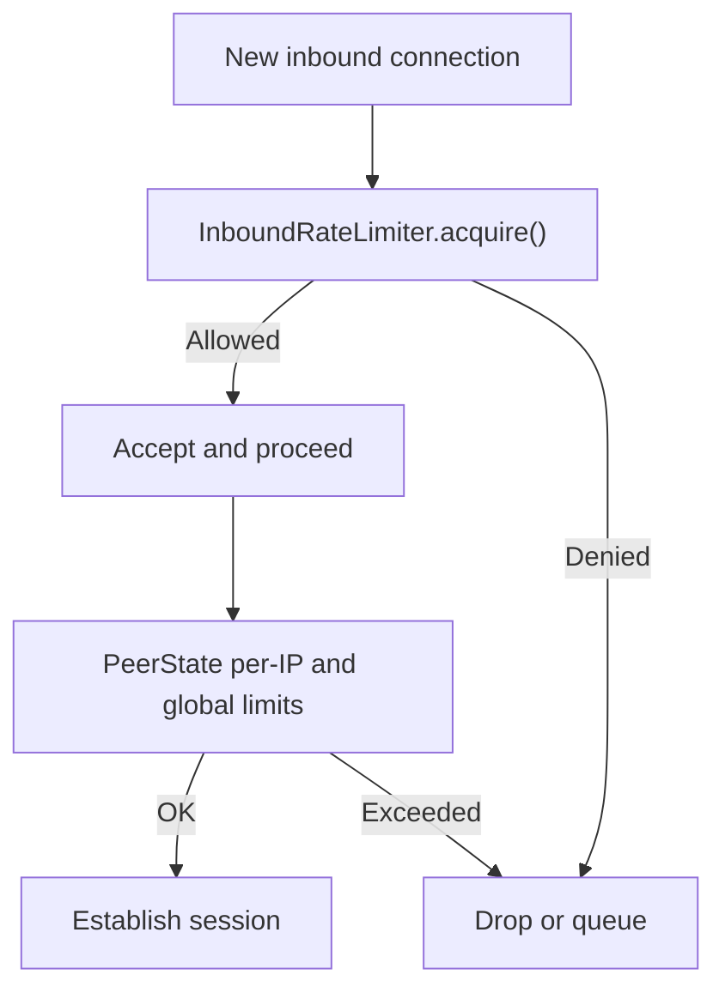

**Diagram sources**
- [neo-core/src/network/p2p/mod.rs:131-204](file://neo-core/src/network/p2p/mod.rs#L131-L204)
- [neo-core/src/network/p2p/peer.rs:518-574](file://neo-core/src/network/p2p/peer.rs#L518-L574)

**Section sources**
- [neo-core/src/network/p2p/mod.rs:131-204](file://neo-core/src/network/p2p/mod.rs#L131-L204)
- [neo-core/src/network/p2p/peer.rs:518-574](file://neo-core/src/network/p2p/peer.rs#L518-L574)

### Remote Node Abstraction Layer and State Management
- RemoteNode encapsulates I/O and handshake logic, exposing commands and event subscriptions for message handling.
- LocalNode maintains peer registry, remote node actors, broadcast history, seed list, capabilities, and pending connects.
- PeerState manages connection sets, endpoint normalization, and safety checks.

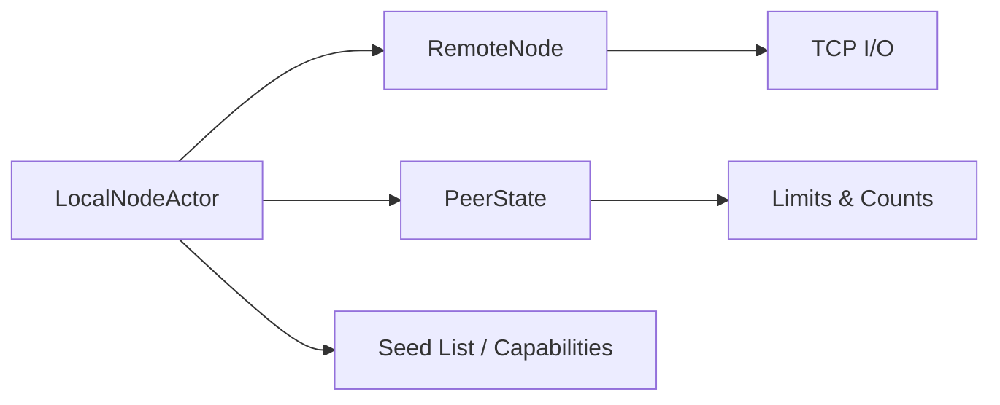

**Diagram sources**
- [neo-core/src/network/p2p/local_node/mod.rs:1-117](file://neo-core/src/network/p2p/local_node/mod.rs#L1-L117)
- [neo-core/src/network/p2p/peer.rs:518-574](file://neo-core/src/network/p2p/peer.rs#L518-L574)

**Section sources**
- [neo-core/src/network/p2p/local_node/mod.rs:1-117](file://neo-core/src/network/p2p/local_node/mod.rs#L1-L117)
- [neo-core/src/network/p2p/peer.rs:518-574](file://neo-core/src/network/p2p/peer.rs#L518-L574)

### Error Recovery Mechanisms
- Timeouts: Handshake and read timeouts increment shared counters; explicit timers drive teardown to prevent resource leaks.
- Rejection and backoff: Invalid endpoints and policy violations cause immediate rejection; reputation adjustments influence future acceptance/banning.
- Cleanup: BanList removes expired entries; reputation tracker prunes old entries.

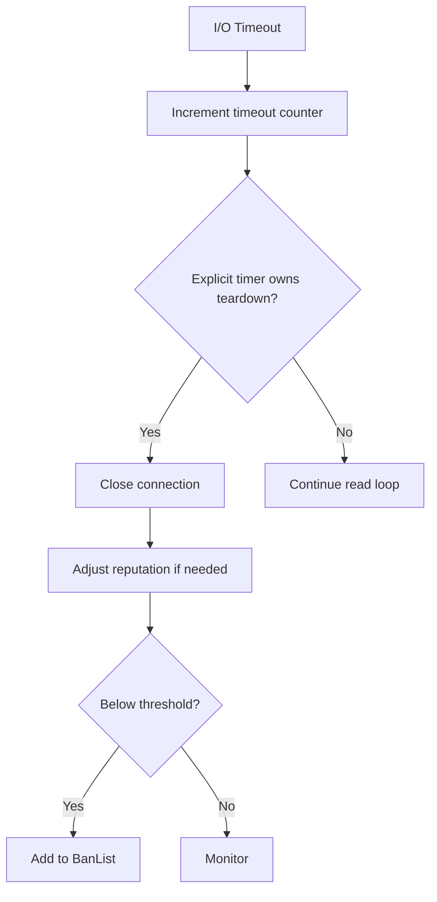

**Diagram sources**
- [neo-core/src/network/p2p/remote_node/handshake.rs:133-148](file://neo-core/src/network/p2p/remote_node/handshake.rs#L133-L148)
- [neo-core/src/network/p2p/mod.rs:229-363](file://neo-core/src/network/p2p/mod.rs#L229-L363)

**Section sources**
- [neo-core/src/network/p2p/remote_node/handshake.rs:133-148](file://neo-core/src/network/p2p/remote_node/handshake.rs#L133-L148)
- [neo-core/src/network/p2p/mod.rs:229-363](file://neo-core/src/network/p2p/mod.rs#L229-L363)

## Dependency Analysis
- neo-p2p provides protocol primitives and traits consumed by neo-core.
- neo-core::network::p2p depends on neo-p2p for message types and traits, and adds runtime components (actors, TCP, rate limiter, reputation).
- Optional UPnP feature integrates with network module for inbound port forwarding.

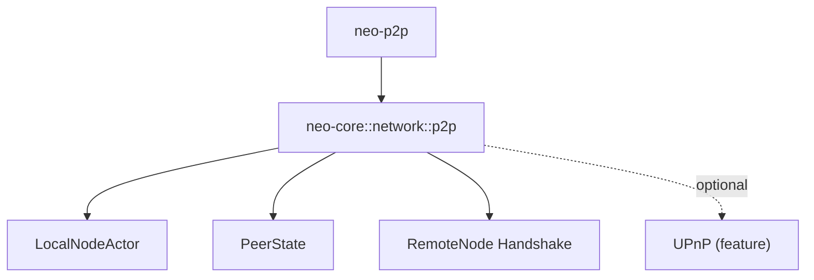

**Diagram sources**
- [neo-p2p/src/lib.rs:169-252](file://neo-p2p/src/lib.rs#L169-L252)
- [neo-core/src/network/mod.rs:1-21](file://neo-core/src/network/mod.rs#L1-L21)
- [neo-core/src/network/p2p/mod.rs:47-92](file://neo-core/src/network/p2p/mod.rs#L47-L92)

**Section sources**
- [neo-p2p/src/lib.rs:169-252](file://neo-p2p/src/lib.rs#L169-L252)
- [neo-core/src/network/mod.rs:1-21](file://neo-core/src/network/mod.rs#L1-L21)
- [neo-core/src/network/p2p/mod.rs:47-92](file://neo-core/src/network/p2p/mod.rs#L47-L92)

## Performance Considerations
- Use appropriate ChannelsConfig to balance min_desired_connections and max_connections_per_address for your topology.
- Tune inbound rate limiter to match expected connection bursts while preventing abuse.
- Monitor timeout counters to detect flaky peers or network issues early.
- Keep reputation thresholds aligned with operational goals to avoid false positives.

[No sources needed since this section provides general guidance]

## Troubleshooting Guide
Common issues and remedies:
- Firewall blocking inbound/outbound: Ensure ports are open; consider enabling UPnP if available. Validate that peers advertise TCP server capability.
- NAT traversal: If behind NAT, ensure port forwarding is configured; verify external reachability via peer probes.
- Excessive rejections: Check endpoint validation rules and per-IP limits; adjust ChannelsConfig accordingly.
- High timeout counts: Investigate network latency, peer liveness, and TLS/tunnel overhead if used.

Actionable steps:
- Inspect logs for “invalid endpoint” and “timeout” messages.
- Verify address book contents and groupings by IP.
- Review reputation and ban lists for misbehaving peers.

**Section sources**
- [neo-core/src/network/p2p/mod.rs:443-472](file://neo-core/src/network/p2p/mod.rs#L443-L472)
- [neo-core/src/network/p2p/remote_node/handshake.rs:133-148](file://neo-core/src/network/p2p/remote_node/handshake.rs#L133-L148)
- [neo-core/tests/local_node_relay_tests.rs:174-211](file://neo-core/tests/local_node_relay_tests.rs#L174-L211)

## Conclusion
Neo-RS implements a robust P2P connection management layer with clear separation between protocol types and runtime behavior. LocalNode orchestrates discovery and lifecycle, PeerState enforces policies and pooling, RemoteNode handles handshake and I/O, and reputation/rate limiting protect the network. Proper configuration and monitoring enable resilient operation across diverse environments.

[No sources needed since this section summarizes without analyzing specific files]

## Appendices

### Configuration Options
- ChannelsConfig: Controls desired connection counts and per-IP limits; used to tune connectivity behavior.
- Inbound rate limiter: Configurable rate and burst; disable by setting zero capacity.
- Reputation thresholds and ban durations: Adjust to balance security and connectivity.

**Section sources**
- [neo-core/src/network/p2p/mod.rs:94-204](file://neo-core/src/network/p2p/mod.rs#L94-L204)
- [neo-core/tests/local_node_relay_tests.rs:425-450](file://neo-core/tests/local_node_relay_tests.rs#L425-L450)

### Custom Peer Discovery Implementation
- Implement discovery by populating unconnected peers via LocalNode commands and ensuring discovered peers advertise TCP server capability.
- Group addresses by IP and use version timestamps to deduplicate entries.
- Integrate with seed lists and periodic refresh cycles to maintain a healthy address book.

**Section sources**
- [neo-core/src/network/p2p/local_node/mod.rs:1-117](file://neo-core/src/network/p2p/local_node/mod.rs#L1-L117)
- [neo-core/tests/local_node_relay_tests.rs:452-472](file://neo-core/tests/local_node_relay_tests.rs#L452-L472)