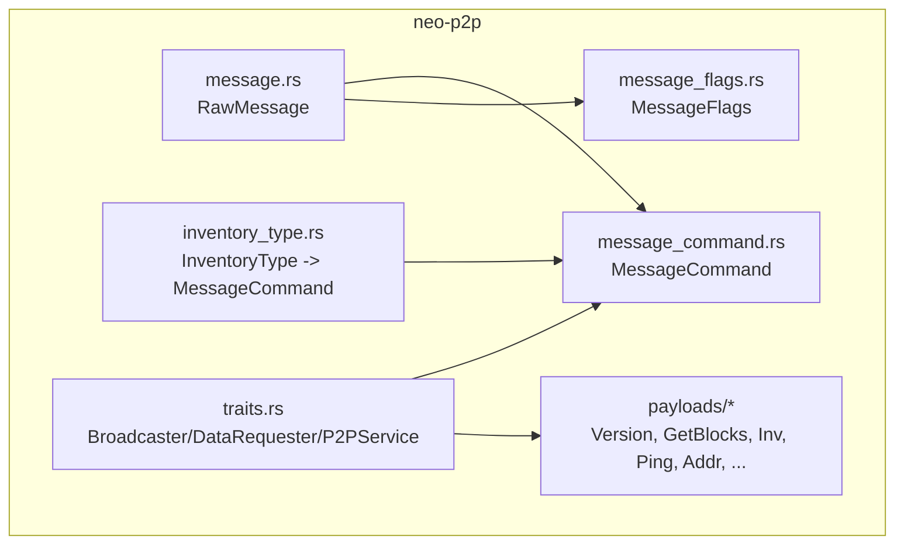
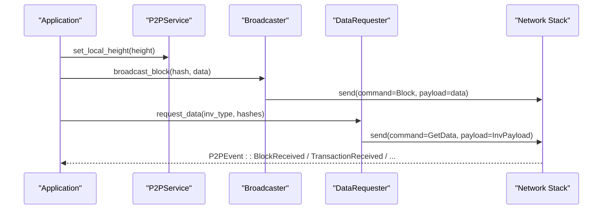
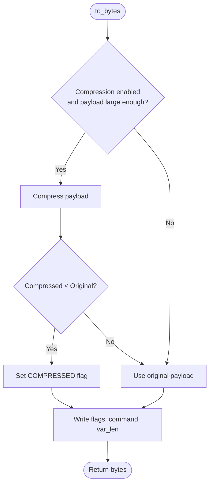
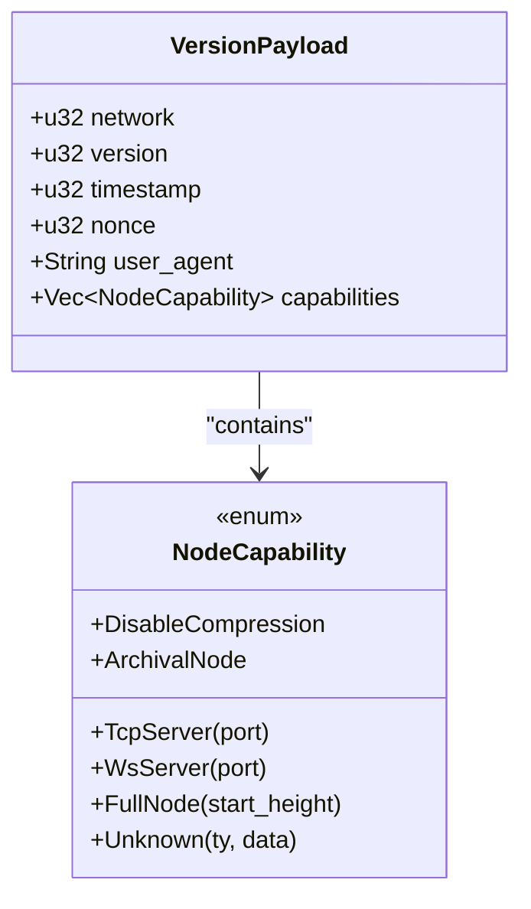
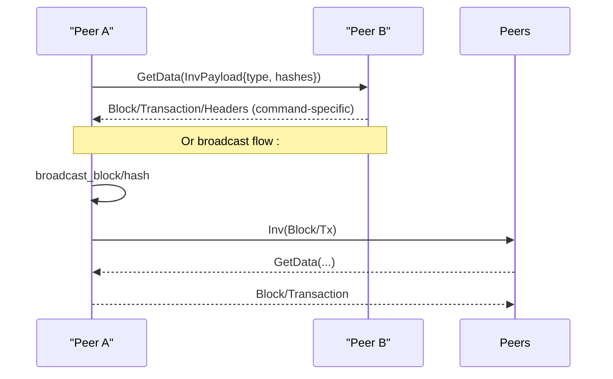
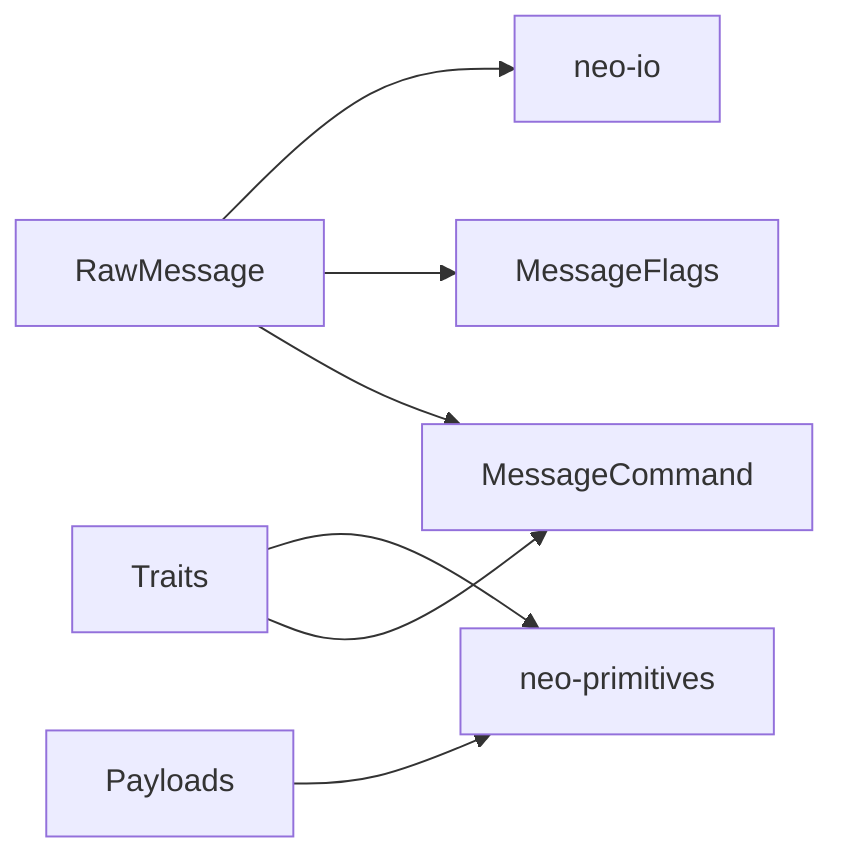

# Message Protocol

<cite>
**Referenced Files in This Document**
- [lib.rs](file://neo-p2p/src/lib.rs)
- [message.rs](file://neo-p2p/src/message.rs)
- [message_command.rs](file://neo-p2p/src/message_command.rs)
- [message_flags.rs](file://neo-p2p/src/message_flags.rs)
- [inventory_type.rs](file://neo-p2p/src/inventory_type.rs)
- [traits.rs](file://neo-p2p/src/traits.rs)
- [payloads/mod.rs](file://neo-p2p/src/payloads/mod.rs)
- [version_payload.rs](file://neo-p2p/src/payloads/version_payload.rs)
- [get_blocks_payload.rs](file://neo-p2p/src/payloads/get_blocks_payload.rs)
- [inv_payload.rs](file://neo-p2p/src/payloads/inv_payload.rs)
- [ping_payload.rs](file://neo-p2p/src/payloads/ping_payload.rs)
- [addr_payload.rs](file://neo-p2p/src/payloads/addr_payload.rs)
- [get_block_by_index_payload.rs](file://neo-p2p/src/payloads/get_block_by_index_payload.rs)
- [node_capability.rs](file://neo-p2p/src/payloads/node_capability.rs)
</cite>

## Table of Contents
1. [Introduction](#introduction)
2. [Project Structure](#project-structure)
3. [Core Components](#core-components)
4. [Architecture Overview](#architecture-overview)
5. [Detailed Component Analysis](#detailed-component-analysis)
6. [Dependency Analysis](#dependency-analysis)
7. [Performance Considerations](#performance-considerations)
8. [Troubleshooting Guide](#troubleshooting-guide)
9. [Conclusion](#conclusion)
10. [Appendices](#appendices)

## Introduction
This document describes the Neo P2P message protocol as implemented in the repository. It covers the wire format, framing, header structure, payload serialization, supported message types, routing and request-response patterns, broadcast behavior, validation and size limits, version compatibility, and practical guidance for implementing custom messages, debugging, and optimizing throughput.

The protocol is a TCP-based binary framing with:
- A one-byte flags field
- A one-byte command discriminator
- A variable-length length prefix
- A variable-length payload (optionally LZ4-compressed when permitted by the command)

There is no per-message magic or checksum; network identity is negotiated during handshake via VersionPayload.

**Section sources**
- [lib.rs:106-147](file://neo-p2p/src/lib.rs#L106-L147)
- [message.rs:11-15](file://neo-p2p/src/message.rs#L11-L15)

## Project Structure
The P2P protocol is defined primarily in the neo-p2p crate:
- Wire framing and size limits are in message.rs
- Command identifiers and queueing policies are in message_command.rs
- Flag handling is in message_flags.rs
- Payload types live under payloads/
- Traits define broadcasting, data requests, peer management, and events used by higher layers

**Diagram sources**
- [message.rs:17-29](file://neo-p2p/src/message.rs#L17-L29)
- [message_command.rs:22-54](file://neo-p2p/src/message_command.rs#L22-L54)
- [message_flags.rs:5-16](file://neo-p2p/src/message_flags.rs#L5-L16)
- [inventory_type.rs:8-17](file://neo-p2p/src/inventory_type.rs#L8-L17)
- [traits.rs:75-108](file://neo-p2p/src/traits.rs#L75-L108)
- [payloads/mod.rs:8-27](file://neo-p2p/src/payloads/mod.rs#L8-L27)

**Section sources**
- [lib.rs:165-210](file://neo-p2p/src/lib.rs#L165-L210)
- [payloads/mod.rs:8-27](file://neo-p2p/src/payloads/mod.rs#L8-L27)

## Core Components
- RawMessage: wire-format container with flags, command, and raw payload bytes. Supports to_bytes/from_bytes with optional compression.
- MessageCommand: single-byte command codes with helpers for single-queue and high-priority classification.
- MessageFlags: bit flags including compression.
- InventoryType mapping to MessageCommand for inventory announcements.
- Traits: Broadcaster, DataRequester, PeerManager, P2PEventSubscriber, P2PService for higher-level networking.

Key behaviors:
- Compression is applied only when enabled and allowed for the command, and only if compressed size is smaller than original.
- Maximum payload size is enforced on deserialization.
- Unknown commands and flags are preserved for forward compatibility.

**Section sources**
- [message.rs:17-105](file://neo-p2p/src/message.rs#L17-L105)
- [message_command.rs:22-54](file://neo-p2p/src/message_command.rs#L22-L54)
- [message_flags.rs:5-16](file://neo-p2p/src/message_flags.rs#L5-L16)
- [inventory_type.rs:8-17](file://neo-p2p/src/inventory_type.rs#L8-L17)
- [traits.rs:17-213](file://neo-p2p/src/traits.rs#L17-L213)

## Architecture Overview
The P2P layer provides a minimal, composable interface:
- Framing and serialization/deserialization are isolated in RawMessage.
- Commands and flags are typed enums with safe parsing.
- Payloads are independent serializable structures.
- Higher layers use traits to broadcast, request data, manage peers, and subscribe to events.

**Diagram sources**
- [traits.rs:75-108](file://neo-p2p/src/traits.rs#L75-L108)
- [traits.rs:110-144](file://neo-p2p/src/traits.rs#L110-L144)
- [traits.rs:194-213](file://neo-p2p/src/traits.rs#L194-L213)

## Detailed Component Analysis

### Wire Format and Framing
- Header: flags (1 byte), command (1 byte), length (var_int LE), payload (variable).
- No per-message magic or checksum; integrity relies on TCP.
- Compression:
  - Applied when enable_compression is true and payload meets minimum size threshold.
  - Only used if compressed size < original size.
  - Allowed only for specific commands (see MessageCommand compression whitelist).
- Size limit:
  - Deserialization enforces a maximum payload size constant.

**Diagram sources**
- [message.rs:51-70](file://neo-p2p/src/message.rs#L51-L70)
- [message.rs:73-104](file://neo-p2p/src/message.rs#L73-L104)
- [message_command.rs:76-94](file://neo-p2p/src/message_command.rs#L76-L94)

**Section sources**
- [message.rs:11-15](file://neo-p2p/src/message.rs#L11-L15)
- [message.rs:51-104](file://neo-p2p/src/message.rs#L51-L104)
- [message_command.rs:76-94](file://neo-p2p/src/message_command.rs#L76-L94)

### Message Types and Commands
Supported commands include Version, Verack, GetAddr, Addr, Ping, Pong, GetHeaders, Headers, GetBlocks, Mempool, Inv, GetData, GetBlockByIndex, NotFound, Transaction, Block, Extensible, Reject, FilterLoad, FilterAdd, FilterClear, MerkleBlock, Alert.

Queueing and priority:
- Single-queued commands: only one instance queued at a time (e.g., Addr, GetAddr, GetBlocks, GetHeaders, Mempool, Ping, Pong).
- High-priority queue: certain control and filter-related commands are prioritized.

Compression whitelist:
- Certain commands allow compression (e.g., Block, Extensible, Transaction, Headers, Addr, MerkleBlock, FilterLoad, FilterAdd).

**Section sources**
- [lib.rs:120-147](file://neo-p2p/src/lib.rs#L120-L147)
- [message_command.rs:22-54](file://neo-p2p/src/message_command.rs#L22-L54)
- [message_command.rs:76-94](file://neo-p2p/src/message_command.rs#L76-L94)

### Payload Structures and Serialization

#### VersionPayload (handshake)
- Fields: network (u32), version (u32), timestamp (u32), nonce (u32), user_agent (string), capabilities (list of NodeCapability).
- Limits: user_agent max length enforced; capabilities list bounded by MAX_CAPABILITIES.
- Capabilities include TcpServer, WsServer, DisableCompression, FullNode(start_height), ArchivalNode, Unknown(ty, data).

**Diagram sources**
- [version_payload.rs:28-47](file://neo-p2p/src/payloads/version_payload.rs#L28-L47)
- [node_capability.rs:13-30](file://neo-p2p/src/payloads/node_capability.rs#L13-L30)

**Section sources**
- [version_payload.rs:20-111](file://neo-p2p/src/payloads/version_payload.rs#L20-L111)
- [node_capability.rs:9-10](file://neo-p2p/src/payloads/node_capability.rs#L9-L10)
- [node_capability.rs:13-30](file://neo-p2p/src/payloads/node_capability.rs#L13-L30)
- [node_capability.rs:147-223](file://neo-p2p/src/payloads/node_capability.rs#L147-L223)

#### GetBlocksPayload
- Fields: hash_start (UInt256), count (i16).
- Validation: count must be -1 or positive non-zero; otherwise invalid.

**Section sources**
- [get_blocks_payload.rs:16-44](file://neo-p2p/src/payloads/get_blocks_payload.rs#L16-L44)

#### InvPayload
- Fields: inventory_type (InventoryType), hashes (Vec<UInt256>).
- Limits: maximum number of hashes per payload is bounded; batching helpers split larger sets into multiple payloads.

**Section sources**
- [inv_payload.rs:8-14](file://neo-p2p/src/payloads/inv_payload.rs#L8-L14)
- [inv_payload.rs:16-69](file://neo-p2p/src/payloads/inv_payload.rs#L16-L69)
- [inv_payload.rs:71-92](file://neo-p2p/src/payloads/inv_payload.rs#L71-L92)

#### PingPayload
- Fields: last_block_index (u32), timestamp (u32), nonce (u32).
- Used for keepalive and latency checks; nonce must match between Ping and Pong.

**Section sources**
- [ping_payload.rs:15-57](file://neo-p2p/src/payloads/ping_payload.rs#L15-L57)

#### AddrPayload
- Fields: address_list (Vec<NetworkAddressWithTime>).
- Limits: maximum addresses per response; empty lists rejected.

**Section sources**
- [addr_payload.rs:19-20](file://neo-p2p/src/payloads/addr_payload.rs#L19-L20)
- [addr_payload.rs:22-59](file://neo-p2p/src/payloads/addr_payload.rs#L22-L59)

#### GetBlockByIndexPayload
- Fields: index_start (u32), count (i16).
- Validation: count must be -1 or within allowed range; zero and negative values other than -1 are invalid.

**Section sources**
- [get_block_by_index_payload.rs:15-16](file://neo-p2p/src/payloads/get_block_by_index_payload.rs#L15-L16)
- [get_block_by_index_payload.rs:18-46](file://neo-p2p/src/payloads/get_block_by_index_payload.rs#L18-L46)

### Request-Response Patterns and Broadcast Protocols
- Request-response:
  - GetData requests inventory by type and hashes; responders return corresponding Block, Transaction, etc.
  - GetBlocks and GetBlockByIndex request blocks by hash or index ranges.
  - GetHeaders requests headers starting from a given hash.
- Broadcast:
  - Blocks and transactions can be broadcast to all peers.
  - Inventory announcements (Inv) propagate known items across the network.
- Events:
  - Peers receive events for new transactions, blocks, headers, inventory, consensus, and state roots.

**Diagram sources**
- [traits.rs:75-108](file://neo-p2p/src/traits.rs#L75-L108)
- [traits.rs:110-144](file://neo-p2p/src/traits.rs#L110-L144)
- [inv_payload.rs:44-58](file://neo-p2p/src/payloads/inv_payload.rs#L44-L58)

**Section sources**
- [traits.rs:75-108](file://neo-p2p/src/traits.rs#L75-L108)
- [traits.rs:110-144](file://neo-p2p/src/traits.rs#L110-L144)

### Consensus-Related Messages
- Consensus messages are carried in the Extensible message type.
- The inventory type Consensus maps to the Extensible command for transport.

**Section sources**
- [inventory_type.rs:8-17](file://neo-p2p/src/inventory_type.rs#L8-L17)
- [lib.rs:120-147](file://neo-p2p/src/lib.rs#L120-L147)

### Message Routing and Queuing Policies
- Single-queued commands ensure only one outstanding instance for certain control messages (e.g., GetBlocks, GetHeaders, Ping/Pong).
- High-priority queue accelerates critical control and filter messages.
- These policies help prevent queue saturation and prioritize essential control traffic.

**Section sources**
- [message_command.rs:22-54](file://neo-p2p/src/message_command.rs#L22-L54)

## Dependency Analysis
- RawMessage depends on MessageCommand, MessageFlags, and compression utilities.
- Payloads depend on neo-io for serialization and neo-primitives for core types (UInt256, InventoryType, NodeCapabilityType).
- Traits abstract higher-layer behavior and reference MessageCommand and InventoryType.

**Diagram sources**
- [message.rs:7-9](file://neo-p2p/src/message.rs#L7-L9)
- [payloads/mod.rs:8-27](file://neo-p2p/src/payloads/mod.rs#L8-L27)
- [traits.rs:12-15](file://neo-p2p/src/traits.rs#L12-L15)

**Section sources**
- [message.rs:7-9](file://neo-p2p/src/message.rs#L7-L9)
- [payloads/mod.rs:8-27](file://neo-p2p/src/payloads/mod.rs#L8-L27)
- [traits.rs:12-15](file://neo-p2p/src/traits.rs#L12-L15)

## Performance Considerations
- Compression:
  - Apply only when enabled and beneficial; small payloads may not compress well.
  - Respect command whitelist to avoid compressing unsupported messages.
- Batching:
  - Use InvPayload.create_group to batch large inventories within MAX_HASHES_COUNT.
- Queue policies:
  - Leverage single-queued and high-priority classifications to reduce contention for control messages.
- Buffer sizing:
  - Pre-allocate writers based on expected payload sizes to minimize reallocations.
- Throughput:
  - Prefer GetData/Inv flows for efficient synchronization rather than unbounded broadcasts.

[No sources needed since this section provides general guidance]

## Troubleshooting Guide
Common issues and where to look:
- Unknown command errors:
  - Occur when parsing an unrecognized command byte; unknown commands are preserved for compatibility but may be logged or dropped by handlers.
- Payload size exceeded:
  - Deserialization enforces PAYLOAD_MAX_SIZE; oversized payloads will fail early.
- Invalid payload fields:
  - GetBlocksPayload count must be -1 or positive non-zero.
  - GetBlockByIndexPayload count must be -1 or within allowed range.
  - AddrPayload requires non-empty address lists and respects MAX_COUNT_TO_SEND.
- Capability validation:
  - Duplicate known capabilities are rejected; unknown capability payloads are size-limited.

**Section sources**
- [message.rs:73-104](file://neo-p2p/src/message.rs#L73-L104)
- [get_blocks_payload.rs:34-44](file://neo-p2p/src/payloads/get_blocks_payload.rs#L34-L44)
- [get_block_by_index_payload.rs:36-46](file://neo-p2p/src/payloads/get_block_by_index_payload.rs#L36-L46)
- [addr_payload.rs:38-59](file://neo-p2p/src/payloads/addr_payload.rs#L38-L59)
- [node_capability.rs:133-145](file://neo-p2p/src/payloads/node_capability.rs#L133-L145)

## Conclusion
The Neo P2P message protocol in this implementation provides a compact, extensible wire format with clear separation between framing, commands, flags, and payloads. It supports robust validation, size limits, and optional compression for high-throughput scenarios. Higher-level traits abstract broadcasting, data requests, and eventing, enabling flexible implementations while preserving protocol compatibility.

[No sources needed since this section summarizes without analyzing specific files]

## Appendices

### Appendix A: Example Custom Message Implementation
To add a custom message:
- Define a new payload struct implementing Serializable with appropriate size(), serialize(), deserialize(), and validation logic.
- If it needs a new command, extend the command enum in the appropriate module and update any relevant queueing or compression policies.
- Wire it through RawMessage using from_serializable/to_bytes and handle it in your service layer.

Reference paths:
- [version_payload.rs:73-111](file://neo-p2p/src/payloads/version_payload.rs#L73-L111)
- [inv_payload.rs:71-92](file://neo-p2p/src/payloads/inv_payload.rs#L71-L92)
- [message.rs:41-49](file://neo-p2p/src/message.rs#L41-L49)
- [message.rs:51-70](file://neo-p2p/src/message.rs#L51-L70)

### Appendix B: Debugging Techniques
- Inspect RawMessage.flags and .command to identify framing and command parsing issues.
- Log payload lengths before compression decisions to understand bandwidth usage.
- Validate payload fields immediately upon deserialization to catch protocol violations early.
- Use P2PEvent subscribers to trace received inventory, blocks, and transactions.

Reference paths:
- [message.rs:73-104](file://neo-p2p/src/message.rs#L73-L104)
- [traits.rs:110-144](file://neo-p2p/src/traits.rs#L110-L144)

### Appendix C: Version Compatibility Notes
- VersionPayload carries network magic, protocol version, and node capabilities to negotiate compatibility.
- Unknown capabilities are supported via the Unknown variant with bounded data size.
- Unknown commands and flags are preserved to maintain forward compatibility.

Reference paths:
- [version_payload.rs:20-47](file://neo-p2p/src/payloads/version_payload.rs#L20-L47)
- [node_capability.rs:63-83](file://neo-p2p/src/payloads/node_capability.rs#L63-L83)
- [message_flags.rs:5-16](file://neo-p2p/src/message_flags.rs#L5-L16)