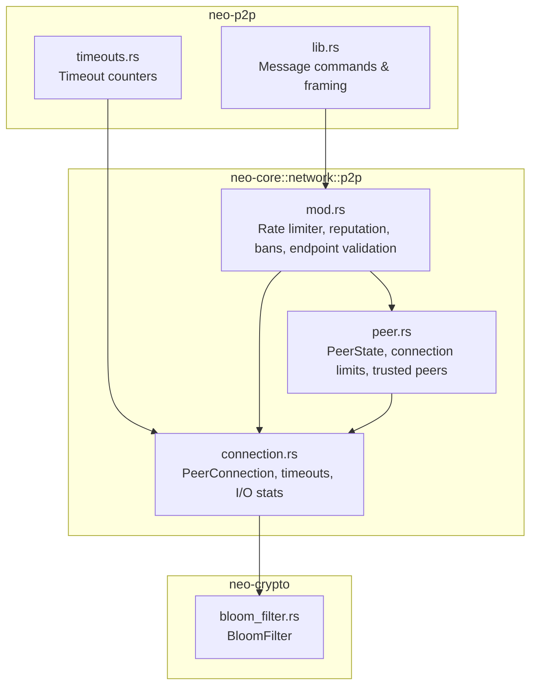
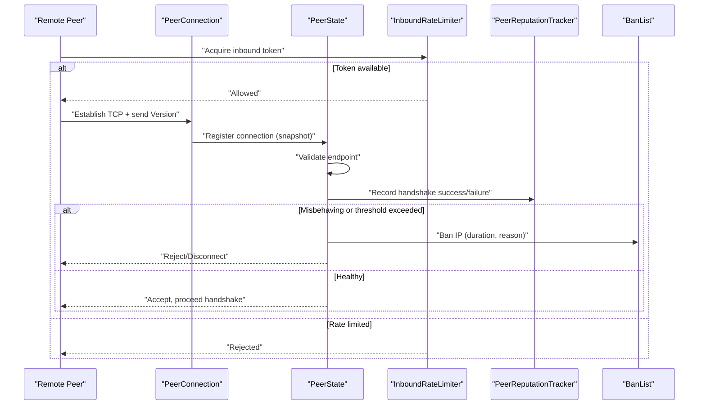
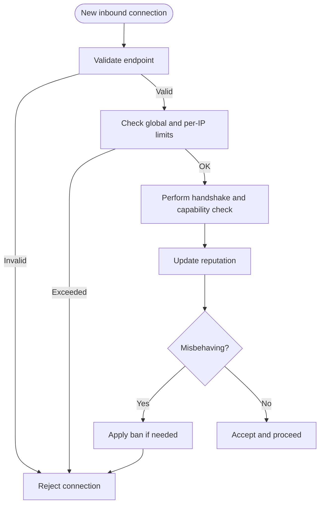
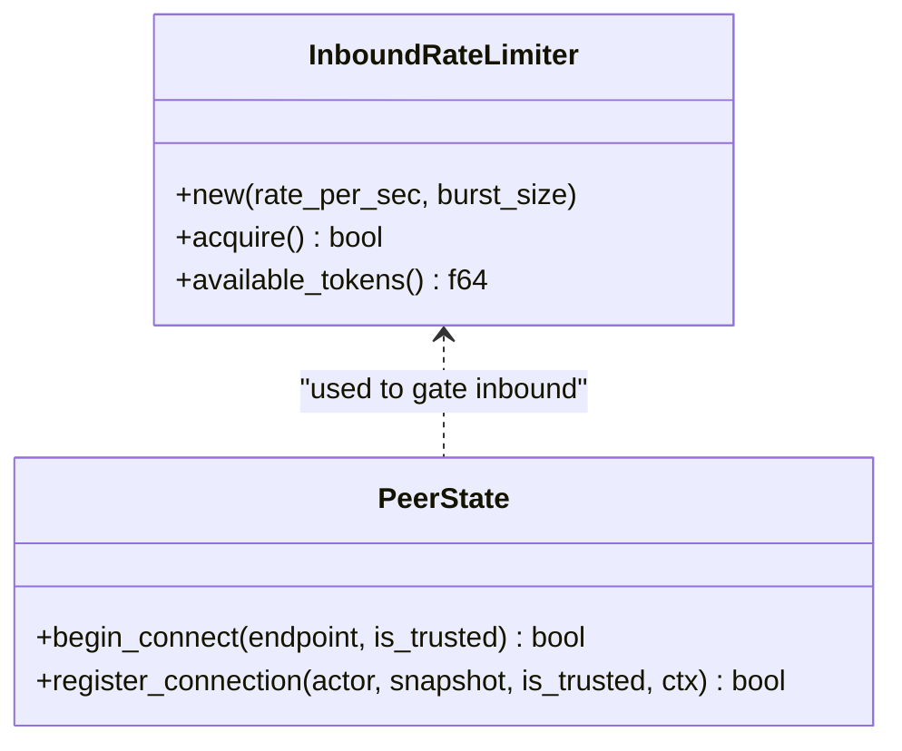
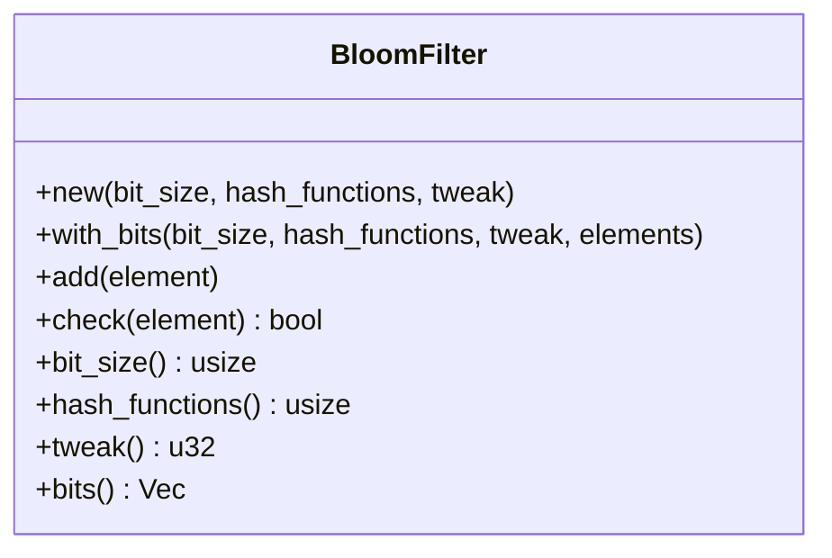
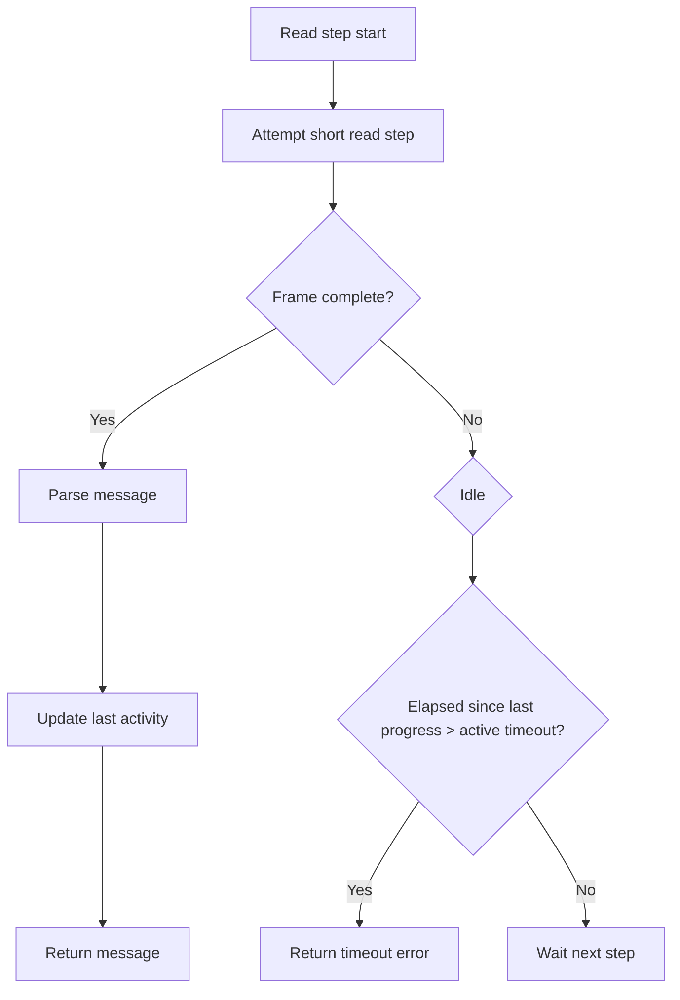
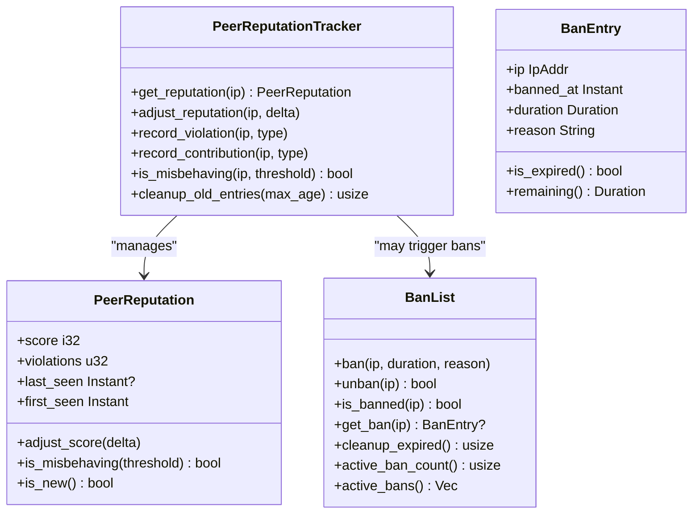
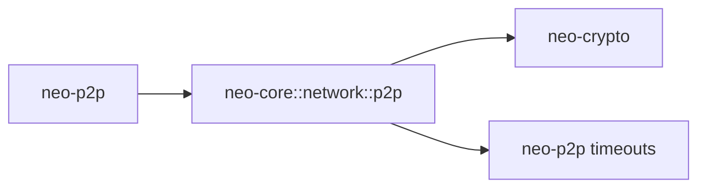

# Network Security

<cite>
**Referenced Files in This Document**
- [neo-p2p/src/lib.rs](file://neo-p2p/src/lib.rs)
- [neo-p2p/src/timeouts.rs](file://neo-p2p/src/timeouts.rs)
- [neo-core/src/network/p2p/mod.rs](file://neo-core/src/network/p2p/mod.rs)
- [neo-core/src/network/p2p/peer.rs](file://neo-core/src/network/p2p/peer.rs)
- [neo-core/src/network/p2p/connection.rs](file://neo-core/src/network/p2p/connection.rs)
- [neo-crypto/src/bloom_filter.rs](file://neo-crypto/src/bloom_filter.rs)
</cite>

## Table of Contents
1. Introduction
2. Project Structure
3. Core Components
4. Architecture Overview
5. Detailed Component Analysis
6. Dependency Analysis
7. Performance Considerations
8. Troubleshooting Guide
9. Conclusion
10. Appendices

## Introduction
This document explains the network security features implemented in the Neo-RS P2P layer. It covers authentication and trust establishment, rate limiting and request throttling, filtering capabilities (including Bloom filters), timeouts and connection limits, and resource protection mechanisms. It also provides operator-focused security best practices, examples of custom policies, audit procedures, and incident response guidance for network-level threats.

The P2P protocol is intentionally unencrypted at transport level to remain compatible with the broader Neo network. Security relies on cryptographic signatures at the application layer and strict peer validation, reputation tracking, and resource controls.

## Project Structure
Neo’s P2P security spans a few key modules:
- Protocol types and message framing live in neo-p2p.
- Runtime P2P behavior (connection management, peer state, reputation, bans, inbound rate limiting) lives in neo-core network p2p.
- Filtering primitives (Bloom filter) are provided by neo-crypto.

**Diagram sources**
- [neo-p2p/src/lib.rs:165-213](file://neo-p2p/src/lib.rs#L165-L213)
- [neo-p2p/src/timeouts.rs:1-58](file://neo-p2p/src/timeouts.rs#L1-L58)
- [neo-core/src/network/p2p/mod.rs:94-204](file://neo-core/src/network/p2p/mod.rs#L94-L204)
- [neo-core/src/network/p2p/peer.rs:126-220](file://neo-core/src/network/p2p/peer.rs#L126-L220)
- [neo-core/src/network/p2p/connection.rs:101-147](file://neo-core/src/network/p2p/connection.rs#L101-L147)
- [neo-crypto/src/bloom_filter.rs:1-119](file://neo-crypto/src/bloom_filter.rs#L1-L119)

**Section sources**
- [neo-p2p/src/lib.rs:165-213](file://neo-p2p/src/lib.rs#L165-L213)
- [neo-core/src/network/p2p/mod.rs:94-204](file://neo-core/src/network/p2p/mod.rs#L94-L204)

## Core Components
- Inbound connection rate limiter: token-bucket based limiter protects against connection floods.
- Peer reputation tracker: tracks per-IP scores and violations; supports thresholds and cleanup.
- Ban list: time-bound bans with expiration and active set queries.
- Endpoint validation: rejects unspecified, multicast, broadcast, and invalid ports.
- Connection limits: enforced per node and per IP, with trusted peer exemptions.
- Timeouts and activity tracking: handshake vs active read timeouts, write timeouts, idle detection.
- Filtering: Bloom filter support for privacy-preserving transaction/block filtering.

**Section sources**
- [neo-core/src/network/p2p/mod.rs:94-204](file://neo-core/src/network/p2p/mod.rs#L94-L204)
- [neo-core/src/network/p2p/mod.rs:229-363](file://neo-core/src/network/p2p/mod.rs#L229-L363)
- [neo-core/src/network/p2p/mod.rs:443-472](file://neo-core/src/network/p2p/mod.rs#L443-L472)
- [neo-core/src/network/p2p/peer.rs:126-220](file://neo-core/src/network/p2p/peer.rs#L126-L220)
- [neo-core/src/network/p2p/connection.rs:101-147](file://neo-core/src/network/p2p/connection.rs#L101-L147)
- [neo-crypto/src/bloom_filter.rs:1-119](file://neo-crypto/src/bloom_filter.rs#L1-L119)

## Architecture Overview
The P2P stack enforces security at multiple layers:
- Transport: TCP without encryption (by design). Operators should use tunnels or private networks for confidentiality.
- Handshake and capability negotiation: Version payloads carry node capabilities; peers validate compatibility.
- Validation: Endpoints are validated before connection attempts or registration.
- Limits: Global and per-IP connection caps, plus inbound rate limiting.
- Reputation and bans: Misbehavior reduces reputation; persistent bans can be applied.
- Timeouts: Strict handshake and active read/write timeouts prevent resource exhaustion.
- Filtering: Optional Bloom filters reduce bandwidth and improve privacy for light clients.

**Diagram sources**
- [neo-core/src/network/p2p/mod.rs:131-204](file://neo-core/src/network/p2p/mod.rs#L131-L204)
- [neo-core/src/network/p2p/peer.rs:126-220](file://neo-core/src/network/p2p/peer.rs#L126-L220)
- [neo-core/src/network/p2p/mod.rs:474-543](file://neo-core/src/network/p2p/mod.rs#L474-L543)
- [neo-core/src/network/p2p/mod.rs:311-363](file://neo-core/src/network/p2p/mod.rs#L311-L363)

## Detailed Component Analysis

### Authentication and Trust Establishment
- Capability verification: The P2P protocol defines message commands and payload types used during handshake and subsequent exchanges. Nodes advertise capabilities via version payloads and enforce compatibility.
- Peer validation: Before any connection attempt or registration, endpoints are validated to reject unsafe addresses and ports.
- Trust model: Trusted peers bypass certain connection limits but still undergo validation. Reputation rewards increase trust signals over time.

**Diagram sources**
- [neo-core/src/network/p2p/mod.rs:443-472](file://neo-core/src/network/p2p/mod.rs#L443-L472)
- [neo-core/src/network/p2p/peer.rs:126-220](file://neo-core/src/network/p2p/peer.rs#L126-L220)
- [neo-core/src/network/p2p/mod.rs:474-543](file://neo-core/src/network/p2p/mod.rs#L474-L543)

**Section sources**
- [neo-p2p/src/lib.rs:106-147](file://neo-p2p/src/lib.rs#L106-L147)
- [neo-core/src/network/p2p/mod.rs:443-472](file://neo-core/src/network/p2p/mod.rs#L443-L472)
- [neo-core/src/network/p2p/peer.rs:126-220](file://neo-core/src/network/p2p/peer.rs#L126-L220)

### Rate Limiting and Request Throttling
- Inbound connection rate limiter: Token bucket with configurable rate and burst; prevents rapid connection floods.
- Per-IP connection limits: Prevents single peers from monopolizing resources.
- Global connection limits: Caps total concurrent connections.
- Trusted peer exemptions: Allow critical peers to bypass limits while still being validated.

**Diagram sources**
- [neo-core/src/network/p2p/mod.rs:131-204](file://neo-core/src/network/p2p/mod.rs#L131-L204)
- [neo-core/src/network/p2p/peer.rs:164-220](file://neo-core/src/network/p2p/peer.rs#L164-L220)

**Section sources**
- [neo-core/src/network/p2p/mod.rs:94-204](file://neo-core/src/network/p2p/mod.rs#L94-L204)
- [neo-core/src/network/p2p/peer.rs:164-220](file://neo-core/src/network/p2p/peer.rs#L164-L220)

### Filtering Capabilities (Bloom Filters)
- Bloom filter implementation: Probabilistic data structure for membership tests, enabling filtered block/transaction propagation to reduce bandwidth and improve privacy.
- Usage: Load filter patterns and receive only matching inventory items.

**Diagram sources**
- [neo-crypto/src/bloom_filter.rs:1-119](file://neo-crypto/src/bloom_filter.rs#L1-L119)

**Section sources**
- [neo-crypto/src/bloom_filter.rs:1-119](file://neo-crypto/src/bloom_filter.rs#L1-L119)

### Timeouts, Connection Limits, and Resource Protection
- Timeouts:
  - Handshake read timeout: stricter limit during initial exchange.
  - Active read timeout: enforced across stepwise reads to avoid stalls.
  - Write timeout: bounds outbound serialization and I/O.
  - Shutdown timeout: graceful close with bounded wait.
- Activity tracking: Last activity timestamps enable idle detection and stale connection pruning.
- Connection limits:
  - Global max connections.
  - Per-IP max connections.
  - Connecting capacity cap to avoid resource exhaustion.
- Statistics: Message counts and byte volumes help detect anomalies.

**Diagram sources**
- [neo-core/src/network/p2p/connection.rs:370-420](file://neo-core/src/network/p2p/connection.rs#L370-L420)
- [neo-core/src/network/p2p/connection.rs:235-281](file://neo-core/src/network/p2p/connection.rs#L235-L281)
- [neo-core/src/network/p2p/connection.rs:422-459](file://neo-core/src/network/p2p/connection.rs#L422-L459)

**Section sources**
- [neo-core/src/network/p2p/connection.rs:101-147](file://neo-core/src/network/p2p/connection.rs#L101-L147)
- [neo-core/src/network/p2p/connection.rs:235-420](file://neo-core/src/network/p2p/connection.rs#L235-L420)
- [neo-core/src/network/p2p/connection.rs:422-459](file://neo-core/src/network/p2p/connection.rs#L422-L459)
- [neo-p2p/src/timeouts.rs:1-58](file://neo-p2p/src/timeouts.rs#L1-L58)

### Reputation and Bans
- Reputation scoring: Adjustments for protocol violations, invalid data, connection failures, and positive contributions like successful handshakes and valid relays.
- Threshold-based misbehavior detection: Peers below threshold are considered misbehaving.
- Ban list: Time-bound entries with reasons; automatic expiration and cleanup.

**Diagram sources**
- [neo-core/src/network/p2p/mod.rs:229-363](file://neo-core/src/network/p2p/mod.rs#L229-L363)
- [neo-core/src/network/p2p/mod.rs:474-543](file://neo-core/src/network/p2p/mod.rs#L474-L543)

**Section sources**
- [neo-core/src/network/p2p/mod.rs:229-363](file://neo-core/src/network/p2p/mod.rs#L229-L363)
- [neo-core/src/network/p2p/mod.rs:474-543](file://neo-core/src/network/p2p/mod.rs#L474-L543)

## Dependency Analysis
- neo-p2p provides protocol types and framing; neo-core implements runtime enforcement (limits, reputation, bans).
- neo-crypto supplies Bloom filter primitives used by filtering workflows.
- Timeouts module exposes atomic counters for observability and potential alerting.

**Diagram sources**
- [neo-p2p/src/lib.rs:165-213](file://neo-p2p/src/lib.rs#L165-L213)
- [neo-core/src/network/p2p/mod.rs:94-204](file://neo-core/src/network/p2p/mod.rs#L94-L204)
- [neo-crypto/src/bloom_filter.rs:1-119](file://neo-crypto/src/bloom_filter.rs#L1-L119)
- [neo-p2p/src/timeouts.rs:1-58](file://neo-p2p/src/timeouts.rs#L1-L58)

**Section sources**
- [neo-p2p/src/lib.rs:165-213](file://neo-p2p/src/lib.rs#L165-L213)
- [neo-core/src/network/p2p/mod.rs:94-204](file://neo-core/src/network/p2p/mod.rs#L94-L204)

## Performance Considerations
- Use vectored writes and buffered small writes to reduce syscall overhead.
- Monitor connection stats (messages sent/received, bytes) to detect anomalies early.
- Tune inbound rate limiter and connection limits according to expected topology and traffic patterns.
- Keep timeouts conservative to balance responsiveness and resilience under load.

[No sources needed since this section provides general guidance]

## Troubleshooting Guide
Common issues and mitigations:
- Excessive timeouts: Inspect handshake and active read timeouts; verify network latency and peer liveness.
- High rejection rates: Check endpoint validation rules and per-IP/global connection limits.
- Frequent disconnects: Review reputation adjustments and ban lists; investigate misconfigurations or malicious peers.
- Bandwidth spikes: Enable or adjust Bloom filters to reduce unnecessary data transfer.

Operational checks:
- Query active bans and their reasons.
- Observe timeout counters and connection stats for trends.
- Validate that trusted peers are correctly configured and not abused.

**Section sources**
- [neo-core/src/network/p2p/mod.rs:311-363](file://neo-core/src/network/p2p/mod.rs#L311-L363)
- [neo-core/src/network/p2p/mod.rs:474-543](file://neo-core/src/network/p2p/mod.rs#L474-L543)
- [neo-core/src/network/p2p/connection.rs:149-164](file://neo-core/src/network/p2p/connection.rs#L149-L164)
- [neo-p2p/src/timeouts.rs:23-58](file://neo-p2p/src/timeouts.rs#L23-L58)

## Conclusion
Neo-RS P2P security combines strict peer validation, reputation-driven trust, robust rate limiting, and comprehensive timeouts to protect nodes from abuse and attacks. While the transport is unencrypted by design, operators can enhance confidentiality using tunnels or private networks. Bloom filters provide efficient filtering for privacy and bandwidth savings. Proper configuration, monitoring, and incident response procedures are essential for secure operations.

[No sources needed since this section summarizes without analyzing specific files]

## Appendices

### Operator Security Best Practices
- Firewall configuration:
  - Restrict inbound P2P ports to known peers where possible.
  - Block known malicious IPs and ranges.
  - Use egress filtering to limit outbound connections to expected peers.
- Network isolation:
  - Run P2P over VPN/TLS tunnels for confidentiality when required.
  - Segment test/dev environments from production.
- Monitoring suspicious activity:
  - Track timeout counters and connection stats.
  - Alert on sudden spikes in rejected connections or reputation drops.
  - Periodically review ban lists and remove false positives.

[No sources needed since this section provides general guidance]

### Custom Security Policies Examples
- Tighten inbound rate limits during suspected DDoS:
  - Reduce rate and burst temporarily.
  - Increase reputation penalty weights for invalid messages.
- Enforce stricter per-IP limits for new peers:
  - Lower per-IP maximum until reputation improves.
- Whitelist trusted peers:
  - Mark seed or validator peers as trusted to bypass limits while maintaining validation.

[No sources needed since this section provides general guidance]

### Security Audit Procedures
- Verify endpoint validation is enforced on all connection paths.
- Confirm rate limiter thresholds align with operational expectations.
- Validate reputation thresholds and ban durations match policy.
- Test timeout configurations under stress to ensure timely failure detection.
- Review Bloom filter usage to ensure it reduces unnecessary traffic without breaking functionality.

[No sources needed since this section provides general guidance]

### Incident Response Playbook for Network-Level Threats
- Detection:
  - Spike in handshake/read timeouts.
  - Sudden increase in rejected connections or reputation penalties.
- Containment:
  - Temporarily lower inbound rate limits and per-IP caps.
  - Apply temporary bans to offending IPs.
- Eradication:
  - Identify attack vectors (e.g., malformed messages, flood attempts).
  - Patch or tune validation and reputation logic as needed.
- Recovery:
  - Gradually restore limits and monitor metrics.
  - Clean up expired bans and old reputation entries.

[No sources needed since this section provides general guidance]