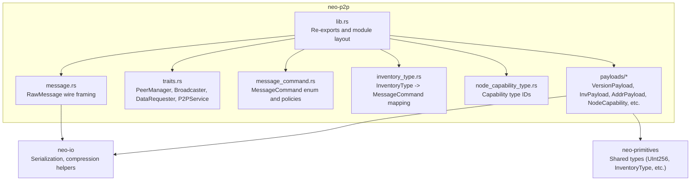
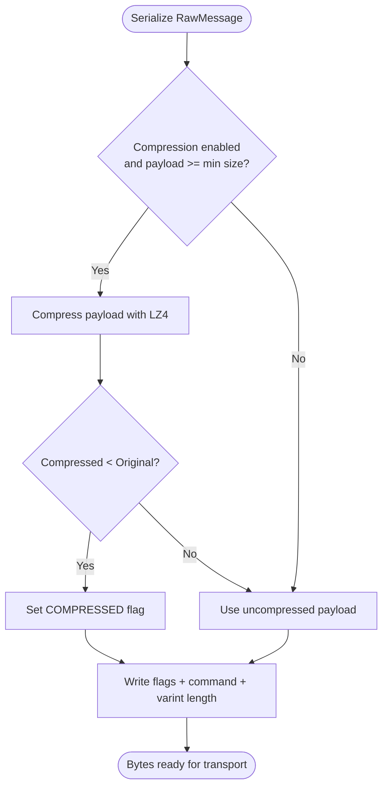
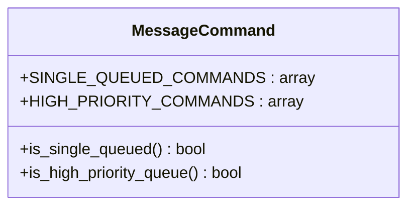
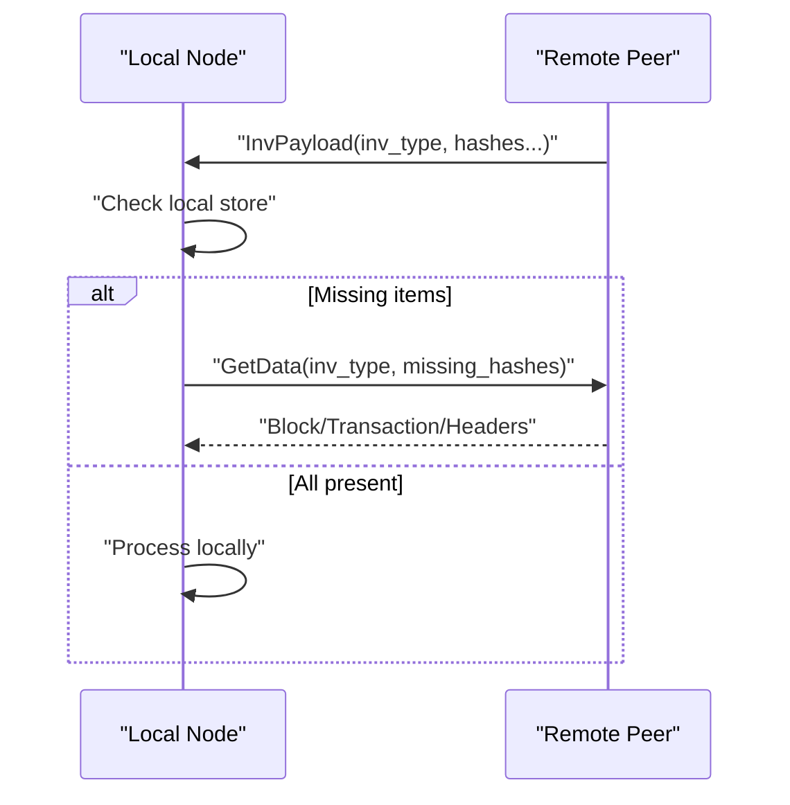
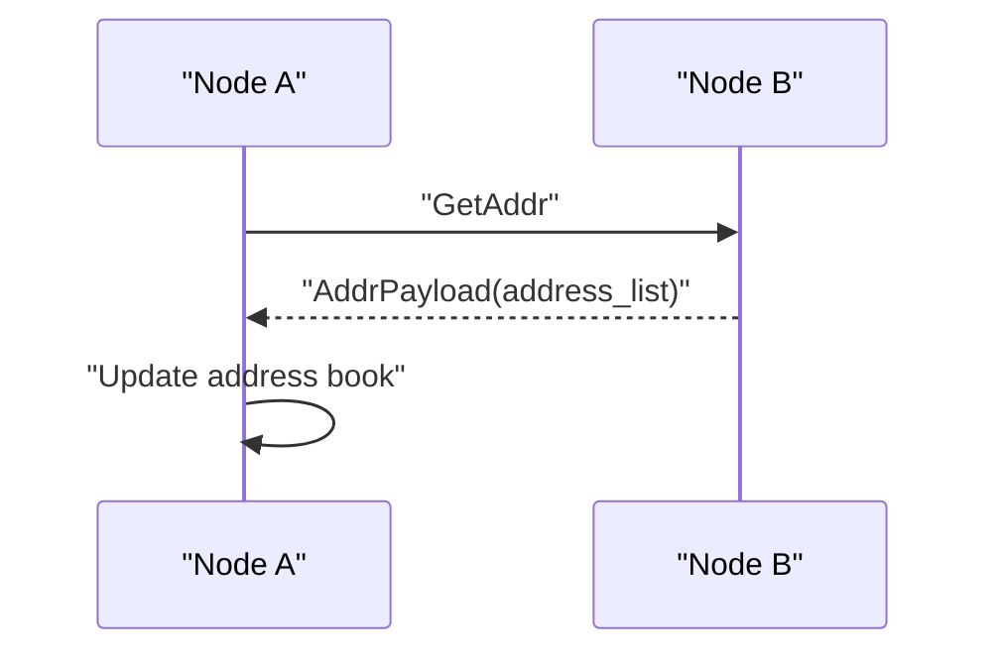
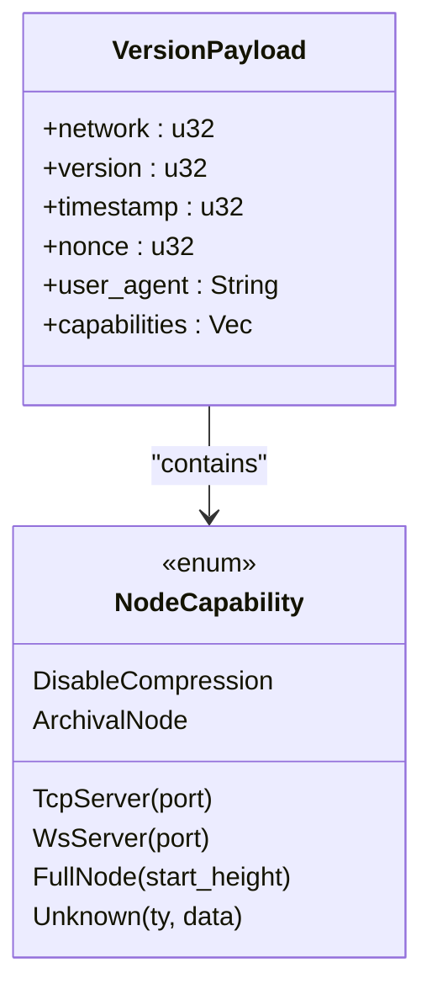
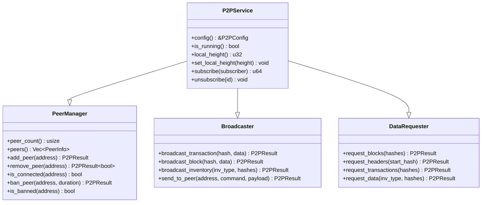
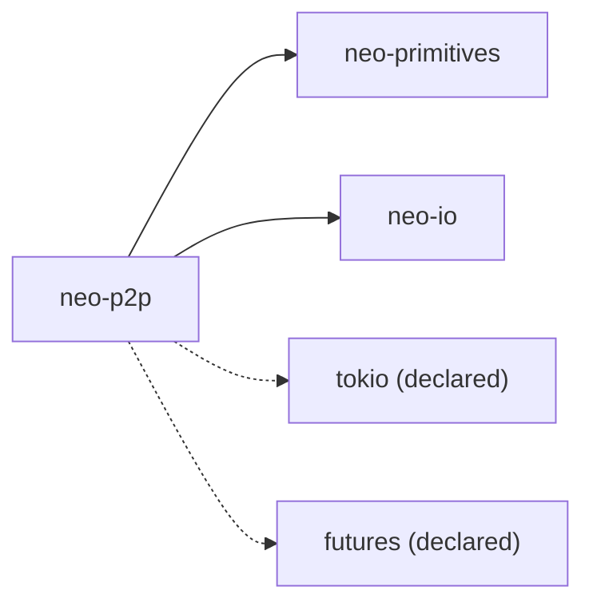

# P2P Networking

<cite>
**Referenced Files in This Document**
- [lib.rs](file://neo-p2p/src/lib.rs)
- [message.rs](file://neo-p2p/src/message.rs)
- [traits.rs](file://neo-p2p/src/traits.rs)
- [message_command.rs](file://neo-p2p/src/message_command.rs)
- [inventory_type.rs](file://neo-p2p/src/inventory_type.rs)
- [node_capability_type.rs](file://neo-p2p/src/node_capability_type.rs)
- [payloads/mod.rs](file://neo-p2p/src/payloads/mod.rs)
- [payloads/version_payload.rs](file://neo-p2p/src/payloads/version_payload.rs)
- [payloads/inv_payload.rs](file://neo-p2p/src/payloads/inv_payload.rs)
- [payloads/node_capability.rs](file://neo-p2p/src/payloads/node_capability.rs)
- [payloads/addr_payload.rs](file://neo-p2p/src/payloads/addr_payload.rs)
</cite>

## Table of Contents
1. Introduction
2. Project Structure
3. Core Components
4. Architecture Overview
5. Detailed Component Analysis
6. Dependency Analysis
7. Performance Considerations
8. Troubleshooting Guide
9. Conclusion

## Introduction
This document explains the peer-to-peer networking layer in Neo-RS as implemented by the neo-p2p crate. It covers the wire protocol framing, message types and payloads, capability negotiation during handshake, inventory propagation, request-response patterns for synchronization, and the traits that define connection management, broadcasting, and data requests. It also provides guidance on configuration, bandwidth considerations via compression, and troubleshooting connectivity issues based on the available code.

## Project Structure
The neo-p2p crate exposes a minimal set of core types and traits for P2P communication, plus payload definitions used across the network stack. The crate is designed to be lightweight and dependency-minimal, with higher-level node logic (connection management, event loops, peer discovery) typically residing in neo-core.



**Diagram sources**
- [lib.rs:169-210](file://neo-p2p/src/lib.rs#L169-L210)
- [message.rs:17-29](file://neo-p2p/src/message.rs#L17-L29)
- [traits.rs:51-213](file://neo-p2p/src/traits.rs#L51-L213)
- [message_command.rs:6-18](file://neo-p2p/src/message_command.rs#L6-L18)
- [inventory_type.rs:1-17](file://neo-p2p/src/inventory_type.rs#L1-L17)
- [node_capability_type.rs:1-6](file://neo-p2p/src/node_capability_type.rs#L1-L6)
- [payloads/mod.rs:6-27](file://neo-p2p/src/payloads/mod.rs#L6-L27)

**Section sources**
- [lib.rs:6-118](file://neo-p2p/src/lib.rs#L6-L118)
- [payloads/mod.rs:6-27](file://neo-p2p/src/payloads/mod.rs#L6-L27)

## Core Components
- RawMessage: Wire-format message container with flags, command, and payload bytes. Supports optional LZ4 compression when enabled and payload size exceeds threshold.
- MessageCommand: Single-byte command identifiers with queueing policies (single-queued and high-priority sets).
- InventoryType: Enumerates block, transaction, consensus, and extensible inventory; maps to appropriate MessageCommand.
- NodeCapability and VersionPayload: Capability negotiation during handshake, including TCP/WS server ports, full node start height, archival flag, and compression policy.
- PeerManager, Broadcaster, DataRequester, P2PService: Traits defining peer lifecycle, broadcast semantics, data requests, and service configuration/events.
- Payloads: VersionPayload, InvPayload, AddrPayload, and others implement Serializable for wire exchange.

Key responsibilities:
- Framing and serialization/deserialization of messages over TCP.
- Defining protocol commands and their processing priorities.
- Exposing interfaces for peers, broadcasting, and data requests.
- Handshake and capability negotiation via VersionPayload and NodeCapability.

**Section sources**
- [message.rs:17-105](file://neo-p2p/src/message.rs#L17-L105)
- [message_command.rs:22-53](file://neo-p2p/src/message_command.rs#L22-L53)
- [inventory_type.rs:1-17](file://neo-p2p/src/inventory_type.rs#L1-L17)
- [payloads/version_payload.rs:20-111](file://neo-p2p/src/payloads/version_payload.rs#L20-L111)
- [payloads/node_capability.rs:12-145](file://neo-p2p/src/payloads/node_capability.rs#L12-L145)
- [traits.rs:17-213](file://neo-p2p/src/traits.rs#L17-L213)

## Architecture Overview
Neo’s P2P protocol uses a custom TCP framing format: flags (1 byte), command (1 byte), length (varint), payload (variable). Messages may be compressed using LZ4 when enabled and payload size meets the threshold. The handshake exchanges VersionPayload to negotiate capabilities such as supported servers, full-node start height, archival status, and compression behavior.

```mermaid
sequenceDiagram
participant A as "Local Node"
participant B as "Remote Peer"
A->>B : "Connect"
A->>B : "Send VersionPayload (network, version, nonce, user_agent, capabilities)"
B-->>A : "Send VersionPayload"
A->>B : "Send Verack"
B-->>A : "Send Verack"
Note over A,B : "Handshake complete; capabilities negotiated"
A->>B : "Optional : GetAddr / Addr"
B-->>A : "AddrPayload (addresses)"
A->>B : "InvPayload (announce hashes)"
B-->>A : "GetData / Block / Transaction / Headers"
```

**Diagram sources**
- [message.rs:107-146](file://neo-p2p/src/lib.rs#L107-L146)
- [payloads/version_payload.rs:20-111](file://neo-p2p/src/payloads/version_payload.rs#L20-L111)
- [payloads/addr_payload.rs:19-59](file://neo-p2p/src/payloads/addr_payload.rs#L19-L59)
- [payloads/inv_payload.rs:8-14](file://neo-p2p/src/payloads/inv_payload.rs#L8-L14)

## Detailed Component Analysis

### Wire Framing and Compression
- RawMessage holds flags, command, and raw payload bytes.
- Serialization writes flags, command, and varint-length payload.
- Optional LZ4 compression is applied when enabled and payload size meets minimum threshold; decompression occurs on receive if flagged.



**Diagram sources**
- [message.rs:51-70](file://neo-p2p/src/message.rs#L51-L70)
- [message.rs:73-104](file://neo-p2p/src/message.rs#L73-L104)

**Section sources**
- [message.rs:11-105](file://neo-p2p/src/message.rs#L11-L105)

### Message Commands and Queue Policies
- MessageCommand enumerates all P2P commands with single-byte values.
- Some commands are single-queued to avoid redundant work (e.g., GetBlocks, Ping).
- High-priority commands include critical control messages (e.g., Extensible, FilterLoad).



**Diagram sources**
- [message_command.rs:22-53](file://neo-p2p/src/message_command.rs#L22-L53)

**Section sources**
- [message_command.rs:6-53](file://neo-p2p/src/message_command.rs#L6-L53)

### Inventory Propagation and Request-Response
- InvPayload carries an inventory type and up to a bounded number of hashes per message.
- Inventory announcements trigger GetData requests for missing items.
- Header prefetch count is defined to optimize fast sync throughput.



**Diagram sources**
- [payloads/inv_payload.rs:8-14](file://neo-p2p/src/payloads/inv_payload.rs#L8-L14)
- [payloads/inv_payload.rs:16-58](file://neo-p2p/src/payloads/inv_payload.rs#L16-L58)

**Section sources**
- [payloads/inv_payload.rs:8-102](file://neo-p2p/src/payloads/inv_payload.rs#L8-L102)

### Peer Discovery and Address Exchange
- AddrPayload responds to GetAddr with a list of NetworkAddressWithTime entries, bounded to a maximum count per message.
- Deserialization enforces non-empty lists and size limits.



**Diagram sources**
- [payloads/addr_payload.rs:19-59](file://neo-p2p/src/payloads/addr_payload.rs#L19-L59)

**Section sources**
- [payloads/addr_payload.rs:19-59](file://neo-p2p/src/payloads/addr_payload.rs#L19-L59)

### Handshake and Capability Negotiation
- VersionPayload includes network magic, protocol version, timestamp, nonce, user agent, and capabilities.
- NodeCapability describes features like TCP/WS server ports, full node start height, archival status, and compression policy.
- Capabilities are serialized as a variable-length array with uniqueness checks for known types.



**Diagram sources**
- [payloads/version_payload.rs:20-111](file://neo-p2p/src/payloads/version_payload.rs#L20-L111)
- [payloads/node_capability.rs:12-145](file://neo-p2p/src/payloads/node_capability.rs#L12-L145)

**Section sources**
- [payloads/version_payload.rs:20-111](file://neo-p2p/src/payloads/version_payload.rs#L20-L111)
- [payloads/node_capability.rs:12-249](file://neo-p2p/src/payloads/node_capability.rs#L12-L249)

### Traits: Connection Management, Broadcasting, Requests, Events
- PeerManager: Add/remove peers, ban/unban, query connected peers.
- Broadcaster: Broadcast transactions/blocks/inventory or send to specific peer.
- DataRequester: Request blocks, headers, transactions by hash or inventory type.
- P2PEvent: Event stream for connections, received data, inventory, consensus/state root messages.
- P2PConfig: Listen address, inbound/outbound limits, seed nodes, timeouts, ping interval, network magic, protocol version, user agent.
- P2PService: Aggregates capabilities, exposes config, running state, local height, subscription management.



**Diagram sources**
- [traits.rs:51-213](file://neo-p2p/src/traits.rs#L51-L213)

**Section sources**
- [traits.rs:17-213](file://neo-p2p/src/traits.rs#L17-L213)

### Message Types and Payload Structures
- Blocks: Sent via Block command; requested via GetData with block inventory.
- Transactions: Sent via Transaction command; requested via GetData with transaction inventory.
- Consensus messages: Carried in Extensible command; inventory type Consensus maps to Extensible.
- Headers: Requested via GetHeaders; returned via Headers command.
- Inventory: Announced via InvPayload; supports batching up to a maximum count.

Note: The exact payload structures for blocks and transactions are handled at higher layers; this crate defines the framing and command routing.

**Section sources**
- [lib.rs:120-146](file://neo-p2p/src/lib.rs#L120-L146)
- [inventory_type.rs:8-17](file://neo-p2p/src/inventory_type.rs#L8-L17)
- [payloads/inv_payload.rs:8-14](file://neo-p2p/src/payloads/inv_payload.rs#L8-L14)

## Dependency Analysis
- neo-p2p depends on neo-primitives for shared types (e.g., UInt256, InventoryType, NodeCapabilityType).
- Serialization and compression rely on neo-io.
- Async runtime support via tokio and futures is declared but not used directly in these files; higher layers orchestrate async I/O.



**Diagram sources**
- [Cargo.toml:16-37](file://neo-p2p/Cargo.toml#L16-L37)

**Section sources**
- [Cargo.toml:1-44](file://neo-p2p/Cargo.toml#L1-L44)

## Performance Considerations
- Compression: LZ4 compression is conditionally applied for large payloads to reduce bandwidth usage. Ensure compression is enabled where beneficial and consider CPU overhead vs. bandwidth savings.
- Batch sizes: InvPayload limits hashes per message to balance throughput and memory usage. Adjust batch sizes carefully for different network conditions.
- Queue policies: Use single-queued and high-priority command sets to prevent congestion and ensure timely processing of control messages.
- Limits: Respect payload max size and capability data size limits to avoid excessive memory consumption.

[No sources needed since this section provides general guidance]

## Troubleshooting Guide
Common issues and diagnostics based on available code:
- Unknown command errors: Occur when receiving unrecognized MessageCommand bytes; check protocol compatibility and version alignment between peers.
- Invalid data errors: May arise from malformed payloads (e.g., empty address lists, too many addresses, unknown capability data exceeding limits). Validate inputs and peer implementations.
- Handshake failures: Verify network magic, protocol version, and capability compatibility. Ensure timeouts are configured appropriately.
- Bandwidth issues: If compression is disabled or payloads are small, compression may not help; verify thresholds and enablement.
- Peer bans: Use PeerManager to ban misbehaving peers temporarily; monitor peer counts and latency metrics.

Operational tips:
- Configure P2PConfig listen_address, max_inbound/max_outbound, seed_nodes, connect_timeout, handshake_timeout, ping_interval, network_magic, protocol_version, and user_agent to match your environment.
- Subscribe to P2PEvent to observe peer connect/disconnect and incoming data for debugging.

**Section sources**
- [message.rs:73-104](file://neo-p2p/src/message.rs#L73-L104)
- [payloads/addr_payload.rs:51-59](file://neo-p2p/src/payloads/addr_payload.rs#L51-L59)
- [payloads/node_capability.rs:133-145](file://neo-p2p/src/payloads/node_capability.rs#L133-L145)
- [traits.rs:152-192](file://neo-p2p/src/traits.rs#L152-L192)

## Conclusion
The neo-p2p crate defines the foundational P2P protocol types, wire framing, and trait abstractions necessary for Neo’s peer-to-peer networking. It provides robust message handling, capability negotiation, inventory propagation, and clear interfaces for connection management and data requests. Higher-level components implement the actual connection pooling, peer discovery, and synchronization logic using these primitives. Proper configuration and adherence to protocol limits ensure efficient and secure operation across diverse network environments.